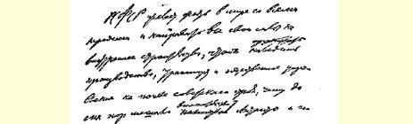
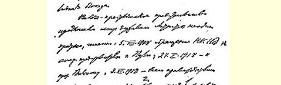
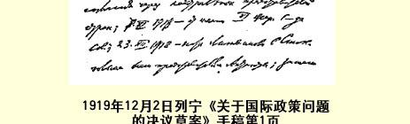

# 俄共（布）第八次全国代表会议文献

１２８

> （１９１９年１２月）

## １ 代表会议开幕词

> （１２月２日）

同志们！请允许我代表俄国共产党（布尔什维克）中央委员会宣布我党全国代表会议开幕。

同志们！按照党章规定，这样的代表会议应当每三个月召开一次。但是几个月以前战争形势所引起的严重情况使得我们非常紧张，使得我们大大压缩了苏维埃的机关和党的机关。因此，遗憾得很，我们没有准确地履行党章规定，延期召开了代表会议。

同志们！我们这次代表会议是在苏维埃代表大会１２９即将举行的时候召开的。目前的形势是：我们前线情况已经有了很大的好转，我们深信，我们已经处在国际形势、战争形势以及整个国内建设即将显著好转的前夜。我们面前究竟有些什么任务，这一点在党的会议和报刊上已经不止一次地谈过，我们在讨论议程上某些具体项目时还会谈到。因此，我想还是转入正题，请你们选举会议主席团。

在这个问题上有什么建议，请大家提出来。

> 载于１９１９年１２月３日《全俄中央译自《列宁全集》俄文第５版执行委员会消息报》第２７１号第３９卷第３４１页

## ２ 中央委员会的政治报告

> （１２月２日）

（鼓掌）同志们！中央委员会的报告从形式上来说此时此刻主要应当是向你们总结过去这段时期所经历的事情。但我应该指出， 光讲过去的事，哪怕是报告着重讲过去的事，这样做都太不符合我们今天的时代精神和我们所面临的任务。因此，在这个也要向苏维埃代表大会提出的报告中，我不着重叙述我们经历过的事情，而是着重指出为了指导目前直接的实际活动我们正在取得而且必须取得的经验。

可以毫不夸大地说，我们在过去这段时期取得了巨大的成就， 我们最主要的困难已经过去了，但是在我们面前无疑还会有很大很大的困难。党的注意力自然应当集中在解决这些任务上，过去的事深谈到什么程度，我认为只能根据对解决我们当前任务是否绝对必需来决定。

当然，在苏维埃政权所经历过的时期中，最主要的问题，即当时我们最关心的问题，无疑是军事问题。国内战争显然压倒了一切。不用说，在这场争取生存的斗争中，我们必须从其他一切工作部门中把党的优秀力量抽调出来，派去担任军事工作。在战争情况下，不这样做是不行的。我们苏维埃和党的许多工作部门的创造性工作虽然因此而受到损失，但我们在军事方面确实集中了很大力量，取得了很大的成就。这些成就的取得，不要说我们的敌人和动摇分子，就是我们自己队伍中的大多数人，过去大概也都认为是不可能的。我们的一切敌人先后得到过德帝国主义和更强大的独霸世界的协约国帝国主义直接和间接的帮助，在这种情况下，我们要在一个遭到如此严重破坏和如此落后的国家里支持两年，是一个非常艰巨的任务，这个任务得以完成无疑是一个“奇迹”。因此，我觉得我们必须仔细考察这一“奇迹”是怎样实现的，以及由此应得出什么样的实际结论；有了这些结论，我们就可以断定（我觉得我们确实可以断定）：不管在国内建设方面有多大困难，我们一定能在最近的将来，象过去顺利地解决军事防御问题那样，顺利地克服这些困难。

造成我国国内战争并使它拖延下去的真正祸首—— 世界帝国主义，在这两年内已经遭到了失败。现在我们首先应该提出这样一个问题：我们同这样一个毫无疑义直到现在还比我们强大得多的世界帝国主义作斗争，怎么会取得如此巨大的胜利？要回答这个问题，必须大致地回顾一下俄国国内战争的历史，协约国武装干涉的历史。我们首先应当肯定，在这场战争中，按协约国的行动方式可以分为两个根本不同的时期，或者说，协约国对俄国有两种基本的作战方式。

第一，协约国战胜德国以后，自然想依靠自己的军队来扼杀俄罗斯苏维埃共和国。只要协约国真能把战败德国以后腾出来的庞大军队抽出一小部分，哪怕只是十分之一，用来进犯俄罗斯苏维埃共和国，我们显然会招架不住。俄国国内战争第一个时期的特征， 是协约国想用自己的军队摧毁苏维埃共和国的企图遭到了失败。 协约国只好撤退在阿尔汉格尔斯克前线作战的英国军队。法国军队在俄国南方的登陆以法国水兵的不断起义而告结束。现在，尽管战时书报检查机关检查得很厉害（虽然现在没有战争，但以前是战时的、现在是非战时的书报检查机关在英法这些所谓的自由国家里继续存在），尽管我们得到的报纸很少，我们还是有来自英法的十分确凿的材料，知道法国报刊已经登出了黑海法国军舰水兵起义的消息，几个法国水兵被判服苦役的消息已经传遍了法国，法国和英国所有的共产主义报刊，所有的革命工人报刊都在引用这样一些事实，因进行布尔什维主义宣传而在敖德萨被法国人枪决的让娜·拉布勃同志的名字，已不仅成了法国共产主义派的社会主义工人报刊的口号，甚至《人道报》这样的报纸，在基本原则方面实质上最接近我国孟什维克和社会革命党人观点的报纸，也把拉布勃的名字作为反对法帝国主义、反对干涉俄国事务的斗争口号了。 同样，在英国工人的报刊上，也讨论过到过阿尔汉格尔斯克前线英国士兵的来信。关于这一点我们有十分确凿的材料。因此我们知道，在这些国家里确实发生了我们以前经常讲到并殷切地期待过的大变动，这种变动虽然来得极慢但是在最近无疑变成了事实。

这种变动是形势发展的必然结果。正是那些一直被认为是最民主、最文明和最有文化的国家，对俄国进行了最野蛮的和完全非法的战争。有人责备布尔什维克破坏民主制度，—— 这不过是孟什维克、社会革命党人以及欧洲所有的资产阶级报刊攻击我们时惯用的借口。但是这些民主国家中一个也不敢根据本国的法律向苏维埃俄国宣战，而且决不敢这样做。与此同时，工人的报刊正在提出抗议，表面看来不很明显，实际上却十分激烈，它们责问说：在我们法国、英国和美国的宪法中，有哪一条许可你们不宣而战，许可你们不征求议会意见就开战？英国、法国和美国的报刊主张把本国的首脑交付法庭审判，惩办他们不经议会同意就开战的违犯国法的罪行。这样的主张已经提出来了。诚然，这是在一些小报上提出的，这些小报每周至多出版一次，每月大概至少要被没收一次，发行量不过几百份几千份。执政党的领袖们可以不把它们放在心上。 但是，在这里必须看到两种基本的倾向：全世界的统治阶级每天出版几百万份有名的资本主义报纸，满篇都是对布尔什维克的闻所未闻的诬蔑和诽谤。但下层工人群众却从到过俄国的士兵那里得知这整个宣传运动完全是虚伪的。这样，协约国就不得不把自己的军队从俄国撤走。

最初我们谈到要指靠世界革命的时候，有人讥笑我们，一再说这是空想，而且到现在还这么说。但是，我们在两年内已经得到了确切的证明材料。我们知道，所谓指靠世界革命，如果是说指望欧洲马上爆发直接起义，那么这种事情确实没有发生。但是，我们的这种指望确有十分可靠的根据，我们指望的力量一开始就破坏了协约国武装干涉的基础（这发生在两年以后，特别是在高尔察克遭到失败、英国军队从阿尔汉格尔斯克和整个北方战线撤退以后）， 这是无可争辩的历史事实。当时协约国只要动用他们很少的兵力就足以扼杀我们。但我们战胜了敌人，因为在最困难的时刻，全世界工人的同情起了作用。这样，我们就胜利地度过了协约国向我们进犯的第一个时期。我记得好象拉狄克的一篇文章说过，协约国军队一接触到炽热的、点着了社会主义革命烈火的俄国土地，自己也会燃烧起来。事实证明正是这样。英法的陆海军士兵在听到因进行布尔什维主义的宣传而被枪决的人的名字后所掀起的事件尽管微不足道，那里的共产党组织尽管十分弱小，但他们还是做了一件了不起的工作。结果很明显：他们迫使协约国撤回了军队。正是这一点使我们取得了第一个巨大的胜利。

协约国的第二种手段，第二种斗争方式，是利用小国来打我们。今年８月底，瑞典一家报纸１３０报道说，英国陆军大臣邱吉尔声称，将有１４个国家要进攻俄国，因而不要很久，至迟到年底，拿下彼得格勒和莫斯科是有把握的。邱吉尔后来似乎否认说过这个话， 说这是布尔什维克的捏造。但是我们有确切材料，知道哪一家瑞典报纸登载过这一消息。因此我们断定，这个消息来源于欧洲。而且这个消息已经为许多事实所证实。以芬兰和爱斯兰为例，我们已绝对准确无误地查明，协约国曾倾其全力迫使它们进攻苏维堆俄国。 当尤登尼奇的军队离彼得格勒只有几俄里，该城已经万分危急的时候，我自己就读过英国《泰晤士报》关于芬兰问题的一篇社论１３１。 这篇文章简直是气急败坏，它所表现的冲动对这家报纸说来是前所未有的，异乎寻常的（平常这类报纸象我国米留可夫的《言语报》１３２一样，总是使用外交辞令）。这是一篇向芬兰发出的最激烈的檄文，它开门见山地说：世界的命运取决于芬兰，一切文明的资本主义国家都望着芬兰。我们知道，尤登尼奇的军队离彼得格勒只有几俄里的时候，那是一个决定性的时刻。不管邱吉尔是否说过前面的话，但这样的政策他是执行了的。大家知道，协约国帝国主义对这些仓促建立的、软弱无力的、甚至在粮食问题这类最迫切的问题上以及其他一切方面都完全依赖协约国的小国家施加了怎样的压力。这些小国是摆脱不了这种依赖关系的。协约国在财政、粮食、 军事等各个方面都施加压力，强迫爱斯兰、芬兰，无疑还有拉脱维亚、立陶宛和波兰这一系列国家向我们进攻。尤登尼奇最近一次向彼得格勒的进犯，已彻底表明协约国第二种作战方法的破产。毫无疑问，当时只要芬兰给一点点援助，或者爱斯兰稍多给一点援助， 就足以决定彼得格勒的命运。毫无疑问，协约国当时认识到了这是一个紧要的关头，曾经尽一切努力来争取这种援助，但它还是遭到了失败。

这就是我们取得的第二个具有国际意义的巨大胜利，这个胜利比第一个胜利更来之不易。我们所以取得第一个胜利，是因为法英军队确实无法留在俄国领土上了，他们不但不肯作战，反而给英国和法国带去了一批鼓动英法工人反对本国政府的骚乱分子。为了反对布尔什维主义，协约国一直在处心积虑地扶植一批小国来包围俄国，结果这一武器却反过来对着自己了。所有这些国家的政府都是资产阶级政府，每个资产阶级政府几乎都有一些资产阶级妥协分子，这些人由于自己的阶级地位而反对布尔什维克。这些国家无疑都是极端敌视布尔什维克的，但是，我们竟然把这些资产者和妥协分子争取过来了。这似乎是不可思议的，但这是事实，因为这些国家经历了这场帝国主义大战以后，都不能不考虑一个问题： 现在反对布尔什维克对它们是否有利，因为要找一个觊觎俄国政权同时又堪称盟友的人，那只有代表昔日帝国主义俄国的高尔察克或邓尼金；而高尔察克或邓尼金是旧俄国的代表，这是毫无疑问的。这样，我们就有可能利用帝国主义阵营中的另一条裂缝。我们在革命后的头几个月能够支持下来，是由于德帝国主义和英帝国主义在拼死搏斗，我们在这半年后又支持了半年多，是由于协约国的军队事实上已没有能力同我们作战，而在这以后的一年，主要是在我的报告所涉及的这一年，我们又胜利地支持下来，原因就在于：绝对控制着各小国的那些大国想动员这些小国来进攻我们的企图，因国际帝国主义同这些小国利益矛盾而遭到了失败。这些小国都尝过协约国魔爪的滋味。它们懂得，法、美、英各国资本家所谓 “我们保证你们的独立”，实际就是“我们要买下你们的全部资源， 要盘剥你们。不仅如此，我们还要侮辱你们，要象一个跑到别人国家里主宰一切，做投机买卖，把谁都不放在眼里的军官那样蛮横地欺侮你们”。它们懂得，驻在这种国家里的英国大使常常比那里的任何一个皇帝或议会更了不起。小资产阶级民主派先前还不能领会这些道理，现在现实生活已使他们领会了这一点。事实表明，对于那些受帝国主义者掠夺的小国的资产阶级分子和小资产阶级分子说来，我们即使算不上他们的盟友，至少也算得上比帝国主义者好一些、可靠一些的邻居。

这就是我们对国际帝国主义取得的第二个胜利。

正因为这样，我们现在完全可以说，我们的主要困难已经过去了。毫无疑问，协约国还会不断采取军事行动来干涉我国事务。最近对高尔察克和邓尼金的胜利，使这些大国的代表现在也只好说进攻俄国是无望之举，并且不得不建议媾和了。我们必须认识清楚，这种言行具有多么重要的意义。这里请大家不要做记录……

既然我们使资产阶级知识界的代表，使我们残酷的敌人承认了这一点，我们在这里就完全可以说，苏维埃政权不仅得到了工人阶级的同情，而且得到了广大的资产阶级知识界的同情。小市民、 小资产阶级这些在劳动与资本的激战中摇摆不定的人们，已经坚决地站到我们这边来了，我们现在已经多少可以指望他们的支持了。

我们应该估计到这一胜利，如果我们再考虑到我们究竟是怎样战胜高尔察克的，那么结论就会更加令人信服……以下可以开始记录，因为有关外交上的事情已经讲完了。

如果我们问一下，是哪些力量决定了我们对高尔察克的胜利。 那么，我们必须承认，尽管高尔察克活动的地区无产阶级最少而我们在那里又没有能象在俄罗斯那样直接给农民实际帮助来推翻地主政权，尽管高尔察克是从孟什维克和社会革命党人所支持的阵线起家的（立宪会议阵线就是他们建立的），尽管那里有最优越的条件来建立一个依靠世界帝国主义帮助的政权，—— 尽管如此，高尔察克的这个试验还是彻底失败了。由此我们可以得出一个对我们极其重要的、应当作为我们全部活动的指南的结论：**在历史上**， **取得胜利的是能够带领多数居民前进的阶级**。孟什维克和社会革命党人至今还在谈论立宪会议和民族意志等等，我们在这一时期却已经根据自己的经验确信，在革命时期，阶级斗争是以最恐怖的方式进行的，只有在进行这一斗争的阶级能够带领大多数居民前进的时候，这一斗争才会取得胜利。在这方面，不是根据投票表决而是根据一年多极其艰苦的流血斗争经验（这种斗争所需要的牺牲比任何政治斗争要大上百倍）才作出比较，而同高尔察克作战的这个经验，表明我们比任何其他政党都更好地在实现阶级的统治， 因为我们善于带领这个阶级的大多数，能够把农民争取过来，使他们成为我们的朋友和同盟者。高尔察克的例子已经证明了这一点。 这个例子从社会方面来说是对我们的一次最新的教育。它表明了我们可以指靠谁以及谁在反对我们。

不管帝国主义战争和经济破坏怎样削弱了工人阶级，工人阶级还是在实现政治统治，但是，工人阶级如果不把大多数劳动居民争取过来，在俄国的条件下也就是把农民争取过来，使他们成为自己的朋友和同盟者，那它就不能实现这种统治。这一点在红军中已经实现了，我们在红军中利用了大多数对我们有反感的专家，建立了一支人民的而不是雇佣的军队，连我们的敌人社会革命党人在他们党最近召开的一次党务会议的决议中也承认了这一点１３３。工人阶级能够建立起一支大多数成员都不属于本阶级的军队，能够利用对工人阶级有反感的专家，完全是因为它能够带领同小经济和私有制相联系因而一心向往着自由贸易，也就是向往着资本主义、向往着恢复货币权力的多数劳动者，并使他们成为自己的朋友和同盟者。这就是我们两年来取得成就的根本原因。在我们今后的一切工作中，在我们今后的一切活动中，在即将解放的乌克兰必须着手进行的工作中，以及在战胜邓尼金以后马上就要展开的艰巨而重要的建设任务中，我们必须首先牢牢记住这一基本教训，必须首先想着这一基本教训。我认为，我们工作的政治总结主要应该归结为这一点，概括为这一点。

同志们！我已经说过，战争是政治的继续。我们从本国的战争中已经体会到了这一点。帝国主义战争是帝国主义者，统治阶级， 地主和资本家的政治的继续，它遭到了人民群众的反对，是使人民群众革命化的最好手段。帝国主义战争使我们俄国轻而易举地推翻了君主制，推翻了地主土地占有制和资产阶级，所以如此轻而易举，完全是因为帝国主义战争是帝国主义政治的继续，是帝国主义政治更激烈更露骨的表现。我们的战争则是我们共产主义政治的继续，无产阶级政治的继续。直到现在，我们还可以从孟什维克和社会革命党人那里看到，从非党人士和动摇分子那里听到这样的说法：“你们许诺和平，但给我们的却是战争，你们欺骗了劳动群众。”我们说，虽然劳动群众没有学过马克思主义，但他们是被压迫者，他们亲身体会到什么是地主和资本家已经有几十年了，他们的阶级本能使他们清楚地辨明帝国主义战争和国内战争的区别。对于一切亲身受过几十年压迫的人来说，这两种战争之间的区别是很明显的。帝国主义战争是帝国主义政治的继续。它促使群众起来反对自己的统治者。反对地主和资本家的国内战争，是推翻这些地主和资本家的政治的继续，这种战争愈向前发展，就愈能加强劳动群众同领导这一战争的无产阶级的联系。尽管受过种种苦难，尽管常常遭到巨大失败，尽管这些失败异常惨重，尽管敌人经常取得巨大胜利，苏维埃政权经常处在千钧一发的关头—— 这种时候是有过的，而且协约国无疑还会来进攻我们—— 但是我们应当说，我们取得的经验是一个非常重要的经验。这个经验说明，战争提高了劳动群众的认识，向他们表明了苏维埃政权的优越性。天真的人或者满脑子旧市侩偏见和旧资产阶级民主议会制偏见的人，总在等待农民用投票方式来决定是跟布尔什维克共产党人走还是跟社会革命党人走；别的决定取舍的方式他们是不愿意承认的，因为他们是民权制度、自由、立宪会议等等的拥护者。但现实生活作出的安排，却是让农民用事实来检验这个问题。农民使社会革命党人在立宪会议中取得了多数以后，社会革命党人的政策破产以后，农民同布尔什维克有了实际的接触，农民相信这是一个坚强的政权，这个政权提出很多要求而且善于坚决实现这些要求，这个政权认为把粮食贷给挨饿的人是农民无可旁贷的责任（虽然贷粮得不到等价物），而且它要坚决把这些粮食交给挨饿的人。农民看到了这一点， 把我们的政权同高尔察克政权和邓尼金的政权作了比较，体会到两种政权不同，用通过实践来解决问题的方式而不是用投票的方式作了选择。农民现在和今后对这个问题的解决都会有利于我们。

这就是高尔察克失败的经过向我们证明的东西。这就是目前我们在南方的胜利向我们证明的东西。正因为如此，我们说，生活在农村里的千百万群众即千百万农民的确在彻底站到我们这方面来。我认为这就是我们在这一时期所取得的主要政治教训。我们也必须运用这个经验来解决国内建设任务。现在，在我们完全战胜邓尼金以后，国内建设任务就要提到日程上来，因为我们已经有可能来专心致志从事国内建设了。

到现在为止，欧洲小资产阶级责备我们最厉害的一点，是说我们实行恐怖主义，说我们粗暴地镇压知识分子和小市民。我们要回答说：“这都是你们、你们的政府逼着我们做的。”人们叫喊我们实行恐怖，我们回答说：“拥有全世界的海军和比我们大一百倍的军事力量的列强攻打我们，并迫使所有的小国同我们作战，这不算是恐怖吗？”所有的强国勾结起来反对一个最落后的被战争削弱了的国家，这才是真正的恐怖。甚至德国也一直在帮助协约国，在它被打败以前就豢养着克拉斯诺夫，直到最近，还是这个德国在封锁我们，在直接援助我们的敌人。世界帝国主义这样侵犯我们，对我们实行军事进攻，在我们国内收买阴谋分子，难道这不是恐怖吗？我们实行恐怖是因为有非常强大的兵力进攻我们，我们必须作惊人的努力才能应付。当时在国内必须采取十分坚决的行动，集中一切的力量。在这方面，我们不愿意也决不会落到象在西伯利亚同高尔察克合作的妥协派所落到的那种境地，象德国的妥协派明天会落到的那种境地。德国妥协派自以为代表着政府并有立宪会议作依靠，其实只要一百个或一千个军官就随时可以把这样的政府轰下台。这是可以理解的，因为这些军官训练有素，很有组织，通晓军事，跟各方面都有联系，熟悉资产阶级和地主的一切情况，并得到他们的赞助。

帝国主义大战以后各国的历史表明了这一点。现在我们既然面临协约国实行恐怖，我们也就有权利实行这种恐怖。

由此可见，对恐怖主义的责难如果是公正的，那就落不到我们头上，而应落到资产阶级头上。是资产阶级迫使我们采取了恐怖手段。我们一消灭恐怖主义的主要根源，即击败世界帝国主义的侵犯，粉碎世界帝国主义的军事阴谋和对我们国家的武力压迫，我们就会率先采取措施，把恐怖手段限制在最小最小的范围以内。

这里，在谈到恐怖主义的时候，还必须谈一谈对中间阶层的态度，对知识分子的态度。他们抱怨最多的是苏维埃政权的粗暴，苏维埃政权使他们的处境今不如昔。

尽管我们财力有限，凡是能够替知识分子做到的事情，我们都在替他们做。当然，我们知道纸卢布很不值钱，但我们也知道私人投机买卖意味着什么，知道投机买卖对那些靠我们粮食机关援助仍然不能维持生活的人还有某些帮助。在这方面我们是给资产阶级知识分子优待的。我们知道，在世界帝国主义进攻我们的时候， 我们必须执行极严格的军事纪律，必须用我们的全部力量进行反击。当然，我们进行革命战争不能象资产阶级强国那样，把战争的全部重担加在劳动群众身上。不，国内战争的重担应当分一部分而且今后还要分一部分到整个知识界、整个小资产阶级和所有中间分子的身上，他们都要分挑这副担子。当然，对他们来说，挑这样的担子会非常困难，因为几十年来他们一直是享有特权的人，但是， 为了社会革命的利益，我们必须叫他们也分挑这副担子。我们就是这样主张和这样行动的，我们也只能够这样。

国内战争结束以后，这批人的生活状况会有所改善。现在，我们用我们的工资政策证明，而且在我们的党纲中也已经说了：我们认为必须使这批人有较好的生活条件，因为不利用资产阶级专家就不可能从资本主义过渡到共产主义；我们的一切胜利，无产阶级 —— 这个阶级把半劳动者半私有者的农民争取到了自己一边—— 所领导的红军的一切胜利，部分也是由于我们善于利用资产阶级专家而取得的。我们在军事方面的这一政策，应当成为我们在国内建设方面的政策。

我们在这一时期取得的经验告诉我们，以前我们往往一边在奠立大厦的基础，一边又在做圆屋顶和各种装饰。也许，这在某种程度上是社会主义共和国所必需的。也许我们在人民生活的各个方面都应当进行建设。这种在各个方面都想进行建设的热望是很自然的。如果看一看我们国家建设的情况，我们常常会看到很多动手后又停下来的工程，看到这些工程我们就会说：这些工程也许应当缓一缓，应当先搞主要的。所有工作人员自然都很想去从事那些只有打好基础才能执行的任务，这是完全可以理解的。但是根据这一经验我们现在可以说，我们今后一定要更多地把自己的力量用在主要方面，用在奠定基础上，用在最难解决但我们还能解决的最普通的任务上。这就是粮食方面的任务、燃料方面的任务和消灭虱子的任务。这是三项最普通的任务，这些任务的完成，将使我们有可能建成社会主义共和国，那时我们就能战胜整个世界，取得比我们打退协约国更伟大百倍、更辉煌百倍的胜利。

粮食问题。我们实行余粮收集制，已经收到很大的效果。我们的粮食政策使我们在第二年收集的粮食比第一年多两倍。在最近这次征收运动的三个月里，我们比上一年度的三个月收购了更多的粮食，不过，你们从粮食人民委员部的报告里可以听到，这无疑是克服了极大的困难才做到的。单是占领了农业中心地带南部的马蒙托夫的袭击，就使我们受了很大损失。但是，我们学会了采用余粮收集制，也就是说，学会了使农民按照固定价格在得不到等价物的情况下把粮食交给国家。当然，我们很清楚，纸币不是粮食的等价物。我们知道，农民是用借贷的方式把粮食交给国家的。我们对他们说：你们难道应该囤积粮食等待换取等价物而让工人饿死吗？你们难道愿意在自由市场上进行买卖、要我们退到资本主义去吗？许多读过马克思著作的知识分子不明白贸易自由就是恢复资本主义，但农民却很容易了解这一点。农民们都明白：挨饿的人为了不致饿死，愿意付出很高的价钱，愿意拿出他所有的一切，在这种情形下按照自由价格出卖粮食，就是恢复剥削，就是使富人有发财的自由而让穷人倾家荡产。所以我们说，这是对国家犯罪，我们要进行斗争，丝毫不能让步。

在这场实行余粮收集制的斗争中，农民应该把粮食贷给挨饿的工人，这是开始正常的建设和恢复工业等等的唯一方法。如果农民不这样做，那就是恢复资本主义。如果农民感觉到自己与工人之间的联系，他们就会按固定价格把余粮交出来，就是说，把余粮换成不过是一些花花绿绿的票子。这样做是非常必要的，否则就不能把挨饿的工人从死亡中救出来，就不能恢复工业。这一任务是极端困难的。光靠暴力不能解决这一任务。不管人们怎样叫喊布尔什维克是对农民施用暴力的党，我们都要说：先生们，这是谎话！如果我们是对农民施用暴力的党，那我们怎么能在反高尔察克的斗争中支持下来呢？怎么能实行普遍义务兵役制、建立起一支农民占总人数十分之八的军队呢？要知道，在这支军队里，每个人都有武器， 他们从帝国主义战争的例子中看到，枪口是很容易掉转的。我们是实现着工农联盟的党，我们的党对农民说：实行自由贸易就是恢复资本主义，强征余粮的办法是我们用来对付投机者而不是用来对付劳动者的，—— 这样的党怎么会是对农民施用暴力的党呢？

余粮收集制应当是我们工作的基础。粮食问题是一切问题的基础。我们应当拿出很大的力量去同邓尼金作斗争。在没有获得彻底胜利以前，随时都可能发生变故，不能有丝毫的犹豫和疏忽。 但是，军事情况稍有好转，我们就应当尽可能把更多的力量放到粮食工作上去，因为这是一切工作的基础。余粮收集制一定要贯彻到底。只有在我们解决了这一任务、有了社会主义的基础以后，我们才能在这个社会主义的基础上建立起富丽堂皇的社会主义大厦来。这座大厦我们过去不止一次地从屋顶开始建造，因而每次都倒塌了。

另外一个根本问题就是我们建设的主要基础—— 燃料的问题。我们目前所遇到的就是这个问题。目前我们无法利用我们在粮食方面取得的成果，因为我们不能运出粮食。我们无法充分利用我们的胜利，因为没有燃料。我们还没有一个真正的机构来解决燃料问题，但解决这个问题的可能性是存在的。

整个欧洲现时都在闹煤荒。在最富有的战胜国里，甚至在美国这一类既没有受到进攻也没有遭到侵略的国家里，现在也非常尖锐地提出了燃料问题，我们当然也有这个问题。我们在最好的情况下也要有几年的时间才能恢复煤炭工业。

必须利用木柴来补救。为此，我们正把一批又一批的党的力量投入这一工作。最近一个星期，人民委员会和国防委员会都把主要注意力放在这个问题上，并且采取了一系列的措施，以便使这方面的情况得到我们在南线军队中得到的那种好转。必须指出，不能削弱我们在这方面的工作，我们的每一个步骤都应当是战胜燃料恐慌的步骤。我们有物质资源。在我们没有很好地恢复煤炭工业以前，我们可以用木柴保证工业的燃料。同志们，我们必须集中全党的力量来解决这一基本任务。

我们的第三个任务就是消灭传染斑疹伤寒的虱子。斑疹伤寒在饥饿的、患病的、没有粮食、肥皂和燃料的居民中流行着，很可能变成一种使我们根本不能进行社会主义建设的灾难。

这是我们争取文明的第一个步骤，这是争取生存的斗争。

这就是三个基本任务。我首先希望党员同志们注意这些任务。 直到目前，我们对这些基本任务还注意得非常不够。军事工作是一秒钟也不能削弱的，除此以外，必须把十分之九的力量用在这些头等重要的任务上。现在我们非常明白这些问题的尖锐性。每个人都应当尽一切努力来做这些工作。我们应当把全部力量放在这些方面。

报告的政治部分就谈到这里。国际形势部分，契切林同志会详细地说明，他还将宣读我们想用苏维埃代表大会名义向各交战国提出的建议。

现在我非常简短地谈一下党的任务。我们党在革命进程中已经面临一项极重大的任务。一方面，坏分子在攀附我们的党，这是很自然的，因为这是一个执政的党。另一方面，工人阶级已经疲惫不堪，它的力量自然因国家遭受破坏而被削弱。但是只有工人阶级的先进部分，只有工人阶级的先锋队，才能领导自己的国家。为了实现这项全国范围的建设任务，我们实行了星期六义务劳动，作为建设的一种方法。我们提出的口号是：让最先应征上前线的人加入我们的党；不能作战的人要入党，则应在原岗位上证明他懂得什么是工人政党，应表明他是在实践共产主义的原则。所谓共产主义， 严格说来就是无报酬地为社会工作，不考虑个人的差别，丝毫没有世俗偏见，没有守旧心理，没有旧的习气，消除各个工作部门的差别，劳动报酬上的差别等等。这是我们能够使工人阶级和劳动人民不仅投入军事斗争而且投入和平建设的最大保证之一。共产主义星期六义务劳动的进一步发展必然会成为一所学校。我们应当在贯彻每一个措施的过程中把工人和其他阶级中最可靠的人吸收到党内来。我们通过重新登记来做到这一点。我们并不害怕把不十分可靠的人开除出去。我们能够做到这一点，还因为我们信任在困难时刻加入到我们党里来的党员。正如中央委员会今天的报告所指出的，成千上万的党员是在尤登尼奇离彼得格勒只有几俄里、邓尼金已到了奥廖尔北面、整个资产阶级已经欣喜若狂的时候加入到我们党里来的，他们是值得我们信任的。我们珍视党的这种扩大。

在党这样扩大以后，我们应当关一下门，应当特别小心。我们应当说：在目前党取得胜利的时候，我们不需要新党员。我们非常清楚，在日益瓦解的资本主义社会中，一定会有许多有害的分子混到党里来。我们必须建立一个工人的政党，一个不让混入的分子有立足之地的政党，但是，我们必须吸收党外群众来参加工作。怎样做到这一点呢？办法就是举行非党工农代表会议。不久以前，《真理报》登载了一篇关于非党代表会议的文章。拉斯托普钦同志的这篇文章值得特别注意１３４。我不知道还有什么其他办法能够解决这一具有深刻历史意义的重大任务。党不能敞开大门，因为在资本主义瓦解时期，党把坏分子吸收进来是绝对难免的。对于非工人阶级出身的分子，党的大门只容其中能够经受极严格考验的人进来。

但是，在一个拥有亿万人口的国家里，我们只有几十万党员。 这样的政党怎么能管理国家呢？首先，包括几百万人的工会是它的助手，而且应当是它的助手；其次，非党代表会议也是它的助手。在这些非党代表会议上，我们必须善于正确地对待非无产阶级群众， 必须克服偏见和小资产阶级的动摇，这是最根本和最重要的任务之一。

在估计我们党组织的成绩时，不仅要看这项或那项工作中有多少党员在干，不仅要看重新登记的工作进行得是否顺利，而且还要看非党工农代表会议开得是否按期，是否经常，就是说，要看我们是否善于正确地对待目前还不能入党但应当吸收来参加工作的群众。

我们所以能够战胜协约国，也许是因为我们取得了工人阶级的同情，取得了非党群众的同情。我们终于战胜了高尔察克，也许正是因为高尔察克失去了从劳动群众这一力量源泉中进一步汲取力量的可能。而我们有这样的后备力量。除工人阶级的政府外，世界上任何一个政府都没有而且也不可能有这样的力量源泉，因为只有工人阶级的政府才能满怀胜利的信心大胆地从最受压迫和最落后的劳动人民中汲取力量。我们能够而且应当从非党工农队伍中汲取力量，因为他们是我们最可靠的朋友。为了解决粮食、燃料的供应问题，为了战胜斑疹伤寒，我们只能从这些受资本家地主压迫最深的群众中汲取力量。这些群众一定会支持我们。我们将日益深入地从这些群众中汲取力量；我们可以说：我们最后一定会战胜一切敌人。在战胜邓尼金以后，我们就要真正展开和平建设工作，我们在这方面一定会比两年来在军事方面创造的奇迹多得多。

> 载于１９１９年１２月２０日《俄共（布）译自《列宁全集》俄文第５版中央通报》第９期第３９卷第３４２—３６３页

## ３ 关于中央委员会政治报告的总结发言

> （１２月２日）

要是萨普龙诺夫同志不挑动我，我就不打算作总结发言了。现在我想同他稍微争论一下。毫无疑问，应当倾听具有组织经验的地方工作人员的意见。他们的一切意见对我们都是宝贵的。但是，我要问：这里所写的有什么不好呢？我本来没有看过这一条，是萨普龙诺夫给我看的。那上面写着：“关于农村工作给省、县、乡党委的指示草案。”１３５就是说，这是一个给领导着整个地方工作的地方工作人员的指示。至于谈到派遣鼓动员、政委、中央委员会的代表或全权代表，那么，他们总是一定会得到指示的。第９条说：“要使国营农场和农业公社对周围农民给予直接的实际的帮助。”我总认为，中央委员会的代表也是有头脑的。既然有明文规定，他们怎么还会要求把大车、马匹等交出去呢？在这方面我们有相当多的指示，有人甚至说，指示太多了。中央委员会的代表只能按照指示的规定办事，任何一个农业公社的负责人，都不会允许把大车、马匹或奶牛交出去的。但这是一个重要的问题，我们常因这一问题搞坏了同农民的关系。在乌克兰，如果我们不善于正确地贯彻我们的政治路线，我们同农民的关系就会再度搞坏。实行这一路线并不困难，甚至微小的帮助也能使农民感到高兴。不仅要接受指示，而且要善于执行指示。要是萨普龙诺夫同志害怕国营农场失去奶牛、马匹和大车，那他可以就这一条同我们交换一下他的好经验，他可以说：让我们无偿地或者廉价地把农具交给农民吧；这一点我是懂得的。但是，无论如何，第９条并不会因此被取消，反而会因此得到肯定。农业公社和国营农场同周围农民的关系，这是我们整个政策中最伤脑筋的问题之一。这一问题在乌克兰会更加不好处理。明天在西伯利亚也会这样。现在，我们已经把西伯利亚的农民从高尔察克手中解放出来，从思想上把他们争取过来了。但是，如果我们不善于处理这一问题，不给这些农民实际帮助，上述成就就不会巩固。当然，在农村工作的每一个代表都一定会接到这样的指示。在每一个代表汇报工作时，必须询问他：国营农场到底在哪些方面和用什么东西帮助了农民？萨普龙诺夫同志关于这一条的意见是不正确的。利用地方工作人员的经验，这是我们根本的绝对必须履行的义务。（鼓掌）

> 载于１９１９年１２月２０日《俄共（布）译自《列宁全集》俄文第５版中央通报》第９期第３９卷第３６４—３６５页

## ４ 关于国际政策问题的决议草案１３６

> （１２月２日）

俄罗斯社会主义联邦苏维埃共和国希望同各国人民和平相处，把自己的全部力量用来进行国内建设，以便在苏维埃制度的基础上搞好生产、运输和社会管理工作，但是协约国的干涉和饥饿封锁一直阻碍着这一工作的进行。

工农政府曾经多次向协约国列强提出媾和的建议，如：１９１８ 年８月５日外交人民委员部给美国代表普尔先生的信，１９１８年１０ 月２４日给威尔逊总统的信，１９１８年１１月３日通过中立国代表给协约国各国政府的信，１９１８年１１月７日以全俄苏维埃第六次代表大会名义发出的建议书，１９１８年１２月２３日李维诺夫在斯德哥尔摩给协约国各国代表的照会，１９１９年１月１２日和１７日的信， １９１９年２月４日给协约国各国政府的照会，１９１９年３月１２日同布利特拟订的条约草稿，以及１９１９年５月７日通过南森提出的声明。

苏维埃第七次代表大会完全赞同人民委员会和外交人民委员部采取的所有这些措施，并重申一贯要求和平的愿望，再次向英、 法、美、意、日各协约国建议，与它们全体或单个地立刻开始和平谈判；并责成全俄中央执行委员会、人民委员会和外交人民委员部始终如一地继续执行这一和平政策（或者：始终如一地继续执行这一

> １９１９年１２月２日列宁《关于国际政策问题的
>
> 决议草案》手稿第１页
>
> （按原稿缩小） 和平政策，采取使这一政策获得成功的一切必要措施）。 载于１９３２年《列宁全集》俄文译自《列宁全集》俄文第５版第２、３版第２４卷第３９卷第３６６—３６９页

## ５ 关于乌克兰苏维埃政权问题的总结发言

> （１２月３日）

同志们！我不得不最后讲几句话，虽然很遗憾，我要反驳的主要不是在我发言之前讲话的雅柯夫列夫同志，而是在我发言之后讲话的布勃诺夫和德罗布尼斯两位同志。不过，有一点意见我还是要谈一下。

拉柯夫斯基同志在发言中说国营农场应当是我们共产主义建设的基础，这应该说是不正确的。无论如何，我们不能这样做。我们应当认识到，我们只能把很少一部分经营高水平的农场转为国营农场，不然我们就不能与小农结成联盟；而这一联盟正是我们所必需的。有些同志说我建议与斗争派１３７结成联盟，这是误会。我在这次会上把我们应当用来对待斗争派的政策与我们过去对待右派社会革命党人的政策作过比较。在十月革命后的第一个星期，有人在农民代表大会上责备我们，说我们取得政权以后就不再想利用农民的力量了。我当时说：我们完全采纳你们的纲领，就是为了利用农民的力量，我们愿意这样做，但我们不愿意同社会革命党人结成联盟。因此，曼努伊尔斯基同志象德罗布尼斯和布勃诺夫两位同志一样，说我建议同斗争派结成联盟，是大错特错了。我的意见正是想说明，我们需要同乌克兰农民结成联盟，而为了实现这一联盟，我们同斗争派的论战，就不应采取他们现在这样的方式。所有谈到民族问题的人—— 德罗布尼斯、布勃诺夫以及其他许多同志都谈到这个问题—— 对我们中央委员会的决议所作的批评，都表明他们是在闹独立，而我们责备基辅人的也正是这一点。曼努伊尔斯基同志以为我们责备他们闹独立是责备他们闹民族独立，闹乌克兰的独立，他完全弄错了。我们责备他们闹独立，是指他们不愿意考虑莫斯科的意见，不愿意考虑莫斯科中央委员会的意见。拿这个词开玩笑，它的意思就完全不同了。

现在的问题是：我们要不要同马克兰农民结成联盟？我们要不要１９１７年底和１９１８年几个月内所实行的那种政策？我肯定地说， 要。因此，我们需要把很大一部分国营农场交出来分掉。我们必须反对建立大农场，我们必须反对小资产阶级的偏见，我们必须反对游击作风。斗争派关于民族问题谈了很多，但是他们没有谈到游击作风。为了坚持无产阶级共产主义政策的原则，我们必须要求斗争派解散教师联合会，虽然它使用乌克兰文和乌克兰公章。我们已经为了坚持无产阶级共产主义政策的原则解散了我们的全俄教师联合会，因为它没有贯彻无产阶级专政的原则，而是维护小资产阶级的利益并执行小资产阶级的政策。

> 载于１９３２年《列宁全集》俄文译自《列宁全集》俄文第５版第２、３版第２４卷第３９卷第３７０—３７１页