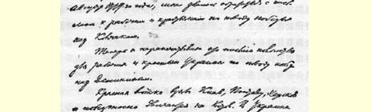
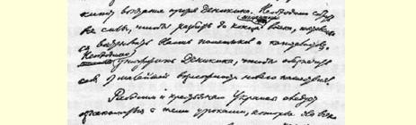
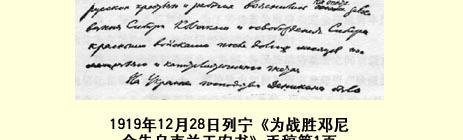

## 为战胜邓尼金告乌克兰工农书

> （１９１９年１２月２８日）

同志们！四个月以前，１９１９年８月底，我曾经为战胜高尔察克写过一封给工人和农民的信[^1]。

现在，我又为战胜邓尼金把这封信全文重新印发给乌克兰的工人和农民。

红军攻克了基辅、波尔塔瓦和哈尔科夫，正胜利地向罗斯托夫推进。乌克兰的反邓尼金起义如火如荼。必须集中全力把试图恢复地主和资本家政权的邓尼金军队彻底粉碎。必须消灭邓尼金， 确保我们决不再受到任何侵犯。

西伯利亚被高尔察克占领以后，当地人民受尽了地主和资本家的压迫，过了好多个月才被红军解放，这个教训全俄罗斯的工人和农民都已经领略了，现在乌克兰的工人和农民也应当记取。

邓尼金在乌克兰的统治，也同高尔察克在西伯利亚的统治一样，是一个严酷的考验。毫无疑义，从这个严酷的考验中得出教训，就会使乌克兰工农象乌拉尔和西伯利亚的工农一样，更清楚地理解苏维埃政权的任务，更坚定地保卫苏维埃政权。

在大俄罗斯，地主土地占有制已彻底废除。乌克兰也应当这

> １９１９年１２月２８日列宁
>
> 《为战胜邓尼金告乌克兰工农书》手稿第１页
>
> （按原稿缩小） 样做，乌克兰工农苏维埃政权应当把彻底废除地主土地占有制，即乌克兰工人农民彻底摆脱地主的一切压迫和打倒地主本身所取得的成就巩固下来。

但是，除了这个任务以及过去和现在大俄罗斯劳动群众和乌克兰劳动群众同样肩负的其他许多任务以外，乌克兰苏维埃政权还有一些特殊任务。在这些特殊任务中，有一个是目前值得特别注意的。这就是民族问题，或者说是这样的问题：乌克兰要成为一个单独的、独立的乌克兰苏维埃社会主义共和国而同俄罗斯社会主义联邦苏维埃共和国结成联盟（联邦）呢，还是同俄罗斯合并成为一个统一的苏维埃共和国？这个问题，所有的布尔什维克、 所有觉悟的工人和农民都应当仔细加以考虑。

俄罗斯社会主义联邦苏维埃共和国全俄中央执行委员会和俄国共产党（布尔什维克）都已经承认了乌克兰的独立。所以不言而喻和理所当然的是，只有乌克兰工人和农民自己在全乌克兰苏维埃代表大会上，才能够作出决定并且一定会作出决定：究竟是把乌克兰同俄罗斯合并起来，还是让它成为一个独立自主的共和国；如果取后者，那么在这个共和国和俄罗斯之间应该建立什么样的联邦关系。

为了劳动者的利益，为了劳动者争取劳动完全摆脱资本压迫的斗争获得胜利，应该怎样解决这个问题呢？

第一，劳动的利益要求在各国、各民族的劳动者之间有最充分的信任和最紧密的联合。拥护地主和拥护资本家即资产阶级的人竭力分裂工人，加剧民族纠纷和民族仇恨，以削弱工人的力量， 巩固资本的权力。

资本是一种国际的势力。要战胜这种势力，需要有工人的国际联合和国际友爱。

我们是反对民族仇恨、民族纠纷和民族隔绝的。我们是国际主义者。我们力求实现世界各民族工农的紧密团结，力求使它们完全合并成为一个统一的世界苏维埃共和国。

第二，劳动者不应当忘记，资本主义把民族分成占少数的压迫民族，即大国的（帝国主义的）、享有充分权利和特权的民族， 以及占大多数的被压迫民族，即附属或半附属的、没有平等权利的民族。罪恶滔天、反动透顶的１９１４—１９１８年战争使两者分得更清楚了，使在这种基础上产生的民族间的憎恨和仇视也更加剧了。 没有充分权利的附属民族对大国压迫民族的愤慨和不信任，例如乌克兰民族对大俄罗斯民族的愤慨和不信任，已经积累好几百年了。

我们主张建立**自愿的**民族联盟，这种联盟不允许一个民族对另一个民族施行任何暴力，它的基础是充分的信任，对兄弟般团结一致的明确认识，完全的自觉自愿。这样的联盟是不能一下子实现的。应当十分耐心和十分谨慎地去实现这种联盟，不要把事情弄坏，不要引起不信任，要设法消除许多世纪以来由地主和资本家的压迫、私有制以及因瓜分和重新瓜分私有财产而结下的仇恨所造成的不信任心理。

所以，在力求实现各民族统一和无情地打击一切分裂各民族的行为时，我们对民族的不信任心理的残余应当采取非常谨慎、非常耐心、肯于让步的态度。但在争取劳动摆脱资本压迫的斗争中涉及劳动基本利益的一切问题上，我们决不让步，决不调和。至于现在暂时怎样确定国界（因为我们是力求完全消灭国界的），这不是基本的、重要的问题，而是次要的问题。这个问题可以而且应当从缓解决，因为在广大农民和小业主中，民族的不信任心理往往是根深蒂固的，操之过急反而会加强这种心理，对实现完全彻底的统一这个事业造成危害。

俄国工农革命即１９１７年１０月至１１月革命的经验，这个革命在两年内胜利地抵御国内外资本家的侵犯的经验，非常清楚地表明，资本家能够暂时利用波兰、拉脱维亚、爱斯兰和芬兰的农民和小业主对大俄罗斯人的民族不信任心理，能够暂时利用这种不信任心理在他们和我们之间制造纠纷。经验表明：这种不信任心理的消除和消失非常缓慢；长期以来一直是压迫民族的大俄罗斯人表现得愈谨慎、愈耐心，这种不信任心理的消失就愈有保证。我们承认了波兰、拉脱维亚、立陶宛、爱斯兰和芬兰各国的独立，这样就能慢慢地但是不断地取得这些小邻国中深受资本家欺骗压抑的最落后的劳动群众的信任。我们采用了这种方法，现在就能满有把握地使他们摆脱“他们自己” 民族的资本家的影响，完全信任我们，向未来的统一的国际苏维埃共和国迈进。

在乌克兰还没有完全从邓尼金手中收复以前，在全乌克兰苏维埃代表大会召开以前，全乌克兰革命委员会２５是乌克兰政府。参加这个革命委员会的，即担任政府委员的，除乌克兰布尔什维克共产党人外，还有乌克兰斗争派共产党人２６。斗争派同布尔什维克的区别之一，就在于前者坚持乌克兰无条件独立。布尔什维克不认为**这一点**是引起分歧和分裂的问题，不认为**这一点**会妨碍同心协力地进行无产阶级工作。共产党人只要在反对资本压迫和争取无产阶级专政的斗争中能够团结一致，就不应当为国界问题，为两国的关系是采取联邦形式还是其他形式的问题而发生分歧。在布尔什维克中间，有人主张乌克兰完全独立，有人主张建立较为密切的联邦关系，也有人主张乌克兰同俄罗斯完全合并。

为这些问题而发生分歧是不能容许的。这些问题将由全乌克兰苏维埃代表大会来解决。

如果大俄罗斯共产党人坚持要乌克兰同俄罗斯合并，乌克兰人就很容易怀疑，大俄罗斯共产党人坚持这样的政策，并不是出于对无产者在反资本斗争中的团结一致的考虑，而是出于旧时大俄罗斯民族主义即帝国主义的偏见。产生这种不信任是很自然的， 在相当程度上是难免的和合乎情理的，因为许多世纪以来大俄罗斯人在地主和资本家的压迫下，养成了一种可耻可憎的大俄罗斯沙文主义偏见。

如果乌克兰共产党人坚持乌克兰无条件的国家独立，也会使人怀疑，他们坚持这样的政策，并不是为了乌克兰工农在反对资本压迫的斗争中的暂时利益，而是出于小资产阶级的、小业主的民族偏见。这是因为我们千百次地从过去的经验中看到，各国小资产阶级“社会党人”，如波兰、拉脱维亚、立陶宛、格鲁吉亚等国的孟什维克、社会革命党人等形形色色的所谓社会党人，都装扮成拥护无产阶级的人，唯一的目的就是用这种欺骗手段来偷运他们同“自己” 民族的资产阶级妥协而反对革命工人的政策。我们在俄国１９１７年２月至１０月克伦斯基执政的例子中看到过这种情况，我们在一切国家中从前和现在都看到过这种情况。

由此可见，大俄罗斯共产党人和乌克兰共产党人的互不信任是很容易产生的。怎样消除这种不信任呢？怎样克服这种不信任而求得相互信任呢？

要达到这一点，最好的方法是共同斗争，反对各国的地主和资本家，反对他们恢复自己无限权力的尝试，捍卫无产阶级专政和苏维埃政权。这种共同的斗争会在实践中清楚地表明，不管怎样解决国家独立问题或国界问题，大俄罗斯工人和乌克兰工人一定要结成紧密的军事联盟和经济联盟，不然，“协约国”的资本家，即英、 法、美、日、意这些最富裕的资本主义国家联盟的资本家就会把我们一一摧毁和扼杀。我们同得到这些资本家金钱和武器援助的高尔察克和邓尼金作斗争的例子，清楚地说明这种危险是存在的。

谁破坏大俄罗斯工农同乌克兰工农的团结一致和最紧密的联盟，谁就是在帮助高尔察克之流、邓尼金之流和各国资本家强盗们。

所以，我们大俄罗斯共产党人，对我们当中产生的一点点大俄罗斯民族主义的表现，都应当极其严格地加以追究，因为这种表现根本背离共产主义，会带来极大的害处，使我们和乌克兰同志之间发生分裂，从而有利于邓尼金和邓尼金匪帮。

所以，我们大俄罗斯共产党人在同乌克兰布尔什维克共产党人及斗争派发生意见分歧时，如果这些意见分歧涉及乌克兰的国家独立问题、乌克兰同俄罗斯联盟的形式问题，总之是涉及民族问题，我们就应该采取让步的态度。但是在无产阶级斗争、无产阶级专政、不允许同资产阶级妥协、不允许分散我们抵抗邓尼金的力量这样一些对各民族来说是共同的根本问题上，我们大家，无论大俄罗斯共产党人、乌克兰共产党人或任何其他民族的共产党人，都是不能让步、不能调和的。

战胜邓尼金，消灭邓尼金，使这样的进犯不再重演，这就是大俄罗斯工农和乌克兰工农的根本利益。这个斗争是长期而又艰苦的，因为全世界的资本家都在帮助邓尼金，而且将来还会帮助各种各样的邓尼金。

在这个长期而又艰苦的斗争中，我们大俄罗斯工人同乌克兰工人应当结成最紧密的联盟，因为孤军作战大概是不会胜利的。至于乌克兰同俄罗斯的国界如何划定，两国的相互关系采取何种形式，这都并不那么重要。在这方面可以而且应当让步；在这方面可以试一试采用各种各样的方法。工人和农民的事业，战胜资本主义的事业，是不会因此遭到毁灭的。

如果我们之间不能保持最紧密的联盟，共同反对邓尼金，反对我们两国的和一切国家的资本家和富农，资本家就**能够**摧毁和扼杀苏维埃乌克兰和苏维埃俄罗斯，就是说，劳动的事业一定会被葬送掉，多年都不能恢复。

各国资产阶级，各种小资产阶级政党，即联合资产阶级反对工人的“妥协主义” 政党，最卖力地分裂各民族工人，煽起互不信任的心理，破坏工人紧密的国际联合和国际友爱。资产阶级如果得逞，工人事业就会失败。希望俄罗斯共产党人和乌克兰共产党人能够耐心地、坚定地、顽强地共同奋斗，粉碎任何资产阶级的民族主义阴谋，消除各种民族主义偏见，给全世界劳动者作出榜样，表明不同民族的工人和农民可以结成真正巩固的联盟，共同为建立苏维埃政权、消灭地主和资本家的压迫、建立世界苏维埃联邦共和国而斗争。

### 尼·列宁

１９１９年１２月２８日

> 载于１９２０年１月４日《真理报》译自《列宁全集》俄文第５版第３号和《全俄中央执行委员会第４０卷第４１—４７页消息报》第３号

[^1]: 见《列宁全集》第２版第３７卷第１４５—１５３页。—— 编者注