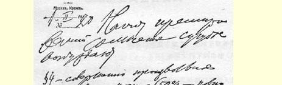
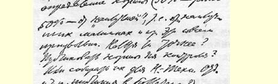
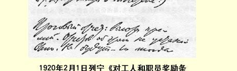

## 对工人和职员奖励条例草案的意见 ５７

１９２０年２月１日

对奖励问题以下几点很值得怀疑。

第４条—— 定额的规定完全是随意的（把“最佳” 定额，即在使用最好的机器等情况下的定额，打５０％的折扣，不多不少 ５０％。这完全是随意定的。能不能更精确些？公布定额以便监督？ 或者把定额交科学技术等部门审核，在公报上公布？）。５８

总报表：各种奖金的最大数额。没有规定申报这个项目。这样会不会使纯属舞弊的行为实际上合法化？

应该吸收**消费者**监督定额。有没有这样的先例？合作社有吗？ 等等。

草案散乱，抽象，不切实际，规定的倒是很全，但毫无检查措施。

### 列宁

> 载于１９４５年《列宁文集》俄文版译自《列宁全集》俄文第５版第３５卷第４０卷第８２页

> １９２０年２月１日列宁
>
> 《对工人和职员奖励条例草案的意见》手稿第１页