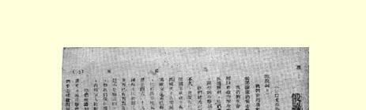
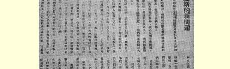
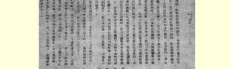
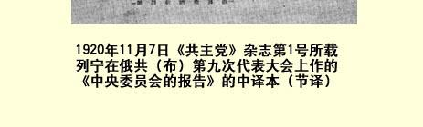

## 俄共（布）第九次代表大会文献 １３１

> （１９２０年３—４月）

## １ 代表大会开幕词

（３月２９日）

首先，请允许我代表俄共中央向出席党代表大会的代表表示祝贺。

同志们，我们是在极其重要的时刻召开这次党代表大会的。我们的革命在国内的发展已经使我们在国内战争中战胜了敌人，取得了极其重大而迅速的胜利。在目前的国际形势下，这些胜利正是苏维埃革命在第一个完成这一革命的国家里、在一个最弱最落后的国家里的胜利，是对联合起来的世界资本主义和帝国主义的胜利。我们在取得这些胜利之后，现在可以沉着坚定地执行当前的和平经济建设任务。我们深信，这次代表大会一定能总结出两年多来苏维埃工作的经验，吸取已有的教训来完成当前更加困难复杂的经济建设任务。在国际方面，我国所处的形势从来没有象现在这样有利，而我们每天从德国收到的消息特别使我们欢欣鼓舞，这些消息表明，不管社会主义革命的诞生如何困难，如何痛苦，但是德国的无产阶级的苏维埃政权还是在不断发展。科尔尼洛夫叛乱在德国也起了同在俄国一样的作用。在德国，科尔尼洛夫叛乱之后，不仅城市工人群众，而且农村无产阶级都开始转向工人政权，这一转变具有世界历史性的意义。它不仅一次又一次地完全证实了我们所走的道路是正确的，它还使我们确信，我们同德国苏维埃政府携手并进的日子不会太远了。（鼓掌）

现在我宣布代表大会开幕，请大家选举主席团。

> 载于１９２０年《俄国共产党第九次译自《列宁全集》俄文第５版代表大会。速记记录》一书第４０卷第２３５—２３６页

## ２ 中央委员会的报告

> （３月２９日）

同志们，在开始报告之前，我应该说明一下，这个报告也象上次代表大会的报告一样，分为两部分：政治部分和组织部分。这种划分首先就令人想到，从表面上来看，从组织方面来看，中央的工作情况怎么样。我们的党失去雅·米·斯维尔德洛夫已经一年了； 这个损失不能不影响到中央的整个组织。没有人能象斯维尔德洛夫同志那样善于一个人同时兼顾组织工作和政治工作，因而我们就不得不尝试用集体工作来代替他一人的工作。

中央在报告年度中的工作，就日常工作来讲，是由中央全会选出的两个集体领导机构中央组织局和中央政治局１３２担负的；同时为了使这两个机构的决议协调一致，中央书记兼任两个局的工作。 于是形成了这样的局面：组织局真正首要的任务是分配党的干部， 而政治局的任务是解决政治问题。自然，这种划分在一定程度上是人为的；显然，如果没有人员的任命和调动，任何政治也就无法体现。因此，任何组织问题都有政治意义，所以我们在实践中形成了这样的惯例，只要有一个中央委员提出要求，就可以根据某种理由把任何一个问题看成政治问题。企图用别种办法来划分中央委员会的工作恐怕是不适当的，而在实践中也未必能达到目的。

上述工作方式收到了非常好的效果：在我们两个局之间从来没有发生过难以解决的事。这两个机关的工作一般说来是协调的， 这种方式易于实行，这是由于中央书记参加两个局的会议，并且中央书记执行的完全是党中央的意志。为避免发生某种误会起见，从一开始就必须着重指出，党中央书记只执行中央委员会集体作出的决议，即由组织局或政治局或中央全会作出的决议。否则，中央委员会的工作是不能正确进行的。

上面简单说明了中央委员会内部的工作规则，现在我来执行自己的任务，作关于中央委员会的报告。作中央委员会政治工作的报告，确实是非常困难的任务。这一年来政治局的工作，大部分都是随时解决一切有关政治的问题，即有关统一各苏维埃机关和党的机关以及一切工人阶级组织的行动，有关统一苏维埃共和国全部工作并努力指导这些工作的问题。政治局解决一切有关国际、国内政治的问题。当然，要想大致上把这些问题列举出来，是不可能的。你们可以从中央委员会在这次代表大会前发表的文件中找到必需的综合材料１３３。要在报告中把那个综合材料复述一遍，这是我不能胜任的，而且我认为代表们也不会感兴趣。我们每一个在党和苏维埃的某个组织中工作的人，每天都注视着千变万化的国内外政治问题。这些问题的解决已在苏维埃政权颁布的法令中、在党组织的工作中、在每一转变中体现出来，解决问题本身就是对党中央委员会的评价。必须指出，问题这么多，解决起来往往非常匆忙，只是由于集体领导机构中的各个成员彼此十分了解，知道各人意见的细微差别，相互信任，才得以完成这个工作。否则，即使这个集体领导机构的人数再增加两倍也应付不了。一些复杂问题往往不用开会而是打电话商谈一下就解决了。这种做法是在深信某些显然复杂的、有争议的问题不会被放过的情况下采取的。现在，在我作总的报告的时候，我想不按时间的顺序，也不分门别类地评述各种问题，而只谈那些主要的、最重大的问题，并且只谈那些把昨天的经验（确切些说是过去一年的经验）同当前的任务联系起来的问题。

现在还没有到编写苏维埃政权历史的时候。即使已经到了这样的时候，那我要代表我个人说，并且我想也可以代表中央委员会说，我们不预备做历史学家，我们所关心的是现在和将来。过去的一年，我们是把它当作材料，当作经验教训，当作我们继续前进的跳板看待的。从这个角度看，中央委员会的工作可以分为两大部分：一部分是同军事任务和决定苏维埃共和国所处的国际形势的任务有关的工作；另一部分是国内和平经济建设的工作。这后一部分工作，也许只是从去年年底或今年年初才提到首要地位的，因为当时大家已经十分清楚，我们在国内战争的各条有决定意义的战线上获得了决定性的胜利。去年春季，我们在军事上的处境十分困难，大家记得，当时我们遭到过多次失利和原先没有料想到的反革命势力代表和协约国代表一次又一次的、突然的大规模进攻。所以很自然，这一时期主要是在完成军事任务，国内战争任务，当时在所有的胆小鬼看来（更不用说孟什维克党、社会革命党以及其他小资产阶级民主派政党了），在大批中间分子看来，这个任务是无法完成的，于是他们就乖乖地承认说：这个任务是无法完成的，俄国落后了，被削弱了，既然西欧革命推迟了，那么俄国就不能战胜全世界资本主义制度。因此我们当时必须坚持自己的立场，十分坚定并满怀信心地说，我们一定能胜利。因此我们提出了“一切为了胜利”、“一切为了战争”的口号。

为了实现这个口号，我们不得不完全有意识地—— 而且公开说清楚—— 不去满足许多最迫切的需要，经常使很多人得不到帮助，我们确信应当把全部力量集中用在战争上，应当在这场协约国强加于我们的战争中获得胜利。只是因为党随时戒备，因为党纪律严明，还因为党的威信统一了各机关、各部门，使几十、几百、几千以至几百万人都遵照中央提出的口号一致行动，只是因为我们忍受了空前未有的牺牲，才出现了今天这样的奇迹。只是因为这样， 尽管协约国帝国主义者和全世界帝国主义者两次、三次以至四次发动进攻，我们仍然能够获得胜利。当然，我们不仅要着重指出这一方面，而且要注意到从这一方面所得到的经验教训：没有纪律， 没有集中，我们决不能完成这个任务。我们为了消灭反革命势力、 拯救祖国，为了使俄国革命战胜邓尼金、尤登尼奇和高尔察克而忍受空前牺牲，是世界社会革命的保障。为了实现这一点，就必须有党的纪律，有极严格的集中，绝对相信成千成万人的空前未有的重大牺牲定能有助于这些任务的实现，绝对相信这确实是可能做到的和有把握做到的。为了这一点，就必须使我们党和实现专政的阶级即工人阶级，成为联合俄国以至全世界千百万劳动者的因素。

一个弄得精疲力竭的又弱又落后的国家竟战胜了世界上几个最强大的国家，如果想一想出现这种历史奇迹的根本原因究竟在哪里，那么，我们可以看出，根本原因就在于集中、纪律和空前的自我牺牲精神。这是在什么基础上出现的呢？在一个教育程度最差的国家中，千百万劳动者所以能够组织起来，这种纪律、这种集中所以能够实现，就是因为工人受过资本主义的训练，资本主义使他们联合起来，就是因为一切先进国家的无产阶级已经联合起来，而且愈是先进国家，这种联合的规模就愈广泛；另一方面，是由于私有制即资本主义私有制、商品生产中的小私有制使敌人分崩离析。 私有制在起分裂作用，我们则联合劳动者，而且愈来愈多地把全世界千百万劳动者联合起来。可以说，这一点现在连瞎子，至少是那些过去不愿看到这一点的人都已经看到了。时间愈久，我们的敌人分裂得愈厉害。分裂他们的是资本主义私有制、商品生产中的私有制，不管这些人是用余粮作投机买卖、靠剥削挨饿的工人发财致富的小业主，或者是各国资本家，尽管后者拥有军事实力，创立了“国际联盟”这个全世界一切先进民族的“伟大统一联盟”。这样的统一纯粹是虚构、骗局、谎言。我们已经看到一个极好的例子，就是这个臭名远扬的“国际联盟”，它企图分配管理各个国家的权利，企图瓜分世界，可是这个臭名远扬的联盟犹如镜花水月，一下子就无影无踪了，因为它是建立在资本主义私有制的基础上的。我们从长期的历史过程中看到了这一点，而这证实了一个基本真理，根据这个真理，我们确认我们是做得对的，完全相信十月革命必然胜利，完全相信我们所担负的事业虽然有很大的困难，虽然有无数的障碍，但世界各国千百万劳动者将会参加进来。我们知道我们有同盟者，知道必须在一个负有历史赋予光荣艰巨使命的国家中善于表现出自我牺牲精神，使这些空前的牺牲获得百倍的补偿，因为我们在自己的国家中多坚持一个月，就能在世界各国多获得千百万的同盟者。

如果想想，到底为什么我们能够胜利，为什么我们必然胜利， 那么只能说，是因为所有我们的敌人，那些在形式上同世界最强大的资本政府和资本代表有着各种各样的联系的人，不管他们在形式上是如何团结，实际上却是四分五裂的；他们之间的内部联系骨子里却是在分裂他们，使他们互相敌视，资本主义私有制也在使他们分化，把他们从盟友变成野兽，所以他们看不到，在阿尔汉格尔斯克登陆的英国士兵中，在塞瓦斯托波尔登陆的法国水兵中，在世界各国工人中，拥护苏维埃俄国的人日益增多起来，虽然在所有的先进国家里，社会党妥协分子都投到资本方面去了。就是这个基本原因，这个最深刻的原因，最终使我们获得了最可靠的胜利；这个原因过去是现在仍旧是我们取之不尽、用之不竭的最主要的力量源泉；有了这个源泉，我们就可以说，等我们在本国充分实现了无产阶级专政，经过无产阶级先锋队、经过它的先进政党最大限度地团结了无产阶级的力量的时候，我们就可以期待世界革命的到来。 这实际上也就是一种意志的表现，无产阶级斗争决心的表现，无产阶级争取世界各国千百万工人联合的决心的表现。

资产者老爷们和第二国际的所谓社会党人把这称为宣传用语。不对，这是俄国流血的、痛苦的国内战争经验证实了的历史事实，因为这场国内战争是反对世界资本的战争，世界资本在争斗中自己崩溃了，它自己毁灭了自己，而我们却在一个无产阶级被饥饿和斑疹伤寒折磨得奄奄一息的国家中得到了更多的锻炼，变得更加坚强。在这个国家里，我们把愈来愈多的劳动者团结在我们的周围。以前妥协派认为是宣传用语而且被资产阶级习惯地加以嘲笑的东西，在我国革命的这一年中，主要是在报告年度中，终于变成了无可争辩的历史事实。这一事实使我们可以极为肯定地说，既然我们做到了这一点，这就证明我们有全世界的基础，有比以前任何一次革命都广泛得多的基础。我们有国际联盟，它在任何地方都没有明文规定，没有固定形式，从“国家法”的观点来看它什么都不是，而实际上，在日趋瓦解的资本主义世界中它却又是一切。每一个月，不管是我们夺回了阵地或者只抵挡住了空前强大的敌人，都向全世界证明我们是正确的，并使我们获得千百万新的同盟者。

这个过程看来是很艰难的，中间有过几次重大的失败。继芬兰出现空前的白色恐怖１３４之后，就在报告年度中，匈牙利革命失败了，协约国代表们瞒着本国议会，同罗马尼亚订立秘密条约，把这个革命扑灭了。

这是最卑鄙的叛卖行为，这是协约国的阴谋，它们用白色恐怖来扑灭匈牙利革命，更无须说它们怎样竭力同德国妥协派勾结起来扑灭德国革命，也无须说这班过去宣称李卜克内西是正直的德国人的人怎样同德帝国主义者一起，象疯狗一样扑向这个正直的德国人了。它们无所不用其极，但它们施行的任何这样的镇压只能使我们更加巩固和强大，同时却毁坏了它们自己的基础。

我认为，我们应当特别重视我们得到的这个基本经验。这里特别应当考虑的是，要使我们的鼓动和宣传工作建立在分析和说明上，即分析和说明我们为什么获得胜利，为什么在国内战争中付出的那些牺牲得到了百倍的补偿，而根据这个经验，又应当怎样做才能在另一种战争中，在不流血的战争中获得胜利，这一战争只是改变了形式，而进行这种战争反对我们的，仍然是旧资本主义世界的旧代表、旧奴仆和旧领袖，不过他们进行得更起劲、更疯狂、更卖力罢了。我国革命比任何其他革命都更有力地证实了这个规律：革命的力量、革命进攻的力量、革命的毅力、坚决性和革命胜利的成果愈大，资产阶级的抵抗力也就愈大。我们的胜利愈多，资本主义剥削者也就愈努力学习怎样联合起来，转而采取更坚决的进攻。要知道你们大家都记得很清楚（从时间上说，这是不久以前的事，可是从时事的角度说，却是老早以前的事了），在十月革命开始时，人们把布尔什维主义看作怪现象；这种观点在俄国很快就被抛弃

> １９２０年１１月７日《共产党》杂志第１号所载
>
> 列宁在俄共（布）第九次代表大会上作的
>
> 《中央委员会的报告》的中译文（节译） 了，这种表明无产阶级革命还不发展、还很薄弱的观点在欧洲也被抛弃了。布尔什维主义成了世界现象，工人革命风起云涌。苏维埃制度，即我们吸取了１９０５年的教训、研究了自己的经验而在十月建立起来的苏维埃制度，已成了有世界历史意义的现象。

可以毫不夸大地说，现在是两个营垒在全世界范围内完全有意识地互相对峙着。应当指出，只是在过去的这一年中，才开始了它们彼此间的最后决战。现在，就在举行这次代表大会的时候，我们正经历着也许又是一个最巨大、最急剧而尚未完结的从战争向和平转变的关头。

你们都知道，协约国帝国主义列强的领袖们向全世界高喊过： “我们永远不会停止反对那些篡权、抢权、敌视民主的布尔什维克强盗的战争。”你们知道，他们先是撤销了封锁，他们联合各小国的尝试也失败了，因为当时我们不仅把各国工人争取过来了，而且成功地把各小国的资产阶级也争取过来了，因为帝国主义者不只压迫本国工人，并且也压迫各小国的资产阶级。你们知道，我们是怎样把各先进国家中的动摇的资产阶级争取过来的，以致现在出现了这样的局面：协约国违反自己许下的诺言、誓词，违反自己签订的条约；顺便说说，它们曾同俄国各白卫匪帮订过几十个条约，现在就象守着破木盆１３５那样守着这些条约叹息，因为它们为这些条约耗费了亿万金钱，结果落了个一场空。

现在它们撤销了封锁，实际上已开始同苏维埃共和国进行和平谈判，现在它们又不把这种谈判进行到底，所以各小国对它们丧失了信心，对它们的力量丧失了信心。我们看到，协约国的地位，它们在对外关系中的地位，从法学的通常观点看来，是很不明确的。 协约国各国对布尔什维克的关系，是一种既不战又不和、既承认我们又不承认我们的关系。我们的敌人原来深信自己是一种力量，现在它们这种分崩离析的状态却表明它们丝毫没有力量，只不过是一小群互相争吵、对我们无可奈何的资本主义野兽。

现在的情况是这样：拉脱维亚正式向我们提出了媾和的建议１３６；芬兰打来了一个电报，正式提议划定国界，其实这也就是向和平政策的转变１３７。最后还有波兰，波兰的代表人物过去特别起劲地炫耀武力，而且现在还继续这样做，过去和现在波兰从协约国领到满载大炮的列车数量最多，并且协约国还答应，只要它继续同俄国斗争就尽力帮助它，—— 甚至连这个由于政府地位不稳而什么军事冒险都干得出来的波兰，也送来了举行和谈的邀请书１３８。对此必须特别谨慎。我们的政策要求格外的慎重。在这里极难找到正确的路线，因为此刻火车停在什么轨道上谁也不知道，连敌人自己也不知道它今后究竟怎么办。挑唆波兰最甚的代表法国政策的老爷们，以及地主和资产阶级的波兰的领袖们都不知道今后会怎样， 都不知道自己要干什么。他们今天说：“先生们，给我们几列车大炮，几亿金钱，我们就同布尔什维克打一仗。”他们隐瞒罢工浪潮在波兰日益高涨的消息，严令书报检查机关不许泄露真情。而那里的革命运动在日益发展。德国革命的发展已进入新的时期，进入了新的阶段，工人在经过了德国的科尔尼洛夫叛乱之后，现在正在建立红军，这直接说明（最近从那里发来电讯）工人的热情愈来愈高涨。 地主和资产阶级的波兰的代表人物不由得开始想到：“是不是已经晚了？会不会在国家尚未作出战或和的正式决定以前就在波兰成立苏维埃共和国？”他们不知道怎么办才好。他们不知道明天带给他们的将是什么。

我们知道，我们的力量每个月都在大大增强，并将继续大大增强。所以现在我们所处的国际地位比以往任何时候都更巩固。但是我们应当密切注意国际危机，应当准备随时应付任何突然事件。 我们已得到了波兰正式的媾和建议。这些老爷现在处在如此绝望的状态中，以致他们的朋友，即德国君主派分子，一些更有教养、更有政治经验和政治见解的人也铤而走险，发动科尔尼洛夫叛乱。波兰资产阶级抛出媾和建议，因为它知道，冒险可能造成波兰的科尔尼洛夫叛乱。我们知道敌人正处在极端困难的境地，他们不知道自己想做什么，也不知道明天要做什么，所以我们要十分肯定地指出：虽然有了媾和建议，但战争还是可能爆发的。他们今后的举动是无法预测的。这种人，我们看到过，这些克伦斯基之流、孟什维克和社会革命党人之流的人，我们很了解。在这两年中，我们看到，他们今天跑到高尔察克方面，明天又几乎跑到了布尔什维克方面，然后又跑到邓尼金方面，而这一切都是在自由和民主的词句掩饰下进行的。我们了解这些先生，所以我们双手抓住媾和建议，准备作最大限度的让步；我们相信，同各小国缔结和约，对于推进事业来说，要比战争好无数倍，因为帝国主义者用战争欺骗劳动群众，以此来隐瞒苏维埃俄国的真实情况，所以，任何一种和约都会使我们的影响增加和扩大一百倍。在过去这几年中，我们的影响本来已经很大了。第三国际，即共产国际已获得了空前的胜利。但是，我们同时也知道，战争随时都可能强加到我们头上。我们的敌人自己还不清楚，他们在这一方面究竟能做些什么。

他们正在进行战争准备，这是无可置疑的。现在有很多同俄国毗邻的国家，也许还有很多非毗邻的国家，都在进行这种全国性的武装准备。所以我们在国际政策上要尽可能地机动灵活，最坚决地贯彻我们既定的方针，并随时准备应付一切事变。我们是殚精竭虑来进行争取和平的战争的。我们正在取得辉煌的战果。在这一战场上，我们表现得最为出色，至少并不比红军在战场上，在流血的战线上表现得差。但是，即使小国愿意和平，同我们缔结和约却不取决于它们的意愿。它们对协约国各国负债累累，而在协约国各国之间正拼命地进行着争斗和竞争。所以我们应当记住，从国内战争和反协约国战争所造成的世界范围的实际情况来看，和平当然是可能的。

但是，我们在采取和平步骤的同时，也应当全面加强我们的作战准备，绝对不能解除我们军队的武装。我们军队是使帝国主义列强丝毫不敢轻举妄动、不敢侵犯我国的切实保障，因为列强纵然可以指望起初获得某些暂时的胜利，但结果任何一国都不免被苏维埃俄国所粉碎。这是我们应当知道的，这应当成为我们鼓动和宣传的重点，对于这一点我们要作好准备，要完成好在日益疲惫的情况下把和与战两者结合起来这一任务。

现在我要谈一谈迫使我们下决心引导劳动群众利用军队来完成当前基本任务的那些最重要的带根本性的理由。旧的纪律源泉即资本已经削弱了，旧的联合源泉已经消失了。我们应当建立另一种纪律，开辟另一种纪律和联合的源泉。强制手段引起资产阶级民主派的愤懑、叫嚣、喧嚷和哀号；这班人嘴上老是挂着“自由”、“平等”这些字眼，却不懂得，让资本享受自由就是对工人犯罪，让饱食者和挨饿者平等就是对劳动者犯罪。我们反对说假话，我们主张在实行劳动义务制和联合劳动者时，丝毫也不要害怕采用强制手段， 因为不采用强制手段就决不能进行革命。因此，为了坚决地保持住自己的胜利成果，无产阶级有权采用强制手段。当资产者老爷们、 妥协派老爷们、德国“独立党”老爷们、奥地利“独立党”１３９老爷们和法国龙格派老爷们争论历史因素问题时，他们总是把无产阶级的革命决心、坚定性、不屈不挠精神这样的因素忘掉了。这也就是我国无产阶级表现的那种不屈不挠和坚韧不拔的精神，他们曾对自己也对别人说过，并且用行动证明过，我们宁肯全部战死，也不放弃自己的领土，也不放弃自己的原则，即纪律和坚定政策的原则， 为此我们应当不惜任何牺牲。在各资本主义国家和资本家阶级分崩离析的时候，在他们处于绝望和危机的时候，只有这个政治因素能起决定作用。少数和多数、民主和自由这些空洞的词句，不管旧历史时期的英雄们怎样强调，现在都起不了什么决定作用。这里起决定作用的是工人阶级的觉悟性和坚定性。如果工人阶级准备作出自我牺牲，如果工人阶级表明它能竭尽全力，那就可以完成任务。一切都为了完成这个任务。工人阶级的决心，它实现自己“宁死不屈”口号的坚定意志，不但是历史的因素，而且是起决定作用的、能夺取胜利的因素。

我们有了这个胜利，有了这种信心，才转向并已经转到和平经济建设的任务。决定这些任务，就是我们这次代表大会的主要职责。我认为，在这方面不是由中央政治局来作报告，确切些说，不是由中央委员会来作政治报告，而应当直截了当地说：同志们，是的， 这是由你们来决定的问题，是应当由你们以党的最高机关的权威来考虑的问题。我们把这个问题清清楚楚地提到你们面前来了。我们已经采取了明确的立场。你们的责任就在于最终批准、修改或变更我们的决定。但是，中央在自己的报告中应当说，它在这个基本的迫切问题上已经采取了十分明确的立场。是的，现在的任务是要把无产阶级所能集中的一切力量，把无产阶级的绝对统一的力量都投到经济建设这一和平任务上去，都投到恢复被破坏了的生产这一任务上去。这里需要有铁一般的纪律，铁一般的组织，否则，我们不仅支持不了两年多，甚至连两个月也支持不了。要善于运用我们的胜利。另一方面应当懂得，这个转变需要我们作出我国本来就已经承受得够多的大量牺牲。

原则方面的问题，中央是很清楚的。中央全部工作都是服从这个政策、根据这种精神的。例如你们将要解决的关于集体管理制和个人管理制的问题，看来似乎是局部问题，如果割断它同各方面的联系，当然不能说它是有根本原则意义的问题；但是这个问题的提出，无论如何都要从我们已经基本获得的知识、经验、革命实践出发。例如有人对我们说：“集体管理制是广大群众参加管理的形式之一。”可是我们在中央委员会里讨论过这个问题，研究过这个问题，我们应当向你们报告：同志们，这种理论上的混乱是决不能容忍的。我们要是在我们的军事活动，我们的国内战争这一基本问题上发生一点点这种理论上的混乱，那早就被人打垮了，打垮也活该。

同志们，请允许我在作中央委员会的报告的时候，在谈到新阶级是采用集体管理制还是一长制来参加管理的问题的时候，稍微谈点理论，指出一个阶级怎样进行管理，阶级统治表现在什么地方。在这方面我们并不是新手，我国革命和以往革命的区别就在于我国革命不是空想。新阶级只有在反对其他阶级的激烈斗争中保存住自己，才能取代旧阶级，而且只有当它能够完全消灭阶级时，它才能获得最终胜利。阶级斗争的巨大而复杂的过程正是这样要求的，不这样，你们就会陷于混乱而不能自拔。阶级统治表现在什么地方呢？资产阶级对封建主的统治表现在什么地方呢？ 宪法写上了自由、平等。这是骗人的话。只要有劳动者存在，私有者就会投机倒把，而且正由于他是私有者，也就不得不投机倒把。我们说，平等是没有的，饱食者和挨饿者是不平等的，投机倒把者和劳动者也是不平等的。

现在的阶级统治表现在什么地方呢？无产阶级的统治表现在废除了地主和资本家的所有制。以前所有一切宪法，以至最民主的共和宪法的精神和基本内容都归结在所有制这一点上。我们的宪法之所以有权在历史上存在，所以争取到了这个权利，就是因为废除这一所有制不是仅仅在纸上写写而已。获得胜利的无产阶级废除并彻底破坏了这一所有制，阶级统治也就表现在这里。首先就表现在所有制问题上。我们实际解决了所有制问题，这样也就保证了阶级统治。后来，宪法把实际生活中解决了的废除资本家和地主的所有制的问题记载下来，并补充说：宪法规定，工人阶级比农民有更多的权利，而剥削者则没有丝毫权利，—— 这样宪法就记载了我们业已实行的本阶级的统治，靠了这一点我们才保持了同劳动者的一切阶层和一切小的集团的联系。

小资产阶级私有者是分散的，其中财产较多的人就是财产较少的人的敌人；而无产者废除私有制，就是公开向他们宣战。还有许多没有觉悟的无知的人，凡是自由贸易他们就完全拥护，可是当他们看到我们在战胜剥削者时表现出来的纪律和自我牺牲精神，他们就不能作战，他们既不拥护我们，但也无力反对我们。关于所有制以及哪一个阶级领导的问题，只有阶级统治能够决定。谁要是象我们经常所见的那样把阶级统治的表现问题同民主集中制问题搅在一起，那他就要造成莫大的混乱，以致任何工作都无法顺利进行。宣传鼓动工作的明确性是一个基本条件。我们的敌人也承认，说我们在开展宣传鼓动工作方面作出了奇迹，但这不应当从表面上来理解，以为我们有许多鼓动员，我们耗费了很多纸张，而应当从实质上来理解，就是说，我们宣传的真理深入了人心。而这个真理是无法回避的。

当一个阶级取代了另一个阶级的时候，它也改变了同所有制的关系。资产阶级取代封建主义之后，也就改变了同所有制的关系；资产阶级的宪法说：“拥有财产的人和乞丐是平等的。” 这就是资产阶级的自由。这种“平等” 把国家统治权交给了资本家阶级。难道你们以为资产阶级取代封建主义之后，它就把国家和管理混为一谈了吗？没有的事，他们不是这样的傻瓜，他们说：要管理就要有善于管理的人才，为此我们就要起用封建主，要改造他们。他们就这样做了。这样做难道错了吗？同志们，不是的，管理的本领不会从天上掉下来，不会凭空就有的，不会因为这个阶级是先进阶级，于是一下子就有了管理的本领。我们从实例中看到：资产阶级刚胜利时，它是起用另一个阶级即封建阶级出身的人做管理工作的，否则它就无人可用。要清醒地观察事物：资产阶级曾起用先前那个阶级的人才，而我们现在也有同样的任务 —— 善于吸取、掌握、利用先前那个阶级的知识和素养，为本阶级的胜利而运用这一切。所以我们说，获得胜利的阶级应当是成熟的阶级，可是成熟性不是用文字或证书所能证明的，而是要由经验和实践来证明的。

资产者获得了胜利，但当时还不会管理，他们是这样保障自己的胜利的：宣布新宪法，从本阶级中征募管理人员，开始学习， 同时利用先前那个阶级的管理人员，并且开始训练和培养自己的新人去做管理工作，为此而运用了全部国家机构，取缔旧的封建机关，让富人进学校，这样经过许多年，经过几十年，他们就把本阶级的管理人员培养出来了。现时在按统治阶级的模样组成的国家中，也应采取过去所有的国家都用过的办法。如果我们不愿立足于纯粹的空想和空谈，那我们就要说，我们应当考虑过去年代的经验，我们应当保障革命所争得的宪法，但是要管理，要进行国家建设，就应当有掌握管理技术、具有管理国家和管理经济经验的人才，而这样的人才我们只有从先前那个阶级中才能找到。

在关于集体管理制的议论中，往往充斥着一种最无知的情绪， 即反对专家的情绪。有了这种情绪是不能取得胜利的。要获得胜利，就必须懂得旧资产阶级世界的全部悠久的历史；要建设共产主义，就必须掌握技术，掌握科学，并为了更广大的群众而运用它们，而这种技术和科学只有从资产阶级那里才能获得。应当把这个基本问题突出地提出来，应当把它作为经济建设的基本任务提出来。我们应当借助于被我们推翻了的那个阶级出身的人来从事管理，自然，这些人满脑子都是他们本阶级的偏见，我们应当重新教育他们。同时，我们应当从本阶级队伍中征集自己的管理人员。我们要运用全部国家机构，使学校、社会教育、实际训练都在共产党员领导之下为无产者、为工人、为劳动农民服务。

我们只能这样办。我们既然有了两年的经验，就不能这样来议论，好象我们是初次从事社会主义建设似的。在斯莫尔尼时期和在此前后，我们做了够多的蠢事。这是没有什么可耻的。我们初次从事新的事业，聪明才智从哪里来呢？我们这样试试，那样试试。我们曾随波逐流，因为那时区分不出正确的东西和不正确的东西，要做到能够区分是需要时间的。现在这已经成为不久前的往事了，我们已经度过了这个时期。这一充满混乱和热情的时期已经过去了。说明过去这个时期的文件就是布列斯特和约。这是历史文件。不仅如此，这是一个历史时期。我们被迫接受布列斯特和约，是因为当时我们在各方面都软弱。这是怎样的历史时期呢？这是我们软弱的时期，我们现在已经以胜利者的姿态度过了这个时期。这又是完全实行集体管理制的时期。这是无法跳过的历史事实，因为人们说集体管理制是学习管理的学校。但我们不能总是蹲在学校的预备班里！（鼓掌）这样做是行不通的。我们现在是成年人了，如果我们的举动仍旧和小学生一样，那我们在各方面都是要不断挨打的。应当前进。应当坚韧不拔地、意志统一地向高处攀登。工会面临着极大的困难。要设法使工会理解，这个任务是要反对臭名远扬的民主制的残余。所有那些关于被委派者的叫喊，所有那些在各种决议和谈话中常见的陈腐有害的滥调， 应当扫除干净。否则我们就不能获得胜利。如果我们在两年内还没有领会这个教训，那我们就是落后了，而落后是会挨打的。

任务非常困难。我们的工会对无产阶级国家的建设有过极大的帮助。工会是党联系千百万没有知识的群众的一个环节。我们不会掩盖事实：当工会帮助国家做粮食工作时，曾肩负了同我们的各种灾难作斗争的全部任务。难道这不是极大的任务吗？不久以前出版了《中央统计局公报》１４０。公报上刊出了一些绝无信仰布尔什维主义嫌疑的统计学家们得出的总结数字。其中有两个有趣的数字：在１９１８年和１９１９年，各消费省中每个工人每年领得７普特粮食，而各产粮省中每个农民每年却消费了１７普特粮食。在战前，这些农民每年只消费１６普特粮食。这两个数字表明了粮食斗争中的阶级对比关系。无产阶级继续作出牺牲。竟有人对暴力大叫大喊！但是无产阶级认为采用这种暴力是正当的、合法的，并且用作出最大牺牲的事实证明了采用这种暴力是正确的。在我们忍饥挨饿的、满目疮痍的俄国，各产粮省的大多数居民即农民，几百年来第一次比在沙皇俄国、资本主义俄国的时代吃得好。但我们要说，在红军获得胜利以前，群众还将挨饿。工人阶级先锋队必须作出这种牺牲。它在这个斗争中受到了锻炼。受过锻炼之后， 我们应当继续前进。现在无论如何也要跨出这一步。同任何一个工会一样，老工会都有它自己的历史和过去。在过去，工会是反对劳动压迫者的机关，反对资本主义的机关。而当工人阶级成了统治阶级时，当工人阶级现在必须作出很大牺牲、忍饥挨饿、献出生命时，情况就完全改变了。

这种改变，不是一切人都能理解的，不是一切人都能深刻认识的。在这方面，有些孟什维克和社会革命党人在帮助我们，他们要求用集体管理制来代替个人管理制。同志们，对不起，这样做是行不通的！我们已经抛弃了这一套。现在我们面临一个极复杂的任务：在流血的战线上获胜之后，还要在不流血的战线上获得胜利。这场战争更加困难。这条战线是最艰巨的战线。我们向全体觉悟工人公开说明这一点。我们打赢了火线上的那场战争之后，还要打一场不流血的战争。结果是我们的胜利愈大，象西伯利亚、乌克兰、库班这样的地区也就愈多。那里有富裕农民，那里没有无产者，即使有无产阶级，那也是已经被小资产阶级的习惯腐化了的；并且我们知道，那里凡是有一小块土地的人都说： “我才不在乎政府呢！我要尽量敲一下饿肚子的人的竹杠，我才不把政府放在眼里呢！” 现在协约国将会帮助那些原来被邓尼金宰割，以后又摇摆到我们方面来的投机者农民。战争改变了战线和形式。协约国现在是用贸易、用粮食投机来进行战争，它使这种粮食投机成为国际性的。发表在《中央委员会通报》１４１上的加米涅夫同志的提纲，把这个问题的基本点完全表达出来了。他们想使粮食投机成为国际性的。他们想把和平的经济建设变成对苏维埃政权的和平瓦解。帝国主义者老爷们，对不起，我们是有戒备的！ 我们说：我们打过仗，我们胜利过，所以我们继续要把曾经帮助我们获得胜利的口号提出来作为基本口号。我们要完全保留这个口号，并把它用到劳动战线去，这口号就是无产阶级的坚定精神和统一意志。原来留下的那些旧偏见、旧习惯，应当一律扫除。

最后，我还要讲讲古谢夫同志写的一本小册子１４２。据我看，这本小册子从两方面来看是值得注意的：这本小册子写得好，不仅从形式来看是这样，也不仅因为它是在我们代表大会开幕前写成的。不知怎的我们大家直到现在都惯于写决议。有人说，写出的东西形式不拘，只要不是枯燥无味，那就是好的。我看，决议应当列入枯燥无味一类。如果我们都效法古谢夫同志，少写些决议， 多写些小册子，即使它们也同古谢夫的小册子一样有很多错误，那也要好些。尽管有这些错误，它还是一本很好的小册子，因为它所注意的中心是恢复全国工业和生产的基本经济计划，因为其中的一切都服从于基本经济计划。在今天散发给大家的中央委员会的提纲中，有整整一节是整个取自古谢夫同志的提纲中的。我们可以依靠专家们的帮助，更详尽地拟订这个基本经济计划。我们应当记住，这个计划是预定用很多年来实现的。我们并不许诺一下子就使我国摆脱饥饿。我们指出，斗争将比在军事战线上更加困难，但这场斗争会引起我们更大的兴趣，它将使我们更接近我们真正的基本任务。这场斗争要求我们全力以赴，要求意志统一， 也就是我们以前做到过、现在我们也应当做到的意志统一。如果我们把这个问题解决了，那么我们在不流血战线上获得的胜利，决不会小于在国内战争战线上所获得的胜利。（鼓掌）

> 载于１９２０年３月３０日和３１日《真理报》译自《列宁全集》俄文第５版第６９号和第７０号第４０卷第２３７—２５７页

## ３ 关于中央委员会报告的总结发言

> （３月３０日）

同志们，中央委员会的政治报告遭到攻击的，主要是萨普龙诺夫同志称之为谩骂的那一部分。萨普龙诺夫同志使他所坚持的立场十分清楚，意味鲜明。为了向你们说明实际情况，我想先提醒大家几个重要的日期。我这里有一份３月２日的《俄国共产党中央委员会通报》；我们以中央委员会的名义刊载了一封为筹备代表大会给俄共各级组织的信。我们在第一封信里说：“纯粹从理论上探讨、争论一般问题并作出原则性决议，这样的时期幸而已经过去了。这是已经过去的阶段，这是昨天和前天已经完成的任务。 应当前进了，应当懂得现在我们面临的是**实际任务**，应当以全部力量，以真正的革命毅力，以我们的优秀同志、工农红军战士在战胜高尔察克、尤登尼奇、邓尼金时所发扬的那种奋不顾身的精神，来完成迅速战胜经济破坏这项**切实的**任务。”[^1]

我应当承认，在这方面我不该过分乐观，认为从理论上探讨的时期已经过去了。实际上，我们在革命前讲了１５年理论，革命后管理了两年国家，现在就应当表现出求实精神和实践精神，所以我们３月２日向有实际经验的同志作了这样的号召。我们的告全党书发表之后，作为对这封信的答复，３月１０日《经济生活报》１４３刊载了托姆斯基的提纲，３月２３日该报刊载了萨普龙诺夫、 奥新斯基、马克西莫夫斯基三位同志的提纲，３月２７日发表了莫斯科省委员会的提纲。在所有这些提纲中，问题的提法在理论上都是不正确的。我们信中的看法是过于乐观的，是错误的，我们以为我们已经度过了这个时期，而这些提纲表明：这个时期尚未度过。工会的同志用不着抱怨对他们的态度不公正。现在我们面对一个问题：是这种看法正确呢，还是在我们３月２日告全党书之后发表的这些提纲所坚持的立场正确呢？这些提纲当中，每一份都有许多实际材料，这是应当加以注意的。如果中央委员会对此不予以认真注意，那它就是一个毫无用处的机构。

可是大家听一听托姆斯基同志的提纲说了些什么吧：

> “第七，从最高国民经济委员会主席团到工厂管理委员会现今对工业实行的集体管理原则，是建立工业调节机关和管理机关时唯一能够保证广大非党工人群众通过工会参加管理的基本原则。只有在特殊情况下，经最高国民经济委员会主席团和全俄工会中央理事会主席团或有关工会的中央委员会双方同意，才能准许个别企业实行个人管理，其必不可少的条件是工会及其机关要对一长制管理人员实行监督。第八，为使经济建设计划能够统一以及工会和经济机关的活动能够协调一致，应根据下列原则对工会参加工业的管理和调节作出规定：（一）最高国民经济委员会及其所属机关讨论总的经济政策问题时，要有工会参加；（二）经济系统的各集体领导机构由最高国民经济委员会及其所属机关和有关的工会机关共同组成；（三）经济机关的集体管理机构与工会共同讨论有关某一生产部门的总的经济政策问题，定期向工会报告工作，但它们只是最高国民经济委员会的机关，只应执行最高国民经济委员会的决定；（四）在一切经济机关的集体管理机构中，个人和集体必须无条件执行最高国民经济委员会所属各上级领导机关的决定，其执行情况只对最高国民经济委员会负责。”

这是在最简单的理论问题上造成的极大的思想混乱。

通过一长制管理人员进行管理是正确的，至于究竟由谁来充当这种管理人员，由专家来充当还是由工人来充当，就要看我们有多少旧管理人员和新管理人员。这是最简单的道理。现在让我来谈谈这个问题。你们既然要讨论中央的政治路线，那就不要把我们没有提出和没有说过的东西偷偷塞给我们。３月２日我们号召同志们给我们实际的支持，可是我们得到的回答是什么呢？各地同志拿出理论上显然不正确的东西来回答我们。３月２３日发表的奥新斯基、马克西莫夫斯基和萨普龙诺夫三位同志的提纲，通篇都是理论上的曲解。他们写道，任何形式的集体管理制都是民主制的必要基础。我可以断言，你们在革命前１５年的社会民主党的历史上找不到任何类似的东西。民主集中制只是说，各地代表在一起开会并选出负责机关来进行管理。但是怎样管理呢？这要看有多少合适的人选，有多少好的管理人员。民主集中制就是：由代表大会检查中央的工作，免除中央的职务并任命新的中央。如果我们想检查一下这些提纲中所存在的理论错误，那是永远也检查不完的。老实说，我不准备再谈这个问题，我只想指出中央在这个问题上采取了非采取不可的路线。我很清楚，奥新斯基同志以及其他同志并不同意马赫诺派和马哈伊斯基派１４４的看法，但是马赫诺分子却不会不死死抓住这些同志的论据的。马赫诺分子是同这些论据分不开的。就我们都拿到的党的莫斯科省委的提纲来说吧。这个提纲说，在发达的社会主义社会里，社会分工和把人束缚于一定职业的现象将会消失，只有广泛实行集体管理制才可能定期轮换执行管理职能的人，如此等等。这一切是地地道道的思想混乱！

我们曾经对地方上做实际工作的同志说：请提出切实的意见来帮助我们吧。但我们得到的回答却是说：中央不重视地方。不重视什么呢？不重视关于社会主义社会的议论吗？这些议论中没有一点重实践和讲实际的精神。当然，我们有一些优秀的工人，他们从知识分子那里学来许多东西，但有时学来的不是好东西，而是坏东西。在这种情况下就必须加以反对。中央委员会号召提供实际的意见，而你们对这一号召的回答却是提出了原则问题，既然这样，那我们就必须谈一谈这些问题。我们就要说，必须同原则错误进行斗争。那些在３月２日以后提出的提纲有极其严重的原则错误。

这一点我可以断言。现在就让我们来谈论和争论这个问题吧。 这个问题用不着回避！在这里用不着推说我们不是理论家。对不起，萨普龙诺夫同志，您的提纲就是理论家的提纲。您会看到，如果照这个提纲去办，那就必然会后退，会依照不切实际的提法去解决问题。谁要是到马克西莫夫斯基、萨普龙诺夫、托姆斯基三位同志的提纲中去找实际的意见，那就大错而特错了，这个提纲是根本错误的。一个阶级对国家建设持这种态度，我认为是根本不对的，是在拖我们向后退。赞成这样做的显然是那些落在后面的人，那些在这方面还没有体验过的人。这个提纲的作者们的过错不应当说是有意疏忽，而应当说是在中央要他们提出的问题上犯了理论错误，这就使坏分子得到了一面旗帜，找到了一个借口。 为什么会弄成这样呢？是由于考虑不周。这一点根据原件就完全可以断定。

现在我来谈谈尤列涅夫同志就施略普尼柯夫同志的事情提出的责难。假如是中央委员会在代表大会就要召开的时候把反对派的代表施略普尼柯夫同志弄走了，这样的中央委员会无疑是干了一件卑鄙的事情。当我们知道了施略普尼柯夫同志要走时，我们在政治局中说过，在他动身之前我们不给他指令，所以施略普尼柯夫同志动身前一天到我那里去的时候，声明他并不是奉中央委员会的指令走的。可见，尤列涅夫同志听到的完全是一种谣传，而他却在加以扩散。（尤列涅夫：“这是施略普尼柯夫亲口对我说的 ……”）

我不知道，他怎么能亲口对您这样说，因为他临走时去过我那里，说过他不是奉中央委员会的指令走的。如果中央委员会在代表大会召开之前放逐了反对派，这当然是不能容许的。既然有人说这是放逐，那么我要说，请另选一个能够正确调配人员而不致招来任何埋怨的中央委员会吧。怎么能调配得人人满意呢？要是不进行调配，那还说什么集中制呢？如果有违反原则的事情，那就请举出例子来。如果是我们放逐了反对派的代表，那就请举出例子来，我们会加以研究的；说不定是有错误。也许被放逐的是尤列涅夫同志吧？他倒是曾向政治局提出过申诉，说把他调离西方面军是不对的。但是，政治局研究了这个问题之后，认为这样做是正确的。无论你们选出什么样的中央委员会，它都不能不调配人员。

其次，关于组织局和政治局之间的分工问题。马克西莫夫斯基同志在组织工作问题上比我更有经验，他说，列宁在组织局和政治局的问题上引起了混乱。那就让我们来分析分析吧。在我们看来， 组织局管调配人员，政治局管政治问题。如果这样分工不对，那么究竟怎样给这两个机关的工作划分界限呢？莫非要写一部宪法吗？ 把政治局同组织局截然分开，把它们的工作划分得一清二楚是很困难的。任何一个问题都可能成为政治问题，甚至委派一个房屋管理员，都可能成为政治问题。如果谁能提出别的解决办法，那就请提出来好了；萨普龙诺夫、马克西莫夫斯基、尤列涅夫三位同志，请提出你们的建议来，请你们试一试给组织局和政治局分分工、划分划分界限吧。我们这里只要有一个中央委员提出抗议，就可以使某一问题被看作是政治问题。可是在我们这里从没有人提出过一次抗议。在这里主动性是最不受限制的，因为任何一个中央委员都可以宣布某一问题为政治问题。一个在组织工作问题上多少有点经验的实际工作者，一个在组织部门工作了哪怕只有半年的人，即使他不象马克西莫夫斯基同志那样内行，他也不应当提出马克西莫夫斯基同志那样的批评。让批评者们提出明确的意见来吧，我们一定会采纳的，我们会建议选举新的中央委员会来实现这些愿望的。 可是我们得到的只是无的放矢的批评，错误的论断。

就算你们能把组织局同政治领导分开，试问，这样一来，政治领导又是什么呢？如果不是由人来领导，那又由谁来领导呢？如果不是调配人员，那又怎样领导呢？难道可以强迫不能胜任的人去执行一定的指令吗？通常是给他一定的指示，检查他的工作，最后调他去做另外的工作。马克西莫夫斯基、萨普龙诺夫和奥新斯基三位同志的提纲提出了早就被人驳倒了的理论上的修正，究竟还要怎样开导他们呢？他们在实际上所做的更糟糕，并且证明他们提不出一点可以用作切实批评的材料。

萨普龙诺夫同志谈了很多寡头政治和主动性问题。遗憾的是， 他没有举出乌克兰的例子。我们看到，那里的地方代表会议对寡头政治进行了猛烈的攻击。这个问题代表大会将要审理，或者将委托中央委员会处理。以萨普龙诺夫为首的多数派在乌克兰代表会议上发言反对拉柯夫斯基同志，并进行了完全不能容忍的中伤。说到乌克兰代表会议，我们说我们决不承认地区性代表会议的这个决定。这是中央委员会的决定。要是决定得不对，你们可以追究我们的责任，但是请你们不要用空话来搪塞，因为这里明眼人有的是， 他们会说这是煽动。假如我们对乌克兰的分裂的评价不正确，那就请举出事实来证明中央委员会做错了。

我们表示，我们不承认萨普龙诺夫同志的这次代表会议，而是任命两位老同志和两位新同志，也就是．同志……和斗争派的几个人。我没有听到萨普龙诺夫同志或其他同志提出过一次抗议，也没有听到他们提出过一个切实的论据。既然我们解散了、取消了整个乌克兰代表会议，那当然需要大声疾呼，说我们犯了罪。然而大家却保持沉默，因为感觉到这些关于主动性之类的空话保护了、掩盖了形形色色的捣乱分子、有市侩作风的分子以及自立山头的分子，而这些人在乌克兰是很有势力的。（鼓掌）

在萨普龙诺夫同志的发言中，我听到有一点是涉及实际问题的，我很注意地听了这一点。萨普龙诺夫同志说：苏维埃第七次代表大会作过规定，而我们违背了大会的规定，收集亚麻的法令就违背了全俄中央执行委员会的决定。我们执行的法令，我连十分之一也记不住。不过我向人民委员会秘书处查问过收集亚麻的条例１４５。 这个法令是２月１０日通过的。结果发现了什么呢？无论政治局或全俄中央执行委员会的同志没有哪一个是反对主动性的。我们看到他们坐在这个讲台上。同志们知道，他们都能说会道。为什么他们没有对这个决定提出申诉呢？把你们的申诉提出来吧！２月１０ 日以后没有人提出过这样的申诉。我们根据李可夫同志的建议，并且同谢列达同志和粮食人民委员部进行了磋商，经过长时间的斗争才作出了这项决定。现在有人对我们说：“你们错了！”也许是错了。那就请纠正我们的错误吧。请把这个问题提到政治局去吧。那里会作出正式的决定的。我们来翻一翻记录好了，如果记录证明我们违背了代表大会的决定，那我们就应当受到审判。指控我们什么呢？一方面是指责施略普尼柯夫那件事，另一方面是说亚麻问题违背了决定。请把我们违背决定的材料拿出来。但是你们举不出事实来。你们所说的什么主动性、委派制等等，都是废话。那要集中制干什么呢？两年来我们在各个地方摆脱了民穷财尽和经济崩溃的状态，重新走向了胜利，如果在这期间我们不任命工作人员，我们能坚持两个月吗？由于你们对施略普尼柯夫同志或尤列涅夫同志的调动不赞成，你们就向群众，向没有觉悟的群众讲这些话。卢托维诺夫同志说：“问题并没有解决。”要解决的。如果两个人民委员对某某人的评价不一致，其中一个说，这是政治问题，那该怎么办呢？请拿出办法来吧！你们以为只是全俄中央执行委员会主席团里才有枯燥的问题吗？我说，没有哪个机关没有枯燥的问题。所有的机关都要研究关于某某人某某人的问题。但是，决不能说没有政治，因为政治正是通过每一个人体现出来的。卢托维诺夫同志有 ……—— 我不知道怎样说好，我怕萨普龙诺夫同志听了感到难堪， 我怕使用论战性的词句—— 但他却说克列斯廷斯基同志曾用分裂来进行威胁。为了这件事政治局开过会。政治局有开会的记录，我请代表大会各位代表把记录拿来看一看。[^2]我们得出的结论是：克列斯廷斯基同志有点急躁，而你们，卢托维诺夫同志和托姆斯基同志却散发出一股闹无谓纠纷的恶臭气。或许我们不对，请修正我们的决定好了。但是那样指责而不看文件，不指出专门召开过会议， 不指出曾经当着托姆斯基和卢托维诺夫的面研究过这个问题，那是不行的。

我还要谈两点，首先是关于布哈林同志和拉狄克同志的任命问题。有些人说我们把他们派到全俄工会中央理事会当政治委员， 于是就想在这上面做文章，说我们破坏主动性，实行官僚主义的领导。也许你们知道有比拉狄克和布哈林更好的理论家，那就请介绍给我们吧。也许你们知道有更出色的熟悉工会运动的人，那就请介绍给我们吧。难道中央委员会没有权利把一些对工会运动最有理论研究和熟悉德国经验并能对错误路线施加影响的人补充到工会中去吗？中央委员会连这一点都办不到，那还谈什么管理！我们周围的农民和库班哥萨克愈多，我们的无产阶级专政的处境就愈困难！因此需要把路线拨正，无论如何要使它坚定不移，我们建议党代表大会接受这样的路线。

布勃诺夫同志在这里说，他同乌克兰有密切联系，这就暴露了他的反对意见的实质。他说，中央委员会助长了斗争派的声势。这是一个极其复杂而重大的问题，我认为，在这个需要非常机动灵活的、极其重大的问题上，我们胜利了。当我们在中央委员会里谈到要向斗争派作最大让步时，有人嘲笑我们，说我们不走直线；然而只有当敌人直着来时，我们才能直着去。既然敌人不是直线前进而是曲折前进，那我们就要跟着敌人，不管敌人怎样曲折前进，都要抓住他们。我们答应斗争派，向他们作最大限度的让步，但要他们一定执行共产主义政策。这样我们便证明我们是十分宽厚的。而斗争派中的一切优秀分子现在已经加入我们党，这就证明我们作这些让步是完全正确的。我们对这个党重新进行了登记，本来不可避免的斗争派的暴动没有发生，并且由于拉柯夫斯基同志出色地执行了中央委员会的正确路线，斗争派中的一切优秀分子在我们的监督和同意之下加入了我们党，而其余的人则从政治舞台上消失了。这个胜利抵得上两个漂亮的战役的胜利。因此，说中央委员会助长了斗争派的声势，这就是不懂得民族问题上的政治路线。

我还要谈一谈最后一位同志的讲话。他说，应当从纲领中将有关工会的部分删掉。这是典型的急性病。我们不会轻率地这样做。 我们要肯定地说，什么也不需要删掉，应当在小册子和文章中，在报刊等等上面进行讨论。工会要去掌握经济生活，也就是要去掌握工业。不要专家加入工会的论调是一种偏见。工会是教育者，对它要严格要求。中央委员会不能容忍不好的教育者。教育是长期而艰难的事情。在这方面决不是颁布一项法令就算了事，应当耐心地巧妙地进行工作，我们现在这样做，将来还要这样做。事业要求我们非常谨慎，但是又要坚定不移。

> 载于１９６０年《俄共（布）第九次代表译自《列宁全集》俄文第５版大会。１９２０年３—４月。记录》一书第４０卷第２５８—２６７页

## ４ 关于经济建设问题的发言１４６

> （３月３１日）

同志们，我先谈两点小意见。萨普龙诺夫同志仍然责备我健忘，但是他对他提出的问题还是没有说清楚。他仍然坚持说，收购亚麻的法令违背了全俄中央执行委员会的决定。我声明，在党的代表大会上不能这样随便提出毫无根据而又极其严重的指控。当然， 如果人民委员会违背了全俄中央执行委员会的决定，那它应当受到审判。但是为什么从２月１０日到今天没有人提出过任何申诉， 说这个法令违背了决定呢？现在对我们提出的指控是毫无根据的， 提出这种指控倒是很容易的，但是这种斗争方式太不严肃了。

米柳亭同志说，我们几乎没有什么分歧，因此照他说来似乎列宁反对争吵却又挑起了这场争吵。但是米柳亭同志有点歪曲事实， 这是不应该的。我们的第一个决议草案是由托洛茨基同志起草的， 后来中央委员会又集体作了修改。我们曾把这份草案送给米柳亭同志和李可夫同志。他们给我们退了回来，说他们要反对这个草案。这就是实际的经过。在我们展开鼓动工作并得到同盟者之后， 他们就在代表大会上进行全面的反对，后来看到毫无结果才改口说，他们几乎是同意的。同意当然是同意，但是应当把问题彻底弄清楚，应当指出，你们的同意意味着你们的彻底失败，因为反对派已经在这里发过言，试图在主张集体管理制上团结起来。米柳亭同志讲了１５分钟，给他的发言时间已经用完，这时他才想起来，如果切实地提出问题就好了。完全正确。但是我怕已经迟了；虽然李可夫同志还要作总结发言，但是也挽救不了反对派。假使主张集体管理制的人这两个月来做到象他们现在所号召的那样，哪怕能给我们提供一个例子，不是那种说什么有一个经理、有一个助理这样的例子，而是给我们提供一份精确的调查材料，对集体管理制和个人管理制作一下对比，象国民经济委员会代表大会和中央委员会所作的决定那样，那么，我们就会明智得多，我们在代表大会上就不会听到不太象话的抽象议论，主张集体管理制的人就能够把事情推向前进。的确，假使他们哪怕能够举出１０个条件相同、都按集体管理制原则进行管理的工厂，把它们拿来同实行个人管理制的工厂切实地比较一下，他们的意见就会有分量了。如果是作这样的报告，那可以给任何一个报告人一小时的时间，这位报告人就会大大推动我们前进；也许，我们就能在集体管理制这个基础上确定实际的步骤。可是，全部问题在于，他们当中的任何一个人，不论是国民经济委员会工作者还是工会工作者，本来都应当握有实际材料，但他们却什么也没有拿出来，因为他们什么也没有。他们一点儿也没有！

李可夫同志在这里提出反驳，说我想改写法国革命，说我否认资产阶级扎根于封建制度。我不是这样说的。我是说，在资产阶级取代封建制度的时候，资产阶级起用了封建主，向他们学习管理， 这一点同资产阶级扎根于封建制度完全不矛盾。而我关于工人阶级夺取政权后开始实行自己的原则这一论点，谁也没有驳倒过。工人阶级夺取政权之后，象任何阶级一样，要通过改变同所有制的关系和实行新宪法来掌握和保持政权，巩固政权。这是我的第一个无可争辩的基本论点！第二个论点，就是任何一个新兴的阶级都要向先前那个阶级学习，都要起用旧阶级的管理人员，这也是一个绝对真理。最后，我的第三个论点，就是工人阶级必须增加本阶级出身的管理人员，开办学校，在全国范围内培养工作干部。这三个论点都是无可争辩的，都是同工会的提纲根本相反的。

当我们在党团会议上研究托姆斯基的提纲时，当我和布哈林同志在会上遭到抨击时１４７，我就对托姆斯基同志说过：你的提纲的第７条是在理论上混乱到极点的明证。第７条说：

> “从最高国民经济委员会主席团到工厂管理委员会现今对工业实行的集体管理原则，是建立工业调节机关和管理机关时唯一能够保证广大非党工人群众通过工会参加管理的基本原则。只有在特殊情况下，经最高国民经济委员会主席团和全俄工会中央理事会主席团或有关工会的中央委员会双方同意，才能准许个别企业实行个人管理，其必不可少的条件是工会及其机关要对一长制管理人员实行监督。”

这完全是胡说八道，因为提纲把工人阶级在夺取国家政权中的作用、两种管理方式的关系都弄得非常混乱！决不能容忍这样的现象！这在理论上是拖我们向后退。对于萨普龙诺夫、马克西莫夫斯基和奥新斯基三位同志的民主集中制也同样可以这样说。奥新斯基同志忘记了这一点，说我说过民主集中制是荒谬的。决不容许这样歪曲！这同任命问题、通过地方组织来执行的问题有什么相干呢？可以通过集体管理机构来执行，也可以任命集体管理机构。问题提得牛头不对马嘴！有人说，民主集中制不仅在于由全俄中央执行委员会进行管理，而且在于由全俄中央执行委员会通过地方组织来进行管理。这同集体管理制或个人管理制又有什么相干呢？

抚洛茨基同志想起了他在１９１８年所作的报告，引证了他在当时发表的讲话，指出那时我们不仅对一些基本问题进行过争论，而且还通过了全俄中央执行委员会的明确的决定。我完全把我以前写的《苏维埃政权的当前任务》那本小册子[^3]忘记了，找来一看，发现个人管理制问题不仅提出过，而且还为全俄中央执行委员会的提纲所赞同。[^4]我们只知道工作，竟忘记了我们自己写的东西，甚至忘记了全俄中央执行委员会作的决定，过后才来引证决定。请看小册子里面的这样几段话吧：

“小资产阶级自由散漫的自觉的（而大部分大概是不自觉的） 代表，想把赋予个人以‘无限的’（即独裁的）权力看作是背离集体管理制原则，背离民主制和背离苏维埃政权的原则。某些左派社会革命党人在一些地方利用一些人的劣根性和小私有者‘捞一把’的欲望进行了简直是流氓式的煽动，反对关于独裁权的法令１４８……” “任何大机器工业—— 即社会主义的物质的、生产的泉源和基础 —— 都要求无条件的和最严格的**统一意志**，以指导几百人、几千人以至几万人共同工作。这一必要性无论从技术上、经济上或历史上看来，都是很明显的，凡是思考过社会主义的人，始终认为这是社会主义的一个条件，”—— 只有这样“才能保证有最严格的统一意志……”

“但是，不管怎样，为了使按大机器工业形式组织起来的工作能够顺利进行，**无条件服从**统一意志是绝对必要的。对铁路来说， 这种服从更是加倍地和三倍地必要……”

“我们的全部任务，被剥削者求解放愿望的自觉代表者共产党 （布尔什维克）的任务，就在于认识这个转变，了解这种转变的必然性，领导为寻找出路而精疲力竭的群众，引导他们走上正确的道路，即遵守劳动纪律，把开群众大会***讨论***工作条件同***在***工作***时间***无条件服从拥有独裁权力的苏维埃领导者的意志这两项任务结合起来……”

“正是要有劳动者战胜剥削者的十月胜利，正是要有由劳动者自己初步讨论新生活条件和新任务的整个历史时期，才能够稳固地过渡到更高形式的劳动纪律，过渡到自觉地领会必须实行无产阶级专政的思想，过渡到在工作时间无条件服从苏维埃政权代表的个人命令……”

“劳动群众开群众大会的这种民主精神，犹如春潮泛滥，汹涌澎湃，漫过一切堤岸。我们应该学会把这种民主精神同劳动时的**铁的**纪律结合起来，同劳动时**无条件服从**苏维埃领导者一个人的意志结合起来。”[^5]

１９１８年４月２９日全俄中央执行委员会通过了一项决议，表示完全同意这个报告中所阐明的基本论点，并委托主席团把这些基本论点编成提纲，作为苏维埃政权的基本任务。由此可见，我们现在所重复的，正是两年前全俄中央执行委员会在正式的决议中早就同意了的东西！而现在竟有人在早已解决了的问题上，在已经由全俄中央执行委员会加以肯定和阐明了的问题上，拖我们向后退。这个问题就是：苏维埃社会主义民主制同个人管理和独裁毫不抵触，阶级的意志有时是由独裁者来实现的，他一个人有时可以做更多的事情，而且一个人行事往往是更为必要的。无论如何，对集体管理制、对个人管理制的根本态度不仅早已阐明，并且已由全俄中央执行委员会加以肯定。在这方面我们代表大会证明了一个令人痛心的事实：我们不是从解释原则问题向研究具体问题前进，而是象虾那样地前进。如果我们不能避免犯这种错误，我们就不能完成经济任务。

关于李可夫同志的某些意见，我还想说两句。他硬说人民委员会阻挠经济系统各人民委员部合并，而当有人说李可夫同志要吃掉瞿鲁巴同志时，他回答说：“我不反对瞿鲁巴吃掉我，只要经济系统各人民委员部能够合并。”我知道这会造成什么结果，我应当指出，最高国民经济委员会企图在国防委员会和人民委员会之外把经济系统各人民委员部单独联合起来，对此中央委员会并非没有察觉，而且是持否定态度的。现在，国防委员会已改名为劳动国防委员会。你们想用掉为战争贡献了优秀战士的军事人民委员部，可是没有军事人民委员部这样的机关，你们连劳动义务制也实行不了，而没有内务人民委员部我们也不能实行劳动义务制。拿邮政来说吧，如果没有邮电人民委员部，我们就不能寄发信件。再拿卫生人民委员部来说吧，要是百分之七十的人得了斑疹伤寒，你们怎样做经济工作呢？结果，我们什么事情都要征求经济人民委员部的同意，都要留给它去办。这简直是一个莫名其妙的想法！李可夫同志没有有力的根据！因此大家都反对这样做，中央委员会也不支持。

其次，李可夫同志嘲笑托洛茨基时志打算跟哥尔茨曼同志结成的联盟。这里我想说几句：党内各派，只要是正确的，它们之间结成联盟永远是需要的。这应当始终是实行正确政策所必不可少的条件。很遗憾，我对哥尔茨曼同志不太熟悉，但听说他是五金工人中特别主张采用合理方法（这点在我的提纲中已强调指出）的一派的代表。如果他从这个角度来坚持个人管理制，不用说，这完全可能是非常有益的。同这一派要是结成联盟也是极其有益的。如果中央委员会中要增加工会的代表，那么在中央委员会里，除为民主制而战斗因而犯了错误的、极端主张集体管理制的代表以外，能有这一派的代表，那是有益的，这一派即使有些地方不正确，但它有独到的见解，有某种不同的意见。让两派都有代表参加中央委员会吧，那就成了联盟。中央委员会就这样组成吧。这样结成了联盟， 一年到头都有地方可以进行论战，而不只是在召开党代表大会的一周中才能进行论战。我们一向拒绝实行地区代表制的原则，因为这种代表制往往会造成同一地区的人互相袒护姑息的现象。既然要同工会更紧密地联系起来，就必须注意到各个工会的每一种不同意见，就必须同它们保持联系，—— 那就必然要这样来组成中央委员会：它同工会的广大群众（我们有６０万党员和３００万工会会员）之间应有一条纽带，把中央委员会同时与６０万党员和３００万工会会员的统一意志联系起来。没有这条纽带，我们就不能进行管理。我们收复西伯利亚、库班和乌克兰的地方愈多，农业人口愈多， 我们的任务就愈困难，机器运转就愈吃力，因为西伯利亚的无产阶级人数很少，而乌克兰的无产阶级又比较弱。但是我们知道，当有人维护萨普龙诺夫同志所沉湎的半蛊惑性的集体管理制的时候， 顿涅茨和尼古拉耶夫斯克的工人曾给予他们以直接的反击。毫无疑问，乌克兰的无产阶级分子同彼得格勒、莫斯科和伊万诺沃－沃兹涅先斯克的不一样，这不是由于他们不好，而纯粹是由于历史情况不同而造成的。他们不象莫斯科和彼得格勒的无产者那样受过饥寒的煎熬和斗争的锻炼。因此需要很好地同工会建立联系，需要很好地组织中央委员会，使它不仅了解６０万党员的不同意见，而且还了解３００万工会会员的不同意见，使它在任何时候都能带领大家万众一心地前进！必须这样来组织中央委员会！这是基本的、 政治的利益，否则无产阶级专政就不成其为专政。联盟，就得象个联盟的样子！不要怕它，而应当欢迎它，应当在党的各个中央机关中更坚定地、更广泛地实现它！

> 载于１９２０年《俄国共产党第九次译自《列宁全集》俄文第５版代表大会。速记记录》一书第４０卷第２６８—２７５页

## ５ 关于合作社问题的发言１４９

> （４月３日）

我只是昨天晚上和今天才多少看了一下这两个决议案。我认为，委员会中少数人提出的决议案比较正确。米柳亭同志用了一大堆可怕的字眼来攻击这一决议案，认为它不彻底，甚至极不彻底， 指责它是机会主义。但是我觉得，鬼并不象人们描绘的那样可怕。 如果从实质上考察一下，那么，正是企图把问题提到原则高度的米柳亭的论据，暴露出他所维护的那个决议案恰恰从实际的、实事求是的马克思主义的观点来看是不正确，不适当的。不正确的地方在于：米柳亭指出，他的决议案即委员会中多数人提出的决议案，主张合作社同乡执行委员会合并，合作社归乡执行委员会领导，而且他认为这正是他的决议案比少数人提出的不够革命的决议案来得直截了当、坚决果断的地方。我们已经在我们长期的革命运动中看到，我们的革命行动，凡是有了准备的，结果都成功了，凡是单凭革命热情的，结果都失败了。

委员会中少数人提出的决议案说了些什么呢？少数人提出的决议案说：应当重视在消费合作社里加强共产主义工作并争取其中的多数；应当在你决定移交和以后正式移交之前准备好接受的机关。请把米柳亭所采取的方针同这一点比较一下吧。他说：合作社不好，因此，要把它交给乡执行委员会。可是你们在要移交出去的这种合作社里有没有共产主义基础呢？问题的关键—— 准备工作被忽略了，只是提出了最后的口号。如果这种共产主义工作准备好了，而且能够担当和进行这种工作的机关也建立起来了，那移交出去是可以理解的，那也就用不着在党的代表大会上宣布这一点了。难道你们对农民的轻率做法还算少吗！那个最高国民经济委员会在收集亚麻的事情上对农民、对合作社的轻率做法还算少吗！ 如果你们想一下我们地方上的和人民委员会的工作的实际经验， 那么你们一定会说这种处理问题的方法是不正确的，而另一个决议案才是正确的，因为它认为必须进行共产主义教育工作，必须培养工作干部，不这样就不能移交。

第二个基本问题，就是同消费合作社的联系。在这方面，米柳亭同志显得前后很不一致。如果说消费合作社没有执行所有的任务，即两年来针对富农的许多法令所规定的那些任务，那么应当记得，我们政权对富农所采取的那些手段也适用于消费合作社。这也是彻底贯彻了的。现在最主要的是提高生产和增加产量。如果消费合作社不能做到这一点，那它就要受到处分。假使它同生产合作社的联系能使产品增加，即使增加得不多，那也要向它致敬并发挥它的主动性。如果消费合作社在当地同生产虽有较密切的联系，但它不能使产量增加，那也就没有完成苏维埃政权所交给的本职工作。一个县里哪怕有两三个干劲足的同志，决心同富农和资产阶级作斗争，事情就好办了。可是丘钦同志的主动性究竟在什么问题上受到了压制呢？他没有举出一个例子。需要把生产合作社同消费合作社结合起来，只要最近的将来能够增加产量，作任何让步都行。这种想法是从我们两年的经验中得出来的。它一点也不妨碍共产党和苏维埃的工作人员去同富农类型、资产阶级类型的合作社作斗争。不但不妨碍，而且给他们提供了新的武器。如果你能把什么组织起来，我们就奖励你，但是，如果你完不成这一任务，那我们就要揍你，这不只因为你是反革命（正象会上有人正确指出的那样，这有肃反委员会来管），不，我们要揍你，是因为你没有完成国家政权、苏维埃政权和无产阶级交给你的任务。

米柳亭同志反对把消费合作社联合起来，并没有提出任何一个切实的理由，只是说他觉得这样做是机会主义或者不彻底。从米柳亭同志那里听到这种话是很奇怪的，他和李可夫同志原准备大干一场，到头来却认为寸步难行。从这方面来看，同消费合作社保持联系是一件好事，它使我们能立即把生产抓起来。要防止干预政治工作，可以采取种种手段，而在生产和经济方面则完全由农业人民委员部和最高国民经济委员会来领导。你们有这些手段，是足够监督合作社的。

现在我们来谈第三个问题，即国家化问题，米柳亭曾竭力为这个问题辩护，使人听起来都感到奇怪。委员会成立以后，克列斯廷斯基同志在委员会里只有少数人拥护，而米柳亭同志占了上风，可是现在他却说：“我同意不去争论国家化问题。”那么为什么委员会那时要争论呢？如果你和丘钦同志是一样的看法，那你放弃国家化是不对的。会上有人说：既然对资本家实行了国有化的措施，为什么不可以对富农采取国有化的措施呢？这种说法在这个会上遭到嘲笑不是没有道理的。其实，不管你怎样计算，剥削他人劳动的富裕农民还是不少于５０万，也许甚至将近１００万，我们怎么能对他们采取国有化的措施呢？这简直是想入非非。我们现在没有力量这样做。

丘钦同志说得很对，在合作社里有许多反革命分子，但这是另一回事。会上大家谈论的关于肃反委员会的意见是对的。要是你自己眼力不行，不能识破合作社里个别为首的分子，那就派一个共产党员去，让他把这种反革命分子指出来。如果他是一个好党员， 而一个好党员同时也就是一个好肃反工作人员，那么被派进消费合作社以后，他至少应当抓出两个钻进合作社的反革命分子。

正因为如此，丘钦同志鼓吹立即实行国家化是不正确的。立即实行国家化固然很好，但是办不到，因为我们要打交道的这个阶级我们较难接近，而且它是绝不会接受国有化的。我们连工业企业还没有都实行国有化。各总管理局和中央管理局的命令一到地方上就完全不起作用：它不是完全淹没在公文的汪洋大海里，就是因交通不便或电信不通等等而杳无音信。因此，现在根本谈不上合作社国有化。米柳亭同志在原则上也是不对的：他感到理由不充分，就认为可以把这一条干脆取消。但是这样一来，米柳亭同志，您就把自己的决议案毁了，这样您就证明少数人提出的决议案是正确的， 因为您的决议案的精神是由乡执行委员会来领导合作社（第一条就是这样说的：“采取措施”），这是错误地把肃反精神搬到经济问题中来了。另一个决议案则说，首先应该增加共产党员的数目，加强共产主义的宣传鼓动工作，应当打基础。这里没有什么唱高调的地方，这里也没有保证说一下子就可以过天堂般的生活。如果地方上有共产党员，他们就知道怎样办，而不需要丘钦同志指点把反革命分子抓到哪里去。其次，应当准备好机关。“准备好机关，从实践中检验这个机关，看生产是否在增加”，—— 这就是少数人提出的决议案的内容！首先打基础，然后，—— 然后我们再看一看。以后应当做什么，到时候自然会清楚的。关于应把反革命分子解送肃反委员会，没有肃反委员会就解送革命委员会的法令已经够多了。应当少指手画脚。应当通过提出了基本方针的少数人的决议案。

> 载于１９２０年《俄国共产党第九次译自《列宁全集》俄文第５版代表大会。速记记录》一书第４０卷第２７６—２８０页

## ６ 代表大会闭幕词

> （４月５日）

同志们，我们在给这次代表大会的工作作简短的总结时，我认为首先应当谈谈我们党的任务。代表大会就组织工作问题通过了一个详细的决议，正如大家所预期的那样，在这个决议中占着极其重要的地位的，是关于对我们党员的培养、训练和组织上使用的问题。据代表资格审查委员会报告，这次代表大会代表的党员超过 ６０万。我们都很清楚：在过去这些战斗的日子里，党遭到了多大的艰难困苦，我们的党是执政党，因而自然也就是公开的党，是加入之后就有可能掌权的党，我们在这个时期不得不进行斗争，防止坏分子，防止那些旧资本主义的渣滓钻进和混入执政党里来。斗争的方法之一就是举行征收党员周。只有在党和运动处境特别困难的时候，在邓尼金占领了奥廖尔以北地区、尤登尼奇离彼得格勒只有 ５０俄里的时候，只有在这种情况下，参加党的才可能都是真正忠于劳动者解放事业的人。

这种情况在目前、至少在最近的将来是不会再发生了。所以必须指出，我们党员现在达到的巨大数字（同前几次代表大会相比）， 使人有些担心，而且这里存在着很现实的危险：我们党在迅速发展，而我们教育这些党员去完成党的当前任务这项工作却不能随时跟上。我们必须经常注意到，这支拥有６０万人的大军应当是工人阶级的先锋队，如果没有铁的纪律，要在两年内完成自己的任务恐怕是不可能的。党员的忠诚是我们实行和保持我们最严格的纪律的基本条件，因为过去实行纪律所凭借和依靠的一切东西都被破坏了，我们只能以十分周密的思考和高度的自觉性作为我们活动的基础。这就使我们有可能实行一种比其他国家的纪律更高的、 立足于另一种基础之上的纪律，它与资本主义社会里的那种纪律毫无共同之处，如果说资本主义社会的纪律还能维持的话，那也只是勉强维持着。因此，我们应当记住，在我们取得了辉煌战绩之后的下一年中，我们的任务与其说是扩大党，不如说是加强内部工作，即提高我们全党。所以说，我们关于组织工作问题的决议对这一点给予极大的重视不是没有道理的。

无论如何应当使这一支无产阶级先锋队，使这一支拥有６０万党员的大军能胜任它所担当的任务，而它所担当的国际国内任务是极其重要的！说到国际任务，目前我国所处的国际形势比以往任何时候都好。尽管从国外传来的关于各国工人生活情况的消息很少，但是每当你收到一两封信或几份欧美社会主义工人报纸时，就感到无上的欣慰，因为从这里可以看到，在每一个国家里，在地球上任何一个角落里，其中好多地方我们都不知道，那里完全没有受过宣传影响的群众或者在可怜的机会主义即纯粹的议会制社会主义影响下混日子的群众，都日益关心苏维埃政权，关心新的问题， 革命运动到处都在日益深入，风潮迭起，革命问题被提了出来。

我昨天看了一份英国社会主义工人政党的报纸。英国工人拥有知识分子的领袖，这些领袖几十年来一直以轻视理论著称，但是现在英国工人十分明确地表明，并且他们的报纸也证明：现在英国工人关心革命问题，开始关心并日益关心对修正主义、机会主义、 议会制社会主义的斗争，对这些为我们所熟知的背叛社会主义的行为的斗争。这个斗争已被提到日程上来了！美国的ｐ．同志出版了一厚本书，发表了托洛茨基和我的许多文章，从而介绍了俄国革命的历史，我们可以肯定地说，他这样做是完全正确的。这位同志指出，法国革命从世界历史范围来说是一次胜利的革命，它之所以被直接镇压了下去，那是因为它四周的欧洲大陆各国当时都比较落后，在这些国家里不能立即掀起效法、同情和支援法国革命的运动。由于沙皇政府的压迫和许多其他条件（１９０５年曾进行过革命， 等等）而先于其他国家爆发的俄国革命却不同，它四周都是资本主义发展程度较高的国家，这些国家走向革命虽然较慢，但是较扎实、较稳固、较坚定！我们看到，每年甚至每月，苏维埃共和国在每个资本主义国家里的拥护者和朋友的数目都在十倍、百倍、千倍地增加，而且应当指出，我们的朋友和同盟者比我们所知道的要多！

全世界帝国主义想用武力压垮我们的尝试已经完全失败了！ 现在国际形势给了我们一个比我们革命初期更持久更稳定的喘息时机。但是应当记住，这终究不过是个喘息时机。应当记住，整个资本主义世界已经从头到脚武装起来，它正在选择有利的战略条件，研究进攻的方法，等待着时机。千万不能忘记，现在经济力量和军事力量都还在它们那一方面！在世界范围内我们的力量还很薄弱，我们现在正在迅速成长壮大，正在把敌人手中的武器一件一件地夺过来，但敌人时刻都在苏维埃共和国旁边窥伺着机会！现在国际资本正拿定主意，周密策划，想在撤销封锁的时候把国际的粮食投机活动、国际自由贸易同我们国内的粮食投机活动联合起来，融合起来，结合起来，并准备从这种粮食投机活动方面对我们发动新的战争，设置下许多新的圈套和陷阱。

这里我们来谈谈作为这次代表大会主要问题、主要注意中心的基本任务。这就是建设任务。在这方面代表大会做了很多工作， 一致通过了关于经济建设和运输这一主要问题的决议。我们现在靠着党的教育，一定能使参加工会的３００万工人同心协力地来执行这项决议。我们一定要利用这项决议来把我们的全部力量、纪律性和干劲都用于恢复我国的经济，首先是恢复运输，其次是改善粮食供应状况。

我们现在有许多问题要宣传。在这方面，从国外传来的每一条消息和新吸收的每十个党员都能给我们提供新的宣传材料。宣传应该按部就班地进行，不要浪费和分散力量。我们在军事上之所以取得了胜利，创造了奇迹，就是由于我们总是集中力量来解决主要的、基本的问题，我们使用资本主义社会根本不会使用的方法来解决问题。这一点我们必须牢记！原来，资本主义社会对于公民所特别关心的事情—— 他们生存的经济条件、战争与和平—— 都是背着社会决定的；最重要的问题，如战争、和平、外交等，都是由一小撮资本家来决定的，他们不仅欺骗群众，甚至常常欺骗议会。世界上从来没有哪一个国家的议会曾经在战争与和平的问题上发表过一点有分量的意见！在资本主义社会里，劳动者经济生活中的主要问题，他们是饿肚子还是能维持好的生活，都由资本家这位老爷、 这个上帝来决定！在所有的资本主义国家里，在民主共和国里，卖身投靠的资产阶级报刊在这种时候总是转移人民的注意力，在言论自由的名义下编造种种谎言，采取种种手段来欺骗和蒙蔽群众！ 与此相反，在我们这里，整个国家政权机关和每个觉悟工人都把注意力完全集中在当前主要的、有决定意义的事情上，集中在主要的任务上！在军事上我们这一点做得很出色，我们现在应当把这一经验运用到经济方面来。

我们正在向社会主义过渡，最重要的问题—— 粮食问题、劳动问题—— 不是个人的问题，不是企业主的私事，而是整个社会的问题，每一个稍有头脑的农民都应该明确地认识到和理解到，如果国家在所有的报刊上，在每一篇文章里，在每一号报纸上都提出运输问题，那么，这便是大家的事情！这一建设对农民来说是摆脱曾使他们遭受奴役的那种愚昧无知，进而享有真正的自由，那时劳动者就会了解他们面前的种种困难，因此要把社会团体的全部力量、国家机关的全部力量、宣传鼓动的全部力量都用于最平凡最重大的事情上，不要象任何资产阶级国家的报纸鼓动家那样花言巧语，舞文弄墨，玩弄各种决议和美妙的诺言！应当把全部力量和全部注意力集中在最平常的经济任务上，这些任务是每个农民都理解的，任何一个较正直的中农、甚至富裕农民都不会反对这些任务，我们在任何会议上提出这些任务都是绝对正确的。最不觉悟的工农群众都会肯定，主要的是立即恢复经济，不让它再受剥削者操纵，不让那些握有余粮的人有机可乘，趁国家闹饥荒而利用手中余粮来发财致富，逼得穷人饿肚子。即使最愚昧、最没有觉悟的人，也不会不认为用余粮投机倒把是不正当的，也不会不意识到—— 虽然是隐隐约约地意识到—— 拥护苏维埃政权的人所举出的理由是完全符合劳动者的利益的。

在大资本主义社会里，这些平常的任务被置于末位，被认为是企业主的私事，而我们却要把６０万党员大军的全部注意力集中在这些问题上，我们不应当容许其中任何一个党员不执行自己的任务，为此就要使全体工人以最大的自我牺牲精神和忠诚完全投向我们这一边！这是很难组织的，但是这样做我们就会有很高的威望和巨大的说服力，因为从劳动者的角度来看这样做是正确的！可以相信，由于代表大会所作的努力，我们现在一定能象完成军事任务那样把这项任务完成得很出色，虽然我们会象完成军事任务那样遭受许多失败，犯许多错误。我们有这样的把握说，现在欧美各国的工人都看着我们，期待着我们，看我们能不能完成我们所担负的这个更困难的任务，因为完成这个任务要比夺取军事胜利更困难！ 这个任务单凭热忱、自我牺牲精神和英勇精神是不能完成的！在这种我们俄国人做起来比谁都差的组织工作中，在这种培养自我纪律的工作中，在这种需要善于抓住主要东西而抛弃次要东西的工作中，图快是什么也做不成的；在收集粮食、整顿运输、恢复经济方面，只能一步步地前进；这方面正在打基础，做出的成就虽少，然而是扎实的。在这一工作上，各国工人都看着我们，期望我们取得新的胜利！我相信，依靠我们代表大会的各项决定，６０万党员同心协力，同经济机关和工会机关建立起更密切的联系，我们一定能象完成军事任务那样胜利地完成这个任务，并迅速而坚定地向世界社会主义苏维埃共和国的胜利迈进！（鼓掌）

> 载于１９２０年《俄国共产党第九次译自《列宁全集》俄文第５版代表大会。速记记录》一书第４０卷第２８１—２８７页

[^1]: 见本卷第１５５页。—— 编者注

[^2]: 见本卷第２５７—２５８页。—— 编者注

[^3]: 见《列宁全集》第２版第３４卷第１５０—１８８页。—— 编者注

[^4]: 同上，第２５７—２６０页。—— 编者注

[^5]: 见《列宁全集》第２版第３４卷第１７８、１７９—１８３页。—— 编者注