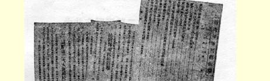
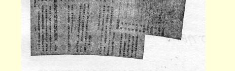
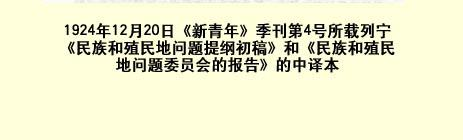

# 在彼得格勒卡·李卜克内西和 ·罗·卢森堡纪念碑奠基典礼群众大会上的讲话９７

> （１９２０年７月１９日）
>
> 报 道

同志们，各国的共产主义带路人遭到了空前的牺牲，在芬兰、 匈牙利以及其他国家里，遭到杀害的数以千计。但是，任何迫害也阻挡不住共产主义的发展，而且象卡尔·李卜克内西和罗莎· 卢森堡这样一些战士的英雄气概使我们精神奋发，对共产主义的彻底胜利充满了信心。（列宁同志的讲话被雷鸣般的“乌拉”声所淹没。奏《国际歌》。）

> 载于１９２０年７月２１日《彼得格勒  译自《列宁全集》俄文第５版真理报》第１５９号  第４１卷第１５８页

> １９２４年１２月２０日《新青年》季刊第４号所载
>
> 列宁《民族和殖民地问题提纲初稿》和
>
> 《民族和殖民地问题委员会的报告》的中译文