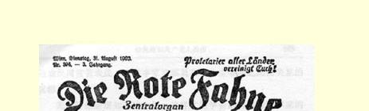
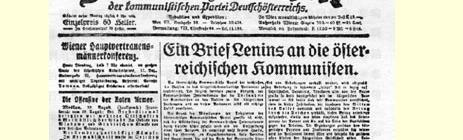
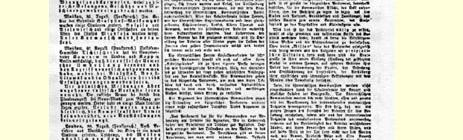
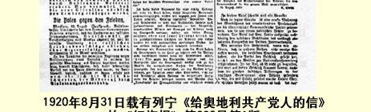

# 给奥地利共产党人的信 １３１

> （１９２０年８月１５日）

奥地利共产党决定抵制资产阶级民主议会的选举。不久前闭幕的共产国际第二次代表大会认为，共产党人**参加**资产阶级议会选举和**参加**议会活动的策略是正确的。

根据奥地利共产党代表的报告来看，我相信奥地利共产党是会把共产国际的决议看得高于一个党的决议的。同样也可以相信， 奥地利社会民主党人这些投靠资产阶级的社会主义叛徒，看到共产国际的决议同奥地利共产党抵制议会的决定有分歧，会采取幸灾乐祸的态度。当然，对于这些奥地利社会民主党人先生，谢德曼和诺斯克之流、阿尔伯·托马和龚帕斯之流的这些同伙采取的幸灾乐祸态度，觉悟工人是会置之不理的。伦纳先生之流向资产阶级献媚讨好，弄得原形毕露。目前在所有国家里，工人反对第二国际即黄色国际英雄们的怒潮日益高涨。

奥地利社会民主党人先生们在资产阶级议会中，在他们“工作” 的一切场所，包括在他们自己的报刊上，都表现出他们实际上是完全受资本家阶级摆布、毫无气节、只会倒来倒去的小资产阶级民主派。我们共产党人参加资产阶级议会，是为了利用这个欺骗工人和劳动者的腐朽透顶的资本主义机关的讲坛来揭穿这种骗局。

奥地利共产党人反对参加资产阶级议会的一个论据，是值得较为仔细地加以分析的。这个论据就是：

> “对共产党人来说，议会的意义只在于它可以作为鼓动的讲坛。我们奥地利有工人代表苏维埃可以作鼓动的讲坛，因此我们拒绝参加资产阶级议会的选举。德国没有真正象样的工人代表苏维埃，因此德国共产党人采取的策略不同。”

我认为这个论据是不正确的。只要我们还没有力量驱散资产阶级议会，我们就应当对议会实行内外夹攻。只要还有相当一部分劳动者（不仅是无产者，而且也有半无产者和小农）相信资产阶级用来欺骗工人的资产阶级民主工具，我们就**正**应当利用**这个讲坛**来揭穿这种骗局，因为这个讲坛是工人中的落后阶层、特别是非无产阶级劳动群众中的落后阶层最重视和最信赖的。

只要我们共产党人还没有力量来夺取国家政权，还不能做到完全由劳动者来选举**自己的**同资产阶级对立的苏维埃，只要资产阶级还掌握国家政权，还号召各阶级参加选举，我们就必须参加选举，以便不仅在无产者中间，而且在全体劳动者中间进行鼓动。 只要资产阶级议会还在欺骗工人，用“民主” 的词句掩盖种种贪污舞弊和收买行为（资产阶级在资产阶级议会中比任何地方更广泛地使用特别“巧妙”的方式来收买作家、议员和律师等等），我们共产党人就应当正是在这个似乎**代表人民意志**而实际上是掩盖 **富人对人民的欺骗**的机关中不断地揭穿这种骗局，揭穿伦纳之流投靠资本家来反对工人的每一件事实。资产阶级各党各派之间的关系正是在议会中最经常地显示出来，而这些关系正是资产阶级社会各阶级之间的关系的反映。因此我们共产党人恰恰应当在资产阶级议会见，从它的内部向人民说明各阶级同各政党、地主同雇

> １９２０年８月３１日载有列宁《给奥地利共产党人的信》的
>
> 《红旗报》第３９６号第１版
>
> （按原版缩小） 农、富裕农民同贫苦农民、大资本家同职员和小业主等等之间的关系的**真相**。

无产阶级必须知道这一切，这样才能学会如何识破资本家的一切卑鄙而又巧妙的伎俩，学会如何去影响小资产阶级群众，影响非无产阶级的劳动群众。无产阶级不懂得这门“学问”，就无法顺利地完成**无产阶级专政**的任务，因为那时，处于新的地位（被推翻的阶级的地位）的资产阶级仍然会在别的阵地上用别的方式来奉行以前的政策，继续愚弄农民，收买和恫吓职员，用“民主”的词句来掩盖其自私自利和卑鄙龌龊的目的。

不，奥地利共产党人决不会被伦纳之流以及诸如此类的资产阶级走狗采取幸灾乐祸的态度所吓倒。奥地利共产党人决不会害怕公开承认国际无产阶级的纪律。我们感到自豪的是，我们在解决工人争取自身解放的重大问题时，遵守革命无产阶级的国际纪律， 考虑到各国工人的经验，估计到他们的认识和意愿，从而在行动上 （不象伦纳之流、弗里茨·阿德勒之流和奥托·鲍威尔之流只是在口头上）实现工人为在全世界建立共产主义而进行的阶级斗争的统一。

### 尼·列宁

１９２０年８月１５日

> 载于１９２０年８月３１日《红旗报》  译自《列宁全集》俄文第５版第３９６号（维也纳）  第４１卷第２６８—２７３页