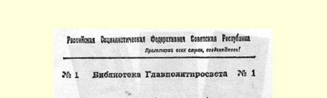
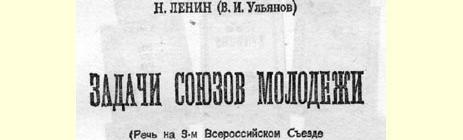
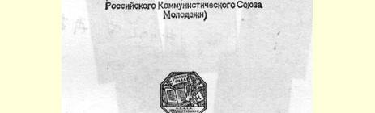
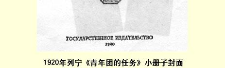

# 青年团的任务

> （在俄国共产主义青年团第三次代表大会上的讲话）１４２
>
> （１９２０年１０月２日）

（大会向列宁热烈欢呼）同志们！今天我想讲的题目是：共产主义青年团的基本任务是什么，以及社会主义共和国内青年组织应当是怎样的组织。

这个问题应当讲一讲，尤其是因为从某种意义上可以说，真正建立共产主义社会的任务正是要由青年来担负。很明显，从资本主义社会培养出来的一代工作者所能完成的任务，至多是消灭建筑在剥削上面的资本主义旧生活方式的基础。他们至多也只能建立这样一种社会制度，这种社会制度帮助无产阶级和劳动阶级保持自己的政权，奠定巩固的基础，至于在这个基础上进行建设，那就只有靠在新条件下，在人与人之间的剥削关系已不存在的情况下参加工作的一代人去担负。

如果根据这一点来看青年的任务，就应当说，全体青年的任务，尤其是共产主义青年团及其他一切组织的任务，可以用一句话来表达：就是要学习。

当然，这仅仅是“一句话”，还没有答复主要的和最本质的问题 —— 学习什么和怎样学习。而这里的全部关键就在于：在改造资本主义旧社会的同时，将来要建设共产主义社会的新一代人的训练、 培养和教育，就不能再象从前那样了。青年的训练、培养和教育应当以旧社会遗留给我们的材料为出发点。我们只能利用旧社会遗留给我们的全部知识、组织和机关，在旧社会遗留下来的人力和物力的条件下建设共产主义。只有把青年的训练、组织和培养这一事业加以根本改造，我们才能做到：青年一代努力的结果将建立一个与旧社会完全不同的社会，即共产主义社会。因此，我们需要详细论述的问题，就是我们应当教给青年什么；真正想无愧于共产主义青年称号的青年应当怎样学习；以及应当如何培养青年，使他们能够彻底完成我们已经开始的事业。

我应当指出，看来首先的和理所当然的回答是：青年团和所有想走向共产主义的青年都应该学习共产主义。

但是“学习共产主义”这个回答未免太笼统了。为了学会共产主义，我们应该怎样呢？为了学到共产主义知识，我们应该从一般知识的总和中吸取哪些东西呢？这里我们可能遇到许多危险，如果把学习共产主义的任务提得不正确，或者对这一任务理解得太片面，往往就会出现危险。

初看起来，总以为学习共产主义就是领会共产主义教科书、小册子和著作虽所讲的一切知识。但是，给学习共产主义下这样的定义，就未免太草率、太不全面了。如果说，学习共产主义只限于领会共产主义著作、书本和小册子里的东西，那我们就很容易造就出一些共产主义的书呆子或吹牛家，而这往往会使我们受到损害，因为这种人虽然把共产主义书本和小册子上的东西读得烂熟，却不善于把所有这些知识融会贯通，也不会按共产主义的真正要求去行动。

资本主义旧社会留给我们的最大祸害之一，就是书本与生活

> １９２０年列宁《青年团的任务》小册子封面
>
> （按原版缩小） 实践完全脱节，因为那些书本把什么都描写得好得了不得，其实大半都是最令人厌恶的谎言，虚伪地向我们描绘了资本主义社会的情景。

因此，单从书本上来领会关于共产主义的论述，是极不正确的。现在我们的讲话和文章，已经不是简单地重复以前对共产主义所作的那些论述，因为我们的讲话和文章都是同日常各方面的工作联系着的。离开工作，离开斗争，那么从共产主义小册子和著作中得来的关于共产主义的书本知识，可以说是一文不值，因为这样的书本知识仍然会保持旧时的理论与实践的脱节，而这正是资产阶级旧社会的一个最令人厌恶的特征。

如果我们只求领会共产主义的口号，那就更危险了。我们若不及时认清这种危险，不用全力来消除这种危险，那么５０万至１００ 万男女青年这样学了共产主义之后，将自称为共产主义者，这就只会使共产主义事业遭到莫大的损害。

这样就向我们提出一个问题：为了学习共产主义，我们应该怎样把这一切结合起来？从旧学校和旧的科学中，我们应当吸取一些什么？旧学校总是说，它要造就知识全面的人，它教的是一般科学。 我们知道，这完全是撒谎，因为过去整个社会赖以生存和维持的基础，就是把人分成阶级，分成剥削者和被压迫者。自然，贯串着阶级精神的旧学校，也就只能向资产阶级的子女传授知识。这种学校里的每一句话，都是根据资产阶级的利益捏造出来的。在这样的学校里，与其说是教育工农的年青一代，倒不如说是对他们进行符合资产阶级的利益的训练。教育这些青年的目的，就是训练对资产阶级有用的奴仆，使之既能替资产阶级创造利润，又不会惊扰资产阶级的安宁和悠闲。因此在否定旧学校的时候，我们给自己提出的任务是：从这种学校中只吸取我们实行真正共产主义教育所必需的东西。

这里我要谈谈经常听到的人们对旧学校的斥责与非难，从这些话中，往往会得出完全不正确的结论。有人说，旧学校是死读书的学校，实行强迫纪律的学校，死记硬背的学校。这说得对，但是， 要善于把旧学校中的坏东西同对我们有益的东西区别开来，要善于从旧学校中挑选出共产主义所必需的东西。

旧学校是死读书的学校，它迫使人们学一大堆无用的、累赘的、死的知识，这种知识塞满了青年一代的头脑，把他们变成一个模子倒出来的官吏。但是，如果你们试图从这里得出结论说，不掌握人类积累起来的知识就能成为共产主义者，那你们就犯了极大的错误。如果以为不必领会共产主义本身借以产生的全部知识，只要领会共产主义的口号，领会共产主义科学的结论就足够了，那是错误的。共产主义是从人类知识的总和中产生出来的，马克思主义就是这方面的典范。

你们读过和听说过：主要由马克思创立的共产主义理论，共产主义科学，即马克思主义学说，已经不仅仅是１９世纪一位社会主义者—— 虽说是天才的社会主义者—— 的个人著述，而成为全世界千百万无产者的学说；他们已经运用这个学说在同资本主义作斗争。如果你们要问，为什么马克思的学说能够掌握最革命阶级的千百万人的心灵，那你们只能得到一个回答：这是因为马克思依靠了人类在资本主义制度下所获得的全部知识的坚固基础；马克里研究了人类社会发展的规律，认识到资本主义的发展必然导致共产主义，而主要的是他完全依据对资本主义社会所作的最确切、最缜密和最深刻的研究，借助于充分掌握以往的科学所提供的全部知识而证实了这个结论。凡是人类社会所创造的一切，他都有批判地重新加以探讨，任何一点也没有忽略过去。凡是人类思想所建树的一切，他都放在工人运动中检验过，重新加以探讨，加以批判，从而得出了那些被资产阶级狭隘性所限制或被资产阶级偏见束缚住的人所不能得出的结论。

例如，当我们谈到无产阶级文化的时候，就必须注意这一点。 应当明确地认识到，只有确切地了解人类全部发展过程所创造的文化，只有对这种文化加以改造，才能建设无产阶级的文化，没有这样的认识，我们就不能完成这项任务。无产阶级文化并不是从天上掉下来的，也不是那些自命为无产阶级文化专家的人１４３杜撰出来的。如果硬说是这样，那完全是一派胡言。无产阶级文化应当是人类在资本主义社会、地主社会和官僚社会压迫下创造出来的全部知识合乎规律的发展。条条大道小路一向通往，而且还会通往无产阶级文化，正如马克思改造过的政治经济学向我们指明人类社会必然走到那一步，指明必然过渡到阶级斗争，过渡到开始无产阶级革命。

当我们听到有些青年以及某些维护新教育制度的人常常非难旧学校，说它是死记硬背的学校时，我们就告诉他们，我们应当吸取旧学校中的好东西。我们不应当吸取旧学校的这样一种做法，即用无边无际的、九分无用一分歪曲了的知识来充塞青年的头脑，但是这并不等于说，我们可以只学共产主义的结论，只背共产主义的口号。这样是建立不了共产主义的。只有了解人类创造的一切财富以丰富自己的头脑，才能成为共产主义者。

我们不需要死记硬背，但是我们需要用对基本事实的了解来发展和增进每个学习者的思考力，因为不把学到的全部知识融会贯通，共产主义就会变成空中楼阁，就会成为一块空招牌，共产主义者也只会是一些吹牛家。你们不仅应该掌握知识，而且应该用批判的态度来掌握这些知识，不是用一堆无用的垃圾来充塞自己的头脑，而是用对一切事实的了解来丰富自己的头脑，没有这种了解就不可能成为一个现代有学识的人。如果一个共产主义者不下一番极认真、极艰苦而巨大的工夫，不弄清他必须用批判的态度来对待的事实，便想根据自己学到的共产主义的现成结论来炫耀一番， 这样的共产主义者是很可悲的。这种不求甚解的态度是极端有害的。要是知道自己懂得太少，那就要设法使自己懂得多一些，但是如果有人说自己是共产主义者，同时又认为自己根本不需要任何扎实的知识，那他就根本不能成为共产主义者。

旧学校培养资本家所需要的奴仆，把科学人才训练成迎合资本家口味来写作和说话的人。因此我们必须废除这样的学校。我们应当废除这样的学校，摧毁这样的学校，但这是不是说，我们就不应当从这种学校里吸取人类所积累起来而为人们所必需的一切呢？这是不是说，我们就不应当去区别哪些是资本主义所需要的东西，哪些是共产主义所需要的东西呢？

我们废除资产阶级社会内违反大多数人的意志而实行的强迫纪律，代之以工农的自觉纪律，工人和农民不但仇恨旧社会，而且有毅力、有本领、有决心团结和组织力量去进行这一斗争，以便把散居在辽阔国土上的分散而互不联系的千百万人的意志统一为一个意志，因为没有这样的统一意志，我们就必然会遭到失败，没有这样的团结，没有这样的工农的自觉纪律，我们的事业就毫无希望。不具备这些条件，我们就不能战胜全世界的资本家和地主。我们就会连基础也不能巩固，更谈不到在这个基础上建成共产主义新社会了。同样，我们否定旧学校，对旧学校怀着完全正当和必要的仇恨心理，珍视那种要摧毁旧学校的决心，但是我们应当了解， 废除以前的死读书、死记硬背和强迫纪律时，必须善于吸取人类的全部知识，并要使你们学到的共产主义不是生吞活剥的东西，而是经过你们深思熟虑的东西，是从现代教育观点上看来必然的结论。

我们在谈论学好共产主义这一任务时就应该这样来提出基本任务。

为了向你们说明这一点，同时也谈谈怎样学习的问题，让我举一个实际例子。你们都知道，紧接着军事任务即保卫共和国的任务之后，我们即将面临经济任务。我们知道，如果不恢复工业和农业 （而且必须不按旧方式来恢复），那么共产主义社会是建设不成的。 必须在现代最新科学成就的基础上恢复工业和农业。你们知道，这样的基础就是电；只有全国电气化，一切工业和农业部门都电气化的时候，只有当你们真正担负起这个任务的时候，你们才能替自己建成老一代人所不能建成的共产主义社会。你们面临的任务是振兴全国的经济，要在立足于现代科学技术、立足于电力的现代技术基础上使农业和工业都得到改造和恢复。你们完全了解，不识字的人实现不了电气化，而且仅仅识字还不够。只懂得什么是电还不够，还应该懂得怎样在技术上把电应用到工农业上去，应用到工农业的各个部门中去。你们自己必须学会这一点，而且还要教会全体劳动青年。这就是一切有觉悟的共产主义者的任务，也就是每一个认为自己是共产主义者的青年，每一个明确地认识到加入共产主义青年团之后就负起了帮助党建设共产主义、帮助整个青年一代建立共产主义社会的责任的青年的任务。每个青年必须懂得，只有受了现代教育，他才能建立共产主义社会，如果不受这种教育，共产主义仍然不过是一种愿望而已。

老一代人的任务是推翻资产阶级。那时的主要任务是批判资产阶级，激发起群众对资产阶级的仇恨，提高阶级觉悟，提高团结自己力量的本领。新一代人面临的任务就比较复杂了。你们不只是应当团结自己的一切力量来支持工农政权抗击资本家的侵犯。 这一点你们应当做到。这一点你们完全了解，每个共产主义者都非常清楚。但是这还不够。你们应当建成共产主义社会。前一半工作在许多方面已经完成了。旧东西应该摧毁，而且已经摧毁了，它应该变成废墟，而且已经变成了废墟。地基已经清理好，年青一代的共产主义者应当在这块地基上建设共产主义社会。你们当前的任务是建设，你们只有掌握了一切现代知识，善于把共产主义由背得烂熟的现成公式、意见、方案、指示和纲领变成能把你们的直接工作统一起来的活生生的东西，把共产主义变成你们实际工作的指针，那时才能完成这个任务。

这就是你们在教育、培养和发动整个青年一代的事业中应当执行的任务。你们应该是千百万共产主义社会建设者的带头人，一切男女青年都应该成为这样的建设者。不吸收全体工农青年参加共产主义建设，你们就不能建成共产主义社会。

这里我自然要讲到这样的问题：我们应当怎样教授共产主义， 我们的方法应该有什么特点。

我在这里首先要谈谈共产主义道德问题。

你们应当把自己培养成共产主义者。青年团的任务就是要这样来安排自己的实际活动：使团员青年在学习、组织、团结和斗争的过程中把他们自己和那些以他们为带头人的人都培养成共产主义者。应该使培养、教育和训练现代青年的全部事业，成为培养青年的共产主义道德的事业。

但是，究竟有没有共产主义道德呢？有没有共产主义品德呢？ 当然是有的。人们往往硬说我们没有自己的道德；资产阶级常常给我们加上一个罪名，说我们共产主义者否定任何道德。这是一种偷换概念、蒙骗工农的手段。

究竟在什么意义上我们否定道德，否定品德呢？

是在资产阶级所宣传的道德的意义上，这种道德是他们从上帝的意旨中引伸出来的。关于这一点，我们当然说，我们不信上帝， 并且我们十分清楚，僧侣、地主和资产阶级都假借上帝的名义说话，为的是谋求他们这些剥削者自身的利益。或者他们不是从道德的要求，不是从上帝的意旨，而是从往往同上帝意旨很相似的唯心主义或半唯心主义论调中引伸出这种道德来的。

我们否定从超人类和超阶级的概念中引出的这一切道德。我们说这是欺骗，这是为了地主和资本家的利益来愚弄工农，禁锢工农的头脑。

我们说，我们的道德完全服从无产阶级阶级斗争的利益。我们的道德是从无产阶级阶级斗争的利益中引伸出来的。

旧社会建筑在地主和资本家压迫全体工农的基础上。我们应当摧毁这个社会，应该打倒这些压迫者，为了这个目的就必须团结起来。而上帝是不会创造这种团结的。

只有工厂，只有受过训练的、从过去的沉睡中觉醒过来的无产阶级，才能创造这种团结。只有当这个阶级已经形成的时候，群众运动才开展起来，才造成了现在我们看到的情形，即无产阶级革命在一个极弱的国家中获得了胜利，这个国家三年来抗击了全世界资产阶级对它的进攻。同时我们还看到，无产阶级革命在全世界日益发展。现在我们可以根据实际经验来说，只有无产阶级才能创造一种团结一致的力量，这种力量在引导分散的农民，并且经受住了剥削者的一切进攻。只有这个阶级才能帮助劳动群众联合起来、团结起来，彻底捍卫和巩固共产主义社会，最终建成共产主义社会。

因此，我们说：在我们看来，超人类社会的道德是没有的；那是一种欺骗。在我们看来，道德是服从于无产阶级阶级斗争的利益的。

这种阶级斗争究竟是什么呢？这就是推翻沙皇，打倒资本家， 消灭资本家阶级。

阶级究竟是怎么回事呢？这就是允许社会上一部分人占有别人的劳动。如果社会上一部分人占有全部土地，那就有了地主阶级和农民阶级；如果社会上一部分人拥有工厂，拥有股票和资本， 而另一部分人却在这些工厂里做工，那就有了资本家阶级和无产者阶级。

赶走沙皇并不困难，这总共用了几天的工夫。赶走地主也不很困难，这在几个月内就做到了；赶走资本家同样也不是很困难的事情。但是，要消灭阶级就无比困难了；工人和农民的区分仍然存在。如果一个农民单独占用一块土地，拥有余粮，即他本人及其家畜都不需要的粮食，而别人却没有粮食吃，那么这个农民也就变成剥削者了。他剩余的粮食愈多，获利就愈大，至于别人， 就让他们挨饿去吧，“他们愈饿，我的粮食就卖得愈贵”。应该使所有的人都按照一个共同的计划和共同的规章，在公共的土地上和公共的工厂中工作。这容易做到吗？你们知道，要做到这一点， 决不象赶走沙皇、地主和资本家那样容易。这里需要无产阶级去重新教育和改造一部分农民，把劳动农民争取过来，以便消灭那些富裕的和专靠别人贫困来发财致富的农民的反抗。可见，无产阶级斗争的任务，并没有因为推翻了沙皇、赶走了地主和资本家而宣告结束，我们称之为无产阶级专政的制度，正是要来完成这项任务。

阶级斗争还在继续，只是改变了形式。这是无产阶级为了使旧的剥削者不能卷土重来，使分散的愚昧的农民群众联合起来而进行的阶级斗争。阶级斗争在继续，我们的任务就是要使一切利益都服从这个斗争。我们也要使我们的共产主义道德服从这个任务。我们说：道德是为摧毁剥削者的旧社会、把全体劳动者团结到创立共产主义者新社会的无产阶级周围服务的。

共产主义道德是为这个斗争服务的道德，它把劳动者团结起来反对一切剥削，反对一切小私有制，因为小私有制把全社会的劳动所创造的成果交给了个人。而在我国，土地已经是公共财产了。

如果我从这个公共财产中拿一块土地来，种出超过我的需要一倍的粮食，然后用余粮来投机倒把，那又怎样呢？如果我这样盘算：饿肚子的人愈多，我出卖粮食的价钱就愈高，那又怎样呢？ 难道我这是共产主义者的行为吗？绝对不是，这是剥削者的行为， 私有者的行为。应该同这种行为作斗争。如果听之任之，那一切都会开倒车，回复到资本家的政权，资产阶级的政权，就象过去一些革命中常有的情形那样。因此，为了不让资本家和资产阶级的政权恢复，就要禁止投机买卖，就要使某些人不能用损人利己的手段来发财致富，就要使劳动者同无产阶级团结起来建设共产主义社会。这也就是共产主义青年团和共产主义青年组织基本任务的主要特征。

旧社会依据的原则是：不是你掠夺别人，就是别人掠夺你；不是你给别人做工，就是别人给你做工；你不是奴隶主，就是奴隶。 可见，凡是在这个社会里教养出来的人，可以说从吃母亲奶的时候起就接受了这种心理、习惯和观点—— 不是奴隶主，就是奴隶， 或者是小私有者、小职员、小官吏、知识分子，总之，是一个只关心自己而不顾别人的人。

既然我种我的地，别人的事就与我无关；别人要是挨饿，那更好，我可以抬高价格出卖我的粮食。如果我有了一个医生、工程师、教员或职员的小职位，那么别人的事也与我无关。也许，只要我讨好、巴结有权势的人，就不仅能保住我的小职位，还可以爬到资产者的地位上去。共产主义者就不能有这种心理和情绪。当工人和农民已经证明我们能用本身的力量捍卫自己并且创造新社会的时候，也就开始了新的共产主义的教育，反对剥削者的教育， 同无产阶级联合起来反对利己主义者和小私有者，反对“我赚我的钱，其他一切都与我无关” 的心理和习惯的教育。

这就是对青年一代应该怎样学习共产主义的回答。

青年们只有把自己的训练、培养和教育中的每一步骤同无产者和劳动者不断进行的反对剥削者的旧社会的斗争联系起来，才能学习共产主义。当人们向我们讲到道德的时候，我们回答说：在共产主义者看来，全部道德就在于这种团结一致的纪律和反对剥削者的自觉的群众斗争。我们不相信有永恒的道德，并且要揭穿一切关于道德的骗人的鬼话。道德是为人类社会上升到更高的水平，为人类社会摆脱对劳动的剥削服务的。

要实现这一点，必须有这样的青年一代，他们在有纪律地同资产阶级作殊死斗争中已开始成为自觉的人。在这个斗争中，他们中间一定会培养出真正的共产主义者，他们应当使自己的训练、 教育和培养中的每一步骤都服从这个斗争，都同这个斗争联系起来。培养共产主义青年，决不是向他们灌输关于道德的各种美丽动听的言词和准则。我们要培养的并不是这些。当人们看到他们的父母在地主和资本家的压迫下怎样生活的时候，当他们自己分担那些开始同剥削者作斗争的人们所受的痛苦的时候，当他们看到为了继续这一斗争以保卫已经取得的成果，付出了多大的牺牲， 看到地主和资本家是多么疯狂的敌人的时候，他们就在这种环境中培养成为共产主义者。为巩固和完成共产主义事业而斗争，这就是共产主义道德的基础。这也就是共产主义培养、教育和训练的基础。这也就是对应该怎样学习共产主义的回答。

训练、培养和教育要是只限于学校以内，而与沸腾的实际生活脱离，那我们是不会信赖的。只要工农还受地主和资本家的压迫，只要学校还操纵在地主和资本家手里，青年一代就仍然是愚昧无知的。可是我们的学校应当使青年获得基本知识，使他们自己能够培养共产主义的观点，应该把他们培养成有学识的人。我们的学校应当使人们在学习期间就成为铲除剥削者这一斗争的参加者。共产主义青年团只有把自己的训练、培养和教育中的每一步骤同参加全体劳动者反对剥削者的总斗争联系起来，才符合共产主义青年团这一称号。你们很清楚：目前俄国还是唯一的工人共和国，世界其他各地还存在着资产阶级旧制度，我们还比它们弱；我们随时都有遭到新的进攻的危险；只有学会团结一致，我们才能在今后的斗争中获得胜利，而我们得到巩固之后，就会成为真正不可战胜的力量。因此，做一个共产主义者，就要把全体青年都组织和团结起来，要在这个斗争中作出有教养和守纪律的榜样。那时你们才能着手建设并彻底建成共产主义社会的大厦。

为了把这一点说得更清楚，我来给你们举个例子。我们把自己叫作共产主义者。什么是共产主义者呢？共产主义者是个拉丁词，ｃｏｍｍｕｎｉｓ一词是“公共”的意思。共产主义社会就意味着土地、工厂都是公共的，实行共同劳动—— 这就是共产主义。

如果每个人都单独经营一块土地，那劳动能是共同的吗？共同劳动不是一下子就能实行的。这是不可能的事。共同劳动不是从天上掉下来的。它需要经过艰苦努力和创造，要在斗争进程中才能实行。这里不能靠旧的书本，书本是谁也不会相信的。这里要靠自己的生活经验。当高尔察克从西伯利亚，邓尼金从南方进攻时，农民是站在他们那边的。当时农民不欢迎布尔什维主义，因为布尔什维克按固定价格收购粮食。但是农民在西伯利亚和乌克兰尝到了高尔察克和邓尼金的政权的滋味之后，就认清了农民没有别的选择余地：或者投奔资本家，那么资本家就要你去给地主当奴隶；或者跟着工人走，虽然工人没有许愿让你过天堂般的生活，而且还要你在艰苦的斗争中遵守铁的纪律并具有坚强的意志， 可是他们却能使你摆脱资本家和地主的奴役。甚至是那些愚昧无知的农民，只要根据亲身的经验懂得和认识了这一点，也就成了自觉的、经过艰苦磨炼的共产主义拥护者。共产主义青年团也应当把这种经验作为自己全部活动的基础。

我已经回答了我们应当学什么，应该从旧学校和旧科学中吸取什么的问题。现在我还想来回答一下应当怎样学习这些东西的问题。我的回答是：只有把学校活动的每一步骤，把培养、教育和训练的每一步骤，同全体劳动者反对剥削者的斗争密切联系起来。

我要从某些青年组织的工作经验中举出几个例子，向你们具体说明应该怎样进行这种共产主义教育。大家都在谈论扫除文盲。 你们知道，在一个文盲的国家里是不能建成共产主义社会的。单靠苏维埃政权颁布一道命令，或者靠党提出一定的口号，或者派一部分优秀的工作人员去进行这项工作，那是不够的。还需要青年一代自己把这个工作担负起来。共产主义精神体现在参加青年团的男女青年自己站出来说：这是我们的事情，我们要联合起来到农村去扫除文盲，使我们这代青年中不再有文盲。我们要努力使青年们能主动积极地从事这个工作。你们知道，要把俄国从一个愚昧的文盲国家很快变成人人识字的国家是不可能的；但是，如果青年团能担负起这个工作，如果全体青年都能为大家的利益而工作，那么这个团结着４０万青年男女的组织，就有权称为共产主义青年团了。青年团的任务还在于：除了掌握各种知识，还要帮助那些靠自己的力量摆脱不了文盲愚昧状况的青年。做一个青年团员，就要把自己的工作和精力全部贡献给公共事业。这就是共产主义教育。只有在这样的工作中，青年男女才能培养成真正的共产主义者。只有当他们在这种工作中取得实际的成绩时，他们才会成为共产主义者。

就拿城郊菜园工作来做例子吧。难道这不是该做的事吗？这也是共产主义青年团的任务之一。人民在挨饿，工人在挨饿。为了不再挨饿，应该发展菜园，但是耕作还在按旧的方式进行。因此必须让觉悟较高的人来担任这个工作，这样你们就会看到，菜园数目会增加，面积会扩大，效果会更好。共产主义青年团应当积极参加这个工作。每个青年团组织，每个青年团支部，都必须把这件事看成是自己的事情。

共产主义青年团应当是一支能够支援各种工作、处处都表现出主动性和首创精神的突击队。青年团应当成为这样的一个团体， 使每个工人都感觉到，这个团体中人们所讲的学说也许是他不了解的，也许是他还不能一下子就相信的，但是从这些人的实际工作和活动可以看出，他们真正是能给他指明正确道路的人。

如果共产主义青年团不能在各方面这样来安排自己的工作， 那就说明它走上了资产阶级的老路。我们的教育应当同劳动者反对剥削者的斗争结合起来，以便帮助劳动者完成共产主义学说提出的任务。

青年团员应当利用自己的每一刻空闲时间去改善菜园工作， 或在某个工厂里组织青年学习等等。我们要把俄国这个贫穷落后的国家变成一个富裕的国家。因此共产主义青年团必须把自己的教育、训练和培养同工农的劳动结合起来，不要关在自己的学校里，不要只限于阅读共产主义书籍和小册子。只有在与工农的共同劳动中，才能成为真正的共产主义者。必须使大家都看到，入团的青年个个都是有文化的，同时又都善于劳动。当大家看到，我们已经废除了旧学校里的旧的强迫纪律，代之以自觉的纪律，看到每个青年都去参加星期六义务劳动，看到他们利用每个近郊菜园来帮助居民，那时人民就不会用从前的眼光来看待劳动了。

共产主义青年团的任务，是要在农村或自己的街道上帮助做些事情，我举一个小例子，象卫生工作或分配食物的工作。在资本主义旧社会里，这些事情是怎样进行的呢？那时每个人只为自己工作，谁也不注意这里有没有老人或病人；或者全部家务都压在妇女肩上，因而妇女处在受压迫受奴役的地位。谁应当来反对这种现象呢？青年团。青年团应当出来说：我们要改变这种状况， 我们组织青年队经常到各家各户去，协助搞卫生工作或分配食物， 正确地调配力量，有组织地为全社会的利益工作，让大家看到，劳动应该是有组织的劳动。

现在５０岁左右的这一代人，是不能指望看到共产主义社会了，那时候他们都死了。至于现在１５岁的这一代人，就能够看到共产主义社会，也要亲手建设这个社会，因而他们就应当知道，他们终身的全部任务就是建设这个社会。在旧社会中，是各家各户单独劳动，除了压迫老百姓的地主和资本家外，谁也没有组织过劳动。任何一种劳动，不管它怎样脏，怎样吃力，我们都应当把它组织起来，使每个工人和农民对自己都有这样的认识：我是自由劳动大军的一分子，不需要地主和资本家，我自己就会建设自己的生活，建立共产主义的秩序。共产主义青年团要使大家从小[^1] 就在自觉的有纪律的劳动中受教育。这样我们才有希望完成现在所提出的任务。我们应该估计到，要全国实现电气化，使我国贫瘠化了的土地能采用最新的技术来经营，至少要花１０年工夫。因此，现在是１５岁、再过１０—２０年就会生活在共产主义社会里的这一代人，应当这样安排自己的全部学习任务：在每个乡村和城市里，青年每天都能实际完成共同劳动中的某种任务，哪怕是最微小、最平常的任务。能否保证共产主义建设成功，就要看这个工作在每个乡村里进行得怎样，就要看共产主义竞赛开展得怎样， 就要看青年组织自己的劳动本领怎样。只有根据共产主义建设的成绩来检查自己的每一步骤，只有经常问问自己：为了成为团结一致的自觉的劳动者，我们是否做到了所要做的一切—— 只有这样，共产主义青年团才能把自己的５０万团员联合成一支劳动大军并且赢得普遍的尊敬。（掌声如雷）

> 载于１９２０年１０月５、６和７日  译自《列宁全集》俄文第５版 《真理报》第２２１、２２２和２２３号  第４１卷第２９８—３１８页

[^1]: １９２０年１０月７日的《真理报》第２２３号上刊印的不是“从小”，而是“从１２岁起”。—— 编者注