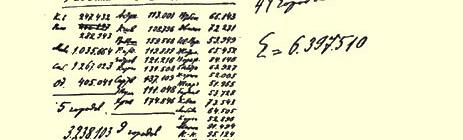

# 第八章国内市场的形成

现在我们把前几章中考察过的资料作一总结，并想说明一下国民经济各个部门在其资本主义发展中的相互依存关系。

### 一 商品流通的增长

大家都知道，商品流通先于商品生产，并且是商品生产产生的条件之一（但不是唯一的条件）。在本书中，我们把自己的任务只限于分析商品生产与资本主义生产的资料，因此不打算详细分析商品流通在改革后的俄国的增长这个重要问题。为了使人对国内市场的增长速度有一个总的认识，只要简短地指出下面这些情况就够了。

俄国的铁路网从１８６５年的３８１９公里增长到１８９０年的 ２９０６３公里[^1]，即增加６倍多。英国迈出这样的一步用了较长的时间（１８４５年为４０８２公里，１８７５年为２６８１９公里，增加了５倍），德国则用了较短的时间（１８４５年为２１４３公里，１８７５年为２７９８１公里，增加了１１倍）。每年敷设的铁路俄里数在各个不同的时期变动很大：例如，在１８６８—１８７２年这５年中敷设了８８０６俄里，而在 １８７８—１８８２年这５年中只敷设了２２２１俄里。[^2]根据这种变动的幅度，可以判断资本主义需要多么庞大的失业工人后备军，因为资本主义时而扩大对工人的需求，时而又缩小对工人的需求。在俄国铁路建设的发展中，曾经有两个大高涨时期：６０年代末（和７０年代初）以及９０年代后半期。从１８６５年到１８７５年，俄国铁路网平均每年增加１５００公里，而从１８９３年到１８９７年，平均每年增加大约 ２５００公里。

铁路货运量如下：１８６８年为４３９００万普特；１８７３年为１１１７００ 万普特；１８８１年为２５３２００万普特；１８９３年为４８４６００万普特；１８９６ 年为６１４５００万普特；１９０４年为１１０７２００万普特。客运增长的速度也很快：１８６８年为１０４０万人；１８７３年为２２７０万人；１８８１年为 ３４４０万人；１８９３年为４９４０万人；１８９６年为６５５０万人；１９０４年为 １２３６０万人。[^3]

水路运输的发展如下（全俄的资料）[^4]： 年代

汽  船船上职工人数

数目马力船只共计船只共计汽船共计

其他船（单位百万普特）（单位百万卢布）

舶数目汽船其他汽船其他其他

载 重 量船的价值

船只 １８８４１２４６７２１０５２００９５６．１３６２３６８．１４８．９３２．１８１１８７６６９４０９９１１２８６５ １８９０１８２４１０３２０６２０１２５９．２４０１４１０．２７５．６３８．３１１３．９２５８１４９０３５６１１６１７０ １８９５２５３９１２９７５９２０５８０１２．３５２６．９５３９．２９７．９４６．０１４３．９３２６８９８５６０８１１８２９７

欧俄内河货运量，１８８１年为８９９７０万普特；１８９３年为１１８１５０ 万普特；１８９６年为１５５３００万普特。运费在以上各年为１８６５０万卢布、２５７２０万卢布、２９０００万卢布。

俄国的商船队在１８６８年有汽船５１艘，装载量为１４３００拉斯特[^5]，又有帆船７００艘，装载量为４１８００拉斯特，而在１８９６年则有汽船５２２艘，装载量为１６１６００拉斯特[^6]。

外海各港口商轮航运业的发展如下：在１８５６—１８６０年这５年间，出入的船舶数目平均每年为１８９０１艘，装载量为３７８３０００吨； 在１８８６—１８９０年，平均每年为２３２０１艘（增加２３％），装载量为 １３８４５０００吨（增加２６６％）。因此，装载量增加２３倍。在３９年间 （从１８５６年到１８９４年），装载量增加了４．５倍；如果把俄国船舶和外国船舶区别开来，那么俄国船舶数目在这３９年间增加了２．４倍 （从８２３艘增加到２７８９艘），装载量增加了１１．１倍（从１１２８００吨增加到１３６８０００吨），而外国船舶数目增加了１６％（从１８２８４艘增加到２１１６０艘），装载量增加了４．３倍（从３４４８０００吨增加到 １８２６７０００吨）。[^7]我们指出，出入船舶的装载量在各个年份也有很大的变动（例如，１８７８年为１３００万吨，１８８１年为８６０万吨），根据这种变动部分地可以判断对小工、码头工人等等的需求的变动。资本主义在这里也需要这样一大批人的存在，他们始终需要工作，准

> 鉴》１９０６年圣彼得堡版。 [^8] 《军事统计汇编》第４４５页。《俄国的生产力》第１７编第４２页。１８９８年《财政与工
>
> 商业通报》第４４期。 [^9] **拉斯特**是俄国在２０世纪初以前使用的商船容量单位，等于５．６６３立方米，重量
>
> 约为两吨。—— 编者注 [^10] 《军事统计汇编》第７５８页和《财政部年鉴》第１编第３６３页。《俄国的生产力》第
>
> １７编第３０页。 [^11] 《俄国的生产力》，俄国对外贸易，第５６页及以下各页。 备一有召唤就着手工作，不管这种工作是多么的不固定。

对外贸易的发展，从下面的资料可以看出来[^12]：

> 俄国居民数目进出口总值人均对外
>
> 年  代（芬兰除外，（单位百万贸易额
>
> 单位百万）纸卢布）（单位卢布）
>
> １８５６—１８６０６９．０３１４．０４．５５
>
> １８６１—１８６５７３．８３４７．０４．７０
>
> １８６６—１８７０７９．４５５４．２７．００
>
> １８７１—１８７５８６．０８３１．１９．６６
>
> １８７６—１８８０９３．４１０５４．８１１．２９
>
> １８８１—１８８５１００．６１１０７．１１１．００
>
> １８８６—１８９０１０８．９１０９０．３１０．０２
>
> １８９７—１９０１１３０．６１３２２．４１０．１１

下面的资料使人对银行周转和资本积累的数额有一个总的认识。国家银行的放款总额，从１８６０—１８６３年的１１３００万卢布 （１８６４—１８６８年是１７０００万卢布）增加到１８８４—１８８８年的６２０００ 万卢布，而活期存款总额则从１８６４—１８６８年的３３５００万卢布增加到１８８４—１８８８年的１４９５００万卢布。[^13]信贷社和信贷所（农业的与工业的）周转额，从１８７２年的２７５万卢布（１８７５年是２１８０万卢布）增加到１８９２年的８２６０万卢布，１９０３年的１８９６０万卢布。[^14]土地抵押贷款从１８８９年到１８９４年增加的数额如下：抵押土地的估价额从１３９５００万卢布增加到１８２７００万卢布，而贷款数额则从 ７９１００万卢布增加到１０４４００万卢布。[^15]储金局的业务在８０年代与 ９０年代特别发展。１８８０年，这类储金局有７５家，１８９７年则有４３１５ 家（其中有３４５４家是邮电储金局）。存款，１８８０年为４４０万卢布， １８９７年为２７６６０万卢布。年底存款额，１８８０年为９００万卢布，１８９７ 年为４９４３０万卢布。就资本的年增长额来看，特别显著的是１８９１ 年与１８９２年这两个**荒**年（５２９０万卢布与５０５０万卢布）以及最近两年（１８９６年为５１６０万卢布，１８９７年为６５５０万卢布）。[^16]

最近的资料表明储金局有了更大的发展。在１９０４年，全俄共有储金局６５５７家，存户为５１０万，存款总额为１１０５５０万卢布。附带说一句，在我国，不论是老民粹派，还是社会主义运动中的新机会主义者，都不止一次地发表很天真的言论（说得客气些），说什么储金局的增加是“人民”富裕的标志。因此，把俄国（１９０４年）与法国（１９００年—１９０１年《劳动局公报》第１０号的资料）的这些储金局的存款划分状况作一比较，也许不是多余的。

> 俄   国
>
> 存款数目百分比百分比
>
> 存户数目存款总额
>
> （单位千）（单位百万卢布） ２５卢布以下者１８７０．４３８．７１１．２１．２ ２５—１００卢布者９６７．７２０．０５２．８５．４ １００—５００卢布者１３８０．７２８．６３０８．０３１．５ 超过５００卢布者６１５．５１２．７６０５．４６１．９

**共 计**４８３４．３１００９７７．４１００

> 法   国
>
> 存款数目百分比百分比
>
> 存户数目存款总额
>
> （单位千）（单位百万卢布） １００法郎以下者５２７３．５５０．１１４３．６３．３ １００—５００法郎者２１９７．４２０．８４９３．８１１．４ ５００—１０００法郎者１１１３．８１０．６７２０．４１６．６ 超过１０００法郎者１９４８．３１８．５２９７９．３６８．７

**共 计**１０５３３．０１００４３３７．１１００

这里有多少材料可以用来为民粹派、修正主义者、立宪民主党人辩护啊！值得注意的是，俄国的存款也是根据存户的１２类行业和职业划分的。我们看到，存款最多的是从事农业与乡村手工业的人，达２２８５０万卢布，这些存款增加得特别迅速。乡村正在开化，靠农夫破产去办工业日益变得有利。

还是回到我们眼前的题目吧。我们看到，这些资料证明了商品流通与资本积累的巨大增长。至于国民经济各部门中的投资场所怎样形成，商业资本如何转变为产业资本，即商业资本如何用于生产并在生产参加者之间造成资本主义关系，—— 这些在上面已经谈过了。

### 二 工商业人口的增长

我们在上面已经讲过：工业人口因农业人口减少而增加，是任何资本主义社会的必然现象。工业如何循序渐进地同农业分离开来，这也已经考察过了，现在只须把这个问题作一总结。

### （１）城市的增加

我们所考察的这一过程的最明显的表现，就是城市的增加。改革后时代欧俄（５０个省）城市增加的资料如下[^17]： 年代大城人口超人口在人口在

欧俄人口（单位千）城市数目在城市人口（单位千）

共 计城 市县市总过２０万１０—２０５—１０总数

城市１４个最

人口人口人口人口大城市

的百超过在１０在５的人口

分比２０万—２０—１０（单位

的万的万的千）

数的万 的万 的

１８６３年 １８６３６１４２０．５６１０５．１５５３１５．４９．９４２１１０１３８９１．１１１９．０６８３．４１６９３．５１７４１．９ １８８５８１７２５．２９９６４．８７１７６０．４１２．１９３７２１３１１８５４．８９９８．０１３０２．７４１５５．５３１０３．７ １８９７９４２１５．４１２０２７．１８２１８８．３１２．７６５９３０４４３２３８．１１１７７．０１９８２．４６３９７．５４２６６．３ 由此可见，城市人口的百分比在不断地增长，这就是说，人口离开农业而转向工商业在不断地进行着。[^18]城市人口比其他人口增长快１倍：从１８６３年到１８９７年，全部人口增加了５３．３％，农村人口增加了４８．５％，而城市人口则增加了９７％。在１１年（１８８５— １８９７年）中间，“流入城市的农村人口的最低数目”，据瓦·米海洛夫斯基先生计算是２５０万人[^19]，这就是说，每年有２０万人以上。大工商业中心的城市人口的增加，比整个城市人口的增加要快得多。 居民在５万人以上的城市数目，从１８６３年到１８９７年，增加了两倍以上（从１３个到４４个）。在１８６３年，市民总数之中只有约２７％ （６１０万中的１７０万）集中于这种大中心；在１８８５年，则约有４１％ （９９０万中的４１０万）[^20]，而在１８９７年，则已经有一半以上，大约 ５３％（１２００万中的６４０万）。因此，在６０年代，城市人口的性质主要是由不很大的城市的人口决定的，而在１９世纪９０年代，大城市却取得了完全的优势。１４个在１８６３年是最大的城市的人口，从 １７０万人增加到４３０万，即增加了１５３％，而全部城市人口只增加了９７％。可见，大工业中心的巨大增长和许多新的中心的形成，是改革后时代的最显著的特点之一。

### （２）国内移民的意义

我们在上面（第１章第２节）已经指出，理论上得出工业人口由于农业人口减少而增长这一规律，是根据以下的事实：在工业中，可变资本绝对地增加（可变资本的增加，就是工业工人人数和全部工商业人口的增加），而在农业中，“经营一定土地所需的可变资本则绝对减少”。马克思补充说：“因此，在农业中，只有在耕种新的土地时，可变资本才会增加，但这又以非农业人口的更大增加为前提。”[^21]由此可以看出：只有当我们面前的地区已经住满了人而且全部土地都已被人占用的时候，才能看到纯粹形态的工业人口增加的现象。这个地区的被资本主义从农业中排挤出来的人口没有其他的出路，只有迁移到工业中心去，或者迁移到其他地域去。 但是，如果我们面前的那个地区尚未全部土地被人占用，尚未完全住满人，那么，情况就根本不同了。这个地区的人口，从人烟稠密的地方的农业中被排挤出来以后，可以转移到这个地区的人烟稀少的那部分地区去“耕种新的土地”。于是有农业人口的增长，这种增长（在某一时期内）并不比工业人口的增长慢，如果不是更快的

> 列宁根据１８９７年人口普查资料对欧俄城市所作的分类话。在这种场合下，我们看见两种不同的过程：（１）资本主义在旧的人烟稠密的地域或这一地域的一部分地区的发展；（２）资本主义在“新的土地” 上的发展。第一种过程表现了已经形成的资本主义关系的进一步发展，第二种过程表现了新地区中新的资本主义关系的形成。第一种过程就是资本主义向深度的发展，第二种过程就是资本主义向广度的发展。显然，把这两种过程混淆起来，就必然会得出关于人口离开农业转向工商业过程的错误认识。

改革后的俄国向我们展现的，正是这两种过程的同时出现。在改革后时代初期，即在６０年代，欧俄南部与东部边疆地区是人烟相当稀少的地区，因而俄国中部农业区域的人口就象巨流般地向这里移来。新的土地上新的农业人口的形成，在某种程度内也掩盖了与之平行进行的人口由农业向工业的转移。为了根据城市人口的资料来清楚地说明俄国的这种特点，必须把欧俄的５０个省分成几个类别。我们举出１８６３年和１８９７年欧俄９个地区的城市人口的资料。[^22]

就我们感兴趣的问题来说，最有意义的是下面３个地区的资料：（１）非农业的工业地区（前两类的１１个省，其中有两个首都省）[^23]。这是人口向其他地区迁移很少的地区。（２）中部农业地区 （第３类的１３个省）。人口从这个地区移出的非常多，部分是移到前一地区，主要是移到下一地区。（３）农业边疆地区（第４类的９个省）—— 这是改革后时代的移民地区。从表中可以看到，所有这３３ 个省城市人口的百分比，同整个欧俄城市人口的百分比比较起来， 相差甚小。

在第一个地区，即非农业的或工业的地区，我们看到城市人口百分比增长得特别迅速：从１４．１％增长到２１．１％。农村人口的增长在这里则很慢，—— 差不多比整个俄国慢一半。相反，城市人口的增长则大大超过平均数（１０５％与９７％之比）。如果拿俄国同西欧工业国家比较（象我们常常做的那样），那就必须只拿这一地区同西欧工业国家比较，因为只有这一地区是同工业资本主义国家的条件大体相同的。

在第二个地区，即中部农业地区，我们看到另一种情景。城市人口的百分比在这里很低，增长得比平均速度慢些。从１８６３年到 １８９７年，城市人口与农村人口的增加在这里都比俄国平均增加数低得多。产生这种现象的原因，是由于移民象巨流般地从这一地区去到边疆地区。根据瓦·米海洛夫斯基先生的计算，从１８８５年到 １８９７年，从这里移出约**３００万人**，即人口总数的１１０强。[^24]

在第三个地区，即边疆地区，我们看到城市人口百分比的增加稍微**低于平均增加数**（从１１．２％增加到１３．３％，即１００与１１８之比，而平均增加数则是从９．９４％增加到１２．７６％，即１００与１２８之比）。然而城市人口的增长在这里不仅不比平均数低些，而且**比平均数高得多**（１３０％与９７％之比）。可见，人口异常急剧地离开农业而转向工业，不过这一点却被农业人口因有移民而大量增加的现象掩盖了：在这一地区内，农村人口增加了８７％，而俄国的平均

> １８６３年１８９７年
>
> 共计村庄城市共计村庄城市１８６３年１８９７年共计村庄城市
>
> ．首都省…………………２２７３８．４１６８０．０１０５８．４４５４１．０１９８９．７２５５１．３３８．６５６．２６５１８１４１
>
> ．工业的与非农业的省份９９８９０．７９１６５．６７２５．１１２７５１．８１１６４７．８１１０４．０７．３８．６２９２６５２
>
> **两者总计**……………… １１１２６２９．１１０８４５．６１７８３．５１７２９２．８１３６３７．５３６５５．３１４．１２１．１３６２５１０５
>
> ．中部农业省份、小俄罗斯
>
> 和中伏尔加省份………
>
> １３２０４９１．９１８７９２．５１６９９．４２８２５１．４２５４６４．３２７８７．１８．３９．８３８３５６３
>
> ．新罗西亚、下伏尔加与东
>
> 部各省
>
> ９９５４０．３８４７２．６１０６７．７１８３８６．４１５９２５．６２４６０．８１１．２１３．３９２８７１３０
>
> **前四类总计**…………… ３３４２６６１．３３８１１０．７４５５０．６６３９３０．６５５０２７．４８９０３．２１０．５１３．９４９４４９５．６
>
> ．波罗的海沿岸各省……３１８１２．３１６０２．６２０９．７２３８７．０１７８１．６６０５．４１１．５２５．３３１１１１８８
>
> ．西部各省………………６５５４８．５４９４０．３６０８．２１０１２６．３８９３１．６１１９４．７１０．９１１．８８２８１９６
>
> ．西南部各省……………３５４８３．７４９８２．８５００．９９６０５．５８６９３．０９１２．５９．１９．５７５７４８２
>
> ．乌拉尔各省……………２４３５９．２４２１６．５１４２．７６０８６．０５７９４．６２９１．４３．２４．７３９３７１０５
>
> 比）。然而城市人口的增长在这里不仅不比平均数低些，而且**比平**．极北部各省……………３１５５５．５１４６２．５９３．０２０８０．０１９６０．０１２０．０５．９５．８３３３４２９
>
> **共  计**５０６１４２０．５５５３１５．４６１０５．１９４２１５．４８２１８８．２１２０２７．２９．９４１２．７６５３．３４８．５９７．０

而转向工业，不过这一点却被农业人口因有移民而大量增加的现  各类所包括的省份：（）圣彼得堡与莫斯科；（）弗拉基米尔、卡卢加、科斯特罗马、下诺夫歌罗德、

> 诺夫歌罗德、普斯科夫、斯摩棱斯克、特维尔与雅罗斯拉夫尔；（）沃罗涅日、喀山、库尔斯克、奥廖尔、奔
>
> 萨、波尔塔瓦、梁赞、萨拉托夫、辛比尔斯克、坦波夫、图拉、哈尔科夫与切尔尼戈夫；（）阿斯特拉罕、比
>
> 萨拉比亚、顿河、叶卡捷琳诺斯拉夫、奥伦堡、萨马拉、塔夫利达、赫尔松与乌法；（）库尔兰、里夫兰与爱
>
> 斯兰；（）维尔纳、维捷布斯克、格罗德诺、科夫诺、明斯克与莫吉廖夫；（）沃伦、波多利斯克与基辅； （）维亚特卡与彼尔姆；（）阿尔汉格尔斯克、沃洛格达与奥洛涅茨。

在第三个地区，即边疆地区，我们看到城市人口百分比的增加

稍微**低于平均增加数**（从１１．２％增加到１３．３％，即１００与１１８之

比，而平均增加数则是从９．９４％增加到１２．７６％，即１００与１２８之

**均数高得多**（１３０％与９７％之比）。可见，人口异常急剧地离开农业

象掩盖了：在这一地区内，农村人口增加了８７％，而俄国的平均增加数则为４８．５％。就个别省份看来，这种人口工业化过程被掩盖的现象还更加明显。例如，在塔夫利达省，１８９７年城市人口的百分比仍然与１８６３年一样（１９．６％），而在赫尔松省，这种百分比甚至降低了（从２５．９％降到２５．４％），虽然这两省城市的增长比首都的增长稍微慢一些（增加１３１％与１３５％，而两个首都省则增加 １４１％）。因此，新的土地上新农业人口的形成，又引起非农业人口的更大的增长。

### （３）工厂村镇和工商业村镇的增长

除了城市以外，具有工业中心性质的，第一是城市近郊，它们并非总与城市算在一起，它们包括日益扩大的大城市周围地区；第二是工厂村镇。这种工业中心[^25]在城市人口百分比极小的工业省内特别多。[^26]上面所举的各个地区城市人口资料表表明，在９个工业省中，城市人口百分比在１８６３年为７．３％，在１８９７年为８．６％。 问题在于，这些省的工商业人口，主要并非集中于城市，而是集中于工业村。在弗拉基米尔、科斯特罗马、下诺夫哥罗德及其他各省的“城市”中间，有不少城市的居民人数是不到３０００、２０００、甚至 １０００的，而许多“村庄”单是工厂工人就有２０００、３０００或５０００。《雅罗斯拉夫尔省概述》的编者说得对（第２编第１９１页），在改革后时代，“城市开始更加迅速地增长，同时还有一种新类型的居民点在增长，这是一种介乎城市与乡村之间的中间类型的居民点，即工厂中心”。上面已经举出了关于这些中心的巨大增长以及它们所集中的工厂工人人数的资料。我们看到，这种中心在整个俄国是不少的，不仅在各工业省，而且在南俄都是这样。在乌拉尔，城市人口的百分比最低，在维亚特卡与彼尔姆两省，１８６３年为３．２％，１８９７年为４．７％，但是请看下面“城市”人口和工业人口相应数量的例子。 在彼尔姆省克拉斯诺乌菲姆斯克县，城市人口为６４００人（１８９７ 年），但是根据１８８８—１８９１年地方自治局人口调查，该县工厂地带的居民为８４７００人，其中有５６０００人完全不从事农业，只有５６００ 人主要靠土地取得生活资料。在叶卡捷琳堡县，根据地方自治局人口调查，６５０００人是无土地的，８１０００人则只有割草场。这就是说， 单是这**两个**县的城市以外的工业人口，就比全省的城市人口还要多（１８９７年为１９５６００人！）。

最后，除了工厂村之外，具有工业中心性质的还有工商业村， 它们或者居于大手工业地区的首位，或者因为地处河岸或铁路车站附近等等而在改革后时代迅速发展起来。这种村庄的例子，在第 ６章第２节已经举出了一些，而且我们在那里已经看到，这种村庄和城市一样，把人口从乡村吸引过来，它们的特征就是居民的识字率通常比较高。[^27]我们再举沃罗涅日省的资料作例子，以便表明把城市的与非城市的工商业居民区加以比较的意义。沃罗涅日省的 《汇集》提供了关于该省８个县村庄分类的综合表。这些县里的城市为８个，人口为５６１４９人（１８９７年）。而在村庄中，有４个村庄很突出，它们共有９３７６户，居民达５３７３２人，即比城市大得多。在这些村庄中有商店２４０家，工业企业４０４个。总户数中有６０％完全不种地，有２１％雇人或按对分制种地，有７１％既无役畜又无农具， 有６３％全年购买粮食，有８６％从事手工业。把这些中心的全部人口列入工商业人口之内，我们不但没有夸大甚至还减少了工商业人口的数量，因为在这８个县中，共有２１９５６户完全不种地。反正， 在我们所举出的农业省份中，城市以外的工商业人口并不比城市中的少。

### （４）外出做非农业的零工

但是，把工厂村镇和工商业村镇同城市加在一起，也还远没有把俄国全部工业人口包括无遗。流动自由的缺乏，农民村社的等级闭塞状态，完全说明了俄国为什么有这样一个显著的特征，即在俄国，不小的一部分农村人口应当列入工业人口之内，这一部分农村人口靠在工业中心做工而取得生活资料，每年要在这些工业中心度过一部分时光。我们说的是所谓外出做非农业的零工。从官方的观点看来，这些“手工业者”是仅仅赚取“辅助工资”的种地的农民，大多数民粹派经济学的代表人物都老老实实地接受了这个观点。了解上述一切情况以后，这个观点的站不住脚，就不需要再详细地证明了。不管对于这个现象有怎样不同的看法，然而毫无疑问，这个现象反映了**人口离开农业而转向工商业**。[^28]城市所提供的关于工业人口人数的概念，由于这个事实而改变到什么程度，可以从下面的例子看出来。在卡卢加省，城市人口的百分比大大低于俄国的平均百分比（８．３％和１２．８％之比）。但是，该省１８９６ 年的《统计概述》，根据身分证资料，算出了外出工人出外做工的月数。我们看到，总共为１４９１６００个月；以１２来除，得出外出人口为１２４３００人，即“**约占总人口的１１％**”（上引书第４６页）！把这些人口加到城市人口（１８９７年为９７９００人）上去，工业人口的百分比就很大了。

当然，外出做非农业零工的工人，有一部分登记在城市现有人口人数之内，或包括在上述非城市工业中心的人口之内。但只是一部分而已，因为这种人口具有流动性质，各个中心的人口调查很难把他们计算进去；其次，人口普查一般在冬季进行，而大部分手工业工人是在春季离开家庭。下面就是外出做非农业零工的一些主要省份的这方面的资料[^29]：

> 居 民 证 分 发 数 的 百 分 比季 节
>
> 莫斯科省特维尔省科斯特罗马省
>
> （１８８５年）（１８９７年）（１８８０年）
>
> 斯摩棱普斯科夫省
>
> 斯克省（１８９５年）
>
> （１８９５年）身 分 证
>
> 男女男 女 合 计男女身分证临 时分证与临
>
> 男女子的身
>
> 身分证时身分证冬 季１９．３１８．６２２．３２２．４２０．４１９．３１６．２１６．２１７．３ 春 季３２．４３２．７３８．０３４．８３０．３２７．８４３．８４．６３９．４ 夏 季２０．６２１．２１９．１１９．３２２．６２３．２１５．４２０．４２５．４ 秋 季２７．８２７．４２０．６２３．５２６．７２９．７２４．６２２．８１７．９ **共 计**１００．１９９．９１００１００１００１００１００１００１００ 各地都是春季发出的身分证最多。因此，暂时离家的工人，大部分未列入城市人口调查之内。[^30]但是，我们有更多的理由把这些临时的市民列为城市人口，而不列为农村人口：“全年或一年大部分时间都依赖在城里做工而获得生活资料的家庭，有更多的根据认为它们的定居点是城市而不是乡村，因为城市保证它们的生存， 而乡村只不过有亲属与赋税的联系。”[^31]这些赋税的联系直到现在究竟有多大的意义，从下面的事实可以看出来：从外出做零工的科斯特罗马人那里，“业主很少能从它〈土地〉身上取得很小一部分赋税，他们出租土地，常常只是为了让租地人在土地周围筑起篱笆来，而一切赋税则由业主自己缴纳”（德·日班科夫《农妇国》１８９１ 年科斯特罗马版第２１页）。我们看到，《雅罗斯拉夫尔省概述》 （１８９６年雅罗斯拉夫尔版第２编）一再指出外出的手工业工人这种必须为他们离开农村和放弃份地而偿付赎金的情形。（第２８、 ４８、１４９、１５０、１６６页及其他各页）[^32]

外出做非农业零工的工人人数究竟有多少呢？外出做各种零工的工人人数不下**５００—６００万**。实际上，在１８８４年，欧俄所发出的身分证和临时身分证达４６７万张[^33]，而身分证收入从１８８４年到 １８９４年增加了三分之一以上（由３３０万卢布增加到４５０万卢布）。 在１８９７年，整个俄国所发出的身分证和临时身分证为９４９５７００张 （其中欧俄５０个省占９３３３２００张）。在１８９８年，为８２５９９００张（欧俄占７８０９６００张）。绝大多[^34]欧俄过剩的（同当地的需求比较）工人人数，谢·柯罗连科先生计算为６３０万人。我们在上面已经看到 （第３章第９节第１７４页）[^35]，１１个农业省所发出的身分证数目超过谢·柯罗连科先生的计算（２００万对１７０万）。现在我们可以添上６个非农业省的资料：柯罗连科先生计算这些省的过剩工人为 １２８７８００人，而发出的身分证数目则为１２９８６００张。[^36]这样，在欧俄１７个省（１１个黑土地带省和６个非黑土地带省）中，谢·柯罗连科先生计算有３００万过剩的（对当地的需求而言）工人。而在 ９０年代，这１７个省所发出的身分证和临时身分证为３３０万张。在 １８９１年，这１７个省提供了身分证总收入的５２．２％。因此，**外出工人人数大概超过了６００万**。最后，地方自治局统计资料（大部分是陈旧的）使乌瓦罗夫先生作出这样的结论，谢·柯罗连科先生的数字与真实情况相近，而５００万外出工人这个数字“是非常可能的”。[^37]

现在试问：外出做非农业零工与外出做农业零工的工人人数究竟有多少呢？尼·—逊先生很大胆和完全错误地断言：“数的农民外出做零工正是做农业零工。”（《论文集》第１６页）尼·—逊先生所引证的查斯拉夫斯基，讲话就谨慎得多，他没有举出任何资料，只限于一般地推测各种工人外出的地区的大小。而尼·—逊先生的铁路客运资料却什么也没有证明，因为非农业工人主要也是在春季离开家庭，他们乘火车的要比农业工人多得多。[^38]相反，我们认为，多数（虽然不是“绝大多数”）外出工人大概是非农业工人。 这种看法，第一是根据身分证收入分布资料，第二是根据韦辛先生的资料。弗列罗夫斯基根据１８６２—１８６３年度“各种捐税”收入分布 （身分证收入占三分之一强）资料，早就作出了这样的结论：农民外出谋生的最大的运动出自首都省与非农业省。[^39]如果我们拿１１个非农业省来看，—— 我们在前面（这一节的第２点）已经把这些省份合为一个地区，从这些省份外出做零工的绝大多数是非农业工人—— 那么我们就会看到，这些省份的人口在１８８５年仅占整个欧俄人口的１８．７％（１８９７年占１８．３％），而身分证收入在１８８５年却占４２．９％（１８９１年占４０．７％）。[^40]另外还有许多省也有非农业工人外出，所以我们应该认为，农业工人占外出做零工的工人半数以下。韦辛先生根据各种外出做零工占优势的情况把欧俄３８个省 （占各种外出许可证总数的９０％）加以分类，得出下面的资料[^41]。

> 省     别人  口均所得
>
> １８８４年发出的外出
>
> 许可证数目（单位千）
>
> 身分证共 计（单位千）许可证
>
> 临 时
>
> 身分证
>
> １８８５年的每千人平一、外出做非农业零工
>
> 占优势的１２个省…９６７．８７９４．５１７６２．３１８６４３．８９４ 二、过渡性质的５个省４２３．９２９９．５７２３．４８００７．２９０ 三、外出做农业零工占
>
> 优势的２１个省……７００．４１０４６．１１７４６．５４２５１８．５４１

**３８ 个 省**２０９２．１２１４０．１４２３２．２６９１６９．５６１

“这些数字表明，外出做零工在第一类中比在第三类中发展得厉害些…… 其次，从所引用的数字可以看出，随着所属的类别的不同，外出谋生的期间也各异。外出做非农业零工占优势的地方， 外出的期间就长得多。”（１８８６年《事业》第７期第１３４页）

最后，上述对缴纳消费税等等的各种行业的统计，使我们能够把发出的居民证数目，按欧俄全部５０个省区别开来。对韦辛先生的分类作上述修正，并将１８８４年未列入的１２个省也按这三类区别开来（奥洛涅茨省与普斯科夫省列为第一类；波罗的海沿岸与西北部各省，共９省，列为第二类；阿斯特拉罕省列为第三类），我们就可看到这样的情景：

> 发出的居民证的总数
>
> 省    别**１８９７年１８９８年[^42]** 一、外出做非农业零工
>
> 占优势的１７个省…………４４３７３９２３３６９５９７ 二、过渡性质的１２个省………１８８６７３３１６７４２３１ 三、外出做农业零工占
>
> 优势的２１个省……………３００９０７０２７６５７６２

**５０个省总计**９３３３１９５７８０９５９０

根据这些数字，外出做零工在第一类中比在第三类中要多得多。

因此，毫无疑问，人口的流动性在俄国非农业地带要比在农业地带大得多。外出做非农业零工的工人人数，应当比外出做农业零工的工人人数多，他们**至少有３００万人**。

一切材料都证明，外出做零工的情况有巨大的与日益加剧的增长。身分证收入从１８６８年的２１０万卢布（１８６６年为１７５万卢布），增加到１８９３—１８９４年度的４５０万卢布，即增加１倍多。所发出的身分证和临时身分证数目，在莫斯科省从１８７７年至１８８５年增加了２０％（男的）与５３％（女的）；在特维尔省从１８９３年至１８９６ 年增加了５．６％；在卡卢加省从１８８５年至１８９５年增加了２３％（而外出的月数增加了２６％）；在斯摩棱斯克省从１８７５年的１０００００ 增加到１８８５年的１１７０００，１８９５年增加到１４００００；在普斯科夫省从１８６５—１８７５年的１１７１６增加到１８７６年的１４９４４，１８９６年增加到４３７６５（男的）。在科斯特罗马省，１８６８年所发出的身分证和临时

> [^43] 顺便讲一讲，这些资料概述的作者（上引书第６章第６３９页）说明，１８９８年身分
>
> 证发出数目减少的原因，是由于歉收和农业机器的推广使夏季工人外出到南部
>
> 各省的人数减少了。这个说明根本讲不通，因为发出的居民证数目减得最少的
>
> 是第三类，减得最多的是第一类。１８９７年与１８９８年的登记方法可以相比吗？**（第** **２版注释）** 身分证，每１００男子中占２３．８，每１００妇女中占０．８５，而在１８８０ 年则占３３．１与２．２，等等，等等。

与居民离开农业而转向城市一样，外出做非农业的零工是**进步的现象**。它把居民从偏僻的、落后的、被历史遗忘的穷乡僻壤拉出来，卷入现代社会生活的漩涡。它提高居民的文化程度[^44]及觉悟[^45]，使他们养成文明的习惯和需要[^46]。“头等的动因”，即到彼得堡谋生的人的风度与浮华，吸引农民外出；他们寻找“更好的地方”。“彼得堡的工作与生活被认为比乡村的轻松。”[^47]“一切乡村居民都被叫作**乡下佬**；令人奇怪的是，他们毫不认为这个称号是对自己的侮辱，他们自己也这样称呼自己，埋怨父母不把他送到圣彼得堡去读书。不过要附带说明，这些**土里土气**的乡村居民远不如纯农业地区的乡村居民那样土里土气：他们不自觉地模仿到彼得堡谋生的人的外表与习惯，首都的光辉间接地也投射在他们身上。”[^48]在雅罗斯拉夫尔省（除了发财的例子），“还有其他原因驱使每个人离开家庭。这就是舆论，那些没有在彼得堡或其他地方居住过而只是从事农业或做某种手艺的人，一辈子都被人称为牧人，这种人很难找到老婆”（《雅罗斯拉夫尔省概述》第２编第１１８页）。外出到城市去，可以提高农民的公民身分，使他们跳出乡村根深蒂固的宗法式的与人身的依附关系及等级关系的深渊[^49]……“人民中间个人的自我意识的增长，是助长外出的首要因素。从农奴制依附下的解放，最精干的一部分农村人口早已与城市生活的接触，老早就在雅罗斯拉夫尔省的农民中间唤起了一种愿望：保卫自己的 ‘我’，从乡村生活条件所注定的贫困与依附状况中解脱出来，过富足的、独立的与受人尊敬的生活…… 靠外出做零工生活的农民感到自己自由些，同其他等级的人平等些，因而农村青年日益强烈地渴望到城市去。”（《雅罗斯拉夫尔省概述》第２编第１８９—１９０ 页）

外出到城市，削弱了旧的父权制家庭，使妇女处于比较独立的、与男子平等的地位。“与定居的地区比较起来，索利加利奇与楚赫洛马的家庭”（科斯特罗马省外出做零工之风最盛的两个县）， “不仅在家长的宗法权力方面，而且在父母与子女、丈夫与妻子的关系方面都薄弱得多。对于１２岁就被送到彼得堡去的儿子，当然不能希望他们如何热爱父母，如何依恋父母的家庭；他们不自觉地变成世界主义者了：‘哪里好，哪里就是祖国’”。[^50]“过惯了不受丈夫支配与帮助的生活的索利加利奇妇女，与农业地带受践踏的农妇完全不同：她们是独立自主的…… 殴打虐待老婆在这里是罕见的事情…… 男女平等差不多在一切地方与一切方面都反映出来。”[^51]

最后（最后但不是最不重要），外出做非农业零工不仅提高了外出雇佣工人的工资，**而且也提高了留在当地的工人的工资**。

这个事实的最突出表现，是下面这样一个普遍现象：非农业省份比农业省份的工资高，吸引了农业省份的农业工人。[^52]下面是卡卢加省的有趣资料：

> 县    别外出男性工人每月的工资（单位卢布）
>
> （以外出做零工的对全体男性外出工
>
> 人数为标准）人口的百分比业 者
>
> 农村年工
>
> 一、３８．７９．０５．９
>
> 二、３６．３８．８５．３
>
> 三、３２．７８．４４．９

“这些数字完全说明了……下列现象：（１）外出做零工对农业生产中工资的提高有影响，（２）外出做零工吸引走了人口中的优秀力量。”[^53]不仅货币工资提高了，而且实际工资也提高了。在１００名工人中有６０人以上外出做零工的县份内，一个全年雇农的平均工资为６９卢布或１２３普特黑麦；在外出做零工的工人占４０—６０％ 的县份内，平均工资为６４卢布或１２５普特黑麦；在外出做零工的工人不到４０％的县份内，平均工资为５９卢布或１１６普特黑麦。[^54] 在这几类县份中，诉说缺乏工人的通讯的百分比是依次降低的： ５８％—４２％—３５％。加工工业中的工资高于农业中的工资，“根据很多通讯员先生的评述，手工业促进了农民中间新的需求的发展 （茶、印花布、靴、钟表等等），提高了需求的一般水平，于是对工资的提高产生影响”[^55]。下面就是一位通讯员的典型评述：工人“始终很缺少，其原因是城市附近的居民被娇养惯了，他们都在铁路工厂做工或在那里做事。卡卢加附近及其市场，经常聚集着四周的居民，他们出卖鸡蛋、牛奶等等，然后在酒馆中狂饮；其原因是所有的人都想多拿钱不干事。当农业工人，被认为是**可耻的事情**，大家都想到城市去，在那里当无产阶级和游民；乡村则感到缺乏有能力的健康的工人”[^56]。这种对外出做零工的评价，我们有充分理由可以称之为**民粹派的**评价。例如，日班科夫先生指出，外出的工人不是过剩的工人，而是由外来的农民所代替的“必要的”工人，他认为， “很明显”，“这种相互代替是很不利的”。[^57]日班科夫先生，对谁很不利呢？“京都的生活使人们养成许多**低级的文明习惯**，尚奢侈和浮华，白白地〈原文如此！！〉耗费许多金钱”[^58]；在这种奢侈等等上的支出大部分是“白费的”（！！）[^59]。赫尔岑施坦先生直率地悲叹“表面的文明”、“恣意的放荡”、“纵情的欢宴”、“野蛮的酗酒与廉价的荒淫”等等。[^60]莫斯科统计学家们从大批外出做零工的事实直接得出这样的结论：必须“采取办法以减少外出谋生的需要”。[^61]卡雷舍夫先生谈到外出做零工的问题时说道：“只要把农民土地使用面积增加到足以满足其家庭最主要的〈！〉需要，就可以解决我国国民经济中这个最严重的问题。”[^62]

这些好心肠的先生们，谁也没有想到，在谈论“解决最严重的问题”之前，必须关心农民流动的完全自由，即放弃土地和退出村社的自由，在国内任何城市公社或村社随意居住（不缴纳“赎”金） 的自由！

总之，居民离开农业，在俄国表现在城市的发展（这一点部分地被国内移民掩盖了）以及城市近郊、工厂村镇与工商业村镇的发展上，并且也表现在外出做非农业零工的现象上。所有这些在改革后时代已经和正在向纵深和宽广两方面迅速发展的过程，是资本主义发展的必要组成部分，同旧的生活方式比起来，具有很大的进步意义。

### 三 雇佣劳动使用的增长

在资本主义发展问题上，雇佣劳动的普遍程度差不多具有最大的意义。资本主义是商品生产发展的这样一个阶段，这时劳动力也变成了商品。资本主义的基本趋势是：国民经济的全部劳动力， 只有经过企业主的买卖后，才能应用于生产。这个趋势在改革后的俄国是怎样表现的，我们在上面已经尽力详细地考察过了，现在应当把这个问题作一总结。首先把前几章所引证的劳动力出卖者人数的资料计算在一起，然后（在下一节）再叙述劳动力购买者的总数。

全国参加物质财富生产的劳动人口，是劳动力出卖者。据计算，这种人口约有１５５０万成年男工。[^63]第２章中曾经指出，下等农户无非是农村无产阶级；同时曾经指出（第１２２页脚注[^64]），这种无产阶级出卖劳动力的形式将在下面加以考察。现在把前面列举的各类雇佣工人作一总计：（１）农业雇佣工人，其数目约为３５０万人 （欧俄）。（２）工厂工人、矿业工人和铁路工人，约为１５０万人。总计职业雇佣工人共５００万人。其次，（３）建筑工人，约为１００万人。 （４）从事木材业（伐木、木材初步加工、运木等等）、挖土、修筑铁路、 装卸货物以及工业中心的各种“粗”活的工人。这些工人约为２００ 万人。[^65]（５）被资本家所雇用在家中工作的以及在未列入“工厂工业”的加工工业中做雇佣工作的工人，其人数约为２００万。

总计——** 约有１０００万雇佣工人**。除去其中大约１４的女工与童工[^66]，还有**７５０万成年男性雇佣工人**，即参加物质财富生产的全国成年男性人口的**一半左右**。[^67]在这一大批雇佣工人中，有一部分已完全与土地断绝关系，专门靠出卖劳动力为生。这里包括绝大多数的工厂工人（无疑也包括绝大多数的矿业工人与铁路工人），其次包括一部分建筑工人、船舶工人与小工；最后，还包括不小一部分资本主义工场手工业工人以及为资本家进行家庭劳动的非农业中心的居民。另外很大一部分雇佣工人尚未与土地断绝关系，他们的支出一部分是以他们在很小一块土地上生产的农产品来抵补， 因而他们形成了我们在第２章中极力详述过的那一类有份地的雇佣工人。前面的叙述已经指出，所有这一大批雇佣工人主要是在改革后的时代出现的，现在还继续迅速地增长着。

重要的是指出我们的结论在资本主义所造成的相对人口过剩 （或失业工人后备军人员）问题上的意义。国民经济各部门中雇佣工人总数的资料，特别明显地暴露了民粹派经济学在这个问题上的基本错误。正如我们在另外一个地方（《评论集》第３８—４２页[^68]） 已经指出的，这种错误在于民粹派经济学家（瓦·沃·先生、尼 ·—逊先生及其他人）大谈资本主义使工人“游离出来”，但不想研究一下俄国资本主义人口过剩的具体形式；其次，在于他们完全不懂得大批后备工人对我国资本主义的存在与发展的必要性。他们凭着对“工厂”工人人数发表几句抱怨的话和进行一些奇怪的算法[^69]，就把资本主义发展的基本条件之一变成了证明资本主义不可能、错误、无根据等等的论据。事实上，如果对小生产者的剥夺没有造成千百万的雇佣工人群众，使他们随时准备一有号召就去满足企业主在农业、木材业与建筑业、商业、加工工业、采矿工业、运输工业等等中最大限度的需求，那么，俄国资本主义永远也不能发展到目前的高度，而且连一年也不能存在。我们说最大限度的需求，是因为资本主义只能是跳跃式地发展，因而需要出卖劳动力的生产者人数，应当始终高于资本主义对工人的平均需求。我们刚才计算了各类雇佣工人的总数，但是我们这样做决不是想说资本主义能够经常雇用这全部工人。不管我们拿哪类雇佣工人来看，这是经常的雇用在资本主义社会中是没有的，而且也是不可能有的。在千百万流动的与定居的工人中间，有一部分经常留在失业后备军内，这种后备军在危机年代，或在某一区域某种工业衰落的情况下，或在排挤工人的机器生产特别迅速地扩展的情况下，达到很大的数量；有时候则降到最低限度，甚至往往引起个别年份国内个别区域的个别工业部门的企业主抱怨工人“缺乏”。由于完全没有比较可靠的统计资料，即使大致算出通常年份的失业人数，也是不可能的；但是，没有疑问，这个数目应当是很大的，不论是上面多次指出的资本主义工业、商业与农业的巨大波动，或者是地方自治局统计所肯定的下等农户家庭收支中的通常亏空，都证明了这一点。被驱入工业无产阶级与农村无产阶级队伍中的农民人数的增加，以及对雇佣劳动的需求的增加，这是一件事情的两个方面。至于谈到雇佣劳动形式，那么它们在各方面都还被前资本主义制度的残余和设施所缠绕着的资本主义社会中是极其多种多样的。忽视这种多样性，将是重大的错误。谁要象瓦·沃·先生那样认为资本主义 “给自己划定了一个容纳１００万—１５０万工人的角落而不超出这个角落”[^70]，他就会陷入这种错误。这里说的已经不是资本主义，而只是大机器工业。但是，在这里把这１５０万工人圈定在一个特别的似乎与雇佣劳动其他领域没有任何联系的“角落”里，这是多么随心所欲和多么不合情理呵！事实上，这种联系是很密切的，为了说明这种联系，只须举出现代经济制度的两个基本特点就够了。第一，货币经济是这种制度的基础。“货币权力”充分表现在工业中与农业中，城市中与乡村中，但是只有在大机器工业中它才得到充分发展，完全排挤了宗法式经济的残余，集中于少数大机关（银行）， 直接与社会大生产发生联系。第二，劳动力的买卖是现代经济制度的基础。即使拿农业中或工业中的最小的生产者来看，你就会看到，那种既不受人雇又不雇人的生产者是例外的情况。但是，这些关系也只有在大机器工业中才能得到充分发展，才能与以前的经济形式完全分离。因此，某一位民粹派认为极小的“角落”，实际上体现着现代社会关系的精髓，而这个“角落”的人口即无产阶级，才真正是全部被剥削劳动群众唯一的前卫和先锋。[^71]因此，只有从这个“角落”中所形成的关系的角度去考察整个现代经济制度，才有可能认识清楚各种生产参加者集团之间的基本相互关系，从而考察这种制度的基本发展方向。相反，谁要撇开这一“角落”而从宗法式小生产关系的角度来考察经济现象，那么历史进程就会把他或者变为天真的梦想家，或者变为小资产阶级的和大地主的思想家。

### 四 劳动力国内市场的形成

为了总括上面叙述中关于这个问题所引证的资料，我们只谈欧俄工人流动的情况。以业主陈述为基础的农业司出版物[^72]，给我们提供了这种情况。工人流动的情况，使人对劳动力国内市场如何形成有一个总的认识；我们在利用这一出版物的材料时，只是力求把农业工人的流动与非农业工人的流动加以区别，虽然该出版物所附的表明工人流动的地图上并未作出这种区别。

**农业**工人最主要的流动情况如下：（１）从中部农业省份移到南部和东部边疆地区。（２）从北部黑土地带省份移到南部黑土地带省份，同时从南部黑土地带省份又有工人移到边疆地区（参看第３章第９节和第１０节）[^73]。（３）从中部农业省份移到工业省份（参看第４ 章第４节）[^74]。（４）从中部与西南部农业省份移到甜菜种植区域（甚至有一部分加里西亚工人也移到这里）。

**非农业工人**最主要的流动情况如下：（１）主要从非农业省份、 但在很大程度上也从农业省份移到首都与大城市。（２）从上述地区移到弗拉基米尔省、雅罗斯拉夫尔省及其他各省工业地区的工厂中。（３）移到新工业中心或新工业部门，以及非工厂的工业中心和其他区域。这里是指移动到下列各处：（ａ）西南各省甜菜制糖厂； （ｂ）南部矿业地区；（ｃ）码头工作地区（敖德萨、顿河畔罗斯托天、里加等等）；（ｄ）弗拉基米尔省及其他各省的泥炭采掘业地区；（ｅ）乌拉尔矿业区；（ｆ）渔业地区（阿斯特拉罕、黑海与亚速海等等）；（ｇ） 造船业、航运业、伐木及流送木材等等部门；（ｈ）铁路工作等等部门。

工人的主要流动情况就是如此，雇主通讯员指出这些流动对于各地工人的雇用条件发生相当重大的影响。为了更清楚地表明这些流动的意义，我们拿工人移出和移入的各个地区的工资资料与之作一对比。我们只举出欧俄２８个省，根据工人流动的性质把它们分为６类，于是得到下面的资料[^75]：

> 省区（按工人流动的年  工货币工季节工自备伙农  业  的非 农 业 的
>
> 资对全 食的夏
>
> 性质划分部工资（夏季）季日工
>
> 食宿食宿
>
> 在外在内移  入移   出移  入
>
> 卢  布百分比
>
> 的
>
> 卢布戈比
>
> １．大量的农业移入９３．００１４３．５０６４．８５５．６７８２约１００万工人－－

>

> 大部分移向
>
> ２．大量的农业移入，而移矿业地区
>
> 出甚少
>
> ６９．８０１１１．４０６２．６４７．３０６３约１００万工人数量不大－
>
> ３．大量的农业移出，而移３０万工人
>
> 入甚少以  上
>
> ５８．６７１００．６７５８．２４１．５０５３数量不大数量不大数量不大
>
> ４．大量的移出，大部分是
>
> 农业移出，也有非农业５１．５０９２．９５５５．４３５．６４４７－１５０万工人以上－
>
> 移出
>
> ５．大量的非农业移出，而１２５万工
>
> 农业移入甚少
>
> ６３．４３１１２．４３５６．４４４．００５５数量不大数量不大份，同时从南部黑土地带省份又有工人移到边疆地区（参看第３章这个表向我们明显地指出了那个建立劳动力国内市场、从而也建立资本主义国内市场的过程的基础。资本主义关系**最**发达的两个主要区域，吸引了大量工人。这两个区域就是农业资本主义区域 （南部与东部边疆地区）与工业资本主义区域（首都省与工业省）。至有一部分加里西亚工人也移到这里）。 在人口外移的区域，在中部各农业省，工资是最低的，这些省份不论在工业中还是在农业中资本主义都极不发达[^76]；在人口移入的但在很大程度上也从农业省份移到首都与大城市。（２）从上述地区区域，各种工作的工资都增高了，货币工资对工资总额的比例也增高了，即货币经济由于排挤自然经济而得到加强。人口移入最多 （和工资最高）的区域与人口移出（和工资最低）的区域之间的中间区域，则表现出上面已经指出过的工人相互代替的现象：工人移出的数目过多，以致移出的地区发生工人不足的情况，因而从更“低廉”的省份吸收外来工人。

实际上，我们表中所表明的人口从农业向工业的转移（人口的工业化）和工商业农业即资本主义农业的发展（农业的工业化）这两个方面的过程，把上面关于资本主义社会国内市场形成问题的全部叙述总括起来了。资本主义国内市场的建立，是由于资本主义在农业中与工业中的平行发展[^77]，是由于一方面形成了农业企业

> 顿河；（２）赫尔松、叶卡捷琳诺斯拉夫、萨马拉、萨拉托夫与奥伦堡；（３）辛比尔
>
> 斯克、沃罗涅日与哈尔科夫；（４）喀山、奔萨、坦波夫、梁赞、图拉、奥廖尔与库尔
>
> 斯克；（５）普斯科夫、诺夫哥罗德、卡卢加、科斯特罗马、特维尔与下诺夫哥罗
>
> 德；（６）圣彼得堡、莫斯科、雅罗斯拉夫尔与弗拉基米尔。 第９节和第１０节）[^78]。（３）从中部农业省份移到工业省份（参看第４ 章第４节）[^79]。（４）从中部与西南部农业省份移到甜菜种植区域（甚

**非农业工人**最主要的流动情况如下：（１）主要从非农业省份、 移到弗拉基米尔省、雅罗斯拉夫尔省及其他各省工业地区的工厂中。（３）移到新工业中心或新工业部门，以及非工厂的工业中心和其他区域。这里是指移动到下列各处：（ａ）西南各省甜菜制糖厂； （ｂ）南部矿业地区；（ｃ）码头工作地区（敖德萨、顿河畔罗斯托天、里加等等）；（ｄ）弗拉基米尔省及其他各省的泥炭采掘业地区；（ｅ）乌拉尔矿业区；（ｆ）渔业地区（阿斯特拉罕、黑海与亚速海等等）；（ｇ） 造船业、航运业、伐木及流送木材等等部门；（ｈ）铁路工作等等部门。

工人的主要流动情况就是如此，雇主通讯员指出这些流动对于各地工人的雇用条件发生相当重大的影响。为了更清楚地表明这些流动的意义，我们拿工人移出和移入的各个地区的工资资料与之作一对比。我们只举出欧俄２８个省，根据工人流动的性质把它们分为６类，于是得到下面的资料[^80]： 主与工业企业主阶级，另一方面形成了农业雇佣工人与工业雇佣工人阶级。工人流动的主要潮流表明了这种过程的一些主要形式， 但还远不是其全部形式；在前面的叙述中已经指出，这种过程的形式在农民经济中与在地主经济中是各不相同的，在商业性农业的不同区域中是各不相同的，在工业资本主义发展的不同阶段是各不相同的，等等。

这一过程被我国民粹派经济学的代表者歪曲和混淆到什么程度，这在尼·—逊先生所著《论文集》第２篇第６节里特别明显地表现出来了，这一节有这样一个特出的标题：《社会生产力的再分配对于农业人口的经济地位的影响》。请看尼·—逊先生是怎样设想这种“再分配”的：“在资本主义……社会中，劳动生产力的每一次提高，都使相应数量的工人被‘游离’出来，他们被迫去另谋生计；然而因为这种事情发生在一切生产部门，这种‘游离’遍布整个资本主义社会，所以这些工人除了转向他们暂时还未失掉的生产工具，即转向土地之外，是没有其他出路的……”（第１２６页）“我国农民并未失掉土地，所以他们就把自己的力量投在土地上。他们失去工厂中的工作或被迫抛弃其家庭副业时，除了加紧耕种土地之外，看不到其他的出路。一切地方自治局统计汇编，都肯定了耕地扩大的事实……”（第１２８页）

你们瞧，尼·—逊先生知道一种十分特别的资本主义，这种资本主义是任何时候任何地方都不曾有过的，而且是任何一个经济学理论家难以想象的。尼·—逊先生的资本主义不使人口离开农业转向工业，也不把农民分裂为对立的阶级。完全相反。资本主义把工人从工业“游离”出来，而且“他们”只得转向土地，因为“我国农民并未失掉土地”！！这种“理论”在诗意的混乱中把资本主义发展的种种过程独创地“再分配”了一下，而这种“理论”的基础，就是前面叙述中所详细分析过的一般民粹派的笨拙方法：把农民资产阶级与农村无产阶级混淆起来，忽视商业性农业的增长，拿“人民” “手工业”与“资本主义”“工厂工业”分离的童话，来代替对资本主义在工业中的各种循序出现的形式与各种表现的分析。

### 五 边疆地区的意义。国内市场还是国外市场？

在第１章中已经指出了把资本主义国外市场问题同产品的实现问题联在一起的理论的错误。（第２５页[^81]及以下各页）资本主义之所以必须有国外市场，决不是由于产品不能在国内市场实现，而是由于资本主义不能够在不变的条件下以原有的规模重复同样的生产过程（如象在前资本主义制度下所发生的那样），它必然会引起生产的无限制的增长，而超过原有经济单位的旧的狭隘的界限。 在资本主义所固有的发展不平衡的情况下，一个生产部门超过其他生产部门，力求越出旧的经济关系区域的界限。例如，我们拿改革后时代初期的纺织工业来看。这种工业在资本主义关系上有相当高度的发展（工场手工业开始过渡到工厂），完全占领了俄国中部的市场。但是如此迅速增长的大工厂已经不能满足于以前的市场范围；它们开始到更远的地方，到移居新罗西亚、伏尔加左岸东南地区、北高加索以及西伯利亚等地的新的人口中间给自己寻找市场。大工厂力求超出旧市场的界限，这是毫无疑问的。这是否意味着，在这些旧市场的区域内，更大数量的纺织工业产品一般说来就不能消费了呢？这是否意味着，例如，工业省份与中部农业省份一般说来就不能吸收更大数量的工厂产品了呢？不是的。我们知道，农民的分化，商业性农业的增长以及工业人口的增加，过去和现在都继续扩大这个旧区域的国内市场。但是，国内市场的这种扩大却被许多情况（主要是还保留了阻止农业资本主义发展的一些旧制度）所阻止。厂主当然不会等待国民经济其他部门在其资本主义发展上赶上纺织工业。厂主是立即需要市场的，如果国民经济其他方面的落后使旧区域内的市场缩小，那么他们将在其他区域、其他国家或老国家的移民区内去寻找市场。

但什么是政治经济学意义上的移民区呢？上面已经指出，根据马克思的意见，这一概念的基本特征如下：（１）移民容易获得的未被占据的闲地的存在；（２）业已形成的世界分工即世界市场的存在，因而移民区可以专门从事农产品的大宗生产，用以交换现成的工业品，即“在另外的情况下必须由他们自己制造的那些产品”（见上面第４章第２节第１８９页脚注[^82]）。在改革后时代住满了人的欧俄南部与东部边疆地区，正是具有这两个特点，从经济学的意义上说来，它们是欧俄中部的移民区，—— 这一点已经在别一地方讲过了。[^83]移民区这个概念更可以应用于其他边疆地区， 例如高加索。俄罗斯在经济上“征服”这个地方，比政治上要迟得多，直到现在这种经济上的征服还没有完全结束。在改革后时代， 一方面对高加索进行大力开发[^84]，移民广泛开垦土地（特别在北高加索），为出售而生产小麦、烟草等等，并从俄罗斯吸引了大批农村雇佣工人。另一方面，几百年的当地“手工业”遭到排挤，这些当地 “手工业”在输入的莫斯科工厂产品的竞争下日益衰落。古老的兵器制造业，在输入的图拉的和比利时的制品的竞争下衰落了，手工制铁业在输入的俄罗斯产品的竞争下衰落了，而对铜、金银、陶土、 油脂和碱、皮革等等的手工加工业，也都是如此[^85]；所有这些产品， 俄罗斯工厂都生产得便宜些，它们把自己的产品运到高加索去。角骨杯制造业，由于格鲁吉亚封建制度及其传统性宴会的没落而衰落了。软帽业也因为欧洲式服装代替亚洲式服装而衰落了。装当地酒的皮囊与酒罐制造业也衰落了，因为当地所产的酒首次拿去出卖（使酒桶业发展起来），并且获得了俄罗斯市场。这样，俄国资本主义把高加索卷入世界商品流通之中，消灭了它的地方特点 —— 昔日宗法式闭塞状态的残余，—— 为自己的工厂**建立了市场**。 在改革后初期居民稀少的或者与世界经济甚至历史隔绝的山民所居住的地方，已经变成了石油工业者、酒商、小麦与烟草工厂主的地方，而库庞先生１０１也就无情地把自豪的山民们富有诗意的民族服装脱去，给他们穿上欧洲仆役的制服了（格·乌斯宾斯基）。与高加索的加紧开发及其农业人口急剧增长的过程并行的，还有人口离开农业而转向工业的过程（这一过程被农业人口的增长掩盖了）。高加索的城市人口，从１８６３年的３５万人增加到１８９７年的 ９０万人左右（高加索全部人口从１８５１年到１８９７年增加了９５％）。 至于在中亚细亚和西伯利亚等地，过去和现在都发生着同样的过程，这点我们就无须赘述了。

这样，自然也就发生一个问题：国内市场与国外市场的界限在什么地方呢？采用国家的政治界限，那是太机械的解决办法，而且这是否是解决办法呢？如果中亚细亚是国内市场，波斯是国外市场，那么把希瓦与布哈拉归在哪一类呢？如果西伯利亚是国内市场，中国是国外市场，那么把满洲归在哪一类呢？这类问题是没有重要意义的。重要的是，资本主义如果不经常扩大其统治范围，如果不开发新的地方并把非资本主义的古老国家卷入世界经济的漩涡，它就不能存在与发展。资本主义的这种特性，在改革后的俄国已经非常充分地表现出来了，并且继续表现出来。

因此，资本主义市场形成的过程表现在两方面：资本主义向深度发展，即资本主义农业与资本主义工业在现有的、一定的、闭关自守的领土内的进一步发展；资本主义向广度发展，即资本主义统治范围扩展到新的领土。根据本书的计划，我们差不多只叙述这个过程的前一方面，因此我们认为特别必须在这里着重指出，这个过程的另一方面具有非常重大的意义。从资本主义发展的观点对开发边疆地区与扩大俄国领土的过程进行稍微充分的研究，就需要有专门的著作。我们在这里只须指出，由于俄国边疆地区有大量空闲的可供开垦的土地，俄国比其他资本主义国家处于特别有利的情况。[^86]不必说亚俄，就是在欧俄也有这样的边疆地区，它们由于距离遥远，交通不便，在经济方面同情罗斯中部的联系还极端薄弱。例如，拿“遥远的北方”—— 阿尔汉格尔斯克省来看，该省辽阔的土地和自然资源还没有怎样开发。当地主要产品之一木材，直到最近主要是输往英国。因此，从这方面说来，欧俄的这一区域就成为英国的国外市场，而不是俄国的国内市场。过去俄国企业家当然嫉妒英国人，现在铁路敷设到阿尔汉格尔斯克，他们兴高采烈起来，预见到“边疆地区各种工业部门中的精神振奋与企业家的活动了”[^87]。

### 六 资本主义的“使命”

最后，我们还要对著作界称之为资本主义的“使命”问题，即资本主义在俄国经济发展中的历史作用问题作出总结。承认这种作用的进步性，与完全承认资本主义的消极面和黑暗面，与完全承认资本主义所必然具有的那些揭示这一经济制度的历史暂时性的深刻的全面的社会矛盾，是完全一致的（我们在叙述事实的每一阶段上都力求详细指明这一点）。正是民粹派竭尽全力把事情说成这样，仿佛承认资本主义的历史进步性就是充当资本主义的辩护人， 正是他们犯了过低估计（有时是抹杀）俄国资本主义最深刻的矛盾的毛病，他们掩盖农民的分化、我国农业演进的资本主义性质、具有份地的农村雇佣工人与手工业雇佣工人阶级的形成，掩盖资本主义最低级最恶劣的形式在著名的“手工”工业中完全占优势的事实。

资本主义的进步的历史作用，可以用两个简短的论点来概括： 社会劳动生产力的提高和劳动的社会化。但这两个事实是在国民经济各个部门的各种极不相同的过程中表现出来的。

社会劳动生产力的发展，只有在大机器工业时代才会十分明显地表现出来。在资本主义这个高级阶段以前，还保持着手工生产与原始技术，这种技术的进步纯粹是自发的，极端缓慢的。改革后的时代，在这方面与以前各个俄国历史时代截然不同。浅耕犁与连枷、水磨与手工织布机的俄国，开始迅速地变为犁与脱粒机、蒸汽磨与蒸汽织布机的俄国。资本主义生产所支配的国民经济各个部门，没有一个不曾发生这样完全的技术改革。这种改革的过程，根据资本主义的本质，只能通过一系列的不平衡与不合比例来进行： 繁荣时期被危机时期所代替，一个工业部门的发展引起另一工业部门的衰落，农业的进步在一个区域包括农业的一方面，在另一区域则包括农业的另一方面，工商业的增长超过农业的增长，等等。 民粹派著作家的许多错误，都来源于他们企图证明这种不合比例的、跳跃式的、寒热病似的发展不是发展。[^88]

资本主义所造成的社会生产力发展的另一特点，是生产资料（生产消费）的增长远远超过个人消费的增长。我们不止一次地指出了这个现象在农业与工业中是怎样表现出来的。这个特点是从资本主义社会中产品实现的一般规律所产生的，是与这个社会的对抗性质完全适应的。[^89]

资本主义所造成的劳动社会化，表现在下列过程中。第一，商品生产的增长本身破坏自然经济所固有的小经济单位的分散性， 并把小的地方市场结合成为广大的国内市场（然后结合成为世界市场）。为自己的生产变成了为整个社会的生产；资本主义愈高度发展，生产的这种集体性与占有的个人性之间的矛盾就愈剧烈。第二，资本主义在农业中和工业中都造成了空前未有的生产集中以代替过去的生产分散。这是我们所考察的资本主义特点的最明显和最突出的但决非唯一的表现。第三，资本主义排挤人身依附形式，它们是以前的经济制度不可缺少的组成部分。俄国资本主义的进步性，在这方面表现得特别显著，因为生产者的人身依附，在我国不仅曾经存在（在某种程度上现在还继续存在）于农业中，并且还存在于加工工业（使用农奴劳动的“工厂”）、采矿工业及渔业中[^90]等等。与依附的或被奴役的农民的劳动比起来，自由雇佣工人的劳动在国民经济一切部门中是一种进步的现象。第四，资本主义必然造成人口的流动，这种人口流动是以前各种社会经济制度所不需要的，在这些经济制度下也不可能有较大的规模。第五，资本主义不断减少从事农业的人口的比例（在农业中最落后的社会经济关系形式始终占着统治地位），增加大工业中心数目。第六，资本主义社会扩大居民对联盟、联合的需要，并使这些联合具有一种与以前的各种联合不同的特殊性质。资本主义破坏中世纪社会狭隘的、地方的、等级的联盟，造成剧烈的竞争，同时使整个社会分裂为几个在生产中占着不同地位的人们的大集团，大大促进了每个这样的集团内部的联合。[^91]第七，上述一切由资本主义所造成的旧经济制度的改变，必然也会引起人们精神面貌的改变。经济发展的跳跃性，生产方式的急剧改革及生产的高度集中，人身依附与宗法关系的一切形式的崩溃，人口的流动，大工业中心的影响等等，—— 这一切不能不引起生产者性格的深刻改变，而俄国调查者们有关这方面的观察，我们已经指出过了。

我们再来谈谈民粹派经济学。我们曾经不断同这一经济学的代表人物进行论战，现在可以把我们与他们的意见分歧的原因概述如下。第一，民粹派对正在俄国进行的资本主义发展过程的理解，以及他们对俄国资本主义以前的经济关系结构的观念，我们不能不认为是绝对错误的，而且在我们看来，特别重要的是他们忽视农民经济（不论是农业的或手工业的）结构中的资本主义矛盾。其次，至于说到俄国资本主义发展快慢的问题，那么这完全要看把这种发展同什么东西相比较。如果把俄国前资本主义时代同资本主义时代作比较（而这种比较正是正确解决问题所必要的），那就必须承认，在资本主义下，社会经济的发展是非常迅速的。如果把这一发展速度与现代整个技术文化水平之下所能有的发展速度作比较，那就确实必须承认，俄国当前的资本主义发展是缓慢的。它不能不是缓慢的，因为没有一个资本主义国家内残存着这样多的旧制度，这些旧制度与资本主义不相容，阻碍资本主义发展，使生产者状况无限制地恶化，而生产者“不仅苦于资本主义生产的发展， 并且苦于资本主义生产的不发展”[^92]。最后，我们与民粹派的意见分歧的最深刻原因，可以说是对社会经济过程基本观点的不同。在研究社会经济过程时，民粹派通常作这种或那种道德上的结论；他们不把各种生产参加者集团看作是这种或那种生活形式的创造者；他们的目的不是把社会经济关系的全部总和看作是利益不同与历史作用各异的这些集团间的相互关系的结果……如果本书作者能为阐明这些问题提供若干材料，那么他就可以认为自己的劳动不是白费的了。

> １８９９年３月底印成单行本 译自《列宁全集》俄文第５版
>
> 第３卷第１—６０２页

## 附录二

## 附录二（第７章第３６１页[^93]） 欧俄工厂工业统计资料汇编

> 年 代
>
> 各种行业的资料（在不同时期，
>
> 有资料的行业数目不同）
>
> ３４种行业的资料
>
> 工 厂（单位千卢布）工人人数工 厂生 产 额生 产 额
>
> 数 目数 目
>
> （单位千卢布）工人人数 １８６３１１８１０２４７６１４３５７８３５——— １８６４１１９８４２７４５１９３５３９６８５７８２２０１４５８２７２３８５ １８６５１３６８６２８６８４２３８０６３８６１７５２１０８２５２９０２２２ １８６６６８９１２７６２１１３４２４７３５７７５２３９４５３３１０９１８ １８６７７０８２２３９３５０３１５７５９６９３４２３５７５７３１３７５９ １８６８７２３８２５３２２９３３１０２７７０９１２４９３１０３２９２１９ １８６９７４８８２８７５６５３４３３０８７３２５２８３４５２３４１４２５ １８７０７８５３３１８５２５３５６１８４７６９１３１３５１７３５４０６３ １８７１８１４９３３４６０５３７４７６９８００５３２９０５１３７２６０８ １８７２８１９４３５７１４５４０２３６５８０４７３５２０８７４００３２５ １８７３８２４５３５１５３０４０６９６４８１０３３４６４３４４０５０５０ １８７４７６１２３５７６９９４１１０５７７４６５３５２０３６３９９３７６ １８７５７５５５３６８７６７４２４１３１７４０８３６２９３１４１２２９１ １８７６７４１９３６１６１６４１２１８１７２７０３５４３７６４００７４９ １８７７７６７１３７９４５１４１９４１４７５２３３７１０７７４０５７９９ １８７８８２６１４６１５５８４４７８５８８１２２４５０５２０４３２７２８ １８７９８６２８５４１６０２４８２２７６８４７１５３０２８７４６６５１５ １８８５１７０１４８６４７３６６１５５９８６２３２４７９０２８４３６７７５ １８８６１６５９０８６６８０４６３４８２２６０８８４６４１０３４４２２４１ １８８７１６７２３９１０４７２６５６９３２６１０３５１４４９８４７２５７５ １８８８１７１５６９９９１０９７０６８２０６０８９５８０４５１５０５１５７ １８８９１７３８２１０２５２５６７１６３９６６１４８５７４４７１４８１５２７ １８９０１７９４６１０３３２９６７１９６３４５９６９５７７８６１４９３４０７ １８９１１６７７０１１０８７７０７３８１４６———

### 注释

> （１）这里汇总了我们在官方出版物中所能找到的改革后时代欧俄工厂工业的资料。这些官方出版物是：《俄罗斯帝国统计年鉴》１８６６年圣彼得堡版第 １卷；《财政部所属各机关的通报及材料汇编》１８６６年４月第４号和１８６７年６ 月第６号；《财政部年鉴》第１、８、１０、１２编；工商业司出版的１８８５—１８９１年 《俄国工厂工业材料汇编》。所有这些资料都是根据同一来源，即厂主呈送给财政部的表报。关于这些资料的意义及其价值，我们在本书正文中已经详细讲过了。 （２）我们曾经引用其１８６４—１８７９年和１８８５—１８９０年的资料的３４种行业如下：棉纺业；棉织业；亚麻纺纱业；印花布业；大麻纺纱及绳索业；毛纺业； 制呢业；毛织业；丝织及丝带业；锦缎业：饰绦业；金线及金箔业；编物业；染色业；装饰业；漆布与油漆业；造纸业；壁纸业；橡胶业；化学品染料业；化妆品业；制醋业；矿泉采取业；火柴业；封蜡与油漆业；制革、麂皮与山羊鞣皮业；熬胶业；硬脂业；肥皂及脂烛业；蜡烛业；玻璃业；玻璃器具业；瓷器业；机器制造业；铸铁业；铜器及青铜业；铁丝、钉及若干小金属制品业。
>
> 省县城市或村镇生产额生产额
>
> １８７９年１８９０年
>
> 工厂工 人工厂工 人载居民
>
> 数目人 数数目人 数人数
>
> （单位千（单位千
>
> 卢布）卢布）
>
> １８９７年人
>
> 口调查所
>
> 莫斯科莫斯科莫斯科市…………………６１８９５４０３６１９３１８０６１１４７８８６７２１３１０３５６６４
>
> 莫斯科达尼洛夫镇………………３２５０２１８３７６１０３７０３９１０３９５８
>
> 莫斯科切尔基佐沃村……………１５３１２５１２４４９３２２？
>
> 莫斯科伊兹梅洛沃村……………－－－１１６０４１１０４３４１６
>
> 莫斯科普希金诺村………………２３０６０１２８１１６２０１０７６３１５１
>
> 莫斯科巴拉希哈镇………………１１０５０９０５１３０４５２６８７？
>
> 莫斯科列乌托沃村………………１２９００２２３５１２１８０２１３４３２５６
>
> 韦列亚纳拉－福明斯科耶村……３２６９０１９５５３２４４５１１３３？
>
> 布龙尼齐特罗伊茨科耶－拉缅斯科
>
> 耶村……………………
>
> １３５７３２８９３１４７７３５０９８６８６５
>
> 克  林太阳山村…………………１６０３０４２１３８４１０７３？
>
> 克  林涅克拉西纳村……………１１３００５３８１３２１２２７９４？
>
> 科洛姆纳奥焦雷村…………………４２１４１１６３５４９５０５５７４１１１６６
>
> 科洛姆纳萨德基镇…………………３１７７５１８６５１１５９８１８５０？
>
> 科洛姆纳博布罗沃村………………１４５５８２５５６１４６０８３３９６５１１６
>
> **第２版注释**：为了比较，我们加上１８９７年人口调查关于居民人数的数字。可惜在中央统计委员会出版物《各县有两千以上居民的

城镇》中，没有任何详细资料。 [^94] 见本卷第４７６页。—— 编者注本PDF文件由S22PDF生成, S22PDF的版权由 郭力 所有 pdf@home.icm.ac.cn本PDF文件由S22PDF生成, S22PDF的版权由 郭力 所有 pdf@home.icm.ac.cn

> 省县城市或村镇生产额生产额
>
> 工厂工 人工厂工 人
>
> 数目人 数数目人 数
>
> （单位千（单位千
>
> 卢布）卢布）
>
> 德米特罗夫德米特罗夫城及其附近…２３６００３６００３４１６７３５６５
>
> 德米特罗夫德罗姆采沃村……………１１７７４２３７１１２０７６１８１６？
>
> 谢尔普霍夫谢尔普霍夫城及其附近…２１１８５３７９７８０２３１１２６５５８８５？
>
> 谢尔普霍夫涅费多瓦村………………－－－１２７３５２０００？
>
> 博戈罗茨克博戈罗茨克城及附近的
>
> 格卢霍沃村……………
>
> １６３８７０９５４８１６８８８０１０４０５９３０９
>
> 博戈罗茨克巴甫洛夫镇………………１５２６２３２７５１１３１７６０２０７１９９９１
>
> 博戈罗茨克伊斯托姆基诺村…………１２００６１４２６１２００７１６５１２０８５
>
> 博戈罗茨克克列斯沃兹德维任斯
>
> 科耶村…………………
>
> ４７４０９３５５１４１５１６７０？
>
> 博戈罗茨克祖耶沃村…………………１０３２１６２０５９９５８７６２０５４９９０８
>
> 全省总计（莫斯科市除外）１６０３０４２１３８４１０７３？
>
> 特维尔特维尔特维尔城及其附近………２３６４４０８４０４２６８７２０６８７５５３４７７
>
> 上沃洛乔克上沃洛乔克城及其附近…１１７８０１２２１２３５８４２３９３１６７２２
>
> 上沃洛乔克扎瓦罗沃村………………１１１３０２００３１１０２０２１８６？
>
> 科尔切瓦库兹涅佐沃村……………１４００８６１１５００１２２０２５０３
>
> 勒热夫勒热夫城…………………１５１８９４３５３３６４１１７６５２１３９７
>
> 全  省…………………４１１１６４４１６０２２３６１４２３５１３４３９－
>
> **注释**：“全省”总计是指表内列举的该省各个中心的总计。 本PDF文件由S22PDF生成, S22PDF的版权由 郭力 所有 pdf@home.icm.ac.cn
>
> 省县城市或村镇生产额生产额
>
> 工厂工 人工厂工 人
>
> 数目人 数数目人 数
>
> （单位千（单位千
>
> 卢布）卢布）
>
> 梁  赞叶戈里耶夫斯克叶戈里耶夫斯克……２０４１２６３５３２１１５５５９８５６９７１９２４１
>
> 下诺夫阿尔扎马斯阿尔扎马斯…………２４３９４３８０１８２５５３６６１０５９１
>
> 哥罗德戈尔巴托夫博戈罗茨科耶村……４１３１５２１９５８５４７３９２１２３４２
>
> 戈尔巴托夫巴甫洛沃村…………２１２３５２７２２６２４０５８９１２４３１
>
> 戈尔巴托夫沃尔斯马村…………３１１６３０３４１８１８９４４６７４
>
> 戈尔巴托夫巴拉希哈镇…………１２８９０１９１１１１５００１０００２９６３
>
> 全  省……………………９０３９５０３０８５１０７２７２３３２４１－
>
> 格罗德诺比亚韦斯托克比亚韦斯托克城……５９２１２２１６１９９８２７３４３０７２６３９２７
>
> 比亚韦斯托克苏普拉斯尔镇………７９３８８５４５４４７５８５２４５９
>
> 喀  山喀  山喀山城………………６６８０８３３９６７７８７６６３４７８７１３１５０８
>
> 坦波夫坦波夫拉斯卡佐沃村………１９１０６７２１２８１３９４０２０５８８２８３
>
> 切尔尼戈夫苏拉日克林齐郊……………１５１８９２２４５６２７１５４８１８３６１２１６６
>
> 斯摩棱斯克杜霍夫希纳亚尔采沃村…………１２７３１２５２３１４０００３１０６５７６１
>
> 卡卢加日兹德拉柳季诺沃村…………１２４８８３１１８１５２９１０５０７７８４
>
> 梅  登１１０４７１０１９１１３３０１２８５？
>
> 特罗伊茨科耶村与孔
>
> 德罗沃村…………
>
> 奥廖尔布良斯克别日察站附近………１６９７０３２６５１８４８５４５００１９０５４
>
> 布良斯克１１０００１０１２１２５７４００２８０８
>
> 谢尔吉耶沃－拉季茨
>
> 科耶村……………
>
> 图  拉图  拉图拉城………………９５３６７１３６６１２４８８６４８６４１８１１１０４８ 本PDF文件由S22PDF生成, S22PDF的版权由 郭力 所有 pdf@home.icm.ac.cn
>
> 省县城市或村镇
>
> 工厂工 人工厂工 人
>
> 数目人 数数目人 数
>
> 弗拉基米尔波克罗夫２７３１６１０９４６３２２１６０２６８５２
>
> 奥列霍沃车站的尼科２５２３３
>
> 利斯科耶镇………７２１９
>
> 波克罗夫杜廖沃村……………１４２５１１００１６００１４００３４１２
>
> 波克罗夫利基纳村……………１３１７３８９２１１８４１１５５？
>
> 波克罗夫基尔扎奇城…………１１１０２５１４３７９６２８８２５？
>
> 舒   亚４９２０８６７９９４３５２２６４０３１５３８７５３９４９
>
> 伊万诺沃－沃兹涅
>
> 先斯克城……………
>
> 舒   亚捷伊科沃村…………４５９１３３５２４４４６４２３５８１５７８０
>
> 舒   亚科赫马村……………９３２３２２４１３６２７６９１６６６３３３７
>
> 梅连基梅连基城……………１６１５９７２７６９１５２５０９２４９８８９０４
>
> 梅连基古西村………………２２２８４３４３８２３７４８５２４１１２００７
>
> 维亚兹尼基８２８７９３０１７６３０１２３３３１７３９８
>
> 维亚兹尼基城及其
>
> 附近的亚尔采沃村…
>
> 维亚兹尼基尤扎村………………１－－１２３９０１９６１３３７８
>
> 亚历山德罗夫卡拉巴诺沃村………１５５３０４２４８１５０００３８７９？
>
> 亚历山德罗夫斯特鲁尼诺村………２３５２２１６８８１４９５０２７７１
>
> 佩列亚斯拉夫利佩列亚斯拉夫利城…８２６７１２１５４６２７０３２１５７８６６２？
>
> 科夫罗夫科夫罗夫城及其附近４１７６０１７２３５１９４０２０６２１４５７０
>
> 科夫罗夫哥尔克村……………１１３５０８３８１１６３２１３３２？
>
> 科夫罗夫科洛博沃村…………１６７６５７５２８９５８８５？
>
> 弗拉基米尔索比诺村……………１２２００１８１９１－２０００５４８６
>
> 穆 罗 姆穆罗姆城……………２６１４０６１４０７２７９４３１２７４１２５８９
>
> 尤里耶夫波利
>
> 斯基
>
> 尤里耶夫波利斯基城１２１０６２１１３８７１１８３１１２６５６３７
>
> 全  省……………２０１７３０２７６０７８０１８６９６７１５８７７２７－
>
> **注释**：星花是表示厂外人未算在工厂工人之内。 本PDF文件由S22PDF生成, S22PDF的版权由 郭力 所有 pdf@home.icm.ac.cn
>
> 省县城市或村镇
>
> 工厂工 人工厂工 人
>
> 数目人 数数目人 数 [^95] 这里部分地也包括了爱斯兰省（克连戈尔姆纺织厂）。 本PDF文件由S22PDF生成, S22PDF的版权由 郭力 所有 pdf@home.icm.ac.cn
>
> 省县城市或村镇生产额生产额
>
> 工厂工 人工厂工 人
>
> 数目人 数数目人 数
>
> （单位千（单位千
>
> 卢布）卢布）
>
> 里夫兰里  加里加城……………………１５１１９０９４１１９６２２２６２６５６８１６３０６２５６１９７
>
> 雅罗斯拉雅罗斯拉尔雅罗斯拉夫尔城及其附近４９５２４５４２０６４７１２９９６９７７９７０６１０
>
> 夫尔  雅罗斯拉夫尔诺尔斯克镇………………１２５００２３０４２１９８０１６３９２１３４
>
> 雅罗斯拉夫尔韦利科谢洛乡……………１９１０９５６６２１６９２９９２４５３４
>
> 全  省………………５１８６５５７４６６５５１７１４５１４４１０－
>
> 哈尔科夫哈尔科夫哈尔科夫城………………１０２４２２５２１７１１２２５４９４８３４０６１７４８４６
>
> 萨拉托夫萨拉托夫萨拉托夫城１０３４４９５１９８３８９７４４７２２２４１３７１０９
>
> 察里津察里津城…………………２５２７２２１８５７１０８６７５１５５９６７
>
> 察里津杜博夫卡镇………………２１１５７１１０２６２２１２７０１６２５５
>
> 全  省………………１４９４９２４２３１１１７２８７５４３２４５－
>
> 萨马拉萨 马 拉萨马拉城…………………（？）１１８１０４８４５６０１３７７９１６７２
>
> 赫尔松敖德萨敖德萨城…………………１５９１３７５０３７６３３０６２９４０７８６３４４０５０４１
>
> 顿  河纳希切万纳希切万城………………３４８７３７３２４５３４７２３０９８２９３１２
>
> 新切尔卡斯克新切尔卡斯克城…………１５２７８１２８２８９６５４６７５２００５
>
> 罗斯托夫顿河畔罗斯托夫城………２６４８９８２７５０９２１３６０５５７５６１１９８８６
>
> 叶卡捷琳叶卡捷琳
>
> 诺斯拉夫诺斯拉夫
>
> 叶卡捷琳诺斯拉夫城……３３１００３４６９６３４８４１３６２８１２１２１６
>
> 巴赫姆特尤佐夫卡镇………………１２０００１３００３８９８８６３３２２８０７６
>
> 叶卡捷琳
>
> 诺斯拉夫
>
> 卡缅斯科耶村……………－－－１７２００２４００１６８７８
>
> 两  省………………１０９９０５２５３７９２３２３９０７１２１６８１－

### 上列１０３个中心总计２８３１５３６６８７３５５７７７３６３８７０６９８１４５１２４４－ 本PDF文件由S22PDF生成, S22PDF的版权由 郭力 所有 pdf@home.icm.ac.cn

# 非批判的批判 １０３

> （评１８９９年《科学评论》１０４第１２期
>
> 帕·斯克沃尔佐夫先生的论文《商品拜物教》）
>
> （１９００年１—３月）（单位千（单位千

“丘必特发怒了”，１０５……大家早就知道，这种景象是很可笑的，威严的雷神的暴怒实际上只能引人发笑。帕·斯克沃尔佐夫先全  省………………５１８６５５７４６６５５１７１４５１４４１０ 生再一次证实了这个旧真理，他用了一大堆精选过的“愤怒”词句来攻击我那本论述俄国资本主义国内市场形成过程的书。察里津察里津城…………………２５２７２２１８５７１０８６７５１

## 萨马拉萨马拉萨马拉城…………………（？）１１８１０４８４５６０１３７７一

斯克沃尔佐夫先生庄严地教训我说：“要叙述整个过程，就必须说明自己对资本主义生产方式的理解，仅仅求证实现论，是完全不必要的。”为什么在一本专门分析国内市场资料的书中，求证国内市场的理论竟是“不必要的”，这始终是我们这位威严的丘必特叶卡捷琳先生的秘密，他所谓“说明自己的理解”，“是指”……从《资本论》中摘引一些多半与事情不相干的话。“可以责难作者陷入了**辩证的** 〈这是斯克沃尔佐夫先生机智的范例！〉矛盾，即他立意要考察一个

> 省县城市或村镇生产额生产额
>
> １８７９年１８９０年
>
> 工厂工 人工厂工 人
>
> 数目人 数数目人 数
>
> 卢布）卢布） 里夫兰里  加里加城……………………１５１１９０９４１１９６２２２６２６５６８１６３０６ 雅罗斯拉雅罗斯拉尔雅罗斯拉夫尔城及其附近４９５２４５４２０６４７１２９９６９７７９ 夫尔  雅罗斯拉夫尔诺尔斯克镇………………１２５００２３０４２１９８０１６３９
>
> 雅罗斯拉夫尔韦利科谢洛乡……………１９１０９５６６２１６９２９９２ 哈尔科夫哈尔科夫哈尔科夫城………………１０２４２２５２１７１１２２５４９４８３４０６ 萨拉托夫萨拉托夫萨拉托夫城１０３４４９５１９８３８９７４４７２２２４
>
> 察里津杜博夫卡镇………………２１１５７１１０２６２２１２７０
>
> 全  省………………１４９４９２４２３１１１７２８７５４３２４５ 赫尔松敖德萨敖德萨城…………………１５９１３７５０３７６３３０６２９４０７８６３４ 顿  河纳希切万纳希切万城………………３４８７３７３２４５３４７２３０９８
>
> 新切尔卡斯克新切尔卡斯克城…………１５２７８１２８２８９６５４６７
>
> 罗斯托夫顿河畔罗斯托夫城………２６４８９８２７５０９２１３６０５５７５６ 叶卡捷琳叶卡捷琳诺斯拉夫诺斯拉夫
>
> 叶卡捷琳诺斯拉夫城……３３１００３４６９６３４８４１３６２８
>
> 巴赫姆特尤佐夫卡镇………………１２０００１３００３８９８８６３３２
>
> 诺斯拉夫
>
> 卡缅斯科耶村……………－－－１７２００２４００
>
> 两  省………………１０９９０５２５３７９２３２３９０７１２１６８１

### 上列１０３个中心总计２８３１５３６６８７３５５７７７３６３８７０６９８１４５１２４４ 问题〈俄国资本主义的国内市场是怎样形成的〉，但在求证理论之后，却得出这个问题完全不存在的结论。”斯克沃尔佐夫先生非常满意他的这种责难，三番五次地加以重复，看不见或不愿看见这种责难是建立在重大的错误上面的。我在第一章末尾说过：“国内市场问题，**作为同资本主义发展程度问题无关的个别的独立问题**，是完全不存在的。”（第２９页）[^96]怎么，批判家不同意这一点吗？不，他是同意的，因为他在前一页说我的说法是“对的”。既然如此，那么他为什么要大叫大嚷，力图抛弃我的结论中最重要的部分呢？这也始终是一个秘密。在本书论述理论问题的开头一章末尾，我直截了当地指出了我感兴趣的题目：“关于俄国资本主义国内市场如何形成的问题，就归结为下面的问题：俄国国民经济的各个方面如何发展，并朝什么方向发展？这些方面之间的联系和相互依存关系如何？”（第２９页）[^97]批判家是否认为这些问题不值得研究呢？不，他宁愿回避我给自己提出的那个题目，而指出了**其他一些题目**，这些题目丘必特命令我必须进行研究。在他看来，必须“叙述农业和工业中用资本主义方式生产的那一部分产品的再生产和流通，也必须叙述农民独立生产者所生产的那一部分产品的再生产和流通 ……指出它们之间的关系，即指出上述每一个社会劳动部门中不变资本、可变资本和剩余价值的大小”（第２２７８页）。要知道这不过是一句响亮而毫无内容的空话！在叙述农业中用资本主义方式生产的产品的再生产和流通以前，必须首先弄清楚农业究竟**如何**变为资本主义农业并变到**什么程度**，是在农民那里还是在地主那里， 是在这一区域还是在那一区域等等。不弄清楚这一点（我在自己的书中也就要弄清这一点），斯克沃尔佐夫先生所鼓吹的叙述就仍然是些陈词滥调。在谈论工业中用资本主义方式生产的那一部分产品之前，必须首先弄清俄国究竟是什么样的工业在变为资本主义工业并变到什么程度。我整理手工工业一类的资料，也就是想弄清这一点；威严的批判家对这一切庄严地闭口不谈，而极其郑重地要我踏步不前，要我空谈关于资本主义工业的毫无内容的老调！俄国究竟什么样的农民算是“独立生产者”的问题，也需要切实加以研究，我在自己的书中也正是打算进行这种研究。如果斯克沃尔佐夫先生思考一下这个问题，他就不会这样胡说八道，说什么可以毫不犹豫地把不变资本、可变资本和剩余价值这些范畴搬到“农民独立生产者”经济上面去。一句话，只有在弄清了我指出的问题以后，研究斯克沃尔佐夫先生所提出的题目才有可能。在修正我的问题提法的幌子下，威严的批判家后退了，从分析具体的和有历史特点的现实，后退到简单地抄录马克思的话。

此外，决不能对帕·斯克沃尔佐夫先生以下的攻击不置一词， 这个攻击最能说明我们这位批判家的手法。桑巴特教授指出（帕· 斯克沃尔佐夫先生说），德国的输出落后于德国工业的发展。帕· 斯克沃尔佐夫先生解释道：“这些资料恰好证实了我对市场的理解。”这岂不是很妙吗？斯克沃尔佐夫先生的议论证明了一句名言： 风马牛不相及。人们争论实现论，而资本主义却和农奴制一样靠剩余劳动生存！如果这种举世无双的攻击再加上一些威严的吆喝，我们就会看到斯克沃尔佐夫先生“批判”的全貌了。

但是，让读者自己去判断吧：在第２２７９页和第２２８０页中，帕 ·斯克沃尔佐夫先生为了说明我的“不理解”，从第１章的几个地方摘录了一些话，抓住个别词句中的个别字眼，大叫大嚷说：“**找到**，**交换**，**国内市场的**理论，**找到替换物**，最后是**补偿**！我不认为这种定义的确切性会证明伊林先生对马克思‘出色的’实现论有清楚的理解！？”其实这种批判和车尔尼雪夫斯基曾经嘲笑过的“批判” 一模一样；有人拿起一本《乞乞科夫奇遇记》，开始“批判”道：“嚏— 嚏—科夫，啊嚏，啊嚏……啊，真可笑！找到，交换……我不认为这是清楚的……”１０６啊，这是多么毁灭性的批判！

我在本书第１４页[^98]中说过：按实物形式划分产品，在分析单个资本的生产时，并不必要，但是在分析社会资本的再生产时，是绝对必要的，因为在后一种场合（也只有在后一种场合）所谈的正是产品实物形式的补偿。斯克沃尔佐夫先生硬说我“不理解”马克思，对我的“自由翻译”作了严厉的判决，认为“必须详细地引证**《资本论》**”（其实引文中所讲的正是我说明过的），猛烈攻击我的这样几句话：“现在”，即在分析社会资本而不是单个资本的再生产时， “问题正在于：工人和资本家从哪里获得自己的消费品？资本家从哪里获得生产资料？生产出来的产品怎样满足这些需求和怎样使扩大生产成为可能？”斯克沃尔佐夫先生把这段话用黑体标出，然后写道：“在我用了黑体的地方，实际上是伊林先生的实现论，而不是马克思的实现论，这种理论和马克思的任何理论都毫无共同之处。”（第２２８２页）话说得好厉害！但是我们看看论据是什么。论据当然就是从马克思那里引证来的话，其中有这样几句：“他直接摆出〈原文如此！〉[^99]的问题是这样的：在生产中消耗的资本怎样按其价值由每年的产品来代替，这种代替的运动怎样同资本家对剩余价值的消费和工人对工资的消费交织在一起？”结论是：“我认为这已充分表明，伊林先生拿来冒充马克思理论的实现论和马克思的分析毫无共同之处”等等。我只想再问一句：这岂不是很妙吗？我所说的和马克思的引文中所说的，究竟有什么差别呢？这始终是威严的批判家的秘密。只有一点是清楚的：我的致命罪过在于“自由翻译”，或者也许象斯克沃尔佐夫先生在该文另一个地方所说的 （第２２８７页），在于我用“自己的话”叙述马克思。只要稍微想一想吧！用“自己的话”叙述马克思！“真正的”马克思主义在于背诵和引证《资本论》，不管恰当不恰当……就象尼古拉·—逊先生所干的那样。

这里有一个例子可以证实我的后一种意见。我说过，资本主义 “只是广泛发展了的商品流通的结果”，在另一地方又说过，“资本主义是商品生产发展的一个阶段，在这个阶段劳动力也变成了商品”。威严的丘必特大发雷霆说，“在什么条件下才出现资本主义 ……这是每一个稍微识几个字的读者都知道的”（原文如此！），此外，他还说了“伊林先生的资产阶级眼界”以及其他一些使发怒的斯克沃尔佐夫先生的论战增色的妙语。接着就从马克思那里引证了两段话：第一段讲的正是我所讲过的（劳动力的买卖是资本主义生产的基本条件）；第二段讲的是流通方式产生于生产的社会性质，而不是相反（《资本论》第２卷第９３页）[^100]。斯克沃尔佐夫先生以为他用这最后一段话彻底驳倒了他的论敌。事实上，他用别的问题偷换了我提出的问题，从而证明了他引证不当的本领。我在被指责的地方讲的是什么呢？讲的是资本主义是商品流通的结果，也就是资本主义生产和商品流通的历史相互关系。而从《资本论》第２ 卷（专门论述资本流通问题的一卷）引证的一段话讲的是什么呢？ 是资本主义生产和资本主义流通的关系；马克思在这个地方（第２ 卷第９３页）[^101]反对经济学家们把自然经济、货币经济和信用经济作为社会生产运动的三种典型的经济形式对立起来；马克思说，这是不对的，因为货币经济和信用经济只表现了资本主义生产不同发展阶段所固有的流通方式，马克思并在最后批评了**这些经济学家**的“资产阶级眼界”。斯克沃尔佐夫先生认为，“真正的”马克思主义就是要抓住马克思的最后一句话，反复重述，即使是反对一个没有想谈自然经济、货币经济和信用经济相互关系的论敌，也要这样做。我们让读者自己判断一下：这里究竟是谁“不理解”，哪一种书刊才会有这类攻击。在一阵威严的吆喝声中，斯克沃尔佐夫先生不仅使出了“偷换的一手”，而且完全回避了资本主义生产和商品流通的相互关系问题。这是一个很重要的问题，我在我的书中反复讲过很多次，着重指出了商业资本的历史作用，认为它是资本主义生产的先行者。斯克沃尔佐夫先生对于这一点似乎一点也不反对（从他对这一点避而不谈来判断）。既然如此，那么他针对我的资本主义是商品流通的结果这种说法发出的叫嚣，究竟有什么意思呢？难道商业资本不是表现商业的发展，即没有资本主义生产的商品流通的发展吗？这些问题又始终是发怒的丘必特的秘密。

为了结束斯克沃尔佐夫先生对我那本书的理论部分的“批判”，我还要考察几处《商品拜物教》一文中满篇都是的威严吆喝和重大错误。

我在书中说：“资本主义国家必须有国外市场，取决于……资本主义只是超出国家界限的广阔发展的商品流通的结果。因此，没有对外贸易的资本主义国家是不能设想的，而且也没有这样的国家。正如读者所看到的，这个原因是有历史特性的。”（第２６页）[^102] 威严的丘必特“批判”说：“我这个读者并没有看出这个原因有历史特性。这种言论完全没有根据”（第２２８４页）等等。既然商品流通是资本主义的必然的历史的先行者，那么“这个原因有历史特性” 难道还需要说明吗？

对抽象的资本主义理论来说，只存在发达的和完全形成了的资本主义，而资本主义起源的问题是略去不提的。

“伊林先生……为了在资本主义社会中实现产品……而求助于国外市场。”（第２２８６页）对于读过我的《评论集》和《俄国资本主义的发展》的读者，我就用不着说明这又是用上述手法玩弄的把戏了。这里从马克思那里引证的话是：“……对外贸易仅仅是以使用形式或实物形式不同的物品来替换本国的物品……”[^103]结论是： “每一个识字的人，除了那些批判地思维的人，都会懂得：马克思所讲的和伊林先生的理论正好是相反的，在国外市场上用不着找到 ‘销售的那部分产品的等价物’，即‘能够替换销售部分产品的另一部分资本主义产品’。”（第２２８４页）啊，高明的斯克沃尔佐夫先生！

“伊林先生撇开资本主义社会的重大特点不谈，因而把它变为有计划的生产（各个生产部门发展的比例性无疑就是生产的计划性），最后在国内顺利地实现了同一数量的产品。”（第２２８６页）“批判家”的这种新手法，就是把似乎资本主义能保证经常的比例性这个思想硬加在我的头上。经常的、自觉保持的比例性也许确实是计划性，但这不是“只是从一系列经常波动中得出的平均数”的那种比例性了（我在斯克沃尔佐夫先生引证的地方所说的正是这一点）。我坦率地说：比例性（或适应）是理论上“**假定**”的，事实上它 “**经常遭到破坏**”，要使一种资本分配由另一种资本分配代替而造成比例性，就“**必须经过危机**”（所有用了黑体的字，都在斯克沃尔佐夫先生引证的第２６页[^104]上）。批判家引证论敌说资本主义**必须经过危机**来建立**经常遭到破坏的**比例性的那一页和那一节，却硬说这个论敌把资本主义变为有计划的生产，试问，对于这样的批判家，该作何感想呢？？

## 二

现在我们谈谈斯克沃尔佐夫先生文章的第二部分，这一部分是专门批判我那本书中引证和分析的实际资料的。在这里，在斯克沃尔佐夫先生专门研究的问题范围内，我们是否能够遇到一些稍微严肃的批判呢？

社会分工是商品经济的基础和国内市场建立的基本过程，—— 斯克沃尔佐夫先生引证我的话说，“而单纯的‘分工’，大概不是社会分工，是工场手工业的基础……”批判家这样“滥用讽刺”，暴露了自己连社会分工和作坊内分工的起码差别都不懂：第一种分工造成（在商品经济情况下，—— 这是我直截了当地指出的条件，所以斯克沃尔佐夫先生提到印度公社的分工，是和这位作者从马克思那里引证毫不相干的词句的可悲缺点有关）单独的商品生产者，他们独立地和互不依赖地生产各种用以交换的产品。第二种分工并不改变生产者和社会的关系，只改变他们在作坊中的地位。根据这个原因，就我的判断，马克思也有时讲“社会分工”[^105]，有时只讲分工。如果斯克沃尔佐夫先生有不同的看法，那他应该阐述和说明自己的意见，但不应该发出威严而无谓的责难。

“分工决不是工场手工业的显著标志，因为工厂中也存在着分工。”

很好，斯克沃尔佐夫先生！但是难道我只拿这个标志来区分工厂和工场手工业吗？如果批判家愿意稍微认真地分析一下我对“工场手工业的显著标志”（这个问题很有意义，决不象乍一看去那样简单）的理解是否正确，那么他能够闭口不谈我在同一节中所说的一段话吗？在那里我直截了当地说：“马克思所认为的工场手工业这一概念的基本标志，我们在其他地方已经（《评论集》第１７９ 页[^106]）列举过了。”（第２９７页[^107]脚注１）在《评论集》中，分工只是作为许多标志中的一个标志提到的。因此，读了斯克沃尔佐夫先生的文章，对于我的观点，只能得到完全歪曲的概念，而对于批判家自己的观点，却根本得不到任何概念。

其次。我在那本书中把许多所谓“手工”业列入俄国资本主义工场手工业阶段，如果我没有弄错的话，**还是一个创举**；我自然决不认为这个问题已经完全解决了（特别是因为我是从某种专门的观点去研究它的）。因此，我预先就期待别人对我的观点提出批评， 我有更充分的理由和更大的兴趣这样做，因为俄国的某些马克思主义者已经发表了一些不同的见解（见《俄国资本主义的发展》第 ４３７页[^108]脚注）。帕·斯克沃尔佐夫先生是怎样对待这个问题的呢？ 他的“批判”就其简短而威严来说，完全可以说是一种高明的教训： 不能限于“机械地开列某一生产部门在某些年度的雇佣工人数目和生产总额”（第２２７８页）。如果这个教训不是指我书中专门论述工厂统计问题的那一部分（斯克沃尔佐夫先生对这一点只字未提），那么它一定是指论工场手工业的那一章，因为这一章多半都是实际资料。怎样才能做到不用这些资料也能解决问题，这个秘密威严的批判家并没有揭示出来，因此我要继续坚持下列意见：宁肯被人指责叙述枯燥，也不愿使读者认为我的观点是根据对《资本论》的“引证”，而不是根据对俄国资料的研究。既然斯克沃尔佐夫先生认为我的计算是“机械地”开列，那是不是说，他认为我在第６ 章后半部根据这些资料所作的并且在第７章第１２节重复过的结论是错误的？是不是说，他不同意这些资料表明了以（１）技术、（２） 经济和（３）文化的特殊结构为特征的特殊的手工业结构？威严的丘必特在他的“批判”中对这一点没有说出只言片语，这个“批判”除去恶狠狠的吃喝，毫无内容可言。这未免不足吧，可敬的斯克沃尔佐夫先生！

现在我们谈谈农民的赋税在商品经济发展中的作用问题。我说过：赋税过去是交换发展的一个重要因素，但是现在商品经济已经站稳了脚根，赋税的这种意义就“远远地退居次要地位”。斯克沃尔佐夫先生对于这一点大肆攻击，使用了一大堆可怜又可怕的词句，如“商品拜物教”、把一切结合起来、“万能”、商品生产的威力等等，但是，唉！有力的词句只不过掩饰威严的批判家无力推翻我所作出的结论。斯克沃尔佐夫先生写道：“甚至伊林先生在许多方面与之相似的考茨基先生”……（不幸的“考茨基先生”竟和“商品拜物主义者”“相似”，这就表明他完全不懂《资本论》并且同被“资产阶级眼界”压服的伊林先生相似了！他挨了“真正的”马克思主义者的一拳能不能恢复过来呢？）……“他也说：农民的实物税变为货币税，提高了农民对货币的需要。”（第２２８８页）好极了，威严的批判家先生，但这同**在农民的货币支出中**，赋税同其他各种需要的支出比较起来起了什么作用这个问题毫不相干。**这个**问题考茨基并**没有触及**，斯克沃尔佐夫先生再次显露出引证不当的卓越才能。斯克沃尔佐夫先生提出的第二个反驳是：“这个甚至根据家庭收支资料都不能解释的基本问题可以归结为：无马户从哪里拿２５个卢布去交税”（斯克沃尔佐夫先生把货币支出的２５％，即１００个卢布中的 ２５个卢布，干脆改为２５个卢布！），“有马户又从哪里拿１０个卢布去交税？—— 决不能归结为：在农民全部货币支出中，赋税占收入 〈？〉多大比重”。（第２２９０页）我劝斯克沃尔佐夫先生去领取优秀发明的专利证吧，因为他发明了一个根本消灭论敌的最新最容易的 “科学批判”方法。您的论敌在一本数百页的书里的一页上顺便提出了赋税支出在全部货币支出中所占的比重问题；您只要把这个地方引一下，把**别的**问题悄悄加在论敌头上，您就能够辉煌地证明论敌是“商品拜物主义者”，这个无赖竟没有想到没有马的贫苦农民从哪里去拿２５个卢布！其次，您对该书谈赋税同收入的比例、收入的构成和来源的其他几页可以撇开不谈，这样还证明了论敌的 “资产阶级眼界”。真的，去领个专利证吧，斯克沃尔佐夫先生！

下面还有斯克沃尔佐夫先生怎样利用这种发明的一个例子。 我要请读者注意：这种“科学批判”的法宝是独一无二的。

问题还是发生在谈关于农民赋税问题的家庭收支资料的第 １０１页[^109]上。我指出了赋税在农民的货币支出中的作用之后继续说：“如果我们谈的不是赋税在交换发展中的作用，而是赋税同收入的比例，那么我们可以看到，这种比例是极高的。改革前时代的传统如何沉重地压在现在的农民身上，这可以从现存的赋税吞掉了小农甚至有份地的雇农总支出的１７这一点极明显地看出来。 除此以外，赋税在村社内部的分配也是极不均衡的：农民愈富裕， 则赋税在其总支出中所占的比例就愈小。无马户所纳的税同自己的收入比较起来，几乎是多马户的３倍（见上面的支出分配表） ……”每一个读者，只要稍微留心一下他所读的书，自然就会产生下列问题：既然家庭收支表包括的不仅是不同村社的农户，而且甚至是不同县份的农户，那我为什么要说村社内部的赋税分配呢？也许这里分配的不均衡是偶然的，也许这种不均衡是由于不同县份或不同村社（这些县份或村社的农户被用来编制典型的家庭收支表）的每俄亩份地的课税不同？为了消除这种不可避免的不同意见，我在上面那段话后面，紧接着就解释说：“**……我们所以说村杜内部的赋税分配**，**是因为如果按每俄亩份地计算各种赋税额**，**那么它们差不多是均衡的……**”如果批判家想核实这几句话，那他只要把第９６页[^110]的表（每一农户的各种赋税额）与第１０２页[^111]的表（每一农户的份地数量）对照一下，就会很容易地相信：的确，根据家庭收支资料看来，虽然这些有家庭收支表的农户属于不同村社甚至不同县份，但每一俄亩份地的各种赋税额**差不多**是均衡的。

现在大家来欣赏一下批判家先生是**用什么手法**来消灭自己论敌的。他抓住我用了黑体的关于计算每一俄亩份地的税额的几句话；**没有注意到**（原文如此！）这几句话**仅仅同家庭收支资料**有关； 硬说这几句话的意思是每俄亩份地的税额在全体俄国农民中差不多是均衡的，他根据这个“结论”得意洋洋地谴责我不熟悉地方自治局的统计出版物，并且举出两个表来证明一个（众人皆知的）事实，即在不同的村社、乡、县份内，每俄亩份地的税额是远远不均衡的。要完这套把戏之后，批判家还补充道：“实际上，在一个得到**同样面积**份地的村社内部，税额不是差不多均衡，而是完全均衡。全部问题在于：伊林先生不知道他自己谈的是什么样的村社。为了结束伊林先生滥用地方自治局统计资料的情况”等等……（第２２９２ 页）我非常想知道，在科学书刊中能不能找到这类批评的另一个例子。

了解了斯克沃尔佐夫先生用来“证明”我引用的家庭收支资料完全“无用”的手法之后，看来我们可以不提批判家用来对使用家庭收支资料本身表示不满的那些有力的（和无力的）词句了。斯克沃尔佐夫先生要求提供**大量的**家庭收支资料，他大概又要说一些不相干的话，因为我使用的记述**具体**农户的材料，从来**不是而且也不可能是**大量的。有关具体农户家庭收支情况的文献，我在被批判的那一节一开头就已指出，如果批判家能够补充或修正我所指出的东西，那我自然只有感谢他。但是斯克沃尔佐夫先生善于“批判”，而不涉及问题的本质！我曾经打算根据家庭收支资料和“大量资料”，把没有马的和有一匹马的农户的家庭人口、播种面积、租地数量和牲畜头数的平均数作一比较，来证明家庭收支表的典型性 （我的书第１０２页[^112]），而威严的批判家把这种打算简单地称为“怪事”。什么原因，不知道。也许和一位“批判家”认为乞乞科夫这几个字很可笑的原因是一样的吧？家庭收支表“不是典型的，因为粮食的秋卖春买在沃罗涅日省很少见到，至于在整个俄国”，这种出卖粮食似乎已被尼古·—逊先生证明了。（第２２９１页）无怪乎伟大的灵魂是互相了解的这句话说得对：“真正的”马克思主义者帕维尔·斯克沃尔佐夫先生，在看到“真正的”马克思主义者尼古拉 ·—逊先生的论断同地方自治局统计资料之间有矛盾的时候，解决问题毫不含糊，一口咬定是资料不典型，而不是尼古·—逊先生的话不对或太一般。其次，粮食的秋卖春买问题，和我在分析这个问题时完全没有使用过的家庭收支表是否典型的争论，究竟有什么关系呢？

## 三

在对偷换手法作了一番费力不讨好的说明以后，终于令人愉快地见到了一个切实的反驳，尽管这个反驳也是用斯克沃尔佐夫先生显然认为极有说服力的威严吆喝（“拜物教”，“完全不理解”） 表述的，尽管关于批判家自己的观点，我们很少看到直接的叙述， 而更多要靠推测。斯克沃尔佐夫先生说得非常对，我的观点“象一根红线贯穿着全部著作”。

为了更鲜明地刻画出我们的意见分歧，我要把表达两个对立观点的极端说法对比一下。斯克沃尔佐夫先生大概认为（这至少可以从他的反驳中看出），农民在解放时得到的土地愈少，为此而付出的钱愈多，俄国资本主义的发展就愈迅速。我认为正相反，**农民在解放时得到的土地愈多**，**为此而付出的钱愈少**，**俄国资本主义的发展就愈迅速**、**愈广泛**、**愈自由**，人民的生活水平也就愈高，国内市场就愈大，生产中采用机器就愈迅速，总之，俄国的经济发展就会同美国的经济发展愈相似。我只指出两个我认为可以证明上述意见是正确的情况：（１）由于地少税重，在我国很大一部分地区，地主经济中的工役制度有所发展，这是农奴制的直接残余[^113]，而根本不是资本主义；（２）在我国边疆地区，农奴制根本不存在或者最薄弱， 农民受地少、服工役和税重的痛苦最少，那里的农业资本主义也最发达。为了分析“从一种社会形态转到另一种社会形态”的条件，就必须作这样的对比，而斯克沃尔佐夫先生却如此威严而又毫无根据地指责我忽视了这些条件。

斯克沃尔佐夫先生对我国农民经济中发生的经济过程的陈腐透顶的观点，在他关于移民和关于资本主义破坏了中世纪壁垒的言论中也暴露了出来。我把帕维尔·斯克沃尔佐夫先生同尼古拉 ·— 逊先生作了对照，难道不对吗？他们两人都用一些反对“重视”移民观点的极其简单和一味否定的指责来“解决”移民问题。但是要知道，这种结论只对那些满足于完全抽象的……陈词滥调的最原始的……即“真正的”马克思主义才是适用的。“重视”移民是什么意思呢？如果从本来意义上理解这几个字，那么一个头脑健全、神志清醒的经济学家难道会**不重视**每年的移民吗？如果从**资本主义**这个特殊意义上理解这几个字，那么第一，斯克沃尔佐夫先生曲解了我的意思，因为在他所引证的地方我讲的正好相反。第二， 一个认为自己的任务是研究俄国的经济结构和经济发展的特点 （而不仅是详细引证并且往往是胡乱引证马克思的话）的经济学家，一定要提出这样的问题：移民在俄国究竟发生什么影响？我没有专门研究这个问题，但我在斯克沃尔佐夫先生指出的地方说过， 我关于农民分化问题的结论是和古尔维奇先生的结论完全一致的。[^114]此外，我在该书其他地方也不止一次地谈到过移民问题。也许我这个观点不对，但是斯克沃尔佐夫先生根本没有提出任何修改或补充，完全用威严的吆喝掩盖问题的本质。其次，我的话使斯克沃尔佐夫先生据以断定，“商品拜物主义者现在相信自己物神的创造奇迹的力量了”（原文如此！！）。这真是可以说“消灭了”！然而， 最尊贵的批判家先生，您是不是否定我的看法呢？为什么不把您们的**真正**看法告诉人们，不去分析**哪怕一个**县的资料呢？要知道这对于专门研究地方自治局统计资料的人是理所当然的！我还要保留这个意见，不管斯克沃尔佐夫先生使用怎样骗人的字眼（拜物教， 创造奇迹的力量），而这些字眼是能把所有的人都吓住的，这一点谁会怀疑呢？[^115]

最后一个问题，这是可以同斯克沃尔佐夫先生谈谈事情的本质的一个问题，也就是关于农民的地方自治局统计资料的分类问题。斯克沃尔佐夫先生专门研究过地方自治局的统计，如果我们没有弄错的话，现在也还在研究，因此，我们可以期待他发表一些以事实为根据的意见来阐明这个争论不休和极有价值的问题。我说过：“我们一开始就驳斥了按份地的分类法，而一律采用按殷实程度（按役畜；按播种面积）的分类法”；其次，我还指出：在我国地方自治局统计中极为通用的按份地分类法是完全不中用的，因为实际生活破坏了（村社内部）份地的平均占有，这只要回想一下出租份地、抛弃份地、购买和租种土地、工商企业和雇佣劳动同农业结合这样一些人所共知的不容争辩的事实就够了。“经济统计必须把 **经营的规模和类型**作为分类的根据。”（第６０页）[^116]斯克沃尔佐夫先生的“批判”如下：“伊林先生不满意农民统计资料的按份地分类法。统计资料的分类法有两种〈原文如此！〉。一种是历史的分类法， 这种分类法把每个纳税人拥有同一数量份地的村社〈！〉汇总为一个整体；另一种是事实的分类法，这种分类法把具有同一数量份地的农户汇总为一个整体，不管这些农户属于什么样的村社。历史的分类法所以重要，是因为它清楚地表明了农民是在什么样的条件下完成了从农奴制社会到资本主义社会的过渡……”表明了上面也探讨过的这个题目的其他论点……“伊林先生提出的分类法完全搞乱了对我国农民从一种社会形态向另一种社会形态过渡的条件的历史理解。伊林先生的提议倒适用于手工业调查〈原文如此！〉，象德国所做的那样。”（第２２８９页）这就是斯克沃尔佐夫先生对他的专业对象和想“引证”马克思而又无法引证的问题进行的典型的批判。试问：这些关于**村社**的“历史”分类法的议论，同我说的 **按户**资料分类法有什么相干呢？现代按户资料分类法用什么奇妙的手段可以“完全搞乱”早已查明的关于村社的历史资料呢？要知道，斯克沃尔佐夫先生只是就他背弃历史来说，才有权在这个问题上使用“历史的”这个字眼，因为如果按每个纳税人份地数量进行的村社分类法是属于４０年前的历史，那么在我们眼前日益迅速发生的事情也都是历史了。其次，完全不能解释的是，既然任何人都知道**有许多分类法**，有按播种面积、按役畜、按劳力、按雇工、按房产以及其他等等的分类法，那么一位研究地方自治局统计并总是以预言家口吻谈一切事物的人，又怎么能写出“分类法有两种”（**按份地的村社分类法和按份地的农户分类法**）呢？既然争论的问题正在于按份地的分类法是不是事实的分类法，斯克沃尔佐夫先生怎么能这样武断和**毫无理由地**宣称只有按份地的分类法才是“事实的”分类法呢？我根据许多县份的情况指出：各农户之间的份地分配直到现在比较起来还是十分“平均”的（在不同县份或各类县份， ２０％的富裕户，占人口２６—３０％，占份地２９—３６％），而产业、役畜、播种面积、改良农具等等**事实的**经济指标的分配，各地毫无例外地都**非常不**平均。斯克沃尔佐夫先生只是想方设法来批判甚至摧毁我的论点，但一句话也没有触及问题的本质。

当然，我不是一个统计学专家，一点也不妄想去解决分类问题。但是我认为，对于地方自治局统计的基本问题（而按户调查资料的分类方法问题，象我在斯克沃尔佐夫先生引证的地方指出的， 正是一个基本问题），有权利甚至有义务讲话的，决不只是一些地方自治局的统计学家，而且还有一切经济学家。不能设想，一个研究俄国实际经济情况的经济学家能够不使用地方自治局的统计资料，因此，如果地方自治局的统计和经济学家的工作各走各的路， 那么它们两者都不能获得满意的结果。按份地的分类法**不是**令人满意的事实的分类法，这一点地方自治局的统计学家们自己也部分地承认了，他们提供了一些按役畜和按播种面积的分类法，这些方法我在自己的书里也采用了。正是在现在，当几乎所有的马克思主义者都特别强调问题的重要性而其他派别的经济学家们也都不否认的时候，重新探讨这个问题就特别必要了。然而斯克沃尔佐夫先生不是去进行批判，而是发表下面那种冠冕堂皇但是毫无内容的言论：“需要汇总对农民经济的生产和再生产进行详细计算的地方自治局汇编，以便每个想要的人都可以拿到这么一本汇编，来检查伊林先生、波斯特尼柯夫和古尔维奇的‘结论’。”（第２２９２页）是的，当然“需要汇总”，但是要使这些话不流于空谈，要使汇总真正能够回答现代俄国经济制度和这个制度的演进所提出的主要问题，就必须提出和全面讨论关于汇总方法的基本问题，而且这种讨论一定要在整个著作界进行，而不能仅仅在地方自治局的统计学家们中间进行，尤其是不能在某个地方自治机关统计局的四壁之内进行。这个问题我在自己书里已经提出来了，并且试图加以解决。至于解决得是否正确，当然不由我来判断，不过我有权利作出如下结论：不管斯克沃尔佐夫先生怎样威严，但是他对这个问题什么话也没有说出来，而是毫无理由地维护常规惯例，维护１８８５年就已经陈腐了的观点（见《俄国资本主义的发展》第５８页[^117]脚注２， 在那里，我引证了瓦·沃·先生《新型的地方统计出版物》一文，他在文中承认：“必须使数字资料不是同村或村社这种形形色色农民经济类别的聚合体联系起来，而是同这些类别本身联系起来”，我并且提出了一个问题：为什么瓦·沃·先生一次也没有使用过关于这些形形色色类别的资料呢？）。

最后简单谈一谈“正统思想”，这样做不会是多余的，因为帕· 斯克沃尔佐夫先生扮演了“真正的”马克思主义者的角色，这样，尽可能准确地明确我自己的立场（如果可以这样说的话）就成为迫不及待的事情了。我一点也不想把波·阿维洛夫先生同斯克沃尔佐夫先生相提并论，不过我觉得有必要谈谈前者在同一期《科学评论》上发表的一篇文章中的一个地方。波·阿维洛夫先生在附言的末尾说道：“伊林先生拥护‘正统思想’。不过我觉得对于正统思想， **也就是单纯地解释马克思**，还有许多地方……”（第２３０８页）我认为我用了黑体的那几个字大概是笔误，因为我完全肯定地说过，我所说的**正统思想决不是指单纯地解释马克思**。正是在波·阿维洛夫先生所谈的那篇文章里，在“算了吧，还是让我们留‘在正统思想的标志下面’吧！”这句话之后，紧接着就说：“我们决不相信：正统思想容许把任何东西奉为信仰，正统思想排斥批判的改造和进一步的发展，正统思想容许用抽象公式掩盖历史问题。如果有正统派的学生犯了这种确实严重的错误，那么责任完全是在这些学生身上，而绝不能归罪于性质正好与此相反的正统思想。”（１８９９年《科学评论》第８期第１５７９页[^118]）可见我直截了当地说过：把某种东西奉为信仰，排斥批判的改造和发展，是严重的错误，然而要改造和发展，“单纯地解释”显然是不够的。拥护所谓“新的批判潮流”的马克思主义者和拥护所谓“正统思想”的马克思主义者之间的意见分歧在于：两者是想在**不同的方向**上改造和发展马克思主义。一派想始终做彻底的马克思主义者，根据改变了的条件和各国当地的特点来发展马克思主义的基本原理，进一步研究马克思的辩证唯物主义和政治经济学理论；另一派想抛弃马克思学说中若干相当重要的方面，例如，在哲学上不是站在辩证唯物主义方面，而是站在新康德主义１０７方面，在政治经济学上是站在那些硬说马克思的某些学说“有片面性”的人们方面，等等。第一种人因此指责第二种人是折中主义，在我看来，这种指责是完全有根据的。第二种人称第一种人为“正统派”，使用这个用语时决不能忘记，这个用语是论敌在论战中提出来的，“正统派”并不拒绝一般批判，而只是拒绝折中主义者的“批判”（这些人所以有权利称为“批判”的拥护者，只是因为在哲学史上康德及其信徒的学说都被称为“批判主义”、“批判哲学”）。在同一篇文章中，我还提到了一些著作家（第１５６９页脚注和第１５７０页脚注[^119]）。在我看来，他们是彻底地完整地而不是折中主义地发展马克思主义的代表人物，他们对这种发展的贡献，不论在哲学方面，在政治经济学方面或者在历史和政治方面，都比桑巴特或施塔姆勒[^120]要大得不可比拟，但是许多人现在认为简单地重复这两个人的折中主义观点是一大进步。我未必用得着再来说明， 折中主义派的代表人物目前已经集结在爱·伯恩施坦周围。关于我自己的“正统思想”问题，我只简短地谈这几点意见，一则因为这和我论文的主题没有直接关系，二则因为我没有可能详尽地发挥第一种人的观点，只能请有兴趣的人去查看德国书刊。在这个问题上，俄国人的争论不过是德国人的争论的反应，不知道德国人的争论，就不能对争论的本质获得十分确切的认识。[^121]

> 载于１９００年５月和６月《科学评论》 译自《列宁全集》俄文第５版杂志第５期和第６期 第３卷第６１１—６３６页

## 注释

## 注释 １ *《俄国资本主义的发展（大工业国内市场形成的过程）》*一书写于１８９５

> 年底—１８９９年１月，这正是列宁因彼得堡工人阶级解放斗争协会案件
>
> 在彼得堡被捕和被流放到西伯利亚舒申斯克村的时期。为了撰写这一
>
> 著作，列宁查考了有关俄国经济的全部重要文献，阅读和研究了大量
>
> 的书刊，包括卷帙浩繁的各种统计资料，仅他在本书中提到和引用的
>
> 著作就有近６００种。这些书籍和资料是列宁在被监禁和流放的困难条
>
> 件下通过各种渠道、首先是通过亲友的协助收集到的。列宁于１８９８年
>
> ８月９日（２１日）写完本书的初稿，然后又进一步加工，于１８９９年１月
>
> ３０日（２月１１日）完成全书的定稿。在撰写过程中，每一章的手稿都经
>
> 当时流放在米努辛斯克专区的社会民主党人阅读和讨论过。本书的出
>
> 版事务，列宁委托给了当时住在莫斯科的姐姐安·伊·乌里扬诺娃－
>
> 叶利扎罗娃。为争取时间，列宁决定采取分批付排的办法。对书的开
>
> 本、字号和书中统计表的排版等，列宁都从方便读者的角度作了仔细
>
> 的考虑。他尤其关心校对工作。本书的书名是在出版时确定的。列宁
>
> 同意把自己原拟的书名作为副标题，同时认为“俄国资本主义的发展”
>
> 这个题目太大，曾建议用“关于俄国资本主义发展的问题”作书名。
>
> １８９９年３月底，本书在彼得堡出版，署名：弗拉基米尔·伊林。初版印
>
> 了２４００册，很快就销售一空。当时它主要是在社会民主党的知识分子
>
> 和青年学生中传播，同时也通过宣传员在工人小组中传播。１９０８年，本
>
> 书经列宁校阅和补充后出了第２版。本卷翻译所依据的《列宁全集》俄
>
> 文第５版第３卷以第２版为底本，同时考虑了作者对第１版的所有意
>
> 见。列宁为第２版所写的序言同第１版序言一起收进了本卷。——１。 ２ 指俄国１８６１年废除农奴制的改革。这次改革是由于沙皇政府在军事上
>
> 遭到失败、财政困难、反对农奴制的农民起义不断高涨而被迫实行的。
>
> 沙皇亚历山大二世于１８６１年２月１９日（３月３日）签署了废除农奴制
>
> 的宣言，颁布了改革的法令。这次改革共“解放了”２２５０万地主农民，但
>
> 是地主土地占有制仍然保存下来。在改革中，农民的土地被宣布为地主
>
> 的财产，农民只能得到法定数额的份地，并要支付赎金。赎金主要部分
>
> 由政府以债券形式付给地主，再由农民在４９年内偿还政府。根据粗略
>
> 统计，在改革后，贵族拥有土地７ １５０万俄亩，农民则只有３３７０万俄
>
> 亩。改革中地主把农民土地割去了１５，甚至，２５。
>
> 在改革中，旧的徭役制经济只是受到破坏，并没有消灭。农民份地
>
> 中最好的土地以及森林、池塘、牧场等都留在地主手里，使农民难以独
>
> 立经营。在签订赎买契约以前，农民还对地主负有暂时义务。农民为了
>
> 赎买土地交纳的赎金，大大超过了地价。仅前地主农民交给政府的赎金
>
> 就有１９亿卢布，而转归农民的土地按市场价格仅值５亿多卢布。这就
>
> 造成了农民经济的破产，使得大多数农民还象以前一样，受着地主的残
>
> 酷剥削和奴役。但是，这次改革仍为俄国资本主义经济的发展创造了有
>
> 利的条件。
>
> 关于俄国１８６１年的农民改革，可参看恩格斯的《德国的社会主义》
>
> （《马克思恩格斯全集》第２２卷第２８５—３０３页）和列宁的《农奴制崩溃
>
> 的五十周年》、《关于纪念日》、《“农民改革”和无产阶级农民革命》（《列
>
> 宁全集》第２版第２０卷）。——５。 ３ *地方自治局*是沙皇俄国地方自治机关中地方自治会议的执行机关。地
>
> 方自治机关是沙皇政府为使专制制度适应资本主义发展的需要，于
>
> １８６４年颁布条例逐步设立的。按照这个条例，县地方自治会议议员由
>
> 县地主、城市选民、村社代表三个选民团分别选举，以保证地主在地方
>
> 自治机关中占优势。省地方自治会议的议员由县地方自治会议选举。地
>
> 方自治会议的主席由贵族代表担任。地方自治局由地方自治会议选举
>
> 产生，每届任期三年。地方自治机关在内务大臣和省长监督之下进行活
>
> 动，他们有权停止它的任何一项决议的执行。沙皇政府只授权地方自治
>
> 局管理当地经济事务。地方自治局的经费来源于对土地、房屋及工商企
>
> 业等征收的不动产税。从１９世纪９０年代起，由于供职的知识分子（其
>
> 中有自由派、民粹派以至社会民主党人）影响的增大，地方自治局的活
>
> 动趋于活跃。地方自治局在发展教育和卫生事业方面作出了一些成绩。
>
> 地方自治局的经济措施—— 举办农业展览、设立农事试验站、发展农业
>
> 信贷等，有利于地主和富农经济的巩固，对贫苦农民并没有什么实际意
>
> 义。地方自治局所组织的统计工作对研究改革后的俄国经济具有重要
>
> 意义。到１９世纪７０年代，设立了地方自治机关的行政单位有欧俄３４
>
> 省和顿河军屯州。到第一次世界大战前，则有欧俄４３省。１９１７年二月
>
> 革命后，资产阶级临时政府扩大了地方自治机关的权限，并在乡一级设
>
> 立了地方自治机关，使之成为资产阶级在地方上的支柱。十月革命后，
>
> 地方自治机关被撤销。——６。 ４ 列宁在第１版序言后面加的这篇附言是１８９９年３月１７日（２９日）从舒
>
> 申斯克村寄出的。４月２７日（５月９日），列宁在给亚·尼·波特列索夫
>
> 的信中提到，这篇附言送晚了，受到了书报检查机关的预先检查，似乎
>
> 被删改了。由于手稿没有保存下来，被删改的情况无法查明。——６。 ５ 卡·马克思《资本论》第３卷于１８９４年出版。恩格斯为它写的序言所注
>
> 日期是１８９４年１０月４口。——６。 ６ 由于列宁在《俄国资本主义的发展》再版时作了增补，书中章节稍有变
>
> 动。在第２版中，此处所指在第２章第１２节ｃ，见本卷第１４１—１４２
>
> 页。—７。 ７ 指瓦·巴·沃龙佐夫在１８９９年２月１７日俄国工商业促进会讨论题为
>
> 《不能使民粹主义同马克思主义调和吗？》的报告时的发言。他在发言中
>
> 说：“西欧马克思主义最新流派”代表人物所持的观点与其说接近俄国
>
> 马克思主义者，不如说接近俄国民粹派。参加讨论的还有下列自由主义
>
> 民粹派的代表和合法马克思主义者：彼·伯·司徒卢威、安·阿·伊萨
>
> 耶夫、米·米·菲力波夫、亚·亨·施坦格·米·伊·杜冈－巴拉诺夫
>
> 斯基、尼·瓦·列维茨基等。１８９９年２月１９日（３月３日），《新时报》简
>
> 要地报道了这次会议。——８。 ８ *《新时报》*（《Ｈｏ》）是俄国报纸，１８６８—１９１７年在彼得堡出版。
>
> 出版人多次更换，政治方向也随之改变。１８７２—１８７３年采取进步自由
>
> 主义的方针。１８７６—１９１２年由反动出版家阿·谢·苏沃林掌握，成为
>
> 俄国最没有原则的报纸。１９０５年起是黑帮报纸。１９１７年二月革命后，
>
> 完全支持资产阶级临时政府的反革命政策，攻击布尔什维克。１９１７年
>
> １０月２６日（１１月８日）被查封。列宁称《新时报》是卖身投靠的报纸的
>
> 典型。——８ ９ *《俄国资本主义的发展》*第２版于１９０８年２—３月间出版。在这一版里，
>
> 列宁根据新的统计资料对本书作了许多补充和修订，主要是：在第２章
>
> 中增添了分析１８９６—１９００年军马调查总结的一节（第１１节）；引用了
>
> 证明他先前所作的关于俄国资本主义发展的结论的新事实，特别是工
>
> 厂统计的新材料；分析了１８９７年人口普查的总结，更全面地揭示了俄
>
> 国的阶级结构。在这一版里，还总结了同合法马克思主义者在本书所涉
>
> 及的基本问题上进行的斗争。此外，初版为应付检查而使用的“学生”、
>
> “劳动人民的拥护者”等用语，都相应改为“马克思主义者”、“社会主义
>
> 者”，并且不再用“新理论”这一说法，而直接提马克思著作或马克思主
>
> 义。据计算，在第２版里共增添了２４条脚注（见本卷第６、２７、４１、１３１、
>
> １３３、１３７、１５５、１７８—１７９、１９２、２４１—２４２、２４８、３５１、４０８、４１０、４２７、４５７、
>
> ４６６、４７９、４８３、４８９、４９１—４９２、５０５—５０６、５０７、５２９页），新写了两节（见
>
> 本卷第１２１—１２３、４５９—４６４页），加了一个表（见本卷第４６９页），新写
>
> 了８段正文并对原有文字作了３处大的补充（见本卷第２６７—２７１、
>
> １９４—１９５、１９６—１９７、２６０—２６１页），还作了约７５处小的补充和修改。
>
> 在第２版出版后，列宁对本书的修订仍未停止。本卷第４７１页的插图就
>
> 是他在第２版上所作修改的手迹。列宁在第２版序言的脚注中曾提到，
>
> 将来修订本书，准备把它分为两卷：第１卷分析革命前的俄国经济，第
>
> ２卷研究革命的总结和成果。列宁的一系列著作，包括１９０７年底写成
>
> 的《社会民主党在１９０５—１９０７年第一次俄国革命中的土地纲领》（见
>
> 《列宁全集》第２版第１６卷），都是研究１９０５—１９０７年革命的总结和成
>
> 果的。——１１。 １０ 指１８９５—１８９６年俄国发生的几次大罢工，包括１８９５年雅罗斯拉夫尔
>
> 纺织工厂的罢工、同年秋季彼得堡托伦顿工厂的罢工和１８９６年彼得
>
> 堡纺织工人的大罢工。其中彼得堡纺织工人大罢工的影响和意义特别
>
> 大。这次罢工是彼得堡工人解放斗争协会领导的，有３万多工人参加。
>
> 它第一次推动了彼得堡无产阶级结成广泛阵线向剥削者进行斗争，并
>
> 促进了全俄国工人运动的发展。在这次罢工的压力下，沙皇政府加速
>
> 了工厂法的修订，于１８９７年６月２日（１４日）颁布了关于缩短各类工
>
> 厂工作日的法令。列宁称这次罢工为著名的彼得堡工业战争，认为它
>
> 开辟了俄国工人运动的新纪元。——１１。 １１ 指１９０１年遍及俄国各地的罢工和“五一”示威。它们显示了俄国工人
>
> 运动已由经济罢工发展到政治罢工和示威。在这一年发生的彼得堡奥
>
> 布霍夫工厂的罢工具有特别重要的意义。由于厂方开除了一些参加
>
> “五一”罢工的工人，工人群众于５月７日举行抗议性罢工，提出开除
>
> 为工人所痛恨的工头等要求。工人们对调来镇压的军警进行了持续三
>
> 个小时的英勇抵抗，终因力量悬殊而失败。这次斗争创造了俄国无产
>
> 阶级群众斗争的新形式，史称“奥布霍夫保卫战”。——１１。 １２ *“容克”*经济指从封建制演化到资本主义的普鲁士贵族地主经济。容克
>
> 是德文Ｊｕｎｋｅｒ的音译，即普鲁士的贵族地主阶级。容克从１６世纪起
>
> 就利用农奴劳动经营大庄园经济，并长期垄断普鲁士军政职位，掌握
>
> 国家领导权。为适应资本主义关系的发展，普鲁士在１９世纪前半期进
>
> 行了一系列改革，主要是：１８０７年废除了农奴制；１８５０年３月颁布了
>
> 新的《调整地主和农民关系法》，允许农民以高额赎金赎免劳役和其他
>
> 封建义务。通过这些改革，容克不仅获得了大量赎金，而且掠夺了１３
>
> 的农民土地；另一方面，广大农民群众则丧失了土地和牲畜，成为半无
>
> 产者：这就为封建经济转变为资本主义经济创造了条件。在以大地产
>
> 为基础的容克农场中越来越多地使用雇佣劳动和农业机器，但容克仍
>
> 保留某些封建特权，包括对自己庄园范围内的农民的审判权。列宁称
>
> 这种农业资本主义发展道路为普鲁士式的道路。——１２。 １３ *立宪民主党*（正式名称为人民自由党）是俄国自由主义君主派资产阶
>
> 级的主要政党，１９０５年１０月成立。中央委员中多数是资产阶级知识
>
> 分子、地方自治局人士和自由派地主。主要活动家有帕·尼·米留可
>
> 夫、谢。安·穆罗姆采夫、瓦·阿·马克拉柯夫、安·伊·盛加略夫、彼
>
> ·伯·司徒卢威、约·弗·盖森等。立宪民主党提出一条与革命道路
>
> 相对抗的和平的宪政发展道路，主张俄国实行立宪君主制和资产阶级
>
> 的自由。在土地问题上，它主张将国家、皇室、皇族和寺院的土地分给
>
> 无地和少地的农民；私有土地部分地转让，并且按“公平”价格给予补
>
> 偿；解决土地问题的土地委员会由同等数量的地主和农民组成，并由
>
> 官员充当他们之间的调解人。１９０６年春，它曾同政府进行参加内阁的
>
> 秘密谈判，后来在国家杜马中自命为“负责任的反对派”。在第一次世
>
> 界大战期间，它支持沙皇政府的掠夺政策，曾同十月党等反动政党组
>
> 成“进步同盟”，要求成立责任内阁，即为资产阶级和地主所信任的政
>
> 府，力图阻止革命并把战争进行到最后胜利。二月革命后，立宪民主
>
> 党在资产阶级临时政府中居于领导地位，竭力阻挠土地问题、民族问
>
> 题等基本问题的解决，并奉行继续帝国主义战争的政策。七月事变
>
> 后，它支持科尔尼洛夫叛乱，阴谋建立军事独裁。十月革命胜利后，苏
>
> 维埃政府于１９１７年１１月２８日（１２月１１日）宣布立宪民主党为“人民
>
> 公敌的党”，该党随之转入地下，继续进行反革命活动，并参与白卫将
>
> 军的武装叛乱。国内战争结束后，该党上层分子大多数逃亡国外。１９２１
>
> 年５月，该党在巴黎召开代表大会时分裂，作为统一的党不复存
>
> 在。——１３。 １４ *十月党人*是俄国十月党的成员。十月党（十月十七日同盟）代表和维护
>
> 大工商业资本家和按资本主义方式经营的大地主的利益，属于自由派
>
> 的右翼。该党于１９０５年１１月成立，名称取自沙皇１９０５年１０月１７日
>
> 宣言。十月党的主要领导人是大工业家和莫斯科房产主亚·伊·古契
>
> 柯夫和大地主米·弗·罗将柯，活动家有彼·亚·葛伊甸、德·尼·
>
> 希波夫、米·亚·斯塔霍维奇、尼·阿·霍米亚科夫等。十月党完全拥
>
> 护沙皇政府的对内对外政策，支持政府镇压革命的一切行动，主张用
>
> 调整租地、组织移民、协助农民退出村社等办法解决土地问题。第一次
>
> 世界大战期间，它号召支持政府，后来参加了军事工业委员会的活动，
>
> 曾同立宪民主党等结成“进步同盟”，主张把帝国主义的掠夺战争进行
>
> 到最后胜利，并通过温和的改革来阻止人民革命和维护君主制。二月
>
> 革命后，该党参加了资产阶级临时政府。十月革命后，十月党人反对苏
>
> 维埃政权，在白卫分子政府中担任要职。——１３。 １５ *１９０７年６月３日的政变*（六三政变），是俄国沙皇政府发动的一次反
>
> 动政变。政变前，沙皇政府的保安部门捏造罪名，诬陷社会民主党国
>
> 家杜马党团准备进行政变。沙皇政府随之要求审判社会民主党杜马
>
> 代表，并且不待国家杜马调查委员会作出决定，就于６月２日晚逮捕
>
> 了他们。６月３日，沙皇政府违反沙皇１９０５年１０月１７日宣言中作出
>
> 的非经国家杜马同意政府不得颁布法律的诺言，颁布了解散第二届
>
> 国家杜马和修改国家杜马选举条例的宣言。依照新的选举条例，农民
>
> 和工人的复选人减少一半，而地主和资产阶级的复选人则大大增加，
>
> 这就保证了地主资产阶级的反革命同盟在第三届国家杜马中居统治
>
> 地位。六三政变标志着１９０５—１９０７年革命的失败和反革命的暂时胜
>
> 利，斯托雷平反动时期由此开始。——１３。 １６ *人民社会党人*是１９０６年从俄国社会革命党右翼分裂出来的小资产阶
>
> 级政党人民社会党的成员。人民社会党的领导人有尼·费·安年斯
>
> 基、韦·亚·米雅柯金、阿·瓦·彼舍霍诺夫、弗·格·博哥拉兹、谢
>
> ·雅·叶尔帕季耶夫斯基、瓦·伊·谢美夫斯基等。人民社会党提出
>
> “全部国家政权应归人民”，即归从无产者到资产阶级知识分子的全体
>
> 劳动者，主张对地主土地进行赎买和实行土地国有化，但不触动份地
>
> 和经营“劳动经济”的私有土地。在俄国１９０５—１９０７年革命趋于低潮
>
> 时，该党赞同立宪民主党的路线。六三政变后，因没有群众基础，实际
>
> 上处于瓦解状态。二月革命后，该党开始恢复组织。１９１７年６月，同劳
>
> 动派合并为劳动人民社会党。这个党代表富农利益，积极支持资产阶
>
> 级临时政府，十月革命后参加反革命阴谋活动和武装叛乱，１９１８年后
>
> 不复存在。——１４。 １７ *劳动派*（劳动团）是俄国国家杜马中的农民代表和民粹派知识分子代
>
> 表组成的小资产阶级民主派集团，１９０６年４月成立。领导人是阿·费
>
> ·阿拉季因、斯·瓦·阿尼金等。劳动派要求废除一切等级限制和民
>
> 族限制，实行自治机关的民主化，用普选制选举国家杜马。劳动派的
>
> 土地纲领要求建立由官地、皇族土地、皇室土地、寺院土地以及超过劳
>
> 动土地份额的私有土地组成的全民地产，由农民普选产生的地方土地
>
> 委员会负责进行土地改革，这反映了全体农民的土地要求，但它同时
>
> 又容许赎买土地，则是符合富裕农民阶层利益的。在国家杜马中，劳
>
> 动派动摇于立宪民主党和布尔什维克之间。布尔什维克党支持劳动
>
> 派的符合农民利益的社会经济要求，同时批评它在政治上的不坚定，
>
> 可是劳动派始终没有成为彻底革命的农民组织。六三政变后，劳动派
>
> 在地方上停止了活动。第一次世界大战期间，劳动派多数采取了沙文
>
> 主义立场。二月革命后，它于１９１７年６月与人民社会党合并为劳动人
>
> 民社会党。——１４。 １８ *莫尔恰林习气*意思是阿谀逢迎，奴颜婢膝。莫尔恰林是俄国作家亚·
>
> 谢·格里鲍耶陀夫的喜剧《智慧的痛苦》中的主人公，他热中于功名利
>
> 禄，一心依附权贵，为了得到赏识和提拔，在上司面前总是唯唯诺诺，
>
> 寡言少语。——１４。 １９ *“劳动派”政党*包括人民社会党、社会革命党、最高纲领派。——１４。 ２０ 在《俄国资本主义的发展》第１版（１８９９年）中，本章标题是《向理论求
>
> 证》。——１７。 ２１ *《欧洲通报》杂志*（《》）是俄国资产阶级自由派的历史、
>
> 政治和文学刊物，１８６６年３月——１９１８年３月在彼得堡出版。１８６６—
>
> １８６７年为季刊，后改为月刊。先后参加编辑出版工作的有米·马·斯
>
> 塔秀列维奇和马·马·柯瓦列夫斯基等。——１９。 ２２ *额外价值*即剩余价值。列宁在９０年代的著作中，常把“额外价值”与
>
> “剩余价值”并用，后来就只用“剩余价值”一词。——２３。 ２３ *《祖国纪事》杂志*（《３》）是俄国刊物，在彼得堡出版。
>
> １８２０—１８３０年期间登载俄国工业、民族志、历史学等方面的文章。
>
> １８３９年起成为文学和社会政治刊物（月刊）。１８３９—１８４６年，由于维·
>
> 格·别林斯基等人参加该杂志的工作，成为当时最优秀的进步刊物。
>
> ６０年代初采取温和保守的立场。１８６８年起，由尼·阿·涅克拉索夫、
>
> 米·叶·萨尔蒂科夫－谢德林、格·扎·叶利谢耶夫主持，成为团结
>
> 革命民主主义知识分子的中心。１８７７年涅克拉索夫逝世后，尼·康·
>
> 米海洛夫斯基加入编辑部，民粹派对这个杂志的影响占了优势。《祖
>
> 国纪事》杂志不断遭到沙皇政府书报检查机关的迫害，１８８４年４月被
>
> 查封。——２３。 ２４ *从本丢推给彼拉多*意思是推来推去，不解决问题。本丢·彼拉多是罗
>
> 马帝国驻犹太行省的总督。据《新约全书·路加福音》说，犹太教的当
>
> 权者判处耶稣死刑，要求彼拉多批准。彼拉多在审问中得知耶稣是加
>
> 利利人，就命令把他送往加利利的统治者希律那里。希律经过审讯，也
>
> 无法对耶稣定罪，又把他送回到彼拉多那里。据说“从本丢推给彼拉
>
> 多”是由“本丢推给希律，希律又推给彼拉多”这句话演化而成
>
> 的。——３０。 ２５ 这里指的是１８７２年汉堡出版的《资本论》第１卷。在该书以后的版本
>
> 中，恩格斯删去了这句话。——３１。 ２６ *赫罗斯特拉特*是公元前４世纪希腊人。据传说，他为了扬名于世，在公
>
> 元前３５６年纵火焚毁了被称为世界七大奇观之一的以弗所城阿尔蒂
>
> 米斯神殿。后来，赫罗斯特拉特的名字成了不择手段追求名声的人的
>
> 通称。——４１。 ２７ *《世间》杂志*（《》） 是俄国文学和科学普及刊物（月刊），
>
> １８９２—１９０６年在彼得堡出版。先后担任编辑的是维·彼·奥斯特罗
>
> 戈尔斯基和费·德·巴秋什科夫，实际领导人是安·伊·波格丹诺维
>
> 奇，撰稿人有米·伊·杜冈－巴拉诺夫斯基、彼·伯·司徒卢威、帕·
>
> 尼·米留可夫、马·高尔基等。９０年代中期，曾站在合法马克思主义
>
> 立场上同民粹主义作斗争，在民主主义知识分子中颇受欢迎。１８９８年
>
> 刊载过列宁对亚·波格丹诺夫的《经济学简明教程》一书的评论。
>
> １９０６—１９１８年以《现代世界》为刊名继续出版。——４１。 ２８ *地方自治局统计机关的按户调查资料*指１９世纪８０年代以后的俄国
>
> 地方自治局农民经济调查资料。这种调查在范围上几乎包括整个欧
>
> 俄，收集了俄国农民经济及其发展的丰富材料，对４５０万个农户作了
>
> 记述。但是，在地方自治局统计工作人员中占多数的民粹派分子，往往
>
> 带着偏见整理调查资料，因而降低了它们的价值。——５３。 ２９ *新罗西亚*是１８世纪后半叶到１９１７年期间南俄罗斯靠黑海、亚速海沿
>
> 岸地区的正式名称。十月革命后，这一名称不再使用。——５３。 ３０ 弗·叶·波斯特尼柯夫的《南俄农民经济》一书指出了农民经济分化
>
> 的事实。本版第１卷中《农民生活中新的经济变动》一文对此书作了详
>
> 细的分析。该卷还载有列宁在这本书上所作的批注、计算和着重标
>
> 记。——５３。 ３１ 指１８６１年俄国废除农奴制后留给农民的土地。这种土地由村社占有，
>
> 分配给农民使用，并定期重分。——５５。 ３２ *《言论》*杂志（《》）是俄国自由派刊物，１８７８年在彼得堡创刊，１８８１
>
> 年停刊。——６６。 ３３ *《俄国思想》杂志*（《》）是俄国科学、文学和政治刊物（月
>
> 刊），１８８０—１９１８年在莫斯科出版。它起初是同情民粹主义的温和自
>
> 由派的刊物。１９０５年革命后成为立宪民主党的刊物，由彼·伯·司徒
>
> 卢威和亚·亚·基泽韦捷尔编辑。——６６。 ３４ 俄国的*村社*是农民共同使用土地的形式，其特点是在实行强制性的统
>
> 一轮作的前提下，将耕地分给农户使用，森林、牧场则共同使用，不得
>
> 分割。村社内实行连环保的制度。村社的土地定期重分，农民无权放弃
>
> 土地和买卖土地。村社管理机构由选举产生。俄国村社从远古即已存
>
> 在，在历史发展过程中逐渐成为俄国封建制度的基础。沙皇政府和地
>
> 主利用村社对农民进行监视和掠夺，向农民榨取赋税，逼迫他们服徭
>
> 役。
>
> 村社问题在俄国曾引起热烈争论，发表了大量有关的经济学文献。民
>
> 粹派认为村社是俄国向社会主义发展的特殊道路的保证。他们企图证
>
> 明俄国的村社农民是稳固的，村社能够保护农民，防止资本主义关系
>
> 侵入他们的生活。早在１９世纪８０年代，格·瓦·普列汉诺夫就已指
>
> 出民粹派的村社社会主义的幻想是站不住脚的。到了９０年代，列宁粉
>
> 碎了民粹派的理论，用大量的事实和统计材料说明资本主义关系在俄
>
> 国农村是怎样发展的，资本是怎样侵入宗法制的村社，把农民分解为
>
> 富农与贫农两个对抗阶级的。
>
> 在１９０５—１９０７年革命中，村社曾被农民用作革命斗争的工具。地主和
>
> 沙皇政府对村社的政策在这时发生了变化。１９０６年１１月９日，沙皇
>
> 政府大臣会议主席彼·阿·斯托雷平颁布了摧毁村社、培植富农的土
>
> 地法令，允许农民退出村社和出卖份地。这项法令颁布后的９年中，有
>
> ２００多万农户退出了村社。但是，村社并未被彻底消灭，到１９１６年底，
>
> 欧俄仍有２３的农户和４５的份地在村社里。村社在十月革命以后还
>
> 存在很久，直到全盘集体化后才最终消失。——６７。 ３５ *独立农庄*原指开垦新土地时建立的独户农业居民点，随着资本主义的
>
> 发展，后来通常指拥有农业建筑物和供个人使用的地段的独立庄园。
>
> 在俄国，独立农庄最早于１８世纪前半期出现在顿河军屯区，农庄主是
>
> 富裕的哥萨克。到１９世纪，独立农庄在波兰王国地区、波罗的海沿岸
>
> 以及西部各省得到了发展。１９０６年以后，随着斯托雷平土地改革的实
>
> 行，独立农庄的数量增加较快。到１９１０年，独立农庄在欧俄农户中所
>
> 占比重为１０．５％。十月革命后，在农业全盘集体化的过程中，多数独
>
> 立农庄被取消，某些地区保存到１９４０年。——６７。 ３６ *村团*即村社。——６９。 ３７ *登记丁口*指农奴制俄国应交纳人头税的男性人口，主要是农民和小市
>
> 民。为了计算这种纳税人口，采用了一种叫作“登记”的特别户口调查。
>
> 俄国人头税开征于彼得一世时代，这种登记从１７１９年开始，共进行了
>
> １０次，最后一次是在１８５７年。许多村社按登记丁口重分土地，所以农
>
> 户的份地面积取决于它的登记丁口数。——８３。 ３８ *《北方通报》杂志*（《》）是俄国文学、科学和社会政治月
>
> 刊，１８８５—１８９８年在彼得堡出版。１８９０年５月以前由安·米·叶夫列
>
> 伊诺娃任编辑，主要撰稿人是民粹派和接近民粹派的作家、政论家尼
>
> ·康·米海洛夫斯基、谢·尼·克里文柯、弗·加·柯罗连科、格·伊
>
> ·乌斯宾斯基等。该刊从１８９１年起，实际上由阿·沃伦斯基担任编
>
> 辑，开始宣传唯心主义哲学和美学，登载象征派的作品，但也刊载某些
>
> 现实主义作家的文章。——８４。 ３９ 下表所列数字是克拉斯诺乌菲姆斯克县的，见１８９４年出版的《彼尔姆
>
> 省克拉斯诺乌菲姆斯克县统计材料》第３编。——８９。 ４０ *强占的祖传地*指俄国农民（主要是富裕农民）在西伯利亚占取的土地。
>
> 这种土地可以由占有者随意处置。——１０３。 ４１ *军马调查*是沙皇俄国对动员时适合军队使用的马匹的统计调查，通常
>
> 每隔６年进行一次。第一次调查是１８７６年在西部３３个省进行的。第
>
> 二次调查是１８８２年在整个欧俄地区进行的，其结果于１８８４年公布在
>
> 《１８８２年马匹调查》一书中。１８８８年的调查是在４１个省进行的，１８９１
>
> 年的调查是在其余１８个省和高加索进行的，所得资料由中央统计委
>
> 员会整理后公布于《俄罗斯帝国统计资料第２０卷。１８８８年军马调查》
>
> （１８９１年圣彼得堡版）和《俄罗斯帝国统计资料第３１卷。１８９１年军马
>
> 调查》（１８９４年圣彼得堡版）。１８９３—１８９４年的调查在欧俄３８个省进
>
> 行，调查结果公布于《俄罗斯帝国统计资料第３７卷。１８９３年和１８９４
>
> 年军马调查》（１８９６年圣彼得堡版）。１８９９—１９０１年欧俄４３个省、高加
>
> 索１个省和阿斯特拉罕省卡尔梅克草原的军马调查资料编成了《俄罗
>
> 斯帝国统计资料》第５５卷（１９０２年圣彼得堡版）。军马调查带有对农
>
> 民经济进行普查的性质。——１１６。 ４２ 这是俄国自由主义民粹派代表人物瓦·巴·沃龙佐夫在１８９２年出版
>
> 的一部著作的标题。——１２０。 ４３ *《俄国手工工业调查委员会的报告》*共１６卷，１８７９年至１８８７年出版。
>
> 俄国手工工业调查委员会（简称手工工业委员会）是根据１８７０年召开
>
> 的全俄工厂主第一次代表大会和全俄农村业主第二次代表大会的申
>
> 请于１８７４年成立的，直属工商业委员会。参加该委员会的有财政部、
>
> 内务部、国家产业部、俄国地理学会、自由经济学会、莫斯科农业协会、
>
> 俄国技术协会和俄国工商业促进会等单位的代表。《俄国手工工业调
>
> 查委员会的报告》中所公布的资料，主要是地方上的工作人员收集的。
>
> 列宁仔细地研究了全部《报告》，从中得到了许多说明资本主义关系在
>
> 俄国手工业中发展的资料和事实。——１２４。 ４４ 列宁把果园业和畜牧业的收入也列入了这一栏。——１２７。 ４５ 列宁指的是对亚·伊·丘普罗夫教授１８９７年３月１日在自由经济学
>
> 会所作的题为《收成和粮价对俄国国民经济各方面的影响》的报告进
>
> 行的讨论。——１３０。 ４６ *连环保*是每一村社的成员在按时向国家和地主交清捐税和履行义务
>
> 方面互相负责的制度。这种奴役农民的形式，在俄国废除农奴制后还
>
> 保存着，直到１９０６年才取消。——１３１。 ４７ 指斯托雷平土地改革。

*斯托雷平土地改革*即沙皇政府大臣会议主席彼·阿·斯托雷平为在

> 农村培植富农、建立沙皇制度的巩固支柱而进行的土地改革。１９０６年
>
> １１月９日（２２日）沙皇政府颁布了关于农民退出村社和把份地确定为
>
> 个人财产的程序的法令。这个法令经国家杜马和国务会议作了若干修
>
> 改并批准后，被称为１９１０年６月１４日法令，通称斯托雷平法令。根据
>
> 这个法令，农民可以退出村社，把自己的份地变成私产，也可以卖掉份
>
> 地。村社必须为退社农民在一个地方划出建立独立田庄或独立农庄的
>
> 土地。独立田庄主或独立农庄主可以从农民土地银行取得优惠贷款来
>
> 购买土地。这样，富裕农民就有可能掠夺村社土地，得到最好的地段，
>
> 同时用贱价收买贫苦农民的份地。斯托雷平土地改革加强了资本主义
>
> 在农业中的发展和农民的分化，激化了农村中的阶级斗争。列宁在《社
>
> 会民主党在１９０５—１９０７年俄国第一次革命中的土地纲领》（《列宁全
>
> 集》第２版第１６卷）中评论了斯托雷平政策。——１３１。 ４８ *“发财吧”*一语出自法国七月王朝（１８３０—１８４８年）政府首脑弗·皮·
>
> 纪·基佐的一次讲话。七月王朝时期掌握政权的是资产阶级中的金
>
> 融贵族集团，它规定了很高的选民财产资格，不仅工人和农民，而且小
>
> 资产阶级和部分资产阶级也被剥夺了选举权。在人们要求进行选举
>
> 改革时，基佐回答说：“不会有改革的，发财吧，先生们，你们会成为选
>
> 民的。”——１３１。 ４９ 列宁在《土地问题和“马克思的批评家”》第１１章《小农户和大农户的
>
> 畜牧业》（《列宁全集》第２版第５卷）中分析了古·德雷克斯勒尔的资
>
> 料。——１３３。 ５０ “四分之一的马”和“活的统计分数”是俄国作家格·伊·乌斯宾斯基
>
> 的特写《活的数字》中的用语。——１３３。 ５１ *《莫斯科新闻》*（《》）是俄国最老的报纸之一，１７５６
>
> 年开始由莫斯科大学出版。１８４２年以前每周出版两次，以后每周出版
>
> 三次，１８５９年起改为日刊。１８６３—１８８７年由米·尼·卡特柯夫等任编
>
> 辑，宣扬地主和宗教界人士中最反动阶层的观点。１８９７—１９０７年由弗
>
> ·安·格林格穆特任编辑，成为黑帮报纸，鼓吹镇压工人和革命知识
>
> 分子。１９１７年１０月２７日（１１月９日）被查封。——１３７。 ５２ *１８９１年的饥荒*是俄国历史上规模空前的一次饥荒，以东部和东南部
>
> 各省灾情最为严重。它使大批农民遭到破产，加速了农民的分化和国
>
> 内市场的形成。恩格斯在《德国的社会主义》一文中，以及在１８９１年
>
> １０月２９日、１８９２年３月１５日和６月１８日致尼·弗·丹尼尔逊的三
>
> 封信中，都谈到了俄国的这次饥荒（见《马克思恩格斯全集》第２２卷第
>
> ３０２—３０３页和第３８卷第１９４—１９５、３０４—３０７、３６２—３６７页）。——
>
> １３９。 ５３ *《新言论》杂志*（《Ｈ》）是俄国科学、文学和政治刊物（月刊），
>
> １８９４—１８９７年在彼得堡出版。最初是自由主义民粹派刊物。１８９７年
>
> 春起，在亚·米·卡尔梅柯娃的参加下，由合法马克思主义者彼·伯
>
> ·司徒卢威等出版。撰稿人有格·瓦·普列汉诺夫、维·伊·查苏利
>
> 奇和马·高尔基等。杂志刊载过恩格斯的《资本论》第３卷增补和列
>
> 宁的《评经济浪漫主义》、《论报纸上的一篇短文》等著作。１８９７年１２
>
> 月被查封。——１４０。 ５４ *瓦卢耶夫委员会*即沙皇大臣彼·亚·瓦卢耶夫领导的俄国农业状况
>
> 调查委员会。这个委员会成立于１８７２年，在１８７２—１８７３年搜集了大
>
> 量关于改革后俄国农业状况的材料，包括省长的报告，地主、贵族代
>
> 表、地方自治局、乡公所、粮商、农村牧师、富农、统计协会、农业协会和
>
> 其他与农业有关的机关的声明和证词等等，编成《钦设俄国农业和农
>
> 村生产率目前状况调查委员会报告》一书，于１８７３年在彼得堡出
>
> 版。——１４７。 ５５ *《俄国财富》杂志*（《Ｐｙｃｃｋｏｅ》）是俄国科学、文学和政治刊物。
>
> １８７６年创办于莫斯科，同年年中迁至彼得堡。１８７９年以前为旬刊，以
>
> 后为月刊。１８７９年起成为自由主义民粹派的刊物。１８９２年以后由尼·
>
> 康·米海洛夫斯基和谢·亚·柯罗连科领导，成为自由主义民粹派的
>
> 中心。在１８９３年以后的几年中，曾同马克思主义展开理论上的争论。
>
> 为该杂志撰稿的也有一些现实主义作家。１９１４—１９１７年３月以《俄国
>
> 纪事》为刊名出版。１９１８年被查封。——１４７。 ５６ *有赐地的农民*指俄国１８６１年农民改革时获得赏赐份地的一部分前地
>
> 主农民。沙皇亚历山大二世签署的２月１９日法令规定，地主可以按照
>
> 同农民达成的协议，以最高标准四分之一的份地赐给农民，不取赎金，
>
> 而其余四分之三归地主所有。这种有赐地的农民主要是在土地昂贵的
>
> 黑土地带。到２０世纪初，由于人口的增加和由此而来的土地的重分，
>
> 有赐地的农民差不多完全失掉了自己的份地。——１５２。 ５７ *三日工*是俄国的一种自己拥有份地、经营极小经济的农业雇佣工人，
>
> 他们在受盘剥的条件下，为得到粮食或２０—３０卢布，整个夏季在富农
>
> 或地主的农场每周做３天工。这种农业雇佣工人在沙皇俄国的西北各
>
> 省特别多多。——１５２。 ５８ *波罗的海沿岸边疆区*包括俄国爱斯兰省、库尔兰省和里夫兰省，即今
>
> 苏联拉脱维亚和爱沙尼亚共和国的领土。——１５２。 ５９ 本章前６节最初以论文形式发表于１８９９年３月《开端》杂志第３期，
>
> 标题是《现代俄国农业中资本主义经济对徭役经济的排挤》。杂志编
>
> 辑部按语说：“本文是作者关于俄国资本主义发展的一部巨著中的一
>
> 段。”——１６０。 ６０ *割地*指俄国１８６１年农民改革中农民失去的土地。按照改革的法令，如
>
> 地主农民占有的份地超过当地规定的最高标准，或者在保留现有农民
>
> 份地的情况下地主占有的土地少于该田庄全部可耕地的１３（草原地
>
> 区为１２），就从１８６１年２月１９日以前地主农民享有的份地中割去多
>
> 出的部分。份地也可通过农民与地主间的特别协议而缩减。割地通常
>
> 是最肥沃和收益最大的地块，或农民最不可缺少的地段（割草场、牧场
>
> 等），这就迫使农民在受盘剥的条件下向地主租用割地。改革时，对皇
>
> 族农民和国家农民也实行了割地，但割去的部分要小得多。要求归还
>
> 割地是农民斗争的口号之一，１９０３年俄国社会民主工党第二次代表
>
> 大会曾把它列入党纲。１９０５年俄国社会民主工党第三次代表大会提
>
> 出了没收全部地主土地，以代替这一要求。——１６５。 ６１ *地役权*是使用他人土地的有限物权，如步行或乘车马通过邻近地段的
>
> 权利等，起源于罗马法。西方封建社会和资本主义社会都保留和发展
>
> 了这种权利。这里说的是俄国１８６１年改革后农村中公共道路、割草
>
> 场、牧场、池塘等等的使用权。由于这些地方被地主霸占，农民要为地
>
> 主服额外劳役，才能取得这种使用权。——１６５。 ６２ *暂时义务农*指俄国农奴制度废除后，为使用份地而对地主暂时负有一
>
> 定义务（交纳代役租或服徭役）的前地主农民。农民同地主订立了赎买
>
> 份地的契约后，即不再是暂时义务农，而归入私有农民一类。１８８１年１２
>
> 月沙皇政府法令规定，从１８８３年１月１日起，暂时义务农必须赎得份
>
> 地。——１６５。 ６３ *《法学通报》杂志*（《》）是俄国莫斯科法学会的机关
>
> 刊物（月刊），１８６７—１８９２年在莫斯科出版。先后参加编辑工作的有马·
>
> 马·柯瓦列夫斯基和谢·安·穆罗姆采夫等。为杂志撰稿的主要是莫
>
> 斯科大学的自由派教授，在政治上主张进行温和的改革。——１６８。 ６４ *“全包制”*是俄国１８６１年改革后的一种工役制形式。实行“全包制”的农
>
> 民须用自己的农具和耕畜替地主包种土地，即种一俄亩春播作物，一俄
>
> 亩秋播作物，有时还要割一俄亩的草，以换取货币，或冬季的贷款，或租
>
> 地。——１７１。 ６５ *粮垛租*是沙皇俄国南部地区的一种盘剥性的实物地租。租地者在收割时
>
> 按俄亩交若干由禾捆堆成的粮垛给地主，所交部分达到收成的一半，有
>
> 时更多。此外，租地者还用一部分劳动为地主服各种工役。——１７３。 ６６ *实物工资*制是盛行于资本主义初期的一种工资制度。实行这种制度的工
>
> 厂主在自己的工厂里开设店铺，用质次价高的商品和食物代替货币支付
>
> 给工人，以加重对工人的剥削。这一制度在俄国手工业发达的地区也曾
>
> 十分流行。——１７４。 ６７ *《罗斯法典》*是１１—１２世纪古罗斯第一部成文法律和大公法令汇编，发
>
> 现于１７３８年。《法典》是研究古罗斯社会经济关系和阶级关系的极有价
>
> 值的资料。《法典》中有许多维护封建所有制和保护封建主生命的条款，
>
> 这表明在古罗斯农奴化的农民同剥削者之间存在着剧烈的阶级斗
>
> 争。——１７７。 ６８ 这个记录载于１８９７年《帝国自由经济学会学报》第４期。

*帝国自由经济学会*是俄国第一个经济学会，１７６５年在彼得堡成立，

> 其宗旨是“在国内传播对工农业有益的知识”。学会有三个部：（１）农业
>
> 部；（２）技术性农业生产和耕作机械部；（３）农业统计和政治经济学部。自
>
> 由经济学会团结自由派贵族和资产阶级的学者，从事国民经济各部门和
>
> 国内各地区的调查研究和考察。《帝国自由经济学会学报》是该学会的定
>
> 期刊物，登载学会的研究结果以及务部门的报告和讨论的速记记录。列
>
> 宁著作中多次提到这个学报。——１８４。 ６９ *奥勃洛摩夫*是俄国作家伊·亚·冈察洛夫的长篇小说《奥勃洛摩夫》的
>
> 主人公，他是一个怠惰成性、害怕变动、终日耽于幻想、对生活抱消极态
>
> 度的地主。——１８９。 ７０ *《财政与工商业通报》杂志* （《，
>
> 》）是沙皇俄国财政部的刊物（周刊），１８８３年１１月—１９１７年在
>
> 彼得堡出版，１８８５年１月前称《财政部政府命令一览》。该杂志刊登政府
>
> 命令、经济方面的文章和评论、官方统计资料等。——１９３。 ７１ 这是马克思对资本主义辩护士、英国经济学家安·尤尔博士的称呼（参
>
> 看《马克思恩格斯全集》第２３卷第４５９页和第２５卷第４３４页）。

*平达*是古希腊抒情诗人，写有许多歌颂竞技场上胜利者的诗歌。平

> 达的名字后来成了过分颂扬者的代称。——２０３。 ７２ *兹韦金采夫委员会*是由沙皇政府内务部办公会议成员．Ａ．兹韦金采
>
> 夫任主席的一个委员会，成立于１８９４年５月２７日，直属内务部地方局，
>
> 其任务是制定措施，以整顿外出做零工的活动和调节农业工人的流
>
> 动。——２１２。 ７３ 在《俄国资本主义的发展》第１版（１８９９年）里，这个表的样式如下：

### 欧俄

> 时期播   种纯 收 获 １８６４—６６６１４００１００７２２２５１００１５２８５１ １８７０—７９６９８５３１１４１００７５６２０１０４１００２１１３２５１３８１００ １８８３—８７８１７２５１３２１１７１００８０２９３１１１１０６１００２５５１７８１６６１２０１００ １８８５—９４８６２８２１４０１２３１０５９２６１６１２８１２２１１５２６５２５４１７３１２６１０４
>
> 人    口
>
> 全部粮食，即谷物加马铃薯（单位千俄石）
>
> 单位千百 分 数百 分 数百 分 数 ７４ *《星期周报》*（《》）是俄国文学和政治报纸，１８６６—１９０１年在彼得堡出版。１８６８—１８７９年间曾因发表“有害言论”多次被勒令停刊。１８８０— １８９０年该报急剧向右转，变成自由主义民粹派的报纸，反对同专制制度作斗争，鼓吹所谓“干小事情”的理论，即号召知识分子放弃革命斗争，从事“平静的文化工作”。——２３４。 ７５ *可代替物*是罗马法里已经有的古老法学术语，指合同中以简单的计数和
>
> 量度规定的东西，如若干吨生铁，若干块砖。它的对称是不可代替物，指
>
> 以特定的特征所规定的东西，如有特定名字的某一匹马，艺术品的原作
>
> 等。——２３７。 ７６ *小俄罗斯*是沙皇俄国时代对乌克兰的正式称呼。——２３９。 ７７ *《北方边疆区报》*（《Ｃ》）是俄国政治、社会和文学日报，
>
> １８９８—１９０５年在雅罗斯拉夫尔市出版。——２４８。 ７８ *《经济评论集》*是列宁的第一本文集，１８９８年１０月用弗·伊林的笔名在
>
> 彼得堡出版。文集包括列宁的以下著作：《评经济浪漫主义》、《１８９４— １８９５年度彼尔姆省手工业调查以及“手工”工业中的一般问题》、《民粹
>
> 主义空想计划的典型》、《我们拒绝什么遗产？》和《论我国工厂统计问
>
> 题》。——２６６。 ７９ *首都省*指圣彼得堡省和莫斯科省。——２７４。 ８０ *克兰*是克尔特民族中对氏族的叫法（有时也用以称部落），在氏族关系 ** ５０ 省**
>
> 马   铃   薯  （单位千俄石）
>
> 播    种纯  收  获
>
> 每一口人的纯收获
>
> （单位俄石）
>
> 百 分 数百 分 数谷物马铃薯粮食总计
>
> ６９１８１００１６９９６１００２．２１０．２７２．４８
>
> ８７５７１２６１００３０３７９１７８１００２．５９０．４３３．０２ １０８４７１５６１２３１００３６１６４２１２１１９１００２．６８０．４４３．１２ １６５５２２３９１８７１５２４４３４８２６０１４６１２３２．５７０．５０３．７
>
> 瓦解时期则是冠以假想始祖名字的有血缘关系的亲属集团。克兰保留着
>
> 土地公有制和其他氏族制习俗（血亲复仇、连环保等）。在苏格兰和威尔
>
> 士的个别地区，克兰保存到１９世纪。——２８９。 ８１ *马尔克公*社是中世纪西欧各国的农村公社。在马尔克公社里，耕地是加
>
> 入公社的农民家庭的财产，牧场、森林及其他用地是公共财产。马尔克首
>
> 先执行经济的职能，同时也是广义的公共权力机关。马尔克公社起初是
>
> 自由农民的联户组织，后来在封建化的过程中逐渐沦落到依附大封建主
>
> 的地位。——２８９。 ８２ 指恩格斯的《法德农民问题》一文。该文发表于１８９４—１８９５年德国社会
>
> 民主党的杂志《新时代》第１０期，见《马克思恩格斯全集》第２２卷第 ５６３—５８７页。法国的“学生”是为应付书报检查而给法国马克思主义者 （或如恩格斯在上述著作中所称的“马克思主义派的法国社会党人”）所
>
> 取的代称。——２９２。 ８３ *卡尼茨提案*是德国大地主利益的代表汉·威·卡尼茨伯爵于１８９４—
>
> １８９５年向德意志帝国国会提出的一项议案，它要求政府负责采购须从
>
> 国外输入的全部谷物，然后按平均价格出售。这个议案被国会所否
>
> 决。——２９５。 ８４ *呵*，*多么纯朴的天真呵*！（Ｏ，Ｓａｎｃｔａ Ｓｉｍｐｌｉｃｉｔａｓ！）意指过分天真。传说捷
>
> 克宗教改革家扬·胡斯被天主教神职人员会议作为异端用火刑处死时，
>
> 有个不明真相的老太婆，怀着宗教的虔诚和狂热，也往火堆上添加干柴，
>
> 胡斯见此情状，不禁说出了这句话。——２９６。 ８５ *马尼洛夫*是俄国作家尼·瓦·果戈理的小说《死魂灵》中的一个地主。他
>
> 生性怠惰，终日想入非非，崇尚空谈，刻意地讲究虚伪客套。马尼洛夫通
>
> 常被用来形容耽于幻想、无所作为的人。——３１９。 ８６ 这里说的是亚·卡·科尔萨克《论一般工业形式并论西欧和俄国家庭生
>
> 产（手工工业和家庭工业）的意义》一书提到的基普利安大主教１３９１年
>
> 给康斯坦丁－叶列娜修道院制定的规约。规约所列举的农民对修道院的
>
> 义务，除了耕地、播种、收割、割草、烤面包、酿造啤酒、捕鱼等工作外，还
>
> 包括纺亚麻以及所谓“零活和杂差”。——３４１。 ８７ 俄国农民作为封建社会的一个阶级分为三大类：（１）私有主农民即地主
>
> 农民，（２）国家农民即官地农民，（３）皇族农民。每一大类又分为若干在出
>
> 身、占有土地和使用土地形式、法律地位和土地状况等等方面互不相同
>
> 的等级和特殊类别。１８６１年的农民改革保留了五花八门的农民类别，这
>
> 种状况一直继续到１９１７年。现将这里提到的主要农民类别解释如下：

*有赐地的农民*（见注５６）。

*暂时义务农*（见注６２）。

*私有农民*指根据１８６１年改革法令赎回自己的份地，从而终止了暂

> 时义务农身份的前地主农民。

*完全私有农民*指提前赎回了自己的份地，因而取得土地的私有权的

> 前地主农民。完全私有农民人数较少，是农村中最富裕的上层。

*国家农民*是按照彼得一世的法令由未农奴化的农村居民组成的一

> 类农民。国家农民居住在官有土地上，拥有份地，受国家机关的管辖，并
>
> 被认为在人身上是自由的。他们除交人头税外，还向国家或者官有土地
>
> 承租人交纳代役租，并履行许多义务。国家农民的成分是各种各样的，他
>
> 们占有土地和使用土地的形式也是各种各样的。

*有村社地产的国家农民*是按照村社土地占有制使用耕地及其他用

> 地而没有土地私有权的国家农民。

*有切特维尔梯地产的国家农民*，即切特维尔梯农民，是莫斯科国军

> 人的后裔。这些军人（哥萨克骑兵、射击兵、普通士兵）因守卫边疆而分得
>
> 若干切特维尔梯（一切特维尔梯等于半俄亩）的小块土地，供其暂时或永
>
> 久使用，切特维尔梯农民即由此得名。从１８世纪起切特维尔梯农民开始
>
> 称为独户农。独户农在一个时期内处于介乎贵族和农民之间的地位，享
>
> 有各种特权，可以占有农奴。独户农可以把土地作为私有财产来支配，这
>
> 是他们和土地由村社占有、自己无权买卖土地的其他国家农民不同的地
>
> 方。１８６６年的法令承认独户农的土地（即切特维尔梯土地）为私有财产。

*原属地主的国家农民*是官家从私有主手里购买的或私有主捐献给

> 官家的农民。他们虽然列入国家农民一类，但不完全享有国家农民的权
>
> 利。在１８６１年改革的前夜，即１８５９年，这类农民取得了平等权利，但他
>
> 们和其他国家农民之间仍存在着某些差别。

*皇族农民*是１８世纪末—１９世纪中沙皇俄国的一类农民。这类农民

> 耕种皇族土地，除人头税外，还交纳代役租，并履行各种义务，承担供养
>
> 沙皇家族成员的实物捐税。根据１７９７年的条例，皇族农民的地位介于国
>
> 家农民和地主农民之间。在皇族农民中，废除农奴制的改革是按照１８５８
>
> 年、１８５９年和１８６３年的法令实行的。皇族农民得到的土地多于地主农
>
> 民，少于国家农民。

*自由耕作农*指根据沙皇俄国１８０３年２月２０日的法令而解除了农

> 奴制依附关系的农民。这一法令允许地主以收取赎金等为条件释放农
>
> 奴，但必须分给被释放农奴一份土地。

*注册农民*是沙皇俄国国家农民的一种。１７世纪末—１８世纪，沙皇政

> 府为了扶持大工业和保证这种工业有廉价的、固定的劳动力，把大量国
>
> 家农民编入俄国各地的手工工场。这种农民被称为注册农民。注册农民
>
> 要为国有或私有手工工场做辅助工作（劈柴、备煤、碎矿、搬运等），以顶
>
> 替代役租和人头税。他们名义上属于国家，实际上变成了工厂的农奴。从 １９世纪初开始，注册农民逐渐被解除工厂的劳动，直到１８６１年农民改
>
> 革后才完全解脱出来。——３４４。 ８８ *“包工”*是小工房主的别称。包工或小工房主把自己的小工房租给工厂主
>
> 当厂房，本人也在里面做工。根据与工厂主所订的合同，他们负责房屋供
>
> 暖和修缮，给织工运送原料，给工厂主运送成品，有时还执行监工的职
>
> 责。——３４８。 ８９ *“济姆尼亚基”荒野地区*在离弗拉基米尔省亚历山德罗夫县科兹洛夫村 ５公里以外的地方。——３５５。 ９０ *税务册*是俄国１５—１７世纪为征收土地税而进行的经济登记的汇总文
>
> 件。这种经济登记通常以县划区，由莫斯科派专门税务人员前往办理，
>
> 每当课征单位改变时即重新进行。税务册按居民点编写，详细记载土地
>
> 情况、居民收入以及街道、店铺、教堂、寺院、堡垒等等的情形。每份独立
>
> 地产之末，列出总计数字并注明税额。册子的每一页均由税务人员签
>
> 字，以保证真实。税务册后来还成为巩固封建土地所有制和使农民农奴
>
> 化的手段。现存税务册中，最早的是１５世纪末诺夫哥罗德的税务册，最
>
> 多的是１７世纪的税务册。它们是研究俄国社会经济史的宝贵资
>
> 料。——３７６。 ９１ 指１８９７年６月２日（１４日）俄国沙皇政府颁布的缩短工厂工作日的法
>
> 令。这个法令是在彼得堡工人阶级解放斗争协会领导的工人运动的压
>
> 力下颁布的。它规定工业企业和铁路工厂的工作日为１１１２小时（夜班
>
> 为１０小时），而在此以前，工作日是没有限制的，可以达到１４—１５小时，
>
> 甚至更长。列宁在《新工厂法》一文中详细地分析和批判了这个法令（见 《列宁全集》第２版第２卷第３３３—３７６页）。——３７８。 ９２ 下表是根据１８９８年《财政与工商业通报》杂志第４２期上刊载的一张比
>
> 较详细的表编制的。——３８３。 ９３ １８６４年以前，图拉的兵器匠是具有农奴身分的官有的（国家的）兵器匠。
>
> 他们住在特别的大村里（官有的铁匠大村等），被分配在枪身、枪托、枪机
>
> 和配件等车间干活。若干村子的农民被编入图拉工厂做烧木炭、看守森
>
> 林等辅助工作。到解除农奴制依附关系时，图拉总共约有４０００名制造兵
>
> 器的工匠，其中１２７６名在厂内工作，２３６２名在家里工作。如把家属计算
>
> 在内，则兵器匠人口超过两万人。——３８５。 ９４ 指１８７８年创办的圣彼得堡机器制鞋公司。该厂在１８９４—１８９５年有工人 ８４５人，生产总额为１２８７９１２卢布。——３９０。 ９５ 这是１８９４年喀山出版的《彼尔姆省克拉斯诺乌菲姆斯克县统计材料》第 ５编第１部（工厂区）第６５页上一个表的标题。——４４６。 ９６ *哪里好*，*哪里就是祖国*一语出自古希腊喜剧作家阿里斯托芬的剧本《财
>
> 神》。剧本说，小偷的主神赫耳墨斯前来投靠家里住着财神的凡人克瑞密
>
> 罗斯，情愿做个仆役。有人问他，这样他岂不是离开了众神？难道他觉得
>
> 离乡背井的生活好？他答道，哪里好，哪里就是祖国。列宁认为这句话是
>
> 资产阶级最重视的原则。——４４８。 ９７ 在《俄国资本主义的发展》第１版里，这个表还包含有１８９０年和１８９６年
>
> 的资料，而且所引用的１８９７年资料也和第２版引用的稍有不同。第１版
>
> 表中相应部分如下： 年代
>
> 炼 铁 量 （单 位 千 普 特）
>
> 帝国总量百分数乌拉尔百分数南 俄百分数
>
> 帝国产煤总量
>
> （单位百万普特） １８９０５６５６０１００２８１７４４９．７１３４１８２３．７３６７．２ １８９６９８４１４１００３５４５７３６．６３９１６９３９．７５４７．２ １８９７１１３９８２１００４０８５０３５．８４６３５０４０．６—
>
> 第１版在１８９７年资料后边还加了一个脚注：“１８９８年帝国生铁总
>
> 产量为１３３００万普特，其中南俄生产了６０００万普特，乌拉尔生产了 ４３００万普特（１８９９年《俄罗斯新闻》第１期）”。这个脚注在第２版里删去
>
> 了。——４４８。 ９８ 列宁后来给本表补充了１９０８年的相应资料（见第４７１页插图），这些资
>
> 料引自１９１０年出版的《工厂视察员１９０８年报告汇编》第５０—５１页。由
>
> 此可见，列宁在１９１０年或１９１１年仍在继续修订自己的这部书。—— ４６９。 ９９ *赫卢多夫工厂*指赫卢多夫兄弟叶戈里耶夫斯克纺织公司（厂址在梁赞省
>
> 叶戈里耶夫斯克市）。列宁引用的该厂工人人数和生产额的资料出自《工
>
> 厂索引》１８９７年彼得堡版第７６３号第３６页。——４９０。 １００ *索巴开维奇*是俄国作家尼·瓦·果戈理的小说《死魂灵》中的一个地
>
> 主。他粗暴蛮横，厚颜无耻，嗜财如命，是愚蠢贪婪的农奴主的典
>
> 型。——５４２。 １０１ *库庞先生*（库庞是俄文的音译，意为息票）是１９世纪８０—９０年
>
> 代俄国文学作品中用来表示资本和资本家的借喻语。这个词是俄国作
>
> 家格·伊·乌斯宾斯基在随笔《罪孽深重》中使用开的。——５４６。 １０２ *分成制*是俄国北方捕捉海兽和鱼类的劳动组合中的经济关系形式。在
>
> 这种劳动组合里，生产工具属于主人，工人对主人处于依附地位。主人
>
> 通常分得捕获物的２３，而工人们只能分得１３，并且还不得不把自己
>
> 这一份低价让给主人，由主人用生活用品抵偿。——５５１。 １０３ *《非批判的批判》*一文是列宁对合法马克思主义者帕·尼·斯克沃尔佐
>
> 夫恶意攻击《俄国资本主义的发展》一书所作的答复。列宁于１９００年１
>
> 月他的流放期将满的时候在舒申斯克村开始写这篇文章，而于１９００年
>
> ３月从流放地返回后写完。文章刊登在１９００年５月和６月《科学评论》
>
> 杂志上。它是列宁出国以前在俄国合法刊物上发表的最后一篇文
>
> 章。——５６３。 １０４ *《科学评论》杂志*（《》）是俄国科学杂志（１９０３年起是
>
> 一般文学杂志）。１８９４—１９０４年在彼得堡出版。开始为周刊，后改为月
>
> 刊。杂志刊登各派政论家和科学家的文章，１９００年曾把列宁列入撰稿
>
> 人名单。它曾发表过列宁的《市场理论问题述评》（１８９８年）、《再论实现
>
> 论问题》（１８９９年）、《非批判的批判》（１９００年）等著作。——５６３。 １０５ *丘必特*是罗马神话中最高的天神和司风雨雷电之神，相当于希腊神话
>
> 中的宙斯。在俄语中，丘必特这个词也用来比喻自高自大、目空一切的
>
> 人。—５６３。 １０６ 这里是套用尼·加·车尔尼雪夫斯基《俄国文学果戈理时期概观》中的
>
> 话。车尔尼雪夫斯基抨击当时所谓机智的批评家说，他们的“全部技能
>
> 往往只是：抓住所评论的书的不正确的文句，然后重述它几遍；如果书
>
> 的标题不完全恰当，那就连带嘲笑标题；如果可能，就挑选跟标题或作
>
> 者姓氏音近或义近的词，重述几遍，同时掺和一起…… 总之，用这个
>
> 十分简单的药方，对于《死魂灵》的机智的评论可以写成下面的样子。抄
>
> 下书的标题《乞乞科夫奇遇记或死魂灵》之后，就干脆这么开始：‘嚏！
>
> 嚏！科夫的发冷（在俄语中“发冷”与“奇遇”谐音），—— 读者，您不要以
>
> 为我在打喷嚏，我不过是把果戈理先生新长诗的标题念给您听，这位先
>
> 生如此写作，只有风格尔一个人懂得他。……’”——５６６。 １０７ *新康德主义* 是资产阶级哲学的一个流派，１９世纪６０年代产生于德
>
> 国，１９世纪９０年代至２０世纪２０年代特别流行。创始人是奥·李普曼
>
> 和弗·阿·朗格等人。１８６５年李普曼首次提出“回到康德那里去”的口
>
> 号，新康德主义因此而得名。新康德主义者从右边批判伊·康德，屏弃
>
> 康德哲学中的唯物主义因素，而进一步发展它的认识论中的主观唯心
>
> 主义和不可知论的观点。他们宣称自然科学已证明物质可以归结为抽
>
> 象的数学公式，因此科学所研究的并不是现实世界，而是数学和逻辑这
>
> 种“思维结构”，康德的“自在之物”只是人的思维的“极限概念”。他们认
>
> 为，自然界是“纯粹思维”的产物，在自然界和社会中都不存在客观规律
>
> 性。新康德主义者攻击科学社会主义，认为社会主义的理论基础不应是
>
> 辩证唯物主义和历史唯物主义，而应是康德的伦理学。他们鼓吹所谓
>
> “伦理社会主义”，宣布社会主义是人类竭力追求但又无法达到的一种
>
> 共同生活的“道德理想”。新康德主义曾被爱·伯恩施坦、康·施米特等
>
> 人利用来“修正”马克思主义。俄国合法马克思主义者彼·伯·司徒卢
>
> 威、谢·尼·布尔加柯夫是新康德主义的信徒。恩格斯的《路德维希·
>
> 费尔巴哈和德国古典哲学的终结》和列宁的《马克思主义和修正主义》、
>
> 《唯物主义和经验批判主义》等著作对新康德主义作了批判（见《马克思
>
> 恩格斯全集》第２１卷第３０１—３５３页和《列宁全集》第２版第１７、１８
>
> 卷）。——５８４。 １０８ 这里指列宁自己在《民粹主义的经济内容及其在司徒卢威先生的书中
>
> 受到的批评（马克思主义在资产阶级著作中的反映）》这篇著作（见《列
>
> 宁全集》第２版第１卷）中对司徒卢威主义即合法马克思主义所作的批
>
> 判。——５８５。 １０９ 列宁在《唯物主义和经验批判主义》一书中对这一思潮作了系统的分
>
> 析。列宁这部重要哲学著作于１９０８年写成，１９０９年在莫斯科出
>
> 版。——５８５。

### 年表

> （《俄国资本主义的发展》一书的撰写和出版）

### １８９５年 **年底**

> 列宁开始《俄国资本主义的发展》一书的撰写工作。

### １８９６年 **１月２日（１４日）**

> 列宁从彼得堡监狱写信告诉乌里扬诺夫一家的好友亚·基·切博塔廖
>
> 娃，他在研究国内加工工业品的销售问题，已订了研究和写作计划，写作
>
> 计划分两个部分—— 一般理论和运用理论研究俄国情况，并请她把书单
>
> 上的书送到狱中。 **１月１６日（２６日）**
>
> 写信给姐姐安娜，请她收集特维尔、下诺夫哥罗德、萨拉托夫等省的地方
>
> 自治机关的资料汇编，并把它们和《军事统计汇编》等一起送到狱中。 **１８９６年１月—１８９７年２月**
>
> 每周两次（星期三和星期六）收到姐姐安娜从彼得堡的自由经济学会图
>
> 书馆、科学院图书馆及其他一些图书馆借来的书籍。

### １８９７年 **２月１７日—５月８日（３月１日—５月２０日）**

> 列宁从彼得堡前往流放地，在途中继续《俄国资本主义的发展》一书的撰
>
> 写工作。 **３月４日（１６日）**
>
> 抵达克拉斯诺亚尔斯克市。 **３月９日—４月３０日（３月２１日—５月１２日）**
>
> 拜访了藏书家、商人根·瓦·尤金，此后经常利用尤金的私人图书馆藏
>
> 书。在克拉斯诺亚尔斯克逗留期间也常去市立图书馆阅读报刊。 **３月１０日（２２日）**
>
> 写信告诉妹妹玛丽亚，收到她去鲁勉采夫图书馆（今苏联国立列宁图书
>
> 馆）为他摘录的所需资料。 **３月１６日（２８日）**
>
> 写信告诉母亲，将寄回途中读完的短期借阅的书。 **３月２６日（４月７日）**
>
> 写信给母亲，请姐姐安娜设法弄到书单上的书。 **４月５日（１７日）**
>
> 写信给母亲，请尽快寄来他要的书。 **４月１７日（２９日）**
>
> 写信告诉母亲，已经弄到几本统计著作。请母亲把他要的书仍然寄到克
>
> 拉斯诺亚尔斯克。
>
> 写信给姐姐安娜，请用他的稿费代购统计资料汇编及其他资料，并
>
> 代订报刊。 **４月３０日—５月８日（５月１２日—２０日）**
>
> 从克拉斯诺亚尔斯克经米努辛斯克到达指定的流放地舒申斯克村。在米
>
> 努辛斯克逗留期间，到市立博物馆图书馆借阅图书资料，并作摘录。 **５月１８日（３０日）**
>
> 写信告诉妹妹玛丽亚，已收到她摘录的资料，并请她把各种书目寄来。 **５月２５日（６月６日）**
>
> 写信给姐姐安娜，问她能否找到门路以两个月的期限从莫斯科的公共图
>
> 书馆（大学图书馆或莫斯科法学会图书馆）借书给他寄去。 **６月１５日（２７日）**
>
> 写信告诉姐夫马·季·叶利扎罗夫，尚未收到寄来的一箱书，并问其中
>
> 有哪些新书。 **７月１９日（３１日）**
>
> 写信给母亲和妹妹玛丽亚，说写书的进度很慢，希望能在秋天以前办妥
>
> 从莫斯科或彼得堡某个图书馆借书的事。 **８月１６日（２８日）**
>
> 在写给帕·波·阿克雪里罗得的密信中，谈到他撰写《俄国资本主义的
>
> 发展》的事。 **８月２８日（９月９日）以前**
>
> 请阿·亚·瓦涅耶夫帮他弄到下诺夫哥罗德和巴拉赫纳两县的地方自
>
> 治机关的资料汇编。 **１２月２１日（１８９８年１月２日）**
>
> 写信告诉妹妹玛丽亚，他将设法找到从法学会图书馆借书所需要的介绍
>
> 人。

### １８９８年 **１月４日（１６日）**

> 列宁写信给姐夫马·季·叶利扎罗夫，请他把载有Ｍ．Ａ．洛津斯基的题
>
> 为《农民的土地所有权和防止剥夺农民土地的措施》的报告那期《帝国自
>
> 由经济学会学报》寄来。 **１月２４日（２月５日）**
>
> 写信给母亲，请代买两本书：尼·阿·卡布鲁柯夫《农业经济学讲义》和
>
> 瓦·沃·《俄国手工工业概述》。 **２月７日（１９日）**
>
> 在给母亲的信中，要妹妹把他开的书单寄给娜·康·克鲁普斯卡娅，请
>
> 她设法在彼得堡弄到那些书。 **２月１４日（２６日）**
>
> 挂号寄还姐姐安娜从图书馆借来的书。 **３月２８日（４月９日）**
>
> 写值告诉姐夫马·季·叶利扎罗夫，因翻译维伯夫妇的《英国工联主义
>
> 的理论和实践》一书而暂时把著书的事搁下。 **５月７日（１９日）**
>
> 娜·康·克鲁普斯卡娅和她的母亲伊丽莎白·瓦西里耶夫娜一起到达
>
> 舒申斯克村，带来一大批书籍和资料。 **春天**
>
> 列宁收到彼·伯·司徒卢威的来信，信中建议把列宁正在写的这本书分
>
> 成几部分在《科学评论》或别的杂志上发表。 **６月７日（１９日）**
>
> 写信告诉母亲，姐夫马·季·叶利扎罗夫托运的那一箱书，在路上辗转
>
> 一年多，终于收到了。 **６月１４日（２６日）**
>
> 写信告诉母亲，《英国工联主义的理论和实践》一书的翻译工作即将结
>
> 束，之后将继续写书。 **７月１５日（２７日）**
>
> 写信给姐姐安娜，请她亲自同图书馆管理人员将借书、还书以及建立经
>
> 常联系等事情谈妥。 **８月９日（２１日）**
>
> 完成《俄国资本主义的发展》一书的初稿。 **９月１１日—２０日（９月２３日—１０月２日）**
>
> 在克拉斯诺亚尔斯克市治疗牙病期间，到当地市立图书馆和尤金的私人
>
> 图书馆查阅图书资料。 **１０月１１日（２３日）**
>
> 写信告诉母亲，已开始书稿的最后加工，准备分批发排，争取早日出版。 **１０月１４日（２６日）以前**
>
> 完成第一章定稿。 **１１月１日（１３日）**
>
> 写信给母亲，请姐姐安娜接洽出版事宜，并告诉母亲将于一两周内把头
>
> 两章书稿寄去。 **１１月１日—４日（１３日—１６日）**
>
> 同前来舒申斯克村的格·马·克尔日扎诺夫斯基一起阅读头几章书稿。 **１１月７日和１１日（１９日和２３日）之间**
>
> 写信告诉姐姐安娜，已将头两章和序言的稿子寄给母亲，请她了解一下
>
> 玛·伊·沃多沃佐娃是否愿意出版这本书。信中还详细谈了他对开本、
>
> 字号、校对等方面的意见。 **１１月２２日（１２月４日）**
>
> 写信告诉姐姐安娜，同意由玛·伊·沃多沃佐娃出版这部著作，但认为
>
> 必须同出版人商定技术细节和校对问题。 **１１月２８日（１２月１０日）**
>
> 写信告诉母亲，书的前半部已经定稿。 **１２月６日（１８日）**
>
> 写信给姐姐安娜和姐夫马·季·叶利扎罗夫，请他们向出版人了解一下
>
> 排印和出书的时间，并建议排得密些，统计表用小号字。 **１２月１２日（２４日）以前**
>
> 函请特维尔省地方自治局统计处寄一本综合汇编（第１３卷第１编，１８９７
>
> 年版）。 **１２月１２日（２４日）**
>
> 写信告诉姐姐安娜，第三章和第四章书稿已按挂号印刷品寄出，并请她
>
> 在前寄书稿上作两处修改。 **１２月２０日（１８９９年１月１日）**
>
> 写信给母亲，请她设法弄一份《莫斯科农学院通报》上尼·亚·卡雷舍夫
>
> 的《俄国国民经济资料》一文的抽印本。 **１２月２８日（１８９９年１月９日）**
>
> 写信告诉姐姐安娜，第五章和第六章已经脱稿，建议雇校对员看初、二校
>
> 样，她看三校样，然后把清样寄给他看。 **１８９８年**
>
> 收到伊·克·拉拉扬茨寄来的沃罗涅日省的统计资料汇编和其他需要
>
> 的统计资料。

### １８９９年 **１月１７日（２９日）**

> 列宁写信告诉母亲，第五章和第六章书稿已按挂号印刷品寄出，并问头
>
> 几章是否已经付印，什么时候可以拿到清样。 **１月２６日（２月７日）**
>
> 写信给弟弟德米特里，感谢他指出第四章第二节开头部分的一个错误，
>
> 请他立即通知出版社改正。 **１月２６日和３月２１日（２月７日和４月２日）之间**
>
> 研读卡·考茨基《土地问题。现代农业倾向和社会民主党的土地政策概
>
> 述》一书。 **１月３０日（２月１１日）**
>
> 完成《俄国资本主义的发展》一书的付排工作。 **２月３日（１５日）**
>
> 写信告诉母亲，已寄出《俄国资本主义的发展》第七章和第八章以及这两
>
> 章的目录和第七章的两个附录（二和三）。 **２月１３日（２５日）**
>
> 写信给姐姐安娜，感谢她和弟弟德米特里为出版这本书而操劳，也感谢
>
> 统计学家瓦·安·约诺夫为校对统计表而费心，同时对书名表示了意
>
> 见。并告诉她已将《俄国资本主义的发展》第七章的增补寄出。 **２月２８日（３月１２日）**
>
> 写信给姐姐安娜，对寄来的头一批清样表示非常满意，并随信附上一个
>
> 勘误表。 **３月１７日（２９日）**
>
> 给姐姐安娜寄去序言的附言、第二章和第三章的勘误表以及拟定的赠书
>
> 名单。 **３月２４日和３１日（４月５日和１２日）之间** 《俄国资本主义的发展（大工业国内市场形成的过程）》第一版出版，署
>
> 名：弗拉基米尔·伊林。 **３月３１日（４月１２日）**
>
> 列宁复电卡尔梅柯娃书店，同意书店提出的《俄国资本主义的发展》一书
>
> 的定价（拟２卢布）和稿费数额（约１５００卢布）。 **３月** 《开端》杂志第３期以《现代俄国农业中资本主义经济对徭役经济的排
>
> 挤》为题，发表《俄国资本主义的发展》第三章的头六节。 **４月２日（１４日）**
>
> 列宁收到姐姐安娜寄来的第１１—１６印张的清样。 **４月４日（１６日）**
>
> 给姐姐安娜寄去第１１—１６印张的勘误表。 **４月１５日（２７日）** 《俄罗斯新闻》刊登出版广告：“弗拉基米尔·伊林《俄国资本主义的发展 （大工业国内市场形成的过程）》。售价：２卢布５０戈比。４８０页。” **４月２７日（５月９日）**
>
> 列宁写信告诉亚·尼·波特列索夫，《俄国资本主义的发展》已经出版，
>
> 序言的附言送晚了，受到书报检查机关的检查和删改。 **４月３０日（５月１２日）**
>
> 收到姐姐安娜寄来的《俄国资本主义的发展》样书三本。 **７月２５日（８月６日）**
>
> 格鲁吉亚文报纸《犁沟报》发表俄国社会民主党人伊·卢津关于《俄国资
>
> 本主义的发展》的书评。 **１０月** 《教育》杂志第１０期刊登波·瓦·阿维洛夫关于《俄国资本主义的发展》
>
> 的书评。 **１２月** 《科学评论》杂志第１２期刊登帕·尼·斯克沃尔佐夫评论《俄国资本主
>
> 义的发展》一书的论文《商品拜物教》。

### １９００年 **１月中**

> 列宁开始撰写《非批判的批判》一文，回答帕·尼·斯克沃尔佐夫对《俄
>
> 国资本主义的发展》的攻击，于３月完稿。 **不晚于４月６日（１９日）**
>
> 寄给《科学评论》杂志编辑部《非批判的批判》一文末尾的一个脚注，这个
>
> 脚注是针对彼·伯·司徒卢威在《生活》杂志上的文章和米·伊·杜冈 －巴拉诺夫斯基在《科学评论》杂志上的文章而写的。 **４月３０日（５月１３日）以前**
>
> 收到《科学评论》杂志编辑米·米·菲力波夫的来信，信中说书报检查官
>
> 将《非批判的批判》一文删去了近三分之一。 **５月—６月** 《非批判的批判（评１８９９年《科学评论》杂志第１２期帕·斯克沃尔佐夫
>
> 先生的论文《商品拜物教》）》一文在１９００年《科学评论》杂志第５—６期
>
> 上发表。

### １９０２年 **３月２０日（４月２日）**

> 列宁从慕尼黑写信给母亲，请她把他所有的俄文书籍和全部统计资料运
>
> 来。

### １９０５ —１９０７年 **１９０５—１９０７年**

> 列宁准备《俄国资本主义的发展》的第二版，对好几章作了重要补充。

### １９０７年 **７月**

> 列宁在芬兰写《俄国资本主义的发展》第二版的序言。

### １９０８年 **２月２７日和３月６日（３月１１日和１９日）之间**

> 《俄国资本主义的发展》第二版由彼得堡智神星出版社出版。 **３月８日（２１日）** 《图书年鉴》第１０期刊登《俄国资本主义的发展》第二版（增订版）出版的
>
> 消息。

[^1]: 上引《世界经济概述》。在１９０４年，欧俄（波兰王国、高加索与芬兰也在内）有５４８７８公里，亚俄有８３５１公里。（第２版注释）

[^2]: 瓦·米海洛夫斯基《俄国铁路网的发展》，１８９８年《帝国自由经济学会学报》第２期。

[^3]: 《军事统计汇编》第５１１页。尼·—逊先生《论文集》附录。《俄国的生产力》第１７编第６７页。１８９８年《财政与工商业通报》第４３期。１９０５年的《俄罗斯年

[^12]: 同上，第１７页。１９０４年的《俄罗斯年鉴》１９０５年圣彼得堡版。

[^13]: 《俄国资料汇集》１８９０年版第１０９表。

[^14]: 《俄国资料汇集》１８９６年版第１２７表。

[^15]: 同上。

[^16]: １８９８年《财政与工商业通报》第２６期。

[^17]: １８６３年的数字，引自《俄罗斯帝国统计年鉴》（１８６６年版第１卷）和《军事统计汇编》。奥伦堡省与乌法省城市人口的数字，是依据城市表改正过的。因此，我国城市人口总计为６１０５１００人，而不是《军事统计汇编》所说的６０８７１００人。１８８５年的资料，引自《１８８４—１８８５年度俄国资料汇集》。１８９７年的数字，引自１８９７年１月２８日的人口调查（中央统计委员会出版的《１８９７年俄罗斯帝国第一次人口普查》１８９７年和１８９８年圣彼得堡版第１编和第２编）。根据１８９７年的人口调查，城市的常住人口为１１８３０５００人，即１２．５５％。我们采取的是城

[^18]: 市现有人口。应该指出：不能担保１８６３、１８８５、１８９７各年资料是完全同类的和可比的。因此，我们只限于比较最一般的关系并把大城市的资料划分出来。“具有农业性质的城市居民点的数目极少，而这些地方的居民数目，与市民总数比起来是非常小的。”（格里戈里耶夫先生的话，见《收成和粮价对俄国国民经济某些方面的影响》第２卷第１２６页）１８９７年６月《新言论》第１１３页。

[^19]: 

[^20]: 格里戈里耶夫先生开列了一个表（上引书第１４０页），从这个表上可以看出：在１８８５年，８５．６％的城市，其居民皆不到２００００人，这些城市的市民占市民总数的３８％；１２．４％的城市（６６０个当中的８２个），其居民皆不到２０００人，这些城市的市民只占市民总数的１．１％（９９６２０００人当中的１１００００人）。

[^21]: 见《马克思恩格斯全集》第２５卷第７１８页。—— 编者注

[^22]: 见本卷第５１９页。—— 编者注

[^23]: 把我们所举出的非农业省同两个首都省列为一类是正确的，两个首都的人口主要由这些省的移民来补充这一事实就证明了这一点。根据１８９０年１２月１５日圣彼得堡人口调查，该地共有７２６０００农民与小市民；其中有５４４０００（即３４）是我们列为第一个地区的１１个省的农民与小市民。

[^24]: 上引著作第１０９页。“在西欧现代史中，这个运动是无与伦比的。”（第１１０—１１１页）

[^x]: 上引著作第１０９页。“在西欧现代史中，这个运动是无与伦比的。”（第１１０—１１１页）本PDF文件由S22PDF生成, S22PDF的版权由 郭力 所有 pdf@home.icm.ac.cn本PDF文件由S22PDF生成, S22PDF的版权由 郭力 所有 pdf@home.icm.ac.cn

[^25]: 见上面第７章第８节和第７章附录三。

[^26]: 关于科尔萨克早就指出的这种情况的意义，可参看沃尔金先生正确的评论。（上引书第２１５—２１６页）

[^27]: 在俄国，成为很大居民中心的村庄之多，可以根据《军事统计汇编》下列（虽然是陈旧的）资料看出来：欧俄２５个省在６０年代居民超过２０００的村有１３３４个。其中有１０８个村，其居民为５０００—１００００人，有６个村，其居民为１００００—１５０００人；有１个村，其居民为１５０００—２００００人；有１个村，其居民超过２００００人。（第１６９页）不仅在俄国，而且在一切国家，资本主义的发展都引起了未被正式列为城市的新工业中心的形成。“城市与乡村间的差别正在消失：在日益成长的工业城市近旁发生这个现象，是因为工业企业与工人住宅移到了市郊和城市附近；在日益衰落的小城市近旁发生这个现象，是因为这些小城市与周围村庄的日益接近，也因为大工业村的发展…… 城市居民区与农村居民区的差别，由于很多过渡区域的形成而正在消灭。统计学早已承认了这点，抛开了关于城市的历史法律概念，而代之以只根据居民人数来区分居民区的统计概念。”（毕歇尔《国民经济的发生》１８９３年蒂宾根版第２９６—２９７页和第３０３—３０４页）俄国的统计在这方面也大大落后于欧洲的统计。在德国和法国（《政治家年鉴》第５３６页和第４７４页），列入城市的是居民超过２０００的居民点；在英国，是城市类型的卫生区域，即也包括工厂村等等。因此，俄国的“城市”人口资料，完全不能和欧洲的相比。

[^28]: 尼·—逊先生完全没有看出俄国人口工业化的过程！瓦·沃·先生看出了这一点并承认道：外出做零工的现象的增长反映了人口的离开农业（《俄国资本主义的命运》第１４９页）；然而他不但没有把这个过程添入他对于“资本主义的命运” 的认识总和中去，而且极力用以下的埋怨来掩盖这个过程，说什么“有些人认为这一切是很自然的〈对于资本主义社会吗？而瓦·沃·先生能想象没有这种现象的资本主义吗？〉，而且差不多是合乎心愿的”（同上）。是合乎心愿的，而且不须加什么“差不多”，瓦·沃·先生！

[^29]: 《１８８０年和１８８５年发给莫斯科省农民人口的居民证》。《１８９７年特维尔省统计年鉴》。日班科夫《１８９２—１８９５年斯摩棱斯克省的外出零工》１８９６年斯摩棱

[^30]: 大家知道，例如，在圣彼得堡近郊，夏季人口增加极多。斯克版。日班科夫《１８６６—１８８３年的资料说明外出谋生对科斯特罗马省人口迁徙的影响》１８８７年科斯特罗马版。《普斯科夫省农民的副业》１８９８年普斯科夫版。莫斯科省百分比的错误，未能加以改正，因为没有绝对数字。科斯特罗马省只有各县的资料，而且只是百分比，因此我们不得不取各县的平均数，于是我们也就把科斯特罗马省的资料单独列出来。根据计算，雅罗斯拉夫尔省的外出工业者中间，全年离家的有６８．７％；秋冬两季离家的有１２．６％；春夏两季离家的有１８．７％。必须指出，雅罗斯拉夫尔省的资料（《雅罗斯拉夫尔省概述》１８９６年雅罗斯拉夫尔版第２编）是不能与前面的资料比较的，因为它们是根据神父等等的陈述，而不是根据关于身分证的资料。

[^31]: 《１８９６年卡卢加省统计概述》１８９７年卡卢加版第２篇第１８页。

[^32]: “外出做零工……是把城市的不断发展过程掩盖起来的一种形式……村社土地占有制，以及俄国财政与行政生活的各种特点，不容许农民象西欧那样容易地转变为市民…… 法律的线索维持着他〈外出做零工的工人〉与乡村的联系，但就其职业、习惯和趣味讲来，他实质上完全属于城市了，并且往往把这种联系看作一种负担。”（１８９６年《俄国思想》第１１期第２２７页）这说得很对，但是对于一个政论家来说还不够。为什么作者不坚决主张流动的完全自由，主张农民离开村社的自由呢？我国自由派还怕我国民粹派。他们是用不着怕的。为了比较，请看一看同情民粹派的日班科夫先生的议论：“到城市去做零工，可以说是防止我们的首都与大城市的剧烈增长以及防止城市与无土地的无产阶级增长的避雷针〈原文如此！〉。不论在卫生方面或社会经济方面，外出谋生的这种影响都应当认为是有益的：只要人民大众没有完全脱离作为外出做零工的工人某种保证〈他们要用金钱才能赎买这种“保证”啊！〉的土地，这些工人就不能成为资本主义生产的盲目工具，同时建立工农业村社的希望也依然保存着”（１８９０年《法学通报》第９期第１４５页）。保存小资产阶级的希望，事实上难道不是有益的吗？至于说到“盲目工具”，那么欧洲的经验以及在俄国所看到的一切事实都表明，这种评语对于与土地和宗法式关系仍然保持着联系的工人，比对于断绝了这种联系的工人，更加适用得多。同一个日班科夫先生的数字与资料表明，外出“到彼得堡谋生的人”，比在某些“森林”县份定居的科斯特罗马人更有知识，更有文化，更开展。

[^33]: 列·韦辛《外出做零工在俄国农民生活中的意义》。《事业》１８８６年第７期和１８８７年第２期。

[^34]: 《１８９７—１８９８年缴纳消费税的各种行业和印花税票统计》１９００年圣彼得堡版，无定额税管理总署出版。见本卷第２０９页。—— 编者注

[^35]: 这６个省份是：莫斯科（１８８５年的旧资料）、特维尔（１８９６年）、科斯特罗马

[^36]: （１８９２年）、斯摩棱斯克（１８９５年）、卡卢加（１８９５年）与普斯科夫（１８９６年）。材料来源如上述。是关于各种外出许可证（男女合计）的资料。

[^37]: １８９６年７月《公共卫生、法医学和实用医学通报》。米·乌瓦罗夫《论外出做零工对俄国卫生状况的影响》。乌瓦罗夫先生汇总了２０个省１２６个县的资料。

[^38]: 参看上面第１７４页（参看本卷第２０９—２１０页。—— 编者注）脚注。《俄国工人阶级的状况》１８６９年圣彼得堡版第４００页及以下各页。

[^39]: 身分证收入的数字，引自１８８４—１８８５年度和１８９６年的《俄国资料汇集》。在

[^40]: １８８５年，身分证收入在欧俄每１０００居民为３７卢布，而在１１个非农业省份每１０００居民则为８６卢布。

[^41]: 本表最后两栏是我们加上的。列入第一类的是阿尔汉格尔斯克、弗拉基米尔、沃洛格达、维亚特卡、卡卢加、科斯特罗马、莫斯科、诺夫哥罗德、彼尔姆、圣彼得堡、特维尔与雅罗斯拉夫尔等省；列入第二类的是喀山、下诺夫哥罗德、梁赞、图拉与斯摩棱斯克等省；列入第三类的是比萨拉比亚、沃伦、沃罗涅日、叶卡捷琳诺斯拉夫、顿河、基辅、库尔斯克、奥伦堡、奥廖尔、奔萨、波多利斯克、波尔塔瓦、萨马拉、萨拉托夫、辛比尔斯克、塔夫利达、坦波夫、乌法、哈尔科夫、赫尔松与切尔尼戈夫等省。应该指出：这种分类有不正确的地方，把外出做农业零工的意义夸大了。斯摩棱斯克、下诺夫哥罗德与图拉３省，应当列入第一类（参看《１８９６年下诺夫哥罗德省的农业概况》第１１章。《１８９５年图拉省省志》第６篇第１０页：外出做零工者人数为１８８０００人，—— 而谢·柯罗连科先生计算只有５００００剩余工人！—— 其中北部６个非黑土地带县份有１０７０００外出做零工者）。库尔斯克省应列入第二类（上引谢·柯罗连科的书：７县的外出者大部分是去做手工业零工，其余８个县的只是去做农业零工）。可惜韦辛先生没有提供各省的外出许可证数目资料。

[^44]: 日班科夫《１８６６—１８８３年的资料说明外出谋生对科斯特罗马省人口迁徙的影响》第３６页及以下各页。科斯特罗马省外出零工县份识字男子的百分比为５５．９％；在工厂县份为３４．９％；在定居（森林）县份为２５．８％；识字妇女分别为３．５％，２．０％，１．３％；学生分别为１．４４％，１．４３％，１．０７％。外出零工县份中儿童也有在圣彼得堡读书的。“识字的到彼得堡谋生的人，的确更好地和更自觉地求医治病”（同上，第３４

[^45]: 页），因此传染病在他们中间不象在“文化很低的”（黑体是原作者用的）乡中那样厉害。“就生活设备来说，外出零工县份大大超过农业地区和森林地区…… 到彼

[^46]: 得堡谋生的人的衣服清洁、美观、卫生得多…… 儿童们比较清洁，所以他们中间很少看到疥疮和其他皮肤病。”（同上，第３９页。参看《１８９２—１８９５年斯摩棱斯克省的外出零工》第８页）“外出零工乡村与定居乡村截然不同：住宅、衣服、一切习惯、娱乐，与其说象农民生活，不如说象市民生活。”（《１８９２—１８９５年斯摩棱斯克省的外出零工》第３页）在科斯特罗马省外出零工乡里，“你在半数人家中可以看到纸、墨水、铅笔与钢笔”（《农妇国》第６７—６８页）。

[^47]: 《农妇国》第２６—２７页和第１５页。

[^48]: 《农妇国》第２７页。例如，使科斯特罗马农民登记为市民的原因之一，就是“可能的体罚，这种体罚

[^49]: 对于衣着华丽的到彼得堡谋生的人比对于土里土气的村民更为可怕”（同上，第５８页）。

[^50]: 同上，第８８页。

[^51]: １８９０年《法学通报》第９期第１４２页。

[^52]: 参看第４章第４节（参看本卷第２３８—２３９页。—— 编者注）。

[^53]: 《１８９６年卡卢加省统计概述》第２篇第４８页。

[^54]: 同上，第１篇第２７页。

[^55]: 《１８９６年卡卢加省统计概述》第１篇第４１页。同上，第４０页。黑体是原作者用的。

[^56]: 《农妇国》第３９页和第８页。“这些真正的〈外来的〉农民，是否会以其富裕的生

[^57]: 活状况，给与那些不是视土地而是视外出谋生为其生活基础的本地居民以清醒的影响呢？”（第４０页）作者叹息道：“然而我们在上面已经举出了相反影响的例子。”这个例子如下。沃洛格达人买了土地，生活过得“很富裕”。“我曾经问过其中的一个人，既然他家里很富裕，为什么还把儿子送到圣彼得堡去？我得到的回答是：‘事情是这样，我们并不穷，但是我们这里很土气，他学别人的样，自己也想去受教育，其实他在我们家里已经是一个有学问的人了。’”（第２５页）可怜的民粹派呵！甚至富裕的购买土地的农夫－庄稼汉的例子，也不能使那个青年“清醒过来”，他竟要去“受教育”，以逃开“保证其生活的份地”，这怎能不令人伤心呢！

[^58]: 《１８６６—１８８３年的资料说明外出谋生对科斯特罗马省人口迁徙的影响》第３３页。黑体是原作者用的。

[^59]: １８９０年《法学通报》第９期第１３８页。

[^60]: １８８７年《俄国思想》（不是《俄罗斯通报》，而是《俄国思想》）第９期第１６３页。

[^61]: 《１８８０年和１８８５年发给莫斯科省农业人口的居民证》第７页。

[^62]: １８９６年《俄国财富》第７期第１８页。这样，“最主要的”需要应由份地去满足，

[^63]: 而其余的需要，显然应由从“感到缺乏有能力的健康的工人”的“乡村”中所得到的“当地工资”来满足！《欧俄农村居民经济状况统计资料汇编》（１８９４年大臣委员会办公厅出版）的数字，为１５５４６６１８人。这个数字是这样得到的：假设城市人口等于不参加物质财富生产的人口；成年男性农民人口减少了７％（４．５％服兵役，２．５％在村社中服务）。参看本卷第１５０页。—— 编者注

[^64]: 

[^65]: 我们在上面看见，单是木材工人就有２００万。从事上述后两种工作的工人人数，应当大于外出做非农业零工的工人总数，因为一部分建筑工人、小工、特别是木材工人，是本地工人，而不是外来工人。我们看见，外出做非农业零工工人人数不下３００万人。

[^66]: 我们看见，在工厂工业中，妇女与儿童占工人总数１４强。在采矿工业、建筑业与木材业等等中，妇女与儿童是很少的。相反，在资本主义的家庭劳动中，妇女与儿童大概比男子多些。为了避免误解起见，我们附带说明一下：我们决不奢望这些数字得到统计上的

[^67]: 确切证明。我们只想大概表明一下雇佣劳动形式的多样化和雇佣劳动者人数的众多。

[^68]: 见《列宁全集》第２版第２卷第１４６—１５１页。—— 编者注

[^69]: 我们回忆一下尼·—逊先生关于“一小撮”工人的议论以及瓦·沃·先生下面这种真正古典的算法（《理论经济学概论》第１３１页）。在欧俄５０个省中，计有属于农民等级的成年男工１５５４７０００人，其中“被资本所联合起来的”为１０２００００人（工厂工业中的８６３０００人及铁路工人１６００００人）。其余的是“农业人口”。在“加工工业完全资本主义化”之下，“资本主义工厂工业”雇用了两倍的人手（不是７．６％，而是１３．３％；其余的８６．７％的人口“则依然耕种土地，将在半年内没有工作”）。看来，注解只能削弱经济科学与经济统计的这个出色例子给人造成的印象。

[^70]: １８９６年《新言论》第６期第２１页。

[^71]: 如果作相应的改变，那就可以说，大机器工业中的雇佣工人与其余的雇佣工人的关系，就象维伯夫妇所说的英国工联主义者与非工联主义者的关系一样。“工联主义者约占全部人口４％…… 据工联计算，在自己队伍中以体力劳动为生的成年男工占２０％左右。”但是“工联的成员……照例总是每一部门的一批最优秀的工人。因此，他们对其余工人群众的道德和精神的影响，是同他们的人数完全不能相比的。”（悉·维伯和比·维伯《不列颠工联主义运动史》１８９５年斯图加特狄茨版第３６３、３６５、３８１页）

[^72]: 《根据业主方面的材料所编的农业统计资料，第５编，从欧俄工农业统计经济概述看地主农场中的自由雇佣劳动和工人的流动》，谢·亚·柯罗连科编，１８９２年圣彼得堡农业和农村工业司出版。

[^73]: 参看本卷第２０７页和２１２页。—— 编者注同上，第２３８—２３９页。—— 编者注

[^74]: 

[^75]: 其余各省均略去不计，以便不让那些对所研究的问题不能提供任何新东西的资料使叙述复杂起来；况且，这些省份不是与工人主要的、大批的流动无关（乌拉尔、北部），便是有民族学上的和行政法律上的特点（波罗的海沿岸各省、特许犹太居住区各省、白俄罗斯各省等等）。资料取自上面引证过的出版物。工资数字系各省的平均数；夏季日工工资是播种、割草、收获三个时期的平均数。这些区域（第１类—— 第６类）包括下列各省：（１）省夫利达、比萨拉比亚与

[^x]: －工左右参看本卷第２０７页和２１２页。—— 编者注同上，第２３８—２３９页。—— 编者注

[^x]: ６．大量的非农业移入，而

[^x]: 其余各省均略去不计，以便不让那些对所研究的问题不能提供任何新东西的７９．８０１３５．８０５８．７５３．００６４数量相当大－（到首都）数量很大农业的移入也相当大资料使叙述复杂起来；况且，这些省份不是与工人主要的、大批的流动无关（乌拉尔、北部），便是有民族学上的和行政法律上的特点（波罗的海沿岸各省、特许犹太居住区各省、白俄罗斯各省等等）。资料取自上面引证过的出版物。工资数字系各省的平均数；夏季日工工资是播种、割草、收获三个时期的平均数。这些区域（第１类—— 第６类）包括下列各省：（１）省夫利达、比萨拉比亚与本PDF文件由S22PDF生成, S22PDF的版权由 郭力 所有 pdf@home.icm.ac.cn本PDF文件由S22PDF生成, S22PDF的版权由 郭力 所有 pdf@home.icm.ac.cn

[^76]: 参看本卷第２０７页和２１２页。—— 编者注于是，农民就大批地离开宗法式经济关系最厉害的、工役制及原始工业形式保同上，第２３８—２３９页。—— 编者注

[^77]: 存最多的区域，跑到“基础”完全瓦解了的地区去。他们逃离“人民生产”，不听

[^78]: 

[^79]: 其余各省均略去不计，以便不让那些对所研究的问题不能提供任何新东西的那紧跟在他们后面的“社会”呼声。在这一片呼声中，听得最清楚的有两种声资料使叙述复杂起来；况且，这些省份不是与工人主要的、大批的流动无关（乌音：“束缚得太少呀！”—— 这是黑帮分子索巴开维奇１００的恫吓的叫声：“没有拉尔、北部），便是有民族学上的和行政法律上的特点（波罗的海沿岸各省、特充分保证份地”，—— 立宪民主党人马尼洛夫客气地纠正他说。许犹太居住区各省、白俄罗斯各省等等）。资料取自上面引证过的出版物。工资数字系各省的平均数；夏季日工工资是播种、割草、收获三个时期的平均数。

[^80]: 理论经济学早已确定了这个简单的真理。马克思更不用说了，他曾经直接指出资本主义在农业中的发展是建立“工业资本的国内市场”的过程（《资本论》这些区域（第１类—— 第６类）包括下列各省：（１）省夫利达、比萨拉比亚与第２版第１卷第７７６页（见《马克思恩格斯全集》第２３卷第８１３页。—— 编者注），第２４章第５节）；我们来看看亚当·斯密。在《国民财富的本性和原因的研究》第１篇第１１章和第３篇第４章中，他指出了资本主义农业发展的最显著的特点，指出这一过程与城市增长和工业发展的过程是平行的。

[^81]: 参看本卷第４８—４９页。—— 编者注

[^82]: 见本卷第２２７页。—— 编者注

[^83]: “……完全由于它们，由于这些人民生产形式，而且以它们为基础，全部南俄才开发出来并且住上了人。”（尼·—逊先生《论文集》第２８４页）“人民生产

[^84]: 形式”这一概念是多么广泛与丰富呵！它包括了一切应有尽有的东西：宗法式的农业，工役制，原始的手艺，小商品生产，我们在上面关于塔夫利达省和萨马拉省的资料中看见过的（第２章）农民村社内部的典型资本主义关系，以及其他等等。参看１８９７年《财政与工商业通报》第２１期上彼·谢苗诺夫先生的文章和１８９７年６月《新言论》上瓦·米海洛夫斯基的文章。

[^85]: 见《俄国手工工业报告和研究》第２卷中Ｋ．哈季索夫的文章和《俄国手工工业调查委员会的报告》第５编中．奥斯特里亚科夫的文章。

[^86]: 正文中指出的情况也有另外的一方面。资本主义在为人久居的旧领土内向深度的发展，由于边疆地区的开发而受到阻碍。资本主义所固有的以及资本主义所产生的各种矛盾的解决，由于资本主义能容易地向广度发展而暂时延缓。例如，最先进的工业形式与半中世纪的农业形式同时存在，无疑是一种矛盾。如果俄国资本主义在改革后初期所占领的领土界限以外没有地方可以扩张，那么资本主义大工业与农村生活古老制度（农民被束缚在土地上等等）之间的这个矛盾，就一定会迅速导致这些制度的完全废除，导致俄国农业资本主义道路的完全扫清。但是，在被开发的边疆地区寻求并找到市场的可能（对于厂主），出外到新土地上去的可能（对于农民），削弱了这个矛盾的尖锐性并延缓了它的解决。不用说，资本主义增长的这种延缓，等于是为它在最近的将来有更大和更广泛的增长作准备。

[^87]: 《俄国的生产力》第２０编第１２页。

[^88]: “我们看一看……即使我们把英国沉入海底并取其地位而代之，资本主义的进

[^89]: 对生产资料的意义的忽视和对“统计”缺乏分析的态度，使尼·—逊先生作出一步发展究竟能带给我们什么东西。”（尼·—逊先生《论文集》第２１０页）英国和美国的棉纺织工业，满足了世界消费的２３，其所雇用的工人仅有６０余万。“由此可见，即使我们获得了最大一部分的世界市场……资本主义也还不能够使用它现在正不断使之丧失职业的全部劳动力。事实上，与几百万整月整月坐着没有事干的农民比较起来，英国和美国的区区６０万工人又算得了什么呢。”（第２１１页）“以前有历史，现在没有了。”以前，纺织工业中资本主义发展的每一步，都伴随着农民的分化，商业性农业及农业资本主义的增长，人口的离开农业而转入工业，“成百万农民的”转入建筑业、木材业及其他各种非农业的雇佣劳动，大批人口的迁移到边疆地区，以及这些边疆地区的变为资本主义市场。然而这一切都只是以前的事情，现在不再有这类事情了！下述经不住任何批判的论断：“……在加工工业部门中，整个〈！〉资本主义生产所产生的新的价值，最多不会超过４—５亿卢布。”（《论文集》第３２８页）尼·—逊先生以三分税和摊派税的资料作为这个计算的根据，没有想一想这类资料能否包括“加工工业部门中的全部资本主义生产”。此外，他采用了未包括（根据他自己的话）采矿工业的资料，并且只把额外价值与可变资本算作“新价值”。我们的理论家忘记了，在生产个人消费品的工业部门中，不变资本对于社会也是新价值，同制造生产资料的工业部门（采矿工业、建筑业、木材业、铁路建筑等等）中的可变资本与额外价值进行交换。如果尼·—逊先生不把“工厂”工人人数与加工工业中按资本主义方式被雇用的工人总数混淆起来，那么他就会容易看出自己计算的错误。

[^90]: 例如，在俄国渔业主要中心之一的摩尔曼斯克沿岸，“古老的”与真正“万古神圣的”经济关系形式，就是在１７世纪已经完全形成而直到最近差不多没有改变的“分成制”１０２。“分成制渔工同其主人的关系并不只限于捕鱼的时候；相反，这些关系包括了分成制渔工的一生，他们终身在经济上依附自己的主人。”（《俄国劳动组合材料汇编》１８７４年圣彼得堡版第２编第３３页）幸而资本主义在这个部门中大概“对自己过去的历史抱着轻蔑的态度”。“垄断……正被使用自由雇佣工人捕鱼的资本主义组织所代替。”（《俄国的生产力》第５编第２—４页）

[^91]: 参看《评论集》第９１页脚注８５，第１９８页。（见《列宁全集》第２版第２卷第２６８页和第３３０—３３２页。—— 编者注）

[^92]: 见《马克思恩格斯全集》第２３卷第８—１１页。—— 编者注

[^93]: 见本卷第４１７页。—— 编者注

[^96]: 见本卷第５２贝。—— 编者注

[^98]: 见本卷第３３—３４页。—— 编者注

[^99]: 顺便谈一下译文。斯克沃尔佐夫先生从我的书中引证了以下一句话：“……好象只有社会的绝对消费能力才是它们〈生产力〉发展的界限”（第１９页（见本卷第４１页。—— 编者注）），于是就严厉地训斥我说：“伊林先生……并没有注意译文的不当，而原文却很简单很明白：‘ａｌｓｏｂｎｕｒｄｉｅａｂｓｏｌｕｔｅＫｏｎｓｕｍｐ－ｔｉｏｎｓｆａｈｉｇｋｅｉｔｄｅｒＧｅｓｅｌｌｓｃｈａｆｔｉｈｒｅＧｒｅｎｚｅｂｉｌｄｅ’。”（第２２８６页）这个（完全正确的）译文有什么不好，批判家没有说明。而要说明他的严格精神，只要把他的译文举出两三行就够了。第２２８４页：“如果每年正常的再生产表现为已知的数量，那么这也表现为……”（原文为：ｉｓｔｄａｍｉｔａｕｃｈｕｍｔｅｒｓｔｅｌｌｔ）；第２２８５页：“问题首先是关于简单再生产。其次将表现为〈原文为：Ｆｅｍｅｒｕｎｔｅｒｓｔｅｌｌｔ〉不仅是产品按其价值来交换”等等。总之，毫无疑问，善良的斯克沃尔佐夫先生坚信：ｕｎｔｅｒｓｔｅｌｌｅｎ意思是表现，ｗｉｒｄｕｎｔｅｒｓｔｅｌｌｔ是将来时。至于威严的批判家的文笔，我就不谈了，他甚至用这样的句子来款待读者：“现在资本主义的生产方式等于农业性工业。”（第２２９３页）

[^100]: 参看《马克思恩格斯全集》第２４卷第１３３页。—— 编者注

[^101]: 同上，第１３２页。—— 编者注

[^102]: 见本卷第４８—４９页。—— 编者注

[^103]: 见《马克思恩格斯全集》第２４卷第５２８页。—— 编者注

[^104]: 见本卷第４９页。—— 编者注

[^105]: 在《资本论》专门论述工场手工业问题的第１卷第１２章中单独有一节，标题为：《工场手工业内部的分工和社会内部的分工》，在这一节的开头马克思说道：“现在我们简单地叙述一下工场手工业分工和构成一切商品生产的一般基础的社会分工之间的关系。”（《资本论》第２版第１卷第３６２页（见《马克思恩格斯全集》第２３卷第３８９页。—— 编者注））把这句话同我们发怒的丘必特的攻击对照一下，不是很有教益吗？

[^x]: 见《列宁全集》第２版第２卷第３０９页。—— 编者注

[^106]: 见本卷第３４７页。—— 编者注

[^107]: 同上，第５０５—５０６页。—— 编者注

[^109]: 见本卷第１３０—１３１页。—— 编者注

[^110]: 见本卷第１２６页。—— 编者注

[^111]: 同上，第１３２页。—— 编者注

[^112]: 参看本卷第１３２页。—— 编者注

[^113]: 顺便谈谈。这个论点（工役制是农奴制的残余）是我在自己书里直接提出的。斯克沃尔佐夫先生没有谈到这一点，却抓住我说的工役制实质上是从《罗斯法典》起就保存下来的这句话，大发雷霆：又是从克柳切夫斯基那里来的引文，又是１２世纪的国内市场，又是商品拜物教，又断言我认为“商品生产从《罗斯法典》起〈原文如此！〉就是历史上创造奇迹和阐明一切的基础”（原文如此！！）。这显然还是“啊嚏—— 啊嚏”之类的批判，这种批判我似乎在文章开头谈得已经太多了。

[^114]: 顺便谈谈古尔维奇先生。这位著作家因著有两部书和为杂志撰稿而闻名于马克思主义著作界，斯克沃尔佐夫先生以蛮横无理和蔑视一切的态度对待这位著作家的“结论”，只不过暴露了他自命不凡而已。

[^115]: 我说过：“在资本主义以前，农业在俄国对一些人来说是老爷的事情，是贵族的消遣，而对另一些人来说是义务，是租赋”（见本卷第２７９页。—— 编者注），斯克沃尔佐夫先生认为从我的这句话看出，“原来整个社会形态，即农奴生产方式，不过是贵族的消遣”。不，斯克沃尔佐夫先生，这还决不是“原来”，因为我在别的地方指出，“农奴制经济乃是某种程度合理的和完美的制度”（第１２９页（见本卷第１６１页。—— 编者注）），我在这里只是说明了这种制度的标志中的一个标志。在地主经济中有“贵族的消遣”的因素，凡是记得“农奴制乡村或盘剥性乡村的奥勃洛摩夫们”（第１５２页（见本卷第１８９页。—— 编者注））这类著名典型的人，都会很容易地看到这一点；地方自治局的统计也指出了这一点，“贵族的消遣”这种说法就是统计中提出的（第１４８页（见本卷第１８５页。—— 编者注））；甚至俄国农业机器制造业发展中某一时期的资料也证明了这一点：地主竟想从国外雇请工人和订购机器（第１３０页和第１５３页（见本卷第１６２页和第１９１页。—— 编者注）），这无非是“贵族的消遣”。“何时何地资本主义把世袭领主〈斯克沃尔佐夫先生毫无道理地认为这个范畴只适用于“农奴制形成以前的”时代；它也适用于农奴制时代〉和依附农民转变为从事工业者，可惜伊林先生没有讲到。”（第２２９３页）关于这一点，我在本书的第２章、第３章，特别是第４章都谈到了，那里谈的正是农业转变为工商企业。很可能，我对这一过程的意见需要补充和修正；我不怀疑一切严肃和内行的批评家都能给予补充和修正，然而可惜斯克沃尔佐夫先生却用简单的威严的吆喝完全掩盖了问题的本质。这未免不足吧！

[^116]: 见本卷第８５页，—— 编者注

[^117]: 见本卷第８３—８４页。—— 编者注

[^118]: 见《列宁全集》第２版第４卷第６９—７０页。—— 编者注

[^119]: 参看《列宁全集》第２版第４卷第５８—５９页。—— 编者注

[^120]: 参看亨·库诺先生（他的论文有一部分译载于１８９９年的《科学评论》）对施塔姆勒提出的公正评论、Ｂ．李沃夫的《社会规律》（同上）和《科学评论》答应在１９００年译载的萨迪·贡特尔先生那篇文章。

[^121]: 在我看来，最近在我国书刊“开始表现出来”的那种“新的”“批判的”思潮正可归结为这种折中主义（参看司徒卢威发表在《生活》１８９９年第１０期和１９００年第２期上的论文；杜·－巴拉诺夫斯基发表在《科学评论》１８９９年第５期和１９００年第３期上的论文）。前者５年多以前在其《评述》中就开始“表现了”他对折中主义的爱好，而在这一著作发表之后，我们立即着手（承蒙司徒卢威记得住）使公众“睁开眼睛”看看在他的见解中怎样把马克思主义和资产阶级科学混淆起来１０８。所以，奇怪的是听到了司徒卢威这样的话：“干脆闭起眼睛不看对马克思学说进行的所谓〈也许不是所谓吧？—— 弗·伊·注〉‘资产阶级的’批判，而重复和转述马克思学说，现在这不仅是无益的，甚至是有害的。”（《生活》第２期第３０５页）不仅“干脆闭起眼睛”不看资产阶级科学，甚至不看包括极端反动的学说在内的最荒谬的学说，当然是绝对有害的。这是老生常谈。但是，不是闭起眼睛不看资产阶级科学，而是注意它，利用它，批判地对待它，不放弃自己完整的明确的世界观，这是一回事；匍匐在资产阶级科学面前，重复马克思“有片面性”等等这类具有十分明确意思和意义的词句，这是另一回事。其次，如果说到“重复和转述”，那么重复和转述柏姆—巴维克和维泽尔、桑巴特和施塔姆勒本身，难道先天地比重复和转述马克思更值得注意吗？司徒卢威竟然能够（请注意，在俄国书刊中）发现重复马克思的“害处”（原文如此！），难道过去和现在就没有看出非批判地重复时髦的资产阶级“科学”的时髦修正的害处吗？得出这样的观点和这样不可宽恕地“闭起眼睛不看”现代的“思想动摇”，离开马克思主义是多么遥远啊！司徒卢威在他的文章末尾表示了一个特别的愿望，要我对所谓的“批判”所提出的问题发表意见。我的答复是：目前我特别关心的是哲学中和政治经济学中现代折中主义的思潮问题，我还没有失去将来对这一思潮提出系统分析１０９的希望；而追赶折中主义的每一条“基本错误”和“基本矛盾”……我（请尊贵的“批判家”宽恕我！）实在没有兴趣。因此，我暂时只能表示一个相反的愿望：让新的“批判思潮”完全明确地表现出来，不要只作暗示。这一点进行得愈快愈好，因为这样思想混乱就愈少，公众就会愈清楚地认识到马克思主义和对马克思进行资产阶级批判的新“思潮”之间的差别。