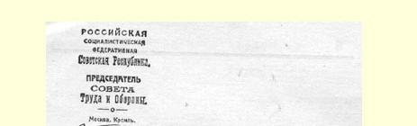
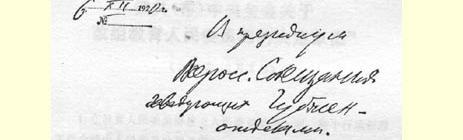
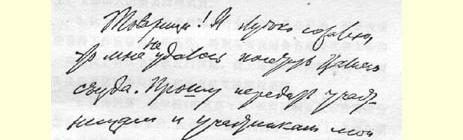
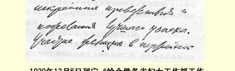

# 给全俄各省妇女工作部工作会议的贺词５７

致全俄各省妇女工作部部长工作会议主席团

１９２０年１２月６日

同志们！非常遗憾，我不能参加你们的代表大会。请向与会者转达我衷心的祝贺，并且祝他们取得良好的成就。

目前战争已经结束，和平的组织工作已经提到首位，但愿长久如此，妇女在这种时候参加党和苏维埃的工作具有巨大的意义。妇女应当在这一和平的组织工作中起极重要的作用，当然，她们也一定会起这种作用。

人民委员会主席

### 弗·乌思扬诺夫（列宁）

> 载于１９２０年１２月１９日《真理报》译自《列宁全集》俄文第５版第２８６号第４２卷第８４页

> １９２０年１２月６日列宁
>
> 《给全俄各省妇女工作部工作会议的贺词》手稿第１页
>
> （按原稿缩小）