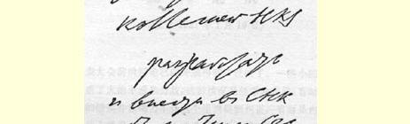
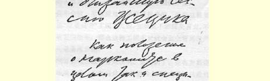
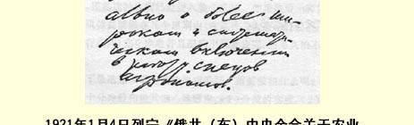

# 俄共（布）中央全会关于农业人民委员部的决定草案１１０

> （１９２１年１月４日）

责成奥新斯基同志会同农业人民委员部部务委员会全体委员一起制定关于该人民委员部的条例，特别是关于更广泛和有计划地吸收农艺专家参加工作的条例，并将条例提交人民委员会和全俄中央执行委员会下次会议审议。１１１

> 载于１９５９年《列宁文集》俄文版译自《列宁全集》俄文第５版第３６卷第４２卷第２３３页

> １９２１年１月４日列宁《俄共（布）中央全会
>
> 关于农业人民委员部的决定草案》手稿第１页
>
> （按原稿缩小）