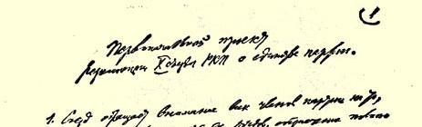
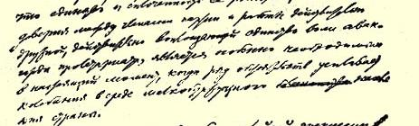
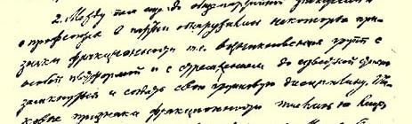
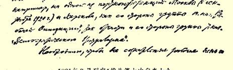

# 俄共（布）第十次代表大会文献 １

> （１９２１年３月）

## １ 开幕词

> （３月８日）

（长时间鼓掌）同志们，俄国共产党第十次代表大会现在开幕。 我们又度过了一年，这一年中，无论在国际或国内，都发生了许许多多的事件。如果从国际局势谈起，那么应当指出，我们现在是第一次在这样的条件下开会：现在共产国际已经不只是一句口号，而真正变成了一个强大的组织机构，它在各个先进的资本主义大国里都有了自己的基础，真正的基础。那些在共产国际第二次代表大会２上还不过是决议的东西，一年来在德国、法国、意大利这样的国家中已经付诸实现，得到了体现、证实和确认。只举出这三个国家，你们就可以清楚地看到，共产国际在去年夏天莫斯科举行的第二次代表大会以后，已经成为欧洲各先进大国工人运动的事业，不仅如此，它已经成为国际政治中的基本因素。同志们，这是一个巨大的胜利，尽管我们还要经受各种各样的严峻考验，—— 这是我们决不能够也决不应当忽略的—— 但是，这个胜利是任何人也夺不走的！

其次，同志们，我们是第一次在这样的条件下召开代表大会的：全世界资本家和帝国主义者所支持的敌军在苏维埃共和国的领土上已经不存在了。由于红军这一年来的胜利，我们才能够第一次在这样的条件下召开党代表大会。三年半的斗争是极端艰苦的，但是敌军在我们的领土上已经不存在了。这一点我们争取到了！当然，我们还远远没有因此而争取到一切，还绝对没有争取到我们应当争取到的东西—— 真正摆脱帝国主义者的侵犯和干涉。相反，他们对我们采取的战争行动在形式上虽然较少带有军事性质，但在某些方面对我们来说却更严重更危险。在上次党代表大会３时，我们就在迎接从战争向和平的转变，并且设法实现这一转变，设法安排好这方面的工作，但是直到现在，这个转变还没有完成。直到现在，我们党还面临着非常困难的任务，这些任务不仅涉及经济计划（在这方面我们犯了不少错误），不仅涉及经济建设的原则，而且涉及我们社会中、我们苏维埃共和国中现有各个阶级之间的关系的原则。阶级关系本身发生了变化，因此这个问题是这次会上大家应当研究和解决的主要问题之一。我想大家都会同意这个看法。

同志们，我们度过了极不平常的一年，我们竟干出了搞党内辩论和争论这种奢侈行为４。党处在整个资本主义世界的联合起来的十分强大的敌人的包围之中，又肩负着空前的重担，对于这样的党来说，这种奢侈行为实在令人吃惊！

我不知道你们大家现在对这个问题怎样看。你们是否认为这种奢侈行为同我们的物质财富和精神财富完全相称呢？这要由你们来判断。但是有一点我无论如何必须指出：我们在这次大会上必须提出一点作为我们的口号，作为我们不惜任何代价必须实现的主要目标和任务，这就是我们在经过辩论和争论之后，必须比开始辩论和争论的时候更加坚强。（鼓掌）同志们，你们不会不知道，我们所有的敌人（他们多得数不胜数）在他们那些数不清的外国报刊上，一再重复并扩散我国资产阶级和小资产阶级敌人在苏维埃共和国里散布的流言蜚语，他们说：有辩论就有争执，有争执就有纠纷，有纠纷共产党人就会削弱，所以要抓住时机，趁他们削弱的时候压他们一下！这已经成了我们敌人的口号。对此我们一刻也不应当忘记。现在我们的任务是要表明，不管我们过去容许这种奢侈行为对不对，现在我们都必须摆脱这种状况，也就是说，我们要在党代表大会上，对大家提出来辩论过的数量极多的纲领和各种各样的细微的、极细微的、微乎其微的分歧意见都认真地审查一遍， 然后对自己说：不管我们过去辩论得怎样激烈，不管我们曾经争论得怎样面红耳赤，现在我们面对这么多的敌人，在农民国家中实现无产阶级专政这一任务又是这么繁重而艰巨，如果我们只是在形式上比过去团结一致，—— 大家出席这次代表大会就证明是这样的—— 那是不够的，我们不仅要在形式上比过去团结一致，而且再也不能有一点派别活动了，不管过去派别活动表现在哪里，表现得怎么样，也要使派别活动完全绝迹。只有这样，我们才能完成我们所面临的巨大任务。我相信，如果我说，我们通过这次大会至少要使党更加巩固、更加一致、更加精诚团结，这一定表达出了你们大家的愿望和坚定的决心！（鼓掌）

## ２ 俄共（布）中央政治工作报告

> （３月８日）

同志们，大家当然都知道，中央的政治工作问题是同党的全部工作，同苏维埃机关的全部工作以及革命的整个进程紧紧交织在一起的，因此—— 至少我认为是这样—— 就工作报告这个词字面上的确切含义来讲，工作报告是作不出来的。所以我认为我的任务是尽量挑出一些特别重要的事件来谈，这些事件在我看来是这一年来我们工作中和苏维埃政治中的关键问题，是我们所经历的最突出的事件，这些事件能够提出很多的材料，供我们考虑革命进展的原因，所犯错误的意义（我们犯了不少错误）以及对将来的教训。这是因为，尽管报告过去一年的工作是很自然的事，是中央必须做的，而且这件事本身是党所关心的，然而我们所面临的日益展开的斗争任务是这样紧急，这样艰巨，这样困难，这样沉重地压在我们身上，大家都不由自主地密切注意怎样从过去的经历中得出应有的结论，怎样更好地完成我们所关注的当前的和即将面临的任务。

这一年来，在我们的工作的各种关键问题中，最引人注意的并且在我看来我们的大部分错误与之有关的，首先是从战争向和平转变的问题。你们大家一定都记得，至少多数人还记得，三年半以来，我们已经转了好几次，但是一次也没有转成，而且看来现在也还是转不成，因为国际资本主义的切身利益决不会让这个转变获得成功。记得还在１９１８年４月，即三年前，我在全俄中央执行委员会的会上曾谈到过我们当时的任务[^1]，这些任务的提出是以国内战争基本结束作为依据的，但实际上那时国内战争还只是刚刚开始。你们都还记得，在上次党代表大会上，我们的一切打算都是以向和平建设转变为基础的，我们估计当时对波兰作出的巨大让步 ５会给我们带来和平。但是波兰资产阶级在４月里就发动进攻，他们同各资本主义国家的帝国主义者一样，把我们的爱好和平的态度当作软弱的表现，结果他们吃了大亏，接受了一个对他们比较不利的和约。但是我们也没有能够转到和平建设，我们不得不重新集中精力同波兰作战，之后又集中精力消灭弗兰格尔。正是这些事件决定了报告年度中的工作内容。我们的整个工作又转到军事任务上面去了。

后来，我们终于完全肃清了俄罗斯联邦领土上的敌军，开始从战争向和平转变。

这个转变引起了极大的震动，这是大大超出我们的预料的。无疑这就是我们在所要报告的这一时期中政策上发生许多错误和过失的主要原因之一，我们现在正在为这些错误和过失而吃苦头。我们的军队是在一个已经精疲力竭的国家中创建的，是在经过了几年帝国主义战争之后创建的，现在这支军队要复员，可是运输工具缺乏，运送军队异常困难，加之歉收带来了饥饿，燃料缺乏又在很大程度上造成了运输中断，于是，象我们现在看到的那样，这次复员使我们遇到了很多难题，对这些难题我们原先是估计得非常不足的。许多经济的、社会的和政治的危机，在很大程度上都是从这里产生的。还在去年年底，我就已经指出：来年春天的主要困难之一，将是军队复员引起的困难。在１２月３０日的大辩论[^2]中，我也指出过这一点，这次辩论大概你们中间很多人都是参加了的。我应当指出，当时我们对这些困难的严重程度还是看不清楚的；我们既没有看出复员在技术上会有多么大的困难，也没有看出先后被帝国主义战争和国内战争弄得疲惫不堪的苏维埃共和国所遭受的种种灾难在复员时会加剧到什么程度。在某种程度上也可以说，正是复员才使这些灾难更加暴露出来。几年来，国家对战争全力以赴， 把一切用于战争，不惜拿出最后的一点物资，最后的一点有限的储备和资源。直到战争结束，我们才看出国家已经破坏和贫困到了多么严重的程度，这种状况使我们不得不在今后一个长时期内专门来医治创伤。即使是医治创伤，我们也还不能全力以赴。军队复员的技术困难，在很大程度上暴露了经济破坏的深重，这种严重的破坏除了造成其他困难之外，还引起了一系列不可避免的经济危机和社会危机。战争使我们，使我们整个国家，使千千万万人只习惯于完成军事任务。而军事任务完成之后，军队的大部分人遇到了极其恶劣的情况，在农村中遇到了难于置信的困难，这一危机和总的危机使他们得不到劳动的机会，结果出现了一种介于战争与和平之间的局面。从目前的形势来看，和平仍然无从谈起。正是军队的复员、国内战争的结束表明，我们还无法集中力量进行和平建设， 因为复员使战争在继续进行，只是改换了形式。几万、几十万士兵早已只习惯于打仗，把打仗几乎当成了唯一的职业，现在复员回到家乡，他们一贫如洗，生活艰难，自己的劳动用不上，结果我们被卷进了一场新形式的战争，新类型的战争。这种形式的战争简言之就是盗匪活动。

毫无疑问，中央的错误是没有估计到复员会引起这么大的困难。当然，应当说明，要进行这样的估计，当时不可能有什么依据， 因为国内战争是这样艰苦，唯一的准则是一切为了国内战争前线的胜利—— 只有这一条。正是由于遵守了这一准则，并且由于红军在反对高尔察克、尤登尼奇等等的斗争中竭尽了全部力量，我们才能战胜入侵苏维埃俄国的帝国主义者。

谈了这种造成许多错误、使危机加剧的基本情况以后，我想谈一谈在党的工作中和整个无产阶级的斗争中暴露出来的问题：在估计和计划方面存在着许多更为严重的不符合实际情况的现象和失误—— 不仅计划方面有失误，而且在确定我们这个阶级同其他阶级的关系方面也有失误，而我们这个阶级是必须通过同这些阶级的合作，有时也要通过同它们的斗争来决定共和国的命运的。根据这一点，我们应当总结过去的工作，谈谈政治经验，谈谈作为政治领导的中央委员会应当弄清楚并且应当努力向全党说清楚的事情。这里指的就是我们对波战争的情况以及粮食和燃料等等各种各样的问题。我们在进攻时推进得太快了，几乎打进华沙，这无疑是犯了错误。我现在不来分析这是战略错误还是政治错误，因为这样做就离题太远了，我想这是将来的历史学家的事情，现在人们必须继续艰苦斗争，抗击一切敌人，还顾不上研究历史。但是错误毕竟犯了，犯这个错误是由于我们过高地估计了自己力量的优势。这种力量的优势在多大程度上来源于经济状况，在多大程度上来源于爱国主义感情（对波战争甚至激起了那些完全非无产阶级的、丝毫不同情共产主义的、不是无条件拥护无产阶级专政的、有时应当说是根本不拥护无产阶级专政的小资产阶级分子的爱国主义感情），这个问题分析起来就太复杂了。但事实是：在对波战争中，我们犯了一定的错误。

拿粮食方面的工作来看，我们也会发现类似的错误。在报告年度中，余粮收集制的执行情况比上一年好得多。本年度收集的粮食已经超过２５０００万普特。据统计，到２月１日止，已经收集到 ２３５００万普特，而上一年度全年才收集了２１０００万普特，就是说， 本年度花少得多的时间收集到的粮食，已经超过了上一年度全年收集的粮食。然而，在到２月１日为止收集来的２３５００万普特粮食中，上半年就消耗了近１５５００万普特，就是说，平均每月消耗２５００ 万普特甚至更多一些。毫无疑问，总的说来我们应当承认，我们在粮食情况比上一年好的时候，没有能够合理地进行分配。我们没有能够正确地估计到开春时出现的危机的全部严重性，而是很自然地一心想增加挨饿的工人的配给额。当然这里也应当指出，我们没有进行计算的依据。在一切资本主义国家里，尽管存在着无政府状态，存在着资本主义所固有的混乱状态，它们在制订经济计划时， 却有几十年的经验可作依据，各个经济制度相同、只是具体情况有些差别的资本主义国家，都可以参考这种经验。从这种参考中可以得出真正科学的规律，得出一定的规律性和常规。但是这种可供计算参考的经验我们一点也没有，而且也不可能有；因此很自然，当战争结束后我们终于能够给挨饿的居民多分配一些东西的时候， 我们一下子还掌握不好分寸。显然，当时我们应当控制配给额的增加，节省出一定数量的后备粮来应付今春的困难的日子。现在，困难的日子果然到来了。我们当时没有这样做，结果又犯了我们整个工作中常犯的错误。这种错误说明，由于从战争向和平转变，我们面临的问题和困难很多，而要解决这些问题和困难，我们既缺乏经验，又缺乏准备，缺乏必要的资料，结果就使危机大大加重、加剧和恶化起来。

燃料方面显然也有类似的情况。燃料是经济建设的根本问题。 从战争向和平转变，向经济建设转变，即上次党代表大会上谈到的、并且是报告年度内整个政策所最关心和注意的事情，自然不能不以对燃料产量的估计以及燃料的合理分配作为基础。否则，不论克服困难也好，恢复工业也好，都无从谈起。在这方面，我们的情况比上一年好，这是很明显的。过去我们同产煤区和产油区断了联系。红军节节胜利，我们得到了煤和石油。燃料毕竟是增加了。我们知道，在报告年度内，我们的燃料比过去多了。但是在燃料增加的情况下，我们又犯了错误，一下子把燃料大量分配出去，把燃料用光了，以致在一切工作纳入正轨之前，我们就遇到了燃料危机。 关于所有这些问题，你们会在这里听到专门的报告。至于有关这个问题的全部材料，我现在不可能向你们提供，甚至讲讲大概的情况也不可能。但是不管怎样，考虑到过去的经验，我们应当指出，这个错误是同我们对情况的错误估计以及从战争向和平转变得太快有关的。事实上，这个转变实现起来比我们想象的要慢得多。准备时间要长得多，速度要慢得多—— 这就是我们在这一年中得来的教训，全党应当牢牢记住这个教训，以便确定我们来年的基本任务， 并且避免今后再犯类似的错误。

同时应当指出，歉收无疑使这些错误、特别是由这些错误造成的危机更加严重了。虽然我说过，在报告年度内，粮食工作使我们的粮食大大增加，但是必须说明，危机的主要根源之一也正是在这里。由于歉收，饲料极为缺乏，牲畜死亡，农民经济破产，因此，征粮便集中在余粮不多的地区。共和国的各个边疆地区，如西伯利亚、 北高加索等地，余粮要多得多，然而这些地方的苏维埃机关极不完善，苏维埃政权不太巩固，运输也非常困难。因此，我们只得在收成最差的省份多收集一些粮食，结果就使农民经济的危机特别严重起来。

这里我们又清楚地看到，我们缺乏应有的正确估计。但另一方面，由于我们的处境非常窘迫，我们毫无选择的余地。一个国家遭受了带来严重破坏的帝国主义战争之后又碰到连年国内战争，当然只有把一切力量都用于前线，否则便不能生存。象我们这样一个遭到严重破坏的国家，只能向农民收集余粮，甚至不给他们任何其他产品作补偿。为了拯救国家，拯救军队，拯救工农政权，当时必须这样做。我们对农民说：“当然，你们是在贷粮给工农国家，但是不这样做，你们就不能把自己的国家从地主和资本家手中拯救出来。”当帝国主义者和资本家把战争强加在我们身上时，我们不能不这样做。我们毫无选择的余地。而这些情况就使得我国的农民经济在连年战争之后凋蔽不堪；由于播种面积缩减、生产资料损毁、单位面积产量减少、劳动力缺乏等等，必然出现歉收。歉收的情况非常严重，因此，虽然收集余粮的情况比我们预料的要好，但是随之而来的是危机加剧，它可能使我们在最近几个月内遇到更大的困难和灾难。我们在分析报告年度的政治经验和考虑新的一年应当提出什么政治任务的时候，必须认真估计到这些情况。报告年度留给下一年的，依然是这样一些亟待解决的任务。

现在我要谈谈另一个问题，完全属于另一方面的问题，那就是占去了党许多时间的关于工会的辩论。这个问题今天我已经提到过了，当然，我只能谨慎地说，你们中间很多人恐怕都认为进行这场辩论是一种过分的奢侈行为[^3]。至于我个人，还不能不添上一句：在我看来，这种奢侈行为确实是完全不能容许的；我们进行这场辩论，无疑是犯了错误，我们没有认识到，我们在这场辩论中把根据客观条件不应占首要地位的问题，放到了首要地位；我们搞起这种奢侈行为，却没有认识到，我们因此而大大转移了对紧要的、 严重的、迫在眉睫的危机问题的注意力。这场辩论花费了好几个月的时间，并且几乎使在座的大多数人都感到厌烦了，但是实际结果怎样呢？关于这个问题，你们会听到专门的报告，不过我想在我的工作报告中请你们注意一点，就是这里无疑也用得上“因祸得福” 这句谚语。

可惜祸显得多了一点，福少了一点。（笑声）但是，福还是有的： 我们虽然损失了时间，虽然使党内同志转移了对同包围我们的小资产阶级自发势力作斗争这一迫切任务的注意力，但是却学会了认识某些我们过去从未发现的相互关系。福就在于党在这场斗争中不能不学到一点东西。虽然我们都知道，作为执政党，我们不能不把苏维埃的“上层”和党的“上层”融为一体，现在是这样，将来也是这样，但是，党在这场辩论中得到了某种必须记取的教训。有些纲领，主要得到党的一些“上层”的拥护。这些纲领有时叫作“‘工人反对派’６的纲领”，有时又有别的叫法，事实上它们都带有明显的工团主义倾向。这不是我一个人的意见，而是在座的大多数人的意见。（喊声：“对！”）

党在这场辩论中表明自己是非常成熟的，它看到“上层”有些动摇，听到“上层”说“我们的意见不一致，请你们来评断一下吧”， 它就很快地动员起来解决这个问题，绝大多数最有影响的党组织都很快地向我们反映说：“我们有意见，我们要把这些意见告诉你们”。

在这场辩论中，我们收到了大批纲领。纲领实在太多了，拿我来说吧，因为职务关系，应当读一读，但是，我怕我已经犯了错误， 因为我没有把它们读完。（笑声）我不知道在座的人是否都有这么多空闲时间来读它们，但是至少应当指出，已经暴露出来的这种工团主义的、在某种程度上甚至是半无政府主义的倾向，提供了很多值得我们思考的材料。几个月来，我们太奢侈了，竟醉心于研究各种细微的分歧意见。而在这时候，军队的复员引起了盗匪活动，加剧了经济危机。这场辩论应当帮助我们懂得：我们这个约有５０万党员甚至超过５０万党员的党，已经成为一个群众性的党，这是一， 第二，它又是一个执政党；而作为一个群众性的党，党外所发生的一些事情也就多少会反映到党内来。懂得这一点，是非常非常重要的。

有一点工团主义的或者半无政府主义的倾向并不可怕，因为党很快就会觉察到并且会坚决加以纠正。但是，如果这种倾向是由农民在国内占绝大多数这种情况造成的，如果这些农民对无产阶级专政日益不满，农民经济的危机极端严重，农民军队的复员抛出了千千万万疲惫不堪的士兵，使这些只习惯于打仗、以打仗为职业的人无事可做，从而引起盗匪活动，那么，在这种时候就不应该争论理论倾向问题了。我们应当在代表大会上直截了当地说，我们不容许再争论倾向问题了，我们必须结束这方面的争论。党代表大会是能够而且应当做到这一点的，党代表大会应当从这件事中吸取应有的教训，把它补充到中央的政治工作报告里去，把它确定下来，肯定下来，变成党必须遵守的义务，变成法律。争论的局面变得极其危险，简直构成了对无产阶级专政的威胁。

几个月以前，我曾经对一些在辩论中同我接触过、争论过的同志说：“小心，这种局面威胁到工人阶级的统治和工人阶级的专政！”他们却说：“这是恐吓手段，您是在吓唬我们。”７我曾经不止一次地听到人们对我的意见扣帽子，说我吓唬人。我总是回答他们说，如果我想来吓唬受过种种考验的老革命家，那就太可笑了[^4]。 你们只要看看复员困难到了什么程度，那就会相信，这不但不是什么恐吓，甚至也不是争论中所免不了的意气用事，而是十分正确地指出了已经发生的事情，指出了我们需要团结、沉着和纪律；这不但是因为不这样无产阶级的政党便不能齐心协力地工作，而且是因为春季已经产生并且还要产生很多困难，如果没有高度的团结， 我们在这种情况下就不能行动。我认为我们毕竟可以从辩论中得出这样两个主要的教训。因此，我觉得必须指出，如果说我们过去太奢侈了，致使全世界都觉得奇怪：一个党在殊死斗争的最困难情况下，而且在发生歉收和危机的条件下，在遭到经济破坏和军队复员的条件下，竟然用尽心思去研究各种纲领的细枝末节，那么现在我们应当从这些教训中得出一个政治结论，应当不仅得出关于各种错误的结论，而且得出关于阶级关系、工人阶级和农民的关系的政治结论。这种关系并不象我们想象的那样。这种关系要求无产阶级大大加强团结和集中力量，在无产阶级专政下，这种关系所包含的危险性比邓尼金、高尔察克和尤登尼奇之流合在一起还要大许多倍。在这个问题上，任何人都必须有清楚的认识，否则就会产生严重的后果！这种小资产阶级自发势力所造成的困难是很大的， 克服这种困难，需要紧密的团结—— 而且不只是形式上的团结 —— 需要齐心协力的工作，需要统一的意志；因为只有在无产阶级群众具有这样的意志时，无产阶级才能在一个农民国家中实现自己艰巨的专政任务和领导任务。

西欧各国的援助正在到来，但是来得不那么快。它正在到来， 正在不断增加。

我在上午的会议上已经指出，共产国际第二次代表大会的召开是我们所要报告的时期内最重大的因素之一[^5]，这件事也是同中央的工作有密切关系的。毫无疑问，今天的国际革命比去年前进了一大步。毫无疑问，在去年代表大会召开时，共产国际的存在还只是表现在发表一些宣言，而今天它的存在已经表现为每一个国家都有了独立的政党，并且不仅如此，还是先进的政党，共产主义已经成了整个工人运动的中心问题。在德国、法国和意大利，共产国际不但成了工人运动的中心，而且成了这些国家整个政治生活令人注意的中心。去年秋天，只要一拿起德国或法国的报纸，就会看到上面满篇都在谈论莫斯科和布尔什维克，就会看到他们给我们加了各种各样的形容词，把布尔什维克和加入第三国际的２１项条件８变成了本国整个政治生活的中心问题。这是我们的胜利，这是任何人也夺不走的！这表明国际革命在发展，同时欧洲的经济危机在加剧。但是不管怎样，如果我们据此断定欧洲在短期内会用扎实的无产阶级革命来援助我们，那简直是疯了，我相信在这个大厅里不会有这样的人。三年来，我们已经逐渐懂得：寄希望于国际革命，并不是指望它在一定期限内爆发，现在发展的速度正在不断加快，到春天可能会引起革命，但也可能不引起。因此，我们要善于使我们的工作同国内外的阶级关系相适应，以便能长期保持无产阶级专政，消除（哪怕是逐渐消除）我们遭受的一切灾难和危机。只有这样提出问题，才是正确的，清醒的。

现在我谈另一个问题，这个问题同中央本年的工作有关，并且同我们面临的任务有密切的关系。这就是对外关系问题。

在党的第九次代表大会以前，我们曾经全力争取改变我们同资本主义国家的关系，力争从战争关系变为和平的和贸易的关系。 为此，我们采取了各种外交步骤，并且也确实战胜了那些大外交家。例如，美国的或是国际联盟９的代表，曾经向我们提出一些条件，要求我们停止对邓尼金和高尔察克的军事行动，他们以为这样就会使我们陷于困境。但实际上，陷于困境的是他们自己，而我们却在外交上取得了巨大的胜利。结果，他们出了丑，不得不收回自己的条件，后来全世界所有的外交文献和报纸都揭露了这件事。但仅仅是外交上的胜利，对我们来说是太不够了。我们需要真正的贸易关系，而不只是外交上的胜利。贸易关系只是这一年来才有了一些发展。同英国建立贸易关系的问题已经提出来了。 从去年夏天起，这个问题成了中心问题。可是对波战争使我们根本顾不上这个问题了。英国本来已经打算签订贸易协定。英国资产阶级希望签订这种协定，但是英国的宫廷人士不愿意，并且从中作梗，而对波战争又拖延了协定的签订。结果问题到现在还没有得到解决。

今天报纸上好象有消息说，克拉辛在伦敦向报界透露，他期待很快签订通商条约１０。我不知道这个希望是否完全有把握能够实现。我不敢说究竟如何，但是我应当指出，中央委员会对这个问题是很重视的，并且认为我们作些让步以求得同英国达成贸易协定的做法是正确的。这并不是因为我们会从英国比从别的国家得到更多的东西，英国在这方面并不象德国和美国那样先进。英国是个殖民国家，亚洲政局对它的利害关系极大，苏维埃政权在一些离英国殖民地不远的国家中所取得的成就有时也使英国极为敏感。这就决定了我们同英国的关系特别不可靠。这种状况是由于错综复杂的客观原因造成的，苏维埃外交家的任何外交艺术也无济于事。 但是同英国的通商条约对我们来说是重要的，因为同美国签订条约的可能性正在出现，而美国的生产潜力要大得多。

同这个问题有关的是租让问题。一年来我们对这个问题比以前注意多了。１１月２３日人民委员会公布了一项法令，用外国资本家最容易接受的方式阐明了租让问题。当时党内有人对这个问题产生过一些误解，或者说，是对它不完全理解，因此我们召开了几次负责工作人员的会议来讨论这个问题。总的说来，它没有引起什么意见分歧，尽管我们听到工人和农民有不少抗议。他们说： “才赶走了本国的资本家，现在却想把外国的资本家请进来。” 这种抗议究竟有多少是不自觉的，有多少是反映了非党人士中的富农以至资本家的想法—— 他们认为，他们才有合法权利在俄国当资本家，并且当掌握政权的资本家，而不应当招来这些不掌握政权的外国资本—— 这两种情况分别起着多大作用，中央固然没有任何相应的统计材料，世界上的任何统计也未必能把这些情况统计清楚。但是，我们公布这项法令，毕竟在建立租让关系上是前进了一步。应当指出，我们在实践上—— 这一点决不能忘记—— 连一个租让项目也还没有搞成。我们还在争论是否应当尽力设法实行租让。但是，能不能实行租让并不取决于我们的争论和决定， 而取决于国际资本。今年２月１日，人民委员会又通过了一项关于租让问题的决定１１。其中第一条规定：“原则上赞同在格罗兹尼和巴库以及其他正在开采的油田提供石油租让，并开始谈判，谈判要加速进行。”

这个问题不能不引起一些争论。有些同志认为把格罗兹尼和巴库的一部分油田租让出去是错误的，会引起工人的反对。大多数中央委员和我个人却认为这种抱怨也许是不必要的。

大多数中央委员和我个人都认为这种租让是必要的，希望你们以自己的威信来支持这种观点。对我们来说，同其他先进国家的国家托拉斯实行这种联合，是十分必要的，因为我国的经济危机十分深重，没有外国的装备和技术援助，我们单靠自己的力量就无法恢复被破坏了的经济。只输入装备是不够的。我们或许可以用更广泛的方式把企业租给最大的帝国主义辛迪加：租出四分之一巴库，四分之一格罗兹尼，以及四分之一我们最好的森林资源，这样来保证我们得到最新的技术装备，建立起必要的基础；另一方面， 我们也可以因此得到其余部分所需要的装备。这样，我们就多少 （即使是四分之一或一半也好）可以赶上其他国家的现代的、先进的辛迪加。否则我们将处在非常困难的境地，不竭尽一切力量就赶不上他们，任何人只要稍微清醒地观察一下现状，都不会怀疑这一点。我们已经同一些最大的世界托拉斯开始谈判。当然，他们这样做不单纯是为我们效劳，而完全是为了大捞一把。现代资本主义， 用一些主张和平的外交家的话来说，就是强盗，就是强盗式的托拉斯，它已经不是从前正常时代的资本主义，因为它现在靠垄断世界市场来攫取百分之几百的利润。当然，这样做我们要付出十分昂贵的代价。但是由于世界革命还没有到来，我们没有别的出路。我们没有别的办法能使我们的技术赶上现代水平。如果某一个危机使世界革命的发展速度变快了，而这场革命在租让期满之前就爆发， 那么租让条件就不会象文件规定的那样苛刻了。

１９２１年２月１日，人民委员会通过了在国外采购１８５０万普特煤的决定，因为当时我国的燃料危机已经日益明显。当时已经很清楚，我们不能把黄金储备只是用来购买装备了。装备可以增加我国的煤炭生产，我们从外国订购机器来发展煤炭工业，当然比从国外买煤有利，但危机是这样深重，我们只得放弃这种经济上有利的做法，而采取下策，用资金去买我们本来可以在国内得到的煤。为了购买农民和工人所需要的消费品，我们必须作更大的让步。

现在我想谈谈喀琅施塔得事件１２。我还没有得到喀琅施塔得方面的最新消息，但是我可以肯定，这一场很快就显露出我们所熟悉的白卫将军们身影的暴动，在最近几天内甚至几小时内就会被平定。这是无可怀疑的。但是，我们必须对这一事件的政治教训和经济教训仔细加以考虑。

这个事件说明了什么呢？它说明政权从布尔什维克手里转到了由各色各样的分子组成的不确定的集团或联盟手里，他们似乎比布尔什维克仅仅稍右一点，甚至也可能稍“左”一点—— 这些企图在喀琅施塔得夺取政权的政治集团的成分就是这样不确定。当然，你们都知道，白卫将军们在这里也起了很大的作用。这是已经完全证实了的。在喀琅施塔得事件发生以前两个星期，巴黎的报纸就已经发表了喀琅施塔得发生暴动的消息１３。十分明显，这里有社会革命党人和国外白卫分子在活动，而归根到底这个运动是小资产阶级反革命势力和小资产阶级的无政府主义自发势力造成的。 这是一种新的情况。我们必须把这种情况同各种危机联系起来，从政治上慎重地加以考虑，仔细地加以分析。这方面暴露出来的是小资产阶级的即无政府主义的自发势力，它利用自由贸易的口号，无时无刻不在反对无产阶级专政。这种情绪对无产阶级也有很大影响。它影响到莫斯科的一些企业，也影响到外省许多地方的企业。 这种小资产阶级反革命势力无疑要比邓尼金、尤登尼奇和高尔察克合起来还要危险，因为在我国，无产阶级占少数，农民已经破产，此外，我们的军队复员提供了数量惊人的暴乱分子。尽管起初喀琅施塔得的水兵和工人所提出的—— 怎么说好呢—— 政权变动是很小的，或者说是不大的，他们只是想在贸易自由问题上改变一下布尔什维克的主张，看来变动并不大，口号好象还是“苏维埃政权”，而只是稍作改变，或者稍作修正，实际上非党分子却做了白卫分子的垫脚石、跳板和桥梁。这在政治上是必然的。在俄国革命中，我们见过小资产阶级无政府主义分子，同他们斗争了几十年。从１９１７年２月起，在大革命时期，我们就看到过这些小资产阶级分子在怎样活动，我们还看到小资产阶级的政党都试图声明他们的纲领同布尔什维克的差别很小，只是实现的方法不同而已。我们不仅从十月革命的经验里了解到这一点，而且也从前俄罗斯帝国版图内各个边疆地区、各个地方的经验里了解到这一点，那里的苏维埃政权曾经被其他政权的代表取代过。大家都还记得萨马拉民主委员会１４吧！他们全都以平等、自由和立宪会议的口号相号召，结果却不止一次地成了向白卫政权过渡的跳板和桥梁。

我们必须从所有这些经验中得出对马克思主义者来说是必然的理论结论，因为经济状况的恶化在动摇苏维埃政权。整个欧洲的经验已经实际地表明了脚踏两只船的尝试会有什么结果。因此在这方面我们应当指出，政治摩擦是一种莫大的危险。我们应当密切注意这种提出贸易自由口号的小资产阶级反革命势力。贸易自由即使开始时并不象喀琅施塔得暴动那样同白卫分子有十分紧密的联系，但是它还是必然会导致白卫分子的卷土重来，导致资本的胜利、资本的完全复辟。所以，我再说一遍，我们必须清楚地意识到这种政治上的危险性。

这种危险性证明了我在谈到我们关于纲领的争论时所说的话[^6]；我们面对这种危险应当懂得，我们应当不只是在形式上停止党内的争论，这一点我们当然会做到，但是还不够！我们应当记住， 我们必须更认真地对待问题。

我们必须懂得，虽然农民经济发生了危机，但是，除了依靠农民经济来帮助城市和乡村，我们没有别的办法生存下去。我们必须记住，资产阶级正在竭力煽动农民反对工人，竭力煽动小资产阶级的无政府主义自发势力利用工人的口号来反对工人，这一切将直接导致推翻无产阶级专政，就是说，导致复辟资本主义，复辟地主和资本家的旧政权。这种政治上的危险性现在是存在的。许多革命都清清楚楚地走过这条道路，我们也经常指出这条道路的危险性。这条道路很清楚地呈现在我们面前。这就要求执政的共产党和无产阶级的革命领导者，决不能采取我们这一年来经常采取的那种态度。这种危险性无疑要求我们更加团结，更守纪律，更能和衷共济地工作。否则我们便不能战胜命运给我们带来的危险。

下面谈一谈经济问题。小资产阶级自发势力提出的贸易自由这一口号说明什么呢？它说明在无产阶级和小农的关系中，还存在一些尚待解决的困难问题和任务。我指的是，在一个无产阶级占少数而小资产阶级占大多数的国家里，当无产阶级革命日益开展的时候，胜利了的无产阶级应当怎样来对待小业主的问题。在这样的国家里，无产阶级的作用就是要领导这些小业主向社会化的、集体的、公社的劳动过渡。这在理论上是毫无疑问的。在我们许多立法文件中都说到了这个过渡，但是我们知道，问题不在于立法文件， 而在于实际执行，同时我们知道，只要我们有了实力雄厚的大工业，能够给小生产者好处，使他们实际看到这种大经济的优越性， 就能保证实现这一过渡。

凡是对社会革命及其任务深思熟虑过的马克思主义者和一切社会党人，在理论上总是这样提出问题的。而在我国，第一个特点 （这个特点我已经谈过，而且在俄国非常突出）就是我国的无产阶级不但是少数，而且是极少数，占大多数的是农民。我们在保卫革命时所处的条件决定了我们完成我们的任务时必然空前困难。实际显示大生产的一切优越性，我们还办不到，因为大生产遭到了破坏，本身很难维持，只有让这些小农忍受牺牲，大生产才能得到恢复。必须振兴工业，但是，要振兴工业就要有燃料，要燃料就要有木柴，要木柴就要靠农民和他们的马匹。在危机深重、饲料缺乏、牲畜大批死亡的情况下，农民不得不把东西贷给苏维埃政权来恢复暂时还不能向他们提供任何东西的大工业。就是这种经济情况造成了巨大的困难，就是这种经济情况迫使我们必须更深入地考虑从战争向和平转变的条件。在战时，我们只能对农民说：“必须把东西贷给工农国家，它才能摆脱国境。”此外是没有其他办法的。当我们把全部注意力集中在恢复经济的时候，我们必须懂得，在大生产彻底胜利和恢复以前，我们面对的是一些为商品流转而生产的小农， 小业主，小生产者。而大生产是不可能在旧的基础上恢复起来的， 这需要很多年，至少要几十年，在我们这种遭受破坏的情况下，可能还要更长一些的时间。在这以前，我们还要同就是这样的一些小生产者打好多年的交道，因此，自由贸易的口号是必然会提出的。 这个口号的危险性不在于它掩饰了白卫分子和孟什维克的意图， 而在于它会在农民群众中得到传播，尽管农民群众是仇恨白卫分子的。它所以会得到传播，是因为它符合小生产者生存的经济条件。中央出于这种考虑，对以实物税代替余粮收集制的问题作出了决定，开展了讨论，并且你们今天已经通过决定，同意在代表大会上直接提出这个问题。１５关于实物税和余粮收集制的立法问题，早在１９１８年年底我们就提出来了。实物税法在１９１８年１０月３０日就通过了１６。但是，这个向农民征收实物税的法令虽然通过了，却并没有执行。法令公布后的几个月内，我们接着又发布了几个条例，但是法令仍旧没有执行。另一方面，征收农户的余粮是战争环境迫使我们不得不采取的一种办法，这种办法对于农民经济所处的稍为和平的生存条件就不再适合了。农民需要心中有数，需要知道究竟有多少要交出去，有多少可以用来在当地流转。

过去我们的全部经济，不论是就整个来说，还是就各个部分来说，都适应战时的条件。考虑到这种条件，我们当时的任务就是必须收集一定数量的粮食，而完全无法顾到这样做对社会流转会有什么影响。现在我们从战争问题转到和平问题上来了，因此对实物税的看法也就不同了：我们不但要从保证国家方面着眼，而且要从保证小农户方面着眼。我们应当了解小农经济自发势力用什么经济形式表露对无产阶级的不满；这种不满已经表露出来，并且在目前的危机中变得愈来愈激烈了。我们在这方面必须尽最大的努力。 这是对我们至关重要的事情。应当让农民在当地流转方面有一定的自由，把余粮收集制改为实物税，使小业主可以更好地安排自己的生产，根据税额的多少来确定生产规模的大小。自然，我们知道， 在我们目前所处的环境里，这件事做起来是很难的。播种面积、单位面积产量、生产资料都减少了，余粮无疑也减少了，甚至往往根本没有余粮。我们必须考虑这种情况，考虑这种事实。农民为了不让工厂和城市完全挨饿，自己不得不挨一点饿。从全国范围来看， 这是完全可以理解的事，但是我们并不指望分散的贫困的农民业主能理解这一点。我们知道，这方面非采取强制手段不可，而破产农民对强制手段的反应十分强烈。别以为这种办法一定能使我们摆脱危机。不过，我们同时还要作最大限度的让步，使小生产者有最好的条件去发挥自己的力量。从前我们适应的是战争任务。现在则要适应和平时期的条件。这个任务已经摆在中央面前，这就是要在无产阶级政权存在的条件下改行实物税，这和实行租让也是有紧密联系的。你们将要对这个任务进行专门的讨论，你们应当特别注意这个问题。无产阶级政权通过租让办法，就能同先进的资本主义国家达成协议，而达成这种协议就能使我国工业得到加强；工业不加强，我们便不能向共产主义制度继续前进；另一方面，在这个过渡时期，在农民占大多数的国家里，我们必须会采取从经济上满足农民要求的办法，采取尽量多的措施来改善农民的经济状况。 当我们还没有把他们改造过来的时候，当大机器还没有把他们改造过来的时候，就应当保证他们有经营的自由。我们现在处在一种新旧交替的状态，我们的革命处在资本主义国家的包围中。只要我们还处在这种新旧交替的状态，我们就不得不寻求非常复杂的相互关系的形式。过去我们在战争的重压下，不能集中精力考虑怎样处理无产阶级国家政权（它掌握着已经遭到空前的破坏的大生产） 同小农之间在经济上的相互关系，怎样找到同小农共处的形式；而只要小农还是小农，就必须保证小经济有一定的流转体系，否则小农便不能生存。我认为这个问题对苏维埃政权来说，是当前最重要的经济问题和政治问题。我认为这个问题可以对近一年来我们在战争结束后开始向和平状态转变的时期所做的工作，从政治上作出总结。

这个转变带来了极大的困难，小资产阶级自发势力暴露得十分明显，我们必须清醒地看待这种自发势力。我们是从阶级斗争的观点来看待这一系列现象的。无产阶级对小资产阶级的态度问题， 是一个困难的问题，在这方面，无产阶级政权要取得胜利，就要采取许多复杂的办法，确切些说，要采取一系列复杂的过渡办法—— 这一点我们从来没有看错过。１９１８年底，我们颁布了关于实物税的法令，由此可见，共产党人当时认识到了这个问题，只是由于战争，我们没有能够实行这个法令。在国内战争的环境里，我们不得不采用战时的办法。但是，如果我们由此得出结论，认为只能采用这种办法和态度，那就大错特错了。这必将意味着苏维埃政权和无产阶级专政的垮台。当我们在经济危机的条件下实行向和平转变的时候，应当想到，在拥有大生产的国家里建设无产阶级国家，比在小生产占优势的国家里要容易些。完成这项任务要采取许多办法，我们决不能对这些困难视而不见，也决不能忘记，无产阶级是一回事，小生产又是一回事。我们不能忘记现在还有各种阶级存在，不能忘记小资产阶级的无政府主义反革命势力是导致白卫分子卷土重来的政治跳板。我们必须清醒地正视这个问题，应当认识到，一方面无产阶级政党内部要有高度的团结、沉着和纪律，另一方面在经济上也要有一套办法，这些办法过去只是由于战争而没有能够实行。我们应当承认，实行租让，购买机器和工具来满足农业的需要，这是必要的，这样就能换得粮食，恢复无产阶级同农民的正常关系，保证无产阶级在和平时期的生存。我希望我们以后再来谈谈这个问题。我重复一遍，我认为我们现在讨论的是一个很重要的问题，过去一年，可以说是从战争向和平转变的一年，它向我们提出了极端困难的任务。

最后，我简单讲一讲反对官僚主义的问题，这个问题已经花了我们很多时间。还在去年夏天，这个问题就在中央委员会中提出来了；８月，中央在给各级组织的信中提出了这个问题；９月，在党代表会议上提出了这个问题；最后，在１２月举行的苏维埃代表大会上又在更大的范围里提出了这个问题。１７官僚主义的脓疮无疑是存在的，这是大家公认的，必须同它作有效的斗争。当然，在我们看到的争论中，有些纲领对这个问题的提法至少是轻率的，往往用小资产阶级的观点来看这个问题。最近在非党工人中间显然出现了动荡和不满。从莫斯科举行的一些非党会议上可以清楚地看出，他们把民主、自由变成了推翻苏维埃政权的口号。有很多或者至少有一些“工人反对派” 的代表同这种祸害，同这种小资产阶级反革命性作过斗争，他们说：“我们要团结起来同这种祸害作斗争。” 他们的确表现得极为团结。“工人反对派” 和提出半工团主义纲领的其他派别的人，是否都是如此，我不知道。在这次代表大会上，我们要好好弄清楚这个问题。我们必须懂得同官僚主义作斗争是绝对必要的，这种斗争也象同小资产阶级自发势力作斗争的任务一样复杂。官僚主义在我们国家制度中已经成为这样一种脓疮，以致我们的党纲也提到了它，这是因为它和这种小资产阶级自发势力及其涣散性有联系。只有把劳动者联合起来才能克服这些毛病，劳动者不但应当欢迎工农检查院１８的法令（难道我们受人欢迎的法令还少吗？），而且应当学会通过工农检查院来行使自己的权利；然而在目前，这种情形不但在乡村中看不到，就是在城市里，甚至在两个首都也看不到！甚至在那些叫喊反对官僚主义叫喊得最多的地方，往往也不会行使这种权利。对这种情况应当十分注意。

我们常常看到有这样一些人，他们同这种祸害作斗争，他们希望—— 甚至可能是真诚地希望—— 帮助无产阶级政党，帮助无产阶级专政，帮助无产阶级运动，然而实际上他们却帮助了小资产阶级的无政府主义自发势力，而这种自发势力在革命中屡次表现出它是无产阶级专政的最危险的敌人。现在—— 这是今年的基本结论和教训—— 它又一次表现出它是最危险的敌人，在我们这样的国家里，它最能找到拥护者和支持者，最能改变广大群众的情绪， 甚至影响到一部分非党工人。这样就使无产阶级国家的处境非常困难。如果我们不了解这一点，如果我们不吸取这种教训，不把这次代表大会变成在执行经济政策和实现无产阶级的紧密团结方面的一个转折点，那我们最后就会得到这样一句可悲的评语：应当忘记的鸡毛蒜皮的事，一点也没有忘记，应当在这一年的革命中学到的许多重要东西，一点也没有学到。我希望不至于出现这样的情况！（热烈鼓掌）

## ３ 关于俄共（布）中央政治工作报告的总结发言

> （３月９日）

（长时间鼓掌）同志们，本来希望大家讨论中央的政治工作报告会着重对政治工作、政治错误提出批评，提出补充和修正的意见，并且作出政治上的指示。

但是很遗憾，只要你仔细了解一下这里展开的讨论，重新阅读一下讨论中所提出来的主要问题，你就忍不住要问自己：代表大会这样快就结束了这些讨论，是不是因为人们谈论得过于空洞，因为发言的几乎全是一些“工人反对派”的代表呢？关于中央的政治工作和当前的政治任务，我们究竟听到了些什么呢？大多数发言人都把自己叫作“工人反对派”，这可不是一个闹着玩的称呼！……在这样的时候，在这样的党内，组织反对派可不是一件闹着玩的事情！

例如柯伦泰同志直截了当地说：“列宁的报告回避了喀琅施塔得事件。”我听到这种话，只能表示惊讶。所有出席代表大会的人都十分清楚—— 当然，报纸上的报道不能象这里谈的这样坦率—— 我在这里作的报告，详详细细地谈了喀琅施塔得事件的教训[^7]；如果这样指责我也许更恰当些：我在报告中大部分都是谈的今后如何从喀琅施塔得事件中吸取教训，而只有一小部分谈到过去的错误，谈到政治事件以及我们工作中的关键问题，而这些问题，在我看来是决定着我们的政治任务，并且能够帮助我们避免再犯过去的错误的。

关于喀琅施塔得事件的教训，我们在这里究竟听到了些什么呢？

如果有人以反对派的名义出现，把这个反对派叫作“工人”反对派，并且说中央对党的政治领导不正确，那就应当对这些人说： 你们应当指出在基本问题上有哪些地方不正确，应当怎样纠正。但是很可惜，关于目前的形势和教训，我们什么也没有听到，连一句话、一个字也没有听到。甚至连我作的结论也没有人在这里谈到。 结论很可能不正确，但在代表大会上作报告，正是为了使不正确的地方能够得到纠正。党必须团结，党内不容许有反对派存在—— 这就是从目前形势中得出的政治结论；而经济的结论，就是不能满足于在实行工人阶级同农民妥协的政策方面已经取得的成绩，要寻找新的方法，运用和检验这些新的方法。我曾具体指出应当怎样做。我说的可能不正确，但是关于这一点，谁也没有说过一句话。有一个发言人，大概是梁赞诺夫吧，他只是这样责备我，说我在发言中提到实物税，似乎是突如其来的，是预先没有经过讨论的。这说得不对。我非常奇怪，一些负责同志怎么会在党的代表大会上说出这样的话来。关于实物税的问题，几个星期以前就在《真理报》上展开讨论了。如果那些喜欢扮演反对派角色并且责备我们不提供进行广泛讨论的机会的同志不愿意参加讨论，那是他们自己的过错。 我们同《真理报》编辑部的联系不仅表现在布哈林同志是中央委员会的委员，而且还表现在各种重要问题和重要政治路线从来都经过中央讨论；没有这种讨论，就不可能进行政治工作。实物税的问题是中央提出来进行讨论的。《真理报》发表了文章。但是谁也没有对这些文章作出反应。这表明他们不愿意研究这个问题。而当这些文章发表以后，在莫斯科苏维埃的一次会议上，才有一个人 （我不记得是非党人士还是孟什维克）谈到实物税问题，我说：您不了解《真理报》上谈了些什么[^8]。对非党人士作这样的指责比对党员作这样的指责要自然一些。在《真理报》上开展讨论不是偶然的， 在代表大会上我们也应当研究这个问题。某些发言人的批评完全不是实事求是的。问题既然曾经提出来讨论过，那就应当参加讨论，否则，这种批评就是毫无根据的。关于政治问题，情况也是这样。我再说一遍，我在报告中注意的只是我们如何从最近的这些事件中作出正确的结论。

我们正面临着严重的威胁，象我说过的那样，小资产阶级反革命势力比邓尼金还要危险[^9]。这一点同志们都不否认。这种反革命势力比较独特的地方，就在于它是一种小资产阶级的、无政府主义的反革命势力。我可以断言，这种小资产阶级的、无政府主义的反革命思想和口号同“工人反对派”的口号是有联系的。正好在这一点上，没有一个发言的人谈到过，虽然发言最多的是“工人反对派” 的代表。而柯伦泰同志在代表大会前出版的小册子《工人反对派》， 却最明显不过地证实了这一点。也许我应当特别着重谈谈这本小册子，以便向你们说明，为什么我所谈到的那种反革命势力具有无政府主义的、小资产阶级的形式，为什么它的影响这样的巨大和危险，为什么在会上发言的“工人反对派”的代表完全不了解这种危险性。

为了不至于忘记，我在回答“工人反对派”代表的发言之前先简单地谈一谈另一个问题，就是关于奥新斯基的问题。这位写过不少文章，提出了自己的纲领的同志，在会上发言批评了中央的工作报告。我们本来期待他在代表大会上对一些基本措施提出批评，这对我们是非常重要的。但是他并没有这样做，却说什么萨普龙诺夫被人“甩了出来”，什么由此可以看出，说的是必须团结一致，做的却是另一套，他还对选举两名“工人反对派”的代表参加主席团这件事大肆渲染１９。我很奇怪，一个非常有名的党的著作家和担任重要职务的工作人员，怎么会去谈论这种意义极小的琐事！奥新斯基的特点，就是他把一切都看成是政治手腕。他甚至把给“工人反对派”两个主席团的名额这件事也看成是政治手腕。

在莫斯科一次党的会议[^10]上，我指出过“工人反对派”已经开始形成，遗憾的是现在我在党代表大会上不得不再一次指出这一点。“工人反对派”在１０月和１１月间已经闹到在两个房间里开会， 闹到成立派别组织的地步。

我们，特别是我，曾不止一次地说过—— 关于这一点在中央委员会中是没有分歧的—— 我们的任务是要把“工人反对派”中的健康成分和不健康成分区分开来，因为“工人反对派”的影响有了一定的扩散，使莫斯科的工作受到了损害。１１月的代表会议２０是分两个房间开的，一部分人呆在这里，另一部分人呆在同一层楼的另一个房间里，那时我也受累，不得不象一个杂役那样从一个房间跑到另一个房间。这是对工作的破坏，是派别活动和分裂的起点。

早在９月举行党代表会议２１的时候，我们就知道，我们的任务是要把健康的成分和不健康的成分分开，因为决不能把这个集团看作是一个健康的集团。有人说我们这里没有充分贯彻民主制，我们说，这话绝对正确。的确，我们这里民主制是贯彻得不充分。但在这方面需要有人帮助和指出应当怎么贯彻。需要的是切实贯彻， 而不是一味空谈。我们也吸收了那些自称“工人反对派”的人，即使他们取一个更难听的名称也罢，虽然我认为对于共产党员来说，没有比“工人反对派”这种名称再难听、再丢脸的了。（鼓掌）但是，即使他们想出更难听的名称，我们也还是对自己说，既然这种疾病侵害了一部分工人，那就应当对它特别注意。因此，被奥新斯基同志莫名其妙地说成是我们所犯的过失的地方，应当说正好是我们的功劳。

现在来谈“工人反对派”。你们承认你们是反对派。你们带着柯伦泰同志的题为《工人反对派》的小册子来参加党代表大会。你们把这本小册子的最后校样付印时，就已经知道发生了喀琅施塔得事件，知道小资产阶级反革命势力异常猖獗。在这种时候，你们竟然自称“工人反对派”！你们不了解，你们这样做要负重大的责任，你们严重地破坏了统一！你们到底为了什么？我们要质问你们， 要考考你们。

奥新斯基同志是拿这个字眼作为论战的手段的，并且认为我们犯了某种过失或者错误；他和梁赞诺夫一样，把我们对“工人反对派”的政策看成是一种政治手腕。这并不是什么政治手腕，而是中央现在和将来都要执行的政策。只要有不健康的集团，不健康的派别，我们就要对它们加倍注意。

在这个反对派中哪怕有一点健康的成分，我们就应当尽量把健康的成分和不健康的成分区分开来。我们还不能十分有效地反对官僚主义，充分贯彻民主制，因为我们还软弱无力；谁能够在这方面帮助我们，那就应当吸收他，然而，谁要在帮助的幌子下拿出这种小册子来，那就要揭露他，扬弃他！

现在在党代表大会上来作这种扬弃是比较容易的。这一病态集团中有人已被选进了主席团，现在他们已经不敢再抱怨，再哭诉了，这些“可怜的”、“受欺侮的”、“被流放的”人…… 现在请你们到讲台上来回答吧！你们比谁都说得多…… 现在我们来看看，在这种连你们自己都承认比邓尼金还可怕的危险逼近我们的时候， 你们送给了我们一些什么东西！你们送给我们的是些什么？你们提出了一些什么批评？这场考试现在必须进行，并且我认为这是最后一次了。够了，决不能再这样戏弄党了！谁带着这样的小册子来出席代表大会，谁就是在戏弄党。当成千上万变了质的战斗队员正在破坏、危害经济的时候，决不能这样戏弄，决不能这样对待党，决不能这样行动。必须认识到这一点，必须停止这种做法！

关于主席团的选举和“工人反对派”的性质先谈这些，下面请大家看看柯伦泰同志的小册子。这本小册子的确值得你们注意，它总结了这一反对派几个月来所进行的工作，或者说所进行的分裂活动。似乎有一位从萨马拉来的同志在会上指出，说我用“行政手段”给“工人反对派”扣上了工团主义的帽子。在这件事上根本扯不上行政手段，应当看看是什么样的问题需要用行政手段解决。米洛诺夫同志本想用这种字眼来耸人听闻，但是结果很荒唐，竟说我用 “行政手段”扣帽子。我不止一次地说过，施略普尼柯夫同志等人在各种会议上责备我，说我用“工团主义”这个字眼“吓唬”人。在一次辩论中，大概是在矿工代表大会２２上吧，当施略普尼柯夫同志提到这一点时，我就问他：“您想欺骗哪一个成年人呢？”[^11]我和施略普尼柯夫同志认识好多年了，还在做地下工作和侨居国外的时候，我们就认识了。怎么能够说我对某些偏向的评论是吓唬人呢！我谈到“工人反对派”的纲领，说它是错误的，是工团主义，但这同行政手段有什么相干呢？！柯伦泰同志为什么要说我是随便乱用“工团主义”这个字眼呢？这样说，得有点证据才行。我准备承认我的论据不正确，而柯伦泰同志的论断要可靠些，我准备相信这一点。但是必须有证明，哪怕是很小的证明也行。不能只是说什么恐吓手段或行政手段（很遗憾，由于职务关系，我采用的行政手段是很多的），而要针对我对“工人反对派”的工团主义倾向的责难准确地提出反驳。

我是向全党提出这种责难的，我这样做是负责的，我的意见已经印成了小册子，一共印了２５万册，大家都已经看过了[^12]。显然， 所有的同志都是为参加这次代表大会作了准备的，大家应当知道， 工团主义倾向也就是无政府主义倾向，躲藏在无产阶级背后的“工人反对派”也就是小资产阶级的、无政府主义的自发势力。

这种自发势力正在渗透到广大群众中去，这是很明显的，党代表大会也说明了这一点。这种自发势力正在得逞，柯伦泰同志的小册子和施略普尼柯夫同志的提纲都证实了这一点。因此，只是象施略普尼柯夫同志往常那样谈论自己的真正无产阶级的性质，那是搪塞不过去的。

柯伦泰同志在小册子的开头写道（我们在第一页上就可以读到）：“加入反对派的是按阶级组织起来的无产者即共产党人的先进部分。”在矿工代表大会上，有一位从西伯利亚来的代表曾经指出，他们那里也产生了与莫斯科同样的问题，柯伦泰同志在她的小册子中也提到了这件事：

> “在矿工代表大会上，有一位西伯利亚的代表说：‘莫斯科在工会作用问题上的分歧和辩论，我们并不了解，但是你们面临的这些问题也正是我们所关切的问题。’”

接着她写道：

> “无产阶级群众是拥护工人反对派的，或者确切些说，工人反对派是我们工业无产阶级中实现了阶级团结、具有阶级觉悟、阶级意志坚定的部分。”

谢谢上帝，我们这才知道柯伦泰和施略普尼柯夫两位同志是 “实现了阶级团结、具有阶级觉悟”的人。但是，同志们，当你们这样说，这样写的时候，也应当有一点分寸吧！在这本小册子的第２５页上，柯伦泰同志写道（这是“工人反对派”提纲中的要点之一）：

> “国民经济的管理应当由联合在各种产业工会中的生产者的全俄代表大会来组织，应当由他们选出中央机关来管理共和国的整个国民经济。”

这就是我在历次辩论中和报刊上都引用过的“工人反对派”的一个论点。应当说，我读了这条以后，就不必再读其他各条了，否则就是浪费时间，因为读了提纲的这一条以后就已经清楚：人们已经把话说透了，这是一种小资产阶级的、无政府主义的自发势力。现在，在喀琅施塔得事件发生以后，这个论点就更加令人感到奇怪。

夏天我在共产国际第二次代表大会上曾经指出关于共产党作用的决议的意义[^13]。这个决议是一个团结全世界共产主义工人、团结全世界共产党的决议。它说明了一切。但这是不是说我们把党和坚决实行专政的整个工人阶级隔离开来呢？一些“左派分子”和很多工团主义者是这样看问题的，并且现在这种看法正到处流行。 这种看法正是小资产阶级意识形态的产物。要知道，“工人反对派”的提纲正是直接违背共产国际第二次代表大会关于共产党在实现无产阶级专政中的作用的决议的。这就是工团主义，因为—— 你们想想看—— 很明显，我国无产阶级中的很大一部分都丧失了阶级特性，空前的危机和工厂的倒闭，使人们迫于饥饿而到处奔跑，工人干脆丢开了工厂，不得不跑到农村中去找工作，不再成其为工人。难道我们不知道这些情形吗？难道我们没有看到，当工人挨饿，粮食运不来的时候，由于空前的危机，由于国内战争，由于城乡间的正常关系的中断和粮食供应的停止，人们用大工厂制成的某种小产品（如打火机等）来换取粮食吗？难道我们在乌克兰没有看到过这种情况吗？难道我们在俄罗斯没有看到过这种情况吗？这一切都从经济上使无产阶级丧失阶级特性，同时也必然会诱发小资产阶级的无政府主义的倾向。

我们在经受了这些灾难，实际看到了这些情况以后，就知道同它们进行斗争是多么艰巨。在苏维埃政权建立两年半以后，我们在共产国际的会议上向全世界宣布说，不通过共产党就不可能实现无产阶级专政。当时无政府主义者和工团主义者疯狂地咒骂过我们，他们说：“看！他们竟认为必须有共产党才能实现无产阶级专政”２３。但我们对整个共产国际就是这样说的。而在这以后，又来了一些“具有阶级觉悟、实现了阶级团结的”人，他们说：“国民经济的管理应当由全俄生产者代表大会来组织”（见柯伦泰同志的小册子）。“全俄生产者代表大会”是什么东西呢？我们是否还要为党内的这种反对派浪费时间呢？我认为这一点是争论得够多的了！在这本小册子中和“工人反对派”的发言里充斥着关于言论自由和批评自由的种种议论，这几乎成了他们的空洞无物的发言的全部内容，他们讲来讲去就是那么几句。同志们，不应当只谈用了些什么字眼，还应当谈谈这些字眼有些什么含义。“批评自由”这样的字眼是欺骗不了我们的！有人指出党内出现了害病的症候，我们说，这种意见值得加倍注意，因为确实害了病。让我们一起来医治这种疾病吧。请你们谈一下，你们怎样才能治好这种疾病。我们花费在辩论上的时间已经够多了，因此我必须指出，现在“用步枪来辩论”要比用反对派提出的提纲来辩论好得多。同志们，现在不应当有反对派，现在不是时候！不管怎么说，现在需要的是步枪，而不是反对派。这是客观情况造成的，没有什么可以抱怨的。我认为党代表大会将作出这样的结论，将作出结论说，现在反对派应当结束了，应当收场了，我们已经受够了！（鼓掌）

这个集团早就有了自由批评的权利。现在我们要在党代表大会上问一问：你们批评的结果怎样？你们批评的内容是什么？你们的批评使党学到了一些什么？你们中间有一些人比较接近群众，接近真正实现阶级团结和阶级意识成熟的群众，我们准备吸收他们来参加工作。如果奥新斯基同志把这种做法看成是政治手腕，那他一定会孤立，因为其他的人都会把这看成是对党员的适当的帮助。 对于那些真正生活在工人群众中间、对工人群众有深刻的了解、富有经验并且能够向中央提出自己意见的人，我们必须给予真正的帮助。只要他们对工作有所帮助，只要他们不扮演反对派的角色， 不坚持派别活动而只是向我们提供帮助，那随便他们怎样称呼自己都可以。但是，如果他们要继续扮演反对派的角色，党就要把他们开除出去。

柯伦泰同志在她的小册子的同一页上用黑体字写道：“不信任工人阶级（当然不是在政治方面，而是在该阶级的经济管理的创造才能方面）—— 这是我们担负领导的上层签署的提纲的全部实质。”这意思是说他们才是真正的“工人”反对派。在小册子的第３６ 页上，这个思想表述得更清楚：

> “‘工人反对派’不应当而且也不可能让步。但这并不是号召分裂……” “不，它的任务不是这个。即使在代表大会上遭到失败，它也要留在党内，始终坚持自己的观点，以便挽救党和纠正党的路线。”

“即使在代表大会上遭到失败”—— 你们看，真是有预见性！ （笑声）但是对不起，我个人可以肯定地说，党代表大会决不会允许这样做！（鼓掌）每一个人都有权利纠正党的路线。你们已经得到了这样做的一切机会。

在党代表大会上提出了一个要求：不要有丝毫疑虑，不要以为我们要把什么人开除出去。在贯彻民主制方面给予的任何帮助我们都欢迎。但是，当人民遭受苦难的时候，光是靠空谈，民主制是贯彻不了的。凡是愿意帮助我们的事业的人，都一定会受到我们的欢迎，但要是有人说：“决不让步”，要留在党内来挽救党，那也可以， 只要还叫你们留在党内的话！（鼓掌）

在这方面我们丝毫不能含糊。凡是有助于同官僚主义作斗争的工作，有助于维护民主制的工作，有助于加强同真正的工人群众联系的工作，都是绝对需要的。在这方面我们可以而且应当“让步”。尽管他们对我们说，他们决不让步。但是我们要一再说：我们可以让步。这完全不是让步，这是对工人政党的帮助。这样，我们就可以把“工人反对派”中一切健康的和无产阶级的成分都吸收到党的方面来，只把那些“具有阶级觉悟”的发表工团主义言论的人留在一边。（鼓掌）在莫斯科已经开始这样做了。莫斯科的１１月省代表会议在结束时分别在两个房间里开会，在这个房间里是一伙人，在另一个房间里是另一伙人。这是分裂的前奏。最近一次莫斯科代表会议指出：“我们要从‘工人反对派’中争取过来的是我们需要的人，而不是他们需要的人”，因为我们需要那些同工人群众有联系的人的帮助，他们可以实际地教会我们同官僚主义作斗争。这是一项艰巨的任务。我认为，党代表大会应当考虑莫斯科人的这个经验，并且进行考试，不仅在这个问题上，而且在议程所规定的所有问题上进行考试。总之，应当对那些说“决不让步”的人指出，“党是可以让步的”，因为我们需要同心协力地进行工作。我们用这种政策就能把“工人反对派”中的健康成分和不健康的成分区分开来，就能使党得到巩固。

你们看，这里有人说，应当由“全俄生产者代表大会”来管理生产。我真不知道该用什么话来形容这种荒谬绝伦的想法，但是我很放心，因为这里的党的工作人员，同时也都是苏维埃的工作人员， 他们都做过一年、两年或者三年的革命工作。用不着在他们面前批判这种说法。他们一听到这种言论，就停止了讨论，因为谈论由“全俄生产者代表大会”来管理国民经济，没有什么意思，是不严肃的。 在一个已经夺得了政权、但还根本没有着手工作的国家里，也许可以这样提出来。但是我们已经着手工作。我们在那本小册子的第 ３３页上读到的下面一段话也是很有意思的：

> “‘工人反对派’并没有愚蠢到这种地步，甚至不考虑技术和受过技术训练的力量的巨大作用……”“它并没有打算在生产者代表大会选出管理国民经济的机关后，就去解散各个国民经济委员会、总管理局和中央管理局。不， 它只是要让这些必不可少的技术上有价值的中央管理局服从它的领导，并且向它们提出理论上的任务，象过去厂主利用技术专家的力量那样来利用它们。”

总之，柯伦泰同志和施略普尼柯夫同志以及追随他们的“实现了阶级团结”的人们……要使各个国民经济委员会、总管理局和中央管理局，即李可夫们、诺根们和其他一些“无名之辈”全都服从他们的必不可少的领导，他们还要向这些机构提出理论上的任务！同志们，对这些话难道能够当真吗？既然你们有一些“理论上的任务”，那你们为什么过去不提出来呢？我们宣布辩论自由为的是什么呢？我们并不是只为了交换空话才宣布的。在战争时期我们说过：“我们顾不上批评，弗兰格尔正虎视眈眈，如果我们犯了错误， 那我们就用打击弗兰格尔来纠正错误。”我们一结束战争，就有人向我们大叫道：“给我们辩论自由！”我们问：“你们说，我们犯了什么错误？”他们说：“不必解放国民经济委员会和总管理局，应当向它们提出理论上的任务。”为什么基谢廖夫同志作为一个“实现了阶级团结的”“工人反对派”的代表，在矿工代表大会上十分孤立？ 为什么他在领导纺织企业总管理委员会的时候，没有教会我们同官僚作斗争呢？为什么施略普尼柯夫同志和柯伦泰同志在他们当人民委员的时候，没有教会我们同官僚主义作斗争呢？我们自己知道，我们这里确有官僚主义的脓包，我们同这些官僚机构打交道最多，因而深受其害。我们可以签发一纸公文，但是怎样在实际工作中加以贯彻呢？官僚机构这样庞大，我们怎样进行检查呢？你们知道怎样减少这种机构，那么亲爱的同志们，请教给我们吧！你们希望辩论，但是你们除了泛泛而论，什么也没有提出来。你们说：“专家欺压工人，工人在劳动共和国中过着苦役般的生活。”这纯粹是煽动！

同志们，我恳切地请求你们都读一读这本小册子！除了柯伦泰同志这本题为《工人反对派》的小册子外，再也没有更好的材料可以用来反对“工人反对派”了。你们会看到，这样来看待问题实在是不行的。官僚主义是一个重要而棘手的问题，这我们大家都承认， 甚至我们的党纲也提到了这一点。批评总管理局和国民经济委员会很容易，但是，当你们这样批评的时候，非党工人群众就以为要解散它们！社会革命党人也跟着响应。乌克兰的同志曾经告诉我说，在他们那里的代表会议２４上左派社会革命党人提出的建议恰恰就是这样的。而喀琅施塔得的决议２５是怎样的呢？你们不是全都看过吧？告诉你们吧：他们说的也是这样的话。因此，我强调指出了喀琅施塔得事件的危险性，这种危险性就在于它似乎只要求作不大的变动，例如，“让布尔什维克走开”，“我们要对政权稍加修正”—— 这就是喀琅施塔得分子所希望的。结果，萨文柯夫来到了雷瓦尔，巴黎的报纸在两星期以前就报道了这里的事件，说出现了一位白卫将军。结果就是如此。一切革命都遇到过这样的情况。因此我们说，既然我们遇到这种情况，我们就应当象我在第一次发言中所说的那样，团结起来，用步枪来对付它，无论它在表面上看起来怎样无害。“工人反对派”并没有回答这一点，只是说：“我们并不要解散国民经济委员会，而是‘要它们服从我们的领导’。”“全俄生产者代表大会”竟要国民经济委员会的７１个总管理局服从它的领导！我要问，他们是不是在开玩笑，对这种人说的话难道可以当真吗？这就是一种小资产阶级的无政府主义的自发势力，它不仅在工人群众中表现出来，而且在我们党内也表现出来，我们无论如何不能容许这种东西存在。我们过去太奢侈了，竟让一些人喋喋不休地说明自己的意见，而我们则一再听取他们的意见。当我在矿工第二次代表大会上同托洛茨基、基谢廖夫两位同志进行争论时，已经很明显地出现了两种看法。[^14]“工人反对派”说：“列宁和托洛茨基将要联合起来。”托洛茨基发言说：“谁不懂得需要联合，谁就是反对党；当然我们是要联合的，因为我们都是党内的人。”我同意他的说法。当然，我同托洛茨基同志有过分歧，但是当中央委员会内形成了一些旗鼓大致相当的派别时，党就得出结论，要求我们按照党的意志和指示联合起来。我和托洛茨基同志就是抱着这样的态度参加了矿工代表大会并且来到这里，而“工人反对派”却说：“我们决不让步，但是我们要留在党内”。不，这是行不通的！（鼓掌）我再说一遍，在反对官僚主义的斗争中，工人对我们的任何帮助—— 不管他怎么称呼自己，只要他是真心诚意地帮助我们—— 我们都是非常欢迎的。从这个意义上讲，我们可以“让步”（带引号的让步），不管他们的话说得怎样难听，我们还是要“让步”，因为我们知道，工作是多么困难。而解散国民经济委员会和总管理局，我们是不能照办的。有人说我们不信任工人阶级，不让工人参加领导机关，这完全是谎话。工人中只要有多少能够做些行政管理工作的人，我们都要把他们找来，并且乐于使用他们，我们要锻炼他们。如果党不相信工人阶级，不让工人担负重要职务，这样的党是应该打倒的—— 你们有话就痛痛快快说出来吧！我已经指出，这不符合事实，我们苦于力量不足，凡是稍微能干的人，尤其是工人，只要能给一点帮助，我们都非常欢迎。但是我们现在还没有这种人。因此出现了无政府状态。我们应当支持反官僚主义的斗争，然而这需要有几十万人。

我们的党纲提出，同官僚主义作斗争的任务是一个特别长期的工作。农民愈分散，中央机关的官僚主义也就愈难避免。

“我们党内不纯”—— 这样写写是很容易的。你们自己也了解， 在有两百万俄国人流亡国外的时候，削弱苏维埃机关意味着什么。 他们是在国内战争中被赶出去的。所幸的是，他们现在呆在柏林、 巴黎、伦敦和其他各国的首都，而没有呆在我们的首都。他们所支持的自发势力，也就是那种叫作小生产者、小资产阶级的自发势力。

我们将尽一切可能从下面提拔工人以消除官僚主义，在这方面，任何切实的意见我们都会接受。虽然这里有人用“让步”这个不恰当的字眼来称呼这种做法，但百分之九十九的代表无疑是不会同意这本小册子的说法的，他们会说：“不，我们一定要‘让步’，一定要把一切健康的成分争取过来”。如果你们比我们更清楚该怎样同官僚主义作斗争，你们就应当同工人在一起，教会他们作这种斗争，而不要发表象施略普尼柯夫那样的言论。这件事是不能等闲视之的。我现在不谈他发言的理论部分，因为他讲的同柯伦泰讲的如出一辙。我现在只谈一谈他所举的那些事实。他说人们把马铃薯放烂了，他还质问为什么不把瞿鲁巴送交法庭审判。

我也提一个问题：施略普尼柯夫发表了这种言论，为什么不把他送交法庭审判呢？我们是在一个有组织的党内严肃地谈论纪律和统一呢，还是在开喀琅施塔得式的会议？这是无政府主义的喀琅施塔得式的言论，而这种言论是应当用步枪来对付的。我们是有组织的党员，我们到这里来开会是为了纠正我们的错误。如果施略普尼柯夫同志认为应当把瞿鲁巴送交法院审判，那施略普尼柯夫作为一个有组织的党员，为什么不向监察委员会提出控诉呢？我们在设立监察委员会时，就这样说过：中央整天忙于行政管理工作，让我们选出一些在工人中享有威信的并且不是整天忙于行政管理工作的人来替中央处理各种申诉吧。这样就提供了开展批评、纠正错误的方法。既然瞿鲁巴做得不对，那为什么不向监察委员会提出控诉，而要施略普尼柯夫跑到代表大会来，在党和共和国的最重要的会议上，对马铃薯烂掉一事提出责难，并且问：为什么不把瞿鲁巴送交法庭审判呢？我要问，难道军事部门没有犯过错误，没有打过败仗，没有损失过辎重和器材吗？是不是也要把这些军事工作人员送交法庭审判呢？施略普尼柯夫同志在这里所说的话连他自己也不会相信，是他无法证明的。我们是烂掉了一些马铃薯。当然，还会有很多错误，因为我们的机关和运输业都还没有整顿好。但是如果有人不是为了纠正错误，而是轻率地，甚至象这里有些同志指出的是幸灾乐祸地提出这种责难，并且要求我们回答为什么不把瞿鲁巴送交法庭审判，那就把我们中央送交法庭审判好了。我们认为，发表这种言论是一种煽动。应当送交法庭审判的，或者是瞿鲁巴和我们，或者是施略普尼柯夫，但这样做工作是不行的。要是一些党员发表的言论也象施略普尼柯夫在这里发表的言论（他在别的会议上也经常发表这样的言论）一样，要是在柯伦泰同志的小册子中，虽然没有指名道姓，但说的也是这个意思，那我们要说：这样做工作是不行的，因为这是一种煽动，而无政府主义的马赫诺分子２６和喀琅施塔得分子正是靠这种煽动进行活动的。我们两人都是党员，我们都由负责的法庭来裁决，如果瞿鲁巴干了违法的事情，而我们中央却在包庇他，那就请你明确地提出指控，而不要随便乱说，在莫斯科，这种胡言乱语就会不胫而走，明天就传到资产阶级那里去；明天苏维埃机关中的所有的长舌妇就都会双手叉腰、 幸灾乐祸地重复你说过的话。如果瞿鲁巴真的象施略普尼柯夫指责的那样，象他要求的那样，应当送交法庭审判，那我肯定地说，对这些话是应当认真地加以考虑的；不能随便提出这种指责。谁要是提出这种指责，我们就要把他开除出党，或者对他说：我们派你到一个省里去管理马铃薯，我们要看看，你那里烂掉的马铃薯是否会比瞿鲁巴所领导的那些省份少。

## ４ 关于工会问题的讲话

> （３月１４日）

同志们，今天托洛茨基同志同我争论时特别客气，他责备我， 或者说称呼我是一个非常谨慎的人。我应当感谢他的这种恭维，但是我没有办法用这个来回敬他，这是很遗憾的。相反，我还要谈谈我这位不谨慎的朋友，并且说明我对那个错误的看法。正是由于这个错误，我浪费了许多时间，正是由于这个错误，直到现在还不得不对工会问题继续进行讨论，而无法讨论更迫切的问题。托洛茨基同志在１９２１年１月２９日的《真理报》上发表了他对工会辩论问题的结论性看法。他在《有分歧，但何必引起混乱？》这篇文章中责备我引起了混乱，怪我提出了谁第一个说“哎！”２７的问题。但是，这种责备倒是应当完全送还给托洛茨基，因为正是他在委过于人。他整篇短文的立论是，他提出了工会在生产中的作用问题，而谈论这个问题是必要的。不对，造成分歧并且使分歧变得不正常的不是这个问题。因此，不管在辩论以后再来重复是多么枯燥无味，不管这个问题已经重复过多少次（诚然，我参加辩论的时间只有一个月），但是还必须重复说，引起辩论的并不是这个问题，而是“整刷”这个口号，它是在１１月２日至６日的全俄工会第五次代表会议２８上提出来的。当时，凡是没有忽略鲁祖塔克提出的决议的人（其中包括各中央委员和我在内）都以为，在工会在生产中的作用问题上是找不到分歧的，而三个月的辩论却找到了分歧；这些分歧是发生过的， 这些分歧是一种政治错误。托洛茨基同志在大剧院的一次辩论中， 曾经当着许多负责工作人员的面责备我，说我破坏辩论。２９我把这也看作是对我的恭维，我是极力想破坏当时的那种辩论的，因为在艰难的春天就要到来时，这样做是有害的。只有瞎子才看不到这一点。

现在，托洛茨基同志笑我提出谁第一个说“哎！”的问题，并且对我责备他不参加委员会感到奇怪。我所以提出责备，是因为这一点有很大的意义，托洛茨基同志，有非常重大的意义，因为不参加工会问题委员会就是破坏中央委员会的纪律。当托洛茨基谈到这一点的时候，已经不是在争论，而是在动摇党，而是在发泄怨恨了。 人们有时会走极端—— 托洛茨基同志用的是“鬼蜮伎俩”这个字眼。我想起哥尔茨曼同志说过的一句话，现在我不打算再去引用它，因为“鬼蜮”这个词往往会引起一种可怕的感觉，而哥尔茨曼却是个可爱的人，所以这里没有什么“鬼蜮伎俩”可言，而是双方都走了极端，更奇怪的是某些非常可爱的同志也走了极端，这是不应当忘记的。可是，当托洛茨基同志这样一位有威信的人也参加进来的时候，当他在１２月２５日公开说，代表大会必须在两种趋势之间作出选择的时候，这种话就不可宽恕了！这种话是一个政治错误，我们必须同它进行斗争。至于有人在这里嘲笑分两个房间开会的做法，这就太幼稚了。我倒想看看有哪个取笑者会说，应当禁止代表在大会期间开小会，免得他们投票分散。说这种话未免过于夸大其词了。托洛茨基同志和运输工会中央委员会３０犯了政治错误，因为他们提出了而且完全不正确地提出了“整刷”的问题。这是一个政治错误，而且直到现在还没有得到纠正。关于运输业问题有一项决议 ３１。

我们是在谈工会运动以及工人阶级先锋队同无产阶级的关系。我们把某人从负责岗位上调开，这丝毫没有侮辱的意思。这对谁也不是侮辱。如果你犯了错误，代表大会就指出这个错误，并恢复工人阶级先锋队同工人群众之间的相互谅解和相互信任。这就是《十人纲领》３２的意义。至于纲领中有的地方还可以修改（这一点托洛茨基再三加以强调并且梁赞诺夫又加以发挥），那是无关紧要的。如果有人说在纲领中看不到列宁的手笔，说他没有参与其事， 那我要说：如果凡是要我签字的东西，都必须我亲自动手或用电话下达，那我早就要发疯了。我认为，如果运输工会中央委员会犯了错误（谁都可能犯错误），那么为了建立工人阶级先锋队同工人群众之间的相互谅解和相互信任，就必须纠正这个错误。谁要为这个错误辩解，那就会造成政治上的危险。如果我们不利用库图佐夫在这里所代表的情绪在发展民主方面尽可能多做些事情，那我们就会在政治上遭到破产。３３我们首先必须说服，然后再强制。我们无论如何必须先说服，然后再强制。我们没有能够说服广大群众，于是就破坏了先锋队和群众间的正确的相互关系。

有些人，譬如库图佐夫，有一部分话是实事求是地指出了我们机关中的丑恶的官僚主义现象。我们回答说：对，我们的国家是一个带有官僚主义弊病的国家。我们号召非党工人也来同官僚主义作斗争。我必须在这里指出，应当更好地吸收库图佐夫这样的同志参加这个工作，把他们放到比较负责的岗位上去。这是我们的经验教训。

至于谈到工团主义倾向，只要对施略普尼柯夫稍微谈几句就够了。他认为，在他们纲领上白纸黑字写着的并为柯伦泰所赞同的 “全俄生产者代表大会”，似乎可以从恩格斯的话得到证明—— 这真是太可笑了。恩格斯说的是共产主义社会。那时已经没有阶级， 只有生产者[^15]。而现在我国有没有阶级呢？有。现在我国有没有阶级斗争呢？斗争得非常激烈！在阶级斗争最激烈的时刻在这里谈 “全俄生产者代表大会”，这不是必须坚决彻底地加以斥责的工团主义倾向又是什么呢？由于纲领花样翻新，变换无常，我们看到，甚至布哈林也在三分之一的人选这个问题上出了毛病。同志们，我们不应当忘记党的历史上出现的这些动摇。

至于现在，既然“工人反对派”主张民主，提出了正当的要求， 我们就要尽量同他们接近，而代表大会既然是个代表大会，就必须有一定的选择。你们认为我们同官僚主义斗争得不够，那就请你们帮助我们，靠拢我们，帮助我们进行斗争，但是，你们提出“全俄生产者代表大会”的建议，这就不是马克思主义的观点，不是共产主义的观点了。“工人反对派”依靠梁赞诺夫的努力来曲解党纲。党纲中说：“工会**应当做到**把作为统一经济整体的全部国民经济的全部管理切实地集中在自己手中。”[^16]施略普尼柯夫认为（他照例是夸大其词的），按我们的看法，这要过２５个世纪以后才会实现。但党纲说的是工会“应当做到”，因此，什么时候代表大会说，工会已经做到了，到那个时候这个要求也就实现了。

同志们，现在只要代表大会向全俄无产阶级，向全世界无产阶级宣布，它认为“工人反对派”所提出的建议具有半工团主义倾向， 我相信，反对派中一切真正无产阶级的健康的成分就都会跟着我们走，帮助我们恢复群众对我们的信任，恢复因运输工会中央委员会的小错误而被破坏了的信任；我们只有共同努力，才能够巩固和团结我们的队伍，同心协力地投入我们面临的艰苦斗争。只要我们团结一致地、坚决顽强地投入斗争，我们就一定会在这一斗争中取得胜利。（鼓掌）

## ５ 关于以实物税代替余粮收集制的报告

> （３月１５日）

同志们，关于以实物税代替余粮收集制的问题，首先而且主要是一个政治问题，因为这个问题的本质在于工人阶级如何对待农民。提出这个问题就意味着我们必须对这两个主要阶级之间的关系（这两个阶级之间的斗争或妥协决定着我国整个革命的命运）作新的、也许可以说是更慎重更精确的补充考察，并且作一定的修正。我没有必要来详细论述为什么要作这种修正的问题。你们大家当然都很清楚，好多事件，特别是战争、经济破坏、军队复员以及极端严重的歉收造成的极度贫困引起的事件，好多情况，使得农民处境特别困难、特别紧张，并且不可避免地加剧了农民的动摇，使他们从无产阶级方面倒向资产阶级方面。

现在简单地谈谈这个问题的理论意义，或者说如何从理论上看待这个问题。毫无疑问，在一个小农生产者占人口大多数的国家里，实行社会主义革命必须通过一系列特殊的过渡办法，这些办法在工农业雇佣工人占大多数的发达的资本主义国家里，是完全不需要采用的。在发达的资本主义国家里，有在几十年中形成的农业雇佣工人阶级。只有这样的阶级，才能够在社会上、经济上以及政治上成为直接向社会主义过渡的支柱。只有在这个阶级相当成熟的国家里，才能够从资本主义直接向社会主义过渡，而不需要采用全国性的特殊的过渡办法。我们在许许多多的著作中，在我们所有的讲话中，在所有的报刊上都一再强调说，俄国的情况不同，这里产业工人仅占少数，而小农则占大多数。在情国这样的国家里，社会主义革命只有具备两个条件才能获得彻底的胜利。第一个条件是及时得到一个或几个先进国家社会主义革命的支援。你们知道， 为了争取这个条件，我们做的工作比以往多得多，然而，要使它成为现实，我们所做的还远远不够。

另一个条件，就是实现自己专政的或者说掌握国家政权的无产阶级和大多数农民之间达成妥协。妥协，这是个很广泛的概念， 它包含着一系列的措施和过渡办法。这里必须指出，我们应当在我们的全部宣传和鼓动工作中开诚布公地提出问题。有些人把政治理解为略施小计，有时甚至看作和欺骗差不多，这种人在我们当中应当受到最坚决的斥责。必须纠正他们的错误。阶级是欺骗不了的。三年来，为了提高群众的政治觉悟，我们做了很多工作。群众从尖锐的斗争中学到的东西最多。根据我们的世界观，根据我们几十年来的革命经验和我国革命的教训，我们必须直截了当地提出问题：这两个阶级的利益是各不相同的，小农需要的东西同工人需要的不一样。

我们知道，在其他国家的革命还没有到来之前，只有同农民妥协，才能拯救俄国的社会主义革命。在一切会议上，在一切报刊上，都应当直截了当地说明这一点。我们知道，工人和农民之间的这一妥协是不牢固的—— 这是客气一点说，“客气一点”这几个字不要写进记录。如果说得直率一点，那么这一妥协是相当糟糕的。我们至少不应当设法隐瞒什么，而应当直截了当地说：农民对于我们和他们之间所建立的这种形式的关系是不满意的，他们不要这种形式的关系并且不愿意再这样生活下去。这是不容置辩的。他们的这种意愿表达得已经很明确了。这是广大劳动群众的意愿。我们必须考虑到这一点。我们是十分清醒的政治家，能够直率地说：让我们来修正我们对农民的政策吧。目前的这种状况，再也不能继续下去了。

我们应当对农民说：“你们想要倒退，想要全部恢复私有制和自由贸易，那就必不可免地会再受地主和资本家的统治，许许多多的历史实例和革命实例，都证实了这一点。根据共产主义初步原理或政治经济学初步原理稍作推论，就可以证明这是不可避免的。让我们来分析一下吧。农民同无产阶级分道扬镳，向后倒退 —— 并且让国家也倒退—— 以至再受资本家和地主的统治，这对农民是不是合算呢？你们合计一下吧，或者让我们一起来合计一下吧。”

我们认为，如果合计得正确，那么，虽然无产阶级的经济利益和小农的经济利益之间存在着我们所意识到的深刻矛盾，合计的结果是会有利于我们的。

不管我们的物资多么缺乏，满足中农要求这一问题还是必须解决的。在农民中间中农比过去大大增加，矛盾消除了，土地的分配使用平均得多了，富农已经大伤元气，一大部分已被剥夺了财产—— 在俄罗斯比在乌克兰要多些，在西伯利亚则要少些。可是，整个说来，统计材料完全无可争辩地表明，农村已经是均衡化了，平均化了，这就是说，向富农和无地农民这两方面的急剧分化已经消除了。一切都变得比较平均了，整个说来，农民已经处于中农的境况。

对于这种中农，对于这种有自己的经济特点和自己的经济根系的中农的要求，我们能不能予以满足呢？如果某个共产党人，竟然想在三年内可以把小农业的经济基础和经济根系改造过来，那他当然是一个幻想家。老实说，这样的幻想家在我们中间是不少的。但是这也没有什么了不起的坏处。在我们这样的国家里没有幻想家，怎么能够发动社会主义革命呢？实践显然已经表明，农业集体经营方面的各种各样的试验和创举，可以起多么巨大的作用。 但是实践也表明，这种试验也起了不好的作用，人们怀着一片好心，到农村去组织公社、组织集体农庄，却不善于经营，因为他们没有集体工作的经验。这些集体农庄的经验只是提供了一个不该这样经营的例子，让周围农民见笑或者生气。

你们很清楚，这样的例子不知有过多少了。我再说一遍：这并不值得惊奇，因为改造小农，改造他们的整个心理和习惯，这件事需要花几代人的时间。只有有了物质基础，只有有了技术，只有在农业中大规模地使用拖拉机和机器，只有大规模电气化，才能解决小农这个问题，才能象人们所说的使他们的整个心理健全起来。只有这样才能根本地和非常迅速地改造小农。我说需要花几代人的时间，倒不是说需要几百年。你们都很清楚，要获得拖拉机和机器， 要实现一个大国家的电气化，无论如何要有几十年的时间才行。客观情况就是这样。

我们应当努力满足农民的要求，因为他们感到不满足，不满意，而这种不满意是合理的，他们是不可能感到满意的。我们应当对他们说：“是的，这种状况再也不能继续下去了。”怎样去满足农民呢？满足农民是什么意思呢？我们从哪里能够找到对怎样满足农民这个问题的答案呢？自然，这要从农民的要求本身中去寻找。 这些要求我们是知道的。但是我们必须对这些要求加以审查，必须从经济科学的观点对我们所知道的有关农民的经济要求的一切加以考察。只要深入地研究一下这个问题，我们就会立刻对自己说： 实质上可以用两个东西来满足小农。第一，需要有一定的流转自由，需要给小私有主一定的自由。第二，需要弄到商品和产品。如果没有什么可以流转，那还算什么流转自由；如果没有什么可以交易，那还算什么贸易自由！那就会成为纸上谈兵；而纸上的东西是满足不了各个阶级的，只有用物质的东西才能使它们满足。必须好好地理解这两个条件。关于第二个条件—— 我们怎样弄到商品，我们能不能弄到商品—— 关于这一点我们以后再谈。至于第一个条件—— 流转自由—— 需要在这里谈谈。

什么是流转自由呢？流转自由就是贸易自由，而贸易自由就是倒退到资本主义。流转自由和贸易自由，这就是指各个小业主之间进行商品交换。我们所有的人，哪怕是只学过一点马克思主义起码常识的，都知道这种流转和贸易自由不可避免地要使商品生产者分化为资本所有者和劳动力所有者，分化为资本家和雇佣工人，这就是说，重新恢复资本主义雇佣奴隶制，这种制度不是从天上掉下来的，它在全世界都正是从商品农业经济中生长起来的。我们在理论上很了解这一点，而在俄国，凡留心观察小农的生活和经营条件的人，都不会看不到这一点。

于是就发生一个问题：究竟是怎么回事，共产党难道可以承认贸易自由，可以实行这种自由吗？这里是否有不可调和的矛盾呢？ 对于这个问题，应当回答说：自然，这个问题在实际解决时是非常困难的。我事先就预见到，并且在和同志们的谈话中知道，在分发给你们的那个以实物税代替余粮收集制的初步草案中，发生问题最多的—— 发生这些问题是理所当然的和不可避免的—— 就是关于允许在地方经济流转范围内实行交换这一点。这一点是在第８ 节的结尾中说的。这是什么意思呢？它的范围究竟怎样？它怎样实现呢？如果谁想在这次代表大会上得到这个问题的答案，那他就错了。我们只有通过我们的立法来得到这个问题的答案；我们的任务只是规定原则路线，提出口号。我们的党是一个执政党，党的代表大会所通过的决定，对于整个共和国都是必须遵守的；在这里， 我们应当在原则上解决这个问题。我们应当在原则上解决这个问题，使农民知道这一点，因为播种的季节就要到来了。然后再来发动我们整个机关，运用我们全部的理论力量和全部的实践经验，来研究这个工作应当怎样进行。能不能这样做呢？从理论上说来，能不能在一定的程度上给小农恢复贸易自由、资本主义自由而不至于因此破坏无产阶级政权的根基呢？能不能这样做呢？能够，因为问题在于掌握分寸。如果我们能获得纵然是数量不多的商品，把这些商品掌握在国家手中，掌握在控制政权的无产阶级手中，并且能把这些商品投入流转，那么我们作为国家，除了政治权力之外，还能够获得经济权力。把这些商品投入流转，就能够活跃小农业，这种小农业在严酷的战争和经济破坏的重压之下无法发展，现在已经陷于凋敝。小农只要还是小农，他们就必须有同他们的经济基础即个体小经济相适应的刺激、动力和动因。这就离不开地方流转自由。如果这种流转使国家能用工业品换得最低限度的一点粮食，以满足城市、工厂和工业的需要，那么在恢复经济流转的情况下，国家政权就能够仍旧保持在无产阶级手中并且得到巩固。农民要求在实践上向他们证明，掌握工厂和工业的工人能够同农民建立流转关系。另一方面，一个交通不便、幅员辽阔、各地气候悬殊、农业条件不同以及还具有其他种种特点的农业大国，必须让各地的农业和各地的工业在当地范围内有一定的流转自由，这是不可避免的。我们在这方面犯了很多错误，走得太远了：我们在商业国有化和工业国有化方面，在禁止地方流转方面走得太远了。这是不是一种错误呢？当然是一种错误。

在这方面，我们做了许多完全错误的事情；我们没有掌握好分寸，也不知道如何掌握这个分寸—— 如果看不到和不理解这一点， 那就是一种莫大的罪恶了。然而这样做当时也是迫不得已：过去我们一直是生活在极端激烈艰苦的战争条件下，因此我们在经济方面也只能按战争方式行动，此外没有别的办法。一个经济遭到破坏的国家，竟然熬过了这样一场战争，这实在是一个奇迹。这个奇迹不是从天上掉下来的，它是从工人阶级和农民的经济利益中产生出来的，是工人阶级和农民的巨大的热情创造了这个奇迹；由于这种奇迹，我们打退了地主和资本家的进攻。但是同时，我们做得超过了理论上和政治上所必要的限度，这是不容置疑的事实。 我们在鼓动和宣传当中，不应当掩饰这一点。我们可以在相当大的程度上允许地方流转自由，而又不破坏无产阶级政权，还能巩固这一政权。至于如何做到这一点，这是一个实践的问题。我的任务是向你们证明，这从理论上说是可能的。掌握国家政权的无产阶级，如果它手里有什么物资的话，它完全可以把这些物资投入流转，在一定程度上满足中农的要求，通过地方经济流转来满足他们的要求。

现在，简单地谈谈地方经济流转问题。首先我要讲一下合作社问题。当然，在实行地方经济流转的情况下，我们是需要合作社的，而现在合作社在我国已经奄奄一息。我们的党纲强调指出， 最好的分配机构就是资本主义遗留下来的合作社，这个机构是需要保存下来的。党纲是这样说的。这一点我们是否执行了呢？执行得非常不够，而且在某些方面完全没有执行，其部分原因还是我们犯了错误，部分原因则是军事上需要。合作社生成比较会经营的、经济地位较高的分子，从而在政治上生成孟什维克和社会革命党人。这是一种化学定律—— 是没有办法的事！（笑声）孟什维克和社会革命党人是些自觉不自觉地复辟资本主义、帮助尤登尼奇之流的人。这同样是一种定律。我们必须同他们作战。既然是战争，就要有作战姿态：我们当时必须保卫自己，而且我们做到了这一点。但是我们在目前的情况下能不能一成不变呢？不能。 这样把自己的手脚束缚起来，无疑是一种错误。正因为如此，关于合作社问题，我提出了一个决议案，这个决议案很短，我现在把它读一下：

“鉴于俄共第九次代表大会关于对合作社的态度的决议完全是以承认余粮收集制原则为基础的，而现在余粮收集制已经为实物税所代替，俄共第十次代表大会决定：

撤销这项决议。

代表大会责成中央委员会拟订一些决定，使之在党和苏维埃系统中获得通过，以便根据俄共党纲并适应以实物税代替余粮收集制的情况，来改善和发展合作社的机构和活动。”３４

你们会说，这说得不明确。这在某种程度上是说得不明确，但这是必要的。为什么说这是必要的呢？因为要十分明确，那就必须十分清楚，我们在全年当中能做成什么事情。谁知道这一点呢？谁也不知道，而且也不可能知道。

但是第九次代表大会的决议束缚了我们的手脚，这个决议说： “隶属于粮食人民委员部”。粮食人民委员部是一个很好的机关；但是，当我们重新研究对小农的态度时，还规定合作社必须隶属于粮食人民委员部，从而束缚自己的手脚，那在政治上就犯了明显的错误。我们应当责成新选出来的中央委员会研究和确定一定的办法并作一定的修改，检验我们要采取的前进和后退的步骤—— 看看这应当做到什么程度，怎样保持政治利益，应当放开多少才能松动些，以及如何检验试验的结果。从理论上说，我们在这方面正面临着一系列的过渡阶段和过渡办法。有一点我们心中明白：第九次代表大会的决议设想我们的运动将沿着直线前进，而事实上，正象在革命史上常见的那样，运动是曲折前进的。用这样的决议把手脚束缚起来，这是政治错误。现在我们要撤销这个决议，我们说，应当以强调合作社机构的作用的党纲为指针。

我们要撤销这个决议，我们说，应当适应以实物税代替余粮收集制的情况。但是，我们在什么时候实行这一点呢？不会在收割以前，也就是说，还要过几个月。这在各地都一样吗？绝对不是。如果死板地把俄国中部、乌克兰和西伯利亚一律看待，用一个框框去套，那将是极为愚蠢的。我建议用代表大会通过决定的方式把这个关于地方流转自由的基本思想肯定下来。３５我想，在这以后，中央委员会一定会在最近几天内公布一封信，信中会说—— 自然，中央委员会会说得比我现在说的好（我们会找到写文章的高手，他们会写好这封信的）—— 不要损毁任何东西，不要急于求成，不要弄巧成拙，要最大限度地满足中农的要求，而又不损害无产阶级的利益。把各种办法都拿来试验一下，根据实际经验加以研究，然后告诉我们，你们哪些经验是成功的，而我们可以设立一个专门委员会，甚至几个专门委员会，来研究所积累的经验。我想，为此我们会特邀《无产阶级专政时代的纸币》一书的作者普列奥布拉任斯基同志参加。这个问题很重要，因为货币周转是这么一回事，它可以很好地检查国内流转是否正常；如果这个流转失常，货币就会变成一张废纸。为了获得今后如何进行工作的经验，我们必须上十次地检验我们采用的各种办法。

人们会向我们提出一个问题，他们希望知道从什么地方弄到商品。要知道，贸易自由是需要商品的。而农民是很聪明的人，他们很会挖苦人。我们现在能不能弄到商品呢？现在可以弄到，因为我们在国际范围内的经济地位已经大大改善了。我们正在同国际资本作斗争。国际资本一看到我们的共和国就说：“这是些强盗，鳄鱼”（这句话是一位英国女艺术家一字不漏地转告我的，她是从一个极有威望的政治家那里听到这种话的３６）。既然是鳄鱼，那就只能嗤之以鼻。这就是国际资本的说法。这就是阶级敌人的说法。而从他们的观点看来，这样说是对的。但是这种结论的正确性需要用事实来检验。你既然是世界强大的力量，是世界资本，你既然说我们是“鳄鱼”，而你手中又掌握着一切技术装备，那就开枪试试吧！然而，它试了之后，却因此吃了更大的苦头。这样，资本才不得不考虑现实的政治生活和经济生活，于是它说：“需要做生意”。这就是我们最伟大的胜利。我现在可以告诉你们，我们已经接到两项借款的建议，借款数目接近１亿金卢布。黄金我们是有的，但是黄金不能出卖，因为黄金是不能吃的东西。大家都遭到了经济破坏，在一切国家中，战争已把资本主义各国之间的货币关系弄得混乱不堪。此外，要同欧洲来往，就需要有船队，而我们却没有。船队在敌人手里。我们同法国没有签订任何条约，它认为我们欠了它的债，那就是说，对于我们的任何一条船，它都可以说，“来吧，这是我的”。他们有海军，我们却没有。由于这种情况，直到现在我们能使用的黄金的数量极小，小得可怜。现在银行资本家提出了两项借款的建议，数目为１亿。自然，这笔资本要的利息是掠夺性的。但是在此以前，他们根本就没有提起过这一点；在此以前，他们只是说：“我要一枪把你打死，我要把你所有的一切白白拿走。”现在他们因为无法把我们打死，于是就准备同我们做生意了。现在，同美国和英国的通商条约，可以说已经不成问题；租让的情况也是这样。昨天我还接到现在这里的万德利普先生的一封信，他发了一通怨言之外，还提到了一大堆关于租让和借款的计划。这是一位最讲实利的金融资本的代表人物，他同比较敌视日本的北美西部诸州有联系。这样，我们就有了弄到商品的经济可能性。至于我们怎样实际做到这一点，那是另一个问题，但是某种可能性总算已经有了。

我再说一遍：这种类型的经济关系，即表面上象是同外国资本主义结成同盟的经济关系，将使无产阶级的国家政权有可能在下面同农民进行自由的流转。我已经说过，我知道这种做法引起了一些嘲笑。莫斯科有一个知识分子官僚阶层，他们企图制造“舆论”。 他们取笑说：“共产主义原来是这样的！它就好象是一个手里拄着拐杖、满脸裹着绷带的人，共产主义只能叫人莫名其妙。”这一类嘲笑我已经听够了，但这一类嘲笑不是打官腔，就是说风凉话！在战争结束的时候，俄国就象是一个被打得半死的人，他被打了七年， 而现在，谢天谢地，他居然能够拄着拐杖走动了！这便是我们的处境！谁如果以为我们可以不要拐杖，那就是说他什么都不懂！在其他国家没有发生革命的情况下，我们还要花几十年的时间才能够摆脱这种处境。因此，只要能获得强大的先进资本主义的帮助，我们便不惜从我们的无限财富当中，从我们丰富的资源当中，拿出几亿以至几十亿的资财。花掉的这一切我们以后收回时是可以获得很大的利润的。在一个经济遭到空前破坏的国家里，在一个破产农民占人口绝大多数的国家里，如果没有资本的帮助，要保持无产阶级政权是不可能的—— 自然，由于这种帮助，资本是会向我们索取百分之百的利息的。我们必须理解这一点。所以，或者是建立这种类型的经济关系，或者是什么也没有。谁不这样提出问题，那他就是对实际的经济一窍不通，就是只会说风凉话。必须承认这样的事实，即群众已经精疲力竭，疲惫不堪了。既然四年战争的影响在各先进国家里到现在还没有完全消除，那么七年战争对我们又该有多么大的影响啊？！

在我们这个落后的国家里，经过七年战争之后，工人—— 他们作出了空前的牺牲—— 和农民群众都处于极端疲惫的状态。这种极端疲惫状态，已经是接近于完全不能工作的状态。现在需要有一个经济上的喘息时机。我们曾打算利用我们的黄金储备来换取生产资料。当然，最好是自己制造机器，不过，即使是购买机器，我们也是为了用这些买来的机器把我国的生产搞好。但是，为了达到这个目的，就需要有能够工作的工人和农民，而他们多半已经不能工作，因为他们已经精疲力竭，已经疲惫不堪了。必须帮助他们，必须动用我们的黄金储备去购买消费品，尽管这与我们以前的纲领不符。我们以前的纲领在理论上是正确的，但是在实践上却行不通。 列扎瓦同志给我一份资料，我把它的内容讲一讲。从这份资料看， 我们已经购买了几十万普特的各种各样的食物，它们正迅速地从立陶宛、芬兰和拉脱维亚运来。今天接到一个消息，说在伦敦已经签订了一项购买１８５０万普特煤的合同，我们决定购买这些煤，是为了使彼得格勒的工业和纺织工业复苏。我们为农民去搞商品，这自然是违背纲领的，这是不正常的；但是必须给一个喘息时机，因为人民已经疲惫不堪了，不喘息一下是不能工作的。

我应当再就个体商品交换问题讲几句话。我们说流转自由，就是指个体商品交换，也就是鼓励富农。这是怎么回事呢？不要闭起眼睛不看这个事实：以实物税代替余粮收集制就是意味着富农在这种制度下会比过去有更大的发展。他们会在过去他们不能发展的地方发展起来。但是同这种现象作斗争不能采用禁止的办法，而应当自上而下由国家实行联合，由国家采取措施。如果你能给农民机器，那就能帮助他们发展，当你给他们机器或实现电气化的时候，几万或几十万个小富农就会被消灭掉。如果你还给不了这些东西，那就要给他们一定数量的商品。如果商品在你手中，那你就能掌握住政权，而停止、割断和取消这种可能，那就是取消流转的一切可能，就不能满足中农的要求，就不能同他们友好共处。俄国农民中成为中农的人愈来愈多了，害怕交换会成为个体交换是不必要的。在交换中，任何人都能给国家一些东西。一些人能提供余粮， 另一些人能提供蔬菜，还有一些人则能提供劳务。情况基本上是这样：我们必须在经济上满足中农的要求，实行流转自由，否则，在国际革命推迟爆发的情况下，要在俄国保住无产阶级政权是不可能的，在经济上是不可能的。必须清楚地意识到这一点，并且对这一点毫不讳言。你们可以看到，在以实物税代替余粮收集制的决定草案中（草案已经分发给你们了）有很多不协调的地方，相互抵触的地方；正因为如此，我们才在该草案的末尾写道：“代表大会基本上〈这个词的含义是意味深长的〉同意中央委员会所提出的以实物税代替余粮收集制的一些规定，并责成党中央委员会迅速使这些规定协调起来”[^17]。我们知道，这些规定不协调；我们还来不及做协调工作，我们还没有接触有关细节的工作。全俄中央执行委员会和人民委员会将仔细地研究实行实物税的形式并通过相应的法律。预定的程序是这样：如果今天你们能通过这个草案，这个草案就将提交全俄中央执行委员会第一次会议，这个会议也不颁布法律，而仅仅颁布一个经过修改的条例，然后再由人民委员会和劳动国防委员会把它变为法律，而更重要的是，由它们规定具体的细则。重要的是要使各地了解这件事的意义，并能起来响应。

为什么我们需要以实物税来代替余粮收集制呢？余粮收集制是以征收所有的余粮，建立强制性的国家垄断制为前提的。当时我们不可能有其他的办法，因为我们处于极端贫困的状态。在理论上，不一定要认为国家垄断制从社会主义观点看来是最好的办法。在一个拥有工业、而且工业正在进行生产的农民国家里，如果有一定数量的商品，那是可以采用实物税和自由流转的制度作为一种过渡办法的。

这种流转对于农民来说是一种刺激、动因和动力。业主能够而且一定会为着自身的利益而努力，因为向他征收的将不是他所有的余粮，而仅仅是实物税；这种税额应当尽可能预先加以规定。 主要的是要有一种能促使小农从事经营的刺激、动因和动力。我们建设我们的国家经济必须适应中农经济的情况，我们在过去三年内没有能够把中农经济改造过来，在今后十年内也还不能把它改造好。

国家必须供应一定的粮食。所以去年我们的征粮数曾经有所增加。现在税额必须少一些。数字还没有确定，而且也无法确定。 波波夫的《苏维埃共和国及与它结成联邦的各共和国的粮食产量》 这本小册子，引用了我们的中央统计局的材料，这些材料提供了确切的数字，指出了农业生产下降的原因。

要是发生歉收，征收余粮就不可能了，因为余粮根本就没有。 那就不得不从农民的口中拿走粮食。要是有收成，那时大家稍微饿一点肚子，国家便可以因此而得救；或者是我们不能从那些吃不饱肚子的人那里取得粮食，那国家就会灭亡。我们必须向农民宣传这一点。要是收成还不坏，那就会有近５亿普特的余粮。这么多余粮就能保证消费，并且可以有一些储备。整个问题在于使农民有一种经济上的刺激和动因。应当对小业主说：“掌柜的，你生产粮食吧， 国家只征收最低限度的实物税。”

我讲话的时间快完了，我应当结束了。我再说一遍：我们不能立刻颁布一项法律。我们决议的缺点就在于它不完全是法律—— 在党的代表大会上是不能制定法律的。因此我们提议，把中央委员会的决议作为基础予以通过，并且责成中央委员会协调决议中的各项规定。我们要把这项决议印出来，让地方工作人员尽量使之协调并加以修正。完全协调一致是不可能的，这是一种无法完成的任务，因为生活是五光十色的。寻找过渡办法—— 这是一项非常困难的任务。我们没有能够迅速地和直接地做到这一点，但是我们并不灰心，我们一定会达到自己的目的。稍微有点觉悟的农民都不会不理解，我们作为政府，是代表工人阶级的，是代表能够同占农民十分之九的劳动农民妥协的劳动者的，而任何倒退都意味着恢复沙皇的旧政府。喀琅施塔得的经验就表明了这一点。那里不要白卫分子，也不要我们的政权，然而别的政权又没有。因此，他们所处的情况就是一种最好的宣传，这种宣传有利于我们而不利于其他任何新的政府。

我们现在有同农民妥协的可能性，我们必须实际地、巧妙地、 机敏地、灵活地来做这件事。我们了解粮食人民委员部这个机关， 我们知道这是我们最好的机关之一。把它同其他机关比较一下，我们就可以看出，这是一个较好的机关，应当把它保存下来，但是，机关必须服从于政治。如果我们不能同农民搞好关系，那么再好的粮食人民委员部机关对我们也毫无用处。那样的话，这个机关再好， 也不会为我们的阶级服务，而会为邓尼金和高尔察克服务。既然政治要求坚决转变，要求灵活性和巧妙的过渡办法，那么领导者就应当理解这一点。一个坚定的机关，应当能够随机应变。如果机关的坚定性变成了僵化，阻碍了变革，那就免不了有一场斗争。所以，我们应当竭尽全力来达到自己的目的，使这个机关完全服从于政治。 政治就是阶级之间的关系—— 这一点决定着共和国的命运。机关是一种辅助手段，它愈坚定，就愈好，愈能随机应变。如果它不能做到这一点，那它就没有任何用处了。

我请你们注意，主要的一点是：把一切详细地、周密地规定出来，需要几个月的时间。而现在我们应当注意的主要的一点是：我们必须今天晚上就把通过的决定用无线电向世界宣告，说明我们执政党的代表大会已经基本上决定以实物税代替余粮收集制，从而给小农许多刺激，推动他们来扩大经营，增加播种面积；代表大会正用这种办法来调整无产阶级和农民之间的关系，并且相信，用这种办法一定能够在无产阶级和农民之间建立起牢固的关系。（热烈鼓掌）

## ６ 关于以实物税代替余粮收集制的报告的总结发言

> （３月１５日）

同志们，我想只简单地谈几点意见。首先谈一谈有关西伯利亚粮食工作者的问题。雅罗斯拉夫斯基和达尼舍夫斯基让我告诉大家：德罗任已交法庭审判，这样做是为了表明他是无罪的。我听到一些对此表示怀疑的意见，但是不管怎样应该说，这是正确的观点。现在常听到一些埋怨和流言蜚语，用这种方法来表明这一切都是没有根据的—— 这样做完全正确。其次，秋明有一些粮食工作者是因犯了非刑拷打、强奸妇女等刑事罪而被枪决的。因此，决不能把这个问题同粮食工作扯在一起，应当看到这些完全是为非作歹的刑事犯罪活动。而在粮食工作正在进行的情况下，对这种罪行应该从严处理。因此，从这方面来说采取的措施无疑是正确的。现在我想先简单谈一下合作社问题。瞿鲁巴同志的报告，正如他自己所说的，也正如我们大家在这里听到的，并不是一个同报告人的观点截然对立的副报告。中央委员会关于以实物税代替余粮收集制的决定是得到一致同意的，而主要的是，还在代表大会开幕前我们就看到，地方上的各方面的同志已经根据实际经验，自行得出了同样的结论，所以，对这种措施的合理性和必要性实质上不可能有什么怀疑。瞿鲁巴同志的报告对许多问题提出了补充和警告，但是并没有建议采取另一种政策。

瞿鲁巴同志的报告只是在合作社问题上离开了这个总的方针。在这方面瞿鲁巴同志反对我所提出的决议案，但是我觉得，他的反驳意见是不能令人信服的。地方上自由的经济流转关系就流转总量来说将如何发展，是通过合作社，还是通过恢复私营小商业，我们现在未必能够最后确定。这个问题应当研究，这是毫无疑义的，在这方面我们需要仔细地研究地方上的经验；这一点我们大家当然都同意。但是我认为合作社还是有它一定的优越性。如果合作社象我指出过的那样，在政治上成为组织、集中和联合那些政治上敌视我们、实质上是实行高尔察克和邓尼金政策的分子的场所，那么合作社同小农户、小商业比较起来，当然也只是形式上有所不同。富农的出现和小资产阶级关系的发展自然会产生相应的政党，在俄国，这些政党是在几十年当中形成起来的，我们对它们都很熟悉。这里要选择的，不是让不让这些政党发展，因为小资产阶级经济关系必然会产生这些政党；我们要选择的，而且只能在一定程度上选择的，只是集中和联合这些政党的行动的形式。无论如何不能证明合作社在这方面更糟。相反，共产党人经常地影响和监督合作社的手段，毕竟更多一些。

第九次代表大会关于合作社的决议在这里受到瞿鲁巴同志的坚决拥护和米柳亭同志的坚决反对。

瞿鲁巴同志说，我自己就是代表大会解决合作社问题以前那场关于合作社问题的斗争的见证人。我应当承认这个事实。斗争确实有过，而第九次代表大会的决议结束了这场斗争，保证了粮食部门占有较大的优势，或者更确切些说，保证了粮食部门占有绝对的优势。但是现在以此为理由，拒绝在合作社问题上有更大的行动自由，有更大的选择政治措施的自由，这在政治上无疑是不正确的。我作为人民委员会的主席，当然不高兴看到在许多次会议上发生琐碎的争执甚至斗气，而愿意有一个基本上为大家必须遵守的、能够结束这场斗争的代表大会决议。但是应当考虑的不是方便不方便的问题，而是实行一定的经济政策有没有利的问题。你们大家在这里都看到，我收到的大量字条，一大堆字条，也更加清楚地证实，在这个具体问题上，当我们的政策有所改变的时候， 产生了大量的细节上的困难。这就是问题的实质。毫无疑问，我们不能立刻解决这些困难。如果我们要保留第九次代表大会关于合作社的决议，那我们就会束缚自己的手脚。我们就会因为我们完全向代表大会负责并且必须执行代表大会的政策而不能背离这个决议的一字一句。决议一直说的是余粮收集制，而你们却要以实物税来代替它。

我们将在多大程度上保留经济流转自由，这一点我们不知道。

但是，我们应当在一定程度上保留经济流转自由，这是没有疑问的。必须对实行这一点的经济条件作出估计和检查。因此，撤销第九次代表大会的决议自然又会使我们感到，似乎在一定程度上已经解决了的问题现在又成为悬案了。然而这是完全不可避免的。避开这一点就意味着根本破坏我们所制定的、无疑更能为农民接受的经济政策。

以实物税代替余粮收集制是一项更能为农民接受的经济政策，关于这一点，在这次代表大会上显然是没有分歧的，一般说来， 在共产党员中间也是没有分歧的。我们知道很多非党农民也是这样说的。这是完全确定了的。仅仅由于这一点，我们就必须实行这种改变。所以我再来把合作社问题的决议宣读一次：“鉴于俄共第九次代表大会关于对合作社的态度的决议完全是以承认余粮收集制原则为基础的，而现在余粮收集制已经为实物税所代替，俄共第十次代表大会决定：

撤销这项决议。

代表大会责成中央委员会拟订一些决定，使之在党和苏维埃系统中获得通过，以便根据俄共党纲并适应以实物税代替余粮收集制的情况，来改善和发展合作社的机构和活动。”

我将代表中央委员会建议代表大会接受并基本上通过第一个决议案—— 关于以实物税代替余粮收集制的初步草案，责成党中央委员会对决议案的提法加以审订协调，然后提交全俄中央执行委员会。对第二个决议案—— 关于合作社问题的决议案—— 也是这样。

现在我来谈谈会上提出的意见。应当说明一下，我收到的字条有一大堆，字条涉及的问题很多，不要说把问题全都罗列出来，就是把问题全部加以分类，立刻就各类问题继续谈一谈的打算，我也只好作罢。很遗憾，我不得不放弃这种打算，我要把这些字条保存下来，作为今后讨论问题的材料。

也许，这些问题可以比较详细地在报刊上公布，或者至少要收集起来，加以分类，编成一份详尽的综合材料，发给所有直接从事制定关于以实物税代替余粮收集制的法令的经济学家、行政管理人员和政治领导人员这样一些同志。我现在只能举出两大类，并针对这两种主要的异议或意见，针对这些字条上提出的两大类问题说几句。

第一类是技术方面的。有很多字条详细地指出具体实行这些措施将如何困难，会产生多少有待解决的问题。我在第一个报告中就已经附带说明过，这类意见是完全不可避免的，而现在要一下子就弄清楚我们将如何着手解决这些困难，这是根本不可能的。

第二类是一般性的，是关于经济政策的根本原则的。这里很多发言人，甚至大多数发言人都讲到的，在递来的许多字条上也都指出的，就是小资产阶级、资产阶级和资本主义必然会得到加强。有些人在字条上写道：“这样你们就是为资产阶级的发展，为小工业的发展以及资本主义关系的发展敞开大门。”同志们，关于这一点， 我不得不多少重复一下我在第一个报告中所说的话：毫无疑问，从资本主义向社会主义过渡可以有各种不同的形式，这要取决于国内是大资本主义关系占优势，还是小经济占优势。在这方面，我应当指出，有些人批评了我的讲话中的某些结论，批评了国家资本主义和小规模自由流转的相互关系，但是没有一个发言人，也没有一张字条（尽管字条有几十张，我还是看了大部分字条）批评上述论点。如果一个国家大工业占优势，或者即使不占优势，但是十分发达，而且农业中的大生产也很发达，那么直接向共产主义过渡是可能的。没有这种条件，向共产主义过渡在经济上是不可能的。米柳亭同志在这里说，我们有严整的制度，而我们的立法，如他所说的， 在一定程度上也就是实现这种过渡的严整的制度，而这个制度却没有估计到向小资产阶级实行一系列让步的必要性。米柳亭同志这样说，但没有作出我所作的结论。业已建立的严整的制度是由战时的而不是经济的需要、考虑和条件决定的。当时我们的经济遭到了空前未有的破坏，我们不得不在一场大战之后又进行了一系列的国内战争，在这种情况下，别的出路是没有的。也许我们在执行一定的政策时犯过错误，有些事情做得过火了—— 这是应当十分明确地指出的。但是在我们当时所处的战争条件下，这种政策基本上是正确的。我们没有任何其他可能性，而只有立即实行最大限度的垄断，直到不给任何补偿就征收全部余粮。而当时我们是不可能用别的办法来完成这个任务的。这并不是严整的经济制度。这种办法不是由经济条件决定的，而在很大程度上是战时条件迫使我们采用的。至于说到经济上的考虑，现在主要的考虑就是增加产品数量。现在，主要生产力即工人和农民处于经济破产、一贫如洗、精疲力竭的境地，因此我们不得不暂时使一切服从于一个主要的考虑—— 尽一切力量增加产品数量。

有人问我，以实物税代替余粮收集制同现在正在进行的播种运动有什么关系，而且有些同志在字条上极力揭露这方面有很多矛盾。我认为从经济上说这基本上是一致的，并没有矛盾。播种运动就是要采取一系列的措施，最大限度地利用一切经济可能性来增加播种面积。为此就需要重新分配种子，保管和运送种子。但是， 尽管种子这样少，我们也无法把它运走；往往还必须采取一系列的互助措施，才能在农具极端缺乏的条件下减少或消灭播种不足的情况。对很多省份来说，要消灭这种情况是难以想象的。非党农民自己在很多场合就已经提出了以实物税代替余粮收集制的要求， 希望借此得到在现有经济基础上发展自己经济的刺激，如果他在春耕以前听到国家政权说，这个措施已经决定并且就要实行，那么，这同播种运动的总政策是不是相违背呢？不，不违背，这是一种带有鼓励因素的措施。我知道有人会说这是一个很小的鼓励因素。 问题不是这样的。如果我们能够马上让农民看到从英国开来的几十艘轮船，船上满载着用来交换他们将要收割的庄稼的商品—— 这当然实在得多。但是企图以此来欺骗那些实际上知道我国贸易情况的人，那是很可笑的。我们知道，载着煤和少量粮食的轮船已经从英国开出，这个消息我们是从克拉辛同志那里知道的；我们知道，在缔结通商条约以前（这个条约还没有签字），我们是同个别商人半合法地进行贸易的，资产阶级政府当然不可能禁止这些商人做这种事情。要在对我们的经济封锁圈上打开一个缺口，这是一件困难的事情，而更大的许诺我们现在当然作不了。一切能够做到的我们毕竟都在做，我们正在从这方面改变进口计划。

从小业主、小农的观点看来，由于实物税的总额将要比征粮数少，而且规定得更明确，他们就有可能多播种一些，就有可能相信余粮将用来改善他们的经营，所以这是一条最大限度地支持勤劳的业主的路线，这一点在播种运动中也已经提出来了。一切反对意见归结起来是这样一个问题：得到好处多的是经济上同共产主义对立的小资产阶级，还是大工业。大工业是向社会主义过渡的基础，而从生产力状况来看，即按整个社会发展的主要标准来看，又是社会主义经济组织的基础，它把先进的产业工人联合起来，把实现无产阶级专政的阶级联合起来。

这里有人试图说，或者试图从经济上得出结论说：毫无疑问， 得到好处多的是小资产阶级，是手工业商品生产。他们特别试图从下面的观点来进行论证：由于实行租让，大工业将不是社会主义的工业。我认为，这种论断在经济上是根本错误的。即使能够完全确实地证明小工业得到的好处相对说来要多得多，甚至假定绝对地多得多，这无论在理论上或在实践上也都丝毫不能否定我们所采取的步骤的正确性。结论是这样的：从经济上巩固我们整个社会主义建设事业的其他的支柱是不可能有的。我们现在假定—— 纯粹是大致假定一下，这只是为了便于说明问题—— 小工业是１００（不管这是１００个百万劳动单位或者１００个其他什么单位），而大工业是２００。我们大致假定，小工业在资本主义的基础上增长为１７５，而大工业仍然是２００。这里我们是假定大工业停滞不前而小工业却有巨大的发展。这是作最坏的假设，但是我认为，即使是这样，对我们也有无可置疑的好处，因为今年的情况表明，我们的燃料和运输的情况表明，米柳亭同志非常凑巧地提起的粮食分配的情况也表明，我们现在是在勉强维持着。

这里有人问而且有人写条子问：“在农村资本主义发展的情况下，你们怎样保持住工人国家呢？”这个现象—— 农村中小生产和小资产阶级的发展—— 是在威胁着我们，这个现象是最大的威胁。

下面来谈谈租让。租让—— 这是同先进国家的资本主义缔结的一种同盟。应当对租让的性质有清楚的了解。这是同先进国家中的先进金融资本缔结的一种经济联盟、同盟、合同，这种合同可以使我们的产品稍微增多一些，同时也使订约人的产品增多。如果我们把矿藏或森林租让出去，那么承租人就会拿走这些产品中的大部分，而只给我们很小一笔提成。但是对于我们来说，增加产量是如此重要，连这很小一笔提成对我们也有很大的好处。借助租让，城市工人的生活状况将根据合同的规定稍微得到改善，这对外国资本毫不困难，而这种稍微改善对我们的大工业却是有好处的， 它能使我们的大工业得到巩固。由于经济上的影响，这也将改善无产阶级的生活状况，改善掌握国家政权的阶级的生活状况。

害怕小农业和小工业会发展到威胁我国大工业的程度是没有根据的。要振兴工业，就必须有振兴的某些征兆。

如果我们歉收（我已经向你们提到过波波夫的小册子）并且只得到象去年那样少的物资的话，那就根本谈不到什么缩小危机和发展小工业了，因为资本主义关系的恢复只有在获得农需工业剩余产品的条件下才有可能。获得这种剩余产品是可能的，而这一点非常重要，因为它会给我们很大的好处。是小生产还是大生产得到的好处多，这个问题是一个怎样把利用我国资源和发展市场这两者连接和结合起来的问题，我们正在争取同资本主义达成有关租让的协议，使我国的资源得到利用和市场得到发展，这样就会使我们提高农业生产。这些方法我们中间谁利用得好，得到的结果就会好。我认为，如果工人阶级手中握有极为重要的大工业部门，而又把自己的注意力集中在最重要的部门上，那么工人阶级得到的好处就会比小工业多，虽然按比例来说小工业可能增长得快些。我国纺织工业的状况就是这样，到１９２０年底，情况显然有了好转，但是缺少燃料，如果我们的燃料足够的话，那我们本来会获得近８亿俄尺的布，我们就会有本国生产的衣料去同农民的产品进行交换。

但是，由于燃料危机，我们的生产大大下降了。即使现在已经在国外买到煤，过一两个星期轮船就能把这些煤运来，那我们也还是已经损失了好几个星期甚至好几个月的时间。

大生产的状况的任何改善，若干大工厂的可能开工，都会大大巩固无产阶级的地位，以致小资产阶级的自发势力即使在滋长也没有什么可怕了。应当怕的不是小资产阶级和小资本的滋长。应当怕的是极严重的粮荒、生活贫困、产品缺乏的情况持续太久，这种情况已经使无产阶级变得完全软弱无力，使无产阶级不能抵制小资产阶级的动摇和绝望情绪这种自发势力。这才是更可怕的。只要产品数量增加，小资产阶级不管怎样发展都不会有什么大的危害，因为这种情况可以使大工业发展起来，所以，我们应当鼓励小农业。我们必须尽一切力量来鼓励小农业。实物税就是这方面的一项简单而又绝对必要的措施。它能给予这种鼓励。应当无条件地通过这项措施。（鼓掌）

## ７ 关于改善工人和贫苦农民的生活状况的决议草案初稿３７

> （３月１６日）

目前，由于七年战争和经济破坏，国家已处于贫困不堪的境地，最近三年半的极度紧张的生活更使俄国工人阶级精疲力竭，对于这种情况，苏维埃政权必须采取紧急的措施。

因此，俄共第十次代表大会要求全党，要求所有党的机关和苏维埃机关特别注意这个问题，并且立即采取一系列的措施，竭力改善工人的生活状况，减轻他们的困苦。

代表大会同意中央委员会和苏维埃政权关于拨出部分黄金储备购买工人消费品的决定３８，并且要求充实这项措施的内容，立即相应地修改我国的进口（输入）计划。

代表大会责成中央委员会成立一个专门的中央工作委员会来贯彻改善工人生活状况的紧急措施。这个委员会在工作中应当一方面同俄共中央和全俄工会中央理事会直接联系，另一方面同人民委员会和劳动国防委员会３９直接联系，以便尽快地贯彻规定的各种措施，并且让工人对这些措施的执行情况加以监督。这个委员会应当在那些特别有可能而且应当立即拨出一部分人力和物力来改善工人生活状况的部门（对外贸易人民委员部、粮食人民委员部、陆军人民委员部、国家建筑工程委员会４０、卫生人民委员部等） 中设立分委员会。在产业工人很集中的省份也要设立分委员会。代表大会责成中央委员会和有关部门的党的工作人员立即拟订这一委员会的条例。

鉴于歉收使农民极端贫困，而军队复员又往往加剧了这种情况，第十次代表大会责成中央委员会通过人民委员会和全俄中央执行委员会采取同上述措施类似的措施来改善贫苦农民的生活状况，而不限于全俄中央执行委员会为此设立的工作委员会所采取的那些措施。

## ８ 俄共第十次代表大会关于党的统一的决议草案初稿

> （３月１３日或１４日）

１代表大会提请全体党员注意：目前许多情况正在加剧国内小资产阶级居民的动摇，在这个时候特别需要保持党的队伍的统一和团结，保证党员相互之间的完全信任，保证在工作中真正齐心协力，真正体现无产阶级先锋队的意志的统一。

２但是，还在全党开展关于工会问题的辩论以前，党内就已经显露出派别活动的某些苗头，即产生了几个具有各自的纲领、力求在某种程度上自成一派并规定内部纪律的集团。这种派别活动的苗头已经出现，例如在莫斯科（１９２０年１１月）党代表会议和哈尔科夫党代表会议４１上，在所谓“工人反对派”的活动中，局部地也在所谓“民主集中派”４２的活动中已经表现出来。

必须使一切觉悟的工人都清楚地认识到，任何派别活动都是有害的，都是不能容许的，因为即令个别集团的代表人物满心想要保持党的统一，派别活动事实上也必然会削弱齐心协力的工作，使混进执政党内来的敌人不断加紧活动来加深党的分裂，并利用这种分裂来达到反革命的目的。

无产阶级的敌人极力利用一切背离共产主义的坚定路线的倾向，这种情形在喀琅施塔得叛乱这一实例上表现得最为明显。当

> １９２１年３月列宁《俄共第十次代表大会
>
> 关于党的统一的决议草案初稿》手稿第１页
>
> （按原稿缩小） 时，世界各国的资产阶级反革命势力和白卫分子都急忙表示，只要能推翻俄国的无产阶级专政，他们甚至情愿接受苏维埃制度的口号；当时，社会革命党人以至一切资产阶级反革命势力在喀琅施塔得事件中都利用了这场似乎是为了维护苏维埃政权才反对俄国苏维埃政府的叛乱所提出的口号。这些事实充分证明，只要能削弱和推翻俄国无产阶级革命的支柱，白卫分子都会竭力装扮而且善于装扮成共产主义者，甚至装扮成最左的共产主义者。喀琅施塔得叛乱前夜在彼得格勒发现的孟什维克传单也同样表明，孟什维克利用俄共内部的意见分歧与某些派别活动的苗头事实上在怂恿和支持喀琅施塔得的叛乱者社会革命党人和白卫分子，口头上却标榜自己反对叛乱，拥护苏维埃政权，只不过要苏维埃政权作一些仿佛不大的修正。

３关于这个问题的宣传，一方面应当从保持党的统一和实现无产阶级先锋队的意志的统一是保证无产阶级专政胜利的基本条件这一观点出发，详细说明派别活动的害处和危险性，另一方面应当揭露苏维埃政权的敌人所采用的新的策略手法的特点。这些敌人已经知道公开打着白卫旗帜进行反革命活动是没有指望了，所以现在他们竭力抓住俄共内部的意见分歧，设法使政权转到表面上最象承认苏维埃政权的那些政治派别手中，用这种办法来推进反革命。

在宣传中还应当阐明历次革命的经验，当时反革命势力也总是支持那种既反对极端革命的政党又同这一政党最相似的派别， 以求动摇并推翻革命专政，从而为资本家和地主的反革命势力以后取得完全胜利开辟道路。

４在同派别活动进行实际斗争中，每一个党组织必须密切注意，决不容许发表任何派别言论。对党的缺点进行绝对必要的批评时，应当使一切实际的建议以尽量明确的形式毫不迟延地立刻提交党的地方和中央领导机关去讨论和决定。此外，每一个提出批评的人，在批评的形式上应当考虑到党处在敌人的包围之中这一情况，而在批评的内容方面则应当通过自己直接参加苏维埃和党的工作，从实践中来检验如何纠正党或个别党员的错误。任何对党的一般路线的分析或对党的实际经验的总结，对党的决定的执行情况的检查，以及关于如何纠正错误的方法的探讨等等，都决不能事先交给按某种“纲领”等等形成的集团去讨论，而只能直接交给全体党员讨论。因此，代表大会决定更经常地出版《争论专页》４３和专门文集，力求能就问题的实质来进行批评，而决不采取那种有助于无产阶级的阶级敌人的方式。

５代表大会根本反对工团主义和无政府主义的倾向（对这种倾向已有专门的决议[^18]加以分析），并责成中央委员会彻底消灭一切派别活动，同时，代表大会声明，在例如所谓的“工人反对派”特别关心的问题，即清除党内的非无产阶级分子和不可靠分子、反对官僚主义、发扬民主和工人的自主精神等等问题上，任何切实的建议，都应当十分认真地加以考虑，并在实际工作中加以检验。全党应当知道，我们由于遇到了种种障碍，在这些问题上并没有能够采取一切必要的措施，应当知道，党在坚决反对不实事求是的和带有派别性的所谓批评的同时，也将继续不断地采取一切手段并试验各种新的办法，来反对官僚主义，扩大民主，发扬自主精神，检举、 揭发和驱逐混进党内来的分子，如此等等。

６因此，代表大会宣布毫无例外地解散一切按这个或那个纲领组成的派别（如“工人反对派”、“民主集中派”等等），并责令立即执行。凡不执行代表大会这项决定者，应立即无条件地开除出党。

７为了在党内和整个苏维埃工作中执行严格的纪律，并取缔一切派别活动以求得最大程度的统一，代表大会授权中央委员会， 在遇到违反纪律、恢复或进行派别活动的情况时，可以采取党内一切处分办法，直到开除出党；而对中央委员则可把他降为候补中央委员，甚至采取极端措施，把他开除出党。在对中央委员、候补中央委员和中央监察委员采取这种极端措施时，应当召开中央委员会全体会议，并请全体候补中央委员和全体中央监察委员参加。在这种党的负主要责任的领导者的全体会议上，如果有三分之二票数认为必须把某个中央委员降为候补中央委员或开除出党，那么这项措施就应当立即实行。４４

## ９ 俄共第十次代表大会关于我们党内的工团主义和无政府主义倾向的决议草案初稿

> （３月１３日或１４日）

１最近几个月来，在党内明显地暴露出一种工团主义和无政府主义的倾向，对这种倾向必须在思想上进行最坚决的斗争，同时还必须清洗和健全党的队伍。

２这种倾向的发生，部分是由于以前的孟什维克以及尚未完全树立共产主义世界观的工人和农民加入党的队伍，主要则是由于小资产阶级自发势力对无产阶级和俄共的影响。在我国，尤其是目前，在歉收和战争的严重破坏使群众的生活大为恶化、成百万军队的复员使几十万农民和工人无法立刻找到正常的生活来源的情况下，小资产阶级自发势力就特别猖獗，它不可避免地会产生无政府主义的倾向。

３所谓的“工人反对派”的提纲和其他著作，是这种倾向的理论上最完整和形式上最完备的表现（**或者说**：是这种倾向的……最完整……的表现之一）。例如，他们的下述论点就很能说明问题： “国民经济的管理应当由联合在各种产业工会中的生产者的全俄代表大会来组织，应当由他们选出中央机关来管理共和国的整个国民经济。”

这种主张以及许多诸如此类的主张所依据的思想在理论上是根本错误的，是同马克思主义和共产主义背道而驰的，也是同一切半无产阶级革命和目前的无产阶级革命的实际经验的总结背道而驰的。

第一，“生产者”这个概念既包括无产者，也包括半无产者以及小商品生产者，因而完全违背了阶级斗争的基本概念，违背了要明确地划分阶级这个基本要求。

第二，上述论点中所表现出来的指靠非党群众或者说迎合非党群众的思想，也是根本违背马克思主义的。

马克思主义教导说—— 这一教导不仅已经由整个共产国际在共产国际第二次代表大会（１９２０年）关于无产阶级政党的作用的决议４５中正式加以肯定，而且也已经为我国革命的实践所证实 —— 只有工人阶级的政党，即共产党，才能团结、教育和组织无产阶级和全体劳动群众的先锋队，而只有这个先锋队才能抵制这些群众中不可避免的小资产阶级动摇性，抵制无产阶级中不可避免的种种行业狭隘性或行业偏见的传统和恶习的复发，并领导全体无产阶级的一切联合行动，也就是说在政治上领导无产阶级，并且通过无产阶级领导全体劳动群众。不这样，便不能实现无产阶级专政。

不正确地理解共产党对非党无产阶级的作用以及共产党和非党无产阶级对全体劳动群众的作用，就是在理论上根本违背共产主义，就是工团主义和无政府主义的倾向，而这种倾向贯穿在“工人反对派”的全部观点之中。

４俄共第十次代表大会认为，上述这个派别以及其他人想援引俄共党纲经济部分有关工会作用的第５条来为他们的错误观点辩解的一切尝试也是根本错误的。这一条说，“工会应当做到把作为统一经济整体的全部国民经济的全部管理切实地集中在自己手中”，工会“在用这样的方法保证中央国家管理机关、国民经济和广大劳动群众之间的密切联系的同时”，“吸引”这些群众“直接参加经济管理”。

俄共党纲的同一条指出，“工会必须逐渐摆脱行会的狭隘性”， 把大多数劳动者“并且逐渐地把全体”劳动者都包括进来，这个过程是工会做到“应当做到”的这一步的先决条件。

最后，俄共党纲的同一条还着重指出，“根据俄罗斯联邦的法律和已有的实践，工会已经成为一切地方的和中央的工业管理机关的参加者”[^19]。

工团主义者和无政府主义者，不考虑这种参加管理的实际经验，不严格地根据已经取得的成就和已经纠正的错误的教训去进一步发展这一经验，却直接提出由“各级生产者代表大会或全俄生产者代表大会”“选举”经济管理机关的口号。这样，党对无产阶级工会以及无产阶级对半小市民以至小资产阶级劳动群众的领导、 教育和组织作用，就被撇开了和取消了。因此，这不是继续进行和改进苏维埃政权已经开始的创建新经济形式的实际工作，而是用小资产阶级无政府主义来破坏这一工作，而这样做只能促使资产阶级反革命势力获得胜利。

５俄共代表大会认为，上述派别及其他类似的派别和个人的观点不仅是理论错误，不仅是对苏维埃政权已经开始的经济建设的实际经验采取根本错误的态度，而且是重大的政治错误，是一种威胁无产阶级专政本身的存在的直接的政治危险。

在俄国这样的国家里，由于小资产阶级自发势力占有巨大优势，由于战祸频仍、经济破坏、疫病流行、连年歉收必然使人民极端贫困痛苦，小资产阶级和半无产阶级群众的情绪就表现出特别严重的动摇。这种动摇表现在时而倾向于巩固同无产阶级的联盟，时而又倾向于资产阶级复辟，而１８、１９和２０世纪的历次革命的全部经验都十分清楚地和令人信服地说明，只要无产阶级的革命先锋队的统一、力量和影响稍微受到削弱，这种动摇的结果就只能是资本家和地主的政权以及私有制的复辟（恢复）。

因此，“工人反对派”以及同他们类似的分子的观点不仅在理论上是错误的，而且在实际上是小资产阶级的和无政府主义的动摇的表现，实际上在削弱共产党的坚定的指导路线，实际上在帮助无产阶级革命的阶级敌人。

６根据上述一切，俄共代表大会坚决反对这些反映工团主义和无政府主义倾向的主张，并认为：

第一，必须同这些主张进行坚持不懈的思想斗争；

第二，代表大会认为，宣传这些主张是同俄共党员的身分不相容的。

代表大会责成党中央委员会严格执行大会的这些决定，同时指出，在各种专门的刊物和文集等等上可以而且应当划出一定的篇幅，使党员能就上述的各种问题详细交换意见。

## １０ 关于党的统一和无政府工团主义倾向的报告４６

> （３月１６日）

同志们，我认为这个问题不需要谈很多，因为整个代表大会在讨论各项问题时，就已经涉及了现在应当以党代表大会的名义， 也就是以全党的名义正式加以阐明的问题。《关于统一的决议》[^20]， 有很大一部分是说明政治形势的。决议已经印发给大家，你们当然都看到了。其中第７条不准备公布，这是一项特殊措施，它规定在中央委员、候补中央委员和中央监察委员的全体会议上，经三分之二的多数的同意，可以把中央委员开除出中央委员会。这项措施在各派代表都发表了意见的非正式会议上，曾一再讨论过。 同志们，我们希望不要运用这一条。但是在新的情况下，在我们面临相当急剧的变革，希望彻底消灭各自为政的情况下，这一条是必要的。

现在我谈一谈关于工团主义和无政府主义倾向的决议。这个问题在大会讨论第四项议题时已经涉及了。整个决议的精神是要确定我们对某些派别或思想倾向的态度。我们说“倾向”，是要强调指出，我们在这方面还没有发现任何已经彻底形成、已经绝对肯定和完全确定的东西，而只是一种政治趋向的开始，党对这种趋向是不能不有所估计的。大概你们都已经看到关于工团主义和无政府主义倾向的决议，在决议的第３条中，有一个地方显然是印错了 （从发言中看到，大家已经发现了这个错误）。应当改成这样：“例如，他们的”即“工人反对派”的“下述论点就很能说明问题：‘国民经济的管理应当由联合在各种产业工会中的生产者的全俄代表大会来组织，应当由他们选出中央机关来管理共和国的整个国民经济’”[^21]。我们在代表大会上，在大会的非正式的会议和公开的全体会议上已经屡次谈到这个论点。我认为，我们已经说得很清楚，用恩格斯关于生产者的联合的论断来为这个论点辩护，无论如何是不行的，因为很明显，而且把原著切实查对一下也可以肯定，恩格斯讲的是没有阶级的共产主义社会。这对我们大家来说都是毫无疑问的。一个社会已经没有阶级，当然就没有工人和农民，而只有生产者－工作者了。我们从马克思和恩格斯的所有著作中确切地知道，他们是把还有阶级的时期和已经没有阶级的时期非常严格地区别开来的。马克思和恩格斯一向毫不客气地讥笑那些以为在共产主义以前阶级就会消失的思想、言论和假设，并且指出，只有共产主义才是消灭阶级[^22]。

我们现在的情况是，我们最先在实践上提出了这个消灭阶级的问题，而在我们这个农民国家里，目前还存在着两个主要的阶级—— 工人阶级和农民，此外还存在着许多资本主义的残余。

我们的党纲明确指出，我们正在实行最初的步骤，我们还要经过一系列的过渡阶段。但是我们从我们苏维埃工作的实践和整个革命的历史中始终可以极其清楚地看到，象反对派现在提出的这种理论定义，是多么不正确。我们十分清楚：我国还存在着阶级，并且会存在很久；在一个农民占多数的国家里，阶级必然要存在很久，存在许多年。要组织好大工业，建立起领导农业所需的储备，至少需要十年。这是最短的期限，而且需要具备非常有利的技术条件。而我们知道，我们现在所处的条件是非常不利的。 我们已经有了一项把俄国建立在现代大工业基础之上的计划，这就是科学家们所制定的电气化计划。实行这个计划的最短期限需要十年，并且是以比较正常的条件为前提的。但是我们十分清楚， 这种条件现在并不存在。也就是说，十年的时间对于我们太短了 —— 这是用不着说的。我们接触到了问题的核心：目前可能的情况是，一些敌视无产阶级的阶级仍然存在，因此，我们目前在实践上还不能实现恩格斯的话。先要有无产阶级专政，没有阶级的社会是以后的事。

马克思和恩格斯曾经同那些忘记了阶级差别而笼统地谈论生产者、人民或劳动者的人作过无情的斗争。凡是多少读过马克思和恩格斯著作的人，都不会忘记，他们在所有的著作中总是嘲笑那些笼统地谈论生产者、人民、劳动者的人。笼统的劳动者或笼统的工作者是不存在的；或者是握有生产资料的小业主，他们的整个心理状态和全部生活习惯都是资本主义的（它们也不可能是别的样子），或者是心理状态完全不同的雇佣工人，即同资本家对抗、对立和斗争的大工业雇佣工人。

我们在谈这个问题以前已经经过了三年的斗争，已经有了运用无产阶级政权的经验，我们已经知道，在各个阶级的相互关系上存在着多么大的困难，而目前阶级还存在，在我们生活的各个角落里和苏维埃机关内部还可以看到资产阶级残余。在这样的情况下， 我们这里竟有人提出包含我读过的那几个论点的纲领，这显然是一种工团主义和无政府主义的倾向。这样说并不过分，这样说是经过慎重考虑的。倾向还不是一个定型的流派。倾向是一种可以纠正的东西。一些人已经有些走入歧途或者开始走入歧途，但还是可以纠正的。我认为，俄文“倾向”一词表达的正是这个意思。这里强调的是，它还不是什么完全形成了的东西，事情还不难纠正；这里是希望引起警惕，是想直截了当从原则上提出问题。如果谁能找出一个俄文词可以更确切地表达这个意思，那就请提出来。我希望我们不要在用词上展开争论，而应当分析这个基本论点的实质，不要跟着“工人反对派”的诸如此类的许多主张跑。这可以让我们的著作家以及这一派的领导者去分析。在决议的末尾我们特地指出，在各种专门的刊物和文集上可以而且应当划出一定的篇幅，使党员们能就上述各种问题详细交换意见。我们现在不能对这个问题置之不理。我们是一个在极端困难条件下进行斗争的党。我们必须对自己说，为了保持巩固的统一，对于明显的倾向必须加以谴责。 倾向既然已经形成，那就应当加以揭露和讨论。如果需要认真地辩论，我们也欢迎，我们可以找出一些人来详细引证各种文献，如果认为需要并且恰当的话，我们还可以象你们刚听到的共产国际代表的报告中所说的那样，在“国际”这个范围内提出这个问题。你们大家都知道，在国际工人革命运动的队伍中存在着一种“左”的倾向。我们现在所谈的倾向，同德国共产主义工人党４７的无政府主义倾向是一样的。在上一次共产国际代表大会上可以明显地看出同这个党是有斗争的。当时批评这种倾向的用词，往往比“倾向”这个词还要尖锐。你们知道，这是一个国际性的问题。因此，想用不再辩论、到此为止的办法来了结这个问题，是不正确的。但是，理论上的辩论是一回事，党的政治路线和政治斗争则是另一回事。我们这里不是辩论的俱乐部。当然，我们可以而且将要出版一些文集和专门的刊物，但是我们首先要在最艰苦的条件下进行斗争，因而必须团结一致。在这种情况下，如果用组织“全俄生产者代表大会”之类的建议来干扰政治辩论和政治斗争，那我们就不能同心协力、团结一致地前进；这不是我们在近几年内所要执行的政策。这是破坏党齐心协力的工作的政策，这种政策不仅在理论上是错误的，它的错误还在于对阶级关系作了不正确的判断。阶级关系—— 这是一种根本的和主要的东西，没有它，也就没有马克思主义，关于这个问题共产国际第二次代表大会也作过决议４８。目前的情况是，非党的自发势力正在表现出小资产阶级动摇性，这种动摇性在俄国现在的经济状况下是不可避免的。我们必须记住，内部的危险在某种意义上比邓尼金和尤登尼奇的危险还要大，因此我们不仅需要形式上的团结，而且需要非常坚固的团结。为了建立这种团结，我们就非有这样一个决议不可。

其次，我认为这个决议的第４节非常重要，它对我们的党纲作了确切的解释，也就是说，作了出自作者的解释。代表大会是党纲的作者，因此代表大会应当作出解释，以便结束这种动摇现象，结束这种有时甚至是玩弄党纲的现象：有人对党纲中关于工会的部分作了随心所欲的解释。你们都听到了梁赞诺夫同志在这个讲台上对党纲的批评，我们真要谢谢这位批评家的理论探讨！你们都听到了施略普尼柯夫同志提出的批评。对这种批评是不能保持沉默的。我认为，在这里，在这项决议中，我们有了我们当前所需要的东西。党纲是由代表大会批准的，代表大会是党的最高机关，因此，应当以代表大会的名义说：请看我们是怎样理解党纲的。我再说一遍，理论上的争论并不是到此为止。可以对党纲提出修改意见，在这方面不能有任何禁止。我们并不认为我们的党纲已经尽善尽美， 无可更改，但是我们现在没有接到正式的提议，我们还没有花时间研究过这个问题。我们如果仔细阅读党纲，就会看到下面的话：“工会应当做到……切实地集中等等”，“应当做到……切实地集中”—— 这句话应当加以强调。而从前面的一行中我们还可以看到：“根据法律，工会是一切地方的和中央的生产管理机关的参加者。”我们知道，资本主义的生产是在世界所有先进国家的协助下用几十年的时间建立起来的。而我们处在极端贫困的时期，工人在我国占少数，无产阶级先锋队和农民群众已经疲惫不堪、流血过多。难道我们会幼稚到这种地步，竟认为在我们这样的时期这样的国家里可以迅速地完成这一过程吗？！我们甚至还没有打下基础， 我们只是刚开始根据经验计划在工会的参加下管理生产。我们知道，主要的障碍是贫困。说我们没有吸收群众参加工作是不对的； 相反，工人群众中任何多少有点才干的人，都得到我们最真诚的支持。现在唯一需要的是形势能够稍微缓和一点。在饥荒之后，我们至少要有一两年的休养生息时间。从历史来看，这是一个极短的期限，但是在我们目前的条件下，这却是一个很长的时期。只要有一两年的休养生息时间，只要有一两年燃料供应正常，保证工厂开工，我们就可以从工人阶级那里得到百倍的支持，而且可以从他们队伍中提拔出比现在多得多的人才。这是任何人都不会而且也不能怀疑的。目前我们没有得到这种支持，这并不是因为我们不想得到支持。为此我们正在做我们所能做到的一切。谁也不能说，政府、 工会或党中央委员会在这个问题上放过了任何一次机会。但是我们知道，现在人们困苦到了极点，到处都是饥饿和贫穷，由此往往产生了消极的心理。我们不要怕如实地说出这种不幸和灾祸。正是这些东西妨碍群众迸发出热情。我们根据统计材料知道，在管理机关中工人占６０％。在这种情况下，企图按照施略普尼柯夫那样来解释党纲说的“工会应当做到……切实地集中”等等，是绝对不行的。

确切地解释党纲，可以使我们把必要的策略上的一致和统一同必要的辩论自由结合起来，这一点在决议的末尾已经着重指出了。决议是怎样说的呢？让我们读一下第６点：

“根据上述一切，俄共代表大会坚决反对这些反映工团主义和无政府主义倾向的主张，并认为：第一，必须同这些主张进行坚持不懈的斗争；第二，代表大会认为，宣传这些主张是同俄共党员的身分不相容的。

代表大会责成党中央委员会严格执行大会的这些决定，同时指出，在各种专门的刊物和文集等等上可以而且应当划出一定的篇幅，使党员能就上述的各种问题详细交换意见。”

你们都是各方面的鼓动家和宣传家，难道你们不知道在战斗的政党内部进行思想宣传和在专门的刊物、文集上交换意见是有区别的吗？我相信，任何一个愿意深入研究这个决议的人，都会看到这种区别。我们把这一倾向的代表吸收到中央委员会里来，我们希望这些代表在中央委员会里能够象一切有觉悟的、守纪律的党员那样来对待党代表大会的决议；我们希望在他们的帮助下我们将能够在中央委员会里分清这一界限，而不致造成特殊状况；我们会弄清在党内发生的究竟是什么问题，是在战斗的政党内部宣传某种主张，还是在专门的刊物和文集上交换意见。谁有兴趣想仔细研究恩格斯的那些话，那就去研究好了！有些理论家经常向党提出有益的意见。这是很必要的。我们将要出版两三大本文集，这是有益的和绝对必要的。但是，难道这跟宣传某种主张，跟各派纲领的斗争相同吗？难道可以把两者混淆起来吗？凡是愿意深入研究我国政治形势的人，是不会把这两者混淆起来的。

不要妨碍我们的政治工作，特别在严重的关头，但是也不要放弃学术探讨。如果施略普尼柯夫同志（举例来说）想在最近几个月内利用空余时间，为不久前出版的、叙述他在不合法状态时期的革命斗争经验的集子编写第二卷来分析“生产者”这一概念，那就请写吧！而目前的这一决议，却应当成为我们的路标。我们开展了最广泛、最自由的辩论。“工人反对派”的纲领曾经登载在发行２５万份的党中央机关报上。我们从各方面尽可能地考虑了这个纲领，我们根据这个纲领选举了代表，最后，我们召开了代表大会，而大会对政治辩论作了总结，并且指出：倾向已经很明显，我们不要再捉迷藏了；应当公开指出，倾向就是倾向，必须加以纠正；我们一定会纠正这种倾向，至于辩论，那将是理论上的辩论。

因此，我再次提议通过并且赞成通过这两项决议，巩固党的统一，并且正确规定党的会议应该做些什么，个别愿意帮助党的、从事某些理论问题研究的马克思主义者和共产党员在空余的时间可以自由地做些什么。（鼓掌）

## １１ 关于党的统一和无政府工团主义倾向的报告的总结发言

> （３月１６日）

同志们，我们在这里听到了一些非常刺耳的话，其中最刺耳的要算是指责我们的决议是一种诬蔑了。但是，有一些刺耳的话常常是不攻自破的。你们手头都有决议。你们知道，我们吸收了两名“工人反对派” 的代表参加中央委员会，并且我们使用了 “倾向”这个词。我强调的是这个词的含义。无论是施略普尼柯夫还是梅德维捷夫都没有提出别的词。我们在会上批评了受到各派代表一致批评的提纲。这怎么能够说是诬蔑呢？如果有人把实际上不存在的东西加到一些人的头上，那用“诬蔑” 这种刺耳的字眼还有些道理。而现在，这只不过是一种气话。这是一种不郑重的说法！

现在谈一谈会上提到的几个问题。有人说，对“民主集中派” 不公平。你们都看到，关于“民主集中派” 的代表在这里提到的中央委员会人选问题，在各派之间是怎样逐渐达成协议和怎样交换意见的。你们知道，从“工人反对派” 全体成员和其他各派中许多最有声望的同志和代表都参加过的那次非正式的会议起，我个人就公开说，我们欢迎“工人反对派”和“民主集中派”的代表参加中央委员会。在这次有“工人反对派”全体同志和其他各派代表参加的会议上，谁也没有对这一点提出异议。十分明显，后来 “民主集中派”的代表被选为候补中央委员，而没有被选为中央委员，这是各派之间继续交换意见和取得协议的结果。因此，把这看成是对“民主集中派”有什么不信任或不公平，完全是无理取闹。我们在中央委员会里尽了一切努力，希望尽量做到公平合理。这是事实，谁也不能抹杀。因此，得出结论说不公平，这实在是无理取闹！ 又如“民主集中派”的一个同志说，决议的第７条是不必要的，因为中央委员会本来就有权利这样做。我们提议不公布第７条，是希望不用这一条，这是一种极端措施。但是，“民主集中派”的一个同志４９说：“你们根据党章本来就有权利这样做。”可见他不懂得党章，不懂得民主集中制的原则，不懂得集中制的原则。让代表大会选出的中央委员会有权开除中央委员，这是任何时候任何民主制和任何集中制都不容许的。（喊声：“可以通过党组织。”）更不能通过党组织。代表大会选出中央委员会，这是对它表示最大的信任， 让它来领导。至于说中央委员会对中央委员有这种权利，那是我们党在任何地方、任何时候也没有容许过的。这是一种极端措施，只有觉察到情况十分危险，才能例外使用。拉狄克同志对这一点解释得完全正确。这时要召开非常会议，由中央委员、候补中央委员和中央监察委员一起参加，并且都有同等的表决权。这种制度，这种 ４７人的全会，在我们党章上没有规定，实践上也从来没有用过。因此我要再说一遍，“民主集中派”的同志们无论对党章、对民主集中制的原则、对集中制，都是一窍不通。这是一种极端措施，我希望我们不去用它。这种措施只是说明，只有在可能因意见分歧的一方而引起分裂的时候，党才采取你们所听到的这种措施。我们毕竟不是小孩子，我们见过困难的时刻，见过分裂，经历过分裂，我们知道分裂是怎样的痛苦，因此也就不怕如实地说出这种危险。

在过去的一些代表大会上也有过很尖锐的意见分歧。但是有没有因其中一方而引起分裂呢？没有。现在有没有呢？有。这种情况人们已经屡次指出过了。我认为，现在有办法对付这种意见分歧了。

还有人说，这种决议并不能造成统一，根据决议看来，进行批评似乎必须通过省委，似乎对“工人反对派”的同志有某种不信任， 因此就使他们很难参加中央委员会。这也说得完全不对！我在一开始就说过为什么选用“倾向”这个词。如果你们不喜欢这个词，那可以先基本上通过这个决议，然后把它交给主席团，尽量把语气改得缓和一些。如果我们能找到更缓和的用词，那我提议把“倾向”这个词换掉，其他地方也可以改得缓和一些。我们不反对这样做。但是现在在大会上，当然不是讨论这些细节的时候。可以把决议交给主席团加以修订，把语气改得缓和一些。在这方面是不必太激烈的 —— 我并不反对这种做法。但是，说这个决议是挑唆党内一部分人反对另一部分人，这也不符合事实。

我不了解萨马拉的“工人反对派”的组成情况，我没有去过那里，但是我相信，除了“工人反对派”外，任何一派的中央委员或任何一派的大会代表，只要他想在萨马拉组织的会议上证明决议不是什么挑唆，而是号召统一，是争取“工人反对派”的大多数，那他一定可以做到这一点。谁在这里用“挑唆”这种字眼，就说明他是忘记了关于统一的决议的第５条，在这一条中已经承认了“工人反对派”的功劳。难道在决议中不是两方面都提到了吗？一方面说“出现了一种倾向”，另一方面，请你们读读第５条：“同时，代表大会声明，在例如所谓的‘工人反对派’特别关心的问题，即清除党内的非无产阶级分子和不可靠分子、反对官僚主义、发扬民主和工人的自主精神等等问题上，任何切实的建议，都应当十分认真地加以考虑”[^23]，等等。难道这是挑唆吗？这是承认他们的功劳。我们说，一方面，你们在辩论中暴露出了一种在政治上是危险的倾向（这甚至在梅德维捷夫同志的决议案５０中也承认了，只是用的词不一样）， 但是接着我们又说，至于反对官僚主义的问题，我们承认我们还做得不够。这是在承认他们的功劳，而不是挑唆！

吸收“工人反对派”的同志参加中央委员会，这是表示同志式的信任。在这以后，无论是谁去出席没有被派别斗争弄得不可开交的会议，那么这个会议都会指出，这里并没有什么挑唆，而是表示了同志式的信任。至于采取最极端的措施，那是将来的事情，现在我们还不这样做，目前我们还是表示同志式的信任。如果你们认为我们理论上错了，那我们可以出版几十册文集来讨论，如果有些年青的同志，例如萨马拉组织的同志，在这个问题上有什么新的意见要讲，那么萨马拉的同志们，请讲吧！我们一定把你们的文章发表几篇。本来任何人都懂得，在代表大会上发言和在会外对工人们乱讲是有差别的。党对自己正在做的事情是毫不犹豫的，但是我们无论如何决不会在工人的会议上讲卡缅斯基同志所讲的话，讲他有权在党代表大会上讲的话。只要你们对照一下决议的确切的原文， 那你们就会看出，它只是作了理论上原则上的指示，而没有丝毫侮辱性的东西，同时它还承认，有些人在反对官僚主义的斗争中有功劳，表示希望得到他们的帮助，此外，这个集团的代表还被选进了中央委员会，这在党内可说是最高的信任了。同志们，正因为这样， 我提议用记名表决的办法通过这两项决议，然后把决议交给主席团加以修订，把措辞改得缓和一些；既然施略普尼柯夫同志也参加主席团，也许他会找到更恰当的用词来代替“倾向”这个词。

关于呈请辞职的问题，我提议通过如下决议：“代表大会号召已被解散的‘工人反对派’的一切成员服从党的纪律，责成他们继续担任党委托给他们的职务，不接受施略普尼柯夫同志及其他任何同志的辞职。”５１（鼓掌）

## １２ 对梁赞诺夫就关于党的统一的决议所作修改的意见５２

> （３月１６日）

我认为梁赞诺夫同志的愿望可惜是不能实现的。如果在根本问题上发生了意见分歧，我们决不能剥夺党和中央委员向全党申诉的权利。我想象不出我们怎么能这样做！这次代表大会对下次代表大会的选举，不能加以任何约束，否则，一旦发生了象缔结布列斯特和约那样的问题怎么办呢？你能担保不发生这样的问题吗？ 这是不能担保的。可能，那时又得按不同的纲领来进行选举了。 （梁赞诺夫：“就因为一个问题吗？”）当然是这样。但是在你的决议案中却写道：决不按不同的纲领进行选举。我认为，这是我们无法禁止的。当然，如果关于统一的决议和革命的发展使我们团结起来，也就不会再出现按不同纲领进行选举的情况了。我们在这次大会上所得到的教训，是忘不了的。但是，如果发生了根本的意见分歧，是不是能够禁止把分歧意见提交全党来裁决呢？不能！这是一种奢望，是无法实现的，因此我提议加以否决。

## １３ 对拉法伊尔（Ｐ法尔布曼）就关于党的统一的决议所作修改的意见５３

> （３月１６日）

我认为不应当采纳这条修改意见。在我们开始辩论的时候，我们在《真理报》上没有把文章加以区分，政策性的文章和讨论性的文章都混在一起了。这里我们并非用最后通牒的口气，而是强调不应该捅到报刊上去。

## １４ 对基谢廖夫就关于党的统一的决议所作发言的意见５４

> （３月１６日）

同志们，十分抱歉，我用了“机关枪”这样的字眼。我郑重保证， 今后不再用这一类字眼来打比方，因为这些字眼会毫无必要地把人们吓一跳，结果使人弄不清楚这要说的是什么了。（鼓掌）谁也不打算用什么机关枪来扫射任何人。我们绝对相信，无论是基谢廖夫同志，还是其他人，都用不着开枪射击。

## １５ 对马尔琴科就关于工团主义和无政府主义倾向的决议所作修改的意见５５

> （３月１６日）

以代表大会的名义这么说，那就禁止得过严了。我建议不采纳这条修改意见，当然，这并不排除中央委员会有权在中央出版的文集中介绍材料以及在必要时汇集全部材料；但是，以代表大会的名义绝对禁止地方出版文集，我认为是太过分了。

## １６ 关于燃料问题的讲话

> （３月１６日）

请允许我发表一点意见。我赞成把燃料问题交给专门委员会去解决。毫无疑问，燃料危机在我国整个经济建设中即使不是最重要的问题，也是主要的问题之一。但是我这样问自己：不把问题交给专门委员会，不研究各种文件，了解主要的问题究竟在哪里—— 是机构有缺点，它们胡作非为呢？还是农民经济力量薄弱，农民缺少运送木柴所必需的马匹—— 而只根据李可夫同志代表最高国民经济委员会主席团所作的报告和拉林同志批评这一政策的副报告，我们是否就能够对这个极其复杂的问题作出最后的决定呢？我这样问自己：不通过专门委员会我们是否能够作出决定呢？—— 肯定地说，不可能。因此，比较实际些的做法还是选出一个人数较多的专门委员会，主要由地方上熟悉燃料工作、特别是木柴工作的同志参加，他们不只是在理论上懂得这项工作，而且在这一部门工作过，有亲身的实际体会。这个专门委员会不仅要听取报告，还要邀请许多人来根据文件审查报告人和副报告人的意见。然后，由专门委员会向中央提出报告，中央再根据报告对这方面的工作作出一系列的重要决定。这种办法要比在大会上辩论有效得多，有益得多。辩论会花费掉我们整天的时间，而结果我们还是要把问题交给专门委员会去解决。

## １７ 关于燃料问题的建议

> （３月１６日）

我提议委托林业总委员会立即邀请实际熟悉燃料和木柴机关的工作的大会代表举行一个会议，迅速制定各种紧急措施，特别是关于浮运木材的问题。

## １８ 闭幕词

> （３月１６日）

同志们，我们的党代表大会的工作已经结束了。这次代表大会是在我国革命的极其重要的关头召开的。在连年的帝国主义战争之后又进行了国内战争，使国家受尽折磨，混乱不堪，国内战争结束后，国家的复苏只能在异常困难的条件下进行。因此，分裂因素或者说瓦解因素的出现，即小资产阶级和无政府主义自发势力的抬头，是不足为奇的。造成这种情况的主要原因之一，就是贫困和绝望情绪已经达到了前所未有、极端严重的程度，这影响到了千百万人，有时甚至影响到了更多的人，他们看不到摆脱这种困境的出路。但是，同志们，我们知道，我国经历过比这艰难得多的时期。我们绝对不是对危险视而不见，也丝毫不盲目乐观，我们坦率地对自己和同志们说，危险是很大的，但是同时，我们坚定不移地依靠无产阶级先锋队的团结一致。我们知道，除了觉悟的无产阶级，再没有任何力量能够把千百万涣散的、经常承受无比沉重负担的小农团结起来，把他们从经济上和政治上团结起来去反对剥削者。我们相信，这一力量经过斗争的考验，经过革命的艰苦考验，已经得到了充分的锻炼，已经足以应付一切严重的考验和新的困难。

同志们，除代表大会根据这个精神通过的各项决议以外，大会关于同农民的关系问题的决议是有非常重大的意义的。我们在这里非常清醒地估计了各阶级之间的关系，我们不怕公开承认，我们遇到的是一项最困难的任务。这就是要在目前无法建立正常关系的条件下，正确处理无产阶级同占人口多数的农民的关系。所谓正常的关系，应当是并且只能是这样：无产阶级掌握了大工业，掌握了大工业产品，因此不仅能充分满足农民的要求，而且能供给他们生活资料，使他们的境况得到改善，使人们明显地看到和感觉到同资本主义制度的差别。这样并且也只有这样，才能建立起正常的社会主义社会的基础。我们现在无法做到这一点，因为经济破坏，物资缺乏，生活贫困以及人们的绝望情绪把我们压得喘不过气来。但是，为了易于消除这些恶果，我们必须适当地调整现存的关系，虽然这种关系是在十分艰苦的战争时期建立起来的。农民有最充分的理由表示不满，这一点我们不想加以掩饰。我们要更详细地进行解释，说明我们要尽一切力量来消除这种情况，更多地照顾小业主的生活条件。

我们必须尽一切力量来改善小业主的生活。给小农更多的东西，为他们更扎实地进行经营创造条件。我们不怕这样做会使同共产主义敌对的倾向发展起来，这种情况无疑是会出现的。

同志们，我们就是应当这样清醒地估计这种关系，应当有充分的决心来重新审查以至改变我们的政策，因为我们在几年之中着手建设社会主义社会的基础，着手建设无产阶级国家的基础，这在历史上还是第一次。我认为，我们代表大会在这方面的工作会有更完满的结果，因为我们在这个根本问题上一开始就是完全一致的。 关于无产阶级先锋队同本阶级群众的关系问题和无产阶级同农民的关系问题，是必须作出一致的决定的，而我们在这两个根本问题上都没有意见分歧。尽管我们是在极其困难的政治条件下来解决问题的，但是在这一点上我们表现了空前的团结。

现在让我来谈谈另外两件事，请不要作记录。第一是关于巴库和格罗兹尼的租让项目问题。这个问题在大会上只是顺便提了一下。这次会议我没有参加，但是有人告诉我，某些同志仍旧表示不满或不信任。我认为这是毫无根据的。中央对格罗兹尼和巴库的租让项目问题作过认真的研究，曾经几次成立专门委员会，并请有关部门作过专门报告。起初有过意见分歧，进行过几次表决，在最后一次表决后，已经没有哪些中央委员或哪个中央委员再想行使自己的当然权利把问题诉诸代表大会了。我认为，新的中央委员会无论在形式上或实际上，都有充分的权利根据代表大会的决定来解决这一重大问题。不实行租让，我们就得不到设备精良的现代资本主义技术的帮助。不利用这种技术，我们就不能在石油开采这种对整个世界经济具有重大意义的部门里为我们的大生产打好基础。我们连一个租让合同都还没有签订。但是我们要尽一切努力来签订。你们在报上看到开始铺设巴库—梯弗利斯输油管的消息没有？你们很快就会看到输油管铺设到巴统的消息。这样就能打开世界市场。这样做就是为了改善我们的经济状况，加强共和国的技术装备，提高产量，增加我国工人所需要的食品和消费品的数量。这方面的任何改善，对我们都有极大的意义。因此我们不怕租让格罗兹尼和巴库的一部分；把四分之一格罗兹尼和四分之一巴库租让出去，我们就能利用这种租让—— 如果能够实现的话—— 使其余的四分之三赶上先进资本主义国家的先进技术。否则，我们在目前是做不到这一点的。这是一切了解我国经济状况的人都懂得的。而只要有了根基（哪怕是用几亿金卢布换来的），我们就可以竭力使其余的四分之三赶上去。

请不要公布的第二件事，是主席团经过专门审查的有关传达办法的决定。你们知道，这次代表大会的工作常常是在十分紧张的气氛中进行的，致使许多工作人员离开了大会，这种情况过去是从来没有过的。因此需要比较冷静比较周密地制定一个怎样向地方作传达的计划，在这方面应当遵照明确的决定办。有位同志已经拟好一项主席团给分赴各地的代表的指示草案，现在我来读一下。 （读指示草案）关于这个问题，我已经简单地谈过了。我想，刚才读过的短短几行，已经足以使每个代表仔细地考虑问题，在作传达报告时注意必要的谨慎，不要夸大局势的危险性，绝对不要使自己和周围的人感到惊慌失措。

目前，世界资本主义掀起了一场空前疯狂的、歇斯底里的运动来反对我们，因此我们就更不应当而且丝毫没有理由惊慌失措。昨天我征得契切林同志的同意，拿到了一份有关这一问题的综合材料，我想，听一听这个材料对大家是有好处的。这是一份关于俄国国内局势的种种谣言的综合材料。编辑综合材料的同志写道，在西欧报刊上，从来没有象最近两周那样出现这么多关于苏维埃俄国的乱七八糟的谣言和荒唐的捏造。从３月初起，所有西欧报刊每天都登载大批捏造的消息，例如说俄国发生了暴动，反革命取得了胜利，列宁和托洛茨基逃到了克里木，克里姆林宫升起了白旗，彼得格勒和莫斯科的街道上血流成河，并且筑起了街垒，成群结队的工人跑下山来涌向莫斯科去推翻苏维埃政权，布琼尼投到叛乱者方面去了，反革命在俄国的许多城市中都取得了胜利—— 他们一会儿提到这个城市，一会儿又提到那个城市，几乎把俄国的大多数外省城市都数遍了。这个运动规模很广，计划周密，说明它是由所有主要国家的政府精心策则的一次行动。３月２日，英国外交部通过 “报纸联合社”５６声明已经发表的许多消息是不可靠的。可是在这以后英国外交部自己马上又发表了关于彼得格勒发生暴动、喀琅施塔得舰队炮轰彼得格勒、莫斯科进行巷战等消息。

３月２日，英国所有报纸都登载了关于彼得格勒和莫斯科发生暴动的电讯，说列宁和托洛茨基逃到了克里木，莫斯科有１４０００ 名工人要求召开立宪会议，莫斯科兵工厂和莫斯科—库尔斯克车站落入暴动工人的手中，彼得格勒的瓦西里耶夫岛完全被暴动者占领。

我再从后来几天的无线电讯和电报中举几个例子：３月３日克雷什科从伦敦来电说，路透社５７也跟着散布彼得格勒发生暴动的谣言，并且大事渲染。

３月６日：驻柏林记者梅森向纽约发出电讯说，从美国来的工人在彼得格勒的革命中起着重要的作用，因此契切林已电令加涅茨基将军禁止美国来的侨民入境。

３月６日：季诺维也夫逃往奥拉宁包姆。莫斯科红军炮兵炮轰工人区。彼得格勒和各方面的联系都已经被切断（维干德的无线电讯）。

３月７日：克雷什科来电说，据雷瓦尔方面报道，莫斯科已筑起街垒；各报发表了来自赫尔辛福斯的消息，说切尔尼戈夫已被反布尔什维克的军队占领。

３月７日：彼得格勒和莫斯科都已落入暴动者手中。敖德萨发生暴动。谢苗诺夫率领２５０００名哥萨克在西伯利亚活动。彼得格勒革命委员会控制了城防工事和舰队（英国波尔久电台报道）。

瑙恩３月７日：彼得格勒工厂区发生暴动。反布尔什维克暴动席卷沃伦。

巴黎３月７日：彼得格勒落入革命委员会手中。《晨报》５８报道说，据伦敦消息，白旗飘扬在克里姆林宫上空。

巴黎３月８日：暴动者已占领红丘炮台。普斯科夫省的红军团队哗变。布尔什维克将巴什基尔人调往彼得格勒。

３月１０日克雷什科来电：许多报纸提出疑问，彼得格勒到底陷落了没有？据赫尔辛福斯消息，彼得格勒已有四分之三落入叛乱者手中。托洛茨基，或者据另一消息说是季诺维也夫，正在指挥托斯诺或彼得保罗要塞的战斗；另讯，布鲁西洛夫被任命为总司令； 里加消息：彼得格勒除各车站外，已于９日被全部占领，红军撤往加契纳；彼得格勒的罢工者提出“打倒苏维埃和共产党人”的口号。 英国陆军部声明，喀琅施塔得和彼得格勒两地的叛乱者是否已经会合，现在还不知道；但是，根据它的情报，季诺维也夫正在彼得保罗要塞中指挥苏维埃部队。

再从这一时期的大量谣言中举几个例子：萨拉托夫已经成立了反布尔什维克的独立共和国（瑙恩３月１１日讯）。伏尔加河沿岸的各城市中大肆屠杀共产党人（同上）。明斯克省的白俄罗斯武装部队同红军发生冲突（同上）。

巴黎３月１５日：《晨报》报道说，库班和顿河的哥萨克举行了大规模的暴动。

瑙恩３月１４日发表消息说，布琼尼骑兵在奥廖尔附近加入叛军。此后又陆续发表消息说，普斯科夫、敖德萨和其他城市相继发生暴动。

３月９日克拉辛来电：《泰晤士报》５９驻华盛顿记者说，苏维埃制度即将垮台，因此，美国同边境上的各国建立关系一事将要推迟。此外还不断传出消息说，美国银行界认为在目前情况下同俄国通商简直是赌博。 《每日纪事报》６０驻纽约记者早在３月４日就说过，美国的实业界和共和党认为目前同俄国建立贸易关系是一种赌博。

毫无疑问，这次造谣运动不仅是要影响美国，而且是要影响在伦敦的土耳其代表团和西里西亚的全民投票６１。

同志们，情况是非常清楚的。全世界的报刊辛迪加—— 那里的新闻自由，就是９９％的报刊都被腰缠万贯的金融巨头所收买 —— 展开了帝国主义者的世界大进军，他们首先想破坏克拉辛已经着手执行的对英贸易协定和即将签订的对美贸易协定，我说过， 我们正在这里就对美贸易协定进行谈判，在代表大会开会期间有人也不止一次提到这件事。上述情况说明，包围着我们的敌人进行武装干涉不行了，就指望叛乱。喀琅施塔得事件也表明了同国际资产阶级的联系。此外，我们看到，他们着眼于国际资本的实际利益，现在最怕恢复正常的贸易关系。然而，这种关系他们是破坏不了的。到我们莫斯科来的一些大资本的代表，对所有这些谣言都不再相信，他们说，美国有一批公民用一种新奇的方法为苏维埃俄国作了宣传。

这些人从各种各样的报纸上，把几个月来所有关于俄国，关于列宁和托洛茨基逃跑，关于托洛茨基枪毙列宁或列宁枪毙托洛茨基等等消息都收集起来，编成了一本小册子６２。这对苏维埃政权来说，真是再好不过的宣传了。他们逐日地把列宁和托洛茨基一次又一次被枪毙、被杀死的消息收集起来（这些消息每月都一再出现）， 最后，他们把它编成集子出版。当代美国资产阶级报刊已经完全丧失了信誉。这就是流亡国外的２００万俄国地主和资本家为之服务的敌人，这就是同我们对立的资产阶级大军。让他们来试试破坏苏维埃政权的实际成就和贸易关系吧。我们知道，这是做不到的。拥有成千上万家报纸和向全世界报道新闻的国际报界发表的所有这些消息，再一次表明我们被敌人紧紧包围着，而这些敌人和去年比起来已经大大地削弱了。同志们，我们应当懂得这一点！我想大多数到会的代表都已经了解，我们的意见分歧应当有一个分寸。自然，在大会争论时是没有办法掌握这个分寸的。不能要求一个刚刚参加斗争的人，一下子就掌握这个分寸。但是，只要看到我们的党是世界革命的策源地，看到包括世界各国的辛迪加掀起针对我们的运动，我们就不应该有任何疑问。让他们去掀起运动吧，我们看到这种运动，也就确切知道我们的意见分歧应当适可而止，我们知道，在这次代表大会上达到团结一致，我们就能真正结束意见分歧而达到绝对的统一，我们的党就会锻炼得更加坚强，它必将取得愈来愈大的国际胜利！（热烈鼓掌）

> 载于１９２１年《俄国共产党第十次  译自《列宁全集》俄文第５版代表大会。速记记录（１９２１年３月  第４３卷第３—１２７页 ８—１６日）》一书（非全文） 全文载于１９６３年《俄共（布）第十次代表大会。速记记录（１９２１年３月 ８—１６日）》一书

[^1]: 见《列宁全集》第２版第３４卷第２２３—２５６页。—— 编者注

[^2]: 见《列宁全集》第２版第４０卷第２１３页。—— 编者注

[^3]: 见本卷第２—３页。—— 编者注

[^4]: 见《列宁全集》第２版第４０卷第２５５—２５６页。—— 编者注

[^5]: 见本卷第１页。—— 编者注

[^6]: 见本卷第１１—１２页。—— 编者注

[^7]: 见本卷第１８—２０页。—— 编者注

[^8]: 见《列宁全集》第２版第４０卷第３７０页。—— 编者注

[^9]: 见本卷第１３—１４页。—— 编者注

[^10]: 见《列宁全集》第２版第４０卷第３３—３４页。—— 编者注

[^11]: 见《列宁全集》第２版第４０卷第２５５—２６０页。—— 编者注

[^12]: 同上，第２６３—３０６页。—— 编者注

[^13]: 见《列宁全集》第２版第３９卷第２２４—２２８页。—— 编者注

[^14]: 见《列宁全集》第２版第４０卷第２４４—２５４页。—— 编者注

[^15]: 见《马克思恩格斯全集》第２１卷第１９７—１９８页。—— 编者注

[^16]: 见《列宁全集》第２版第３６卷第４１５页。—— 编者注

[^x]: 见《苏联共产党代表大会、代表会议和中央全会决议汇编》１９６４年人民出版社版第２分册第１０７页。—— 编者注

[^18]: 见《苏联共产党代表大会、代表会议和中央全会决议汇编》１９６４年人民出版社版第２分册第６６—６９页。—— 编者注

[^19]: 见《列宁全集》第２版第３６卷第４１５页。—— 编者注

[^20]: 见本卷第７８—８３页。—— 编者注

[^21]: 见本卷第８４—８５页。—— 编者注

[^22]: 参看《马克思恩格斯全集》第１９卷第２８页，第２８卷第５０８—５１０页，第２０卷第１１６—１１７页，第２１卷第１９７—１９８页。—— 编者注

[^23]: 见本卷第８２页。—— 编者注