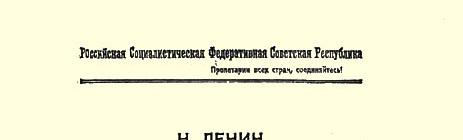

# 在全俄工会中央理事会共产党党团会议上关于租让问题的报告８０

> （１９２１年４月１１日）

### １ 报告

同志们！租让问题在我们这里引起的意见分歧，大大出乎我们的意料，因为还在去年秋季以前，这个问题在原则上似乎就已经肯定下来了，而当人民委员会在去年１１月２３日颁布租让法令时，党内，至少在负责工作人员中间，并没有人出来反对，而且也看不出有什么意见分歧。当然，你们知道，党代表大会专门通过了一项决议，确认了租让法令，并且特别指出这项法令也适用于巴库和格罗兹尼[^1]。由党代表大会加以通过，是为了使中央的政策不致发生动摇，因为中央在这个问题上出现不同意见，从某种意义上说与过去的派别划分完全不同，而是与巴库有很大的关系。 巴库的某些同志不同意这样的看法：巴库（特别是巴库）也必须实行租让，巴库的大部分油田最好实行租让。他们持有各种各样的理由，有的说，我们要自己“想办法”，干吗把外国人叫来；有的说，那些在同资本家斗争中受过考验的老工人不能容忍再退回去受资本家的奴役，等等。

现在我不来评论，这些理由有多少符合总的原则，或者说有多少是巴库的“爱国主义”[^2]，即巴库的地方主义。至于我自己，应当说我是坚决反对这种观点的，我认为，如果我们不能实行租让政策，不能把外国资本吸收到租让企业中来，那就根本谈不上采取重大的、实际的措施来改善我们的经济状况。如果不实行租让政策， 不抛弃偏见，不抛弃地方“爱国主义”，不抛弃行会“爱国主义”和所谓我们自己“想办法”的看法，我们就不能认真地提出立即改善经济状况的问题。必须下决心作出许多牺牲，忍受许多困苦和不便， 必须下决心同旧的习惯决裂，甚至要根除顽症，才能把各主要工业部门大大向前推进，使它们的经济状况有所改善。我们无论如何都要做到这一点。

在党的代表大会上，大家的注意力都集中在对待农民的政策问题和粮食税问题上，后一问题现在在整个立法工作中占着首要地位，它已引起了全党的注意，成了主要的政治问题。在这两个问题上，我们已经意识到，如果不以恢复自由贸易和自由工业作拐棍，我们就不能迅速提高大工业的生产率以满足农民的需要。而现在我们要依靠这副拐棍站立起来，因为每一个头脑清醒的人都知道，不使用这副拐棍我们就跟不上生活的要求，因为目前的情况正在继续恶化—— 这从下面的情况也可以看出：今年春天由于一系列的原因，首先是自然原因，大部分木材不能浮运。燃料危机日益逼近。其次，从今年春天的气候条件来看，还可能出现歉收和饲料缺乏的情况，这样我们得到的燃料还会减少。如果再闹旱灾，危机的性质就会极端严重。必须认识到，在这种情况下，我们的党纲首先讲到的关于要坚决增加产量的这些话，并不是为了拿来欣赏，也不是为了对各种决议表示好感（这是某些共产党员极其热中的）， 而是为了要坚决增加产量。可是不借助于外国资本，我们就做不到这一点。任何一个人，只要他不抱幻想而正视现实，他就应当懂得这个道理。这就说明了为什么租让问题具有这样大的意义，以致需要党代表大会来处理它。

人民委员会在经过几次讨论后通过了租让合同的基本原则。８１现在我把这些原则宣读一下，并且把具有特殊意义或引起意见分歧的一些原则指出来。全体共产党员，特别是工会运动的领导者，即组织起来的无产阶级群众、组织起来的无产阶级大多数人的领导者，如果不了解当前的局势，不能从中得出适当的结论， 那就不可能认真谈论什么经济建设。现在我把人民委员会通过的租让合同的基本原则逐条地宣读一下。不过应当补充说明的，就是直到目前为止我们还没有签订过一项租让合同。原则上的意见分歧我们都讲出来了（在这方面我们是行家），可是租让合同却一项也还没有签订。也许有些人正为此而高兴。要是真有这种人，那是很可悲的，因为，如果我们不把资本吸收到租让企业中来，那就表明我们在经济上没有一点求实精神。但是共产党员要写决议还有的是机会，剩下的纸张有的是，他们随便要写多少都行。第 １条：

“１承租人有责任改善承租企业中工人的生活状况（与当地同类企业的其他工人相比），使其达到国外的中等标准。”

我们把这主要的一点订进合同里去，为的是使我们经济机关中的共产党员和领导人一下子能了解问题的实质。在实行租让的时候，对于我们来说最重要的是什么呢？当然是提高产量。这是不言而喻的。但是我们可以立即做到改善租让企业工人的生活状况， 这一点即使不比前一点更重要，那也是同样特别重要的。租让合同里的这两点，是经过多次讨论，是经过俄罗斯联邦的一些全权代表，特别是克拉辛同志在国外同当代帝国主义的一些金融大王进行多次磋商之后确定下来的。必须指出，在我们这里，你们自己也很清楚，大多数共产党员是从书本上知道什么是资本主义，什么是金融资本的，也许他们还就这些问题写过小册子，可是要让他们同金融资本的代表认真地进行谈判，一百个共产党员中就有九十九个不会，而且永远也学不会。

克拉辛同志在这方面特别有素养，因为他在德国和俄国都从实际上和组织上研究过工业的情况。我们把这些条件告诉克拉辛同志的时候，他回答说：“大体上可以接受”。首先要使承租人承担的责任，是改善工人的生活状况。克拉辛同一位石油大王初步谈判时就谈到这一点，而西欧的资本家也明白，在工人目前的生活状况下，要想提高生产率是完全不可能的。要承租人承担改善工人生活状况的责任，这并不是出于什么人道的愿望，而纯粹是从问题的实际方面考虑的。第２条：

“２鉴于俄国工人劳动生产率不高，可以根据他们生活条件的改善情况在可能的范围内修改他们劳动生产率的定额。”

为了避免对条文作片面的解释，加上这个附带条件是必要的。 对于同租让企业打交道的苏维埃政权的代表来说，这些条文就是准则和指令，也是如何拟订合同的指示。我们现在已经有了石油合同草案、轴承工厂合同草案、森林租让草案以及谈了很久、但由于种种原因还没有实现的关于堪察加的合同。需要第２条，是为了使人们不至于对第１条只按字面去解释。我们应当考虑到，在工人的生活状况没有改善以前，劳动生产率是不会提高的。不考虑到这一点，就不是实事求是地谈所有有关租让的问题，资本家也就不会来同我们谈判。第３条：

“３承租人应当从国外为承租企业的工人运来生活必需品， 其出售价格不得高于成本加一定比例的附加费。”

我们原先确定附加费为１０％，但在最后讨论时我们把这个百分数删去了。在这里，重要的是我们把从国外为工人运来生活必需品这一点作为一条基本原则。我们知道，按照我国目前农民经济和燃料的情况，我们不可能在最近几年内根本改善工人的生活状况， 因而也就不可能提高劳动生产率。所以把承租人必须从国外运来一切消费资料这一点订入合同是必要的，而且对他们来说也是完全办得到的。在这方面我们已取得几个贪婪的资本主义商人的初步同意。由于承租人非常需要一些很有价值的原料，他们是会接受这些条件的。他们迫切需要输入原料。不管这些非常重要的企业将来雇有１万工人、２万工人或３万工人，承租人为他们弄到全部必需品是一点也不费力的，因为现代辛迪加和托拉斯都具有广泛的联系，而不参加辛迪加和托拉斯的资本家几乎没有。一切大企业都是建立在垄断而不是自由市场的基础之上的，因此它们可以使其他资本家得不到原料和产品，而它们自己则可以按照一切预定的合同如数得到产品。这些辛迪加控制着亿万财富，他们能够支配大量的粮食储备，因而能够为几万工人弄到粮食和其他必需品，并且把这些东西运到俄国来。

这对他们在经济上是没有任何困难的。他们把这些企业看作是非常重要的企业，即使拿不到１０００％的利润，也能拿１００％的利润，所以他们愿意供给这些企业粮食。我再说一遍，这对他们在经济上是没有任何困难的。我们应当把改善第一类企业以及其余各类企业工人生活状况这一点作为我们租让政策的基本原则。下面是第４条：

“４如经俄罗斯联邦政府要求，承租人除运给承租企业工人必需品以外，还应当按这个数量再增加５０—１００％，以同样价格 （成本加一定比例的附加费）卖给俄罗斯联邦政府。俄罗斯联邦政府有权用承租人生产的部分产品来支付这笔货款（即从自己的提成中扣除）。”

几个金融大王在同我们进行初步谈判时，已经认为这个条件可以接受，因为承租企业对他们来说是非常重要的。

我们拿石油这类产品来说，外国资本家从我们这里得到石油以后，他们就有可能作为垄断者在国外销售石油。因此他们不仅能够供应承租企业工人粮食，而且还能够再多供应一些。把这一条同第１条比较一下，你们就可以看出，租让政策的中心问题是什么， 这就是从国外弄来一些消费品，以改善工人的生活状况，首先是改善租让企业工人的生活状况，其次还要稍微改善一下其他工人的生活状况。现在，即使我们有偿付能力，在国际市场上也买不到这些东西。即便你有通货，比方说有黄金，也不应忘记自由市场已经没有了，整个市场，或者说几乎整个市场，都被辛迪加、卡特尔和托拉斯占据了。它们追求帝国主义的利润，它们只供应本企业工人必需品，而不供应其他企业的工人，因为旧的资本主义（就自由市场来说）已经不存在了。你们从这里就可以看出针对目前金融资本以及托拉斯与托拉斯之间进行激烈斗争的情况而制定的租让政策的实质。租让政策是一方为了反对另一方而缔结的联盟。现在我们的力量还不够强大，我们应当利用托拉斯之间的敌对关系，以便使我们能够支持到国际革命的胜利。保证工人的生活，承租人是能够办到的，因为对于现代大企业来说，多保证两三万工人的生活，是算不了什么的。这样我们就能够用原料（例如石油）去抵偿开支。如果我们能够用更多的木材、矿石这些我们的主要的财富换取更多的工人生活必需品，那我们就有可能首先改善租让企业工人的生活状况，并用剩余的物品来稍微改善一下其他工人的生活状况。第 ５条：

“５承租人必须遵守俄罗斯联邦的法律，包括有关劳动条件、 发薪期限等方面的法律，必须同工会达成协议（在承租人认为有必要时，我们同意作这样的一点补充，即在协议中定出一个双方都必须遵守的相当于美国或西欧普通工人的标准）。”

提出这个附带条件是为了消除资本家对我国工会的顾虑。我们说承租人应该同工会达成协议，是因为工会的参与象一根红线贯穿于一切立法之中，因为一切具有这种重大意义的法律，工会都有权参与，工会的符合于社会主义原则的地位是受到法律保障的。 如果我们说资本家应该同工会达成协议，那么资本家就会顾虑重重，因为他们很清楚，工会受共产党党团领导，并且通过党团而受党的领导；在他们看来，这些共产党人是什么荒唐事都干得出来的，因此他们也许会提出根本不能实现的条件。从资本家的角度来看，产生这种顾虑是很自然的。因此我们必须说，我们主张订立实际的协议，否则就什么都谈不上。因此我们说，我们同意作这样的补充。我们和我们的工会同意接受这样一个相当于美国或西欧普通工人的标准。我再说一遍，否则就签订不了任何可以为资本主义关系所接受的合同。第６条：

“６承租人必须严格遵守符合俄国和外国法律的科学的技术规程（详细条文在每个合同中具体规定）。”

这一条在每个合同中将特别详细地规定。例如，在石油合同中就有１０项条款写明了详细的科学的规程。资本主义经济的基本特性，就是不能科学地、合理地利用土地和劳动力，而科学的技术规程就是同这种现象作斗争的手段。我们知道，例如油田如果开采得不合理或者不够合理，就会遭到水淹。显然，获得技术装备对我们具有很大的意义。这里我只提一提，《俄罗斯电气化计划》一书对我们在技术装备方面的需要粗略地作了计算。绝对准确的数字我不记得了，大体上电气化需要１７０亿金卢布，而第一批工程要花将近 １０年的时间才能完成。我们估计，靠我们的黄金储备和出口可以偿付１１０亿，这样还有６０亿没有着落。因此该书作者得出的结论是，必须借债或者实行租让。总之不足之数必须设法补上。这个计划是由最优秀的专家根据全国的情况，即根据各个工业部门有计划发展的观点制定出来的。计划中首先谈到的是燃料问题以及在各个主要工业部门中如何最经济、最合理、最充分地利用燃料的问题。但是我们如果没有靠租让和借债筹措的资金，就不能完成这项任务。当然，在某种最符合我们愿望的情况下，这些条件实际上会不存在。在大罢工之后，比如在英国目前的大罢工和德国不久以前遭到失败的大罢工８２之后，在失败的罢工之后接着将是胜利的罢工和胜利的革命，那时我们碰到的将是社会主义的关系而不是资本主义的关系。

在石油开采中断时发生的危险，是非常可怕的。资本家始终没有达到１９０５年前巴库所达到的标准。原来，外国的石油产地，例如加利福尼亚和罗马尼亚，也认为油田淹水是很危险的。不把积水排尽，会使淹水的情况愈来愈严重。

外国和俄国的法律对此都作了详细的规定。当我们在巴库进行这个工作时，曾向我国专家了解关于罗马尼亚和加利福尼亚的法律。为了保护我国的原料产地，我们应当执行和遵守科学技术规程。例如，在出租森林时，必须规定要合理经营林业。在出租油田时，必须规定要同淹水现象作斗争。这样就必须遵守科学技术规程，进行合理开发。这些概念是从哪里得出来的呢？是从俄罗斯和外国的法律中得出来的。这样就可以消除一种顾虑，即认为这些规程是我们自己臆造出来的，否则恐怕没有一个资本家愿意同我们谈判。我们所吸取的是俄国和外国法律中已有的东西。如果我们把俄国法律和一切外国法律中好的东西都吸收过来，那么在这个基础上我们就有可能保证达到现在先进资本家所达到的标准。这是一个相当实际的标准，它所根据的并不是资本家最害怕的共产主义的幻想，而是资本主义的实践。我们保证，在签订这些合同时， 租让合同的各种条件、各个方面、各项条款都不会超过资本主义法律的有关规定。这个基本原则是一分钟也不能忘记的。我们应当根据资本主义的关系来证明这些条件是资本家可以接受的，并且对他们是有利的，同时我们自己也应当能从这里面得到好处。否则，一切关于租让的议论都是空谈。总之，我们所提出的都是资本主义法律所承认了的。大家知道，在技术改良和技术装备方面，先进的资本主义大大超过了我国目前的工业。因此我们不能局限于采用俄国一国的法律。例如，在石油方面，我们援引了俄国、罗马尼亚和加利福尼亚的法律材料。我们可以援引任何一个国家的法律， 这样就会消除人们的种种顾虑，使他们不会怀疑我们这样做是随心所欲，凭空臆造。对于现代的先进资本家，对于金融大王和现代的金融资本家来说，这是很清楚的。这些人是根据外国的条件、外国的标准办事的。我们在提出这个标准时，已经考虑到资本主义的实际要求。这方面我们并不抱任何幻想，我们有一个实际的目标， 那就是改善我国的工业，使它达到先进的现代资本主义的水平。凡是熟悉我国工业状况的人都知道，这种改善将是非常巨大的。如果我们能够改善一部分工业，哪怕是十分之一的工业，那也是前进了一大步。这对他们来说是能够做到的，对我们来说，也是非常符合我们的愿望的。第７条：

“７关于承租人从国外运来装备的问题，参照第４条规定的办法处理。”

第４条谈到，承租人除运来本工程项目所需的东西外，还必须 （如果合同上有这条规定的话）多运来一些，按特殊价格卖给我们。 如果资本家为自己运来精良的钻机和其他工具，我们有权要求他们除了满足自己的需要以外，再多运来一些，例如再多运来２５％， 我们将按照第４条所规定的价格，即按照成本加一定比例的附加费来支付。

未来是非常美好的。可是决不能把这两方面的事情混淆起来： 一方面要进行宣传鼓动，加速这个未来的到来；另一方面要使自己现在能够在资本主义的包围中生存下去。如果我们办不到这一点， 那就会象一个谚语所说的，“等到太阳升东方，眼珠已被露水伤”。 我们应当有本事根据资本主义世界的特点，利用资本家对原料的贪婪使我们得到好处，在资本家中间—— 不管这是多么奇怪—— 来巩固我们的经济地位。事情似乎很奇怪：社会主义共和国怎么能依靠资本主义来改善自己的状况呢？但是在战争中我们已经看到过这种情况。我们在战争中取得了胜利，这并不是因为我们强，而是因为我们虽然弱，却利用了资本主义国家之间的敌对关系。现在，若不利用托拉斯之间的敌对关系，我们就不能适应资本主义的特点，就不能在资本主义的包围中生存下去。第８条：

“８关于租让企业工人的工资是用外币还是用特别流通券或苏维埃货币等等来支付的问题，可以通过专门协商在每份合同中加以规定。”

你们从这里可以看到，我们准备接受一切可能的支付形式，即外币、流通券或苏维埃货币，并且预先表示愿意很好地考虑实业家向我们提出的一切建议。我们的代表听到的一些具体的建议中有一条是万德利普的建议，他说：“我愿意付给工人中等水平的工资， 比如说，一天一块半美元。然后我就在我承租的地区开设几家铺子，出售工人必需的一切物品，但是必须持有一种特别的流通券才能在这些铺子里买东西，而这种流通券我只发给我的承租企业内的工人。”不管他会不会这样做，我们认为这在原则上是完全可以接受的。当然，这里会产生许多困难。要把适应资本主义生产的租让制同苏维埃观点结合起来，自然不是一件容易的事，正象我所说的，这方面的一切努力，都是资本主义同社会主义斗争的继续。这场斗争的形式变了，但它仍然是一场斗争。所有的承租人仍然是资本家，他们力图破坏苏维埃政权，而我们则应当尽量利用他们的贪婪。我们说：“只要能改善我国工人的生活状况，即使他们赚１５０％ 的利润，我们也在所不惜。”这就是要进行斗争的原因。当然，在这方面的斗争比缔结任何和约的斗争都需要更大的随机应变的本领。每次缔结和约时都要进行斗争，而且都有资产阶级列强在背后参与斗争。当我们在同拉脱维亚、芬兰和波兰缔结和约时，列强就曾经在它们背后出谋划策。我们必须这样来缔结和约：一方面要使资产阶级共和国能够生存，另一方面又要使苏维埃政权在世界外交方面得到好处。在同资产阶级列强缔结的每一个和约中，有些条文是经过一场战争才订下来的。同样，租让合同的每一项条文都带有战争性质，因为每一项条文的制定都要经过一场战争。因此，必须善于在这场战争中保卫自己的利益。这是可以做到的，因为资本家从承租企业中得到大量利润，而我们则要使我国工人的生活状况有所改善，通过提成多得到一些产品。如果以外币支付，那就会产生一系列复杂的问题：这些外币怎样换成苏维埃货币，怎样防止投机倒把，等等。我们早就考虑过，任何一种支付方式我们都对付得了，我们都不害怕。资本家先生们，你们爱想什么办法就想什么办法吧—— 这一条所谈的就是这些。你们运来的货物是否用特别流通券支付，是根据特别条件出售，还是只凭租让企业工人的证件出售，这对我们是无所谓的。无论什么条件我们都对付得了，我们要根据这些条件同你们进行斗争，争取在一定程度上改善我国工人的生活状况。这就是我们为自己规定的任务。这个任务如何通过租让合同来完成，那很难说。例如，在堪察加就不能提出象我们这里或巴库那样的支付条件。如果在顿涅茨煤田实行租让，支付的形式就不可能跟遥远的北部相同。在支付的形式上，我们丝毫没有束缚资本家。合同的每项条文都包含着资本家同社会主义者的斗争。我们不怕这场斗争，并且早就相信我们从租让中能够得到可能得到的好处。第９条：

“９雇用外国熟练职工的条件，以及有关他们的物质生活和报酬的问题，由承租人同他们自行协商解决。

工会无权要求对这样的工人实行俄国的工资率，同样也无权要求采用俄国有关雇用的规章。”

我们认为这一条是完全必要的，因为要求资本家信任共产党人，本来是一件极端荒谬的事情。这从原则上来看，尤其是从 “讲求实利的”观点来看，都是很清楚的。如果我们说，雇用条件必须由工会批准，如果我们对资本家说，任用任何一个外国技师或专家我们都同意，但是请按照俄罗斯联邦的劳动法典办事，那就很明显，恐怕没有一个外国技师能够而且愿意那样做。因此，这样规定完全是流于形式。也许有人会说，政府讲的是一回事，工会讲的将是另一回事，因为政府不是工会，工会不是政府，这样在法律上就会引起“麻烦”。但是我们写这个不是为了律师和诉讼代理人，而是为了共产党员。我们是根据党的第十次代表大会关于应当怎样实行租让政策的决定写的。在欧洲人可以看到的我国文献中已经清楚地指出，租让政策是由作为执政党的共产党领导执行的。这并不是什么巧妙的把戏，这些文献已经译成各种文字。 如果我们这些政治领导人不指出，我们不能够而且也不愿意在这方面利用我们对工会的影响，那就根本谈不上什么租让政策。教他们这些资本家学共产主义是没有必要的。我们是优秀的共产党员，但是我们并不想通过租让来建立共产主义制度。租让是同资产阶级强国签订的条约。如果有这样的共产党员，他想根据共产主义的原则同资产阶级强国签订条约，那我们就要把他送进疯人院，并且对他说，“你虽然是一个优秀的共产党员，到资产阶级国家去做外交官却不合适”。还有这样的共产党员，他们在考虑租让政策时想在合同中体现出共产主义原则，这种人也快要进疯人院了。在这方面必须懂得资本主义的生意经，不懂是不行的。除非不实行租让，否则就应该懂得，必须给予外国工人和技师充分的自由，利用这些资本主义条件，使之有利于我们。当然，在这方面我们是不打算规定任何限制的。

在第９条的第三部分，有这样一个限制：

“外国职工和俄国职工的比例，无论在总人数方面或各个工种的人数方面，概由双方在签订各个租让合同时通过协商分别加以规定。”

当然，我们不能禁止把外国工人运到我们不能提供俄国工人的地区去，例如运到堪察加去从事森林工业。有的工业地区（如矿山）没有饮用水或粮食，如果资本家愿意到那里去经营，那他们就应该带工人去，在人数的限制上我们可以大大放宽。反之，在有俄国工人的地方，我们就要商定一个比例，使我国工人一方面能够学到东西，另一方面又能够改善自己的生活状况，因为我们想要从租让企业中吸取对我国工人有益的东西，也就是要运用资本主义技术的最新成就来改善我国的企业。这一切，资本家在原则上并没有反对。最后一条—— 第１０条：

“１０承租人在得到俄罗斯联邦政府机关的同意后，有权从俄国公民中聘请高度熟练的专家；具体的雇用条件应得到中央政权机关的同意。”

很明显，在这方面我们不能象对待外国技师和工人那样，给以充分的自由。对于他们，我们不加干涉，因为他们完全受资本主义关系的支配。可是对于我们的专家和技师，我们不许诺他们有这样的自由。我们不能让我们最优秀的专家到租让企业去工作。但是我们并不想完全禁止，不过必须对合同的执行进行自上而下和自下而上的监督。那些将要在租让企业工作的工人、共产党员，应该对是否履行了合同的条件、是否进行职业技术教育、是否遵守法律等方面进行监督。在同一些现代资本巨头进行的初步谈判中，这一条在原则上并没有遭到他们的反对。

这就是人民委员会所批准的全部条文。我希望这些条文能使大家明白我们想实行的是什么样的租让政策。

毫无疑问，每一项租让仿佛都是一场新的战争，不过这是在另一个领域内即在经济领域内进行的战争。我们必须适应这种情况， 但是这一点应该善于根据党代表大会的精神来办。必须争取喘息时机，作出牺牲，忍受困苦，否则我们的目的就不能达到；我们的目的只有一个，就是要在资本主义包围中利用资本家对利润的贪婪和托拉斯与托拉斯之间的敌对关系，为社会主义共和国的生存创造条件。社会主义共和国不同世界发生联系是不能生存下去的，在目前情况下应当把自己的生存同资本主义的关系联系起来。这里就发生了一个问题：租让的具体条件究竟怎么样。例如在石油合同方面，这些具体条件就是把１３—１４的格罗兹尼和巴库租让出去。提成的幅度是，从开采的石油中给我们留下３０—４０％。我们要求保证在一定期限内使石油的开采量达到１亿普特，保证使输油管从格罗兹尼、从彼得罗夫斯克通到莫斯科。至于是否需要付出一定的补贴，这个问题可以在每个合同中加以规定。但是根据这些条件来看，合同什么样应该是清楚的。对工会来说，重要的是党员领导干部要领会这个政策的特点，并为自己规定一个任务：为了执行党代表大会的决定，根据在资本主义包围下社会主义制度的任务， 无论如何要实行这种租让。任何一项租让都会带来好处，都能立即改善一部分工人和农民的生活状况。所以说能改善农民的生活状况，是因为每一项租让都将提供一些我们所无力生产的额外产品， 因而我们可以拿这些产品去同农民进行交换，而不必采用税收的办法。

事情不是很容易的，对苏维埃政权机关来说更是如此。从这个基本立场出发，就应当把实行租让作为我们的任务，而不顾这方面存在的一切偏见，抛弃不愿意变动、不愿意革除旧习气的心理，不怕一部分工人收入多另一部分工人收入少造成的麻烦。这样的麻烦和抱怨还可以举出很多很多，它们足以使任何一项实际的改善都无法实现。外国资本也正是利用这一点在兴风作浪。我还没有看到过其他的政策遭到俄国白卫分子报刊聪明透顶的代表人物这样强烈的反对；喀琅施塔得事件表明了这些人物要比五个切尔诺夫和五个马尔托夫加起来还要高明得多。他们很清楚，如果我们由于偏见而不能改善工农的生活状况，那我们就会给自己造成更大的困难，从而使苏维埃政权的信誉扫地。你们知道，我们一定要实现这种改善。只要能够改善工农的生活状况，我们不惜让外国资本家拿走２０００％的利润—— 而改善工农生活状况这一点则是无论如何应当实现的。

### ２ 讨论时的插话

我们刚才听了施略普尼柯夫同志和梁赞诺夫同志的充满外交辞令的演说。尽管他们现在大声疾呼地提出抗议，但用的却是这样的外交口吻，如果用来同承租人和资产阶级国家进行谈判，他俩倒是最高明不过的了。我们来开会，由我向会议报告中央委员会和人民委员会内部发生的意见分歧。这些分歧在会上的辩论中也会暴露出来…… 由于有意见分歧，才出现了第十次代表大会的决定。 决定说：“赞同人民委员会的法令，在巴库和格罗兹尼实行租让。” 我们打算在这个会上对这个问题彻底讨论一下，因此我请求拒绝施略普尼柯夫和梁赞诺夫的建议，让拟将继续进行的辩论的结果满足他们的求知欲（姑且不说是好奇心）。

### ３ 总结发言

同志们！这里从一开始就有人问起，我们对租让问题的意见分歧是否很大。施略普尼柯夫同志还希望更系统地了解每一项合同。 我担心，单是由于技术条件的限制，这一点也是办不到的。例如，在同一些强国签订和约时，总是先作出一般性的指示（起初这种指示拟得非常详细），然后我们的做法往往是这样：同资产阶级国家签订的某一种类型的和约不加声张地予以接受，而大量的细节问题就交给受权签订条约的代表们去处理。人民委员会和中央委员会的大多数委员则很可能对大部分细节并不了解。这件事也是如此： 我们注意的是原则问题，而我们感到有产生意见分歧的危险。所以党的代表大会不得不进行干预。所以我们这个只有党员参加的会议是一次互相通气的会议。我们向你们宣读了人民委员会作出的决定。

人民委员会作出的决定是同两位很有名的工会工作者８３的建议截然相反的。除了举行现在这样的会议，还有什么其他办法向共产党党团的多数成员征求意见呢？结果，意见分歧比我们想象的要小。这是最符合我们的愿望的。这次会议不作记录，我们不准备在报刊上进行讨论。目的已经达到了。

我们向你们介绍人民委员会的决定，是要让你们了解，我们是怎样作出党代表大会的决定的。遗留下来的意见分歧，无非是一些在日常工作中的各种问题上常见的分歧，可以用简单表决的办法来解决，不致成为妨碍工作的理由。这样，服从多数就不仅是一种形式，而且是一种使工作不致受到妨碍的办法。我认为，我们在这里取得了这样的成果，即没有发生任何重大的意见分歧，而局部性的意见分歧在工作进程中是会消除的。

梁赞诺夫同志纯粹出于个人的特性，竭力把同工人反对派的意见分歧也牵扯出来。他特地挑选了那种必然惹怒别人的措辞，然而他并没有达到目的，发言的人谁也没有受到挑动。

一位同志在字条上写道，我们这里是在签订第二个布列斯特条约。第一个布列斯特条约是成功的，而对第二个他有怀疑。从某种程度上说，这样说是对的。但是现在这个条约是经济领域里介乎布列斯特条约和同任何一个资产阶级强国签订的条约两者之间的东西。我们已经签订了几项这样的条约，其中包括同英国签订的一项通商条约。租让合同就是介乎布列斯特条约和同资产阶级列强签订的这类条约之间的一种条约。

接着梁赞诺夫同志提出了一个完全正确的看法，这一点我想在开始时就强调一下。他说：如果说我们想签订租让合同，那并不是为了改善工人的生活状况，而是为了提高生产力。完全正确！ 我们决不放弃改善工人的生活状况，我手头就有国民经济委员会的工作人员拟订的同瑞典“滚珠轴承”公司签订的合同草案。（读草案）

在这份合同里没有规定改善工人生活状况的义务。确实，合同规定：俄国政府负责供应工人的一切必需品，如果俄国政府做不到这一点，资本家就有权从国外调进工人。至于俄国政府是否有能力向工人提供计划规定的一切，我想，无论是我们，还是国民经济委员会，或是瑞典方面，谁都不抱幻想。但是不管怎样，在这一点上梁赞诺夫同志是完全正确的，因为实行租让的出发点不是改善工人的生活状况，而是提高生产力，是我们为了增加产品数量而作出巨大牺牲的一笔交易。那么，这些牺牲表现在哪里？有人说我在粉饰或者缩小这些牺牲。特别是梁赞诺夫同志企图对此大加挖苦。我并没有缩小这些牺牲，我倒说过，也许我们不得不把百分之几百的，甚至百分之几千的利润给予资本家。关键就在于此！

我原来设想，根据专家们的计算，假如资本家从他生产的１亿普特石油中，拿走５０００万到６０００万普特，运去出售，获利 １０００％，或许更多，而我们拿３０—４０％的石油，那么情况是很清楚的。而当我们试图弄清楚克拉辛同那些生意人，即同那些贪婪的商人初步商谈的合同条件时，我问他：“是否能设想这样一种合同，即商定给资本家一定百分比的利润，譬如８０％，行不行？”他说：“现在谈不到利润多少的问题，因为这帮强盗们现在要攫取的不是 ８０％，而是１０００％的利润。”

在我看来，牺牲将是极其巨大的。如果我们把矿山或者森林租让出去，把国外急需的原料，譬如说锰矿石，拿出去，那就是说，我们无疑要作出巨大的牺牲。格鲁吉亚现在已经成了苏维埃的格鲁吉亚。目前是要把格鲁吉亚、阿塞拜疆和亚美尼亚这三个高加索共和国联合成为一个经济中心。石油是阿塞拜疆生产的，需要通过巴统，通过格鲁吉亚境内运输，这就会形成一个统一的经济中心。

有一条消息说，格鲁吉亚的孟什维克政府曾签订过一项租让合同，这项合同对我们来说大体上也可以接受。我在此之前只能同格鲁吉亚的同志们联系了一下，从同全俄中央执行委员会秘书叶努基泽同志（他本人就是格鲁吉亚人）的谈话中了解到，他曾经到过那里，并且同格鲁吉亚的孟什维克政府签订过一项条约，但不是租让合同，规定他们无抵抗地把格鲁吉亚１

６的土地交给我们，而他们则得到不受侵犯的保证。８４

但是，他们在叶努基泽同志参与下签订了这项条约以后，尽管得到了不受侵犯的保证，却还是宁肯从巴统跑到君士坦丁堡去了。 这样一来，从得失这两方面对我们都有利：我们得到了领土，即巴统及其周围地区—— 不是为俄罗斯，而是为苏维埃格鲁吉亚；失去了大批跑到君士坦丁堡去的孟什维克。

现在知道，格鲁吉亚革命委员会十分倾向于批准租让那些过去从未开采过的煤矿，并认为这种租让是极其重要的。有两个外国的代表—— 意大利和德国的代表—— 曾来到格鲁吉亚，并且在苏维埃革命时也没有离开。这个情况极为重要，因为同这些国家发展关系，即便是通过租让发展关系，也是我们所希望的。意大利甚至同格鲁吉亚已订有租让合同；而德国的情况是，奇阿图拉锰矿中极大一部分是属于某些德国资本家的。现在的问题是把这项所有权改为租借权或者承租权，也就是把那些原来为德国资本家所有的矿山仍然租借给那些德国资本家。鉴于高加索政治局势的变化，租让关系是有可能形成的。而对我们来说，重要的是把一扇又一扇窗户打开。同英国签署的条约是社会主义共和国同一个资产阶级国家签订的条约，是一项给我们增加了一定负担的条约。

对于第一个同我们签订条约的国家，我们支付给它的黄金数额，要比给其他国家的多得多。而结果证明，由于签订了这个条约， 我们才开了一扇窗户。而我们对任何一种租让也正是应当从这个观点出发来加以评价。

德国和意大利迫于自己的经济状况，不得不找俄国结成联盟。 对于俄国来说，同德国联盟能开辟经济发展的广阔前景，这与德国革命是否将很快取得胜利无关。我们同德国的资产阶级政府也能谈判，因为凡尔赛条约８５使德国处于难以忍受的地位，而同俄国的联盟则能开辟完全不同的前景。意大利由于没有自己的燃料来源， 所以决定开采在他们之前从未有人开采过的高加索煤矿。如果德国人对石油租让动了心，那是毫不奇怪的，因为德国根本没有燃料。

这里有位同志说，堪察加的租让项目不会改善工人的生活状况。这个说法是完全错误的。梁赞诺夫同志挖苦说，我们同万德利普打交道是要吃亏的。这说得也根本不对。的确，我们犯过一个错误，就是给哈定发了电报。但是既然直到目前为止我们同美国没有签订任何合同，也未有任何交往，所以在这方面也就不存在错误了。我们仅仅看出了万德利普是在吹嘘他同美国政府的联系而已。 现在完全有可能通过派遣我们的代表到加拿大去购买机车，通过这扇旁门，我们将能取得进入美国市场的某种通道。

关于堪察加的租让谈判，现在已开始积极进行。说这些租让项目不会改善工人的生活状况，那是完全不正确的。如果这些租让项目能够实现，工人的生活状况无疑会得到改善，因为我们将会得到一定的提成，似乎是２％吧。当我们一无所有时，就这２％也多少是笔收入。如果我们从１００万中提取２万，把这２万用来同农民进行交换，那我们就会得到工人所必需的一部分农产品。

其次，我想指出，你们向我们提出的某些意见仍然表明，在工会工作者中还存在着意见分歧，或者更确切地说，还存在着疑虑。 这是唯一的危险。我们需要在我们中间，譬如说通过党员之间深入进行讨论来加以消除。例如，马尔舍夫同志说，支付应用现金，而不是用流通券。至于说阿姆斯特丹分子８６，不管他们会不会攻击我们，我们应当就这个问题取得一致意见。

不久前我重新翻阅了我在１９１８年５月所写的一本小册子。我在这本小册子中引用了孟什维克的《前进报》８７。孟什维克伊苏夫在这份报纸上指责苏维埃政权准备实行租让制，指责苏维埃政权同资产阶级国家搞妥协。[^3]这是孟什维克就租让问题来指责我们的老伎俩。在西欧也已经因为这个问题形成许多集团。共产党人懂得，租让就是一个布列斯特条约。由于我们这个农民占人口绝大多数的国家遭到破坏，我们才不得不去签订这个条约。任何人都知道，没有大工业，国家的复兴是不可能的。

德国的共产党人理解我们为什么要让步，而谢德曼分子和第二半国际８８却说，实行租让证明我们遭到了破产。我还记得，去年在一次会议上我引用了美国沙文主义者斯帕戈的话[^4]，他专门写了一大堆用类似我国阿列克辛斯基的观点来谈论布尔什维克的书。在谈到租让时，他简直是手舞足蹈，欣喜若狂。那时我就指出， 这是彻头彻尾的颠倒是非。昨天国际资本企图扼杀我们，而今天我们却同这个国际资本签订了一系列协定。

我们作出牺牲，把数以百万计的极其宝贵的物资交给外国资本家。他们利用这些物资可以获取百分之几百的利润。这是我们完全有意识地作出的牺牲。但同时我们应当指出：我们容许他们获取随便多少利润，而我们也必须得到我们所需要的好处，即增加产品数量和在可能情况下既改善租让企业中又改善非租让企业中我国工人的生活状况。

施略普尼柯夫同志在这里说，最好把企业租让给俄国工人。这种说法太可笑了。那样的话，就要保证供应燃料等等，而我们连自己最重点的企业都不能保证供应。我们的燃料情况很糟。一般说来，同俄国工人签订任何一种租让合同，在原则上是完全允许的。 但是这种解决问题的办法对我国的大工业是不严肃的，因为我们什么也不能保证供应，而外国的承租人则可以把必需品从国外运来。这就是同外国资本家签订租让合同的不同之处。他们拥有世界市场，我们在经济上却没有一个可靠的后方。而要建立这样的后方，我们至少要花十年时间。这正是我们应当清醒地估计到的。我们所有的工作人员都证明在这个问题上情况就是如此。

我们知道，电气化计划是最节约的计划。我们不能把我国的大工厂出租给俄国工人。这里我们要指望小工业，要发展它，并且首先不该象梁赞诺夫同志或一本小册子的作者那样咒骂我们征收粮食税的措施，那本小册子说我们实施的是无政府工团主义的法律。

谈到发展小工业，我们应当采取一些步骤。这方面不需要国家提供保证就能立即得到一些东西，再说我们连自己最重点的企业都无法保证供应，所以要全力以赴地发展小工业，它会向我们提供农民所需要的某些产品。

关于用现金还是用流通券的问题，我认为：当政权在资本家手里时，这是可怕的。现在对我们并不可怕，因为所有的工厂和企业都掌握在我们手里，而我们现在出租给资本家的连十分之一都不到。我再说一遍，我们不害怕流通券，因为资本家有责任提供我们规定的商品，不光是象这里所提到的咸鱼，还有这样那样的东西。 我们既然采用了外国工人的标准，那么，我们知道，外国工人按标准所得到的食品，比俄国工人所得到的甚至更多、更好一些。

在这个会上施略普尼柯夫同志说：“我们看到过租让是怎么回事。”施略普尼柯夫同志和很多实际工作者都常犯这样的错误。我还常常听到有人说：“你们是公式化地理解租让。资本家总是使最有经验的俄国法学家受骗。”是的，当国家政权掌握在资本家手里， 一切实力都掌握在资本家手里时，是有过这种情形。那时的国家政权是什么？那时的国家政权是居统治地位的有产阶级的事务委员会。资本主义政府是地主和资本家的事务委员会。但是，如果我们手里拥有大批工厂、铁路，我们又有居领导地位的党（在基层有共产党支部，在上层有共产党员），还不能捍卫自己的利益，那就应当去自杀。这就是惊慌失措！

但是我想，我们无论多么不中用，也不至于上当受骗。到目前为止，法国和英国当局同我们签订了几项协定，尽管他们有第一流资产阶级外交家效劳，却一次也没有能够使我们上当受骗，既然如此，那为什么要惊慌失措，似乎一度流通券就能够使我们上当受骗呢？让我们回忆一下布列斯特条约。布列斯特条约难在什么地方呢？为这个条约辩护有什么困难呢？当时有人问我，我是否指望我们能骗过德国人。我由于职务关系必须说，不指望。而现在布列斯特条约已经成了历史的陈迹。

我不知道，加米涅夫同志在准备的那本小册子（其中谈到鲁登道夫）是否已经出版。但是我知道，不是别人，正是鲁登道夫写了一本极好的回忆录，其中有１０页是专门讲述布列斯特谈判的。我和加米涅夫读完这一章后说过：这是对布列斯特条约作的最好的辩护。作者叙述说，在布列斯特谈判中托洛茨基等人是怎样对他们施加压力，又怎样哄骗了他们，等等。那时我们就认为必须把这几页翻译出来，并由加米涅夫同志写一篇短序出版。假如这件事到现在还没有办好，那就是苏维埃政权无能的一件典型事例。其次，我们再举出另一个事实。大家知道，我国驻德大使越飞同志在德国革命前夕被驱逐出境。在这件事之后，请你们不要再轻易预言，谁能骗得过谁。我们不去推断从签订第一个租让合同到欧洲爆发第一次大规模革命将相隔多少天。因此，关于合同问题，我肯定地说，同志们说得完全不对。这对我们一点也不可怕。

合同将规定，他们应当提供哪些商品和按什么价格出售。我们可以同意使用任何一种流通券和配售证。如果他们破坏合同，我们就有权立即废除合同。合同是一种民事契约。至于应该有什么样的仲裁，以及纠纷应由谁来解决的问题，我至今没有去研究。不过我现在可以来看一下同瑞典公司签订的合同草稿。这里是这样说的：意见分歧的解决由……

这里动用了院士，而院士们又设法动用法学家。我记得倍倍尔说过：法学家是最反动的人，而且都是一些资产阶级的人物。当然， 这一点我们可以设法纠正过来。但是这里并没有什么可怕之处。假如承租人提出这个条件，那么我们可以接受它。既然合同明确规定，应当提供哪些商品和配售证如何支付，那么我们可以采纳这个办法。无论是流通券，还是配售证，对社会主义共和国来说都没有什么可怕。另外还有人说，第９条不好，因为我们会脱离国际工会理事会８９。洛佐夫斯基恫吓我们说，阿姆斯特丹分子会攻击我们。 不过反正他们根据其他所有各条也是会来攻击我们的，而结果正象以往那样，还是他们自己碰壁。

你们记得，因为我们向资本家作了一点点让步，孟什维克就曾打算猛烈攻击我们。当我们想要推翻资本主义时，他们说，我们最多只能推翻几天。而当我们推翻了几年以后，他们又在给我们设圈套。他们总是想方设法把对手引到必然挨打的地位。

最初他们称我们是空想主义者，后来建议我们从五层楼倒栽下来。我们知道，我们这里小经济是大量的。小私有者是我们的对手。小私有者的自发势力是我们最危险的敌人。承租人和租借者则是较次要的敌人。官僚制度和官僚主义弊病也是我们的敌人。

至于洛佐夫斯基同志所谈到的那一条，我要说的是：请大家仔细听一听这一条的内容。这里是这样讲的：“工会无权要求对这样的工人实行俄国的工资率，同样也无权要求采用俄国有关雇用的规章。” 这里指的是俄国工会，有人却跟我谈国际工会。当然， 如果资本家看到俄国的条件，那他们就会说这是共产党的条件，是荒谬的条件，会说俄国工会无权提出俄国的雇用条件，因为在这些条件里“塞进” 了某种不合情理的要求。但是俄国工会完全有权采用国际上的职业合同。仅这一点也就够了。这里没有一处谈到禁止罢工。在这方面不应当过早地讲出一切。

至于改善俄国工人生活状况的问题，马尔舍夫同志和塔尔塔科夫斯基同志就这一点攻击说：你们同工人是搞不好关系的，也不能强迫他们去工作，因为如果你们只保证１

５工人的生活，那么其余４

５就不愿在较差的条件下工作了。难道我们的工人是如此不讲道理、不讲文明和不守纪律的吗？假如是这样，那自然理应惊慌失措，并且应当自杀了事。假如有１００个工人挨饿，而我们对他们说，我们只能养活２０个，再多不行，难道他们会不让我们这样做吗？事实上直到如今我们还没有遇到过这种情况。我们勉勉强强供养了某些工业部门的工人，而并不是所有工业部门的工人， 这些企业的工人毕竟并没有全部跑掉，而其他企业的工人却统统跑掉了。难道俄国工人竟然被苏维埃政权的错误弄得连这样一笔帐也不会算了：哪怕养活２０个人，总比逼得１００个人全都挨饿要强吧？这里有很多事情不该把话说得过早。为什么不能使工人在资本家那里轮流干活呢？一部分工人可以干上六个月，领取工作服，然后把位子让给另一部分工人，使他们也能有饭吃。当然，在这个问题上，要同各种偏见作斗争。

当承租人到我们这里来的时候，我们应当约束我们的工会，不让它们提出过分的要求。你们知道，通常的合同期限很短。在欧洲没有签订长期合同的条件。通常的期限是六个月。这样，工人们可以得到东西吃，领取鞋子和服装，然后离开，把位子让给别人。

一部分人干上半年活，吃饱了，领取了美国的鞋子和服装，然后把位子让给别人，这一点我们是否绝对无法做到呢？当然，做到这一点有困难。这需要有比我们现在更强的组织性和纪律性，但并不是不可能做到的。既然我们在三年可怕的饥饿时期能想出办法使工人坚定地反对外国资本的侵略，难道在现在这个问题上我们就不能想出办法来吗？在这条道路上将会遇到什么困难，我是非常清楚的。所以我才说，租让并不意味着阶级间和平的到来。租让是阶级间战争的继续。

如果说，从前的战争表现为我让你挨饿，你什么也得不到，那么现在我要说，我愿意给每人一双鞋，但是工人必须干半年活。而我们将为全部工人都能得到鞋子进行战斗。我们不放弃举行罢工的权利，这一切都还掌握在我们手中，只要我们聪明一些，现在就应当尽量强调对资本家有诱惑力的方面。

这里有人说，让资本家来，让他们来欺骗我们，真是太可怕了。 而我肯定地说这并不可怕，为了提高生产率，就是希望他们来，因为他们有组织得很好的后方、设备完善的工厂。我们可以在这些工厂里订购需要的部件，而不必去自由市场购买，因为自由市场上只有一堆破烂货。第一流工厂今后几年的产品已经预订完了。即使我们用我们的黄金去支付，我们还是什么都买不到，而辛迪加的成员却可以得到一切。只要能改善哪怕是一小部分工人和农民的生活状况，我们即使给资本家多付一点，也在所不惜，因为每多生产一些产品，都可以用来向农民换取粮食，这样就会建立起工人阶级同农民之间的牢固关系。

总之，在结束讲话时，我请求工会工作者不要再辩论这些原则问题，不要再争论了。这都是些无谓之争，都是不切实际的空谈。应当停止这些空谈了。应当把全部注意力放在租让合同的实际条件上，我们只要不是笨蛋，就能从中获得好处。在这方面，工会工作者和党的领导人应当发挥聪明才智，应当切实了解这些条件，而这一切我们不能也不会在报刊上谈论，因为资本家正盯着俄国的报刊， 正如在布列斯特条约时期，我们没有在报刊上谈论过交给越飞同志的是哪些任务一样。事实上，我们要把注意力放在对改善工人和农民生活状况有利的实际办法上。任何一种这样的改善对我们来说都具有重大意义。这才是工会工作者应当注意的事。要消除一切摩擦和偏见。这是一件难事。目前还没有人愿意同我们签订租让合同。人们都预计我们会提出无法实现的要求。

因此，从我们这方面来说，应当全力以赴签订几项这样的合同。我们无疑会犯许多错误。这是一项新的事业。到目前为止，还没有任何一个社会主义共和国同资本家签订过任何租让合同。但是我们需要工会工作者给我们以帮助。在这方面是大有可为的，可以对合同作各种解释，也可以施加各种压力，直至发动罢工，这是我们仍然保留着的权利。

> 载于１９３２年《列宁文集》俄文版  译自《列宁全集》俄文第５版第２０卷  第４３卷第１６５—１９６页

[^1]: 参看《苏联共产党代表大会、代表会议和中央全会决议汇编》１９６４年人民出版社版第２分册第１１０页。—— 编者注

[^2]: 双关语，原文“”一词，既有“爱国主义”的意思，也有“乡土观念”的意思。—— 编者注

[^3]: 见《列宁全集》第２版第３４卷第２８７页。—— 编者注

[^4]: 同上，第４０卷第２５页和第４１页。—— 编者注