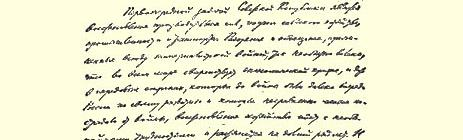
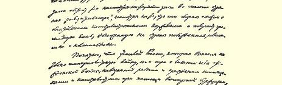

# 劳动国防委员会给各地方苏维埃机关的指令

> 草 案１１５
>
> （１９２１年５月１９—２１日）

苏维埃共和国的首要任务是恢复生产力，发展农业、工业和运输业。帝国主义战争在各处造成了极为严重的经济破坏和贫困，以致经济危机在全世界都来得非常猛烈，甚至在战前比俄国远为发达的和遭受战争灾害极少的先进国家里，恢复经济也异常困难，也需要长达若干年的时间。许多“战胜”国的情况也是这样，虽然它们同最富裕的资本主义强国结成联盟，可以从战败国、附属国和殖民地国家得到巨额贡赋。

落后的俄国既经受了帝国主义战争，又经受了地主和资本家在全世界资产阶级支持下强加在工农身上的三年多的国内战争， 自然在恢复经济时会遇到极大的困难。１９２０年的严重歉收，饲料缺乏和牲畜死亡，使农民经济的状况更加困苦不堪。

根据全俄中央执行委员会颁布的法令，粮食税代替了余粮收集制。法令规定农民可以用余粮自由交换各种产品。税率已经用人民委员会决定的形式公布。粮食税的税额大约比征粮数减少一半。人民委员会还颁布了新的合作社法令，因实行剩余农产品的自由交换，这个法令扩大了合作社的权利１１６。

这些法令对于迅速改善农民经济的状况，提高农民扩大耕地和改进农业与畜牧业的兴趣，以及对于振兴和发展不必由国家筹划供应大量粮食、原料和燃料的地方小工业，都起了很大作用。

在改善农民经济、发展工业、建立农业和工业间的流转等工作中，地方的独创精神在目前具有特别重大的意义。利用新的力量和发挥更大干劲来恢复国民经济的可能性日益增加。

根据全俄苏维埃第八次代表大会的决定负责统一和指导经济系统各人民委员部活动的劳动国防委员会，迫切要求各级地方机关大力开展全面改善农民经济和发展工业的广泛活动，严格执行各项新的法令，并且遵守下述的基本原则和指示。

现在我们用来实际衡量全国范围内经济建设成就的标准主要有两条：第一，是否能够按照国家的规定迅速地把粮食税收齐；第二，—— 这一点特别重要—— 农产品与工业品的商品交换和产品交换的成绩怎样，即农业和工业间的流转的成绩怎样。

这是刻不容缓、非做不可的。这是对整个工作的检查，是为实现伟大的电气化计划奠定基础，而电气化能够恢复大工业和运输业，使它们的规模与技术基础达到足以彻底地永远地战胜饥饿和贫困的水平。

必须先把粮食税百分之百地征足，然后通过剩余农产品同工业品的自由交换，再筹集数量相当于粮食税税额的粮食。当然，这不可能一下子在所有地区都做到，但是我们大家都应当给自己提出这个最迫切的任务。只要我们能够正确理解我国的经济状况，并坚决采取发展经济的正确措施，我们一定能够在最短时期内完成这一任务。各省、各县、各区域中心、各自治共和国的一切地方政

> １９２１年５月列宁《劳动国防委员会给
>
> 各地方苏维埃机关的指令（草案）》手稿第１页
>
> （按原稿缩小） 权和地方机关，都必须同心协力地开展工作，促进剩余农产品的交换。让经验来表明：通过增加生产和提供社会主义大企业的国家产品来促进这种交换的成效如何；鼓励和发展地方小工业的成效如何；在国家计算之中的合作社、私营商业、企业主以及资本家将起什么样的作用。总之，各种各样的能尽量发挥地方首创精神的办法都应当进行试验。我们面临的新任务是世界上任何地方还没有遇到过的，我们在完成这项任务时，由于战后的经济破坏，不但无法精确计算资源，而且无从预测工人和农民还能承受多大的辛劳，因为他们为了战胜地主和资本家已经作出了无比惨重的牺牲。我们应当更大胆更广泛地采取种种办法，从各方面来解决问题，可以在不同程度上允许资本和私营商业存在，不必害怕资本主义的某些滋长，只要能够迅速加强流转，使农业和工业得到复苏就行，并且应当根据实际经验，弄清国家究竟有哪些资源，考虑用什么办法才能最有效地改善工农的生活状况，以便进一步更广泛和更稳固地展开经济建设工作，实现电气化计划。

农民除了交纳粮食税，还有多少剩余农产品可以用来换取小工业和私营商业的产品，还有多少可以用来换取国家提供的产品？ 这两个问题是一切从事经济建设的苏维埃工作人员都必须首先关心的。这是当前的主要方面，我们必须在这方面获得最大的成就， 并且以此来衡量我们的工作成绩，然后考虑，应该怎样去完成今后的任务。一切经济建设问题都应该和当前这两个问题结合起来考虑。

为了实现这种结合，为了鼓励地方尽量发挥首创精神、自主精神和进取精神，为了用地方经验和地方监督来检查中央机关的工作以及由中央来检查地方的工作，从而克服拖拉作风和官僚主义， 劳动国防委员会决定（见决定原文[^1]）：

第一，在各地建立经济会议，使经济系统各人民委员部所属地方机关的工作互相配合。

第二，建立地方经济会议的正常报告制度，以便交流经验，组织竞赛，主要的是根据地方工作及其成绩来检验各中央机关的工作方法和组织形式是否正确。

地方经济会议应当按劳动国防委员会的形式组织起来，它同地方执行委员会的关系就象劳动国防委员会同人民委员会的关系一样。劳动国防委员会行使人民委员会直属委员会的职权。劳动国防委员会的委员是从人民委员会的委员中挑选出来的，因此，这两个机关的工作完全能够互相配合，决不会发生摩擦，而且办事迅速，机构简单，因为劳动国防委员会不设立任何机构，只是通过各部门的机构进行工作，并且尽量使这种机构简化，彼此协调。

省经济委员会和省执行委员会的关系也应当这样，事实上也正是这样。同时，劳动国防委员会在批准区域和边疆区经济委员会的委员和主席的名单时，应当尽量考虑地方工作人员的经验，应当向他们商量之后再予批准。毫无疑问，区域经济委员会无论现在或将来都应当努力使自己的工作和省经济委员会的工作配合好，保证后者尽可能多地参与、过问和关心区域的工作。但是，现在就想对这些相互关系作出统一的规定，则未必恰当，因为经验还很少， 这种规定可能变成纯粹官僚主义的创作。比较恰当的是先在实践中摸索出这种关系的适当形式（劳动国防委员会已和人民委员会一起工作了将近一年，但实际上任何组织条例也没有）。这些形式在开始时最好不要绝对固定下来，最好能够多样化一些，这是有益的，甚至是必要的，这样就可以更精确地研究、更充分地比较各种相互关系的不同形式。

县和乡的经济委员会应当按同样原则组织起来。当然，也可以对基本形式作各种改变，比如，执行委员会可以把经济会议的全部任务和职责承担下来，可以使它召开的“行政性”或“经济性”会议发挥经济会议的作用，可以单独设立（例如在乡里，有时也可以在县里）专门委员会或甚至专门委任一些人去执行经济会议的全部任务或某些任务，如此等等。基层组织应当是**农委**，它应当成为劳动国防委员会在农村中的基层机构。关于适当扩大农委权力和确定它与村苏维埃之间关系的法令，已经由人民委员会批准，并于 １９２１年５月公布。省执行委员会的职责是初步规定一些适合当地情况的条例，这些条例必须有助于**发扬**而不是限制“地方”的**特别是**基层组织的独创精神。

劳动国防委员会在各工业县和各工业区的基层机构应当是区委员会、工厂委员会或工厂管理委员会—— 这要看是涉及一个工业部门还是涉及几个工业部门而定。总之，采取各种形式同县执行委员会、乡执行委员会和农委在工作上**结合**起来，是领导**整个**地方经济生活所绝对必需的方法。

其次，地方机关必须向劳动国防委员会经常报告工作的问题， 具有特别重要的意义，因为我们当前的主要弊病之一，就是缺乏对实际经验的研究，缺乏经验交流，缺乏互相监督—— 通过地方的实践检查中央的指示，通过中央的领导监督地方的实践。克服官僚主义和拖拉作风的一个极重要手段，就是检查地方执行中央的法令和指示的情况，为此，就必须有印成**工作通讯**的报告，而且必须**更多地吸收非党人员**和非主管机关的工作人员参加编写报告的工作。象《我们的经济（特维尔省经济委员会半月刊）》（１９２１年４月 １５日第１期；１９２１年４月３０日第２期）这样的刊物表明，地方上已经意识到需要研究、阐述和公布我们经济工作经验的总结，并且已经找到满足这种需要的正确途径。当然，并不是每一个省都能出版刊物，至少在最近几个月内是如此，也不是各地都能象特维尔省那样每月出版两次，每次发行３０００份。但是，每一个省，甚至每一个县都能够而且应当每两个月写一次（起初允许有例外，间隔时间可以长一些）地方经济工作的报告，把它印出来，比如说印上 １００—３００份。只要我们认识到这项工作的重要性和迫切性，认识到为了满足这种需要就不能让许多部门拿纸张去印大量没有用的或根本不是急需的东西，那我们一定到处都可以找到纸张和印刷所来进行这项小小的工作。假如排小号字，分两栏印（象特维尔省同志所做的那样），并且懂得这样一个不难了解的道理，即哪怕印 １００份，给每个省图书馆和每个国立大图书馆各送一份，就有可能 （诚然，可能性还很小，但这种可能性是**无庸置疑**的）使**全俄国**都了解和参考该地的经验，假如能这样做，那就可以清楚地看到，这一工作是行得通的，是刻不容缓的。

不经常编印工作报告（哪怕份数很少），就谈不上真正吸取经验，真正交流经验，就不可能从非党人员中吸收一切卓越的和有才能的组织家参加工作。而编印工作报告是能够而且应当立刻做到的。

报告必须尽量简短，必须确切地汇报提出的问题。问题分四类：第一类是目前特别重要的问题。对这类问题在每份报告中都必须极其确切详尽地汇报。这所以十分必要，是因为这类问题在目前对大多数县来说，都有非常迫切的意义。对少数的县和区来说，即对纯粹的工业县和工业区来说，提到第一位的是另一些问题。第二类问题也是每份报告都必须汇报的，但往往可以而且应当采用简单综合送交有关主管部门的报告的形式。在这种场合，送交劳动国防委员会的报告必须说明：送交有关部门的报告是在什么时候发出的，发往什么机关，这些报告为说明工作的简要总结列出了哪些数字。劳动国防委员会需要这种说明，以便检查各主管部门的工作，获得各项总结数字，从而了解粮食、燃料、工业等部门的工作成绩。第三类问题不**必**在每份报告中都加以汇报。最初， 即在第一份报告中必须作出汇报，在以后的报告中随着新的资料的积累，只需补充新的材料就行。假如每两个月都要对这些问题汇报，往往会无话可谈。第四类问题是各种补充问题，这些问题事先没有提出，也不是中央提出的，而是地方上发生的问题。这类问题应当由各地方机关自行拟定，不受任何限制。当然，属于国家机密的问题（军事的或与军事行动以及与国家保卫工作有关的问题等等）应当另写专门报告，作为密件专送劳动国防委员会， 不得公开发表。

现将各类问题列举如下：

## 第一类问题 １ 同农民的商品交换

这是当前最重要最迫切的问题。首先，不向军队和城市工人充分地正常地供应粮食，国家就无法进行经济建设，而商品交换应当成为收集粮食的主要手段。其次，商品交换是对工农业相互关系是否正常的检验，是建立能较正常地发挥作用的货币制度的基础。现在，所有经济委员会和所有经济建设机关，都必须特别重视商品交换问题（包括产品交换在内，因为用来交换农民粮食的国家产品， 即社会主义工厂的产品，已不是政治经济学意义上的商品，决不单纯是商品，已不是商品，已不再是商品）。

商品交换的准备工作怎样？做了哪些准备工作？粮食人民委员部做了哪些工作？合作社做了哪些工作？为此设立了多少个合作商店？是否各乡都有？多少村有？商品交换的储备有多少？“自由”市场的价格怎样？余粮和其他剩余农产品的情况怎样？有没有商品交换的经验？有哪些？结果和成绩怎样？同盗窃商品交换储备和盗窃粮食的现象作斗争的情况怎样？（这一点特别重要，必须具体分析**每一起**盗窃事件。）

作为商品交换对象的盐和煤油的情况怎样？纺织品的情况怎样？其他产品的情况怎样？最需要的是什么？农民最缺的是什么？ 地方小手工业生产能提供些什么？发展地方工业能提供些什么？

涉及商品交换进展情况及其结果的数字和事实，对于在全国范围内进行试验具有极重大的意义。

检查和监督商品交换的粮食人民委员部和实现商品交换的合作社之间的关系是否正常？在实践中这种关系究竟怎样？在地方上这种关系怎样建立？

私营商业在商品交换中的作用怎样？私营商业有了多大发展？ 私商人数和他们在主要产品上的交易额怎样？特别在粮食方面的交易额怎样？

### ２ 国家对资本家的态度

商品交换和贸易自由意味着资本家和资本主义关系必然出现。这是没有什么可怕的。工人国家掌握的各种手段足以使这种在小生产条件下有益的和必要的资本主义关系只在适当的限度内发展，足以监督这种关系。现在全部问题就在于确切地研究这种现象的范围，找出国家对它进行监督和计算的适当方法（不是压制， 确切些说，不是禁止）。

在粮食税代替余粮收集制后，私营商业有什么发展？是否在计算之内？都是倒卖粮食，还是也有正当的买卖？它们的登记情况及其结果怎样？

企业主的活动情况：是否有资本家和企业主申请租借某些企业、作坊或店铺？对这类事情的精确计算和分析结果如何？贸易总额是怎样确定的（即使大致确定）？如果有租借者和代销人，那么他们是如何呈报报表的？

有没有人提出代购代销的建议？是要求提取一定佣金代国家收集和采购产品？还是代为销售和分配？或者是要求组织工业企业？

手工业的情况怎样？实行粮食税后有什么变化？它的总的发展情况怎样？材料来自何处？

### ３ 鼓励商品交换工作和整个经济建设工作中的独创精神

这个问题同上一个问题有密切联系。鼓励创新精神往往可能同资本主义关系没有联系。怎样鼓励呢？—— 这是各经济委员会以至所有经济建设机关应予解决的问题。这是一个新问题，目前恐怕不可能有十分明确的指示。整个关键在于要特别注意这个问题，鼓励经济上的任何创新精神，仔细地研究实际经验，并向全国推广。

小农向国家交纳粮食税，并且同国家即同社会主义工厂进行商品交换，这种经济情况当然要求国家即国家的地方机关，从各方面鼓励创新精神和首创精神。交流地方机关的心得和经验，使我们有可能收集资料，今后也许有可能用许多实例和详细指示来补充说明这个普遍的、没有完全明确的问题。

### ４ 协调地方行政单位——乡、县、省内各部门的经济工作

地方各部门工作的不协调，是阻碍经济建设的一大祸害。对这个问题必须特别注意。经济委员会的任务就是要消灭这种不协调现象，扩大地方机关的独立程度。应当收集种种实例，以便把事情办得更好，使成功的例子成为大家的榜样。例如，在粮食极端缺乏的时候，地方在使用存粮方面的独立程度自然不免受到极大的限制。随着适当的监督的建立和粮食储备的增加，这种独立程度也应逐渐扩大。只有这样，才能够而且一定会减少官僚主义，减少运输量，鼓励生产，改善农民和工人的生活状况。粮食、地方小工业、燃料以及全国性大工业等等部门都是有密切联系的，但是，为了管理国家，它们又必须分属于不同的“主管机关”，如果它们不能经常协调工作，不能消除摩擦、拖拉作风、本位主义和官僚习气，就一定会带来害处。地方最接近工农群众，这些缺点也就更明显，因此，地方应当通过交流经验，拟订出一套办法，以便同这些缺点进行有效的斗争。

为协调地方的国营农场、林业委员会、县土地局、国民经济委员会等机构做了哪些工作？做得怎样？对这个问题必须有确切、仔细和详尽的回答。

对只顾地方利益而违反中央命令、损害中央利益的工作人员是怎样处分的？开出受处分者的名单。这种违反纪律现象有没有减少？处分办法是否加重了？具体情况怎样？

### ５ 改善工人的生活状况； ６ 改善农民的生活状况

经济建设的一切成就都会改善工人和农民的生活状况。但是就是在这方面，本位主义和各行其是也带来了不少害处，这是第一。第二，必须把改善工农生活状况的问题单独提出来，以便密切注意这方面所取得的成绩。已经取得了哪些成绩？怎样取得的？对这些问题都必须回答。

连年战争（起初是帝国主义战争，后来是国内战争），使人民疲惫不堪，往往简直是精疲力竭，因此必须特别努力改善工农的生活状况。但是，在资金缺乏的情况下也可以做到而且应当做到的事情，我们还远远没有全部做到。还远不是所有部门和机关都重视这个问题。因此，收集和研究这方面的地方经验，是极为迫切需要的。 对这个问题必须提出最确切、最完备和最及时的报告，以便立刻可以看出，到底哪些地区和哪些部门最落后。这样我们就可以共同努力来更快地改善这种状况。

### ７ 扩大国家经济建设人员的队伍

我们非常需要扩大国家经济建设人员的队伍，但是经常努力这样做的却极其少见。在资本主义制度下，各个企业的“主人”都想方设法—— 瞒着别人并且阻挠别人—— 物色精明的职员、经理和厂长；他们为此奔忙了几十年，可是只有少数几个办得最好的“公司”才获得了良好的结果。现在是工农国家做了“主人”，它就应当广泛地、有计划有步骤地**并且公开地**挑选最优秀的经济建设人员， 挑选专业的和一般的、地方的和全国的行政管理人员和组织人员。 现在我们还常常可以看到苏维埃政权初期即激烈的国内战争和疯狂的暗中破坏时期的后果，这就是共产党员局限在领导者的小圈子内，不敢或不善于吸收足够数量的非党人员参加工作。

应当赶快用一切力量克服这一缺点。在广大的工人、农民和知识分子中涌现出不少有才干而又忠实的非党人员，我们应当把这些人安插到较重要的经济建设岗位上去，同时由共产党员对他们进行必要的监督和指导。另一方面，非党人员也要监督党员。为此必须吸收一批批经过考验而证明其忠诚的非党工人和农民参加工农检查院，或者不担任任何职务，非正式地参加检查工作和对工作提出意见。

最了解工农群众的地方机关，特别是乡、县、区，应当在给劳动国防委员会的报告中提出那些在工作中表现忠诚的、或在非党代表会议上表现突出的、或在全厂全村全乡享有极大威望的非党人员的**名单**，并说明已吸收他们参加什么经济建设工作。这里所说的 “工作”，既指担任一定的职务，也指**不担任任何职务但参加监督或检查的工作**，以及定期参加非正式会议等等。

必须定期汇报这方面的问题。否则，社会主义国家就做不好吸收群众参加经济建设的工作。忠诚老实的新工作人员是有的，在非党人员中就有很多，只是我们不知道。只有地方的报告才能帮助我们了解他们，帮助我们在更广泛的、逐步扩大的工作中考验他们， 帮助我们消除党支部脱离群众这一类弊病，而这种弊病在很多地方是存在的。

### ８ 同官僚主义和拖拉作风作斗争的方法和效果

起先对这个问题的汇报大都可能是很简单的：既谈不上什么方法，也谈不上任何效果。全俄苏维埃第八次代表大会的决定人们都读过了，但是也都忘掉了。

这方面的情况虽然令人失望，但是我们决不能学那些灰心丧气撒手不管的人。我们知道，官僚主义和拖拉作风主要是同俄国的文化水平低、战争所造成的严重经济破坏和贫困等后果有关的。同这种弊病作斗争只有经过多年的顽强努力才能取得成效。因此决不能灰心丧气，必须一次又一次地从头开始，恢复中断的工作，试行能达到目的的各种办法。

办法有：改组工农检查院；通过工农检查院或者用其他办法吸收非党人员参加检查工作；司法追究；裁减职员和精选职员；检查和协调各部门的工作，如此等等。所有这些办法，苏维埃第八次代表大会决定中所提出的一切措施，以及报刊上指出的一切方法，都应当有步骤地、坚持不懈地、反复多次地加以试验、比较和研究。

省经济委员会和负责统一及指导地方经济建设工作的其他一切机关，都必须要求实行法律所规定的和从实际经验中得出的一切办法。必须把地方的经验汇集起来。必须向劳动国防委员会提出有关上述问题的报告，不管在开始时对提出确切、全面、及时的报告多么不习惯。劳动国防委员会一定要求做到这一点。这项工作无疑一定会收到良好的效果，虽然不会象有些人所期望的那样快，这些人不是为采取各种具体措施而进行坚韧不拔的工作，而往往把“反对官僚主义的斗争”变成空谈（或变成重复白卫分子、社会革命党人以及孟什维克所散播的诽谤）。

## 第二类问题 ９ 农业的发展：（１）农民经济；（２）国营农场；（３）公社；（４）劳动组合； （５）协作社；（６）其他形式的公有经济

极简要地综合送交主管部门的各项报告中的数据，并注明发出每份报告的日期。

比较详尽地汇报（不必在每份报告中汇报，可以每隔四个月至六个月汇报一次）地方经济中最重要的情况、调查研究的总结、各项重大的措施和对这些措施的效果必须进行的检查情况等。

各种集体经济组织**（第２—６项）**的数目，每年至少确切地汇报两次，并且把它们分成办得最好的、中等的和不好的三类。每年至少要有两次详细地介绍每一类的一个典型例子，并提出一切有关材料，确切地说明该单位的大小、所在地、总产量以及它对农民经济的帮助等等。

### １０ 工业的发展：（１）中央直接管理的大工业； （２）部分或完全由地方管理的大工业； （３）小工业、手工业和家庭工业等等

汇报的要求同前一节。地方机关可以就近直接了解第１项全国性大企业的日常活动和工作，了解它对周围居民的影响和居民对它的态度，因此地方机关在每个报告中都必须汇报这些大企业的情况，汇报地方机关是怎样帮助这些大企业的，帮助的结果怎样，这些企业对当地居民是怎样进行帮助的，这些企业迫切需要什么，它们的工作有什么缺点，等等。

### １１ 燃料：（１）木柴；（２）煤；（３）石油； （４）页岩；（５）其他燃料（柴火等）

和前两个问题一样，极简要地综合送交主管部门的各项报告中的数据，务必注明发出这些报告的日期。

详细汇报特别重要的问题，汇报本部门范围以外的问题以及工作上与地方互相配合的问题等。

必须特别注意节约燃料。在这方面采取了哪些措施？效果怎样？

### １２ 粮食

综合送交粮食人民委员部的各项报告，要求同上。

蔬菜业和郊区（以及工厂区附近的）农业的情况。它们的生产结果。

地方在办理学生和儿童的膳食、建立食堂和办理公共饮食业方面的经验。

各项综合材料必须有两方面的数字：领粮的人数和每两个月的粮食供应量。

在各大消费中心（大中城市，特别居民区的军事机关等）我们养活着很多多余的人，这就是那些混进来的旧官吏、暗藏的资产者和投机商等。必须经常“捕捉”这些“多余的”人口，因为他们违反了 “不劳动者不得食”这条基本准则。为此，应在上述各地指定专职统计人员负责研究１９２０年８月２８日的人口普查材料和日常的统计材料，每两个月报告一次关于多余的人口的情况，报告由统计人员签字。

### １３ 建筑业

汇报的方式同上。在这个部门里，地方的首创精神和自主精神特别重要，应当充分地加以发挥。必须详细汇报该部门所采取的最重要的措施及其效果。

### １４ 模范的企业与作坊和最糟的企业与作坊

必须汇报每一个与经济建设有关的，称得上模范的、或比较优秀的、或工作有些成绩的（如果连一个模范的和优秀的都没有的话）企业、作坊和机关的情况。列出这些单位管理委员会的成员（姓名）。说明它的工作方法和效果以及工人和居民的态度等。

最糟的和无益的企业的情况也应当这样汇报。

特别重要的问题是关闭那些非绝对需要的企业（最糟的以及关闭后可以把工作移交给少数较大企业的企业等）。统计这种“多余的”企业有多少，国家如何逐步关闭这些企业。

### １５ 经济工作的改进

汇报某些发明者和优秀工作者（列举其姓名）所实行的特别重要的和有示范意义的改进，以及地方机关认为重要的试验等等。

### １６ 实物奖励

在社会主义建设中这是一项有极重要意义的制度。吸引人们参加劳动是社会主义的一个最重要和最困难的问题。

必须经常注意实际经验，加以收集和研究。

每两个月必须具体报告一次：发了多少实物奖？奖了什么物品？发给哪一个工作部门？（可以把林业部门和其他一切部门分别列出）把工作总结、工作成绩、产品数量同发出的实物奖数量作比较的情况如何？

有没有把实物奖变成工资后备金的情况？如果有，必须分别说明。

对成绩特别好的企业发过多少实物奖？对工人分别发过多少实物奖？确切介绍每个事例。

研究一下：有没有可以通过提高实物奖的办法来获得当地的产品（用来同国外进行商品交换和满足国内特别重要的用途）？这种研究是非常重要的，如果能够正确地、普遍地进行这种研究，我们就能获得许多宝贵的产品，用来行销国外，获得利润；甚至从国外输入一定数量的货物作为实物奖，我们仍能获利。

### １７ 工会及其参加生产的问题

省工会理事会和县级工会机构应当立即指定正副报告人，责令他们每两个月必须亲自和在地方统计人员协助下就这个问题作一次报告。

在生产宣传方面，必须汇报举行讲座、群众大会、游行等的确切次数，主持人的姓名等。

但是，关于工厂委员会以至工会实际参加生产的材料，比生产宣传还重要得多。用什么形式参加？说明每个典型事例，实际效果如何。把工会参加生产这项工作做得好的或尚好的企业与根本没有做的企业相比较。

劳动纪律问题特别重要。必须汇报旷工的次数。把劳动纪律松弛的企业和劳动纪律严格的企业相比较。

加强劳动纪律的方法。

同志纪律审判会的情况。这种审判会建立了多少？什么时候建立的？每月处理多少案件？效果怎样？

### １８ 盗窃公共财物现象

有些机关已经注意到这种祸害带有普遍性，正在同它进行斗争，但是也有一些机关却汇报说：“本部门（或机关、或企业）没有盗窃公共财物的现象”；“平安无事”。

每两个月必须切实报告一次。有多少机关、企业等作了报告？ 有多少没有作？

就这些报告提出简短的综合报告。

列举同盗窃公共财物现象作斗争的措施。

对同盗窃公共财物现象斗争不力的经理、管理委员会或工厂委员会是否追究责任？

有没有进行搜查？有没有采取其他监督措施？哪些措施？

关于商品交换以及为此发给工人一部分本厂产品的新法令颁布以后，盗窃公共财物现象是否有所减少？提出关于这个问题的确切材料。

当地仓库（不论是属于国家的，还是属于地方政权机关的）情况怎样？简要地综合关于仓库情况的报告，注明发出每份报告的日期。

地方当局应汇报国家仓库的情况。说明保管仓库的方法，仓库被盗现象以及仓库管理人员的数目等。

### １９ 私贩粮食情况

根据地方的材料，私贩粮食的规模怎样？粮贩大多数是哪些人？是工人？农民？铁路员工？还是苏维埃职员？等等。

铁路和水路运输的情况。

同私贩粮食作斗争的方法及其效果。

粮贩和私贩粮食的情况是怎样清查的？

### ２０ 组织部队参加劳动

劳动军１１７。劳动军的组成、人数和工作。报告制度执行得如何？当地居民的态度怎样？

组织部队以及接受普遍军训的人员参加劳动的其他形式。

地方部队的人数，地方普遍军训机关的人数和受训青年的人数。

组织接受普遍军训的青年以及红军战士参加某些工作（如监督、卫生、帮助当地居民以及各种经济工作）的实际试验。详细说明每一次试验，如果有好几次试验，则必须说明两次典型的试验，即最成功的试验和最不成功的试验。

### ２１ 劳动义务制和劳动动员

劳动人民委员部的各级地方机关是怎样组织的？它们的工作情况怎样？

简要地综合它们送交劳动人民委员部的各项报告，并须注明发出每份报告的日期。

至少每四个月要报告一次劳动动员工作中最成功的和最不成功的两种典型事例。

列举已经实行的劳动义务制项目。参加义务劳动的人数和工作结果的总结材料。

中央统计局的地方机关在贯彻劳动义务制和劳动动员中做了哪些工作？

## 第三类问题 ２２ 区域和地方的经济委员会

区域经济委员会，省、县、乡的经济委员会是在什么时候成立的？怎样成立的？它们彼此之间以及同农委之间的工作关系怎样？ 同工厂委员会的工作关系怎样？

各大城市区苏维埃所属的经济委员会的情况怎样？它们的成员和工作，工作情况以及同市工人、农民和红军代表苏维埃的关系怎样？

有没有设立区委员会和区经济委员会？有没有设立的必要？是否需要把工厂稠密地区或工业区及其周围的地区划分出来？等等。

### ２３ 国家计划委员会（直属于劳动国防委员会的国家计划委员会）及其同地方经济机关的关系

国家计划委员会有没有设立区域机关？或派出特派员？或相当于特派员的专家组？

同国家计划委员会的关系是否已经确定？怎样确定的？是否有必要确定这种关系？

### ２４ 电气化

省和县的地方图书馆有没有《俄罗斯联邦电气化计划》，即向苏维埃第八次代表大会提出的报告？有多少份？如果没有，那说明当地出席苏维埃第八次代表大会的代表，或者是一些应被驱逐出党并应解除一切重要职务的不忠实分子，或者是一些游手好闲之徒，必须用监禁办法来使他们学会履行自己的职责（上述文件曾在苏维埃第八次代表大会上分发了１５００—２０００份，提供给各个地方图书馆）。

为了执行苏维埃第八次代表大会关于广泛宣传电气化计划的决定采取了哪些措施？地方报纸登载了多少篇这方面的文章？作过多少次报告？有多少人听过？

是否动员一切具备有关电的理论知识和实际经验的地方工作人员作过这类报告，讲过这类课？这样的工作人员有多少？他们的工作进行得怎样？有没有利用当地的或附近的电站来举办讲座和进行学习？利用了多少电站？

有多少学校已经根据苏维埃第八次代表大会的决定讲授电气化计划？

在执行这一计划方面，是否已经做了一些实际工作？究竟做了哪些工作？在电气化计划以外还做了哪些工作？

地方上是否已经制定了电气化的计划和步骤？

### ２５ 对外商品交换

所有边疆地区必须汇报这个问题，但也不限于这些地区。接近边疆地区的各县、各省都可以进行这种商品交换并对这种商品交换加以监督。甚至远离边疆的地方，也可以象上面所讲的（第１６ 节：实物奖励），进行对外商品交换。

各港口的情况怎样？边防情况怎样？贸易往来的规模和形式怎样？简要地综合送交对外贸易人民委员部的报告，注明发出每份报告的日期。

地方经济委员会是否检查对外贸易人民委员部的工作？它们对工作的实际情况和效果有什么意见？

### ２６ 铁路、水路和地方运输

简要地综合送交主管部门的各项报告，注明发出每份报告的日期。

从地方的角度对目前形势作出估计。

运输工作的缺点。改进的办法及其效果怎样？

地方运输的情况及其改进的办法。

### ２７ 报刊为经济工作服务

地方机关报刊和《经济生活报》的情况。关于经济工作的情况是怎样组织报道的？有没有非党人员参加？检查和评价实际经验的工作进行得怎样？

地方机关报刊和《经济生活报》的发行情况怎样？图书馆有没有这些报刊？居民是否都能看到？

有关经济建设的小册子和书籍的出版情况。提出已出版书刊的目录。

对国外书刊的需求情况和满足这一需求的情况。有没有收到外国科学技术局的书刊？对它们的评价怎样？有没有收到用俄文或其他文字出版的其他外国书刊？

## 第四类问题

这一类问题应由地方机关和个人自行选定和提出，而且凡是与经济建设有关的，不论是直接的或间接的，密切的或不密切的， 都可以提出。 委员会决定，但是省统计局和县统计人员必须参加。每份报告或对每一个问题的汇报（如果这些问题是由不同的人汇报的）必须由汇报人签名，如果是公职人员，必须注明其职务。写报告的人和地方经济委员会全体人员都应对报告负责，因为地方经济委员会的职责就是经常而及时地提出真实的报告。

如果地方的力量不够，应由统计人员和特别委派的同志（从工农检查院或其他机关委派）负责开办编写报告的训练班，并公布训练班的负责人员名单和工作计划。

### 列宁

１９２１年５月２１日

> １９２１年印成单行本  译自《列宁全集》俄文第５版
>
> 第４３卷第２６６—２９１页

[^1]: 见本卷第２５７—２５８页。—— 编者注必须吸收中央统计局在地方的工作人员参加各项报告的编写工作。这项工作是否直接委托他们做或委托其他人做，由地方经济