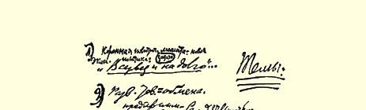
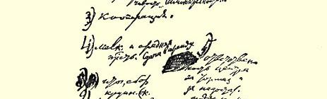
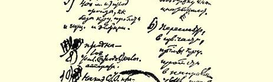
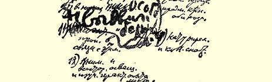

# 附录俄共（布）第十次代表大会材料

> （１９２１年３月上半月）

## １ 对关于以实物税代替余粮收集制的决定草案的修改意见１４０

> （３月３日）

瞿鲁巴同志：请您（召集委员会开会）讨论我的下列几点修改意见： 对第９条：末尾（从“在……监督下”开始）改成：“为了进行监督，应

按交纳不同的粮食税税额的纳税人分别成立当地农民

的民选组织。” 对第１０条：末尾（在“此外”之后）改成：“为使商品交换不致变成投

机倒把活动，其监督办法另行规定。” 对第１３条：暂**取消**。

（在代表大会上我们再决定何时公布。我认为，应在运

动开始前公布，就是说，在党代表大会后立即公布。）

### 列宁

３月３日

> 载于１９３２年《列宁文集》俄文版  译自《列宁全集》俄文第５版第２０卷  第４３卷第３６５页

## ２ 中央政治工作报告的两个提纲 [^1]

> （３月４日和７日之间）

### １ 政治报告 ### 不是谈经过，而是讲教训 （１）从战争向和平的***转变***（１９２０年和１９２１年初）。

１９２０—１９２１年

１９２０年４月：第九次代表大会（经济建设）

４月—９月：半年的对波战争。

—１１月：弗兰格尔。

**总之**：**一年中大部分时间是战争**。 （Ａ）过去不可能集中精力研究经教训：现在要多集中精力去

济政策及其各项原则。研究经济政策的各项原则。 （２）稍有富余而使用不当。 （αα）军事力量—— 华沙 （ββ）余粮收集制２３５００—８０００＝１５５００万普特

１５５００∶６

＝２５８３１

３万普特 （γγ）

燃料

工厂开工问题考教训：存在着经济好转的因素，但使

虑太不周到用和分配不当（不是只指支配，而是

歉收—— 饲料和指各种经济因素的比例）。

畜危机。 （３）

歉收加深了危机歉收：尽量改善农

从战争向和平转变的危机民的处境及巩固小

对新的经济比例关系考虑不当的危机农经济的经济基

基础的危机：小农经济的削弱。础。 （４）问题的辩论发展而成（或者说**取代了** 关于工会问题的辩论由关于党的建设党的建设问题的辩论），**转移了党对主要问题的注意力**。 ｛｛９月—２月｝｝

关于工会问题的辩

论转移注意力。 （５）同英国的通商条约

同意大利建立经济关系的可能性

租让和美国。 ６（α） 喀琅施塔得事件（１９２１年２—３月）。政治方面及经济祸害

在政治上的表现 ６（ｂ） 事件的政治方面及经济混乱和不适应在政治上的表现。 孟什维克，社会革命党人，无政府主义者。总之是政权的更替 （在喀琅施塔得是**新政权**）。 这个政权是毫无希望的。 这个政权意味着：在“自由”的口号下转向资产阶级复辟。 在政治上战胜敌人，并且已经接近取胜，但**在经济上却掉以轻心**。

粮食税***代替***余粮收集制（（不是粮食税***加***余粮收集制））：适应小业主的经济条件，地方流转自由，“**同农民妥协**”。

这一“妥协”的两个方面（按喀琅施塔得方式？）：改变政权？还是改变（？），即确定经济政策的原则。

### 地方经济流转的自由

无产阶级国家政权

为得到技术援

助而交纳**贡赋**

森林，石油，矿    ２３的租让法令

石等     采购（１５００**·万**金卢布的）煤

αα（１）＋建立在合同关系（例如１６

４比４）上

？

的国家资本主义（租让），１９２０年１１月两种经济反对官僚主义两种政治的上层建筑

争取工人民主

### ２ 中央政治报告

最重大的政治事件和以往的“关键问题”，并考虑它们对将来的教训＝主题。 下列主要问题（７）实物税及其意义。

（１）从战争向和平转变。

（２）我们策略上的差错和“不适应”的错误。

（３）歉收和对农民的态度。

（４）关于工会问题的辩论。

（５）对资本主义世界的态度（通商条约和租让）。

（６）“喀琅施塔得”事件：这个事件在政治上和

经济上的意义。

（８）上面有国家资本主义（租让），下面同小农妥

协，以此作为根据经验制定的经济政策的

基础。

（９）反对官僚主义和发扬“工人民主”是政治（内

部）任务，也是“建设”任务。 １从战争向和平转变（远远不是立即能实现的）。

第九次代表大会和对波战争（“和平”）

—— 弗兰格尔……

**复*员***带来社会方面和其他方面的***困难***。｛注意｝

### *２*策略和政策上的差错，“不适应”

αα 打到华沙城下

ββ 粮食的分配  ２３５００—１５５００万普特

γγ 燃料的分配。     （６）

稍有富余，而不善于量入为出。

没有考虑到各种因素的比例。 ３歉收：同农民的关系极度紧张。 ４关于工会问题的辩论**   教训**： 错误。一个有５０万党员的党内“官僚主义的”上层 小资产阶大党不可避免地要反级的＋无政府主义的自发势力（“工映出它周围的自发势人”反对派和农民反对派的“**倾向**”）力的意愿和情绪。 **（转移党对主要问题的注意力）**。 ５对外关系

同英国的通商条约 ２月租让，１９２０年１１月２３日的法 １日关于巴库煤（（１９２１年２月１日））１８４０ 问题。万普特

令。采购（１５００万金卢布的） ６喀琅施塔得事件

***政***

> ***治***：政权稍向右转＝灭亡   振奋起来

纪律

**·**

**经*济***：农民的小资产阶级自发对小资产阶段“让步”？

势力对农民“让步”？ ７实物税

它的立法经过

１９１８年１０月３０

日和延期执行

它现在的提法 ８上面有国家资本主义（租让） （下面）同小农妥协 （“贸易自由”） 两种经济基础。 ９反对官僚主义和争取“工人民主”。吸取教训并提出新的任务： ***一面侦察***，***一面前进***。**速度慢些**，**经济基础要坚实些**！这就是“口令”。

> 载于１９３２年《列宁文集》俄文版  译自《列宁全集》俄文第５版第２０卷  第４３卷第３６６—３７０页

## ３ 关于以实物税代替余粮收集制的讲话的提纲 [^2]

> （３月上半月） １这个问题的一般政治意义：＝关于在报刊上缓和“无产阶 ***农民的***（小资产阶级的）***反革命性的***级和农民的相互关系” 问题。 **这种反革命性已在反对我们**。 ２顺便从理论上说明

（α）资产阶级革命还是社会主

> 义革命？***决定于斗争***

在报刊上缓和

（β）叛徒考茨基（１９１８年版第

１０２页）。[^3] ３谁战胜谁？两个不同的阶级。

“喀琅施塔得事件”的教训

政治上：加强党内的团结（和纪律），加强同孟什维克和社

会革命党人的斗争。

经济上：尽量满足中农的要求。 ４全体农民（几乎）已经成为中农。“贫农委员会。” ５怎样才能***从经济上***满足中农的要求？满足小商品生产者的要求？ 注意（α）**流转**自由，贸易自由（＝资本主义自由）

> （β）为此弄到**商品**。 ６“流转自由”＝贸易自由＝资本主义自由。

倒退到资本主义吗？ 我们实行过急的、直线式的、条件不成熟的“共产主义”是由于 **战争**，是由于无法弄到商品和无法使工厂开工。 还有一系列可行的过渡办法。可以把“绳子”**更**放松些，***不要绷断它***，“放得”“松开些”。 注意： ７合作社。**撤销**第九次代表**·** 大会的决议。新的决议草案（更自由地随机应变）。

### 合作社＝

（社会革命党人和孟什维克）

政治上、经济上最好的自由

流转形式。 ８从什么地方弄到商品？ （α）借款。（１亿金卢布）（两项建议）。 （β）同英国和美国的通商条约。 （γ）租让。 ９国家资本主义，同它实行联合，**在上面**，**—— 在下面**给农民等流转自由。

拐杖和绷带？

被打得半死。 １０工人也精疲力竭，疲惫不堪。

象布列斯特和约时期的“喘息时机”，经济上的喘息时机。

改善工人的生活状况 （１０００万金卢布１４２**和特别决议**１４３）。

改善农民的生活状况和促进**流转**。 １１个体商品交换？

是的！要加紧生产，促进流转，提供喘息时机，加强**小资产阶**

**级**，但是也要更加努力地巩固***大生产***和**无产阶级**。

两者是有联系的。 １２不***在一定程度上***使小资产阶级和它的流转活跃起来，就不能

巩固大生产、工厂和无产阶级。 １３**实物税**。

立法经过（简要的）１９１８年１０月３０日。

现在的另一种提法。

它的经济意义。

> （１）给小生产者以**刺激**：推动生产。最重要。

（２）现在不必实行国家垄断制（不是全部余粮）。

（３）对国家的明确义务。

> **减少**官僚主义。 （４）全部“流转”更自由并且**可以**不要“征粮队”。 在算出收成后  注意歉 收和收成。

波波夫和他的

“资料”。

预先颁布吗？

修改。 １４保持“机构”的**坚定性**。

但是机构要**服从**政治（＝审查和调整阶级之间的关系），而不

是政治服从机构！！（好的）官僚机构为政治服务，而不是政治

为（好的）官僚机构服务。 现在需要最大限度的灵活性，**为了这一点**，为了灵活地随机应变，就需要机构的最大的坚定性。

> 载于１９３１年３月２１日《真理报》  译自《列宁全集》俄文第５版第７９号  第４３卷第３７１—３７３页

## ４ 几项决议的提纲

> （３月１３日）

### （１） 关于工团主义和无政府主义倾向的决议 [^4] （２）“生产者代表大会”。 （３）理论上的错误。 （４）阐明俄共纲领。 ＋第三（共（５）除理论上的错误外，还有重大的政治错误和产）国际第  政治上的危险性…… 二次代表大（６）小资产阶级自发势力：小资产阶级的动摇（情会关于党的  绪）与无政府主义…… 作用的决议（７）特别是在（因军队复员而加剧的）极端贫困的

（１）在一部分派别，特别是工人反对派中的明显

的工团主义和无政府主义倾向。

状况下，无产阶级中的非党群众容易受小资

产阶级自发势力的影响而动摇。

### （２） 关于党的统一的决议[^5] （１）派别活动的征兆（特别表现在工人反对派方面，局部地表现在民主集中派和其他派别方面）。 （２）派别活动的表现是什么？为什么说派别活动是危险的？ （３）克服派别活动的措施： 允许出版《争论专页》 批评自由。 （４）把对政治措施等方面的批评同实际的建议区别开来。这些建议的方向。 （５）原因之一是某种程度上的脱离群众（与群众联系不够密切）：对此要特别注意。 （６）“工人反对派”摆脱党的倾向特别危险，在关于工团主义和

无政府主义的决议中，应比较详细地加以阐述。 （７）另一方面：“工人反对派”的功劳—— 注意改善工人的生活

状况

注意清党

注意同官僚主义作斗争

注意发扬民主和自主精神。

要坚决连根铲除派别活动，违者开除出党（应有２

３中央委员 ＋候补中央委员＋监察委员会通过）。

### （３） 关于改善工人生活状况的决议 [^6] 不满情绪和政治危机的加剧，很多是由于精疲力竭和贫困不堪造

成的。 对此要特别注意：立即予以救济。 同意拨出１０００万金卢布的决定，并且坚决要求放宽这项措施。 成立一个直属中央的并在劳动国防委员会和人民委员会领导下具

有特殊权力的专门委员会。 在所有主管部门（特别是与林业有关的各部门、国家建筑工程委员

会等）均设立该委员会的分委员会。 特别要吸收各个纯粹无产阶级的省份的工人参加。

> 载于１９３２年《列宁文集》俄文版  译自《列宁全集》俄文第５版第２０卷  第４３卷第３７４—３７５页

### ５ 关于中央委员会的组成的意见１４４

> （３月１３日） 注意 ＋中央委员会名额分配表

２５——９    ２

３

１５——２（３） 合计＝４７ １１（１２）

７——０

> 载于１９３２年《列宁文集》俄文版  译自《列宁全集》俄文第５版第２０卷  第４３卷第３７６页

### ６ 关于以实物税代替余粮收集制的报告的总结发言的提纲[^7]

> （３月１５日） **枪决粮食工作者**？ **合作社**。 （１）一大堆小问题 （２）既不能全部罗列，也不能分类。 **或者**：分为两类 （３）基本问题：

（一）技术方面**有困难**，大量的细节问题 （４）（二）小资产阶级、资产阶级和***资本主义***会得到增强 （５）***谁多***？谁快？

［我们在上层，我们＝无产阶级？他们在下层］ （６）更多的产品＝基础。

小工业１００比１５０１００比１７５

大工业２００比１７５２００比２００１４５

> 载于１９３２年《列宁文集》俄文版  译自《列宁全集》俄文第５版第２０卷  第４３卷第３７７页 [^8] 总结发言见本卷第６６—７５页。—— 编者注

## 《论粮食税》的几个提纲

> １４６
>
> （１９２１年３—４月）

### １ 大致如下： １粮食税的一般意义。 后退？前进？（转向商品交换。） 是“布列斯特和约”吗？ **从余粮收集制（*征收余粮*）转到商品交换**。 “战时”共产主义**与正常的**经济关系。 ２粮食税和自由贸易。 粮食税和自由贸易。 贸易自由**与**小经济的经济基础（“地方流转”）。 贸易自由**与**无产阶级的国家政权。 贸易自由**与**租让制。 贸易自由的范围和条件。 ３中农。（平均化。） 平均化。 指靠富农吗？ 或者是**中农**。 勤劳的农民。 提高产量。 ４向社会主义农业过渡的途径。 集体农主小农 **电气化**。 ５合作制。 ６同官僚主义作斗争 （这场斗争的经济基础）。 ７**［国际形势和国内关系**。 ８党内危机和政治危机（１９２０—１９２１年）。 孟什维克＋社会革命党人＋无政府主义者 （喀琅施塔得事件）。 ９［同农民“**妥协**”？还是专政？ １０［非党代表会议。

### ２ 该书的提纲：

**论以粮食税代替余粮收**

**集制**，**论同农民妥协**（或者论困集制与总任务和当前政治形难势有关。 ！

内容要表达得更确切：

说明粮食税代替余粮收

以粮食税代替余粮收集

制与当前政治形势的特殊情

况有关。

农民国家中的工人政府的任

务）和论工人阶级在同农民

关系方面的任务。

以粮食税代替余粮收集制，这一代替的根本意义就是从“战时”共产主义转向**正常**的社会主义基础。

不是余粮收集制，也不是粮食税，而是用大工业（“社会化”工业）的产品来交换农民的产品，这就是社会主义的经济**实质**，社会主义的基础。

余粮收集制不是“理想”，而是一种痛苦的和可悲的必要。相反的看法是危险的错误。

余粮收集制和“机构”。如果没有“机构”，那我们早就灭亡了。 如果不进行有步骤的和顽强的斗争来改善机构，那我们一定会在社会主义的基础还没有建成以前灭亡。

工农联盟＝苏维埃政权的α和ω[^9]。巩固苏维埃政权的“必要的和充分的”条件。

这个反对邓尼金之流的联盟**不是**（这个）**经济**建设中的联盟。

前者＝资产阶级革命

后者＝社会主义革命。

从战争转到建设。

第九次代表大会。１９２０年（参看１９１８年４月）与第十次代表大会（１９２１年３月）。

从余粮收集制转到正常的商品交换。

粮食税在原则上是容许自由买卖粮食和其他产品的。

形式上的民主与粮食税问题及诸如此类问题上阶级关系的实际情况。

强制＋说服（在征收余粮中）—— 在征粮食税中—— 在“商品交换”中。

“贸易自由”的范围如何？**在**交纳粮食税**以后**。

放手试验和实践。小商    地主工作人员的任务。地业……方政权的任务。

***在***一些大国的无产阶级革命还没有到来***以前***，经济关系或经济体制的类型＝上面实行集中

下面实行农民的贸易自由…… 是一种独特的**国家**资本主义（参看１９１８年４月）。

“指靠”中农？富农？恢复资产阶级关系？

农村中的平均化

“贫苦农民”

得到了平分的土地

得到了地主的土地

得到富农的财产

得到了国家的特殊帮助。

现在增加产品成为（已经成了）**关键和试金石**（参看俄共党纲１４７）。因此，在农业方面要“指靠”中农。

勤劳的农民是我国经济振兴的“中心人物”。

个体商品交换。

集体农庄的作用：做了许多蠢事。把不执行法律的人**和无能的人**提交法庭审判（３年）。

农民的“个人主义”对社会主义是否可怕？他们的“自由贸易” 是否可怕？不可怕。

电气化：尺度。这是远景计划，但是**计划**也（因此）就是准则。 （任何计划都是尺度、准则、灯塔、路标等等。）

***如果***经过１０—２０年的电气化，小农的个人主义和***他们***在地方流转中的自由贸易就一点也不可怕了。***如果***没有电气化，回到资本主义去**反正**是不可避免的。

国际形势是有利的：新的均势。 他们分崩离析我们团结一致７）      （７）

协约国与德国。

协约国与德国。

美国与日本（和英国）。

美国与欧洲。

帝国主义世界与“亚洲”

（１４

（２５０００００００×７  （１７５０００００００中占

＝１７５０００００００）  １０００００００００）１４８

只要在１０—２０年内和农民保持正常的关系，就能保证全世界范围内的胜利（甚至在日益发展的各国无产阶级革命推迟爆发的情况下），否则就会遭到２０—４０年白卫恐怖的苦难。

两者必居其一。第三条道路是没有的。

注意：

同农民“妥协”**合*作制***。它的经济“妥协”这一概念的吗？立宪议（公方面和政治（孟什双重意义开的和隐蔽的），投维克和社会革命党特别对“专政”。 票，修改宪法，社会人）方面。 革命党人和孟什维克＋无政府主义者。

### ·

喀琅施塔得事件的经验教同孟什维克、社会革命党人和训（苏维埃政权政治史上的新无政府主义者作不调和的斗事件）争。

什么是“政治”？

（１）无产阶级先锋队对***本阶级***群众

（２）无产阶级对***农民***。

（３）无产阶级（和农民）对***资产阶级***。

注意：

疲惫不堪，精疲**既**在工人阶级“上层力量”消耗殆力竭，悲观失望……中**又**在农民的。尽，从“下层”提拔没有力量…… “喘 新的人才＝（α）青息时机”……***官僚*** 年；（β）非常人员。 ***主义***（农民的反映）。

注意 注意： 无政府主义以及“马克思主义”同它的斗争。 “悲观失望”？

不是这种速度（战时的与和平建设的）。

不论在１９１８年４月或在１９２０年４月，我们都是把从战争向和平建设的转变设想成在同一个**政策**轨道上的简单转变。

转变是复杂的：与农民的另一种关系，速度不同，情况不同。

军队的复员。

盗匪活动。（经济破坏。七年的战争。）

不是白卫恐怖，就是无产阶级的领导（愈来愈温和），即无产阶级**专政**。

“专政”一词***可怕***吗？

### 注意：

非党农民是尺度，是标志， 是参谋—— 也是政治口号（＝ 社会革命党人和孟什维克）。投票？推翻政权？还是寻求**同他们**的妥协？

### 非党代表会议不是绝对物。孟

什维克和社会革命党人＋无政

府主义者的政治工具。执政官

们要注意了！１４９

一般资产阶级政党和资产阶级议会活动所用的一般方法：给让步者“**设下陷阱**”。但是我们不承认资产阶级注意议会活动和“一般的（资产阶级的）政党”的**基础本身**！！

***注意***：      注意： 注意

“国家消亡的经济基础”（《国家与革命》）[^10]：**这**关于同官 **里**也是官僚主义的**消亡**以及上层和下层的消亡、不僚主义作平等的消亡的“经济***基础***”（与“从资本主义到共产主斗争。 义的最初步骤”比较）。***社会主义的经济*基础*还没有***。 它在哪里？**在同农民进行商品交换中**！**！**

注意

注意

＋**注**。１９２１年春季（２—３月）的政治危机（“各种转变”）和党内危机（１９２０年１１月或９月—１９２１年３月）的意义。是党的上层去适应它的群众，还是相反？是党去适应群众（无产阶级＋其次是农民），还是相反。

### ３

国家资本主义并不可怕，而**是符合**向国家资本主义 **我们愿望的**。学习。

举例：

（１）租让。

（２）合作社。

（３）代销人。

（４）租借。

**没有组织起来的资**

> **本主义**。 一切都要**有限度**和有**一定**    “自发势力” **的**条件。   就是这个词

什么样的限度？     １７９４年１９２１年相比。

经验会表明。

大概１

４。

“流转”主要的和首要的。    同投机倒把活动作斗争。这是

什么？

粮食税和流转。     经粮食工作指的指令：

１００＋１００＝２００％

？１００＋２５

６０＋６０

这两种（３和４）类型很薄弱，因为我们**又弱又蠢**。

比较官僚主义……

贸易自由（α）为了发展农民经济的生产力（β）为了发展小工业 （ ）为了同官僚主义作斗争。

限度？条件？

实践一定会表明。

粮食工作者：收集１００％

１００＋１００＝２００

大概：

１００＋２５＝１２５

６０＋６０＝１２０

***同投机倒把活动作斗争***？

这是什么？ 政治方面：

小资产阶级自发势力将推翻（１９１８年５月５日）[^11]。

“范例”法国革命

１１月１０日

参看１９１８年

反对考茨基[^12]

悲观还是乐观？

**估计力量**。冷静和炽烈的热情。

### ４ 结束语大致如下：

向政治转化。

１９２１年春天的经济转化为政治：“喀琅施塔得事件”。

社会革命党人＋孟什维克（唐恩、罗日柯夫之流和马尔托夫之流）扮演的角色。“不大的变动”，不管是向右变，还是向左变都一样。

米留可夫比切尔诺夫和马尔托夫聪明：要比这些妄自尊大的傻瓜、空谈的英雄和小资产阶级学说的骑士聪明，这是并不困难的 （１７８９年—１８４８年—１９２０年）。

他们的安身之地应该是监狱，而决不是***非党***代表会议。

１７９４年与１９２１年

“自发势力”的动摇。

（首发势力是什么）

和坚定性。

挑选和提拔人才。

悲观还是乐观？极冷静地估计祸害和困难。斗争中的奋不顾身的精神。总之＝

总结：

（１）“流转”。这是什么？

（２）小工业。原料何在？

（３）交换。

（４）资本主义。

（５）国家资本主义。

（６）地方上的首创精神。

（７）孟什维克和社会革命党人＋非党人员。

> 载于１９２５年《列宁文集》俄文版  译自《列宁全集》俄文第５版第４卷  第４３卷第３７９—３８７页

# 人民委员会关于取消对出版物的货币结算的决定和对这一决定的意见１５０

> （１９２１年３—５月）

### １ 人民委员会的决定

> （３月２３日）

１从１９２１年１月１日起，一概取消对出版物（书籍、报纸、杂志、小册子、画像等）的货币结算，在俄罗斯联邦境内通过“中央出版物发行处”向各机关和组织免费供应出版物。

２本法令颁布前为购买出版物已付的款项不再退还，１９２１年 １月１日前购买出版物的欠款一律蠲免。

３拟免费供应的出版物由各苏维埃出版社向“中央出版物发行处”免费提供。

４本法令的实施细则和汇报办法细则由教育人民委员部会同财政人民委员部、工农检查人民委员部在两周内颁布。

人民委员会主席

### 弗·乌里扬诺夫（列宁）[^13]

１９２１年３月２３日于莫斯科

克里姆林宫

### ２ 对决定的意见

> （３月２４日和５月５日之间）

**不能这样**。

应补充：***只***给***图书馆***。

“图书馆”的概念。

监督。

例外情况，等等。

**仔细研究**

### 列宁

> 译自《列宁文集》俄文版第４０卷
>
> 第７５—７６页

# 劳动国防委员会关于地方经济会议、关于报告制度和关于贯彻执行劳动国防委员会指令的决定草案的提纲 [^14]

> （１９２１年５月１９日—２０日）
>
> **劳动国防委员会*决定***本身应包括的事项不多： （１）必须在各地自上而下和自下而上地建立**经济委员会**或者与之完全类似的委员会和机构。

（２）必须**印发**每个区域、省、县、区的工作报告，每两月至少一次。

（３）必须把一些比较零星的工作报告和汇报的副本送交**劳动国防委员会**。

（４）贯彻执行**指令**。

（５）《***经济生活报***》多登来自各地的通讯，并使该报成为综合报告、研究和指导工作的机关报。

> 载于１９３２年《列宁文集》俄文版  译自《列宁全集》俄文第５版第２０卷  第４３卷第３９４页

# 劳动国防委员会给各地方苏维埃机关的指令草案的三个提纲１５１

> （１９２１年５月１９—２１日）

### １ （９）１农业的发展：

（α）农民经济

（β）集体经济（国营农场；公社等） （１０）２工业的发展：

（α）大工业

（β）小工业 （４）５经济工作各方面（以及各部门）的***协调***。

（１）６**·商*品交换***：（α）粮食人民委员部＋（γ）私营

（β）合作社   商业煤和页岩石油 （１１）３燃料柴火

林木

及其他

进口和

自给 （１２）４粮食。 （５）８改善工人的生活状况。 （６）９改善农民的生活状况。 （１３）７建筑业。 （１６）１０实物奖励。 （３）１１鼓励首创精神。 （２）１２资本主义、企业主的活动情况等。

私人经济的主动精神。 （２３）１３区域和省的经济计划（γγ）。 （２４）１４电气化（γγ）。 （２５）１５对于边疆地区：对外商品交换。港口。 （１９）１６私贩粮食情况。 （２６）１７铁路运输。

１８水路运输（γγ）。

１９区域和省的国家计划委员会[^15]**见第１３条**。 （２２）２０区域经济委员会，省、县、乡经济会议和农委。（γγ） （１７）２１工会，工会参加生产，生产宣传。劳动纪律。 （１８）２２（职工）盗窃公共财物，进行斗争的措施、效果。仓库管

理。 （２０）２３组织部队参加经济工作。军事部门，特别是普遍军训部的

人员参加经济工作。 （２１）２４劳动义务制，劳动动员。 （１４）２５模范的企业、作坊等。 （７）２６经济建设工作人员（既包括党员，也包括非党员）的名单及

工龄等等。 （８）２７同官僚主义和拖拉作风作斗争；特别要吸收工农检查院和

非党工人和农民参加。 （１５）２８改进农业和工业等生产。 （２７）２９《**经济生活报**》的工作和同该报配合如何？

地方报刊及其对待

工作报告的态度。

＋

应当由谁写工作报告？

省经济委员会，***县***经济委员会＋ 注意  城市的**区（*区经济委员会***）

县一次

市和城镇一次

区一次

限于（报告５０次，和＞？）

（报告１００次，和＞？）

城市

全俄国约为１０００

或一年

６次？

月１日前（６月１日？）

１１月１日（１０月１５日？）

１月１日

３月１日

５月１日

### ２ 次序大致如下：αα

**要点**

６：商品交换——（１）

１１：鼓励首创精神——（３）

１２：资本主义——（２）

５：协调——（４）

８：改善工人生活状况——（５）

９：改善农民的生活状况——（６）

２７：同官僚主义和拖拉作风作斗争——（８）

２６：经济建设工作人员——（７）

第

一

类

问

题

十ββ **大致如下**：

１—— 农业 （９）

２—— 工业 （１０）

４经济建设 ——  粮食 （１２）

３的总结  ——  燃料 （１１）

７  ——  建筑业 （１３）

１０——  （１６）

２１——  （１７）

２２劳动 （１８）

的

２３条件 （２０）

２４——  （２１）

２５经济建设的 （１４）

２８总结（１５）

１３——  国家计划委贫会 （２３）

２０——  区域经济机构 （２２）

１４——  **电气化** （２４）

１５——  对外贸易  （２５）

１６——  私贩粮食情况 （１９）

１７——  铁路运输

１８

２９     （２７）

γγ

——  水路运输  （２６）

### ３ 劳动国防委员会指令草案

新经济政策的实质：

最大限度地提高生产力和改善工人

和农民的生活状况，利用私人资本

主义并把它纳入国家资本主义的轨 **合作社**

道，全面支持地方的首创精神，同官

僚主义和拖拉作风作斗争。 １００％的粮食税＋１００％靠交换

对外商品交换；

小工业；

支持大工业。 ＋ **·补** 劳动国防委员会的各级机构一直设到下面。

建立报告制度和交换经验，竞赛。

工作报告的期限（每年２—６次）和格式（印１００份）

每个工作报告都必须详细提出的最主要的

问题。 １—８（αα）。 （８个问题）

每个工作报告都必须以简短**总结**形式提出

的非常重要的问题。

这些问题就其

重要性来说都

是相等的，但

就顺序，就紧

迫性来说则不

相等。

ββ       １２个问题

第三类问题：

重要的问题，但**不必**在***每个***工作报告中都提出。 γγ      ７个问题

补充问题（可酌情提出）。

（第四类问题） 结论。

关于工作报告问题必须补充： （１）第五类问题可由各地自行选定。 （２）工作报告中的统计部分由省统计局和县统计人员编写。 （３）地方机关应向统计人员提供（有责任提供—— 明确指出这种责任）全部材料。 （４）工作报告中的**非统计**部分呢？

由谁来编写？

也由统计人员编写

＋专门指定的人员 （５）除了这些工作报告外，不得再要求其他任何报告。 （６）工作报告中什么问题应印发？

> 载于１９３２年《列宁文集》俄文版  译自《列宁全集》俄文第５版第２０卷  第４３卷第３９５—４００页

# 俄共（布）第十次全国代表会议材料

> （１９２１年５月下旬）

## １ 关于粮食税的报告的两个提纲

> １５２
>
> （不晚于５月２６日）

### （１） 对粮食税和贸易自由等的种种流言蜚语（以及恶意歪曲）和误解。 参看１９１８年５月５日（《论“左派”幼稚性和小资产阶级性》[^16]）

（α）“小私有者自发势力”的危险性。

（β）国家资本主义与小资产阶级的无政府主义自发势力。 粮食税和贸易自由

是“让步”还是“缓和”？ 流转自由和资产阶级性。

***国家***资本主义。 租让**也是**国家资本主义

国家资本主义。 由于歉收，经济破坏……而“缓和”、让步、妥协、退却。 忍受的限度？

工人忍受的限度？

农民忍受的限度？ 是“热月政变”吗？头脑清醒地看待，***或许***是的？会发生吗？

会见分晓的。上战场别吹牛！

（参看１９１８年５月５日（引证小册子）

（参看１９１８年１１月１０日（反对考茨基[^17]）。 当时和现在

觉悟和不觉悟。

专政和自由，当时和现在。

当时和现在的各阶级。

农民的理性与偏见。 两者必居其一。选择。是同工人政府达成困难的妥协还是轻易地

受资产阶级和地主的奴役？

> 载于１９３２年《列宁文集》俄文版  译自《列宁全集》俄文第５版第２０卷  第４３卷第４０３—４０４页

### （２）

农民国家 １（反对邓尼金） ２**·经*济联盟***？ ３余粮收集制： 怎么可能？ ４粮食税…… ５交换、首创精神，等等。 ６小工业 ７大工业＝社会主义的基础 ８电气化 ９国家储备

粮食储备

燃料储备 １０４亿普特 １１从三年级到四年级的升级考试。 １２

１８８９—１９０３年

１９０３—１９１７年

１９１７—１９２１年

１９２１—？３１？ １３研究实际经验。

> 载于１９５９年《列宁文集》俄文版  译自《列宁全集》俄文第５版第３６卷  第４３卷第４０４页

### ２ 关于粮食税的报告的总结发言的提纲 [^18]

> （５月２７日） **动摇**： （１）“农民是一个阶级”

（瓦雷基斯）。 （２）“粮食检查局”

斯维杰尔斯基的……

（瓦西里耶夫）……

（还有美舍利亚科夫）。 （３）拉林及其法令与**１９２１年５月１０日政治局**的决议。 （４）“反过来指责中央委员会：

（α）换取煤和其他产品。***顿巴期的电报***。

（β）坦波夫省的合作商店和合作社机构。

（？）

（γ）基兹利亚尔—旧捷列克铁路建设工程的经验。

***拉林***的例子……“我们的制度”……

（（每月２８俄磅同４普特相对比））。

……“出色的经验”……

丘巴尔：“这样的例子不止一个。

在所有的采木场中”

（δ）１０俄磅盐＝１普特粮食（沃伦）……

（）**尼古拉耶夫省**？**（粮贩）**…… 纺织品

铁器—化妆品

## ３ 关于新经济政策问题的决议草案的提纲 [^19]

> （５月２７日）

### 题目： （１）当前的基本政治任务：新经济政策：

### “认真地和长期地”…… （２）扩大商品交换。

进取精神……自主程度…… （３）合作社。 （４）中、小工业。出租。 （５）中央机关要对阻碍地方的首创精神或支持不力的现象负责。 （６）部分修改大工业的生产计划，以加强农民日用品的生产。 （７）实物奖励和集体供应。 （８）粮食税

加强（粮食税）征收机构。 （９）总之，要筹集大量的（近４亿普特）粮食储备，作为大工业和实现电气化的基础。 （１０）要把劳动国防委员会的指令变成全俄中央执行委员会的指令

> １９２１年５月列宁关于新经济政策问题的决议草案的提纲的手稿

＋特别是要提拔非党人员。 （１１）有关这方面的宣传鼓动工作。 （１２）仔细地、全面地阐明和研究各地的实际经验。

> 载于１９５７年《苏共历史问题》  译自《列宁全集》俄文第５版杂志第１期  第４３卷第４０９页

# 俄共（布）第十次代表大会代表登记表 １．姓：乌里扬诺夫（列宁） ２．名和父称：弗拉基米尔·伊里奇

> ３．所属党组织： （省、市、县、集团军、师）

俄共中央，莫斯科市

> ４．代表证编号 有表决权
>
> 有发言权

第２１号，以发言权１５３

> ５．何时、如何当选为代表（省、县、 集团军、师党代表会议，党员大会等选出）：

中央委员会选举为有发言权

的代表

> ６．推选您出席代表大会的省、县、 集团军、师党代表会议所代表的党员数字：

中央委员会，１９人 ７．曾参加过哪几次全国党代表除１９１６年７月（或８月？）外， 会：参加过其他各次代表大会 ８．出身年份及年龄：１８７０年 ９．健康状况，有无残疾：健康

> １０．家庭情况（由您赡养的家庭成
>
> 员人数）：

妻子和妹妹同我一起生活 １１．民族：俄罗斯 １２．母语：俄语 １３．懂何种外语：熟练程度如何：英语、德语、法语程度差；意大

利语程度很差 １４．熟悉俄国哪些地区，在那里住对伏尔加河流域较熟悉，在那

过多少年：里出生，居住到１７岁 １５．是否到过国外（何时，何地，多１８９５年；１９００－１９０５年；

久）：１９０８－１９１７年，在西欧一些国家 １６．是否受过军事训练？否

> １７．文化程度（曾在哪此学校学习，
>
> 是否毕业，如未毕业，读完了几
>
> 年级）：

１８９１年（作为校外生考试及格）

毕业于彼得格勒大学法律系 １８．１９１７年以前的主要职业：写作 １９．有何专长：无 ２０．１９１７年**后**，除党、苏维埃、工会

> 等及类似工作外，还从事何种
>
> 工作：

除所列各项外，只从事写作 ２１．目前属于何种工会组织：新闻工作者协会

> ２２．从１９１７年起曾担任过何种工作—— 苏维埃工作、军事工作、工会工
>
> 作、经济工作（党的工作除外）： 何时（注明起迄年月）何地（省、县、
>
> 市、集团军、师）
>
> 在何机关担任何种职务 １９１７年１０月起莫斯科人民委员会主席至１９２１年３月 和劳动国防

委员会

> ２３．填表时担任何种工作：苏维埃工作、军事工作、经济工作、工会工作 （党的工作除外）： 何时（从何时起，注何地（省、县、 明年月）市、集团军、师）
>
> 在何机关担任何种职务从１９１７年１０月起 莫斯科人民委员会主席

和劳动国防

委员会 ２４．从何时起为俄共（布）党员： １８９４年起

> ２５．是否参加过其他党派？如参加过，
>
> 是何党派，何时参加，参加多久？

未参加过

> ２６．１９１７年以前是否参加过革命运动： 何时（起迄时间）何地（省、县、市）在何组织担任何种工作 １８９２－１８９３萨马拉社会民主主 １８９４－１８９５彼得堡义者秘密小 １８９５－１８９７监狱组，从俄国社 １８９８－１９００西伯利亚（叶会民主工党 １９００－１９０５国外党员 １９０５－１９０７版得堡 １９０８－１９１７国外

尼塞斯克省）成立时起为

> ２７．是否因革命活动受过迫害 （何时，因何种案件） >

１８８７被捕；

１８９５－１８９７被捕；

１８９８－１９００在西伯利亚；

１９００被捕

> ２８．在狱中被监禁时间

服苦役时间未

流放时间３年

侨居国外时间９－１０年

几天＋１４个月

> ２９．１９１７年起担任何种党的工作： 何时（注时起迄年月）何地（省、县、市、
>
> 集团军、师等）
>
> 在何机关担任何种职务从１９１７年１０月莫斯科 中央委员会起至１９２１年３月

中央委员

> ３０．填表时担任何种党的工作： 何时（何时起）在 何 机 关担任何种职务
>
> 何地（市、省、
>
> 县、集团军、师） 从１９１７年１０月莫斯科中央委员至１９２１年３月

中央委员

> ３１．是否受过俄罗斯联邦司法机关或党

的法庭的审判（何时，何地，因何案否

> 件） １９２１年３月７日
>
> 代表签名

### 弗乌里扬诺夫（列宁）

> 载于１９３２年《列宁文集》俄文版  译自《列宁全集》俄文第５版第２０卷  第４３卷第４１３—４１８页

### 注释

[^1]: 中央政治工作报告见本卷４—２６页。—— 编者注三条“鲸鱼”１４１ββ（２）＋有地主流转自由的小经济同小经济签订合同γγ（３）＋最坚决地同官僚主义作斗争概括地说（４）工人民主

[^2]: 讲话见本卷第５０—６５页。—— 编者注

[^3]: 见《列宁全集》第２版第３５卷第２２９—３２７页。—— 编者注

[^4]: 见本卷第８４—８７页。—— 编者注

[^5]: 见本卷第７８—８３页。—— 编者注

[^6]: 见本卷第７６—７７页。—— 编者注

[^9]: α和ω是希腊字母的第一个字母和最末一个字母，意为“全部”、“一切”。——编者注

[^10]: 见《列宁全集》第２版第３１卷第１—１１６页。—— 编者注

[^11]: 见《列宁全集》第２版第３４卷第２６４—２９３页。—— 编者注

[^12]: 同上，第３５卷第２２９—３２７页。—— 编者注

[^13]: 在文件上签署的还有人民委员会办公厅主任尼·彼·哥尔布诺夫和秘书莉·亚·福季耶娃。—— 俄文版编者注

[^14]: 决定草案见本卷第２５７—２５８页。—— 编者注

[^15]: 这些字句被列宁删去了。—— 俄文版编者注

[^16]: 见《列宁全集》第２版第３４卷第２６４—２９３页。—— 编者注

[^17]: 见《列宁全集》第２版第３５卷第２２９—３２７页。—— 编者注

[^18]: 总结发言见本卷第３１１—３２６页。—— 编者注（４）发扬首创精神……（α）奥新斯基的几点结论：粮食人民委员部工作人员在干扰；工作不协调。（β）从三年级到四年级的升级考试。（γ）“卫生口粮”古谢夫载于１９３２年《列宁文集》俄文版  译自《列宁全集》俄文第５版第２０卷  第４３卷第４０５—４０６页

[^19]: 决议草案见本卷第３２７—３２９页。—— 编者注