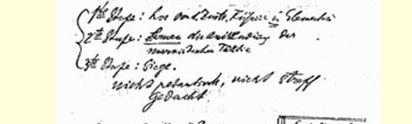
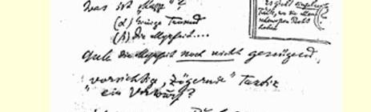
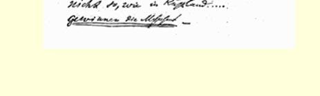

# 附录关于共产国际第三次代表大会的材料

> （１９２１年６—７月）

## １ 对共产国际《关于策略问题的提纲》 草案的初步意见

> （不晚于６月１０日）

１．争取工人的大多数

２．明确支持《公开信》

３．着重提出在工会中争取大多数（反对左派）

４．**农业工人**的斗争［不是如拉狄克说的同小农在一起，而是走

在他们前面］

５．对挑动的回答？

> 译自《列宁全集》俄文第５版
>
> 第４４卷第４３５页

## ２ 笔记和发言提纲 [^1]

> （６月２２日—７月１２日）

## （１） （１）事实？公布？

（２）“左吗”？**不**。“左派”

匈牙利侨民？

“巨大的功绩” （３）论据？ 鼓动的方法？ （４）克雷比赫？ （５）向左迈三步 ＋向右迈一步 （６）军国主义的 （７）粮食政策 （８）**季诺维也夫**的建议。

## （２） （１）合法的党 “反资本主义的党”？ “苏维埃制度之友协会”？

（α）只有立宪方法

（β）与共产党人的

区别何在？ （２）接收新党员须有五分之四的多数同意

被剥削者，群众和普通人 （３）“见习人员”

***罗兰*－·霍*尔斯特*** “俄国人立场***左***吗”（？）

具体表现 ？

## （３） （１）什麦拉尔的书。 （２）什麦拉尔对匈牙利革命的态度。 （３）１９２０年９月。什麦拉尔在代表大会上的讲话。

１９２０年１２月我们**有意识地**把运动停了下来。

我们（在布拉格）曾在地下室里工作。 １９２１年３月６日 反斗争 １９２１年５月１５日代表大会

５８名被开除的中派分子在代表大会后。

## （４） 德国共产主义工人党评我的专    我的讲话提纲题报告

党不能不受到经济基础的影响

无论是国内的慎的准备？

还是国外的

西欧资本主义力量增强（由于租让制）

靠代表大会（目前）的政策无法与之斗争。

我们的机会主义者会说：**由于**俄国的革命，再不会有任何罢工了。

你们的建议是什么？不要租

让？不要贸易？不要坚持作更谨

### ### 对同志们的回答：

（１）１７０亿金卢布

### 租让所得６０亿：１０＝６·亿

（２）国家利益起着过大的作

用？

### “……为革命作更扎实的准备，更谨慎的准备……”

国际政策过分依从俄国***国家***政策的利益……

国家资本主义的“纯概念”  ．此与彼

：你们的建议是什么？[^2]

搞贸易与

干革命

．“左吗”？

我们的立场

１９０７年

．怎样作更扎实和更谨慎的

准备？

德国人已经作了

意大利人正打算作

捷克斯洛向左迈三步

伐克人向右迈一步

## （５） 第一阶段：同中派领袖和中派分子决裂。 第二阶段：学习如何运用马克思主义的策略。 第三阶段：胜利。

不是迂腐的、不是刻板的想法什么是“群众”？有个别场合

（α）几千人孟什维克是

（β）大多数……正确的？ 就是有大多数**也还不**够。 “谨慎的、缓进的”策略—— 是责备吗？ 和俄国的情况不同…… ***争取大多数*——**

## （６） ### 关于拉查理的讲话改良主义者（屠拉梯之流）在艾米利亚雷焦举行的代表会议——１９２０年１０月在里窝那举行的代表大会１９２１年１月１５日

单位千 １３％９８票统一主义者１２０票（单位百万）

１４票改良主义者１８票（单位百万）

５８票共产主义者５８票（单位百万）[^3] １４ ５８ 在里窝那分裂，时机不合适 ７２

> １９２１年６月２２日—７月１２日列宁在共产国际
>
> 第三次代表大会上写的《笔记和发言提纲》手稿第５页
>
> （按手稿缩小） “我们的无产者将无法理解……”我们—— 俄国人—— 将永远

他（拉查理）对我们的是“灵活而聪明的人”（弗罗

策略提纲感到满意萨尔文章中的话）。

注意

## （７） 阶级斗争

（哈雷）     ３月１６日

１７日

１８日

１９日分区领导的号召

> 在**曼斯菲尔德**
>
> 和在**哈雷**

两处都对工人们**提出警告**：“同志们，不要受人挑动”，总之大意如此。

《红旗报》上是否重申，不详。

（据克南报告。）

## （８）

１点０５分

拉狄克：

托洛茨基

马尔托夫**（在引经据典**！**！）**

第二半国际的瓦解和第三国际

发言

次序

“对长期斗争的**理解**是英国

各不相同的”（？）意大利

第二半国际的决议捷克

在１点３０分以前是“开场白”。德国教训：消极的政策，即半中派的政策——***意大利***和***捷克斯洛伐克***

运动的领袖们。 “***相反的***例子，**相反的**错误：三月行动”。

德国统一共产党的历史

害怕叛乱

> 卡普叛乱＝**·无*所作为***

德国共产党。

论题？

不能只作鼓动，

应当行动，引导……

引证？书？

条件左派行动迟钝右派（官吏）“害怕积极行动” 意大利问题和**右派分裂出去** 左派只剩下自己，—— 他们的**基本错误**。

主要错误—— 从作“通常的”鼓动突然转为无准备的猛攻。

右派完全不对，

左派把自己的错误（进攻）变成了理论……

## （９） **注意**

### ### 罗维奥（彼得格勒）。搞些玩具

（７岁） **赖兴贝格**：……妨碍资本主义经济的复兴（！？）

……“气氛缓和了”

> **进攻**，而且是应当的……
>
> （我们的责任是在**１９２０年**８月２０日也发动***进攻***。） **公开信**是机会主义的（！！）（（库恩·贝拉））**注意**

大批工人**因此**而死亡！库恩·贝拉论**《公开信》** “推翻制度”！！！党作好革命**准备**

为了原则

大多数（特拉奇尼？）

### 在捷克斯洛伐克德国

“４０００００” 提纲

### 吸引群众？第７页

### 在俄国，是在党很小的情况下 ### 取得胜利的……

（（特拉奇尼））

（（进攻……））

### · 理论“活跃的趋向” （“从消极转向积极”……）

> 译自《列宁全集》俄文第５版
>
> 第４４卷第４３６—４５０页

## ３ 《关于意大利问题的讲话》提纲[^4]

> （６月２８日）

### 讲话提纲： （１）“拿出事实来，不要讲空话”……

以羡慕的心情ｉｎｖｉｄｉａ？

ｅｎｖｉｅ （２）

（ａ）自伯恩施坦主义开始以来的历史

（１８９９—１９００）

（ｂ）在艾米利亚雷焦举行的代表会议？

（１９２０年１０月）？

派别

政党 （３）党曾经是好的？

——— ［不比德国社会民主党好］ （４）仅仅是时机问题吗？  当时？ （５）“灵活而聪明的人”  弗罗萨尔

我们关于策略的几项决议（草案）是好的：反对“无政府主

义偏向” 拉查理： “准备时期……”

（６）在里窝那，无论与改良主义者相比还是

与共产党人相比，他们都是多数

### （７）羡慕——愿意“摹仿”，但不是盲目地 （８）认识意大利运动的特点，做灵活而聪明的人，这是共产党人一定能学会的。[^5]

> 载于１９５９年《列宁文集》俄文版译自《列宁全集》俄文第５版第３６卷第４４卷第４５２—４５３页

## ４ 一 篇拟写文章的提纲２３８

> （不晚于７月１１日）

一篇关于第三次代表大会的文章 （ａ）等待（是指一个国家吗？）。***不是指捷克吗***？ （β）准备**总攻**（更强大的） ？ 说列宁会***帮助***我们（什麦拉尔）

退却是**痛苦的**，然而只能退却！！

我是否消除了什麦拉尔同志的**忧虑**？

（１）**什麦拉尔**向右迈三步

> **克雷比赫**向左迈一步２３９

（２）“帮助”？

（３）“忧虑”

（４）左的错误

> 右的***背叛***。 载于１９５９年《列宁文集》俄文版译自《列宁全集》俄文第５版第３６卷第４４卷第４５４页

## ５ 《在德国、波兰、捷克斯洛伐克、匈牙利和意大利代表团联席会议上的讲话》提纲[^6]

> （不晚于７月１１日）

## （１） ### 讲话提纲 １．“中欧”的经济基础。 “欧洲的巴尔干化”。 ＋ 从军事上考虑协调几个中欧国家的革命

（大致是：德国＋捷克斯洛伐克＋意大利）

协调的困难和“赌注”的大小 ２．更扎实地进行准备＝**共产国际**第三次代表大会的**主旨**。

有共产党。但还不是今天。别干“左的蠢事”。更谨慎地进行准备。

### ### 德国１９２１年３月所犯的错误。 ３．今天愈“机会主义些”，明天愈有把握（**重新**或**还要**更多地）集合起群众。 ４．为什么是这样？

德国１９２１年３月

捷克斯洛伐克

意大利 ５．同俄国对比

１９１７年４月４日

１９１７年４月２１日中央关于１９１７年４月２１日事件的决议。 ６．不要怕说我们从莫斯科回来变成另外一种人了，变得谨慎些、 明智些、机会主义些、“右一些”了。 这＝唯一正确的战略。 ７．罗马的运动

（７月７日）

> 柏林市政工人罢工    **三件**
>
> 里尔纺织工人罢工。   **事实**[^7] ８．为要跃进，必得后退。 ９．可能是**明天**。可能过**两三**个月。 可能过两三**年**。 １０．“左的蠢事”和明天的**背叛**。 １１．不要急躁，不黑怕“延误时机”。这种怕是没有道理的和有害

的。

注意：***库恩*··贝*拉***的含蓄的意见。 “行动”可以在这一时刻或那一时刻“刹车”，**但**在**革命**宣传上

应当是**毫不妥协的**。 １２．帮助俄罗斯联邦？？

战争的要素是危险。

**我们有**军事上的  危险

政治上的

经济上的

怎样才能“帮助”我们？ １３．总结： （１）（α）大家同心同德：**就象从头开始一样**，重新去做 （２）（β）***更谨慎地对待群众*** （３）（γ）更扎实地进行准备 （４）（δ）协调几个中欧国家的行动

> 大致是**三个**：**德国＋捷克斯洛伐克＋意大利**

（）认清而且不怕承认左的错误，为的是明天不发生背叛，为

的是明天一定胜利！！

## （２）

讲话提纲：

（１）你们愈是“机会主义些”，就愈能迅速地**重新**（因而**更多地**）把群众集合在自己周围。

（２）为什么是这样？（***德国***１９２１年３月、***捷克斯洛伐克***、***意大利*）**。

（３）同俄国１９１７年４月４日和１９１７年４月２１日的情况对比。

中央关于１９１７年４月２１日事件的决议。

（４）不要怕说**我们大家**（在共产国际第三次代表大会后）从莫斯科回来变得谨慎些、聪明些、明智些、“右一些”了。**这在战略上是正确的**。

（５）现在愈右，明天就愈有把握：为要跃进，必得后退。可能是“明天”，但也可能过两三年。不要急躁。

（***补*５**）协调**几个**“中欧”国家的行动是必要的。

经济上的考虑和“中欧”的经济“基础”。

欧洲的巴尔干化。

***德国*＋·捷*克斯洛伐克*＋·意*大利***

大致上

（再补５）“左的蠢事”是小错误，**背叛**是大错误。

（６）帮助俄罗斯联邦？？

总结：（７）大家同心同德。***就象从头开始一样***去接近工人。谨慎些。这样猛攻就将更加有力。协调行动。准备得愈扎实，胜利就愈有把握。

> 载于１９５８年《苏共历史问题》杂志译自《列宁全集》俄文第５版第５期第４４卷第４５５—４５７页

## ６ 在德国、波兰、捷克斯洛伐克、匈牙利和意大利代表团联席会议上作的笔记

> （７月１１日） （１）战略退却—— 现在（在国际范围内）

就象１９１７年４月在俄国那样。 （２）承认？

我们的１９１７年４月

有些可笑的？“……好的

### 我认为拉狄克不对解释……” （３）协调行动

－（α）意味着等待？不是 －＋（β）意味着“统计”？在某种意义上***是的***

**＋（γ）意味着**：**更好地和更普遍地以及*更快地***向**好榜样**看齐：

> **大体上**照罗马的榜样。 载于１９５９年《列宁文集》俄文版译自《列宁全集》俄文第５版第３６卷第４４卷第４５８页

## 论“丧失阶级特性”的小册子的提纲

> ２４０
>
> （１９２１年６月） （１）托姆斯基。 （２）施略普尼柯夫。

哥尔茨曼。 （３）柯秀尔，

安德列耶夫。 （４）帕纽什金。 （５）“创始人”的信……２４１ （６）“对什么都不抱希望。”我不相信任何人。 （７）是无产阶级还是小资产阶级知识分子？ （８）指靠坏的专家

任人唯亲“制度”

等等。 （９）前“工人反对派”同孟什维克（唐恩）和社会革命党人的联

系（彼得格勒；１９２１年５月３１日季诺维也夫在中央委员会的

说法）。 （１０）“一党”制和用瓦解它的办法进行的斗争。 （１１）布尔金是一例 （１２）莫斯科的“政治交易所”。

> 载于１９５９年《列宁文集》俄文版译自《列宁全集》俄文第５版第３６卷第４４卷第４５９页

## 《关于实行新经济政策的提纲草案》和列宁的修改意见

> （１９２１年７月２１日） １．在党的第十次代表大会上和全国代表会议上确定了我们新经济政策的基本原则。但是必须指出，苏维埃机关在直接的经济活动中贯彻已经制定出来的指示，党和苏维埃的广大工作人员执行有关的法令并领会经济政策的新原则，这些都过于缓慢，并未以［灾难性的］**严重的**国民经济情况所要求的速度进行。［这种灾难性状况］[^8]**这种严重的情况**由于粮食危机而变得格外严重了。因为粮食危机使许多经济部门的情况甚至比１９２０年底更急剧地恶化了。党

注意 [^9] [^10]

> 的机关和苏维埃机关应当采取果断措施来摆脱目前的局面，而这只有大力地、认真地贯彻已经制定出来的党的指示才有可能。２．迄今为止我们的经济政策主要具有下列特征： （α）苏维埃国家不得不直接管理大量的各种类型的企业，而国家掌握的原料和粮食远远不敷这些企业的需要，这种情况的直接后果是不可能合理地经济地利用国家所提供的物资并由此造成这些物资的分散。对企业的供应分散到了各种机关，没有同企业的生产率直接联系起来。结果产生了多头领导和无人负责现象。这种供应方法和现行的劳动报酬办法，使得生产者不关心也不可能去关心自己劳动的成果和改进生产方法。由于三年的战争环境**和国家**的经济遭到极大的破坏，不可能制定并实行一个能包括和协调国民经济各部门的统一的经济计划。为了防止国民经济进一步衰退，必须根据 [^11] 下列原则进行调整：
>
> 国家，即最高国民经济委员会和地方机关，把一定数量的大型
>
> 企业或者因为某种缘故国家认为重要的企业以及它们的辅助企业
>
> 集中在自己的直接管理之下，同时，各个互为补充的企业应该广泛
>
> 实行联合的原则。
>
> （ｂ）这些企业的经营严格实行经济核算的原则，即生产上的一
>
> 切费用完全从生产出来的产品中得到补偿。
>
> （ｃ）最高国民经济委员会及其地方机关开办和经营企业只有在
>
> 下述条件下才能容许，即根据全国计划，这些企业能够从全国性机
>
> 关或其他来源（自行采购，自由市场等等）得到原料、粮食和资金的
>
> 充分供应。
>
> （ｄ）为了补充国家提供的物资的不足，企业（或其领导机关）有
>
> 权销售一部分自产产品，以便从国内或国外购到短缺的供应品，其
>
> 中原料和燃料由企业机关自行采购，而粮食通过中央消费合作总社
>
> 采购。
>
> （ｅ）对工人的各种供应都包括在工资之内，而且上述这类企业
>
> 的工人工资应达到一定的数额，应能使工人把自己的利益同生产结
>
> 合起来，并激发首创精神去提高生产率。但无论如何，他们的工资额
>
> 都不要低于中等生活费标准。无论是给各个工人还是给各类工人
>
> （搞承包的，实行计件的等等）分配供应品，都要与他们取得的生产
>
> 成绩相适应。 ** （ｆ）**  （ｆ）对工人的供应工作由所有供应机关通过工厂管理部门和行 ** [^12]** **无论是食品供应**，**还是衣服和其他**使用作出报告，供事后监督。（本条的表决结果是２∶２） **的供应**  ４．未列入上述各类的所有其他企业，应当根据最高国民经济委
>
> 政管理部门进行。这些部门只有向上级机关提出保证才能得到必要
>
> 的东西。工厂管理部门在分配时必须遵守工会和粮食人民委员部为
>
> 各单位所规定的标准。拨出一批实物和现金由工厂管理部门直接支
>
> 配，用于意外情况和超出奖励标准的人，工厂管理部门应就它们的
>
> 员会关于租赁的法令和细则所规定的原则，出租给合作社、协作社、
>
> 其他联合组织以及私人。对那些不能开工，专靠苏维埃经济机关维
>
> 持的企业，苏维埃机关应当毫不犹豫地、坚决地贯彻这一出租法令，
>
> 从而帮助国家机构卸掉小企业小工厂这些包袱。
>
> [^13]
>
> ５．没有租出去而国家又不负责管理的企业应当关闭，工人和职
>
> 员分配到开工的企业中去，剩下的没有工作的人员［按现行的全国统一的供应办法供应］调做**其他工作**。 ６．（１）应该为手工业和小工业创造条件，使手工业者、手艺  [^14]
>
> 人能够［安心地］**正常地**发展自己的生产和自由支配自
>
> 己劳动的产品。
>
> （２）在发展与组织小工业和手工业方面，必须明确地、坚定地
>
> 走小生产者合作化的道路。凡是在经营上和技术上适宜
>
> 的地方，都要把按合作制组织起来的手工业同大工业企
>
> 业联合起来。
>
> （３）必须首先给那些为大工业和农民经济的需要服务的或者
>
> 按国家分配的任务为消费合作社进行生产的小工业和手
>
> 工业部门创造最优惠的条件。
>
> （４）一切苏维埃政权机关应该千方百计鼓励手工业合作社的
>
> 发展和自愿的联……[^15] ７．地方经济机关（最高国民经济委员会的）应当立即将它们管理的企业同样分成归它们管理的企业和出租的企业，对几类特殊企业也相应地采用上述一切原则。 ８．由于歉收，现在已经清楚，预计能征收到的粮食税在许多地区满足不了国家对粮食的需要。不足之数可以在国内市场上用发展商品交换的办法来补足；另一方面，为了［我们的货币流通］**恢复国民经济**，**特别是恢复货币流通**，也需要发展城乡之间的商品交换。因此，应当采取措施通过国家和合作社的渠道发展商品交换；同时，我们不应受地方流转范围的限制，只要可能和有利，我们就改用货币形式的交换。 ９．同样，为了提高和稳定我国的卢布，必须采取一系列回笼货币的措施，依据的原则是：在国家目前这种物资状况下，甚至到了国民经济的主要部门已振兴的时候，国家在国民经济领域里也不能给任何人无偿提供任何经济服务。在一系列拟采取的措施中，必须注意开办借贷储蓄银行，鼓励信贷合作社，在公用企业中改行收费原则，等等。
>
> １０．为了发展同国外的贸易关系，经济机关应有权参加贸易合
>
> 同的签订和履行，同时在对外贸易人民委员部的驻外机构中要有自
>
> 己的代表处。
>
> １１．在目前改变经济政策的时候，国家计划委员会担负的特别
>
> 重大的任务是，迅速制定总的经济计划，并使工业的利益同农业、运
>
> 输业、粮食业等等协调起来。为此，国家计划委员会的任务最主要的
>
> 应该是在最短时期内根据生产尽量密集、有经营能力和集中的原则
>
> 正确挑选出一批主要的、有生命力的工业企业和工业部门，并要为
>
> 决定性的生产部门和经济部门指出明确的主攻方向。与此同时，既
>
> 应考虑到地区的专门需要，也应考虑到实行办联合企业的原则的好
>
> 处。
>
> １２．在实现上述整个经济政策时，必须严格地划分各种苏维埃
>
> 经济机关的职能和权限。劳动国防委员会应当是经济政策的总领
>
> 导，它通过“国家计划委员会”规定统一的经济计划，以协调经济系
>
> 统各人民委员部的计划，并监督整个经济计划及其各个部分的完成
>
> 情况。
>
> 最高国民经济委员会是通过业务工作执行劳动国防委员会批
>
> 准的计划和工业方面总的经济指令的机关（相当于人民委员部）。
>
> 一切工业管理机关在执行劳动国防委员会下达的生产任务时，
>
> 对于如何根据上述经济原则合理管理委托给它们的企业在法律上
>
> 负有无可推卸的个人责任；在这种条件下，取消工农检查院的事先
>
> 监督。
>
> 译自《列宁文集》俄文版第２０卷
>
> 第１１２—１１６页

## 粮食估算

> （１９２１年９月）

莫斯科可收到：

乌克兰除外    乌克兰总计粮食税……１７０００—１８０００３０００—４０００（自留６０００）２００００—２２０００ 磨坊税……２０００— ２５００１７００—２０００３７００—４５００ 商品交换…１０００— ２０００１０００—２０００２０００—４０００

布留哈诺夫同志，您有不同意见吗？

总数，至少（经布留哈诺夫和拉柯夫斯基两人**削减**后）＝２５７００ 万普特。为更加谨慎起见再扣除１０％：２５７００—２６００＝２８１００万普特。

这样我们就过得去了

每月可有：２３１００１２＝１９００。

乌克兰除外      乌克兰

粮食税…………１８０００４０００（＋自留６０００）

１８０００

磨坊税…………２５００１７００

２５００

商品交换……１０００（？）    １０００（？）

１０００

２１５００  ＋  ６７００＝２８２００

２１５００  ＋  ６７００＝２８２００

> 载于１９４５年《列宁文集》俄文版译自《列宁全集》俄文第５版第３５卷第４４卷第４６０页

## 关于南方钢铁托拉斯的札记

> ２４２
>
> （不晚于１９２１年１０月１１日）
>
> 这**三个**工厂的工人（矿工和冶金工人都在内）至少（在夏季）为 ２１０００人（约数）。

１０月１日约**３００００**

共产党员约 **５００**

目前**每月**工资：  ２１６０００

＋２０００００ 煤

＋２０００００ 加班费

每月（１２小时）＝６１６０００卢布

每个采煤工＝９０万到１５０万

每个专家（至多）＝２５０万到３００万 ＋被盗的或用于救济的达１０００万

１金卢布＝４万

７５金卢布＝３００万苏维埃卢布

到１９２２年１月１日给每一个专家增加到：

每月至多**４０００**万

＝１０００金卢布。 “商业经理”＝

这三个厂的**总管理机构**

（南方钢铁托拉斯）

＝……主管人的助手

（大商人）

相当于高级的、最

高级的专家

市场销售＝他的主要任务。

> 载于１９３３年《列宁文集》俄文版译自《列宁全集》俄文第５版第２３卷第４４卷第４６１—４６２页

## 《十月革命四周年》一文提纲 [^16]

> （１９２１年１０月１４日以前）

### 文章提纲：

在资产阶级革命和无产阶级革命之间没有固定不变的界限 ……

资产阶级革命１．**封建主**

５．宗教

４．王朝

３．家庭

### ２．土地

无产阶级革命国家政权机构的利用

苏维埃政权

工人阶级和农民的“力量”

国内战争（教训，“学习”）

共产国际…… “战争的要素是危险。”

国家资本主义会把小资产阶级联合起来（后者***恰恰是***缺少联合）并推翻无产阶级专政。 “……军队去联合”？……

我们正在为社会主义经济奠定基础（仅仅是基础）。

> 载于１９５９年《列宁文集》俄文版译自《列宁全集》俄文第５版第３６卷第４４卷第４６３页

## 《新经济政策和政治教育委员会的任务》报告提纲[^17]

> （１９２１年１０月１７日以前）
>
> **新经济政策和政治教育委员会的任务** １．不是直接按共产主义原则行事，而是“采取迂回接近的办法”。 ２．失败和退却—— 为了新的进攻。 ３．谁善于尽快利用，是资本家还是我们？ ４．“同个人利益结合”……农民、工人、专家， 在如何对待他们方面干了很多蠢事。 ５．向承租者和资本家***学习***。 严峻的、***残酷无情的***科学。 ６．无论如何要**提高生产**。

你们未编入任何机关？未编入甚至更好。 ７．**·识*字***。扫除文盲，而不是想入非非和把扫除文盲委员会扫除掉。 １９２０年７月１９日。 开一张不光彩的清单，把文盲多的省县列出来。 ８．**提高文化水平**

（在每一次伟大的政治变革以后，都要用很长时间来“消化”，“吸收”，学会利用，把粗粗草建的工程搞完善。） ９．加强法制……教会人们**靠文化素养**为法制而斗争，同时丝毫不忘记法制在革命中的界限。**现在的**祸患不在于此，而在于有***大量***违法行为。 １０．专门谈一谈***贪污受贿***问题。谁为反贪污受贿的斗争做了什么事情。 **补１０**。官僚主义和拖拉作风。 １１．生产宣传，介绍一些让农民一看***就明白的***经济方面的成绩，善于介绍、宣传和关注成绩。 １２．经济***建设中的实际成绩***———这是实质之所在。一切都要用它来检验。

四项戒条：

１３．总结

***三大敌人***： 共产党员的***狂妄自大***——

这就是敌人

（１）不要卖弄聪明，不要摆共产党员

的架子，不要以大话掩盖疏忽大

意、无所作为、奥勃洛摩夫习气和

落后；

文盲     ｛（２）要扫除文盲；

贪污受贿    ｛（３）要同贪污受贿现象作斗争；

总结  自己的一切工作，使你的话不致

### （４）要用经济建设的实际成绩来检验

成为空话。

> 载于１９２４年《青年近卫军》杂志译自《列宁全集》俄文第５版第２—３期合刊第４４卷第４６４—４６５页

## 同阿·马·高尔基谈话时记的要点

> ２４３
>
> （１９２１年１０月１７日以前） 巴尔的摩的教授杰罗姆· 戴维斯１００万美元

（高尔基）

２９０００印张

战争时期的科学著作：

（１）格鲁姆－格尔日迈洛：炉膛

（２）燃料，水分解

（３）维尔纳茨基：地壳的构造

（４）库尔斯克＋克里木两个磁力异常区。

在我们这边的编辑人员有： （经济学方面）奥萨德奇 （自然科学）平克维奇 （数学）斯切克洛夫 （天文学）伊万诺夫 （解剖学）通科夫外科学？ 接见***平克维奇***（星期六以前在此地，在莫斯科）。

***通过高尔基去找***。

> 载于１９３３年《列宁文集》俄文版译自《列宁全集》俄文第５版第２３卷第４４卷第４６６页

## 呈送劳动国防委员会的图表 [^18]

> （１９２１年１０月２１日）

（这些图表一般应按月上报。个别情况例外，另行规定。）

１．粮食

２．国内商业

中央消费合作总社

３．私营商业

４．工业

５．煤

６．石油

７．木柴

８．页岩

９—１４．主要工业部门 ６—１２

９—２０．收成

６—１２．各种收成或主要谷类收成

４—６．一年两三次

４—６．种类，合计

运输

１ 铁路长度

１ 机车数

１ 车厢数

１ 旅客俄里

１ 普特俄里

１ 水路运输；船舶数

１ 水路运输；普特俄里

１ 公路运输

１ 汽车数

１ 普特俄里数

２０—３８

出口业

６—１２

国营农场

６—１２

集体农庄

６—１２

银行业

４—８

货币流通

４—８

劳动义务制

６—１２

工会

４—８

会员人数及其他

国民教育

２０—４０

５６—１０４

邮电人民委员部

６—１２

卫生人民委员部

６—１２

社会保障人民委员部

６—１２

陆军人民委员部

６—１２

工农检查人民委员部

４—８

司法人民委员部

６—１２

民族事务人民委员部

６—１２

内务人民委员部

４—８

苏维埃代表大会

其他代表大会

４０—８８

９—２０

２０—３８

４０—８８

５６—１０４

总计＝１２５—２５０

> 载于１９３３年《列宁文集》俄文版译自《列宁全集》俄文第５版第２３卷第４４卷第４６７—４６９页

## 《在莫斯科省第七次党代表会议上关于新经济政策的报告》提纲[^19]

> （１９２１年１０月２９日以前）
>
> 我讲的题目：**不是**新经济政策，**而是**对我们改行新经济政策这一革命策略和战略的评价。

在改行“新的”政策以前我们的经济政策错了吗？错了还是没错？如果错了，错在哪里？为什么？接着谈谈：承认错误有无实际意义？

举例：面对旅顺口的乃木。

强攻和围攻。

在什么意义上说强攻是错误的？（这种理解是否抹杀强攻者的英勇精神？是否抹杀**强攻的益处**？没有。如果能从错误中学习，如果能从中得到锻炼，那么，错误常常是有益的。）

在什么时候和什么条件下指出强攻是错误的才有益（甚至必要）？

１９１８年３月１１日

和１９１８年４月２９日 几则引证。

举个小例子：报纸上的广告。

我们知道，看到，说过：需要向“德国人”“学习”，需要组织性、 纪律性、提高劳动生产率。

什么是我们所不知道的？这项工作的社会经济**基础**是什么？是 **以**市场、商业**为基础**还是**反对**这个基础？

１９２１年春：退到国家资本主义上去。

**以及**————“商品交换”。

如果拿出租这个“国家资本主义”的例子来说，那么，已经有了无可置疑的成绩。（当然，在这方面也有一大堆局部性的错误和不象话的事情。）

举例：顿巴斯的小矿井（上交国家３０％）。

但是商品交换要求（尽管**没有说出来**，但还是要求）**不通过**商业而直接向社会主义的产品交换过渡，向社会主义的产品交换迈步。

结果是：现实生活**使**商品交换**失败了**，以**买卖**取代了它。

从建设社会主义这场战争的革命策略和战略的角度来看，这意味着什么呢？

意味着又后退了一步，又一次退却。

而且这还不是最后的退却。甚至不是（为所有人）充分认识到的退却。

承认“错误”的益处和**必要性**就在于此！主张国家成为一个批发商，提醒防止“共产党员的”“狂妄自大”，其益处和必要性也在于此。

我们还要退多久？

不知道。这是无法知道的。

这种退却有无危险？这样做是否会增强敌人的力量？ “战争的要素是危险。”是有危险。是会增强。但是，任何其他的战略不仅会增强敌人的力量，而且**会使他们获胜**。

不要怕多次重做和承认自己的错误。这是“**颓丧**”吗？是“**放弃阵地**”吗？

***狂妄自大***！

***消化***（在文化上和经济上）伟大的政治变革和军事变革的成果。

工会要参加组织生产和参加管理吗？

参加还是不参加？

参加！

按老一套吗？

不。

一种工具有人会用，有人却不会用。

最后，四点结论。

### 三个主题：

（开始时指出这三个主题，结束时重提一下）

（α）在改变策略时对“错误”的理解（强攻和围攻；进攻和退却）。

（β）从直接进行社会主义建设退到国家资本主义上去。

（γ）从国家资本主义退到由国家调节商业和货币流通。 ？（δ）这方面的一系列结论：第一次把事情做坏了，第二次重做就应当聪明一些，谨慎一些，稳一些，例如工会参加组织生产和参加管理这件事就如此。切忌共产党员的狂妄自大！ δ？（）在伟大的政治变革和军事变革以后，要用很长时间在文化上和经济上消化它们。我们已经面临这项任务了。

> 载于１９３３年《列宁文集》俄文版译自《列宁全集》俄文第５版第２３卷第４４卷第４７０—４７２页

## 对俄共（布）第十一次代表会议关于巩固党的决议草案的修改意见２４４

> （１９２１年１２月２２日） 第３部分第１条

不是停止，

而是**从严掌握**

或者是一年半和三年

或者是九个月和**一年半**，但要在***好几个党组织***中有

４

５＝８０％的成员同意。 第４部分，**第１条**

强调必须

（１）学习

（２）具有从事一系列实际工作以及公益活动和生产活动（各种政治活动和社会活动）的资历。 载于１９３２年《列宁文集》俄文版译自《列宁全集》俄文第５版第２０卷第４４卷第４８３页

## 在全俄苏维埃第九次代表大会上 《关于共和国的对内和对外政策》的报告的提纲[^20]

> （不晚于１９２１年１２月２３日） **政府的工作报告** １．题目：俄罗斯联邦的国内外形势，报告年度的总结和今后一年的任务。

**    注意**：

**＋·未*遭侵犯***、**没有战争的**第一个报告年度。 ２．国际形势：不稳定，但存在着某种均势（我在**共产国际**第三次代表大会上的报告提纲[^21]）。 ３．难以置信的事成为事实：社会主义共和国处在资本主义的包围之中。

国际革命的道路更加漫长，更加曲折。但**道路是正确的**，否则就不会有现在的局面（社会主义共和国处在资本主义的包围之中）。 ４．这种均势的因素是：

（α）我们顶住了各国的进攻 ５．（β）我们同所有国家的工人和劳动者的团结比资本主义各

国之间的团结、勾结，力量更大、更强、更雄厚。 ６．（γ）**战争的后果**：**资本主义的瓦解正日益加深和加剧**，有国

> 内的（经济危机，**货币问题**），也有“国外的”，也就是说被

帝国主义压迫的各国人民的压力，而这大约是全世界人

> 口的５７：殖民地和半殖民地有**１０**亿人，**此外**，还有受
>
> 凡尔赛和约压制的战败国人口达**２５０００万人**。

总之＝我们比一切国家弱（在物质上；在军事上；在

> 目前），***我们又比一切国家强***。怎样强？为什么强？因为
>
> 世界的经济和政治由于战争影响在战后的发展**正如我**
>
> **们所预见的那样**。 ７．当前破坏均势的危险是：

主战派  （γ）***芬兰*** （α）***波兰*** （β）***罗马尼亚*** 美 国  １００００（万） 英 国  ４０００ 英 国  ４０００**华*盛顿会*** *法* 国  ４０００ 日 本  ６０００

### ·强国的同盟议四个帝国主义

２４０００  略少于２５０００万＝全世界人口的１

７。 ８．一系列通商条约 ***或***发展中的贸易关系同英国

瑞典

德国

挪威

其他国家 １９２１年从国外进口新机车？ ***关于运输***： 向国外订购机车 １０００台瑞典的

＋ ７００台德国的。

１９２１年到货的有**１３·台*瑞典的***＋**３７·台*德国的*** 订购***油罐车***５００辆加拿大的＋１０００辆英国的。 正在运往新罗西斯克途中和已到货的１９６＋３０４＝５００**·辆**。

订购价值１５５０万金卢布的备件等。

已到货６０％，价值９００万卢布。 ***运输***： 在运输部门：***燃料***和***粮食***不足。

组织工作有所改进：

１９２０年——８３３０００普特俄里（每台机车一昼夜的平均

１９２１年——１０１４０００运输量）

１９２０年：５６７００万普特（内河运输量）

１９２１年：６０６００万 ９．贸易关系和***对外联系***＝我国大工业的振兴。谈谈**国内**形势。

俄国的对外贸易：

### 进口量出口量

（单位万普特）（单位万普特） 进口量

三年（１９１８，１９１９，

１９２０）＝１７３０２５０

１９２１年一年（１１个月）＝５０００１１６０

１９２１年第一季度２９０５０

１９２１年第二季度８４０２１０

１９２１年第三季度２４２０２９０ １０．国内形势。谈谈***所谓***“新经济政策”。 １１．可以说，向前跑得太远，先锋队有脱离群众的危险。恢复大工业的工作拖延下来了。 １２．既然存在着大量的小农，那么这样的国家要过渡到社会主义就必须：

要么最迅速地恢复大工业，或者有繁荣的大工业，以便满足农民对产品的需要，

> 要么通过商业使无产阶级国家同大量的小农**结合起来**，**建立联系**，结成**经济**联盟。 １３．我们曾试图实现第一种可能性，但没有成功。如果否认这一点， 加以掩饰，害怕承认它，那是错误的。

由于战争和贫穷，我们曾经不得不试行最革命的方法，尽量限制商业，实行余粮收集制和最大限度的国家分配，否则我们就不能赢得战争，就不能“**粉碎**”资产阶级的抵制和“挑衅”。 现在我们已经将其粉碎，***迫使资产阶级屈服***。我们可以而且应当实行比较**循序渐进的过渡**。 １４．过去我们**在经济上**没有得到农民充分的支持；工农经济联盟不够牢固，这与他们在军事上和政治上牢固的联盟**是不相适应的**。

> 目前我们在实行**战略退却**，它将在不久的将来给我们提供一个比较宽阔的进攻正面，使我们同千百万小农、同农民群众在经济上极其牢固地***结合起来***，使***我们的联盟***——***工农联盟***， 即**我们整个苏维埃革命**、我们整个苏维埃共和国的**基础**——***立于不败之地***。 １５．我们在退（我们不怕承认这一点；退并不可怕，可怕的是产生错觉和自我欺骗。害怕真理将招致灭亡） ———向何处？ 退到国家资本主义（租让制）上去***注意*** 退到合作制的资本主义上去 还要退到退到私人资本主义上去商业上去 １６．这个退却任务的实质是：同农民经济**结合起来**，**满足**其最迫切的经济需要，**建立牢固的经济联盟**，首先***提高生产力***，**恢复大工业**。
>
> **·**
>
> **商*业***，工农业间的流转（在国家的监督下）。 １７．中央消费合作总社及其最近三个月的贸易额。

中央消费合作总社。国内商业的增长：

中央消费合作

总社的贸易额 １９２１年９月——  ３６０亿卢布

１０月——１１６０亿卢布

１１月——２２７０亿卢布

金卢布

（单位万）

１００

３００

６００

支出（全

部）占贸

易额的

百分比

２３．２５％

１３％

１２％

８月——５０

谷类饲料的

采购量（单

位万普特）

９月——２３０

１０月——１５０

１１月——２７０

１２月的１０天——１１０ １８．**·饥*荒*和抗灾**。

比较顺利地完成了供应１９２１年秋播种子的任务。

***美国救济署***，***国外***

***工人的援助***。

**加里宁的**、

**加米涅夫的**、

**奥新斯基的**

详细报告。

已收到２６０万普特，约６３万

金卢布。

### 加里宁。 ***补*１８**。***改进农民的种植业***。

在国家设立的育种场里纯种的数量是：

１９２１年——６万普特

预计１９２２年——３０万发给１５个受灾省份的种子数………………………１２００万普特

已播面积（在**上述省份**？）…………………………３６０万俄亩

＝１９２０年秋播面积的７５％

局部受灾地区……………………………… １０２％

产粮地区…………………………………… １２３％ 秋播总

消费地区……………………………………… １２６％ 面积 **再补１８**。粮食税总数。***有缺口***。我们将从国外购买粮食，但仍然会

> **有缺口**。
>
> **尽一切努力**，**集中全力……** **１９．好转的征兆尽管微弱**，**但毕竟是有了**： ** 燃料**：

单位百万普特  总计   顿巴斯每个采煤工的

采煤量顿巴斯１９２０年——２７２．上半年１６３１普特

６  ４６６  １９２１年

１９２１——３５０．——３４００普特

０  ５３６   １９２１年

１１月

运往

伏尔加河

石油 ２３３００万普特１９２０年    １０３００

２５５００万普特１９２１年    １６６９０

泥炭 １９２０年： ９３００万普特

１９２１年：１３９００万普特

木柴

**泥炭水力开采管理局**：１９２１年——２１

２台泥炭泵——１１０万普

特泥炭拉德琴柯（α）１９２２年——２０台泥炭泵，达１０００万

普特

（在德国订购了１０台） 莫罗佐夫（β）泥炭水力开采管理局的发明： 缅施科夫找到了一种能在几小时内**使泥炭人** 克拉松**工** 基尔皮奇尼科夫**脱水**的方法。

### 已在德国订购了工厂设备，它能使泥

炭脱水，并制成“燃烧时热效率同最

### 好的燃料石油一样高的”泥炭粉。 ２０．**冶金工业**？**南方钢铁托拉斯**。

** 生铁** 南方钢铁托拉斯：

单位万普特单位

战前………２５７００   ——***生铁***每月平均 普特

１９２０年………６２０   冶炼量１９２１年上半年………６９７００

１９２１年………７４０ １０月……１３１９００

１１月……２７０８００

**鲁特格尔斯的企业**？

纳杰日金斯基工厂（加一倍？？）

＋西伯利亚的煤

**乌拉尔**哈默的１００万普特粮食，

**  **援助和他？其中９０万普特

**  **承租的企业供给乌拉尔 ２１．**纺织工业**？[^22]

单位千

普特

棉纱……１９２０年： ８２５

１９２１年：１０８０（＝战前的６．１％） ２２．**工业企业农场总管理局**？ １９１９年  １９２２年

工业企业办的国营

农场的数目…………… ２３３个   １０８０个它们拥有的土地…………４４０００俄亩 ２０２０００俄亩它们拥有的耕地……………５０００俄亩 １３００００俄亩未耕作的土地的百分比……………………   ７４％   ２１％

增加了

２５倍 ２３．**电气化**。关于电气技术人员第八次代表大会的工作报告—— 克

> 尔日扎诺夫斯基的小册子２４５——** 卡希拉电站和乌特金**
>
> **湾电站**即将于１９２２年春季竣工

载于**《*经济生活报*》２４６**：

电站单位千瓦 １９１８年和１９１９年……………５１个３６００ １９２０年和１９２１年……………２２１个１２３００

电站单位千瓦

１９２０年：１３６个９５００

１９２１年：８５个２８００ ２４．“新经济政策”还有一个极其重要的方面：**学习**经营管理，—— “经济核算”—— 工厂管理部门和工会之间更加正确的相互关系。

工会能够而且应当学会：不仅学习商人

立即动手去抓，而且要学习用心观察，仔 与

细了解，对结果反复加以权衡和考虑。狂妄自大

我们已开始更加认真地学习，我们工会

大家，党、国家机关和工会，不是那么喧

嚷地，而是更加用心、更加费心、更加认

真地学习建设经济、管理经济企业、恢复

和经营大工业、理顺无产阶级国家与农

民的正确关系。

与

共产党

一个人的缺点

仿佛是他的优

点的延续。 ２５．在政治变革以后要用很长时间（小生产者愈多，文盲愈多，时间就愈长）**消化**这个变革。

文化工作和经济工作。

“是小事”吗？是的，**现在**关键就在于这些小事。

> 从世界上最伟大的**政治**高潮

退出帝国主义战争

完成资产阶级民主革命

苏维埃政权 ×  到世界上最伟大的***经济***成就。

校内和校外的学习

学习的渴望

以及学习经济振兴

×**·这*需要*１０年时间**。

在职业技术学校

以下数字可粗略表现出学习的渴望的增长情况：

１９２０年   １９２１年

农村阅览室……３４０００处   ３７０００处（＋１０％）

学习的………４７０００人   ９５０００人（＋１００％）

在工人预科

（学习的）……１７０００人   ４１０００人（＋１４３％） ***注意* *全俄肃反委员会***：

***补*２５**。***加强全俄肃反委员会的法制观念并对其进行改革***。

２６．总结。***在这部分***。

几周、几个月的任务。

我们的任务＝世界性的任务：大工业（人口中的少数）

和亿万落后的小农。

我们一定会解决这项任务：社会主义在全世界的最终

胜利。

> 载于１９３３年《列宁文集》俄文版译自《列宁全集》俄文第５版第２３卷第４４卷第４８４—４９３页

## 《关于工会在新经济政策条件下的作用和任务的提纲草案》的要点[^23]

> （１９２１年１２月２８—３０日）

### １ １．新经济政策标志着苏维埃政权实现从资本主义向社会主义的

过渡这一活动发展的新时期（和新转折），它要求重新研究工

会的作用和任务，并考虑这方面的一系列新情况。

（１）产生资本主义并容许它存在

（２）国营企业实行新的原则

（３）以另一种速度、通过另一些途径、用“新的迂回方法”

实行整个过渡。 ２． ２．私营的资本主义企业。维护工人阶级的利益。 ５． ３．维护的主要方式不是罢工（但决不是一概不使用这种手

段），而是向工人国家的机关申诉。 ３． ４．国营企业“***不亏损***”，“有赢利”。

也是维护工人阶级的利益。 ４． ５．在资产阶级掌握政权的国家中和在工人阶级掌握政权的国

家中阶级斗争（只要有阶级存在，现在和将来都会有阶级斗

争）的根本区别（罢工及其作用）。

６．对企业管理的态度。   ｛｛全部权力｝｝

个人管理制和不干预。 与６有关。要作出成绩就必须拥有全部权力。

发放工作服、各种供应品和纸币，以及规定发放的数额，均

由工厂管理机构负责。

形式—— 个人管理制。

不干预。

７．学习管理。

关键在于：

（α）参加各机关的＋生产宣传

工作。

（β）有发言权。

（γ）充分交流情况

和讨论。＋计划工作

（δ）推荐候选人，

登记，评议，＋从采购原料到销售

调动他们的

工作。 ＋（）从观察和评价 （注意  ***私人企业主***的

工作中学习。

> ＋**纪律审判会**。 **与７有关 分配供应品**
>
> **制定（参加制定）＋不是发表宣言**
>
> **标准＋不是制定“重大政策”**
>
> **讨论出租问题与７有关**：**工会在无产阶级国家的经济机关和国家机关中的作用**。 **１**有发言权 **（１）参加经济机关和*国家***机关的***人事安排***

讨论候选人； （２）并参加上述机关当部务委员，

### 当专家的助手或相反 ２． （３）从工人中培养行政管理人员

几百个优秀的和几千个还不错的。  （４）系统登

几十个好的和几百个还不错的记并拟定候选人名单。 ３． （５）包括参加计划机关的工作。

（６）参加国家机关对所有工业问题和工业管理问题的讨论。 ４． （７）生产宣传。 ５． （８）系统地熟悉工业从采购原料到销售产品的全部工作。 ６． （９）包括：

制定工资率和供给标准。

纪律审判会应同管理机构的权限，同共产党和苏维埃

政权的作用真正区别开来…… 与６有关 （１０）纪律审判会不应变成一般的法庭。 ７． （α）无产阶级＝从**资本主义**向**社会主义**过渡的国家的阶级支

柱。

（β）工会＝共产党领导的国家政权在其一切经济工作中的合

作者。

（γ）共产主义的学校，特别是**学习管理的学校**。

总结：学习管理。重点不是制定一般的或重大的政策（这由共

产党和苏维埃政权负责），而是进行实际的、切实的工

> 作，**教**群众怎样管理。

８．两种矛盾的职能的必然结合： 与１４说服与强制有关？维护与压制

既按照军事方式

又不按照军事方式

这是实际生活的矛盾。关键全在于此。 ８． ９． **·联*系群众***。

> 生活在**群众**之中。
>
> 了解**情绪**。
>
> 了解***一切***。

理解群众。

善于接近。

> 赢得群众的**绝对**信任

领导者不脱离所领导的群众，先锋队不脱离整个劳动大

军。 与８有关？１０．善于把说服与强制结合起来。 与１４有关？ ***补***５？ １１．改为***自愿***入会制。

权利和义务。

共产主义的学校：

愚昧状态和党的水平之间的梯级。

１２．对专家的态度。

避免两种极端。

> 杀害与自杀（**奥登博格尔**？）。

举例。可耻的事。 与１４有关？１３．不讨好群众，不脱离群众。

１４．联合组织，—— 解决冲突—— 解决矛盾：

共产党

＋共产国际

１５．更换上层领导，把不适合的人调往其他部门。 ９：   （１）说服与强制……

（２）维护与压制……

（３）考虑到偏见和落后—— 不姑息，不讨好，而是提高

……

（４）既按照军事方式—— 又不按照军事方式……

（αα）一切学校的矛盾（共产主义的学校）

（ββ）过渡时期的矛盾。

两个具体结论：（１）机智；（２）共产国际。 １０：**工会和专家**。

（１）在乌拉尔和顿巴斯发生的打死工程师的事件。

（２）奥登博格尔的自杀。

（３）共产党和苏维埃政权的责任比工会大。

（４）问题不在于责任。

工会担负的一项最艰巨、最经常性的工作。

（５）要象爱护眼珠那样—— 否则就等于零。 １１：    小资产阶级民主派（***社会革命党人和孟什维克以及无***

>

> ***政府主义者*）**的独特的作用—— 工会运动中最后一批
>
> **在思想上**维护资本主义的人。
>
> 同他们进行斗争并逐步***根除***他们的主要场所。

### ２

１．新经济政策和工会。

２．国家资本主义和工会。

３．国营企业的经济核算制和工会。 ４＋？  掌握国家政权的国家中阶级斗争的根本区别。 ４．

４．在资本家掌握国家政权的国家中和在无产阶级

５．维护无产阶级阶级利益的方法。

５．改为自愿入会制。

６．工会对企业管理的态度。

７．工会在无产阶级国家经济活动中的作用。

８．联系无产阶级群众是工会的主要任务和基础

“共产主义的学校”。

９．在从资本主义到社会主义的过渡时期工会任务的矛盾

方面。

（８＋１０＋１３）

> ９．**在无产阶级专政下工会处境的矛盾**。 与９有关。１０．解决这些矛盾的方法。 １０．    １１．工会和“专家”。 １１．    １２．更换工会领导成员问题。 载于１９５８年《共产党人》杂志译自《列宁全集》俄文第５版第６期第４４卷第４９４—５００页

## 《政论家札记》一文的两个提纲

> ２４７
>
> （１９２２年１—２月）

### １ 文章提纲

> （１９２２年１月） （ａ）“登山家”……在喜马拉雅山。 （ｂ）莱维和塞拉蒂＋第二国际和第二半国际。 （ｃ）不用比喻。 （ｄ）“共产党员的妄自尊大”。 过分醉心于行政手段。 引证托多尔斯基书中的话，第６１—６２页。２４８

（ｅ）西欧无产阶级的“统一

关于工会的决议。

用法令来进行宣传的阶段战线”和英国的选举。 对孟什维克的态度。 ６．结论中，**共产主义**的观点

简要地

资产阶级及其主动性

详细地

７．不光采的事实（朝鲜）以及由于他们可能会和大概会在格鲁吉亚问题上发动“攻势”而产生的一些难题，这从根本上说是很重要的。

８．[^24]

### ２

１９２２年１月和２月 **《政论家札记》一文提纲和开头**：

：论攀登高山[^25]。**“打个比方”**  列入标题：

**（１—４）**。论热那亚会议，论俄军撤

：**“不用比喻”（４—８）**。任何比离格鲁吉亚，论孟什维克的合

喻都是有缺陷的[^26]。法化，论捉狐狸，等等。

高于以前的一切革命。**不朽**

**的成就**。

主皮·亚·索罗 **·**

（（α））资产阶级民主革

命（“离婚和农奴

金”）。《经济学

家》杂志第１期[^27]

### “纯粹民主派——他们就是农奴主”（同样是辩证法）。 “理想的三驾马车”：马尔托夫、

切尔诺夫和无政府主义者。它

（（β））退出帝国主义

战争[^28]。

（（γ））苏维埃国家。

对于资本家是“理想的”：理想

上纯粹的，—— 愚蠢的，——

学究气的，—— 毫无用处的

—— 学理主义的，—— 方便的，

—— 有权威的（对于在工人阶

级中传播资产阶级思想是理想

的），—— 软弱无力的，—— 夸

夸其谈的，等等。

**注*意***：

*什*么时候可以认为社会主义经济的基础**业已奠定**呢？当能够保证同农民进行产品交换的时候。当能够**从经济上**满足农民需要的时候！！注意退却

**退到商业上去**：从经济上来说，这是怎么一回事？ **联系**。

**  退到**国家资本主义 **上去**。 （同１９１８年４月相比）

（９月）（１０月）（１１月）（１２月）

### 注意：中央消费合作总社１００— ３００ —６００—１６００[^29]＝“为

社会主义创造条件的经

济”……

### 注意：数亿金卢布的利润

即使“理想的三驾马车”（马尔

托夫＋切尔诺夫＋

戈尔德曼）也摧毁不了。

我们的法院和“国家（注意）资本主义”。不是１５０００ 万卢布， ＋而是监狱和驱逐出境。

关于国家资本主义的概念。辩

证地运用这个概念。 ：莱维和塞拉蒂：“街垒那一边”最左的人。

：

目前：

党的状况：

党内有

伊·尼·斯米尔诺夫

争论俱乐部

波谢

诗人，

而党外有：莱维和塞拉蒂。 ：共产党员的狂妄自大或共产党员的妄自尊大[^30]。

俄语向英语方面发展。

新经济政策，—— 共产党，—— 工会，—— 苏维埃，—— 工人合

作社，等等。[^31]

店员（要精明，诚实，内行等等）

和共产党员的狂妄自大

（同１９１８年４月相比。）

**·**

**用*谁的双手来建设共产主义***？ 引证托多尔斯基书中的话，第６１—６２页。 一百个资产者对一百

个共产党员。 “……谁过分醉心于行政手段……我们多数人**没有充分**运用

他就……”行政手段。

关于工会的决议，决议的“精神”

和对待决议的“共产党员妄自尊大”的态度。

***用法令进行宣传的阶段***和其他阶段。

文化工作，**“*为文化而文化*”*和小事***……１９世纪８０年代？

……对小资产阶级民主派的政党和流派……

：对孟什维克（＋社会革命党人和***无政府主义者***）的态度和

统一战线。

１．博诺米和爱尔兰＋格鲁吉亚。

> 我们的法律草案，**不少于５年**
>
> 而社会民主党先生们，**驱逐出境**
>
> 在你们德国呢？***还有其*枪决**

### ### 他资产阶级政党呢？

***两条世界性的战线和*“*中间派*”**，即**“半布尔什维克”**，对比***印度教徒***－托尔斯泰主义者。

英国的选举。

> 无情的斗争……和……***联盟***！**！**

### 大致是： （α）论灰心的害处和论商业的好处。 （β）论社会主义经济的基础。 （γ）韦谢贡斯克的榜样。 （δ）论“理想的三驾马车”。 （）纯粹民主派—— 他们就是农奴主。 （ξ）论格鲁吉亚和热那亚会议。 （η）论国家资本主义的概念。 （θ）论统一战线。英国的选举。 （ι）用法令进行宣传的阶段。 （）奥勃洛摩夫习气。 （）为文化而文化和小事。 （μ）“共产党员的狂妄自大和妄自尊大”。店员。 （）两条战线和中间派；印度教徒－托尔斯泰主义者。 （ξ）政策和行政手段。 （）论对孟什维克的态度。孟什维克的合法化。

> 载于１９５９年《列宁文集》俄文版译自《列宁全集》俄文第５版第３６卷第４４卷第５０１—５０５页

## 对小人民委员会工作条例草案的意见

> （１９２２年２月） 俄语不这么说１０．除第５条规定的以外，小人民委员会的一切决不这么说，改为***事务性的***或 ***属于事务性的*** —— 这样***较好***。委员会的行政工作和总务工作，都由小人民委员会用
>
> ……
>
> 定性的决定，即解决实质性问题的决定，都送人民委员
>
> 会。而一切局部性事件性的决定，如进行各种调查，收
>
> 集必要的材料，把各种事项送有关部门处理，对各部门
>
> 向小人民委员会提出的各种询问给予答复，以及人民
>
> 自己的名义最后决定，不交给大人民委员会。

＋建议增添：凡同莫斯科苏维埃有关的一切问题必须邀请其代表参加讨论。

＋必须邀请***一切***有关的人民委员部参加。

> 载于１９４５年《列宁文集》俄文版译自《列宁全集》俄文第５版第３５卷第４４卷第５０６页

## 俄共（布）党员全国统计调查表

１９２２年２月１３日俄共中央统计处     俄共（布）党员

### 全世界无产者， 联合起来！ “Ａ”表第３８号全国统计调查表

> １９２２年 １．党支部所在地：市村 莫斯科 县

乡 莫斯科河南岸区区域 克里姆林第一区。 省

> ２．党支部所在企业（机关、部队）的名称人民委员会，党证第２２４３３２号 ３．签发党证的党组织名称 莫斯科河南岸区党委会 ４．姓 乌里扬诺夫（列宁）。５．名和父名 弗拉基米尔·伊里奇。 ６．性别 男。７．年龄 生于１８７０年；足龄：５２岁。 ８．操何种语言 俄语。９．还能流利地说哪几种语言：没有一种能说得流利。 １０．（ａ）有何宗教信仰（信念）？（有，无）是什么教：无。 （ｂ）如不信教，从几岁开始：从１６岁。 １１．被调查人的家庭人口（不包括本人）：

需赡养的：两人

工作的： 两人 １２．教育程度：（ａ）是否识字：识字。（ｂ）如曾经学习或正在学

习，在下面填明：——

表一 学历

> 学校类型（两年制乡村小学； 四年制城市小学；职业技术学校； 汽车专业夜校；航空训练班；中学； 大学；党校）。
>
> 社会教育应注明“自学”，“家庭教育”
>
> 学习
>
> 了中学是否毕业（毕业或未
>
> 多少在学习）
>
> 年
>
> 毕业，某年级肄业。或正
>
> １３１４１５ ａ．１８８７年在古典中学毕业８年 ｂ．作为法律系校外生（中学） ｃ．于１８９１年通过大学毕业考试

中学毕业。作为校外

生通过大学毕业考

试。

> １６．如愿学习，想学什么（识字，科学，艺术，手艺—— 指明哪一种）：
>
> 表二 社会出身和民族
>
> 主要职业或工作，单干的业主；雇与被调查人的关系职务，级衔工；“自由”职业
>
> 在行业中的地位
>
> （有雇工的业主；
>
> 者；房产主；家庭
>
> 主妇）
>
> 民族
>
> １７１８１９２０
>
> １．祖父……

２．父亲……国民学校校长

３．母亲……一

不知 ２１．从几岁起靠自己的劳动生活：从２７岁起（大约）；当雇工还是自己经营（请划线标明）：写作。

> ２２．（ａ）１９１７年以前的主要职业和专长：写作。 （ｂ）从事这项职业多少年：约２０年（１８９７—１９１７年）。 ２３．１９１４年以前的主要生活来源：写作和党的津贴。１９１４—１９１７年：同

上。

> 表三 从１９１７年至本次调查前工作经历
>
> 工工
>
> 作月以上和目前作
>
> 时工作所在的企市或省种
>
> 期业（机关、部队）类
>
> 工 作 地 点工 作 时 间
>
> 曾经工作三个起迄日期共 计
>
> 的名称
>
> 雇用，
>
> 选举，
>
> 任命
>
> 年月年月年月
>
> ２４２５２６２７２８２９３０３１３２ Ａ．从１９１７……… 年到担……… 任现职……… 前……… Ｂ．调查时： 任命
>
> ａ………………………
>
> ｂ………………………
>
> ｃ………………………
>
> ｄ………………………
>
> ｅ…………………………

ａ．从１９１７年

１０月起任人１９１７

民委员会主年１０

席月２５

> ｂ．……………
>
> ………

莫斯科

………

> ４３

>

>

> ………………
>
> …………
>
> …………
>
> …………
>
> …………
>
> …………
>
> 从
>
> 日起
>
> ………… ３３．最近一月的工资：（现金）：工资级别：１７，基本工资：卢布，全部工资４７０００００卢布２４９。
>
> 表四 党内经历党派名称
>
> 党内地位（“职业革命者”，
>
> 党委委员，党委书记，组织工作地点入党脱党党龄合
>
> 员，鼓动员，宣传员，战斗（市，省）（年月）（年月）计（年
>
> 员，技术员，普通党员）月）
>
> 党  龄 ４３．（ａ）您在１９２１年读过哪些报刊（请列举其名称）：各种。 （ｂ）按期阅读，偶而阅读，从不阅读：不按期阅读。 （ｃ）如果从不阅读，为什么（没有报纸，没有时间，没有兴趣） （ｄ）如果阅读，在哪里（家里，工作地点，图书馆，阅览室，报栏）：家里。 ４４．（ａ）从何时起您是工会会员：从１９年起 （ｂ）目前您是否参加工会工作（参加，未参加） 未参加。 （ｃ）如果参加，是何种工作：
>
> 表六 在部队任军事人员和政治委员的经历何受种奖军次队格数
>
> 兵种和专最高的
>
> 业（步兵，军衔和
>
> 骑兵，炮军 阶互白火白
>
> 兵，工兵，（列兵，
>
> 工程兵）连长）
>
> 服役时间
>
> 起迄日期总计
>
> 年年年
>
> 月月月
>
> 作 战负 伤
>
> 次 数次 数
>
> 射器刃
>
> 等斗伤伤
>
> 刃
>
> 持） （ｂ）何种联系（自己经营或与其他人合伙经营田地、菜园、养蜂场等） （ｃ）您以何种形式参加这种经营（亲自劳动，出钱）：
>
> 附注：
>
> **莫斯科**市………………………………………………１９２２年２月１３日

### 费·乌里扬诺夫（列宁）

> 影印件载于１９２６年．．拉济扬译自《列宁全集》俄文第５版 《俄共（布）党员弗·伊·乌里扬第４４卷第５０９—５１４页诺夫（列宁）的“个人档案”》一书

## 注释

## 注释

> １ 这是有关共产国际第三次代表大会的一组文献。在本卷《附录》里还收有一组有关这次代表大会的材料（见第４６５—４８４页）。

*共产国际第三次代表大会*于１９２１年６月２２日—７月１２日在莫斯科

> 举行。出席大会的有来自５２个国家的６０５名代表，他们分别代表４８个共产党、８个社会党、２８个青年团、４个工团组织、２个反对派共产党（德国共产主义工人党和西班牙工人共产党）以及１３个其他组织。参加代表大会的俄共（布）代表共７２人，列宁是代表团团长。代表大会议程共２２项，其中包括：世界经济危机与共产国际的新任务；共产国际执行委员会的工作报告；德国共产主义工人党问题；意大利问题；共产国际的策略；红色工会国际同共产国际的关系；俄共（布）的策略；共产国际和共产主义青年运动；妇女运动；关于共产党的组织和共产国际的组织等。
>
> 列宁领导了大会的全部筹备工作和大会的进行，并被选为大会名誉主席。他参与了大会主要决议的制定，在大会上作了关于俄共（布）策略的报告、关于共产国际策略问题和关于意大利问题的讲话，并在一些代表团的会议上多次发言。
>
> 这次代表大会对年轻共产党的形成和发展起了巨大的作用。代表大会的中心议题是适应国际共产主义运动发展的新条件制定共产国际的策略并研究共产国际的组织问题。在大会上，列宁除了关注同中派危险作斗争外，还非常关心同“左的”教条主义和宗派主义作斗争。代表大会奠定了共产党策略的基础，提出了争取群众到无产阶级方面来、建立工人阶级的统一和实现统一战线策略的任务。——１。 ２ *第二国际和第二半国际*即伯尔尼国际和维也纳国际。第一次世界大战一开始，第二国际就遭到了破产。战后，持社会沙文主义、机会主义和中派主义立场的各国社会民主党首领于１９１９年２月在伯尔尼召开代表会议，成立了伯尔尼国际，也称第二国际。１９２１年２月，在革命群众压力下退出了伯尔尼国际的中派社会党，在维也纳召开代表会议，另外成立了维也纳国际，通称第二半国际（正式名称是社会党国际联合会）。１９２３年５月，在革命斗争浪潮开始低落的形势下，伯尔尼国际同维也纳国际合并成为社会主义工人国际。——２。 ３ 指１９１９年４月１３日在印度旁遮普的重要工业中心阿姆利则发生的大惨案。这天，该市人民举行和平集会，抗议英国殖民当局的专横暴虐。英国殖民当局出动军队向与会群众开枪，结果打死了约１０００人，打伤了２０００多人。阿姆利则大屠杀激起了印度人民的反抗浪潮。在旁遮普和其他一些省份接连爆发了人民起义。——３。 ４ 指全俄电气技术人员第八次代表大会。

*全俄电气技术人员第八次代表大会*是在苏维埃政权下召开的首次电

> 气技术人员代表大会，于１９２１年１０月１—９日在莫斯科举行。代表大会是根据１９２１年２月８日人民委员会的专门决定召开的，目的是“为了全面讨论同实现俄罗斯电气化计划有关的技术经济问题并发动广大人民群众积极参加国民经济电气化的工作”。参加代表大会的有来自俄国１０２个城市的８９３名代表以及４７５名特邀来宾，在他们中间有国内最著名的科学家、经济工作人员和专家，还有许多电气工业企业的工人。列宁被选为代表大会的名誉主席。
>
> 代表大会的全体会议和分组会议共听取了２００多篇报告和发言，其中有格·马·克尔日扎诺夫斯基关于俄罗斯国家电气化委员会工作的报告，阿·费·约飞关于物质结构的最新理论的报告，米·瓦·舒莱金关于发展无线电报和无线电话的报告，列·康·拉姆津关于俄罗斯燃料产地和燃料供应的报告，亨·奥·格拉夫季奥关于运输业电气化的报告，弗· 费·米特克维奇关于电流的本质的报告，亚·亚·哥列夫关于北美电气化新方案的报告等。列宁对代表大会上的报告给予了高度评价（见本卷第 ３４１—３４２页）。代表大会通过了关于俄罗斯联邦电气化总计划的决议，关于全国各地区（南方、西北、西伯利亚、乌拉尔、土耳其斯坦、东南）电气化的决议，关于供应农村电力的决议，关于俄国金属工业任务的决议，关于石油工业电气化和发展石油工业的决议，关于宣传电气技术知识的决议以及其他决议。代表大会的建议在俄罗斯国家电气化计划的进一步具体化和实施的过程中得到了考虑。——７。 ５ *喀琅施塔得暴动*是指１９２１年２—３月间在俄国波罗的海海军要塞喀琅施塔得发生的反革命叛乱。这一叛乱是社会革命党人、孟什维克、无政府主义者和白卫分子在外国帝国主义者支持下策动的。卷入叛乱的有约 ２７０００名水兵和士兵。当时波罗的海舰队中参加过十月革命的水兵大都上了国内战争的前线，新补充的水兵多半来自农民，不少人受到小资产阶级无政府主义的影响。所以这次叛乱反映了农民对战时共产主义政策的不满和他们在政治上的动摇。叛乱分子的首领提出了“没有共产党人参加的苏维埃”的口号，指望由小资产阶级政党掌握政权，这实际上意味着推翻无产阶级专政并为公开的白卫统治和复辟资本主义创造条件。２月２８ 日和３月１日，叛乱分子的首领召开大会，通过决议，要求让所谓“左派社会主义政党”自由活动，取消政治委员，允许自由贸易，改选苏维埃。 ３月２日，叛乱分子逮捕了舰队指挥人员，占领了喀琅施塔得，给彼得格勒的安全造成了严重威胁。俄共（布）中央和苏维埃政府为平定叛乱采取了紧急措施。３月２日宣布彼得格勒特别戒严。３月５日重组第７集团军， 由米·尼·图哈切夫斯基任司令员，负责镇压叛乱。正在开会的俄共 （布）第十次代表大会派出克·叶·伏罗希洛夫等约３００名有军事经验的代表加强第７集团军。经过激烈的战斗，叛乱于３月１８日被彻底粉碎。——９。 ６ *《最新消息报》*（《》）是逃亡国外的白俄的报纸，反革命的立宪民主党的机关报（日报），１９２０年４月—１９４０年７月在巴黎出版，编辑是帕·尼·米留可夫。——９。 ７ *《共产主义劳动报》*（《》）是俄共（布）莫斯科委员会和莫斯科工农代表苏维埃的机关报（日报），１９２０年３月１８日创刊。 １９２２年２月７日起改称《工人莫斯科报》，１９３９年３月１日起改称《莫斯科布尔什维克报》，１９５０年２月１９日起改称《莫斯科真理报》。——１０。 ８ 共产国际第三次代表大会关于策略问题的提纲是由俄国代表团负责起草的。１９２１年６月１日，卡·伯·拉狄克送给了列宁一份按照库恩·贝拉和奥·塔尔海默的建议修改过的提纲草案和库恩、塔尔海默两人拟的提纲草案。列宁在装材料的信封上写了自己对提纲的初步意见（见本卷第 ４６５页），然后又写了这里收载的信，对提纲提出了详细的修改意见。
>
> 提纲草案根据列宁的指示改写后，在有各国代表团参加的预备会议上讨论了几次，最后以俄国代表团的名义提交代表大会。６月３０日，拉狄克在大会上作了关于共产国际策略问题的报告。７月１日，列宁在大会上作了捍卫共产国际策略的讲话（见本卷第２７—３７页）。提纲于７月１２ 日由代表大会一致通过。——１１。 ９ 指德国统一共产党中央委员会致德国社会民主党、德国独立社会民主党、 德国共产主义工人党及一切工会组织的《公开信》（载于１９２１年１月８日 《红旗报》）。在这封信中，德国统一共产党中央委员会号召德国一切工人组织、工会组织和社会党组织采取共同行动来反对日益猖獗的反动势力和资本对劳动者生活权利的进攻。共产党人提出的共同行动的纲领包括以下要求：提高战争残废者的抚恤金，消灭失业现象，由垄断组织出资来改善国家财政状况，由工厂委员会监督现有全部食品、原料和燃料，全部停工企业开工，由农民苏维埃和农村雇农组织共同监督播种、收获和全部农产品的销售，立即解除一切资产阶级的军事化组织的武装并予以解散， 建立工人自卫组织，大赦全部在押政治犯，立即恢复同苏维埃俄国的贸易和外交关系。《公开信》提出的共同行动的建议，遭到了社会民主党和工会右翼领导的拒绝。——１３。 １０ *德国共产主义工人党* 由被德国共产党第二次代表大会（１９１９年１０
>
> 月）开除出党的无政府主义“左派”分子组成，１９２０年４月在柏林成立。
>
> 为了促使德国所有共产主义力量联合起来和争取德国共产主义工人党
>
> 中的无产阶级优秀分子，共产国际执行委员会于１９２０年１１月暂时同意
>
> 该党作为同情政党加入共产国际，同时向该党提出同德国统一共产党
>
> 合并和支持其一切行动的要求。共产国际第三次代表大会作出决议，要
>
> 该党在一定期限内并入德国统一共产党，否则就要取消它作为共产国
>
> 际同情政党的资格。由于没有执行共产国际的这项决议，该党被认为自
>
> 行退出共产国际。该党后来蜕化成为宗派小集团，于１９２７年解散。——
>
> １３。 １１ 指意大利社会党对改良主义者的态度问题。意大利社会党于１９１９年１０
>
> 月加入共产国际。该党代表参加了共产国际第二次代表大会的工作，但
>
> 代表团团长扎·梅·塞拉蒂当时持中派立场，在代表大会以后反对同改
>
> 良主义者决裂。由于这个原因，在该党第十七次代表大会上发生了分裂：
>
> 左派于１９２１年１月２１日声明退出社会党，并在同一天召开会议，组成
>
> 意大利共产党，通过了无条件接受加入共产国际的条件（２１条）的决议 （参看注２５）。
>
> 在发生上述事件之后，共产国际执行委员会决定把意大利社会党开
>
> 除出共产国际，只承认意大利共产党是共产国际在意大利的成员。为了
>
> 抗议共产国际执行委员会的这一决定，意大利社会党派出了由康·拉查
>
> 理、法·马菲和里博迪组成的代表团出席共产国际第三次代表大会。
>
> 这次代表大会专门就意大利问题进行了讨论，列宁在会上讲了话 （见本卷第２１—２６页）。代表大会于１９２１年６月２９日通过了如下决议： “意大利社会党没有把艾米利亚雷焦改良派代表会议的参加者及其支持
>
> 者开除出党以前，不能成为共产国际的成员。
>
> 如果这个最后通牒性的先决要求被接受的话，第三次代表大会将委
>
> 托执行委员会采取必要的步骤，把业已清洗了改良主义分子和中派分子
>
> 的意大利社会党同意大利共产党合并，使之成为一个统一的共产国际支
>
> 部。”但是，这个决议未能得到执行。
>
> １９２２年１０月，在法西斯势力向工人阶级进攻和改良主义者背叛的
>
> 情况下，意大利社会党在该党第十九次代表大会上开除了改良主义者。
>
> 同年，共产国际第四次代表大会决定接受意大利社会党加入共产国际。
>
> 但是这个决定没有实现。意大利社会党内部拥护第三国际的“第三国际
>
> 派”（塞拉蒂、马菲等加入了该派）在１９２３年４月该党非常代表大会上
>
> 未能获得多数，并且于１９２４年２月被开除出党。１９２４年８月，“第三国
>
> 际派”（约４５００人）加入了意大利共产党。——１４。 １２ *三月行动*指１９２１年３月德国中部无产阶级的革命斗争。德国统一共产
>
> 党在德国中部地区影响很大。德国政府当局为了镇压这里的革命运动，
>
> 派遣公安警察和国防军进入这个地区，占领了一些重要企业，以挑动工
>
> 人进行过早的没有准备的起义。德共梅泽堡专区党组织于３月２１日号
>
> 召进行总罢工以回答这个挑衅。罢工在几天之内扩展到整个德国中部，
>
> 并在许多地区变成了工人反对反动派的武装斗争。德国统一共产党中央
>
> 也于３月２５日宣布全德总罢工。德国中部地区工人的这次斗争坚持到 ４月１日，终因敌我力量悬殊而被镇压下去。一百多名工人惨遭屠杀，几
>
> 千名工人被投入监狱。
>
> 德国统一共产党中央在三月行动中犯了许多错误，主要是在敌我力
>
> 量十分悬殊的情况下没有指明这次斗争的防御性质，也没有在全国范围
>
> 内把大多数工人群众争取到自己方面来。共产国际第三次代表大会讨论
>
> 了德国的三月行动，指出了德国统一共产党的错误，同时也确认三月行
>
> 动是几十万无产阶级群众反对资产阶级的英勇斗争。
>
> 保·莱维对三月行动持反对态度，于１９２１年４月初出版了题为《我
>
> 们的道路。反对盲动主义》的小册子，把德国无产者的斗争称为“巴枯
>
> 宁式的暴乱”，并鼓动工人指责共产党人。鉴于莱维粗暴地破坏党的纪
>
> 律，德国统一共产党中央委员会于４月１５日决定把他开除出党，并要求
>
> 他交出国会议员当选证书。４月２９日，共产国际执行委员会批准了德国
>
> 统一共产党中央委员会的这一决定。——１４。 １３ *１９１７年的七月事变* 是指俄国１９１７年的七月危机。俄国资产阶级临时
>
> 政府所组织的前线进攻以惨败告终，激怒了彼得格勒的工人和陆海军士
>
> 兵。１９１７年７月３日（１６日），由第一机枪团带头，自发的游行示威从
>
> 维堡区开始，并有发展成为反对临时政府的武装行动的趋势。鉴于当时
>
> 俄国革命危机尚未成熟，布尔什维克党不赞成搞武装行动。７月３日 （１６日）下午４时，党中央决定劝阻群众。但是示威已经开始，制止已
>
> 不可能。在这种情况下，７月３日（１６日）夜晚，布尔什维克党中央又
>
> 同彼得堡委员会和军事组织一起决定参加游行示威，以便把它引导到和
>
> 平的有组织的方向上去。７月４日（１７日）这天参加游行示威的共５０多
>
> 万人。示威群众派代表要求苏维埃中央执行委员会夺取政权，遭到社会
>
> 革命党、孟什维克首领的拒绝。军事当局派军队镇压和平的游行示威，示
>
> 威群众在市内好几个地方同武装的反革命分子发生冲突，死５６人，伤 ６５０人。在人民意志表达以后，布尔什维克党于５日（１８日）发表了停
>
> 止游行示威的号召书。临时政府在孟什维克和社会革命党所把持的中央
>
> 执行委员会积极支持下，随即对革命人民进行镇压。７月５—６日（１８— １９日），《真理报》编辑部和印刷厂以及布尔什维克党中央办公处所被捣
>
> 毁。７月６日（１９日），临时政府下令逮捕列宁。工人被解除武装。革命
>
> 的彼得格勒卫戍部队被调出首都，派往前线。七月事变后，政权完全转
>
> 入反革命的临时政府手中，苏维埃成了它的附属品，革命和平发展时期
>
> 告终，武装起义的任务提上了日程。——１５。 １４ 可能是指卡·伯·拉狄克提出的关于共产国际策略问题的提纲初稿中
>
> 的下述内容：“他们（即拉狄克所说的许多国家共产党内的中派集团）看
>
> 到共产国际要建立的只是真正革命的群众性的党，便掀起了骇人听闻的
>
> 叫嚣，说什么共产国际陷入了宗派主义。德国的莱维集团、捷克斯洛伐
>
> 克的什麦拉尔集团等就是这样干的。这些集团的性质是十分明显的。这
>
> 是一些用共产主义的词句和理论掩饰其消极等待革命的政策的中派集
>
> 团。当捷克斯洛伐克工人的大多数已经站在共产主义立场上的时候，什
>
> 麦拉尔集团却迟迟不建立捷克斯洛伐克共产党。”——１５。 １５ 这两点建议是针对《关于策略问题的提纲》草案中关于捷克斯洛伐克共
>
> 产党的那一部分提出的。提纲起草委员会根据列宁的建议对提纲的这一
>
> 部分作了修改。
>
> 第二点建议中谈到的博·什麦拉尔的立场的不正确之处是指他在
>
> 捷克斯洛伐克共产党成立大会上所作报告中的错误（参看本卷第４８
>
> 页）。该报告摘要发表在《前进报》上。

*《前进报》*（《Ｖｏｒｗａｒｔｓ》）于１９１１年５月在赖兴贝格（即利贝雷

> 次）创刊（日报），当时是奥地利社会民主党左派的机关报。第一次世界
>
> 大战开始时被查封。战后由捷克斯洛伐克社会民主党（左派）复刊。从 １９２１年起成为捷克斯洛伐克共产党（德意志人部分）的机关报。在该报
>
> 周围形成了以卡·克雷比赫为首的捷克斯洛伐克“左派”。——１６。 １６ 这是列宁对奥·威·库西宁起草的《关于各国共产党的组织建设、工作
>
> 方法和工作内容的提纲》草案两次提出的意见。１９２１年６月６日，库西
>
> 宁把他写的论组织问题的文章的一部分和作为该文基本论点的提纲寄
>
> 给了列宁。６月１０日，列宁写了回信。库西宁按照列宁回信中的指示对
>
> 提纲进行了修改，并于６月１７日和２１日将修改过的提纲分两次寄给了
>
> 列宁。看来列宁再次审阅了这一提纲。库西宁于６月２７日将提纲第三稿
>
> 寄给了列宁，德国共产党人威·克南也参加了提纲的修订。在７月９日
>
> 给库西宁和克南的信中，列宁提出自己对提纲最后的意见和补充，库西
>
> 宁和克南接受了列宁的意见。
>
> 这一提纲先经起草委员会讨论，７月１２日由共产国际第三次代表
>
> 大会略加修改后通过。——１７。 １７ 关于组织问题的报告是德国共产党人威·克南于１９２１年７月１０日在
>
> 共产国际第三次代表大会上宣读的。——１７。 １８ *《共产国际》杂志*（《》）是共产国际执
>
> 行委员会的机关刊物，１９１９年５月１日创刊，曾用俄、德、法、英、中、
>
> 西班牙等各种文字出版，编辑部由参加共产国际的各国共产党代表组
>
> 成。该杂志刊登理论文章和共产国际文件，曾发表列宁的许多篇文章。随
>
> 着１９４３年５月１５日共产国际解散，该杂志于１９４３年６月停刊。—— １９。 １９ *《新闻报》*（《Ｌａ Ｓｔａｍｐａ》）是意大利资产阶级报纸，１８９７年起在都灵
>
> 出版。——２１。 ２０ *《晚间信使报》*（《Ｃｏｒｒｉｅｒｅ ｄｅｌｌａ Ｓｅｒａ》）是意大利资产阶级报纸，１８７６
>
> 年在米兰创刊。——２１。 ２１ 指１９２０年１０月１０—１１日在艾米利亚雷焦召开的意大利社会党改良派
>
> 即所谓社会主义积聚派的代表会议。这个代表会议拒绝无条件地接受加
>
> 入共产国际的条件（２１条），并通过了一项否认用革命手段夺取政权和
>
> 建立无产阶级专政的决议。列宁对艾米利亚雷焦代表会议的评价，详见 《论意大利社会党党内的斗争》一文（《列宁全集》第２版第３９卷第４０９— ４２６页）。
>
> 列宁提到的关于艾米利亚雷焦代表会议的报道发表于１９２０年１０
>
> 月１１日和１２日的《晚间信使报》（标题分别是：《艾米利亚雷焦代表大
>
> 会反对布尔什维克的热烈发言。屠拉梯、莫迪利扬尼和杜果尼的讲话》和 《艾米利亚雷焦社会党人代表大会。“中派”反对最高纲领主义的尖锐发
>
> 言》）和１９２０年１０月１３日的《前进报》（标题是：《罗马报纸论艾米利
>
> 亚雷焦会议》）。——２１。 ２２ *《前进报》*（《Ａｖａｎｔｉ！》）是意大利社会党中央机关报（日报），１８９６年１２
>
> 月在罗马创刊。１９２６年该报被贝·墨索里尼的法西斯政府查封，此后在
>
> 国外不定期地继续出版。１９４３年起重新在意大利出版。——２１。 ２３ 看来是指１９２０年１１月２０—２１日在佛罗伦萨召开的意大利社会党统一
>
> 派（扎·梅·塞拉蒂、阿·巴拉托诺等人）代表会议。这个代表会议反
>
> 对同改良主义者决裂，主张附带这个保留条件接受加入共产国际的条件 （２１条）。——２２。 ２４ 指１９１９年１月德国右翼社会民主党人领导的政府对革命工人的镇压。
>
> 德国１９１８年十一月革命胜利后，政权落在右翼社会民主党人领导的临
>
> 时政府手里。德国资产阶级力图把革命镇压下去。１９１９年１月初，艾伯
>
> 特政府把属于左翼独立社会民主党人的柏林警察总监埃·艾希霍恩免
>
> 职，意在挑动工人举行为时过早的反政府武装起义。１月６日，为回答政
>
> 府的挑衅，柏林工人举行了总罢工。但是领导起义的革命行动委员会中
>
> 的独立社会民主党人采取了叛卖策略，他们与艾伯特政府商谈以“和平
>
> 方式”解决“冲突”，从而使政府赢得了时间。艾伯特政府在作了充分准备
>
> 之后，于１月８日中断谈判，声称总清算的时刻已经到来。陆军部长、右
>
> 翼社会民主党人古·诺斯克领导的反革命军队随即对柏林革命工人进
>
> 行残酷镇压，包括卡·李卜克内西和罗·卢森堡在内的大批共产党人惨
>
> 遭杀害。——２２。 ２５ 指１９２１年１月１５—２１日在里窝那举行的意大利社会党第十七次代表
>
> 大会。这次代表大会就加入共产国际的条件（２１条）和根据这些条件将
>
> 改良主义者开除出意大利社会党的问题展开了激烈的争论。党内三个
>
> 主要派别都就这个问题提出了自己的决议案。以菲·屠拉梯为首的改
>
> 良主义者继续坚持艾米利亚雷焦代表会议（见本卷注２１）的立场，反对
>
> 接受２１条。他们的决议案只得到１４０００多票，被代表大会否决。以扎·
>
> 梅·塞拉蒂为首的统一派采取了中派立场，以反对同改良主义者决裂作
>
> 为接受２１条的附加条件，认为应按照各国的历史条件和当地条件来应
>
> 用２１条。统一派的有条件地接受２１条的决议案以９８０００多票获得大会
>
> 通过。以阿·博尔迪加为首的拥护共产国际的共产主义者坚持无条件
>
> 接受加入共产国际的条件，主张同改良主义者决裂。他们的决议案得到
>
> 了５８０００多票，被否决。大会表决之后，共产主义者宣布退出意大利社会
>
> 党，并于当天召开了意大利共产党成立大会。——２３。 ２６ 指１９２０年意大利工人占领企业的运动。１９２０年９月，在意大利冶金工
>
> 会同厂主联合会发生冲突时，冶金工人根据工会倡议占领了企业，对企
>
> 业自行管理。由此开始，运动从都灵和米兰迅速扩展到整个皮埃蒙特，以
>
> 后更进一步蔓延到整个北意大利和全国，并且从冶金和机械制造企业扩
>
> 展到了其他工业部门。西西里岛和其他一些地方的农民也开始占领土
>
> 地。这一运动规模宏大，并且显然能够继续向前发展，直到推翻资本主义
>
> 制度。但是意大利社会党和工会的改良主义领导人被运动的政治性质所
>
> 吓倒，他们通过一项决定，要求运动不得扩大，不得转为革命，而只应局
>
> 限在工会范围内；同时决定同厂主开始谈判。这一决定给意大利工人运
>
> 动以很大的打击，占领企业的运动遂以失败告终。紧接着，法西斯分子利
>
> 用工人阶级中的惊慌情绪发动了武装进攻。——２４。 ２７ 指１９１５年９月５—８日在瑞士齐美尔瓦尔德举行的国际社会党第一次
>
> 代表会议和１９１６年４月２４—３０日在瑞士昆塔尔举行的国际社会党第
>
> 二次代表会议。——２４。 ２８ 指德国、奥地利和意大利三国代表团对俄国代表团提交共产国际第三次
>
> 代表大会的关于策略问题的提纲草案联合提出的修正案。修正案于 １９２１年７月１日发表在德文版《莫斯科报》上。

*《莫斯科报》*（《Ｍｏｓｋａｕ》、《Ｍｏｓｋｏｗ》、《Ｍｏｓｃｏｕ》）是共产国际第三次

> 代表大会的会刊，用德、英、法三种文字在莫斯科出版。德文版出了５０
>
> 号，英文版出了４１号，法文版出了４４号。——２７。 ２９ *进攻斗争的理论*（进攻的理论）是德国统一共产党中央在１９２１年４月８
>
> 日通过的一份提纲里提出来的。这个“理论”的中心点是：为了避免失败，
>
> 尽管客观条件没有具备，也必须从防御转入进攻，进攻的行为“即使遭到
>
> 失败，也是将来取得胜利的前提条件和革命政党争取群众的唯一可行的
>
> 手段”。这一“理论”在匈牙利、捷克斯洛伐克、意大利、奥地利和法国的 “左派”中也有不少拥护者。列宁在共产国际第三次代表大会的几次讲话
>
> 中都指出了这一理论的错误。代表大会赞成列宁提出的关于耐心准备
>
> 和把工人阶级的大多数争取到共产主义运动方面来的建议。——３１。 ３０ 翁·特拉奇尼是这样讲的：“我们认为，‘进攻的理论’这个说法可以理解
>
> 为共产党发挥巨大积极性的趋向。这一说法强调的是共产党的活跃的趋
>
> 向，应该用这一趋向来代替到目前为止统治着几乎所有参加第三国际的
>
> 共产党的那种战略趋向。我们认为，我们使用‘进攻的理论’这一公式表
>
> 示从消极的时期转入积极的时期。”（见《共产国际第三次代表大会。速记
>
> 记录》１９２２年俄文版第２３９页）——３１。 ３１ 卡·伯·拉狄克在《关于共产国际策略的报告》中谈到英国矿工罢工时
>
> 说：“我想把这样一个**具体策略**原理作为我的报告的重点：站在群众运动之外就不是**共产党**，即使是再小的一个党，它也必须站在国内群众运动
>
> 的前列；在这种战斗进行的时刻，它必须把一切力量都投入到这场运动
>
> 中来。我认为，英国的例子向我们证明，我们的年轻的和不大的共产党还
>
> 没有做它们在这方面应当做到的最重要和最简单的事情。”（见《共产国
>
> 际第三次代表大会。速记记录》１９２２年俄文版第２１０—２１１页）

*英国矿工罢工*发生在１９２１年４—６月。１９２１年３月２４日，英国政府

> 通过一项法令，停止国家在战时实行的对煤矿的管制。３月３１日，矿主
>
> 以同盟歇业相威胁，向工人发出最后通牒，要求将工资降低３０％，有些
>
> 地区降低５０％。４月１日，矿工们开始罢工，参加人数达百万以上。政府
>
> 在罢工的第一天就宣布全国处于紧急状态，并派军队进驻煤矿区。
>
> 一些主要工业部门的工人和运输业的工人决定于４月１５日举行声
>
> 援罢工。但是，改良主义的首领们在这一天取消了罢工。英国工人把工会
>
> 领袖们破坏罢工的这一天称为“黑色的星期五”。矿工们又继续进行了９
>
> 个星期的斗争，于６月底被迫复工。——３５。 ３２ 指共产国际第三次代表大会通过的提纲《世界形势和我们的任
>
> 务》。——３８。 ３３ １９２１年５月２６日，符拉迪沃斯托克（海参崴）的白卫分子在日本干涉军
>
> 的支持下推翻了远东共和国滨海州公署，而把以旧官吏和工厂主梅尔库
>
> 洛夫兄弟为首的大资产阶级代表扶上了台。滨海地区随即处在资产阶
>
> 级专政和恐怖制度之下，滨海地区南部则成了帝国主义继续对远东进行
>
> 武装干涉的基地。
>
> 远东共和国人民革命军先后在瓦·康·布柳赫尔和伊·彼·乌博
>
> 列维奇的指挥下击溃了白卫军，于１９２２年２月１４日解放了哈巴罗夫斯
>
> 克（伯力），１０月２５日解放了符拉迪沃斯托克。日本被迫从远东共和国
>
> 撤出了自己的军队。——３９。 ３４ 指捷克斯洛伐克社会民主党（左派）代表大会，也就是捷克斯洛伐克共产
>
> 党成立大会。这次代表大会于１９２１年５月１４—１６日在布拉格举行。出
>
> 席大会的有５６９名代表，代表３５万多名党员。大会在热烈掌声中通过了
>
> 关于加入共产国际的决议。大会主要报告人是博·什麦拉尔。——４８。 ３５ 德国代表团的这次会议是在共产国际第三次代表大会１９２１年７月９日
>
> 全体会议前召开的。列宁主持了会议，并用德语作了发言。原属莱维集团
>
> 的德国党内前反对派的代表克·蔡特金、保·诺伊曼和亨·马尔察恩参
>
> 加了会议。
>
> 在代表大会７月９日的全体会议上，德国统一共产党中央委员会和
>
> 俄国代表团联名提出了一项关于德国问题的决议。前反对派成员提出了
>
> 一个不付表决、只备列入记录的声明。代表大会一致通过了《三月事件和
>
> 德国统一共产党》这一决议。——５７。 ３６ 指奥·塔尔海默在发言中以德国统一共产党中央委员会的名义提出的
>
> 要求：全体共产党员要按照共产国际第三次代表大会制定的策略路线工
>
> 作，德国统一共产党内的前反对派成员要停止给保·莱维的《苏维埃》杂
>
> 志撰稿、作为议会党团成员服从中央决定、停止一切派别活动并声明莱
>
> 维应当交出国会议员当选证书。前反对派成员享有在党的刊物上进行批
>
> 评和自由讨论的权利。德国统一共产党中央认为，上述各点应当成为今
>
> 后同前反对派共同工作的基础。——５７。 ３７ 这是针对弗·黑克尔特的发言说的。黑克尔特说：“关于莱维的国会议员
>
> 当选证书是一个特殊问题。莱维声明，除非得到曾经声明赞同他的那８
>
> 位朋友的同意，他才放弃中央局和他当选的选区授予他的当选证书。既
>
> 然蔡特金、马尔察恩和诺伊曼同志都在座，那么，我们要求他们对莱维施
>
> 加影响，使他放弃当选证书，就是理所当然的。”——５７。 ３８ *《苏维埃》杂志*（《Ｓｏｗｊｅｔ》）是保·莱维主编的月刊，１９１９年６月—１９２１
>
> 年６月在柏林出版。在莱维被开除出德国统一共产党之后，该杂志改变
>
> 了方针，并从１９２１年７月１日起改称《我们的道路》。１９２２年底停
>
> 刊。——５７。 ３９ 指俄国社会民主工党（布）彼得堡委员会少数委员（谢·雅·巴格达季耶
>
> 夫等）的冒险主义策略。在１９１７年的四月游行示威的日子里，他们违背
>
> 党在这一时期采取的革命和平发展方针，提出了立即推翻临时政府的口
>
> 号。俄国社会民主工党（布）中央委员会批评了他们的这种行为。—— ５７。 ４０ 这是针对保·诺伊曼的发言说的。诺伊曼说：“弗里斯兰特硬说，没有任
>
> 何证据表明‘右派’会履行他们现在提出的诺言。我则持这样一种看法，
>
> 即鉴于某些中央委员的思想观点，我们不相信他们能够执行代表大会的
>
> 决议。怎么可以担保中央委员们能执行在这里通过的决议呢？”——５８。 ４１ 列宁指的是奥·塔尔海默的如下声明：应当吸收所有忠实地站在共产国
>
> 际第三次代表大会决议立场上的人参加党的工作；为了消除保·莱维在
>
> 党内的影响，前反对派成员应当声明，莱维保留他的国会议员当选证书
>
> 并未得到他们的同意。——５８。 ４２ 指保·莱维为拒绝交出国会议员当选证书给德国统一共产党中央的
>
> 信。——５８。 ４３ 在１９２１年８月德国共产党耶拿代表大会上，克·蔡特金被选进德国统
>
> 一共产党中央委员会。——５８。 ４４ 指格·叶·季诺维也夫的下述建议：把奥·塔尔海默的声明以及前反对
>
> 派的意见以文字形式记载下来，并由代表团的成员签字。——５９。 ４５ １９２１年７月初，柏林市政企业的工人和职员决定宣布罢工，要求提高工
>
> 资。多数工人（约８万人）赞成罢工。但是改良主义者阻止了这次罢工。通
>
> 过工人和职员的代表同社会民主党人主持的柏林市政府进行谈判，工人
>
> 和职员的工资略有增加。——６２。 ４６ １９２１年７月初，法国里尔的纺织工人由于工厂主降低工资而宣布罢工。
>
> 罢工遍及北部、孚日两省，罢工人数达６万。９月上半月，法国北部地区
>
> 工人宣布总罢工，其他地区工人也一度响应。法国政府派军队进入北部
>
> 地区，同时又在工人和工厂主谈判中充当调停人。尽管工人们十分坚定，
>
> 但由于工会领导人的改良主义策略和当时不利的经济条件，这场罢工还
>
> 是失败了。——６２。 ４７ 指１９２１年７月６日罗马工人举行的抗议法西斯暴行的群众大会。参加
>
> 大会的约有５万名工人，包括５０００名身着军服的人民突击队员。在大会
>
> 上讲话的无政府主义者、共产党人，工团主义者、共和党人和社会党人一
>
> 致声明，是结束法西斯分子和白卫军的暴行的时候了，是向暴徒和政府
>
> 表明无产阶级已决定要象一个人那样捍卫自己的权利、保卫工人的家园
>
> 和机关的时候了。——６２。 ４８ 《关于苏维埃机关职员实行集体劳动报酬制的决定草案》在人民委员会 １９２１年６月１４、２１、２４、２８日和７月８日会议上都讨论过。所谓集体劳动
>
> 报酬制与企业实行的集体供应制精神一致。而集体供应制的实质就是
>
> 废除个人凭卡、凭证供应的制度和实物奖励制度，对工人及其家属的全
>
> 部供应只采用工资的形式，但工资的数额是按整个企业确定的，就是说
>
> 对该企业全体职工来说是集体地规定的。国家发给每个企业的工资总
>
> 额，在职工人数缩减时并不降低。６月１７日，列宁签署了劳动国防委员
>
> 会《关于某些国营企业的职工实行集体供应制的决定》。６月２４日，人民
>
> 委员会决定，莫斯科和彼得格勒的苏维埃机关职员从７月１日起，共和
>
> 国其他地区不早于９月１日改行集体劳动报酬制，同时成立一个负责修
>
> 订草案的委员会。它在修订中要“根据即使是少数概略的统计资料确切
>
> 地算出苏维埃机关职员缩减后的人数以及他们现金和实物报酬是多少。
>
> 应达到的标准是至少缩减一半，尽可能缩减２
>
> ３。委员会的指导方针应是
>
> 保证使苏维埃机关的劳动效率达到令人满意的程度”。６月２８日，人民
>
> 委员会根据阿·巴·哈拉托夫和拉·约·金兹堡的报告通过了《关于苏
>
> 维埃机关职员实行集体劳动报酬制的决定》，其中（Ａ）项根据列宁的建
>
> 议进行了修改，（Ｄ）项采用了列宁的表述。决定的最后文本于７月８日
>
> 由人民委员会通过。——６５。 ４９ 列宁的这个建议是就俄共（布）中央政治局１９２１年７月７日的决定写
>
> 的。这个决定是根据阿·谢·基谢廖夫《关于加速扭转企业和机关经营
>
> 中的亏损现象的报告》通过的。决定“责成苏维埃机关更加坚决地执行
>
> 扭转各企业以及苏维埃机关经营亏损的措施”。——７０。 ５０ 列宁的这些意见看来是为１９２１年７月９日俄共（布）中央政治局会议讨
>
> 论战胜饥荒的问题准备的。这次会议根据１９２１年伏尔加河流域及乌克
>
> 兰南部发生饥荒的情况，通过了必须抽调尽可能多的共产党员从事粮食
>
> 工作的决定。——７１。 ５１ 人民委员会１９２１年７月１５日会议听取了列·米·欣丘克和尼·巴·
>
> 布留哈诺夫有关由中央消费合作总社组织商品交换的两个报告，并就两
>
> 个报告通过了一项决议。列宁的意见写进了决议。——７４。 ５２ *小人民委员会*是俄罗斯联邦人民委员会所属的一个常设委员会，１９１７
>
> 年１１月成立。设立小人民委员会是为了减轻人民委员会的负担。小人
>
> 民委员会预先审议应由人民委员会决定的问题，自身也决定某些财政经
>
> 济问题。小人民委员会一致作出的决定，经人民委员会主席签署，即具
>
> 有人民委员会决定的效力。如遇意见分歧，则把问题提交人民委员会解
>
> 决。小人民委员会的主席、副主席、成员由人民委员会从人民委员和副
>
> 人民委员中任命，全俄工会中央理事会的代表也参加小人民委员会。 １９３０年，小人民委员会被撤销。——７４。 ５３ 列宁的贺信是在中央消费合作总社代表大会第一次全体会议上宣读的。

*中央消费合作总社代表大会*（全俄中央消费合作总社第三次代表大

> 会）于１９２１年７月１６—２３日在莫斯科举行。参加代表大会的有来自俄
>
> 国各地区的３８４名代表，其中有表决权的代表２５０名，有发言权的代表 １３４名。代表大会就有关报告通过了关于中央消费合作总社的活动和消
>
> 费合作社的前途、关于中央消费合作总社及工人合作社的商业和商品交
>
> 换活动、关于国家对外贸易的现状和前景以及合作社在外贸工作中的作
>
> 用、关于合作社援助歉收地区等决定。列宁当选为代表大会名誉主
>
> 席。——７５。 ５４ １９２１年７月２９日，在代表大会第十七次会议上，宣读了列宁的贺信。

*革命职业工会和产业工会第一次国际代表大会*于１９２１年７月３—

> １９日在莫斯科举行。出席大会的有来自世界各大洲的４１个国家的３８０
>
> 名代表。大会的议程是：临时国际工会理事会（１９２０年７月成立）的报
>
> 告；世界经济危机和工会的任务与策略；工会、党、红色工会国际和共产
>
> 国际；工会、工厂委员会和车间代表；工会和工人对生产的监督；失业；国
>
> 际职业生产联合组织；组织问题；妇女在生产和工作中的作用。这次代表
>
> 大会是红色工会国际的成立大会。大会通过了红色工会国际章程和一系
>
> 列决议，选举了工会国际中央理事会。——７７。 ５５ 俄共（布）第十次全国代表会议对实行新经济政策作了初步总结，向党的
>
> 机关和各经济部门提出了按新的原则大力改革全部工作的任务。１９２１
>
> 年７月６日，最高国民经济委员会主席团通过了一个决定（即《最高国民
>
> 经济委员会提纲》），其中规定了改革经济领导工作的措施。７月１０日，
>
> 列宁审订了这一决定，把它分送给格·马·克尔日扎诺夫斯基、尼·巴
>
> ·布留哈诺夫、安·马·列扎瓦等进行讨论。７月１１日，最高国民经济
>
> 委员会主席团批准了列宁修改过的这个提纲草案。７月１２日和１６日，
>
> 人民委员会和俄共（布）中央政治局分别对最高国民经济委员会的提纲
>
> 进行了审查。政治局成立了中央的审订委员会。委员会以原提纲为基础
>
> 提出了提纲的新方案，这里收载的列宁的修改意见就是对这个新方案提
>
> 的，新方案的全文见本卷第４８７—４９０页。
>
> ７月２３日，俄共（布）中央审订委员会的提纲草案在各工会中央委
>
> 员会共产党党团、莫斯科省工会理事会主席团和彼得格勒各工会代表的
>
> 联席会议上进行了讨论。会议以这个提纲为基础，成立了专门委员会与
>
> 党中央审订委员会共同对提纲作了最后的修订。８月９日，俄共（布）中
>
> 央全会通过了这个提纲。同一天，人民委员会将这个提纲作为《人民委员
>
> 会关于实行新经济政策原则的指令》予以批准。——７８。 ５６ 这些建议是针对俄共（布）中央西伯利亚局和西伯利亚革命委员会《关于
>
> 西伯利亚苏维埃机关和党的机构的组织形式》的提纲提出的。提纲认为
>
> 有必要在西伯利亚建立区域一级的苏维埃领导中心，下设相应的经济、
>
> 军事部门和全俄肃反委员会的代表机构，同时也建立区域一级的党的领
>
> 导中心。西伯利亚局和西伯利亚革命委员会认为这两个领导中心均应按
>
> 任命原则成立。
>
> 呈送提纲时所附的报告书中说，这一问题要提交即将召开的西伯利
>
> 亚区域第四次党代表会议讨论，预计会上有两派代表发言：一派认为没
>
> 有必要建立西伯利亚区域一级的领导中心；另一派则认为有必要建立，
>
> 但应由选举产生。１９２１年７月２９日，俄共（布）中央组织局基本上批准
>
> 了西伯利亚局的提纲。
>
> 列宁在手稿上删去了建议的第４、第５两条。——８０。 ５７ *《告国际无产阶级书》*是列宁为伏尔加河流域和乌克兰南部约３３００万人
>
> 遭受饥荒而向国际无产阶级发出的呼吁书。列宁的呼吁得到各国工人和
>
> 劳动群众的广泛响应。１９２１年８月，在共产国际的创议下，成立了临时
>
> 国外援俄委员会。法国、捷克斯洛伐克、德国、荷兰、意大利、挪威、奥地
>
> 利、西班牙、波兰、丹麦等国的共产党组织和工会组织都参加了募捐运
>
> 动。法国革命工会号召工人捐献一日工资，法国作家阿·法朗士捐出了
>
> 他在１９２１年获得的诺贝尔奖金。自募捐运动开始起至１９２１年１２月２０
>
> 日止，为援助俄国饥民，各国共产党组织共采购了３１２０００普特食品，募
>
> 集了１００万金卢布现款。阿姆斯特丹国际的各工会组织共采购了８５６２５
>
> 普特食品，募集了４８５０００金卢布现款。——８１。 ５８ 列宁的信是针对．米雅斯尼科夫给俄共（布）中央委员会的报告书、
>
> 他的文章《伤脑筋的问题》以及他在彼得格勒和彼尔姆党组织内的多次
>
> 发言而写的。米雅斯尼科夫在上述材料和讲话中要求恢复企业中的工
>
> 人代表苏维埃作为带领工人战胜经济破坏的指挥员，组织农民联合会并
>
> 给予它以工农检查院的权力（如同工会一样），给予从君主派到无政府主
>
> 义者的一切政治派别以言论和出版自由。他还在彼尔姆省莫托维利哈
>
> 区组织了一个反党集团来反对党的政策。１９２１年７月２９日，俄共（布）
>
> 中央组织局召开会议讨论了米雅斯尼科夫的问题，认为他的言行具有反
>
> 党性质，决定成立一个由尼·伊·布哈林、彼·安·扎卢茨基、亚·亚·
>
> 索尔茨组成的专门委员会来审查他的活动。８月２２日，中央组织局根据
>
> 委员会的报告，认定米雅斯尼科夫的提纲违背党的利益，责成他不得在
>
> 党的正式会议上宣读，同时决定把他从彼尔姆调回中央。但是米雅斯尼
>
> 科夫拒绝服从中央决定，并且变本加厉地继续进行反党活动。１９２２年２
>
> 月２０日，俄共（布）中央政治局批准了委员会关于将米雅斯尼科夫开除
>
> 出党的决定。——８４。 ５９ *本来要进这间屋子*，*结果却跑进了那间屋子*这句话出自俄国作家亚·谢
>
> ·格里鲍耶陀夫的喜剧《智慧的痛苦》第１幕第４场，意为主观上要做某
>
> 一件事，结果却做了另外一件事。——８７。 ６０ *劳动国防委员会*是苏俄人民委员会的机关，负责指导经济系统各人民委
>
> 员部和国防主管部门的活动，１９２０年４月在工农国防委员会的基础上
>
> 成立。根据全俄苏维埃第八次代表大会通过的条例，劳动国防委员会享
>
> 有俄罗斯联邦人民委员会直属委员会的权利。它在地方上的机关是各级
>
> 经济会议。劳动国防委员会的成员包括人民委员会主席（兼劳动国防委
>
> 员会主席），陆军、交通、农业、粮食、劳动、工农检查等人民委员，最高国
>
> 民经济委员会主席，全俄工会中央理事会主席和中央统计局局长（有发
>
> 言权）。列宁是第一任劳动国防委员会主席。劳动国防委员会存在到 １９３７年４月。——８７。 ６１ *中央监察委员会*是俄共（布）的最高监察机关。成立中央监察委员会的决
>
> 定是１９２０年９月２２—２５日召开的俄共（布）第九次全国代表会议通过
>
> 的。１９２１年３月８—１６日召开的俄共（布）第十次代表大会选出了首届
>
> 中央监察委员会。——８８。 ６２ 俄共（布）中央全会于１９２１年８月８日研究了运输业状况，批准了费·
>
> 埃·捷尔任斯基作的结论。这里收载的列宁对捷尔任斯基的结论的建
>
> 议，同时被全会批准。
>
> 结论的第１点说的是一切党政机关都必须找出加强运输业和支援
>
> 运输业的办法。
>
> 结论第２—４点说的是选派负责人员加强交通人民委员部、向俄共 （布）各省委发布关于运输状况的通告信、在俄共（布）中央组织指导处下
>
> 设立运输组以领导运输业中党的工作。
>
> 结论第５点规定把满足运输业的需要所必不可少的企业移交给交
>
> 通人民委员部。——９１。 ６３ *英国共产党*由英国社会党左翼、苏格兰社会主义工人党的大部分、爱尔
>
> 兰社会主义者、社会主义工人党共产主义统一小组、南威尔士共产主义
>
> 委员会以及其他一些社会主义团体联合而成，于１９２０年７月３１日—８
>
> 月１日在伦敦举行的成立大会上建立。１９２１年１月，在利兹召开的统一
>
> 代表大会上，以威·加拉赫为首的共产主义工人党（基本上由苏格兰的
>
> 车间代表运动的参加者组成）和工人社会主义联盟加入了英国共产党。 １９２１年春，以拉·帕·杜德为首的独立工党左翼也加入了英国共产党。
>
> 英国共产党的建立至此乃告完成。——９２。 ６４ *德国统一共产党*是在１９２０年１２月４—７日于柏林举行的德国共产党和
>
> 德国独立社会民主党左翼的统一代表大会上成文的。德国独立社会民主
>
> 党左翼同德国共产党合并，是德国革命运动发展中的一个重要里程碑。
>
> 由于这一合并，德国共产党当时成了共产国际中仅次于俄共（布）的最大
>
> 的支部。德国无产阶级最有声望的领袖恩·台尔曼随同德国独立社会民
>
> 主党左翼一起加入了德国共产党。
>
> 列宁的信中说的德国统一共产党将要召开的代表大会，于１９２１年 ８月２２—２６日在耶拿举行。这次代表大会听取和讨论了关于共产国际
>
> 第三次代表大会、关于党的当前任务、关于工会的活动、关于苏维埃俄国
>
> 的形势和援助它的措施等报告。代表大会在决议中赞同共产国际第三次
>
> 代表大会的各项决定，并承认共产国际第三次代表大会提纲中对德国统
>
> 一共产党中央委员会在１９２１年三月行动中所犯的错误的批评是正确
>
> 的。代表大会恢复了党原来的名称—— 德国共产党。——９５。 ６５ *巴塞尔宣言*即１９１２年１１月２４—２５日在瑞士巴塞尔举行的国际社会党
>
> 人非常代表大会一致通过的《国际局势和社会民主党反对战争危险的统
>
> 一行动》决议，列宁所引的德文本称《国际关于目前形势的宣言》。宣言谴
>
> 责了各国资产阶级政府的备战活动，揭露了即将到来的战争的帝国主义
>
> 性质，号召各国人民起来反对帝国主义战争。宣言写进了１９０７年斯图加
>
> 特代表大会决议中列宁提出的基本论点：帝国主义战争一旦爆发，社会
>
> 党人就应该利用战争所造成的经济危机和政治危机来加速资本主义的
>
> 崩溃，进行社会主义革命。第一次世界大战一开始，第二国际的社会沙文
>
> 主义派和中派领袖们就背叛了巴塞尔宣言。——９６。 ６６ *《红旗报》*（《Ｄｉｅ Ｒｏｔｅ Ｆａｈｎｅ》）是德国共产党的中央机关报，起初是斯
>
> 巴达克联盟的中央机关报，由卡·李卜克内西和罗·卢森堡创办，１９１８
>
> 年１１月９日起在柏林出版。该报多次遭到德国当局的迫害。１９３３年被
>
> 德国法西斯政权查禁后继续秘密出版。１９３５年迁到布拉格出版；１９３６年 １０月—１９３９年秋在布鲁塞尔出版。——９８。 ６７ 工人反对派在１９２０—１９２１年工会问题争论期间提出了“要更多地信任
>
> 工人阶级的力量”的蛊惑性口号。

*工人反对派*是俄共（布）党内的一个无政府工团主义集团，首领是亚

> ·加·施略普尼柯夫、谢·巴·梅德维捷夫、亚·米·柯伦泰等。工人
>
> 反对派作为派别组织是在１９２０—１９２１年的工会问题争论中形成的，但
>
> 是这一名称在１９２０年９月俄共（布）第九次全国代表会议上就已出现，
>
> 而工人反对派的纲领则早在１９１９年就已开始形成。在１９２０年３—４月
>
> 举行的俄共（布）第九次代表大会上，施略普尼柯夫提出了一个关于俄共 （布）、苏维埃和工会之间关系的提纲，主张由党和苏维埃管政治，工会管
>
> 经济。在１９２０年１２月３０日全俄苏维埃第八次代表大会俄共（布）党员
>
> 代表、全俄工会中央理事会党员委员及莫斯科省工会理事会党员委员联
>
> 席会议上，施略普尼柯夫要求把国民经济的管理交给工会。将工人反对
>
> 派的观点表达得最充分的是柯伦泰在俄共（布）第十次代表大会前出版
>
> 的小册子《工人反对派》。它要求把国民经济的管理交给加入各产业工
>
> 会的生产者的全俄代表大会，由他们选举出中央机关来管理共和国的整
>
> 个国民经济；各个国民经济管理机关也分别由相应的工会选举产生，而
>
> 且党政机关不得否决工会提出的候选人。工人反对派曾一度得到部分
>
> 工人的支持。１９２０年１１月，在俄共（布）莫斯科省代表会议上，它的纲领
>
> 获得了２１％的票数。１９２１年初，在全俄矿工第二次代表大会共产党党团
>
> 会议上，则获得３０％的票数。由于党进行了解释工作，工人反对派的人
>
> 数到俄共（布）第十次代表大会时已大大减少，它的纲领在这次代表大会
>
> 上得票不足６％。第十次代表大会批评了工人反对派的观点，并决定立
>
> 即解散一切派别组织。但施略普尼柯夫、梅德维捷夫等在这次代表大会
>
> 后仍继续保留非法的组织，并且在１９２２年２月向共产国际执行委员会
>
> 送了一份题为《二十二人声明》的文件，对俄共（布）进行攻击。１９２２年，
>
> 俄共（布）第十一次代表大会从组织上粉碎了工人反对派。——１０８。 ６８ 这个草案写在全俄肃反委员会副主席约·斯·温什利赫特给俄共（布）
>
> 中央的信上。温什利赫特的信中说：“经全俄中央执行委员会最近一次会
>
> 议决定，将在９月会议上听取对对外贸易人民委员部进行调查的委员会
>
> 的报告。请指示：（１）总的说来是否应该作这样一个报告；（２）如果应该，
>
> 那么按什么精神作。”
>
> 列宁的建议在俄共（布）中央政治局１９２１年８月２５日会议上通
>
> 过。——１１７。 ６９ 列宁的建议是在接到西伯利亚革命委员会主席伊·尼·斯米尔诺夫
>
> １９２１年８月２６日的电报后通过电话口授的。来电说：曾窜据蒙古的白
>
> 卫军首领罗·费·温格恩男爵已被俘获，准备以叛国罪将其交付全俄
>
> 中央执行委员会最高法庭西伯利亚分庭审判。８月２９日，俄共（布）中央
>
> 政治局通过了列宁的建议。
>
> 对温格恩的审判于９月１５日在新尼古拉耶夫斯克（现称新西伯利
>
> 亚）举行。叶·米·雅罗斯拉夫斯基担任公诉人，前律师博哥柳博夫担
>
> 任辩护人。法庭查明了温格恩及其帮凶的一系列严重罪行。根据法庭判
>
> 决，温格恩被枪决。——１１８。 ７０ 苏俄在战时共产主义时期实行过生活服务项目（包括城市交通在内的交
>
> 通运输、住房、邮递和报纸等）免费的办法。服务项目收费是从１９２１年７
>
> 月逐步实施的：７月９日开始实行铁路和水路运输收费；７月１８日起实
>
> 行邮递收费；８月５日起实行商品（包括食品）收费；８月２５日规定了市
>
> 政公用事业收费的办法。
>
> １９２１年下半年，人民委员会采取了一系列措施改善工人的物质状
>
> 况，诸如：实行按照劳动的数量和质量付酬的新原则，以现金报酬代替实
>
> 物报酬，实行有保障的劳动报酬（按商品卢布计算）等等。这样，到１９２１
>
> 年底，工人的实际工资已有所增加。——１１９。 ７１ １９１７年１１月在人民委员会之下设立了小人民委员会（见注５２）以后，人
>
> 们有时就把人民委员会叫作大人民委员会，以区别于小人民委员
>
> 会。——１２０。 ７２ 关于在国外建立合法的情报机构的设想，是列宁在１９２１年８月１３日给
>
> 格·叶·季诺维也夫的信中提出的。按照列宁的意见，这个机构应当系
>
> 统地科学地收集图书和报刊资料，并按国际帝国主义和国际工人运动这
>
> 样两个根本的和主要的问题对资料进行整理（见《列宁全集》第２版第 ５１卷）。共产国际执行委员会主席团于８月１７日对此问题进行了讨论，
>
> 并委托叶·萨·瓦尔加负责此项工作。不久，瓦尔加将他拟订的《在共产
>
> 国际执行委员会内建立情报组织》的草案送给列宁。草案规定建立情报
>
> 所，以便为共产国际执行委员会提供必要的材料。草案谈到了对情报所
>
> 工作方法的一些设想，拟定了编写社会经济报告和编写政治形势报告的
>
> 两个工作细则。这里收载的是列宁对瓦尔加的草案提出的修改意见（修
>
> 改意见和给瓦尔加的便条都是用德文写的）。列宁在１９２１年９月１日给
>
> 瓦尔加的信（见《列宁全集》第２版第５１卷）也谈到了这个问题。
>
> 设立情报所的计划没有实现。——１２１。 ７３ 叶·萨·瓦尔加的《在共产国际执行委员会内建立情报组织》的草案包
>
> 括两个附件：《关于编写社会经济报告的工作细则》和《关于编写该国政
>
> 治形势报告的工作细则》。第一个工作细则规定：
>
> １．编写报告的目的—— 对该国革命运动的发展作动态描绘，并作出
>
> 分析。
>
> ２．决定革命发展的四个因素：
>
> （１）共产党—— 革命运动的动力；
>
> （２）无产阶级—— 革命群众；
>
> （３）统治阶级—— 敌人；
>
> （４）小资产阶级中间阶层。
>
> 报告应当说明各种力量的分布情况。
>
> ３．出发点应该是说明无产阶级和中间阶层的经济状况、社会地位。
>
> ４．报告应包括一篇简要的综合评论（５—１０页）和一份详尽的附件。
>
> 第二个工作细则包括下面几部分：一、各个共产党；二、各个非共产
>
> 主义的无产阶级政党；三、各资产阶级政党；四、武装力量的组织。
>
> 列宁在正文中所说的瓦尔加工作细则（附件二）第１部分（《各个共
>
> 产党》）中的第３条和第４条，说的是关于合法的和不合法的党支部、传
>
> 播党的书刊、宣言、小册子、书籍和关于党的地下书刊出版的问题。—— １２２。 ７４ *工农党*（农工党）是由美国激进的工人和农民团体联合组成的政党，１９２０
>
> 年７月在芝加哥成立。资产阶级自由派的改良主义组织“四十八人委员
>
> 会”也曾加入该党。该党在竞选纲领中提出了实行被压迫民族自决原则
>
> 和美国政治制度民主化等重大要求，工农党要求承认苏维埃俄国，不再
>
> 对它进行武装干涉。１９２４年以后，该党大多数组织陆续停止活动。—— １２３。 ７５ *《经济生活报》*（《》）是苏维埃俄国的报纸（日报）， １９１８年１１月—１９３７年１１月在莫斯科出版。该报最初是最高国民经济
>
> 委员会和经济系统各人民委员部的机关报，１９２１年７月２４日起是劳动
>
> 国防委员会机关报，后来是苏联财政人民委员部、国家银行及其他金融
>
> 机关和银行工会中央委员会的机关报。１９３７年１１月１６日《经济生活
>
> 报》改组为《财政报》。——１２５。 ７６ *燃料总管理局*是１９２１年５月由１９１８年１２月设立的燃料总委员会（其
>
> 前身是最高国民经济委员会燃料局）改组而成的伊·捷·斯米尔加被任
>
> 命为局长。１９２３年７月被撤销。——１２９。 ７７ 指全俄苏维埃第八次代表大会（１９２０年１２月２２—２９日）《关于苏维埃
>
> 建设的决议》。——１３０。 ７８ 这里收载的两个文献是列宁为了及时地准确地掌握外国工人救济俄国
>
> 饥民募捐活动的进展情况而写的。其中列宁起草的决定于１９２１年９月 ２日获俄共（布）中央政治局通过；９月３日的信于９月２７日得到共产国
>
> 际执行委员会书记马·拉科西的答复，复信表示列宁的建议将付诸实
>
> 施。除此以外，列宁还在９月２４日写信给格·叶·季诺维也夫，对《真理
>
> 报》应如何报道国际无产阶级救济俄国饥民的募捐情况提出了具体意见 （见《列宁全集》第２版第５１卷）。
>
> 关于外国工人救济俄国饥民募捐活动，参看注５７。——１３４。 ７９ 帝国主义者借口救济俄国饥民成立了一个以前法国驻俄大使约·努兰
>
> 斯为首的“救济灾民可能性研究委员会”。委员会的成员都是原来法国、
>
> 英国和比利时的外交官，以及其企业在俄国被收归国有的外国大老板。 １９２１年９月４日，努兰斯委员会致电外交人民委员部，要求准许它派３０
>
> 名专家到苏维埃俄国按专门提纲进行实地考察。
>
> ９月６日，根据列宁的建议拟订的致努兰斯的照会草案，经俄共 （布）中央政治局稍作修改后通过。９月８日，《全俄中央执行委员会消息
>
> 报》发表了外交人民委员部答复努兰斯的照会。照会揭露了努兰斯委员
>
> 会收集情报的企图，断然拒绝其进入苏维埃共和国的要求。——１３６。 ８０ 根据当时粮食供应紧张和必须救济饥民的情况，俄共（布）中央政治局于 １９２１年９月６日通过了关于给粮食人民委员部的指示的决定。指示规
>
> 定从１９２１年１０月起缩减由国家供应的人口的数量并建立粮食储备。这
>
> 里收载的是列宁对这个决定草案的补充意见。——１３８。 ８１ 这是列宁就动用黄金储备问题拟订的两个决定草案。头一个草案于 １９２１年９月７日送给了工农检查人民委员斯大林。第二个草案被全部
>
> 写进了俄共（布）中央政治局９月１４日关于这个问题的决定。中央政治
>
> 局的这个决定还明确指出：“如阿·奥·阿尔斯基同志外出，责成奥·尤
>
> ·施米特同志提出报告。”
>
> 关于这个问题，还可参看列宁１９２１年９月５日给阿·奥·阿尔斯
>
> 基的信（见《列宁全集》第２版第５１卷）。——１３９。 ８２ 这一决定草案于１９２１年９月１３日由俄共（布）中央政治局通过。草案中
>
> 的第４条被列宁删去，未写入政治局的决定。
>
> １０月１５日在政治局的会议上又一次讨论了出售书籍的问题。政治
>
> 局重申了９月１３日的决定，并规定了具体贯彻这项决定的实际措施。这
>
> 次会议特别强调要防止各种反苏维埃书刊进入书籍交易。——１４１。 ８３ *政治教育总委员会*是根据１９２０年１１月２３日颁布的人民委员会《关于
>
> 共和国政治教育总委员会的法令》，在教育人民委员部社会教育司的基
>
> 础上成立的。政治教育总委员会是教育人民委员部的总局级机构，在行
>
> 政上和组织上归它领导，但在涉及工作的思想内容的问题上则直接归俄
>
> 共（布）中央领导。政治教育总委员会统一和指导全国的政治教育和宣传
>
> 鼓动工作，领导群众性的成人共产主义教育（扫除文盲、学校、俱乐部、图
>
> 书馆、农村阅览室）以及党的教育（共产主义大学、党校）。政治教育总委
>
> 员会的主席一直由娜·康·克鲁普斯卡娅担任。１９３０年６月，政治教育
>
> 总委员会改组为教育人民委员部群众工作处。——１４１。 ８４ 这个决定草案全部写进了俄共（布）中央政治局１９２１年９月１３日关于 《共和国革命军事委员会莫斯科联合企业公司章程》的决定。
>
> 共和国革命军事委员会莫斯科联合企业公司是在军事部门所辖的
>
> 几个国营农场和它们为使工农业结合而承租的附近几个工业企业的基
>
> 础上于１９２１年秋建立的，这些联合起来的企业构成了一个经济整体，负
>
> 有自下检查已通过的有关经济问题法令是否正确、合理的任务。
>
> 根据９月１４日劳动国防委员会通过的决议精神制定的《莫斯科联
>
> 合企业公司章程》于９月２４日由莫斯科经济会议批准。——１４２。 ８５ 这个决定草案由俄共（布）中央政治局于１９２１年９月１４日通过。——
>
> １４３。 ８６ 指俄共（布）第一次清党。这次清党是在实行新经济政策后资本主义分子
>
> 及其在党内的代理人有所活跃的情况下，根据俄共（布）第十次代表大会 《关于党的建设的决议》进行的，目的是从党内清除非共产主义分子，纯
>
> 洁党的队伍。因为是在全党进行，所以也称总清党。清党工作经过长期的
>
> 和细致认真的准备。１９２１年６月２１日，中央委员会和中央监察委员会
>
> 通过了《关于党员审查、甄别和清党问题的决议》（载于１９２１年６月３０
>
> 日《真理报》第１４６号），把征求党内外劳动群众对被审查党员的意见作
>
> 为清党的一项必要条件，同时规定了成立地方审查委员会的程序。７月７
>
> 日，中央政治局批准了中央清党领导机构—— 中央审查委员会（见注 ８７）成员名单。７月２７日，中央委员会在《真理报》上发表了致各级党组
>
> 织的信，阐明了清党的任务和方法，提出以下清党方针：对于工人，在呈
>
> 交证件、鉴定方面应放宽一些；对于农民，应严格区分富农和诚实的劳动
>
> 农民；对于“摆委员架子的”和担任享有某种特权的职务的人应从严：对
>
> 于旧官吏、资产阶级知识分子出身的人，应特别注意审查；对原属其他政
>
> 党尤其是孟什维克和社会革命党人的人，应进行最细致的审查和清洗。
>
> 这次清党从１９２１年８月１５日开始，到俄共（布）第十一次代表大会 （１９２２年３月）召开前夕结束。清党期间，一般停止接受新党员。俄共 （布）第十一次全国代表会议和俄共（布）第十一次代表大会先后对清党
>
> 工作进行了初步总结和最终总结。清党结果，共有１５９３５５人被除名（占
>
> 党员总数２４．１％，不包括布良斯克、阿斯特拉罕两省和土耳其斯坦的材
>
> 料）。在开除出党和退党的人中，工人占２０．４％，农民占４４．８％，职员和
>
> 自由职业者占２３．８％，其他占１１％。——１４４。 ８７ 指中央审查委员会。

*中央审查委员会*是在清党期间为领导各地审查委员会的工作而设

> 立的，其成员的党龄不得短于７年。根据俄共（布）中央政治局１９２１年７
>
> 月７日的决定，中央审查委员会由以下人员组成：彼·安·扎卢茨基、亚
>
> ·加·施略普尼柯夫、Ｍ．．切雷舍夫、亚·亚·索尔茨和马·费·施
>
> 基里亚托夫。中央还批准维·米·莫洛托夫、叶·阿·普列奥布拉任斯
>
> 基和Ｈ．．列别捷夫为候补委员。后来谢·巴·梅德维捷夫和尼·基·
>
> 安季波夫被增补为候补委员。——１４４。 ８８ 列宁的这一指示在中央委员会的决定中得到了体现。据俄共中央委员会 １９２１年９月份的总结报告，中央委员会曾通过两个涉及在审查期间介
>
> 绍俄共党员情况的办法的决定。第一个决定指出：“只有与被推荐人一起
>
> 工作或在某一党组织内对其工作进行观察，因而认识他一年以上的同志
>
> 才有权推荐。”第二个决定谈到推荐人必须对被推荐人负责。——１４４。 ８９ 召开所谓“工人代表大会”的主张是帕·波·阿克雪里罗得于１９０５年夏
>
> 首次提出的，得到了其他孟什维克的支持。这一主张概括起来说就是召
>
> 开各种工人组织的代表大会，在这个代表大会上建立社会民主党人、社
>
> 会革命党人和无政府主义者都参加的合法的“广泛工人政党”。这实际上
>
> 意味着取消俄国社会民主工党而代之以非党的组织。召开“工人代表大
>
> 会”的主张也得到了社会革命党人、无政府主义者以及立宪民主党人和
>
> 黑帮工人组织（祖巴托夫分子等）的赞同。１９０７年俄国社会民主工党第
>
> 五次代表大会谴责了这种主张（见《苏联共产党代表大会、代表会议和中
>
> 央全会决议汇编》１９６４年人民出版社版第１分册第２０１—２０２
>
> 页）。——１４６。 ９０ *马基雅弗利主义*是指一种为达到目的而不择手段、无视一切道德规范的
>
> 政治主张。尼·马基雅弗利是意大利政治思想家，１４９８—１５１２年在佛罗
>
> 伦萨共和国历任要职。他反对意大利的政治分裂，主张君主专制，认为君
>
> 主为了达到政治目的可以采取任何手段，包括背信弃义、欺骗、暗杀
>
> 等。——１４６。 ９１ １９２１年，美国的技术援助苏俄协会所联系的一些美国工人表示愿意到
>
> 苏维埃俄国参加经济建设，这些工人有不少是十月革命前到美国去的俄
>
> 国侨民。这个问题由苏俄在美代表路·卡·马尔滕斯反映给了苏维埃
>
> 政府。６月２２日，劳动国防委员会对此进行了讨论，认为最好将某些工
>
> 业企业按照议定的条件租给美国工人团体经营，条件包括保证承租者具
>
> 有一定程度的经营自主权。劳动国防委员会还认为必须调整外国工人
>
> 入境的规定，以利于吸引他们参加国内建设，提高生产力。８月１１日，苏
>
> 俄政府给技术援助苏俄协会拍发了一份由列宁和格·瓦·契切林签署
>
> 的电报，指出前来俄国的人必须对需要克服的困难有所准备，并建议他
>
> 们先派代表对居住地和承租的林场、矿山、工厂等进行实地考察。
>
> １９２１年下半年，以荷兰工程师、共产党员塞·鲁特格尔斯、美国工
>
> 人运动著名活动家威·海伍德和美国工人赫·卡尔弗特为首的美国工
>
> 人小组同苏维埃政府就把西伯利亚库兹涅茨克煤田的一部分交给他们
>
> 开发和在当地筹建工业侨民区问题进行了谈判。
>
> ９月１９日，列宁接见了美国工人团体的代表，同他们进行了谈话，
>
> 随后拟订了正文中谈到的《保证书草稿》。关于与鲁特格尔斯小组签订合
>
> 同的情况，参看注１０４。——１４８。 ９２ *《关于工农检查院的任务*、*对任务的理解和执行的问题》*是就工农检查院
>
> 技术工业部燃料处处长．．洛尼诺夫关于燃料状况和燃料机关工作
>
> 情况的报告初稿而写给工农检查人民委员斯大林的一封信。信中的思想
>
> 在《我们怎样改组工农检查院》、《宁肯少些，但要好些》等文章（见《列宁
>
> 全集》第２版第４３卷）中得到了进一步的发挥。

*工农检查院*是苏维埃俄国的国家监察机关，１９２０年２月由国家监

> 察人民委员部改组而成。它的主要任务是：监督各国家机关和经济管理
>
> 机关的活动，监督各社会团体；同官僚主义和拖拉作风作斗争，检查苏维
>
> 埃政府法令和决议的执行情况等。工农检查院在工作中依靠广大的工
>
> 人、农民和专家中的积极分子。根据列宁的意见，１９２３年俄共（布）第十
>
> 二次代表大会决定成立中央监察委员会—工农检查院这一党和苏维埃
>
> 的联合监察机构。１９３４年工农检查院被撤销，其职权移交给同年成立的
>
> 苏联人民委员会苏维埃监察委员会。——１５０。 ９３ 指１９２１年５—６月间开展的采伐和运输木柴的三周突击运动。——
>
> １５１。 ９４ *林业总委员会*是１９１８年１２月设立的，隶属于最高国民经济委员会。
>
> １９２１年２月改名为森林工业中央管理局，卡·克·达尼舍夫斯基被任
>
> 命为局长。１９２２年８月，森林工业中央管理局脱离燃料总管理局，从
>
> １９２２年１０月１日起作为总局一级机构直属最高国民经济委员会主席
>
> 团。——１５１。 ９５ *煤炭总委员会*于１９１８年８月设立，隶属最高国民经济委员会燃料局。 １９２１年１１月改名为煤炭工业中央管理局，归燃料总管理局领导。—— １５４。 ９６ 这一决定草案是就俄罗斯社会主义联邦苏维埃共和国外交人民委员格
>
> ·瓦·契切林１９２１年１０月７日给俄共（布）中央政治局的请示信而拟
>
> 的。契切林在信中说：远东共和国政府请求政治局对以下问题作出决定： （１）日美两国在不承认俄罗斯联邦的情况下承认远东共和国是否可取； （２）是否接受外国人向远东共和国提供国家贷款的建议；（３）远东共和国
>
> 是在形式上还是在实际上独立而不附属于俄罗斯联邦。外交人民委员部
>
> 认为对这些问题应作如下回答：（１）它们承认远东共和国是可取的，但不
>
> 得将远东共和国的结构在条约中固定下来；（２）在维护远东共和国主权
>
> 的条件下外国贷款是有益的；（３）远东共和国仅在形式上不附属于俄罗
>
> 斯联邦。
>
> １０月８日，政治局通过了列宁的建议。１０月１０日，俄共（布）中央政
>
> 治局批准了格·瓦·契切林提出的给远东共和国的指示草案。

*远东共和国*是１９２０年４月在东西伯利亚和远东地区成立的民主共

> 和国，首都在上乌金斯克（现称乌兰乌德），后迁到赤塔。苏维埃俄国政府
>
> 于１９２０年５月１４日正式承认远东共和国，并提供财政、外交、经济和军
>
> 事援助。远东共和国是适应当时极为复杂的政治形势而成立的，目的是
>
> 防止苏维埃俄国同日本发生军事冲突，并为在远东地区消除外国武装干
>
> 涉和白卫叛乱创造条件。在远东大部分地区肃清了武装干涉者和白卫军
>
> 后，远东共和国国民议会于１９２２年１１月１４日作出加入俄罗斯联邦的
>
> 决定。１９２２年１１月１５日，全俄中央执行委员会宣布远东共和国为俄罗
>
> 斯联邦的一部分。——１５７。 ９７ １９２１年１０月８日，俄共（布）中央全会根据维·米·莫洛托夫关于负责
>
> 工作人员的登记分配办法的报告作出了一项决议。列宁的这条意见写
>
> 入了该决议。——１５８。 ９８ 这是列宁给全俄电气技术人员第八次代表大会的贺信。在代表大会１０
>
> 月９日上午的会议上，宣读了这封贺信。
>
> 列宁在贺信原件上批了几句话，对发贺信这种“排场”是否需要、有
>
> 无实际益处表示怀疑（见《列宁全集》第２版第５１卷《致格·马·克尔日
>
> 扎诺夫斯基（１９２１年１０月８或９日）》）。
>
> 关于全俄电气技术人员第八次代表大会，见注５。——１５９。 ９９ 俄共（布）中央政治局于１９２１年１０月１０日听取了克·格·拉柯夫斯
>
> 基、弗·雅·丘巴尔和格·伊·彼特罗夫斯基关于这个问题的报告后
>
> 通过了列宁提出的指示草案。——１６１。 １００ 这个决定草案由俄共（布）中央政治局于１９２１年１０月１０日通过。１１月
>
> １５日，人民委员会批准了《关于从事雇佣劳动人员的社会保险的法
>
> 令》。——１６２。 １０１ 列宁的这封信是在１９２１年１０月１０日收到伊万诺沃－沃兹涅先斯克
>
> 省执行委员会主席的呈文后写的。来文申请每月拨给伊万诺沃－沃兹
>
> 涅先斯克纺织工人４万份口粮和４０亿卢布。１０月１１日人民委员会审
>
> 议了这个问题，决定在完成生产计划的条件下予以批准。——１６３。 １０２ 此件写在格·瓦·契切林１９２１年１０月１０日给俄共（布）中央政治局
>
> 的信上。契切林在信中请求从速指派代表就中东铁路问题同中国谈判，
>
> 认为迟迟不派代表会给即将召开的华盛顿会议（见注１０３）以对该铁路
>
> 实行国际共管的口实。外交人民委员部建议派尤·约·马尔赫列夫斯
>
> 基为此项谈判的代表。契切林还通知说，日本方面已同意，远东共和国
>
> 和日本的代表在大连举行的会议（１９２１年８月２６日—１９２２年４月１６
>
> 日）讨论某些问题时，俄罗斯联邦的代表可以参加。他建议派Ａ．Ｋ．派
>
> 克斯出席这个会议。此外，契切林还建议派叶·米·雅罗斯拉夫斯基和
>
> 尼·列·美舍利亚科夫为出席华盛顿会议的远东共和国代表。
>
> 政治局当天通过了列宁的建议。１０月１３日，俄共（布）中央政治局
>
> 批准Ａ．Ａ．亚济科夫为出席华盛顿会议的远东共和国代表。１０月１８
>
> 日，人民委员会会议研究了关于指派尤·约·马尔赫列夫斯基为出席
>
> 大连会议的俄罗斯联邦的全权代表、Ａ．Ｋ．派克斯为与中国政府谈判的
>
> 俄罗斯联邦的全权代表的问题。——１６５。 １０３ *华盛顿会议*又称太平洋会议，是帝国主义国家对战后远东和太平洋的
>
> 殖民地和势力范围进行再分割的一次会议，于１９２１年１１月１２日—
>
> １９２２年２月６日在华盛顿举行。会议是美国发起的，参加的国家有：美
>
> 国、英国、日本、法国、意大利、中国、比利时、葡萄牙和荷兰。会议讨论了
>
> 限制海军军备和远东、太平洋问题，签订了三个条约，即：英、美、日、法
>
> 关于共同维护缔约各方在太平洋区域岛屿属地和领地的权利的《四国
>
> 条约》，美、英、日、法、意关于按一定比例（５∶５∶３∶１．７５∶１．７５）限制
>
> 各自海军力量的《五国公约》和按所谓“门户开放”原则共同掠夺中国的
>
> 《九国公约》。这些条约总称为华盛顿体系，是凡尔赛体系的补充。
>
> 这次会议没有邀请苏维埃俄国和远东共和国出席（远东共和国的
>
> 代表于１９２１年１２月到达华盛顿，但未被允许出席会议）。对此，苏俄外
>
> 交人民委员部于１９２１年７月１９日和１１月２日向有关各国政府提出
>
> 抗议，声明不承认会议所通过的任何决定。１９２１年１２月８日，苏俄外
>
> 交人民委员部对会议讨论中东铁路问题提出了抗议。——１６５。 １０４ 以塞·鲁特格尔斯为首的美国工人和工程师小组于１９２１年８月底抵
>
> 达苏维埃俄国（参看注９１）。９月２３日，劳动国防委员会讨论了鲁特格
>
> 尔斯小组关于将纳杰日金工厂和库兹涅茨克煤田的一批企业交由他们
>
> 经营的建议，认为可以签订合同，并责成由最高国民经济委员会、劳动
>
> 人民委员部和农业人民委员部的代表组成的委员会最后拟定合同的条
>
> 款。列宁参加了同鲁特格尔斯小组的谈判，对合同的条款提出了不少建
>
> 议（见本卷第２０３—２０４页）。国鲁特格尔斯小组的协议于１０月２０日签
>
> 订。１０月２１日和２５日劳动国防委员会和人民委员会先后批准了这一
>
> 协议。１１月间，苏维埃政府同该小组签订了合同。按照合同，美国工人
>
> 应随带一定数量的生产工具、器材和食品，而苏维埃政府则拨款３０万
>
> 美元从国外购买机器和工具。根据这个合同，在库兹涅茨克煤田的一部
>
> 分地区内建立了直属劳动国防委员会的“‘库兹巴斯’自治工业侨民区”
>
> （见本卷第１４８—１４９、１６８页）。——１６６。 １０５ 以列宁的这些建议为基础，俄共（布）中央政治局于１９２１年１０月１５日
>
> 就塞·鲁特格尔斯的建议问题作出了决定，劳动国防委员会于１９２１年
>
> １０月１７日通过了《关于同鲁特格尔斯小组协议的条款的决定》。——
>
> １６８。 １０６ *奥吉亚斯的牛圈*出典于希腊神话。据说希腊西部厄利斯的国王奥吉亚
>
> 斯养牛３０００头，３０年来牛圈从未打扫，粪便堆积如山。奥吉亚斯的牛
>
> 圈常被用来比喻藏垢纳污的地方。——１７０。 １０７ *纳尔苏修斯*是希腊神话中的一个孤芳自赏的美少年。

*哈姆雷特*是英国作家威·莎士比亚的同名悲剧中的主人公，是内

> 心矛盾、犹豫不决、耽于幻想而不能坚决行动的人的典型。——１７０。 １０８ 这一决定草案于１９２１年１０月１４日由俄共（布）中央政治局通过。政治
>
> 局在听取了中央监察委员会和中央审查委员会关于派亚·加·施略普
>
> 尼柯夫从事粮食工作问题的结论后于１０月２７日决定：“确定施略普尼
>
> 柯夫同志从事粮食工作的期限为两个月，自出发之日起算。”——１７８。 １０９ 列宁的建议写进了俄共（布）中央政治局１９２１年１０月１５日通过的决
>
> 定。
>
> 由于巴库党组织的工作人员和阿塞拜疆中央机关的工作人员之间
>
> 在执行民族政策方面出现了某些分歧，俄共（布）中央委员会指示阿塞
>
> 拜疆和巴库党的工作人员要极其慎重地对待穆斯林居民的日常生活和
>
> 精神生活的特点，并建议阿塞拜疆以及格鲁吉亚和亚美尼亚共产党的
>
> 全体工作人员在他们的一切活动中考虑到这一点，力求在工作中齐心
>
> 协力，不要在党组织内形成任何派别。
>
> 斯大林根据政治局的决定拟订的关于在阿塞拜疆贯彻执行共产党
>
> 的民族政策的指示草案，由俄共（布）中央政治局于１０月１７日批准。
>
> 第６条指的是俄共（布）中央政治局１９２１年１０月３日关于巴库工
>
> 作人员不得违反苏维埃政府对波斯（伊朗）的政策的决定。——１７９。 １１０ 这是列宁在全俄政治教育委员会第二次代表大会１９２１年１０月１７日
>
> 下午的会议上作的报告。在本卷《附录》里还收有这个报告的提纲（见第
>
> ４９７—４９８页）。

*全俄政治教育委员会第二次代表大会*于１９２１年１０月１７—２２日

> 在莫斯科举行。出席大会的有３０７名代表，其中有表决权的代表１９３
>
> 名，有发言权的代表１１４名。列宁当选为代表大会的名誉主席。代表大
>
> 会的主要任务是批准１９２２年的工作计划，制定在新经济政策条件下开
>
> 展群众鼓动工作的方式和方法。

*政治教育委员会*是根据人民委员会１９２０年１１月１２日的法令成

> 立的，直接隶属于地方各级（乡、县、省）国民教育部门。各地政治教育委
>
> 员会的工作受政治教育总委员会的指导。——１８０。 １１１ 看来是指全俄中央执行委员会１９１８年４月２９日的决议。这个决议表
>
> 示完全赞同列宁关于苏维埃政权的当前任务的报告中的基本论点，决
>
> 定委托全俄中央执行委员会主席团同报告人一起用这些论点编成一个
>
> 简要的提纲，作为苏维埃政权的基本任务予以公布。——１８２。 １１２ 看来是指俄共（布）第十次代表大会（１９２１年３月）《关于以实物税代替
>
> 余粮收集制的决议》（见《苏联共产党代表大会、代表会议和中央全会决
>
> 议汇编》１９６４年人民出版社版第２分册第１０５—１０７页）和其他有关决
>
> 定。——１８４。 １１３ 指全俄扫除文盲特设委员会。

*全俄扫除文盲特设委员会*是根据人民委员会１９２０年７月１９日的

> 法令成立的，隶属于教育人民委员部。委员会的任务是实施人民委员会
>
> １９１９年１２月２６日关于在８—５０年内扫除文盲的法令。委员会由５人
>
> 组成，其成员由教育人民委员部提名，人民委员会批准。在扫盲委员会
>
> 之下还设立一个有俄共（布）中央农村工作部、妇女工作部、共青团中
>
> 央、全俄工会中央理事会、革命军事委员会总政治部和普遍军训部等单
>
> 位的代表参加的常设会议。全俄扫除文盲特设委员会和各省、县的特设
>
> 委员会在筹建扫盲学校、培训师资、出版识字课本和教学计划等方面作
>
> 了大量工作。到１９２１年１０月止，受到识字教育的人数达４８０万，红军
>
> 中的文盲人数已降至５％（沙皇军队中的文盲达６５％），海军则完全扫
>
> 除了文盲。全俄扫除文盲特设委员会存在到１９３０年９月。——１８７。 １１４ *省经济会议*是劳动国防委员会的地方机关，根据全俄苏维埃第八次代
>
> 表大会（１９２０年１２月）《关于地方经济管理机构的决议》成立，隶属于
>
> 省苏维埃执行委员会。成立省经济会议是为了协调经济系统各人民委
>
> 员部（最高国民经济委员会、农业人民委员部、粮食人民委员部、劳动人
>
> 民委员部和财政人民委员部）所属地方机关的工作。省经济会议由省国
>
> 民经济委员会主席、粮食委员、劳动局长、财政局长、土地局长和省工会
>
> 理事会主席组成，省执行委员会主席兼任省经济会议主席。——１９８。 １１５ 这一决定草案由俄共（布）中央政治局于１９２１年１０月１７日通
>
> 过。——２０２。 １１６ 俄共（布）中央政治局于１９２１年１０月２０日通过了列宁起草的决定草
>
> 案。文件末尾的几条建议写入了同鲁特格尔斯小组签订的协议。关于谈
>
> 判情况，见本卷第１４８—１４９、１６６—１６７、１６８页。——２０３。 １１７ 拟同美国救济署签订的向俄国寄送食物包裹的协议草案，于１９２１年
>
> １０月１８日送俄共（布）中央政治局各位委员传阅和表决。列宁的这些
>
> 意见写在传阅文件时所附的信上。括号里那段话是针对斯大林阅后批
>
> 注的意见写的。斯大林认为这是贸易而不是慈善事业，因此应当征收
>
> 从国境到分发仓库的运费和仓库费。
>
> １０月１９日，政治局批准了这个协议草案。

*美国救济署*（１９１９—１９２３年）是美国为救济欧洲各国遭受第一次

> 世界大战灾祸的难民而设立的机构，署长是赫·胡佛。１９２１年以前，它
>
> 除在欧洲其他国家活动外，也曾在安·伊·邓尼金统治下的南俄和高
>
> 加索活动。在伏尔加河流域和乌克兰南部发生饥荒后，根据苏维埃政
>
> 府同美国代表胡佛在里加签订的协议，美国救济署于１９２１年１０月１
>
> 日—１９２３年６月１日在苏俄进行了救济饥民的活动，主要是发放儿童
>
> 和成人口粮，也供给一部分衣物和药品。从美国寄送食物包裹和物品
>
> 包裹是按纯商业原则进行的（有一部分免费）。苏维埃政府在接受美国
>
> 救济署的援助的同时，抵制了它干涉苏维埃俄国内政的企图，并对它的
>
> 活动实行了监督。——２０５。 １１８ *波兰社会党*是以波兰社会党人巴黎代表大会（１８９２年１１月）确定的纲
>
> 领方针为基础于１８９３年成立的。这次代表大会提出了建立独立民主共
>
> 和国、为争取人民群众的民主权利而斗争的口号，但是没有把这一斗争
>
> 同俄国、德国和奥匈帝国的革命力量的斗争结合起来。该党右翼领导人
>
> 约·皮尔苏茨基等认为恢复波兰国家的唯一道路是民族起义而不是以
>
> 无产阶级为领导的全俄反对沙皇的革命。从１９０５年２月起，以马·亨
>
> ·瓦列茨基、费·雅·柯恩等为首的左派逐步在党内占了优势。１９０６
>
> 年１１月召开的波兰社会党第九次代表大会把皮尔苏茨基及其拥护者
>
> 开除出党，该党遂分裂为两个党：波兰社会党—“左派”和所谓的波兰社
>
> 会党—“革命派”。波兰社会党—“左派”逐步转到了革命的和国际主义
>
> 的立场，于１９１８年１２月同波兰王国和立陶宛社会民主党一起建立了
>
> 波兰共产党。波兰社会党—“革命派”于１９０９年重新使用波兰社会党的
>
> 名称，强调通过武装斗争争取波兰独立，但把这一斗争同无产阶级的阶
>
> 级斗争割裂开来。从第一次世界大战开始起，该党的骨干分子参加了皮
>
> 尔苏茨基站在奥德帝国主义一边搞的军事政治活动（成立波兰军团）。
>
> １９１８年波兰社会党参加创建独立的资产阶级波兰国家。该党不反对地
>
> 主资产阶级波兰对苏维埃俄国的武装干涉，并于１９２０年７月参加了所
>
> 谓国防联合政府。１９２６年该党支持皮尔苏茨基发动的政变，同年１１月
>
> 由于拒绝同推行“健全化”的当局合作而成为反对党。——２０６。 １１９ 这个决定草案是在俄共（布）中央政治局１９２１年１０月２０日会议上写
>
> 的。这次会议讨论了财政人民委员部关于吸收它的代表参加劳动国防
>
> 委员会、区域和省的经济会议并拥有表决权的申请。政治局否决了财政
>
> 人民委员部的申请，通过了列宁的建议。手稿上最后一句话已被删去，
>
> 没有写进决定。

*俄共（布）中央委员会和人民委员会的财政委员会*是根据列宁的建

> 议在俄共（布）第十次代表大会后不久建立的，任务是研究在转向新经
>
> 济政策时的财政政策问题。——２０８。 １２０ 这一决定草案由劳动国防委员会于１９２１年１０月２１日通过。
>
> 生产福勒式自动犁（一种用固定式发动机牵引的耕犁）的问题是
>
> １９１９年提出的。最高国民经济委员会金属局局务委员会于１９２０年５
>
> 月承担了这项生产任务。该委员会事先未考虑现有原材料情况就制定
>
> 了庞大的生产计划，而负责统管这种耕犁生产的以工程师Ｍ．．温克
>
> 索夫为首的三人特别小组只限于编写报告和同各部门进行公文往来，
>
> 而未将生产的真实情况报告劳动国防委员会和人民委员会，结果发生
>
> 了严重的拖拉现象。
>
> １９２１年１１月１１日，劳动国防委员会会议讨论了生产福勒式犁的
>
> 工作报告，还讨论了司法人民委员部关于在执行劳动国防委员会决议
>
> 过程中的拖拉现象的调查报告。会议作出了停止生产这种耕犁的决定，
>
> 批准了司法人民委员部的结论，建议司法人民委员部查明责任者，交法
>
> 庭审判。莫斯科军事法庭随后审理了这一案件。法庭于１９２２年１月初
>
> 宣布，对最高国民经济委员会和农业人民委员部一些工作人员玩忽职
>
> 守的起诉，证据确凿，但考虑到这些同志在恢复经济工作中的功绩，决
>
> 定免于惩处。根据法庭的建议，劳动国防委员会对最高国民经济委员会
>
> 主席团和农业人民委员部部务委员会给予警告。关于这个问题，可参看
>
> 列宁１９２１年１１月９日给瓦·亚·阿瓦涅索夫的信和同年１２月２３日
>
> 给彼·阿·波格丹诺夫的信（见《列宁全集》第２版第５２卷）。——
>
> ２０９。 １２１ 根据列宁的提议，劳动国防委员会于１９２１年１０月２１日讨论了关于向
>
> 劳动国防委员会呈送报告和图表的问题。列宁在会上作了报告，并提出
>
> 了这里收载的决定草案。会议通过了这个决定，并且成立了由尼·彼·
>
> 哥尔布诺夫等人组成的委员会，来拟订劳动国防委员会有关的决定草
>
> 案。
>
> １１月２日，劳动国防委员会全体会议讨论了委员会拟订的决定草
>
> 案，委托帕·伊·波波夫、格·马·克尔日扎诺夫斯基和哥尔布诺夫对
>
> 草案作最后审订。这个决定经同司法人民委员协商后，由列宁签署，发
>
> 表于１９２１年１２月１日《经济生活报》第２７０号，——２１０。 １２２ 劳动国防委员会的决定通过后，各部门和地方即开始按决定要求编制
>
> 呈送劳动国防委员会的图表。这种图表有年度的（１９１９年和１９２０年）
>
> 和月份的（１９２１年和１９２２年各月）两种，一式两份：一份送劳动国防委
>
> 员会，一份送俄共（布）中央委员会。
>
> 列宁十分关心这项工作。他在《呈送劳动国防委员会的图表》（见本
>
> 卷第５０１—５０４页）中列出了必须编制图表的各主要国民经济部门。
>
> １９２１年１１月９日，他在审阅了关于顿涅茨克煤炭装车情况的图表后
>
> 写信给瓦·亚·斯莫尔亚尼诺夫，提出把这份图表作为范本（见《列宁
>
> 全集》第２版第５２卷）。１９２２年１月１７日，列宁审阅了呈送劳动国防委
>
> 员会的部分图表后，再次写信给斯莫尔亚尼诺夫，对它们的格式表示基
>
> 本同意，但是为了醒目起见又提出了若干补充意见（同上）。——２１０。 １２３ 这是列宁对外交人民委员格·瓦·契切林所拟的关于布鲁塞尔会议决
>
> 议的声明草案提的修改意见。布鲁塞尔会议于１９２１年１０月６—８日召
>
> 开，参加会议的有比利时、英国、德国、丹麦、意大利、西班牙、中国、拉脱
>
> 维亚、荷兰、波兰、罗马尼亚、法国、捷克斯洛伐克、瑞士、瑞典、爱沙尼
>
> 亚、日本等１９个国家的代表以及国际红十字会和美国救济署的代表。
>
> 会议讨论的主题是救济俄国饥民，但是会议借口缺乏灾情资料而没有
>
> 对这个问题作出任何实际决定。会议通过了英国代表团提出的决议。这
>
> 个决议建议各国政府只有在苏维埃俄国承认前政府的外债的条件下才
>
> 向苏俄提供救灾贷款，还提出让粮食提供者取得“广泛监督的保证”、允
>
> 许派经济专家委员会对苏俄经济状况进行“研究”等作为向俄国饥民提
>
> 供援助的条件。
>
> １０月２７日，俄共（布）中央政治局讨论了关于承认前政府的外债
>
> 问题，决定基本上采用契切林拟的声明，并按列宁的意见加以修改。苏
>
> 维埃政府关于承认外债的声明于１０月２８日送交英国、法国、意大利、
>
> 日本和美国政府。——２１１。 １２４ 列宁的这一决定草案是在１９２１年１０月２７日俄共（布）中央政治局讨
>
> 论纺织工业管理条例草案时提出和通过的。纺织工业管理条例草案修
>
> 改定稿后于１１月３日由政治局批准。——２１４。 １２５ １９２１年１０月１９日，列·波·克拉辛从伦敦发电报，汇报了他同为大
>
> 型石油公司服务的美国“仿德胜”建筑公司谈判的情况。这个公司表示
>
> 愿意承担格罗兹尼石蜡分离厂和格罗兹尼—黑海输油管的建筑工程，
>
> 条件是由该公司的工程师进行勘察。克拉辛建议为此拨出所需的款项。
>
> 列宁拟的给克拉辛的复电稿由俄共（布）中央政治局于１０月２８日批
>
> 准。——２１５。 １２６ 这是列宁在莫斯科省第七次党代表会议上就新经济政策问题作的报告
>
> 和总结发言。在本卷《附录》里还收有报告的提纲（见第５０５—５０８页）。

*莫斯科省第七次党代表会议*于１９２１年１０月２９—３１日在莫斯科

> 举行。出席会议的有６３７名代表，其中有表决权的代表３５３名，有发言
>
> 权的代表２８４名。会议议程包括下列问题：国内外形势；省经济会议的
>
> 报告；俄共（布）莫斯科委员会的工作总结报告；检查委员会的报告；监
>
> 察委员会的报告。代表会议还听取了关于莫斯科和莫斯科省清党工作
>
> 的报告。
>
> 列宁在大会的第一次全体会议上作了关于新经济政策的报告，并
>
> 在总结发言中回答了弗·戈·索凌、英·尼·斯图科夫、尤·拉林、谢
>
> ·莫·谢姆科夫、Ｃ．．哥尼克曼等人的意见（索凌、斯图科夫和拉林的
>
> 发言见１９２１年１１月４日《真理报》第２４９号的报道）。会议通过的决议
>
> 表示完全拥护新经济政策。——２１６。 １２７ 看来是指全俄中央执行委员会作为决议通过的《关于苏维埃政权的当
>
> 前任务的提纲》。该提纲的第４条指出：“苏维埃政权在一定情况下不得
>
> 不后退一步，或者说同资产阶级倾向实行妥协。例如，对许多资产阶级
>
> 专家付给高额薪金，就是这种后退和对巴黎公社原则的背离。”（见《列
>
> 宁全集》第２版第３４卷第２５８页）——２２１。 １２８ *《广告小报》*（《》）是苏俄的一份私人办的出版物，
>
> １９２１年１０月—１９２２年２月在莫斯科出版。——２２２。 １２９ *《按商业原则办事》*这篇文章没有写成。——２４０。 １３０ 第一份纲要的个别论点写进了《新经济政策和政治教育委员会的任务》
>
> 的提纲（见本卷第４９７—４９８页），并在全俄政治教育委员会第二次代表
>
> 大会的报告和在莫斯科省第七次党代表会议上的报告（见本卷第
>
> １８０—２０１、２１６—２３３页）中作了阐述。第二份纲要中的论题在《论黄金
>
> 在目前和在社会主义完全胜利后的作用》（见本卷第２４４—２５２页）一文
>
> 中得到了充分的阐述。——２４２。 １３１ １９２１年１１月５日，人民委员会会议讨论了１９２２年财政计划和纸币发
>
> 行计划草案，并就这个问题通过了以列宁的建议为基础的决定。建议的
>
> 第２、４、５、６条在手稿上被划去，未写入决定。——２５３。 １３２ 列宁的这两个建议写入了人民委员会１９２１年１１月１８日通过的决定。
>
> 人民委员会的决定初步批准了“财政委员会提出的按人民委员部分列
>
> 的支出预算数字”，建议各人民委员部“加速编制预算，务必在１２月１
>
> 日前完成”，并责成财政委员会和国家计划委员会“在一周内完成包括
>
> 货币和物资在内的收入计算。”——２５４。 １３３ 列宁同蒙古代表团的谈话于１９２１年１１月５日在克里姆林宫进行。谈
>
> 话记录是根据波·扎·舒米亚茨基和代表团团员策伦道尔吉的回忆整
>
> 理的，最初发表在蒙古人民革命党第九次代表大会（１９３４年９—１０月）
>
> 的会议记录中。
>
> 蒙古代表团由蒙古人民革命政府财政部长、蒙古人民党中央委员
>
> 会主席丹增（团长），蒙古人民革命军总司令、军事部长苏赫－巴托尔，
>
> 外交部副部长策伦道尔吉等组成，主要目的是与苏维埃俄国签订友好
>
> 协定。代表团于１９２１年１１月２日到达莫斯科。苏蒙协定于１９２１年１１
>
> 月５日签订。——２５５。 １３４ *阿拉特*是蒙古语劳动者的音译，旧指受蒙古封建贵族压迫的农牧民，我
>
> 国清代文献中译为“平人”。——２５５。 １３５ １９２１年１１月６日，普罗霍罗夫纺织厂（现称费·埃·捷尔任斯基三山
>
> 纺织厂）为庆祝十月社会主义革命四周年召开了两千人参加的大会。大
>
> 会由亚·米·柯伦泰致开幕词。列宁作为该厂工人选出的莫斯科苏维
>
> 埃的代表出席了大会并发表了讲话。在大会上讲话的还有该厂及其他
>
> 工厂的工人。——２５７。 １３６ 全俄工会文化教育工作第一次代表会议通过的《工会文化工作的作用
>
> 与任务的决议》说，工会的文化工作是整个工会运动的有机的组成部
>
> 分，而工会运动是按通常的工会方式由有关的工会机关来领导的，“必
>
> 须坚决抛弃由教育人民委员部有关工作部门的所谓专家来代替代表机
>
> 关的倾向和做法”。这种使工会文化工作摆脱政治教育总委员会影响的
>
> 提法是与俄共（布）第十次代表大会《关于政治教育总委员会和党的宣
>
> 传鼓动任务的决议》相抵触的（见《苏联共产党代表大会、代表会议和中
>
> 央全会决议汇编》１９６４年人民出版社版第２分册第９０页）。
>
> 关于工会文化部与政治教育委员会的相互关系问题，曾两次提到
>
> 俄共（布）中央政治局讨论。１９２１年１０月２７日，政治局研究了娜·康
>
> ·克鲁普斯卡娅提出的问题后决定：“建议全俄工会中央理事会在四天
>
> 内拟订并分发提纲，以便政治局在下星期四（１１月３日）最后解决这个
>
> 问题。”１１月８日，政治局基本上通过了这里收载的列宁提出的决定草
>
> 案。

*全俄工会文化教育工作第一次代表会议*于１９２１年９月２６日—１０

> 月１日在莫斯科举行。出席会议的有１７３名代表，其中有共产党员１１９
>
> 名，非党群众５１名，孟什维克１名，社会革命党人１名，无党派社会主
>
> 义者１名。列入会议日程的有１３个问题，其中包括：全俄工会中央理事
>
> 会文化部、教育人民委员部及其各总局和无产阶级文化协会的工作报
>
> 告；各地（顿巴斯、彼得格勒、巴库）的报告；新经济政策与教育；工会的
>
> 政治教育工作；青年中的文化工作等等。会议确定了改进工会教育工作
>
> 的途径以及实行新经济政策后开展工作的新的形式和方法（私人企业
>
> 和租出企业中的文化工作等）。——２６３。 １３７ 指全俄政治教育委员会第二次代表大会通过的《关于政治教育总委员
>
> 会的报告的决议》。该决议规定了中央及地方政治教育委员会同工会文
>
> 化部的相互关系。决议指出：“工会经常陷入一种完全错误的观点，认为
>
> 各种形式的教育工作都应当是工会的事情，工会比教育人民委员部的
>
> 机关能更好地进行教育工作。这种观点是错误的，是出于对工会任务的
>
> 错误理解。主张这种观点，必然会得出结论：国家的一切职能，所有人民
>
> 委员部的工作都要交给工会去做。”决议还规定了把政治教育总委员会
>
> 和全俄工会中央理事会文化部的思想政治工作及文化教育工作统一起
>
> 来的具体措施：文化部长（或部务委员）参加政治教育总委员会的常务
>
> 委员会，政治教育总委员会主席参加全俄工会中央理事会文化部的部
>
> 务委员会；政治教育总委员会和全俄工会中央理事会文化部共同制定
>
> 参加工会的工人的政治教育工作计划；建立为参加工会的工人服务的
>
> 统一的政治教育机构网，以便最有效地利用人力物力和克服工作中的
>
> 重叠现象；文化委员会在其工作中应当执行政治教育委员会的指示，不
>
> 仅对全俄工会中央理事会文化部负责，而且也对相应的政冶教育委员
>
> 会负责。——２６３。 １３８ 这个批示写在格·瓦·契切林给俄共（布）中央政治局的信上。契切林
>
> 在信中汇报了１９２１年１０月２８—３１日在里加举行的波罗的海经济会
>
> 议的情况。这个会议提出了苏维埃俄国对外贸易非国有化问题，参加会
>
> 议的俄罗斯联邦代表团团长弗·巴·米柳亭也提出一个对外贸易非国
>
> 有化的计划。１１月１０日，政治局按照列宁的提议否决了米柳亭的建
>
> 议。
>
> 此后，从１９２１年底开始，在整个１９２２年内，俄共（布）的领导层中
>
> 就对外贸易垄断制问题展开了一场辩论。关于这场辩论，参看本卷第
>
> ４５９—４６３页和《列宁全集》第２版第４３卷《就对外贸易垄断问题给约
>
> ·维·斯大林并转俄共（布）中央委员的信》、《关于对外贸易垄断》等著
>
> 作。——２６４。 １３９ 列宁提出的俄共（布）中央政治局关于乌克兰粮食工作的决定草案，于
>
> １９２１年１１月１０日由政治局通过。——２６５。 １４０ 这是列宁在格·瓦·契切林给俄共（布）中央政治局的信上的批示。契
>
> 切林在信中说：卫生人民委员部和对外贸易人民委员部就国联建议向
>
> 卫生人民委员部提供药品和其他防疫器材一事提出询问，为此他请求
>
> 政治局在原则上决定：在俄罗斯联邦未参加国联的情况下，苏维埃机关
>
> 可否与国联的某一个委员会接触。１９２１年１１月１７日，政治局责成契
>
> 切林接受国联防疫委员会的建议，但是要草拟一个不致使这一行动被
>
> 解释成苏维埃俄国承认国联为全权国际组织的声明。——２６６。 １４１ 第一个便条是因司法人民委员部不同意俄共（布）中央１９２１年６月１６
>
> 日关于党的机关与司法侦查机关的相互关系的通告信而写的。司法人
>
> 民委员部请求从中央委员会的通告信中删去第４条和第５条。第４条
>
> 规定，司法机关必须将待审的共产党员交由党委委托的人员保释。第５
>
> 条规定，党委必须在向它介绍案情后三天内就案件的实质作出结论，从
>
> 而使党委的决定成为党对法庭的指示并预先决定法庭的审判结果。
>
> 作为对第一个便条的答复，列宁收到了中央组织局１１月１１日关
>
> 于批准通告信的决定和维·米·莫洛托夫的信。信中说，通告已经修
>
> 改，问题可以认为已经解决。但是这些修改并没有触及通告信的主要缺
>
> 陷，因此列宁又写了第二个便条。
>
> 在列宁参加下，俄共（布）中央政治局于１１月２４日讨论了行政司
>
> 法机关与党委的相互关系问题。政治局责成德·伊·库尔斯基按照党
>
> 员因一般刑事案件交法庭审判时应加重判刑和“消除任何利用执政党
>
> 地位得以从轻处理的可能性”的精神，在一周内对整个通告信进行全面
>
> 修改。１２月８日，政治局基本上通过了德·伊·库尔斯基的建议，并成
>
> 立一个委员会对通告信进行审订。１９２２年１月初，俄共（布）中央颁布
>
> 了《关于党委与司法侦查机关的相互关系问题》的通告信，废除了６月
>
> １６日的通告信。——２６７。 １４２ 列宁的补充意见写入了人民委员会关于对诬告的处分的法令。该法令
>
> 于１９２１年１１月２４日由列宁签署，１２月１日在《全俄中央执行委员会
>
> 消息报》上颁布。——２６９。 １４３ 这是列宁对人民委员会关于实行报纸收费法令草案提的意见。这个法
>
> 令于１９２１年１１月２８日被批准，它废止了苏俄一度实行的报纸免费的
>
> 做法（参看《列宁全集》第２版第４１卷第３８４—３８６页），规定无论个人、
>
> 社会团体或国家机关和企业无例外地均须交纳报费。根据列宁的意见
>
> 而写的法令第８条，要求教育人民委员部在两周内拟订并公布对教育
>
> 机构网合理分配报纸和向劳动群众供应报纸进行监督的细则。——
>
> ２７０。 １４４ 列宁写的这篇序言当时曾排了字，但没有发表。列宁看过它的校样，并
>
> 在上面写了批语：“请改正并给我**再送一次**校样。列宁。１１月１６日。”
>
> 小册子《新经济政策问题（两篇老文章和一篇更老的跋）》没有出
>
> 版。１９２１年，作为《鼓动宣传通报》第２２—２３期合刊的附刊，出版了一
>
> 本书名为《尼·列宁：新经济政策问题（两篇老文章）》的小册子。小册子
>
> 所收的两篇文章是《十月革命四周年》和《论黄金在目前和在社会主义
>
> 完全胜利后的作用》。——２７１。 １４５ １９２１年１１月２１日，最高国民经济委员会将拟同．．施泰因贝格签订
>
> 的关于皮革原料的收购和贸易的租让合同提请人民委员会批准。人民
>
> 委员会经过多次讨论，于１９２２年１月１０日否决了租让合同。人民委员
>
> 会会议委托专门任命的一个委员会拟订关于按合股原则组织国内皮革
>
> 原料采购的条例，并责成该委员会探求吸收施泰因贝格参加皮革原料
>
> 的采购的方式。关于这个问题，见本卷第３８４—３８６页。——２７６。 １４６ 列宁指的是他在俄共（布）中央政治局会议讨论顿巴斯工作人员中的意
>
> 见分歧问题时提的建议。
>
> １９２１年１１月２７日，俄共（布）中央政治局通过了列宁提出的两项
>
> 建议。——２７８。 １４７ 俄共（布）中央政治局于１９２１年１２月１日根据列宁的报告通过决定，
>
> 解除亚·德·瞿鲁巴的粮食人民委员职务，批准他担任劳动国防委员
>
> 会第二副主席，在劳动国防委员会和人民委员会有表决权。１２月２日，
>
> 全俄中央执行委员会通过了任命瞿鲁巴为劳动国防委员会第二副主席
>
> 的决定。——２８０。 １４８ 列宁的这个决定草案于１９２１年１１月２９日被俄共（布）中央政治局通
>
> 过。草案中“需要一定的时间”几个字是根据斯大林的建议修改的，原来
>
> 是“需要几周的时间”（见《斯大林全集》第５卷第１８５—１８７页）。
>
> 列宁在１９２１年初就指出了加强外高加索各共和国之间的经济协
>
> 作和成立区域性经济机构的必要性。外高加索各共和国在１９２１年采取
>
> 了一系列经济上统一的步骤：４月，各共和国共产党中央委员会批准了
>
> 统一管理外高加索铁路的方案；６月，各共和国签订了成立统一的对外
>
> 贸易人民委员部的协定；８月，俄共（布）中央高加索局通过了建立高加
>
> 索经济局的决定。１９２１年１１月２日，在俄共（布）中央高加索局全体会
>
> 议上通过了成立外高加索联邦的决定。俄共（布）中央高加索局为外高
>
> 加索各共和国的统一而采取的措施，遭到了格鲁吉亚部分领导人（波·
>
> 古·姆季瓦尼等）和阿塞拜疆某些领导人的反对。但高加索局在建立联
>
> 邦的问题上也有些操之过急。列宁的决定草案就是针对这些情况提出
>
> 的。
>
> 根据俄共（布）中央政治局的决定进行了必要的工作以后，１９２２年
>
> ３月１２日在梯弗利斯召开了外高加索各共和国中央执行委员会代表
>
> 会议，批准了各共和国之间的联盟条约。１９２２年１２月１３日，在巴库召
>
> 开了外高加索苏维埃第一次代表大会，正式成立了外高加索社会主义
>
> 联邦苏维埃共和国。１９２２年１２月３０日，外高加索联邦同俄罗斯联邦、
>
> 乌克兰和白俄罗斯一起组成了苏维埃社会主义共和国联盟。根据１９３６
>
> 年苏联宪法，阿塞拜疆、亚美尼亚和格鲁吉亚都作为独立的加盟共和国
>
> 加入苏联，外高加索社会主义联邦苏维埃共和国不复存在。——２８２。 １４９ 列宁的这个讲话由１９２１年１１月３０日的《真理报》第２７０号作了简要
>
> 报道。向省级报纸供稿的刊物《报纸臂助》１９２１年第３５期将讲话缩编
>
> 为短文《百般设法提高农业生产率》，署名尼·列宁。《列宁全集》过去
>
> 的版本刊载的是《真理报》的简要报道和《报纸臂助》的短文。《列宁全
>
> 集》俄文第５版首次按速记记录刊印了这篇讲话的全文。

*莫斯科省第一次农业代表大会*于１９２１年１１月２３—３０日在莫斯

> 科工会大厦圆柱大厅举行。出席会议的有３００多名代表—— 农民和土
>
> 地机关的工作人员。大会听取了副农业人民委员恩·奥新斯基关于在
>
> 农业方面推行新经济政策的报告和．Ａ．梅夏采夫关于实行新经济政
>
> 策后土地规则的形式的报告。代表们对报告展开了热烈的讨论。——
>
> ２８３。 １５０ *独立田庄*是指俄国２０世纪初斯托雷平土地改革时期从村社份地中划
>
> 给退出村社的农民、成为他们个人的私有财产的地块。——２８５。 １５１ 俄共（布）中央政治局于１９２１年１１月２６日决定成立一个委员会，研究
>
> 粮食人民委员部关于口粮定额问题的建议，并查明有无必要成立一个
>
> 工资基金审定委员会。委员会拟了一个草案，建议撤销工资委员会，另
>
> 外成立一个附属于劳动国防委员会的中央工资基金委员会。这里收载
>
> 的是列宁对草案的修改意见。委员会的草案按照列宁的意见修改后于
>
> １２月１日由俄共（布）中央政治局通过。
>
> 手稿上有一处笔误：工资委员会是根据人民委员会１９２１年１１月１
>
> 日（而不是１１月１０日）的决定成立的。——２８６。 １５２ 关于经济政策的提纲是最高国民经济委员会副主席伊·捷·斯米尔加
>
> 起草，供最高国民经济委员会、国家计划委员会、全俄工会中央理事会
>
> 和中央消费合作总社的工作人员讨论用的。列宁的意见送给了斯米尔
>
> 加。——２８７。 １５３ 指俄共（布）第十次代表会议通过的《关于经济政策的决议》。该决议规
>
> 定要“扩大每个大企业在支配资金和物资方面的独立程度和首创精
>
> 神”。为了执行这个决议，劳动国防委员会于１９２１年８月１２日通过了
>
> 《关于恢复大工业、提高和发展生产的措施的基本原则的决定》。根据这
>
> 个决定，一些有技术装备和配置适当的大企业按经济核算原则组成了
>
> 专门的联合公司，还有一些单个的大型企业也实行了经济核算。９月８
>
> 日《全俄中央执行委员会消息报》第１９９号发表了人民委员会《关于扩
>
> 大国营企业在提供资金和支配物资方面的权力的法令》。——２８７。 １５４ 可能是指中央消费合作总社理事会第四次会议（１９２１年１１月１５—２１
>
> 日）《关于中央消费合作总社的组织建设、采购活动和财务状况的决
>
> 议》。——２９１。 １５５ 这是列宁对劳动国防委员会俄罗斯联邦资源利用委员会主席列·纳·
>
> 克里茨曼的报告所提的意见。该报告陈述了将该委员会移交给国家计
>
> 划委员会或财政人民委员部这样两个改组方案。
>
> 第２条说的是不应将资源利用委员会划归国家计划委员会，因为
>
> “国家计划委员会是一个咨询机构，不能（也不应当）作出最后决定”。用
>
> 括号括起来的最后一句话说的是改组资源利用委员会的第二方案，即
>
> 将它移交给财政人民委员部。——２９２。 １５６ 全俄肃反委员会是根据人民委员会１９１７年１２月７日（２０日）的决定，
>
> 为了同反革命、怠工和投机活动进行斗争而成立的。在国内战争和外国
>
> 武装干涉时期，它在同反革命破坏活动作斗争和保卫苏维埃共和国的
>
> 国家安全方面发挥了巨大作用。随着苏维埃国家转入和平经济建设，列
>
> 宁建议改组全俄肃反委员会，缩小它的职权范围。这是列宁为此拟订的
>
> 俄共（布）中央政治局决定草案的初稿。
>
> １９２１年１２月１日，俄共（布）中央政治局通过决定，责成由列·波
>
> ·加米涅夫、德·伊·库尔斯基和费·埃·捷尔任斯基组成的委员会
>
> 在五天内依据列宁草案初稿中提的六个方面讨论这个问题，即“（１）缩
>
> 小全俄肃反委员会的权限；（２）缩小逮捕权；（３）规定一个月期限以便全
>
> 面进行各项工作；（４）加强法院；（５）讨论更改名称的问题；（６）按照放宽
>
> 的精神制定总的条例，通过全俄中央执行委员会实行”。随后，俄共（布）
>
> 第十一次全国代表会议在有关的决议中指出：“在革命过程中和在国家
>
> 政权所执行的经济政策的基础上建立起来的新型关系，应当在法律上
>
> 得到体现，并受到司法程序的保护…… 应将苏维埃共和国的司法机
>
> 关提到应有的高度。全俄肃反委员会及其所属机关的职权和活动范围
>
> 应适当地缩小，其本身也应改组。”（见《苏联共产党代表大会、代表会议
>
> 和中央全会决议汇编》１９６４年人民出版社版第２分册第１４２—１４３页）
>
> １９２１年１２月２７日，全俄苏维埃第九次代表大会通过了《关于全俄肃
>
> 反委员会的决议》，责成全俄中央执行委员会主席团“按照改组全俄肃
>
> 反委员会及其机构、缩小它们的权限和加强革命法制原则的方针修订
>
> 全俄肃反委员会及其机构的章程”。１９２２年１月２３日，俄共（布）中央
>
> 政治局研究了全俄肃反委员会的改组问题，规定了由全俄肃反委员会
>
> 改组而成的内务人民委员部国家政治保卫局的基本任务和职能。２月６
>
> 日，全俄中央执行委员会主席团通过了关于改组全俄肃反委员会的决
>
> 议。——２９３。 １５７ 这个决定草案是在俄共（布）中央政治局１９２１年１２月１日讨论工人统
>
> 一战线的策略问题时写的，当时被会议通过。以列宁的建议为基础，共
>
> 产国际执行委员会制定了《关于工人统一战线和关于对参加第二国际、
>
> 第二半国际和阿姆斯特丹工会国际的工人以及对支持无政府工团主义
>
> 组织的工人的态度》的提纲（载于１９２１年《共产国际》杂志第２０期）。俄
>
> 共（布）第十一次全国代表会议（１９２１年１２月１９—２１日）对这个提纲
>
> 表示同意。共产国际执行委员会第一次扩大的全体会议（１９２２年２月
>
> ２１日—３月４日）和共产国际第四次代表大会（１９２２年１１月５日—１２
>
> 月５日）讨论和批准了这个提纲。——２９４。 １５８ 尼·伊·布哈林关于俄共历史经验的文章没有发表，但有关的问题在
>
> 共产国际执行委员会关于工人统一战线提纲的第１９条中作了阐述（见
>
> 《办联共产党代表大会、代表会议和中央全会决议汇编》１９６４年人民出
>
> 版社版第２分册第１３３—１３４页）。——２９４。 １５９ 这是布尔什维克和孟什维克在俄国社会民主工党第二次代表大会上拥
>
> 有票数的对比：布尔什维克拥有２４票，孟什维克拥有２０票，总共是４４
>
> 票。——２９７。 １６０ 指１９０５年４—５月布尔什维克在伦敦召开的俄国社会民主工党第三次
>
> 代表大会和差不多同时孟什维克在日内瓦召开的全俄党的工作者第一
>
> 次代表会议。——２９７。 １６１ 指俄国社会民主工党第四次代表大会和第五次代表大会的情况。这一
>
> 时期布尔什维克和孟什维克处在形式上统一的党内，有一个中央委员
>
> 会，定期召开代表会议。
>
> 在第四次代表大会上，布尔什维克拥有４６票，孟什维克拥有６２
>
> 票，孟什维克占优势；在第五次代表大会上，布尔什维克拥有１０５票，孟
>
> 什维克拥有９７票，布尔什维克占优势。——２９７。 １６２ 指列宁和格·叶·季诺维也夫、列·波·加米涅夫于１９１４年出版的文
>
> 集《马克思主义和取消主义》。文集引用了拥护布尔什维克的工人和拥
>
> 护孟什维克的工人分别为各种目的捐款的数额（见《列宁全集》第２版
>
> 第２５卷《工人阶级与工人报刊》一文）。——２９７。 １６３ 这是孟什维克和布尔什维克在１９１７年１１月的立宪会议选举中所得票
>
> 数的对比。列宁在《立宪会议选举和无产阶级专政》一文更详细地谈到
>
> 了这个问题（见《列宁全集》第２版第３８卷第１—２５页）。——２９７。 １６４ 列宁在这个文件里提出的建议被俄共（布）中央政治局于１９２１年１２月
>
> ３日通过。文中提到的中央委员会关于无产阶级文化协会的通告，是指
>
> 俄共（布）中央委员会的信《关于无产阶级文化协会》（载于１９２０年１２
>
> 月１日《真理报》第２７０号）和１９２１年１１月２２日俄共（布）中央政治局
>
> 关于无产阶级文化协会的决议。信和决议发表于１９２１年《俄共（布）中
>
> 央通报》第３６期。

*《我们是集体主义者》*是一份反映某些知识分子代表人物观点的匿

> 名的纲领性材料，在全俄无产阶级文化协会第二次代表大会（１９２１年
>
> １１月在莫斯科举行）前夕出现。作者在这个纲领中怀疑十月革命的社
>
> 会主义性质，反对共产党和苏维埃政府的政策，在哲学上为马赫主义的
>
> 即波格丹诺夫的“理论”辩护，在政治问题上支持“工人反对派”的观点。
>
> 无产阶级文化协会第二次代表大会的共产党党团谴责了“集体主义者”
>
> 的纲领，同他们划清了界限。——２９９。 １６５ *前进派*是俄国社会民主工党内的一个反布尔什维主义的反党集团。它
>
> 是在亚·亚·波格丹诺夫和格·阿·阿列克辛斯基的倡议下，由召回
>
> 派、最后通牒派和造神派于１９０９年１２月在卡普里学校的基础上建立
>
> 的。该派在日内瓦出版过《前进》杂志。前进派于１９１３年实际上瓦解，
>
> １９１７年二月革命后正式解散。——２９９。 １６６ *无产阶级文化派*是无产阶级文化协会的代表人物。无产阶级文化协会
>
> 是苏联早期的群众性文化组织，十月革命前夕在彼得格勒成立。十月革
>
> 命后在国内各地成立分会。各地协会最多时达１３８１个，会员４０多万。
>
> 参加协会的有真诚希望帮助苏维埃国家文化建设的青年工人。但是协
>
> 会的领导为亚·亚·波格丹诺夫及其拥护者所把持。他们在十月革命
>
> 后仍继续坚持协会的“独立性”，从而把它置于同共产党和苏维埃国家
>
> 相对立的地位。他们否认以往的文化遗产的意义，力图摆脱群众性文教
>
> 工作的任务，而企图通过脱离实际生活的“实验室的道路”来创造“纯粹
>
> 无产阶级的”文化。波格丹诺夫口头上承认马克思主义，实际上鼓吹马
>
> 赫主义这种主观唯心主义的哲学。列宁在《关于无产阶级文化》（见《列
>
> 宁全集》第２版第３９卷第３３１—３３４页）等著作中批判了无产阶级文化
>
> 派的错误。无产阶级文化协会于２０年代初趋于衰落，１９３２年停止活
>
> 动。——２９９。 １６７ 俄共（布）中央政治局在１９２１年１２月５日的会议上研究了最高国民经
>
> 济委员会对劳动国防委员会决定将原属最高国民经济委员会管理的磨
>
> 粉厂移交粮食人民委员部一事提出的申诉。这是列宁对政治局决定草
>
> 案的补充意见。政治局批准了劳动国防委员会的决定，并建议小人民委
>
> 员会通过列宁提出的补充决定。——３０４。 １６８ 这是列宁对共产国际执行委员会关于工人统一战线提纲草案第１９条
>
> 提的意见。这一条按列宁的指示作了修改。关于这个问题，见本卷第
>
> ２９４页。——３０５。 １６９ *《农民呼声报》*（《Ｌａ Ｖｏｉｘ Ｐａｙｓａｎｎｅ》）是法国劳动农民中央联合会机
>
> 关报（周刊），１９２０—１９３７年由法国共产党在巴黎出版。——３０６。 １７０ 这是列宁给东方各民族宣传及行动委员会的回信。该委员会在来信中
>
> 请列宁为即将出版的《红色东方》周报撰写文章。

*东方各民族宣传及行动委员会*是１９２０年９月在巴库举行的东方

> 各民族第一次代表大会选举产生的。该委员会的任务是支持和联合东
>
> 方各民族的解放运动。——３１３。 １７１ 对俄共（布）第十一次代表会议关于清党的决议草案的意见是由秘书根
>
> 据列宁的电话口授记录下来的。

*俄共（布）第十一次代表会议*于１９２１年１２月１９—２２日举行。出席

> 会议的有表决权的代表１２５名，有发言权的代表１１６名。列宁因病没有
>
> 参加这次代表会议。代表会议议程如下：党在恢复经济方面的迫切任
>
> 务；工业；农业；合作社；清党的初步总结；共产国际问题。
>
> 会议讨论清党的总结后通过了《关于根据审查党员的经验巩固党
>
> 的问题的决议》（见《苏联共产党代表大会、代表会议和中央全会决议汇
>
> 编》１９６４年人民出版社版第２分册第１４４—１４８页）。该决议在俄共各
>
> 区域委员会、区域局和省委员会的联席会议上作了最后的修订后，由中
>
> 央委员会和党的第十一次代表大会批准。会议对共产国际关于工人统
>
> 一战线的提纲表示赞同。——３１６。 １７２ 列宁的建议由俄共（布）中央政治局于１９２１年１２月２２日通过。——
>
> ３１８。 １７３ 这是有关全俄苏维埃第九次代表大会的一组文献。在本卷《附录》里还
>
> 收有列宁《在全俄苏维埃第九次代表大会上〈关于共和国的对内和对外
>
> 政策〉的报告的提纲》（见第５１０—５２１页）。

*全俄苏维埃第九次代表大会*于１９２１年１２月２３—２８日在莫斯科

> 举行。出席大会的代表共１９９３名，其中有表决权的代表１６３１名，有发
>
> 言权的代表３６２名。代表中有共产党员１８５０名，非党人士１３９名，其他
>
> 政党和教派的代表４名。大会议程是：全俄中央执行委员会和人民委员
>
> 会关于共和国的对内对外政策的报告；救济饥民的报告；关于新经济政
>
> 策的初步总结的报告；关于工业状况的报告；关于恢复农业经济的报
>
> 告；关于合作社的报告；关于财政和预算的报告；关于红军建设的报告；
>
> 关于苏维埃建设的报告；选举全俄中央执行委员会。列宁为代表大会的
>
> 筹备作了大量工作，并领导了大会的进行。
>
> 代表大会听取了列宁代表全俄中央执行委员会和人民委员会所作
>
> 的报告后，对苏维埃政府的对内对外政策表示赞同。代表大会总结了
>
> １９２１年头１０个月实行新经济政策的经验，认为恢复和发展农业是当
>
> 前第一位的任务。大会决定采取组织长期农业信贷和扩展商品流转等
>
> 提高农业生产率的措施，并准许村团自由选择任何一种土地使用的形
>
> 式，包括合作社的、公社的、独立农庄的等形式。大会还决定在全俄中央
>
> 执行委员会和省、县执行委员会之下设立各级农业委员会以开展１９２２
>
> 年的农业生产运动。代表大会对恢复煤炭、石油、冶金工业和生产日用
>
> 品的指示表示赞同。大会还批准了人民委员会关于电气化的法令，通过
>
> 了列宁起草的《经济工作问题的指令》。大会制定了救灾工作的具体措
>
> 施，号召全国工人农民尽一切力量救济伏尔加河流域的饥民、特别是儿
>
> 童，并对援助了俄国饥民的外国工人和国际人士表示感谢。代表大会还
>
> 决定改组全俄肃反委员会。大会在关于红军和红海军的决议中表示赞
>
> 同裁减武装力量，并提出了加强军队和提高其军事素质的措施。代表大
>
> 会根据列宁的建议通过了《关于俄罗斯联邦国际地位的宣言》，呼吁邻
>
> 国和其他国家同苏维埃共和国和平友好相处。代表大会选出了由３８６
>
> 名委员和１２７名候补委员组成的新的全俄中央执行委员会，其中首次
>
> 包括了阿塞拜疆、格鲁吉亚和亚美尼亚各共和国的代表。——３２０。 １７４ 大概是指苏维埃政府于１９２１年１０月２８日发表的《关于承认债务的宣
>
> 言》。该宣言载于１０月２９日《全俄中央执行委员会消息报》第２４３号
>
> （见本卷第２１１—２１３页）。——３３２。 １７５ *南方钢铁托拉斯*是１９２１年９月成立的，隶属于乌克兰国民经济委员
>
> 会。参加这一托拉斯的有彼得罗夫斯科耶工厂、马克耶夫卡工厂和尤
>
> 佐沃工厂以及附属于它们的全部矿场，另外还有乌克兰、北高加索和克
>
> 里木的一系列其他大型冶金企业。托拉斯在恢复国内钢铁冶炼业方面
>
> 起了重大的作用，１９２９年被撤销。——３４５。 １７６ *国营沙图拉区电站*于１９１８年初开工兴建，第一期工程于１９２０年７月
>
> ２５日投产，装机容量为５０００千瓦。全部工程于１９２５年完成。该电站以
>
> 列宁的名字命名。

*国营卡希拉区电站*于１９１９年２月开工，第一期工程于１９２２年６

> 月４日投产，装机容量为１２０００千瓦。由于卡希拉电站将向莫斯科一些
>
> 最大的工厂供电，并且是实现国家电气化计划的首批工程之一，列宁对
>
> 它十分重视。他直接参与解决各种问题，经常检查工程所需的材料、劳
>
> 力、燃料和设备的供应情况。——３４５。 １７７ *乌特金湾电站*即红十月电站。它的第一期工程（装机容量为１００００千
>
> 瓦）于１９２２年１０月８日投产。——３４６。 １７８ 指１９２１年１２月１５—１８日在莫斯科对３５个私人企业主，茶馆、面包坊
>
> 及制鞋作坊老板进行的审判。他们被指控违反苏维埃劳动法典。一些大
>
> 企业的工人，包括党员和非党员，担任起诉人。十几名被告被法庭判处
>
> 巨额罚款或不剥夺自由的强制劳动。——３４８。 １７９ *鹅拯救过罗马*出自古代传说：公元前３９０年高卢人夜袭罗马城南的卡
>
> 皮托里城堡时，神殿里的鹅群首先被惊动；它们的叫声唤醒了守兵，罗
>
> 马城才得以保住。列宁引用的是俄国作家伊·阿·克雷洛夫借用这一
>
> 传说写的寓言《鹅》。——３４９。 １８０ 这是列宁在１９２１年１２月２６日晚召开的全俄苏维埃第九次代表大会
>
> 非党代表会议上的三次讲话。会议讨论了两个问题：劳动和畜力运输税
>
> 问题和土地问题。列宁的前两次讲话是在讨论劳动和畜力运输税问题
>
> 时作的，第三次讲话是在讨论土地问题时作的。会议由米·伊·加里宁
>
> 主持。列宁对会议发言作的简要记录，见《列宁文集》俄文版第２３卷第
>
> ２９２—２９４、２９７—２９８页。——３５５。 １８１ *劳动和畜力运输义务制*和下面提到的*劳动和畜力运输税*是苏维埃俄国
>
> 为动员群众参加社会劳动和征调民间畜力车辆参加物资运输而相继实
>
> 行的制度。劳动和畜力运输义务制是根据国防委员会１９１９年１１月１９
>
> 日的决定实施的。决定规定：所有未应征入伍的３０—５０岁的男性公民
>
> 和１８—４０岁的女性公民都有义务参加采伐木柴和装卸燃料；所有拥有
>
> 畜力运输工具的人都有义务运送燃料、粮食和军用物资；这些劳动按固
>
> 定标准付酬。人民委员会１９２０年２月的法令把劳动和畜力运输义务制
>
> 的运用范围扩大到某些建筑和道路工程以及救灾工作。由于劳动和畜
>
> 力运输义务制常使居民负担过重或不均，不利于居民特别是农村居民
>
> 发挥经营主动性，人民委员会于１９２１年１１月３０日通过法令，用劳动
>
> 和畜力运输税代替了劳动和畜力运输义务制。按照这个法令，居民均须
>
> 负担劳动和畜力运输税，即参加运输燃料和粮食，参加国家重要工程的
>
> 建设以及为军队需要支差等。这些劳动是无偿的，但每年不多于６天，
>
> 并且参加了这种劳动后其他义务劳动一概免除。城市居民可以交纳货
>
> 币顶替劳动。在１９２３年，劳动和畜力运输税除救灾工作外均以货币交
>
> 纳。１９２３年底，由于实行了统一的农业税，调整了所得税和财产税，劳
>
> 动和畜力运输税被取消。——３５５。 １８２ 当时有一位代表要列宁就“为苏维埃机关支差”的事讲几句话。——
>
> ３５６。 １８３ *铁路木柴采委会*即铁路木柴采办委员会，领导采办木柴并将其运到火
>
> 车站的工作。当时木柴是工业企业和铁路运输所需的一种主要燃
>
> 料。——３５６。 １８４ 指米·伊·加里宁的以下发言：中央执行委员会中非党农民的代表现
>
> 在要由原来的５名增至２０名，“有些同志讲，我们是按胡子的长短来选
>
> 举的。请原谅，同志们，但是对于农民来说，胡子是有重要意义的。一个
>
> 大胡子农民有他自己的心理和思想。在我身边就坐着农民彼特鲁什金，
>
> 这可以作为最好的例子。假使列宁同志说：‘我要把所有的祈祷书拿来
>
> 一把火烧掉。’而我想了解一下非党农民的意见，就问彼特鲁什金：假使
>
> 我把祈祷书烧掉，农民会采取什么态度呢？他会说：管它哩，烧掉算了。
>
> 他是青年人，如果我再问一个大胡子农民，他会说：这要等一等看。对于
>
> 我们，这就很重要。”——３５８。 １８５ 这个文件是列宁在１９２１年１２月２５日起草的。手稿第１页上有列宁的
>
> 批语：“福季耶娃或值班秘书：请抄７份，分送（１）莫洛托夫、（２—６）全体
>
> 政治局委员和（７）加里宁，作为第九次代表大会决议草案。还请莫洛托
>
> 夫征询有关人民委员的意见。１２月２５日。”１２月２６日，俄共（布）中央
>
> 政治局批准了这个文件。——３６０。 １８６ *《关于工会在新经济政策条件下的作用和任务的提纲草案》*这一文件是
>
> 从俄共（布）第十次代表大会到第十一次代表大会期间在改组工会方面
>
> 积累起来的经验的总结。文件写于１９２１年１２月３０日—１９２２年１月４
>
> 日。列宁原打算在１９２１年１２月３１日提交政治局批准，由于文件没有
>
> 写完而改变了计划。列宁在１２月３０日给扬·埃·鲁祖塔克、安·安·
>
> 安德列耶夫和维·米·莫洛托夫的电话稿里谈到了这件事（见《列宁全
>
> 集》第２版第５２卷）。
>
> 《提纲草案》先交委员会成员（安德列耶夫和鲁祖塔克）和政治局委
>
> 员讨论，在讨论过程中作了修改和补充。１９２２年１月１２日，俄共（布）
>
> 中央政治局审议了《提纲草案》，作为基础予以通过，并决定将它连同所
>
> 有的修正意见一起交给由列宁、格·叶·季诺维也夫、安德列耶夫和尼
>
> ·伊·布哈林组成的审订委员会最后核准，然后以中央名义发表。提纲
>
> 最后文本于１月１７日作为俄共（布）中央的决定（提交党的第十一次代
>
> 表大会的中央关于工会问题的提纲草案）在《真理报》上公布。俄共（布）
>
> 第十一次代表大会委托专门委员会对提纲草案作了一些修改，然后予
>
> 以通过（见《苏联共产党代表大会、代表会议和中央全会决议汇编》１９６４
>
> 年人民出版社版第２分册第１５４—１６４页）。
>
> 在本卷《附录》里收有《〈关于工会在新经济政策条件下的作用和任
>
> 务的提纲草案〉的要点》（见第５２２—５２８页）。——３６５。 １８７ 莫斯科自来水厂总工程师弗·瓦·奥登博格尔于１９２１年１１月３０日
>
> 夜自杀。１２月７日，莫斯科苏维埃主席团同俄共（布）莫斯科委员会协
>
> 商后任命亚·亚·索尔茨、尼·尼·奥弗相尼科夫、米·斯·奥里明斯
>
> 基组成委员会以调查奥登博格尔工程师的死因。１９２２年１月３日《真
>
> 理报》《新闻栏》刊登的报道说，调查委员会确认“死者不仅是一个精通
>
> 业务的工作人员，而且是一个高度忠于职守的人。奥登博格尔自杀是由
>
> 于处境恶劣使他无法进行日常工作。自来水厂三人特别小组个别成员
>
> 不是协助改善莫斯科自来水厂的状况，反而极力阻碍该厂的日常工作，
>
> 使之复杂化。工农检查人民委员部高级视察员谢苗诺夫工程师，作为这
>
> 个三人小组的成员，对于奥登博格尔采取了粗暴、挑剔和官僚主义的态
>
> 度。这个人民委员部的另一名高级视察员、前自来水厂办事员马卡罗夫
>
> －泽姆良斯基不断迫害奥登博格尔，而阿列克谢耶夫给水站的工人叶
>
> 拉金和梅尔库洛夫竟毫无根据地把自来水厂技术上的混乱和职员同党
>
> 支部关系不好归罪于奥登博格尔。所有这些不能不影响死者的精神状
>
> 态。委员会认为马卡罗夫－泽姆良斯基不仅不能担任工农检查院的职
>
> 务，而且也根本不能担任苏维埃的公职，因为他是一个混入苏维埃政权
>
> 的坏分子，一个阴谋家和在自来水厂职工中声名狼藉的骗子。委员会认
>
> 为，也不能允许工农检查院高级视察员谢苗诺夫继续担任工农检查院
>
> 的工作，不能允许他与莫斯科自来水厂再有任何关系。委员会还认为，
>
> 必须把叶拉金和梅尔库洛夫调离莫斯科自来水厂，转到其他企
>
> 业”。——３７４。 １８８ 促使列宁提出成立专门委员会来审查和更换工会领导干部的建议的原
>
> 因是：工会领导干部中夹杂有许多出身孟什维克和社会革命党人的分
>
> 子，以及按照俄共（布）第十一次全国代表会议关于清党问题的决议必
>
> 须提高工会领导干部的党龄（参看《苏联共产党代表大会、代表会议和
>
> 中央全会决议汇编》１９６４年人民出版社版第２分册第１４５—１４６页）。
>
> 俄共（布）中央政治局通过了列宁的建议。专门委员会于１９２２年１月２０
>
> 日成立，其成员是：米·巴·托姆斯基、安·安·安德列耶夫和谢·伊
>
> ·瑟尔佐夫。俄共（布）第十一次代表大会听取了专门委员会的工作报
>
> 告，通过了关于审查和更换工会的领导组织的决议（同上，第１６４—１６５
>
> 页）。——３７６。 １８９ 这两个决定草案于１９２２年１月５日由俄共（布）中央政治局通过。
>
> 弗·瓦·奥登博格尔自杀一案由全俄中央执行委员会最高法庭于
>
> ３月８—１４日进行了很有声势的审判。尼·瓦·克雷连柯担任公诉人。
>
> 法庭判处对此案负有责任的党员负责干部季·伊·谢杰尔尼科夫监禁
>
> 一年，判处有悔改表现的其他四人公开谴责和剥夺担任苏维埃负责职
>
> 务权利三年。——３７８。 １９０ *关于新经济政策的指示草案*由俄共（布）中央政治局于１９２２年１月１２
>
> 日审议并基本通过，于１月１６日最后批准。——３７９。 １９１ 指１９２１年１２月１９—２２日举行的俄共（布）第十一次全国代表会
>
> 议。——３７９。 １９２ *争论俱乐部*是俄共（布）的一种机构。俄共（布）莫斯科委员会争论俱乐
>
> 部于１９２１年８月成立，主席是莫斯科委员会常务委员会委员英·尼·
>
> 斯图科夫。根据俄共（布）莫斯科委员会书记处和常务委员会１９２１年
>
> １２月２９日的决议，莫斯科各区随后也都成立了争论俱乐部。争论俱乐
>
> 部的任务是讨论有关党的建设、苏维埃建设、苏维埃共和国的经济政策
>
> 以及其他方面的问题。——３７９。 １９３ 俄共（布）中央政治局于１９２２年１月２０日研究了给无线电建设增加拨
>
> 款的问题。政治局同意列宁的意见，批准了财政人民委员部对这个问题
>
> 的结论。

*下诺夫哥罗德无线电实验室*是苏联第一个无线电技术科研中心，

> 于１９１８年８月由米·亚·邦契－布鲁耶维奇和Ｂ．Ｍ．列辛斯基建立。
>
> 列宁非常关心该实验室的工作，曾多次给予支持。——３８１。 １９４ *《致达吉斯坦劳动者》*是列宁给达吉斯坦苏维埃社会主义自治共和国人
>
> 民委员会主席卡尔克马索夫的回信。卡尔克马索夫在来信中报告该共
>
> 和国已开始采矿，并把两普特水银作为礼物送给了列宁。——３８２。 １９５ *《对电影事业的指示》*是人民委员会办公厅主任尼·彼·哥尔布诺夫根
>
> 据列宁口授作的记录，于１９２２年１月２７日作为指示发给了教育人民
>
> 委员部（摄影和电影局当时属于教育人民委员部）。这个文件有两种稿
>
> 本，一种是原始记录，另一种是写成指示形式的记录。两种稿本于１９２５
>
> 年分别发表于．博尔强斯基的《列宁和电影》一书和《电影周刊》第４
>
> 期。这里收载的是比较完整的后一种稿本。
>
> １９２２年２月，列宁在同阿·瓦·卢那察尔斯基谈话时，再次强调
>
> 必须在娱乐片和科学片之间规定一定的比例。据卢那察尔斯基回忆，列
>
> 宁说，生产有共产主义思想内容、反映苏维埃现实的新影片要从新闻记
>
> 录片着手。又说，他认为生产这种影片的时候可能还没到来。“如果你们
>
> 有好的新闻记录片—— 严肃而有教育意义的影片，那么为了吸引观众，
>
> 就是同时放映一部或多或少象常见的那种无益的影片，也无关紧要。当
>
> 然，审查仍旧是需要的，反革命的、淫秽的影片是不应当有的。”列宁还
>
> 说：“随着你们通过正确的经营而能以自立，并且在国家总的情况好转
>
> 时可能得到对这项工作的一定的贷款，你们就应当扩大生产，特别是在
>
> 大城市观众中（在乡村观众中更是如此）推广内容健康的影片…… 你
>
> 们必须牢记，在一切艺术中，对我们来说，最重要的就是电影。”（见
>
> １９３３年《苏联电影》杂志第１—２期合刊第１０页）——３８３。 １９６ １９２２年１月２０日，俄共（布）中央政治局讨论了列宁１月１７日的信，并
>
> 决定由人民委员会最后解决这个问题（见本卷第２７６—２７７页）。——
>
> ３８４。 １９７ *唱得有点刺耳*，*但好在滴酒不进*这句成语出自伊·安·克雷洛夫的寓
>
> 言《音乐家们》。寓言说，有一个人请客，邀了一批歌手助兴。这些歌手各
>
> 唱各的调，叫客人实在受不了。主人却解释说，他们唱得是有些刺耳，可
>
> 是个个生活严肃，滴酒不进。——３８４。 １９８ 指俄国作家米·叶·萨尔蒂科夫－谢德林在《塔什干的老爷们》一书前
>
> 言中的一段话。他在那里借用俄国作家涅·瓦·库科利尼克所说的“只
>
> 要皇上有令，明天我就能做一个产科医生”这句话来形容那种对业务一
>
> 窍不通而只会绝对服从的人。——３８５。 １９９ 俄共（布）中央政治局于当天通过了列宁的这个建议。１月２４日，人民
>
> 委员会基本批准了皮革原料国内外贸易股份公司的章程草案。该公司
>
> 的创办人是：对外贸易人民委员部、最高国民经济委员会、中央消费合
>
> 作总社以及资本家．．施泰因贝格和Ｂ．．托米加斯。劳动国防委员
>
> 会于２月１日批准了公司章程及其创办人的协议书。——３８６。 ２００ 列宁的这几封信是根据苏维埃国家向和平的经济建设过渡的要求对整
>
> 个国家机关的工作进行改革的纲领。列宁后来在１９２２年３月８日给列
>
> ·波·加米涅夫的信、３月２３日给维·米·莫洛托夫的信、《党的第十
>
> 一次代表大会的政治报告大纲》以及《１９２２年３月２２日发言的提纲》
>
> 中都提到过这些信。
>
> 俄共（布）中央政治局于１９２１年１２月１日决定批准亚·德·瞿鲁
>
> 巴担任劳动国防委员会第二副主席，１２月５日又决定任命他为人民委
>
> 员会副主席。——３８７。 ２０１ *奥勃洛摩夫式的风气*意为因循守旧、懒散懈怠。奥勃洛摩夫是俄国作家
>
> 伊·亚·冈察洛夫的长篇小说《奥勃洛摩夫》的主人公，他是一个怠惰
>
> 成性、害怕变动、终日耽于幻想、对生活抱消极态度的地主。——３８８。 ２０２ 这是对亚·德·瞿鲁巴反映小人民委员会工作缺点的一封信的回信。
>
> 瞿鲁巴在信中说，现在小人民委员会由２２人组成，其中各主管部门的
>
> 代表１５人，非主管部门的成员７人。小人民委员会已经从人民委员会
>
> 所属的一个委员会发展成为独立的机关，有自己的全体会议、调度会议
>
> 以及专门委员会，并通知人民委员前来汇报一般性工作等等。瞿鲁巴建
>
> 议将小人民委员会缩减为５人：主席１人和主管部门（司法人民委员
>
> 部、财政人民委员部、最高国民经济委员会和工农检查人民委员部）的
>
> 代表４人。凡属国家预算规定的拨款问题，均交财政人民委员部处理。
>
> 只有对财政人民委员部的工作提出申诉时，才提交小人民委员会。小人
>
> 民委员会只审理指令规定的问题。——３９０。 ２０３ 亚·德·瞿鲁巴根据列宁１９２２年２月１５日信中的指示重新拟订了给
>
> 小人民委员会的指示草案，并送列宁审阅。列宁的这封信就是在这个草
>
> 案上写的。
>
> 关于小人民委员会改组的问题，政治局于３月４日进行了讨论，但
>
> 未能作出决定（参看注２０４）。——３９２。 ２０４ 指亚·德·瞿鲁巴对列宁关于小人民委员会指示草案的建议提出的异
>
> 议。瞿鲁巴对列宁的建议答复如下：“亲爱的伊里奇：在我看来，您对关
>
> 于小人民委员会指示草案的修改意见（补充）把整个设想抹杀了。如果
>
> 责成小人民委员会严格监督各人民委员部遵守各项法律和检查各人民
>
> 委员部的各项行动是否合法、恰当和迅速，那么它就会妨碍一切，造成
>
> 一片混乱，简直就会促使整个工作刹车。请想想，它会发出多少询问，要
>
> 求作出多少答复、报告、工作总结，如此等等！这就势必给它开辟无边无
>
> 际的‘活动场所’。我认为，它会使（本来就运转得不好的）整部苏维埃机
>
> 器空转。监督和检查是必要的，但不必通过小人民委员会。”
>
> 小人民委员会新的条例是以列宁关于改组小人民委员会的指示为
>
> 基础制订的，这个条例于１９２２年１０月３１日由大人民委员会批
>
> 准。——３９３。 ２０５ 指意大利总理伊·博诺米１９２２年１月１３日的无线电报。博诺米在电
>
> 报中根据协约国最高会议１月６—１３日在法国戛纳召开的会议的决
>
> 定，代表最高会议邀请苏维埃政府代表团出席预定于１９２２年２月或３
>
> 月初在热那亚召开的国际经济和财政会议（参看注２０９）。电报附有１
>
> 月６日在戛纳通过的决议全文，其中提出了最高会议认为使会议成功
>
> 所必需的６项基本条件。这些条件中的第１条归结起来是：一些国家不
>
> 能强行规定另一些国家应当根据什么原则建立其所有制、经济生活和
>
> 管理方式；每个国家有权为自己选择它所喜欢的制度。这些条件的其他
>
> 各条还规定在外国资本对一国提供援助时受援国要保障外国资本不可
>
> 侵犯并获得利润；承认本国历届政府过去或将来签订的或担保的一切
>
> 债务和义务；承认对于没收或国家接管财产给外国利益所造成的一切
>
> 损失有赔偿的义务；确定各国有义务不从事旨在颠覆别国秩序与政治
>
> 制度的宣传和采取针对盟国的敌对行动。这些条件的最后一条宣称：只
>
> 有苏维埃政府接受所有上述条件，协约国才予以承认。
>
> 在热那亚会议筹备期间，法国领导集团和英国首相劳合－乔治都
>
> 力图要苏维埃俄国先承认戛纳决议，以此作为邀请它参加热那亚会议
>
> 的条件。——３９６。 ２０６ １９２２年１月１０日《全俄中央执行委员会消息报》第６号登载的戛纳决
>
> 议的第１条说：“任何一国不能取得一种权力来强行规定别国应当根据
>
> 什么原则调整其所有制、国内经济生活和管理制度。”这个文本与１月
>
> ８日法国《小巴黎人报》刊登的决议文本是一致的。１月２６日，格·瓦·
>
> 契切林把载有戛纳决议的《小巴黎人报》和博诺米电报的抄件寄给了列
>
> 宁，指出后者删去了“所有制”一词。
>
> 列宁十分重视戛纳条件第１条的措辞，认为这一条是间接承认资
>
> 本主义所有制的破产，以及共产主义所有制与其同时存在的不可避免
>
> 性。列宁指出，旨在使苏维埃俄国听任外国资本摆布的戛纳条件其他各
>
> 条，显然是与第１条相矛盾的（参看《列宁全集》第２版第４３卷《全俄中
>
> 央执行委员会关于出席热那亚会议代表团的报告的决议草案》）。——
>
> ３９６。 ２０７ 列宁的这一建议于１９２２年１月２８日由俄共（布）中央政治局通过。根
>
> 据政治局的决定，米·伊·加里宁于２月７—１８日和３月５—１８日带
>
> 领宣传列车“十月革命号”在乌克兰各地进行了视察。——３９７。 ２０８ 指刊登在１９２２年１月２７日《真理报》上署名“非党人士”的文章：《苏维
>
> 埃第九次代表大会和农民》。文章作者提出了在农民中普遍宣传全俄苏
>
> 维埃第九次代表大会关于农民问题的各项决议的计划。俄共（布）中央
>
> 政治局于１月２８日通过了列宁的建议。——３９８。 ２０９ *热那亚会议*（国际经济和财政会议）是根据协约国最高会议１９２２年１
>
> 月６日戛纳会议的决定召开的。会议名义上是为了寻求“中欧和东欧经
>
> 济复兴”的办法，实质上主要是讨论帝国主义武装干涉失败后苏维埃国
>
> 家同资本主义世界之间的关系问题。苏俄政府自己也建议召开讨论欧
>
> 洲和平与经济合作的国际会议（见本卷第２１１—２１３页）。它在１月８日
>
> 接受了参加会议的邀请。
>
> １月２７日，全俄中央执行委员会非常会议选出了参加热那亚会议
>
> 的苏维埃代表团：列宁为代表团团长，格·瓦·契切林为副团长，代表
>
> 团成员有列·波·克拉辛、马·马·李维诺夫、纳·纳·纳里曼诺夫、
>
> 瓦·瓦·沃罗夫斯基、扬·埃·鲁祖塔克、阿·阿·越飞、克·格·拉
>
> 柯夫斯基、波·古·姆季瓦尼、亚·阿·别克扎江、亚·加·施略普尼
>
> 柯夫。列宁领导了代表团的全部工作，拟订了党中央给苏维埃代表团
>
> 的指示和其他有关重要文件（见本卷第４０５、４０９—４１１、４１２—４１３、
>
> ４２１—４２２、４３６—４３８、４３９—４４０页）。但是由于列宁健康状况不佳和国
>
> 务繁忙，同时出于安全考虑，根据俄共（布）中央后来作出的专门决定，
>
> 列宁没有出席会议，而由契切林行使代表团团长的一切职权。
>
> 热那亚会议于１９２２年４月１０日—５月１９日举行。参加会议的有
>
> 英、法、意、日、比、德、苏等２９个国家和英国的５个自治领，美国派观察
>
> 员列席。会上，资本主义国家的代表企图借助外交压力迫使苏维埃国
>
> 家承认沙皇政府和临时政府的一切债务，将苏维埃政权收归国有的企
>
> 业归还外国资本家或给以补偿，取消对外贸易的垄断等等。苏维埃代
>
> 表团拒绝了这些要求，同时提出了帝国主义国家应赔偿由于武装干涉
>
> 和封锁给苏维埃国家造成的损失的反要求（俄国战前和战争债务为
>
> １８５亿金卢布，外国武装干涉和封锁给俄国造成损失为３９０亿金卢
>
> 布）。苏维埃代表团还声明，为了达成协议，它准备在承认苏维埃国家、
>
> 向它提供财政援助和废除战争债务的条件下，承认战前债务和给予原
>
> 产权人以租让和租借原属他们的产业的优先权。苏维埃代表团还提出
>
> 了普遍裁军的建议。会议没有解决任何问题，只是决定将部分问题移
>
> 交海牙会议审议。在热那亚会议期间，苏维埃代表团利用德国同各资
>
> 本主义国家的矛盾，于４月１６日与德国缔结了《拉帕洛条约》，击破了
>
> 帝国主义的反苏统一战线。——３９９。 ２１０ 指２０年代初英国劳合－乔治政府在爱尔兰问题和埃及问题上实行某
>
> 种让步的政策。
>
> 由于爱尔兰人民为争取民族独立进行了长期顽强的斗争，１９２０年
>
> １２月６日签订了英爱条约。条约规定爱尔兰南部２６个郡成立爱尔兰
>
> 自由邦，作为一个自治领参加不列颠帝国，而工业最发达的爱尔兰东北
>
> 部６个郡仍留在大不列颠之内。
>
> 英国政府１９２１年１２月镇压了埃及人民反对英国统治的起义后，
>
> 于１９２２年２月取消对埃及的保护，宣布埃及为“独立王国”。但埃及的
>
> “独立”只是形式上的，因为英国仍保留着对整个埃及的占领、对苏伊士
>
> 运河地区的控制和对英埃苏丹的全权统治。——４０１。 ２１１ 指当时正在筹划的三个国际（第二国际、第二半国际和第三国际）的代
>
> 表会议。
>
> １９２２年１月１９日，第二半国际向共产国际执行委员会提出建议：
>
> 在１９２２年春召开所有无产阶级政党的国际代表会议，以研究欧洲的经
>
> 济状况和工人阶级反对反动势力进攻的行动问题。为了讨论召开这个
>
> 会议的问题，三个国际的执行委员会的代表于１９２２年４月２—５日在
>
> 柏林举行了联席会议。三个国际的执行委员会各派１０名正式代表和若
>
> 干名列席代表参加会议，不属任何国际的意大利社会党的代表也参加
>
> 了会议。
>
> 在这个会议上，共产国际代表团提议将来召开的国际代表会议应
>
> 有所有无产阶级工会组织和无产阶级政党的代表参加，并且只讨论与
>
> 工人群众共同的直接实际行动有关的问题，即：防御资本进攻，向反动
>
> 势力作斗争，反对准备新的帝国主义战争，帮助苏维埃俄国进行恢复工
>
> 作，凡尔赛条约与被破坏地区的恢复工作。第二国际的代表在第二半国
>
> 际代表团的实际支持下提出了召开国际工人代表大会的三个先决条
>
> 件，要求第三国际接受。这三个条件是：共产党不在群众性的工人组织
>
> 中建立支部；从三个执行委员会的代表中指定一个委员会，对格鲁吉亚
>
> 以及其他处境相似的国家的情况进行调查，以求在各个社会主义政党
>
> 之间达成协议；释放政治犯，在社会主义国际监督下由公正的法庭对那
>
> 些受到刑事控告的人进行审判，并允许被告有辩护权。共产国际代表团
>
> 为了在统一行动方面取得协议，在对方没有作出任何让步的情况下作
>
> 了一系列重大的让步：允许即将受审的４７名社会革命党人选聘任何辩
>
> 护人；不对任何被告判处死刑；三个执行委员会的代表都可以出席旁
>
> 听，并可以作速记记录以便向它们所属的各政党汇报。列宁在《我们付
>
> 的代价太大了》一文中批评了共产国际代表团的做法（见《列宁全集》第
>
> ２版第４３卷）。
>
> 会议通过了《联合宣言》，认为可以召开联席会议，以便为执行一定
>
> 的具体任务而共同行动。宣言号召全体劳动群众在热那亚会议期间举
>
> 行群众性的示威，口号是：争取八小时工作制，反对失业现象，无产阶级
>
> 采取反对资本进攻的联合行动，捍卫俄国革命，救济俄国饥民，争取各
>
> 国恢复同苏维埃俄国的政治关系和经济关系，在各国和国际范围内建
>
> 立无产阶级统一战线。会议成立了由９人（三个国际各派３名代表）组
>
> 成的筹备委员会，为以后的代表会议和国际工人代表大会作准备工作。
>
> 但是，第二国际和第二半国际的改良主义首领抵制并破坏工人阶级的
>
> 统一斗争，他们于５月２１日通过决议，准备在海牙召开没有共产党人
>
> 参加的国际大会。共产国际代表团因此于５月２３日宣布退出柏林九人
>
> 筹备委员会。——４０２。 ２１２ 指１９２２年２月３日《真理报》和《全俄中央执行委员会消息报》发表的
>
> 下面一条消息：“汉诺威１月３１日电。国际五金工人联合会向筹备召开
>
> 国际工人代表大会（定于４月２１日在罗马开幕）的委员会提出了一项
>
> 建议：一旦发生战争，有组织的工人群众立即宣布总罢工。五金工人联
>
> 合会已选出一个专门委员会来大力宣传自己的建议。”这一决定是在维
>
> 也纳举行的国际五金工人联合会执行委员会会议上作出的。国际五金
>
> 工人联合会追随改良主义的阿姆斯特丹工会国际。——４０４。 ２１３ *《路标转换》杂志*（《》）是侨居国外的一个立宪民主党人－十月
>
> 党人集团主办的周刊，于１９２１年１０月—１９２２年３月在巴黎出版。这个
>
> 集团还于１９２１年７月在布拉格出版了《路标转换》文集。围绕文集和杂
>
> 志形成了一个俄国资产阶级知识分子的社会政治派别—— 路标转换
>
> 派，其主要代表人物有．Ｂ．克柳奇尼科夫、尼·瓦·乌斯特里亚洛
>
> 夫、Ｃ．Ｃ．卢基亚诺去、亚·弗·博勃里舍夫－普希金、Ｃ．Ｃ．查霍金、尤
>
> ·尼·波捷欣等。路标转换派的社会基础是资本主义因素由于实行新
>
> 经济政策而在苏维埃共和国有了某种程度的复活。路标转换派分子把
>
> 向新经济政策的过渡看作是苏维埃政权向恢复资本主义方面的演变，
>
> 指望苏维埃国家会蜕化为资产阶级国家。他们号召资产阶级知识分子
>
> 同苏维埃政权合作，并曾协助一些资产阶级知识分子代表人物返回祖
>
> 国。
>
> 俄共（布）第十二次全国代表会议（１９２２年８月）在《关于反苏维埃
>
> 的党派的决议》里指出：“所谓路标转换派迄今起了而且还有可能起到
>
> 客观的进步作用。这一派别过去和现在都团结着那些同苏维埃政权‘和
>
> 解’并准备同它一起复兴祖国的侨民和俄国知识分子集团，就这一点来
>
> 说，路标转换派过去和现在都是值得欢迎的。但同时一分钟也不能忘
>
> 记，在路标转换派中资产阶级复辟的倾向也是很强烈的，路标转换派分
>
> 子同孟什维克和社会革命党人同样希望在经济上让步之后在政治上也
>
> 会有向资产阶级民主方面的让步等等。”（见《苏联共产党代表大会、代
>
> 表会议和中央全会决议汇编》人民出版社版第２分册第２３７—２３８页）
>
> 列宁在俄共（布）第十一次代表大会上的政治报告中对路标转换派作过
>
> 评论（见《列宁全集》第２版第４３卷）。俄共（布）揭露路标转换派的阶级
>
> 实质，同时也利用这一派别，以便把一部分资产阶级知识分子吸引到自
>
> 己方面来。——４０５。 ２１４ １９２２年２月２日《全俄中央执行委员会消息报》登了一条发自华沙的
>
> 电讯，介绍亚·李·帕尔乌斯的小册子《挽救经济的道路》，而没有看到
>
> 这本小册子是为德帝国主义侵略东欧、对苏维埃俄国各族人民进行殖
>
> 民奴役的计划辩护的。
>
> 俄共（布）中央政治局于２月８日通过了列宁的建议；经过调查后
>
> 又于３月１１日通过了列宁提出的决定（见本卷第４０７—４０８页）。——
>
> ４０６。 ２１５ 写在这个文件里的中央委员会给出席热那亚会议代表团的补充指示，
>
> 于１９２２年２月８日由俄共（布）中央政治局通过。——４０９。 ２１６ 这是列宁给格·瓦·契切林的回信。契切林在来信中对热那亚会议能
>
> 否成功和会上同资本主义集团能否达成协议流露了种种的担心。——
>
> ４１２。 ２１７ *《合作事业报》*（《》）是苏俄中央消费合作总社的机
>
> 关报，有关社会经济、合作社和商业的专业日报。１９２２年２月１日创
>
> 刊，同年５月中旬改组为周刊。主编是尼·列·美舍利亚科夫。
>
> ２月９日，俄共（布）中央政治局审议了列宁关于停办《合作事业
>
> 报》的建议。由于美舍利亚科夫没有出席，会议决定推迟解决这个问题
>
> （见本卷第４１７—４１８页）。——４１４。 ２１８ 列宁的这封信是在帝国主义报刊伙同第二国际、第二半国际的领袖以
>
> 及格鲁吉亚的孟什维克掀起了反对苏维埃共和国的诽谤运动并要求红
>
> 军撤出格鲁吉亚的形势下写的。在列宁写了这封信以后，格鲁吉亚苏维
>
> 埃第一次代表大会（１９２２年２月２５日—３月３日）通过了《关于红军》
>
> 的呼吁书，把加强格鲁吉亚红军现有的核心作为一项基本任务，并请求
>
> 俄罗斯苏维埃共和国政府不要把红军撤出格鲁吉亚。
>
> ２月２５日，俄共（布）中央政治局也通过了列宁关于加强格鲁吉亚
>
> 红军的建议。——４１５。 ２１９ 斯大林在这封信上写了如下附言：“对列宁同志所说的，我没什么补充。
>
> 我想，谢尔戈和格鲁吉亚共产党中央会充分理解列宁同志所提出的措
>
> 施的必要性。至于‘军事技术’方面的问题，你们比我和其他莫斯科同志
>
> 知道得更清楚。”——４１５。 ２２０ 俄共（布）中央政治局在１９２２年２月１５日的会议上研究了列宁的建
>
> 议，决定要《合作事业报》编辑部在三日内提出书面报告，说明出版该
>
> 报的理由、报纸性质、编辑部的组成和撰稿人员的队伍。２月２２日，政
>
> 治局再次研究了这个问题，决定该报推迟两周停刊。问题到５月份得到
>
> 最后解决：《合作事业报》改为周刊。——４１８。 ２２１ 指１９２２年初进行的俄共（布）党员全国统计。统计的目的是全面查明党
>
> 的成分和确切计算党员人数。莫斯科的统计是从１９２２年２月６日开始
>
> 的。列宁填的俄共（布）党员全国统计调查表见本卷《附录》（第５３６—
>
> ５４１页）。
>
> 信中提到的对负责工作人员的统计是在１９２１年７月进行的，目的
>
> 是确切了解各省会和县城党的领导层的数量构成和质量构成、负责工
>
> 作人员的地区分布和对他们的使用是否合理。——４１９。 ２２２ 根据列宁的建议，俄共（布）中央政治局于１９２２年２月１８日重新研究
>
> 了给国营种子基地（即沙季洛沃燕麦托拉斯）长期贷款的问题，通过了
>
> 在财政上支持该托拉斯的决议。３月４日，政治局又通过决定，责成财
>
> 政人民委员部将供国营种子基地使用的资金拨付农业人民委员部。
>
> 沙季洛沃燕麦托拉斯是在１８９６年创立的沙季洛沃农业试验站的
>
> 基础上建立的，现称奥廖尔国营农业试验站。——４２３。 ２２３ 《列宁全集》俄文第２、３、４版只收载了这封信的一部分，标题是《给德·
>
> 伊·库尔斯基的便条》。该书俄文第５版发表的是全文。——４２４。 ２２４ 俄共（布）中央政治局于１９２２年２月２３日批准了列宁的建议，并于３
>
> 月３０日通过了为列·康·拉姆津出国追加拨款的决定。——４３２。 ２２５ 列宁的修改意见于１９２２年２月２３日由俄共（布）中央政治局通过。

*共产国际执行委员会第一次扩大全会*于１９２２年２月２１日—３月

> ４日在莫斯科举行。出席全会的有来自３６个国家的１０５名代表。这次
>
> 全会的中心议题是统一战线策略问题。此外，全会还听取了关于共产国
>
> 际各支部状况的报告和其他报告。全会通过了关于为反对战争和消除
>
> 战争危险而斗争的提纲、关于新经济政策的提纲、关于统一战线策略的
>
> 决定、关于共产国际参加拟议召开的三个国际代表会议的决议以及一
>
> 系列其他文件。
>
> 列宁积极参加了全会的筹备工作，制定了共产国际代表团参加三
>
> 个国际代表会议的策略（见本卷第４０２—４０３页），但是因病未能出席全
>
> 会。——４３４。 ２２６ *公鹅*在俄语中是骂人的话，意为狂妄自大的蠢人。——４３５。 ２２７ 列宁的这个决定草案连同斯大林的两条补充意见一起由俄共（布）中央
>
> 政治局于１９２２年２月２８日通过。斯大林的补充意见是：“１．关于**承认苏维埃政权**的问题不在会议开始时，而在会议结束时（即在为达成经济
>
> 协议作多种尝试以后）提出，并且也不要以此作为最后通牒；２．在会议
>
> 上不要（象克拉辛那样）把**中央消费合作总社**、**农业合作社**等提出来作
>
> 为俄国方面（订立协议）的主体，而要记住只有一个主体，这就是俄罗斯
>
> 国家。”——４３６。 ２２８ 俄共（布）中央政治局于当天通过了列宁的建议，并由格·瓦·契切林
>
> 就热那亚会议召开的时间问题给意大利外交部长发了无线电报。——
>
> ４４０。 ２２９ 指根据条约应于１９２２年３月１６日向土耳其付款一事。俄共（布）中央
>
> 政治局于２月２７日通过了列宁关于按期付给土耳其款项的建
>
> 议。——４４１。 ２３０ 列宁原先的建议是指由政治局通过的俄共（布）中央委员会关于出席热
>
> 那亚会议的苏维埃代表团的任务的决定的第３条（见本卷第４３６页）。
>
> 格·瓦·契切林的建议是：在列宁不能出席热那亚会议的情况下成立
>
> 一个三人领导小组来行使代表团团长的权力。——４４１。 ２３１ 列宁对全俄中央执行委员会关于工农检查人民委员部在新经济政策条
>
> 件下的任务的决定草案的意见，在这个决定最后审订时得到了考虑。列
>
> 宁１９２２年２月１４日、１５日和２８日给德·伊·库尔斯基的信和２月
>
> ２８日给斯大林的信以及２月１５日在伊·吉·科布连茨的材料上和２
>
> 月２８日在瓦·伊·雅洪托夫的材料上的批语，也都谈到了由工农检查
>
> 院监督私营企业的活动问题（见《列宁全集》第２版第５２卷）。——
>
> ４４５。 ２３２ 这是列宁的一篇没有写完的文稿，在列宁生前没有发表过。本卷《附录》
>
> 收有该文的提纲（见第５２９—５３４页）。——４４７。 ２３３ *犹杜什卡·戈洛夫廖夫*是俄国作家米·叶·萨尔蒂科夫－谢德林的长
>
> 篇小说《戈洛夫廖夫老爷们》中的主要人物波尔菲里·弗拉基米洛维奇
>
> ·戈洛夫廖夫的绰号（犹杜什卡是对犹大的蔑称）。谢德林笔下的犹杜
>
> 什卡是贪婪、无耻、伪善、阴险、残暴等各种丑恶品质的象征。——４４８。 ２３４ 指１９２１年１月意大利社会党里窝那代表大会在共产主义者退出后通
>
> 过的以下决议：“意大利社会党代表大会在再次肯定参加第三国际的同
>
> 时，把冲突提交即将召开的国际代表大会讨论，并且预先答应一定承认
>
> 和执行它的决议。”——４５４。 ２３５ 列宁的这个建议由俄共（布）中央政治局于１９２２年３月２日通过。
>
> 俄罗斯联邦民法典于１９２２年１０月由第九届全俄中央执行委员会
>
> 第四次会议通过，自１９２３年１月１日起生效。关于民法典问题，参看列
>
> 宁１９２２年１０月３１日在第九届全俄中央执行委员会第四次会议上的
>
> 讲话（见《列宁全集》第２版第４３卷）。——４５６。 ２３６ 这封信是在俄共（布）的领导层在对外贸易垄断的问题上发生分歧、展
>
> 开讨论的情况下写的。在苏俄，对外贸易垄断制从１９１８年４月２２日人
>
> 民委员会颁布关于对外贸易国有化的法令起就已确立，以后又一再为
>
> 政府的决定所肯定。但是随着向新经济政策过渡和同国外贸易往来的
>
> 扩大，对对外贸易法令作若干补充也日益显得必要。列宁信中提到的副
>
> 对外贸易人民委员安·马·列扎瓦的《对外贸易提纲》就是在这种情况
>
> 下拟订的。这个提纲强调必须保持和加强对外贸易垄断制，同时建议在
>
> 对外贸易人民委员部的监督下给某些国营的和合作社的联合公司以独
>
> 立出口的权力。这个提纲得到了列宁的赞同，于１９２２年１月４日由人
>
> 民委员会最高经济委员会通过。在列宁写这封信的次日即３月４日，俄
>
> 共（布）中央政治局对这个提纲作了一些修改后予以通过，３月１０日给
>
> 予最后批准。全俄中央执行委员会主席团以这个提纲为基础，于３月
>
> １３日通过了《关于对外贸易的决定》，在３月２５日《全俄中央执行委员
>
> 会消息报》第６０号上公布。
>
> 信中提到的财政人民委员格·雅·索柯里尼柯夫的法令草案指他
>
> 拟的《人民委员会关于向俄罗斯联邦境内自由进口食品的决定草案》。
>
> 这个草案分送给了俄共（布）中央政治局各委员，它的最后一条说：“允
>
> 许财政人民委员部在与对外贸易人民委员部商妥后，向国家机关、国营
>
> 企业和国营工业托拉斯企业以及合作社和私人发放许可证，准许它们
>
> 将现金、外币和各种贵重物品汇到或运到国外去购买食品，但须提出随
>
> 后进口食品的充分保证。”——４５９。 ２３７ 这个文件写在格·雅·索柯里尼柯夫给列宁的信上。索柯里尼柯夫的
>
> 信答复了列宁１９２２年２月２８日在他拟的《人民委员会关于向俄罗斯
>
> 联邦境内自由进口食品的决定草案》上加的批语（见《列宁全集》第２版
>
> 第５２卷），仍建议准许托拉斯、合作社和其他单位在国外采购粮食，认
>
> 为由于这些组织亟需粮食，由于有对外贸易人民委员部和国家银行的
>
> 监督，而一切手续都须经过国家银行，这就保证不致运出过多的贵重物
>
> 品，并保证用这些贵重物品换取粮食而不是进口其他商品。——４６４。 ２３８ 列宁原打算写的关于共产国际第三次代表大会的文章没有写成。——
>
> ４７９。 ２３９ 此处看来系笔误。列宁在批评博·什麦拉尔和卡·克雷比赫在共产国
>
> 际第三次代表大会期间的立场时建议什麦拉尔向左迈三步，克雷比赫
>
> 向右迈一步（见本卷第６３页）。——４７９。 ２４０ 论“丧失阶级特性”的小册子没有写成。——４８５。 ２４１ *“创始人”的信*是指曾自称“工人反对派的创始人”的尤·赫·卢托维诺
>
> 夫于１９２１年５月２０日写给列宁的信。列宁于５月３０日给他写了回信
>
> （见《列宁全集》第２版第５０卷）。——４８５。 ２４２ 这篇札记写在１９２１年１０月１１日《南方冶金工作者报》（叶纳基耶沃市
>
> 出版）第１号的白边上。这一号报纸刊登了新成立的南方钢铁托拉斯的
>
> 章程，报道了托拉斯当前任务：编制三年生产计划及物资和资金的预
>
> 算。——４９３。 ２４３ 列宁同高尔基的谈话涉及出版彼得格勒科学家的著作问题。高尔基当
>
> 时是学者生活改善委员会的负责人。
>
> 关于“１００万美元”这段记录同在美国为伏尔加河流域饥民积极募
>
> 集粮款的杰·戴维斯有关。戴维斯曾为救济饥民的事务来彼得格勒。高
>
> 尔基在同列宁谈话前不久会晤过他。
>
> 高尔基出国后，阿·彼·平克维奇接替他主持学者生活改善委员
>
> 会。列宁在１９２１年１０月１９日就彼得格勒高等学校状况的问题接见了
>
> 平克维奇。——４９９。 ２４４ 这个文件看来是《对俄共（布）第十一次代表会议关于清党的决议草案
>
> 的意见》（见本卷第３１６—３１７页）的初稿。——５０９。 ２４５ 指由格·马·克尔日扎诺夫斯基审订出版的全俄电气技术人员第八次
>
> 代表大会的工作报告。——５１８。 ２４６ 这里指的是１９２１年１２月８日《经济生活报》第２７６号刊登的工程师Ｂ．
>
> ．莱维的《俄国的电力供应（概况）》一文。文章中评述了１９１７年到
>
> １９２１年年中俄国的供电情况。列宁在全俄苏维埃第九次代表大会所作
>
> 的报告中使用了该文中的数字。——５１９。 ２４７ 这是《政论家札记》一文（见本卷第４４７—４５５页）的两个提纲，其中第二
>
> 个提纲是在文章已经写了一部分的时候拟的，“打个比方”和“不用比
>
> 喻”后面括号里的数字指的就是已写出的手稿的页码。由于《政论家札
>
> 记》一文没有写完（从提纲看共５章，只写了开头３章），提纲也就没有
>
> 全部使用。提纲里的许多东西，列宁后来用到了在党的第十一次代表大
>
> 会的报告中；个别论点写入了《论战斗唯物主义的意义》一文（见《列宁
>
> 全集》第２版第４３卷）。——５２９。 ２４８ 指亚·伊·托多尔斯基的《持枪扶犁的一年》一书（１９１８年韦谢贡斯克
>
> 出版）。列宁在《一幅说明大问题的小图画》一文中引证了该书（见《列宁
>
> 全集》第２版第３５卷第４０１—４０４页）。——５２９。 ２４９ 由于通货膨胀，当时工资数额都很大，工厂工人月平均工资是３４２１０００
>
> 卢布。——５３８。

## 年表 （１９２１年６月２２日—１９２２年３月５日） １９２１年 **６月２２日以前**

> 列宁领导共产国际第三次代表大会的筹备工作；拟订《关于俄共策略的
>
> 报告提纲》；以代表大会决议起草委员会委员的身分审阅主要决议的草
>
> 案并提出意见；在共产国际执行委员会会议上发言；会见出席代表大会
>
> 的代表并同他们谈话。
>
> 同《经济生活报》责任编辑加·伊·克鲁敏谈实行新经济政策后该
>
> 报的任务；请他把该报的责任编辑和专家的名单寄来。 **６月２２日**
>
> 致函最高国民经济委员会主席团委员路·卡·马尔滕斯，说如果美国工
>
> 人都能随身带来粮食、衣服和劳动工具，就全力支持吸收外国工人和专
>
> 家建立工业侨民区的建议。
>
> 读对外贸易人民委员部部务委员米·瓦·雷库诺夫６月２１日的来
>
> 信，信中建议派共产党员加强人民委员部机关、在部务委员会中增加两
>
> 三名实际工作者、利用原出口商人在国外推销商品、允许从贸易额中按
>
> 一定的百分比提成奖励对外贸易工作人员。列宁写便条给雷库诺夫，表
>
> 示基本同意他的各项建议，特别是关于吸收原出口商人的建议。
>
> 同西伯利亚革命委员会副主席谢·叶·丘茨卡耶夫谈话，听取他关
>
> 于在西伯利亚实行新经济政策情况的汇报；建议他把中央机关处理西伯
>
> 利亚问题时办事拖拉的事实写成书面材料。
>
> 同副教育人民委员叶·亚·利特肯斯谈关于中央出版物发行处、国
>
> 家出版社、职业教育总局的工作。
>
> 主持劳动国防委员会全体会议。会议讨论关于在阿尔汉格尔斯克
>
> 省、沃洛格达省和北德维纳省建立区域经济会议，关于在国外购买粮食
>
> 等问题，以及关于发展制盐工业的措施的决定草案和关于打击私贩粮食
>
> 活动的报告。
>
> 共产国际第三次代表大会开幕。列宁在第三次代表大会第一次会议
>
> 上被选为代表大会名誉主席。 **６月２３日**
>
> 同阿·马·高尔基谈话，高尔基向列宁介绍艺术珍品选评专家委员会的
>
> 工作的情况。 **６月２４日**
>
> 致函全俄肃反委员会会务委员维·鲁·明仁斯基，请他尽量帮助阿·马
>
> ·高尔基，拨给他艺术珍品选评专家委员会所需的两辆汽车。
>
> 主持人民委员会紧急会议。会议讨论关于苏维埃机关职员实行集体
>
> 劳动报酬制的决定草案以及其他问题。
>
> 主持劳动国防委员会全体会议。会议讨论关于打击私贩粮食活动、
>
> 关于西伯利亚粮食工作队以及渔业和鱼品工业总管理局所属渔船煤炭
>
> 供应等问题，以及关于无线电建设的决定草案。
>
> 同全俄矿工工会中央委员会主席阿尔乔姆（费·安·谢尔盖耶夫）
>
> 谈话。 **６月２５日**
>
> 函告粮食人民委员部驻对外贸易委员会的代表莫·伊·弗鲁姆金，已读
>
> 了专门委员会关于从国外购买粮食的建议并表示同意，建议将这个问题
>
> 提交中央政治局讨论。
>
> 出席俄共（布）中央政治局会议。会议讨论农业人民委员部部务委员
>
> 伊·阿·泰奥多罗维奇关于同伏尔加河中下游地区的饥荒作斗争的措
>
> 施的报告、关于清党问题的决定草案以及关于在国外购买粮食等问题。
>
> 审阅俄国教学地图集材料并作补充；致函地图绘制委员会主席Ｂ．
>
> ．凯萨罗夫和国家出版社彼得格勒分社社长伊·约·约诺夫，请他们
>
> 告知地图集完成的日期和委员会各委员的分工，并在付印前把地图集的
>
> 文字说明和地图寄来。
>
> 签署给劳动人民委员部关于保证卡希拉电站工程劳动力的措施的
>
> 公函。 **６月２６日和７月２日之间**
>
> 读对外贸易人民委员列·波·克拉辛１９２１年６月２０日从伦敦的来信，
>
> 信中汇报同英国企业家兼金融家莱·厄克特谈判向该人提供矿藏开采
>
> 租让项目的情况，请求于７月５日之前告知可以向厄克特提供租让项目
>
> 的条件。列宁就租让条件问题起草给克拉辛的电报稿。 **６月２７日**
>
> 分别签署给最高国民经济委员会主席团委员路·卡·马尔滕斯和莫斯
>
> 科省国民经济委员会主席瓦·马·利哈乔夫的信，信中请他们对美国工
>
> 人集资建立莫斯科第３６缝纫厂给予全面有力的支持，消除各方面的拖
>
> 拉作风。 **６月２８日**
>
> 致函农业人民委员部部务委员伊·阿·泰奥多罗维奇，说阿·马·高尔
>
> 基送来了要在１９２１年６月２９日俄共（布）中央政治局会议上讨论的关
>
> 于成立全俄赈济饥民委员会的草案。
>
> 对人民委员会《关于苏维埃机关职员实行集体劳动报酬制的决定草
>
> 案》作补充。
>
> 主持人民委员会会议。会议审议关于苏维埃机关职员实行集体劳动
>
> 报酬制的决定草案，接受列宁提出的补充意见，并通过该决定草案。会议
>
> 还讨论了关于运送私人货物的铁路运价、关于是播种秋播地的决定草案
>
> 以及其他问题。
>
> 出席共产国际第三次代表大会第八次会议；在意大利社会党书记康
>
> ·拉查理发言时作笔记和起草讲话提纲，然后就意大利问题发表讲话，
>
> 指出：“真正共产主义的首要条件就是跟机会主义一刀两断。” **６月２９日**
>
> 上午，出席俄共（布）中央政治局会议。会议讨论关于无政府主义者、关于
>
> 中央居民疏散管理局等问题。
>
> 主持全俄中央执行委员会专门委员会会议。会议批准《劳动国防委
>
> 员会给各地方苏维埃机关的指令》。
>
> 晚上，出席俄共（布）中央政治局会议。会议讨论同共产国际第三次
>
> 代表大会工作有关的问题、列·达·托洛茨基关于特别任务部队的报
>
> 告、阿·马·高尔基关于全俄赈济饥民委员会的建议以及其他问题。 **６月３０日**
>
> 同国家建筑工程委员会副主席格·德·瞿鲁巴谈话，指示在柏林订购卡
>
> 希拉电站工程所需的设备；请瞿鲁巴持信去找俄罗斯联邦驻德国商务代
>
> 表波·斯·斯托莫尼亚科夫，列宁在信中请斯托莫尼亚科夫予以多方面
>
> 帮助。
>
> 起草《人民委员会关于修缮大剧院的决定》。 **６月**
>
> 写《论“丧失阶级特性”的小册子的提纲》（小册子没有写成）。
>
> ７月初
>
> 同工农检查人民委员部部务委员亚·阿·科罗斯捷廖夫谈设立经
>
> 济部门促进委员会一事，支持他就这一问题在莫斯科市苏维埃主席团会
>
> 议上作报告。 **７月１日**
>
> 上午，出席共产国际第三次代表大会第十一次会议，作捍卫共产国际策
>
> 略的讲话。
>
> 主持劳动国防委员会会议。会议讨论关于按期供应运输部门工厂粮
>
> 食、关于俄罗斯联邦歉收地区播种秋播地的决定草案以及其他问题。 **７月２日**
>
> 致函国家计划委员会主席格·马·克尔日扎诺夫斯基，谈对他的《致我
>
> 们的批评家们》一文第一稿的印象，并就如何向劳动国防委员会报告国
>
> 家计划委员会的工作提出建议。
>
> 出席俄共（布）中央政治局会议。会议讨论关于批准全俄工会中央理
>
> 事会通过的负责工作人员的新工资表、关于国际工会代表大会等问题。
>
> 会议在讨论向莱·厄克特提供租让项目问题时，基本通过列宁提出的决
>
> 议草案。 **７月３日**
>
> 签署劳动国防委员会和俄共（布）中央给图拉、奥廖尔、库尔斯克、坦波夫
>
> 等省省委的电报。鉴于产粮省歉收，电报指示这些省抓紧征收实物税。 **７月４日**
>
> 写《关于国家经济“计划”的几点想法》（给国家计划委员会主席格·马·
>
> 克尔日扎诺夫斯基的信）。
>
> 致电在梯弗利斯的俄共（布）中央高加索局委员格·康·奥尔忠尼
>
> 启则，请他报告他们为巴库以及为发展对外贸易做了些什么；建议不要
>
> 打断民族事务人民委员约·维·斯大林的休养。
>
> 同俄罗斯联邦驻德国商务代表波·斯·斯托莫尼亚科夫谈为卡希
>
> 拉电站订购货物问题。 **７月５日**
>
> 在共产国际第三次代表大会第十七次会议上用德语作关于俄共策略的
>
> 报告。
>
> 不晚于７月６日
>
> 在共产国际第三次代表大会休息时遇见马克思主义宣传家瞿秋白，
>
> 就他感兴趣的问题进行交谈，并向他推荐几篇关于东方问题的材料。 **７月６日**
>
> 出席共产国际第三次代表大会策略问题委员会会议。会议修订共产国际
>
> 关于策略问题的提纲，讨论捷克斯洛伐克共产主义运动的问题。列宁在
>
> 捷克斯洛伐克共产党领导人博·什麦拉尔发言时作笔记；写发言提纲并
>
> 在会上发言。
>
> 签署给在哈尔科夫的乌克兰粮食人民委员米·康·弗拉基米罗夫
>
> 的电报，指示采取坚决措施为顿巴斯提供三个月的粮食并将此事通知乌
>
> 克兰的全体粮食工作人员。
>
> 写对共产国际《关于策略问题的提纲》草案的两点建议。 **７月７日**
>
> 致函共产国际第三次代表大会策略问题委员会会议参加者，就自己７月 ６日的发言向匈牙利共产党人作解释。
>
> 出席俄共（布）中央政治局会议。会议讨论关于任命五人清党小组、
>
> 关于出售珍宝、关于全俄赈济饥民委员会、关于顿巴斯状况等问题，以及
>
> 剿匪委员会的报告。 **７月８日**
>
> 向俄共（布）中央政治局提出关于企业奖励问题的建议。
>
> 根据医生的意见，向俄共（布）中央组织局请假一个月，假期内仍将
>
> 出席政治局、人民委员会和劳动国防委员会会议，每周二至三次，每次二
>
> 至三小时。
>
> 主持人民委员会紧急会议。会议讨论苏维埃机关职员实行集体劳动
>
> 报酬制问题委员会的报告、关于对企业职工实行集体供应制、关于集中
>
> 研究一个机关的财务问题等事项。 **不晚于７月９日**
>
> 写《关于战胜饥荒的措施和加强经济工作的意见》。 **７月９日**
>
> 出席俄共（布）中央政治局会议。会议讨论关于无政府主义者、关于加强
>
> 粮食工作等问题，以及中央关于清党的通告信。
>
> 俄共（布）中央政治局通过决定，准许列宁休假一个月，在休假期间
>
> 只参加政治局会议，除经中央书记处决定的特殊情况外，不参加人民委
>
> 员会和劳动国防委员会会议。
>
> 读奥·威·库西宁和威·克南起草的共产国际第三次代表大会《关
>
> 于各国共产党的组织建设、工作方法和工作内容的提纲》草案；用德文致
>
> 函库西宁和克南，对草案提出两点补充意见。
>
> 出席有俄共（布）中央委员参加的共产国际第三次代表大会德国代
>
> 表团会议，并多次发言。 **不早于７月９日**
>
> 读外交人民委员格·瓦·契切林１９２１年７月９日的来信，信中说国际
>
> 红十字会代表弗·南森来电建议，在外国代表参加监督分配的条件下向
>
> 莫斯科居民寄运粮食。契切林认为应接受南森的建议。列宁把信批转给
>
> 格·叶·季诺维也夫及其他政治局委员，表示可作为例外情况予以同
>
> 意。 **７月１０日**
>
> 致函副粮食人民委员尼·巴·布留哈诺夫，指示采取措施，抓紧粮食采
>
> 购工作和商品交换工作，改善莫斯科和彼得格勒粮食的供应。
>
> 对最高国民经济委员会关于在苏维埃俄国实行新经济政策的提纲
>
> 草案作补充。 **不晚于７月１１日**
>
> 写关于共产国际第三次代表大会的文章的提纲（文章没有写成）。
>
> 写《在德国、波兰、捷克斯洛伐克、匈牙利和意大利代表团联席会议
>
> 上的讲话》提纲。 **７月１１日**
>
> 出席德国、波兰、捷克斯洛伐克、匈牙利和意大利代表团联席会议，发表
>
> 讲话；在会议进程中作笔记。 **７月１２日**
>
> 出席俄共（布）中央政治局会议。会议讨论关于红色工会国际的某些国家
>
> 代表请求释放被捕的俄国无政府主义者、关于建立全俄赈济饥民委员会
>
> 等问题。
>
> 主持劳动国防委员会紧急会议。会议讨论国家计划委员会关于参照
>
> 各人民委员部的申请分配２０００万金卢布供各部在国外购买货物的报告
>
> 以及其他问题。
>
> 主持人民委员会会议。会议讨论关于扩大大型国营企业权限的条例
>
> 草案、关于监督进口货物实际利用情况的措施以及其他问题。
>
> 由莫斯科去哥尔克度假。 **７月１３日**
>
> 致函共产国际工作人员米·马·鲍罗廷，请他收集有关美国工农党的材
>
> 料并就这个问题写一个简短报告。 **７月１５日**
>
> 从哥尔克返回莫斯科。
>
> 出席俄共（布）中央政治局会议。会议讨论关于全俄苏维埃第九次代
>
> 表大会、关于俄共（布）中央例行全会、关于全俄赈济饥民委员会等问题。
>
> 主持人民委员会会议；写对人民委员会关于由中央消费合作总社组
>
> 织商品交换的决定草案的意见。会议还讨论了关于在中国东北购买粮食
>
> 等问题。
>
> 主持劳动国防委员会会议。会议讨论关于国家建筑工程委员会的建
>
> 筑工人的粮食供应的决定草案、劳动国防委员会１９２１年７月１２日任命
>
> 的黄金分配方案审查委员会的报告以及其他问题。 **７月１６日**
>
> 给中央消费合作总社代表大会写贺信。
>
> 出席俄共（布）中央政治局会议。会议讨论关于任命驻柏林全权代
>
> 表、关于合作社会议、关于清党、关于出版格·瓦·普列汉诺夫的著作和
>
> 为他建立纪念碑等问题，以及关于剿匪的声明、最高国民经济委员会关
>
> 于经济政策的提纲。 **７月１７日**
>
> 口授给俄共（布）中央高加索局委员格·康·奥尔忠尼启则的电报，询问
>
> 约·维·斯大林和工农检查人民委员部部务委员尼·亚·列斯克的健
>
> 康情况，还指出非常需要向土耳其承租巴统南面的铜矿。
>
> 口授给列·波·克拉辛的电话稿，请他在俄罗斯联邦驻德国商务代
>
> 表波·斯·斯托莫尼亚科夫动身赴柏林之前，同国家建筑工程委员会副
>
> 主席格·德·瞿鲁巴商妥卡希拉电站工程所需物资鲜采购和运送问题。
>
> 签署共产国际执行委员会号召书《投入新的工作，新的战斗！致世界
>
> 各国男女工人》。 **７月１８日**
>
> 给革命职业工会和产业工会第一次国际代表大会写贺信。 **７月１９日**
>
> 打电话给全俄中央执行委员会主席米·伊·加里宁和莫斯科苏维埃主
>
> 席列·波·加米涅夫，支持加里宁的建议：从收获的每一普特粮食中额
>
> 外征收一俄磅用以救济伏尔加河流域的饥民。
>
> 主持劳动国防委员会会议。会议讨论关于发展燃料工业措施等问
>
> 题。 **７月２０日以前**
>
> 同代表德国统一共产党参加共产国际执行委员会的弗·黑克尔特谈话，
>
> 就被德国工会开除的负责的共产党员和一些地方团体另建组织的问题
>
> 交换意见。 **７月２０日**
>
> 读原鞑靼共和国人民委员会主席萨·赛德－加利耶夫１９２１年７月１８
>
> 日的来信，信中询问俄罗斯联邦中那些小的共和国有无存在的必要等问
>
> 题。列宁在来信页边对所提的问题一一作了回答，认为小的共和国不但
>
> 有必要存在，而且还要长期存在，过去的统治民族中的共产党员对小的
>
> 共和国中的共产党员和劳动人民只能起助手作用。
>
> 用德文致函德国工会出席红色工会国际第一次代表大会的代表团
>
> 成员理·弥勒和亨·马尔察恩，告知同弗·黑克尔特的谈话内容，认为
>
> 被德国工会开除的共产党活动家应当通过某种方式组织起来。
>
> 收到哥尔克农民邀请参加庆祝该村实现电气化大会的信；复信致
>
> 贺，并说明由于健康原因无法应邀出席。 **７月２１日**
>
> 用电话向秘书口授给列·波·加米涅夫的便条，对他的《关于实行新经
>
> 济政策的提纲草案》提出修改意见。 **７月２２日**
>
> 致函最高国民经济委员会煤炭总委员会瓦·米·巴扎诺夫，或谢·阿·
>
> 格佐夫，请他们设法尽快在国外为顿巴斯购买割煤机。 **７月２３日**
>
> 在俄共（布）中央政治局征求各委员意见时，表示赞成政治局关于拨款
>
> １２００万金卢布为饥荒省份购买种子等问题的决定草案。 **７月２５日**
>
> 读外交人民委员格·瓦·契切林１９２１年７月２４日给亚·李·舍印曼
>
> 的信件副本，信中认为必须尽快出版揭露格鲁吉亚孟什维克活动的文
>
> 集。列宁在信的下方给契切林写了回信，并为俄共（布）中央组织局起草
>
> 相应的决定。 **７月２６日**
>
> 在俄共（布）中央政治局用电话征求各委员意见时，表示赞成批准副粮食
>
> 人民委员尼·巴·布留哈诺夫提出的关于莫斯科和彼得格勒两地粮食
>
> 分配的建议。 **７月２７日**
>
> 会见即将回国的克·蔡特金，同她就德国共产党一系列最重要的策略问
>
> 题以及当前的任务交换意见。列宁强调指出，共产国际第三次代表大会
>
> 的各项决议具有重大历史意义，是共产国际活动的转折点。 **７月２８日**
>
> 写便条给俄共（布）中央政治局，同意中央统计局局长帕·伊·波波夫关
>
> 于左乌克兰征收粮食税的数额的建议，提议把这一问题交政治局会议最
>
> 后决定。
>
> 读《关于西伯利亚苏维埃机关和党的机构的组织形式》提纲，就西伯
>
> 利亚领导机构问题向俄共（布）中央提出建议。
>
> 起草俄共（布）中央政治局关于撤销对列·达·托洛茨基去乌克兰
>
> 做粮食工作的任命、关于军队转向经济工作的决定。
>
> 致函共产国际执行委员会主席格·叶·季诺维也夫，告知克·蔡特
>
> 金谈话的内容；表示赞同她所说的共产党人应支持全体德国工人联合起
>
> 来反对资本的进攻。 **７月２８日和８月２日之间**
>
> 审阅在莫斯科用德文出版的共产国际第三次代表大会的提纲和决议。 **７月２９日以后**
>
> 在哥尔克同国家计划委员会主席格·马·克尔日扎诺夫斯基谈实现国
>
> 家电气化计划、电气化前景及其对国家将来发展的意义等问题。 **７月３０日**
>
> 致函全俄肃反委员会主席费·埃·捷尔任斯基，询问斯维里河建筑工地
>
> 的资产阶级专家多人被捕一案。 **８月１日**
>
> 致函．．米雅斯尼科夫，认为《伤脑筋的问题》一文有明显的错误，问他
>
> 想要给孟什维克和社会革命党人什么样的“出版自由”。 **８月２日**
>
> 写《告国际无产阶级书》，呼吁各国劳动者援助苏维埃共和国发生饥荒的
>
> 省份。
>
> 写《告乌克兰农民书》，号召大力帮助伏尔加河流域挨饿的工人和农
>
> 民。
>
> 致函中央档案局副局长弗·维·阿多拉茨基，谈对阿多拉茨基为 《马克思恩格斯书信集。马克思和恩格斯书信中的理论和政治》（阿多拉
>
> 茨基受列宁委托编辑的书信集）写的序言的印象；建议阿多拉茨基在介
>
> 绍马克思和恩格斯的思想时，把书信摘录同马克思和恩格斯的其他著
>
> 作、同《资本论》结合起来。 **８月３日**
>
> 同英国共产党中央政治局委员、驻共产国际执行委员会代表托马斯·贝
>
> 尔谈话，详细询问关于英共的组成和英共在工人中的影响以及英国工人
>
> 运动等情况。
>
> 主持劳动国防委员会全体会议。会议讨论新粮收获前的粮食供应问
>
> 题。 **８月４日**
>
> 致函副粮食人民委员莫·伊·弗鲁姆金，谈加速征收粮食税的措施，建
>
> 议增调部队去征收粮食税，对迅速交齐者给予奖励，对拖欠粮食税的富
>
> 裕农民给予严惩。 **８月５日**
>
> 致函．．米雅斯尼科夫，谈“出版自由”问题。 **８月８日**
>
> 上午，出席俄共（布）中央全会会议。会议讨论乌克兰人民委员会主席克
>
> ·格·拉柯夫斯基关于增加乌克兰货币数量的建议和关于同罗马尼亚
>
> 的关系的建议。会议还讨论了中央委员亚·加·施略普尼柯夫违反党纪
>
> 等问题。
>
> 晚上，继续出席俄共（布）中央全会会议；在讨论同饥荒作斗争的措
>
> 施和粮食税问题时，提议召开在莫斯科的从事军事工作的中央委员会
>
> 议，以便仔细研究如何贯彻粮食人民委员部关于采取果断措施同饥荒作
>
> 斗争的各项建议；在讨论交通运输问题时，写《对费·埃·捷尔任斯基关
>
> 于运输业问题的几点结论的意见》。会议还讨论了中央组织局的组成、米
>
> ·伊·加里宁视察各饥荒省份等问题。 **８月９日**
>
> 上午，出席俄共（布）中央全会会议。这次全会会议有中央监察委员会委
>
> 员列席。列宁就中央委员亚·加·施略普尼柯夫违反党纪问题发言，建
>
> 议把施略普尼柯夫从党中央和党内清除出去。
>
> 上午，出席俄共（布）中央全会会议。会议讨论《关于实行新经济政策
>
> 的提纲草案》。
>
> 读阿·马·高尔基的来信，得知高尔基身患重病。列宁复信高尔基，
>
> 劝他动身去国外治疗，在那里既可以疗养，又可以做更多的事情。
>
> 晚上，出席俄共（布）中央全会会议；建议抓紧把军队转到经济工作
>
> 上去，并委托共和国革命军事委员会拟订相应的措施。全会就列宁的建
>
> 议通过决议。全会通过关于让列宁继续休息的决定。会议还讨论了关于
>
> 军队的状况、关于米·瓦·伏龙芝作为乌克兰苏维埃共和国代表访问土
>
> 耳其、关于改善苏维埃职员的生活，关于同饥荒作斗争的措施、关于任命
>
> 亚·亚·索尔茨和瓦·弗·库拉耶夫为《真理报》编辑等问题。 **８月１２日**
>
> 签署给西伯利亚各领导机关的电报，电报指示它们从１９２１年８月１５日
>
> 起，每昼夜向莫斯科发出一趟有３０车皮的直达运粮列车。 **８月１３日**
>
> 读英国共产党中央政治局委员、驻共产国际执行委员会代表托马斯·贝
>
> 尔８月７日的来信，信中通报了南威尔士罢工和南威尔士矿工联合会决
>
> 定参加第三国际的消息。列宁用英文复信贝尔，感谢他来信报告这一消
>
> 息，并建议在这一地区建立真正群众性的共产党，出版工人的日报。 **８月１４日**
>
> 写《给德国共产党员的一封信》。 **８月１６日**
>
> 致函中央统计局局长帕·伊·波波夫，对送来的日常工业统计材料表示
>
> 不满，批评中央统计局是官僚主义机关，指示必须加速改造中央统计局
>
> 的管理工作，并提出改进该局工作的具体措施。 **８月２０日**
>
> 写《新的时代和新形式的旧错误》一文。 **８月２２日**
>
> 打电话给国家计划委员会主席格·马·克尔日扎诺夫斯基，要他特别注
>
> 意约·莱·厄克特承租克什特姆工厂以及其他许多铜矿的问题，认为重
>
> 要的是要使这位承租者做到：首先，保证我们应得的提成，并在短期内交
>
> 给我们；其次，使我们能从承租者那里得到发展我们自己的矿业所必需
>
> 的设备。
>
> 打电话给彼得格勒苏维埃主席格·叶·季诺维也夫，请他找到并寄
>
> 来《帝国主义是资本主义的最高阶段》一书的德文版序言；指示必须在国
>
> 外报刊，特别是共产党报刊上广泛宣传救济苏维埃俄国饥民的事情。 **８月２３日**
>
> 在俄共（布）中央政治局打电话征求各委员意见时，表示赞成政治局关于
>
> 全俄各省农业合作总社代表大会等问题的决议草案。
>
> 起草俄共（布）中央政治局关于对外贸易人民委员部进行调查的决
>
> 定。 **８月２４日**
>
> 在俄共（布）中央政治局打电话征求各委员意见时，表示赞成批准组织局 １９２１年８月２２日关于中央鼓动部工作的决定，赞成约·维·斯大林关
>
> 于建立外高加索各共和国经济局的建议。 **８月２４日和２７日之间**
>
> 看《新的时代和新形式的旧错误》一文的校样，并作补充和修改，指示秘
>
> 书赶快把校样寄给《真理报》编辑部。 **８月２５日**
>
> 出席俄共（布）中央政治局会议。鉴于美国救济署的工作人员即将抵达俄
>
> 国，列宁建议成立专门委员会拟订相应措施，会议通过了这一建议。会议
>
> 还讨论了列宁关于设立国际工人运动资料选编机构的建议，以及关于修
>
> 改人民委员会关于手工业和农业合作社的法令、关于全俄赈济饥民委员
>
> 会等问题。 **８月２６日以前**
>
> 同国家建筑工程委员会副主席格·德·瞿鲁巴谈话，听取他关于委员会
>
> 内部情况的汇报。
>
> 同建筑工会中央委员会主席季·弗·萨普龙诺夫谈话，要他们在工
>
> 作中支援格·德·瞿鲁巴。 **８月２６日**
>
> 就白卫军首领罗·费·温格恩男爵一案向俄共（布）中央政治局提出建
>
> 议：尽快公开审判并处以枪决。 **８月２７日**
>
> 致函小人民委员会主席阿·谢·基谢廖夫或副主席，指示必须由全俄工
>
> 会中央理事会、彼得格勒和莫斯科苏维埃、人民委员会的代表以及小人
>
> 民委员会主席组成的专门委员会制定相应法令，使劳务等等的收费制同
>
> 工人的工资及其生活状况相适应。 **８月２９日**
>
> 致函俄共（布）中央组织局，请组织局要国家计划委员会主席格·马·克
>
> 尔日扎诺夫斯基务必和对外贸易人民委员列·波·克拉辛一起到里加
>
> 去疗养一个月。 **８月３１日**
>
> 读泥炭水力开采管理局工程师罗·爱·克拉松的来信，在信上作批注，
>
> 画着重线，并要秘书将信抄送有关方面。复函克拉松，提出立即对泥炭脱
>
> 水法进行技术鉴定，然后决定关于调拨粮食和外汇的问题。
>
> 致函共产国际工作人员叶·萨·瓦尔加并附关于建立国际工人运
>
> 动问题情报所的提纲。 **夏天**
>
> 同从英国回来的对外贸易人民委员列·波·克拉辛谈在国外购买粮食
>
> 的问题。 **９月１日**
>
> 致函《经济生活报》编辑部，谈该报成为劳动国防委员会机关报后的基本
>
> 任务。
>
> 读中央统计局送来的工作计划，致函中央统计局局长帕·伊·波波
>
> 夫或副局长，向他提出压缩此项计划的具体建议。
>
> 写信向赠送列宁绣像的波斯手工艺人致谢，并托全俄中央执行委员
>
> 会主席团秘书阿·萨·叶努基泽转寄。 **９月２日以前**
>
> 就试制扩音器和收音机的问题致函人民委员会办公厅主任尼·彼·哥
>
> 尔布诺夫。 **９月２日**
>
> 致函邮电人民委员瓦·萨·多夫加列夫斯基，请他汇报莫斯科中央无线
>
> 电台工作情况以及扩音器和收音机的制造情况。
>
> 俄共（布）中央政治局会议（列宁未出席）通过列宁起草的关于统计
>
> 欧洲工人捐款的决定。 **９月３日**
>
> 致函司法人民委员德·伊·库尔斯基，谈同拖拉作风作斗争的措施。
>
> 致函人民委员会办公厅主任尼·彼·哥尔布诺夫，请他了解并汇报
>
> 劳动国防委员会输出特别委员会和泥炭水力开采管理局的工作情况。
>
> 用电话向人民委员会秘书玛·伊·格利亚谢尔口授给共产国际执
>
> 行委员会书记的信，信中请他经常报告外国工人为援助俄国饥民而开展
>
> 的捐款活动的确切消息。 **９月４日**
>
> 读外交人民委员格·瓦·契切林转来的国际赈济俄国饥民委员会主席
>
> 约·努兰斯的照会，照会声称有权监督粮食分配，并要求准许考察组进
>
> 入苏维埃俄国作实地考察，实际上是要干涉苏维埃国家的内政。列宁致
>
> 函俄共（布）中央书记维·米·莫洛托夫，坚决拒绝努兰斯的这个要求，
>
> 并起草俄共（布）中央政治局关于复照努兰斯的决定。 **９月５日以前**
>
> 读中央统计局局长帕·伊·波波夫的便条，波波夫请求列宁接见他，并
>
> 就在实行新经济政策条件下中央统计局与共和国其他统计机关的关系、
>
> 中央统计局的工作等问题交换意见。列宁在便条上批示同意。 **９月５日**
>
> 致函俄共（布）中央统计处处长Ｈ．Ｈ．索洛维约夫，请他统计各地共产党
>
> 员担任苏维埃职务的较为详尽的材料。
>
> 在俄共（布）中央政治局打电话征求各委员意见时，表示赞成中央政
>
> 治局通过以下决议：批准西伯利亚局关于把在远东被俘的反革命头目之
>
> —罗·费·温格恩男爵留在西伯利亚受审的请示；成立专门委员会，审
>
> 查俄共（布）党团１９２１年９月４日在全俄运输工会中央委员会全国工作
>
> 会议上就交通人民委员部的工作报告通过的决议。 **９月５日或６日**
>
> 写《对俄共（布）中央政治局关于给粮食人民委员部的指示的决定草案的
>
> 补充》。 **９月６日**
>
> 签署给燃料总管理局的电话稿，指示采取措施供应卡希拉电站工程足够
>
> 数量的煤炭。 **９月７日**
>
> 起草俄共（布）中央政治局关于动用黄金储备问题的决定。
>
> 签署给利洛姆纳工厂的电报，指示火速完成卡希拉电站工程所需的
>
> 全部订货。 **９月８日**
>
> 写给最高国民经济委员会主席团的电话稿，指示立即拨给沃尔霍夫水电
>
> 站必要数量的现款，以保证工程进行。
>
> 在俄共（布）中央政治局打电话征求各委员意见时，表示赞成政治局
>
> 批准专门委员会关于改进交通人民委员部内部组织的决定。 **９月１１日和１７日之间**
>
> 接见里杰尔矿矿长Ｅ．．多姆年科，在谈话中对该矿劳动生产率和修复
>
> 设备等问题表示关切。 **９月１２日**
>
> 致电各区域、省经济会议，要求严格检查和缩减由国家供应的企业的数
>
> 目。
>
> 致函最高国民经济委员会电力局局长尼·尼·瓦什科夫，指示尽最
>
> 大努力按卡希拉电站工程规定的期限准确无误地供应该工程所需电工
>
> 器材并将供应情况报告送劳动国防委员会办公厅副主任瓦·亚·斯莫
>
> 尔亚尼诺夫。
>
> 签署给副粮食人民委员尼·巴·布留哈诺夫的电话稿，请他采取措
>
> 施按时供应卡希拉电站工程粮食和饲料。
>
> 签署给吉尔吉斯共和国中央执行委员会的电报，指示在最高国民经
>
> 济委员会发布特别命令之前不得中断里杰尔矿的工作。 **９月１３日**
>
> 致函卫生人民委员尼·亚·谢马什柯，说经常收到反映克里木和高加索
>
> 疗养地的情况极为糟糕的材料，请他提供有关疗养地的详细准确的情
>
> 况。
>
> 出席俄共（布）中央政治局会议；在讨论共和国革命军事委员会所属
>
> 莫斯科联合企业公司的问题时，提出由共和国革命军事委员会同莫斯科
>
> 苏维埃主席团签订合同的建议；起草中央政治局关于自由出售莫斯科库
>
> 存书籍的决定。会议还讨论了关于外债、关于例行党代表会议、关于例行
>
> 中央全会、关于土耳其斯坦事务、关于调拨金卢布为泥炭水力开采管理
>
> 局到国外购买货物、关于黄金储备等问题。
>
> 致函全俄中央执行委员会和人民委员会驻土耳其斯坦、布哈拉和花
>
> 拉子模特派员阿·阿·越飞，请他详报土耳其斯坦情况以及全俄中央执
>
> 行委员会土耳其斯坦委员会主席米·巴·托姆斯基和俄共（布）中央土
>
> 耳其斯坦局委员格·伊·萨法罗夫在民族问题上的立场，要他特别注意
>
> 保护当地民族的利益，并取得他们的信任。
>
> 主持人民委员会会议。会议讨论人民委员会１９２１年９月９日任命
>
> 的厄克特承租问题专门委员会的报告、工资政策提纲以及对人民委员会 １９２１年８月２３日关于国家食盐专卖的决定的第８条和第９条的修改等
>
> 问题。 **９月１４日**
>
> 出席俄共（布）中央政治局会议；通报由里杰尔和埃基巴斯图兹的工厂和
>
> 矿山以及其他厂矿组成托拉斯的提议，并起草关于这个问题和关于黄金
>
> 储备的决定。会议还讨论了关于国家银行、关于国家纸币印刷厂管理局
>
> 等问题。 **９月１５日**
>
> 写便条给俄共（布）中央书记维·米·莫洛托夫并转中央政治局，建议就
>
> 请党中推荐人问题作以下规定：“只有与被推荐人在某一党组织内一起
>
> 工作、亲自观察其工作一年以上的人，才准许担任推荐人。”
>
> 在俄共（布）中央政治局打电话征求各委员意见时，表示赞成政治局
>
> 就外交人民委员部关于延期举行外债谈判的建议所作的决定。 **９月１６日**
>
> 出席俄共（布）中央政治局会议。会议讨论关于政治局会议、关于黄金储
>
> 备、关于俄罗斯联邦中央统计局和乌克兰社会主义苏维埃共和国中央统
>
> 计局的协议草案以及其他问题。
>
> 主持劳动国防委员会全体会议；就国家珍品收藏工作列为紧要工作
>
> 的问题作报告。会议讨论劳动国防委员会任命的出版事业委员会的报
>
> 告、燃料总管理局关于乌拉尔和西伯利亚煤炭工业的状况和增产煤炭的
>
> 措施的报告，以及关于组织社会劳动为伏尔加河流域饥民供应燃料、关
>
> 于供应彼得格勒木材浮运员工的粮食、关于实行集体供应、关于沃尔霍
>
> 夫水电站等问题。 **９月１７日**
>
> 参加中央消费合作总社代表的商品交换问题讨论会；在听取发言时作记
>
> 录。 **９月１９日**
>
> 接见到苏维埃俄国参加经济建设的美国工人和工程师小组代表塞·尤
>
> ·鲁特格尔斯、赫·卡尔弗特、威·海伍德，同他们商谈把西伯利亚的纳
>
> 杰日金斯基工厂和库兹涅茨克煤田的一部分交给他们经营的问题以及
>
> 在该地建立工业侨民区问题。
>
> 致函最高国民经济委员会主席团委员瓦·弗·古比雪夫，告知同美
>
> 国工人和工程师小组代表谈话的内容以及他们提出的有关建议，请古比
>
> 雪夫予以考虑。
>
> 在俄共（布）中央政治局打电话征求各委员意见时，表示赞成政治局
>
> 就专门委员会提出的裁减红军的办法所作的决定。 **９月２０日**
>
> 为《真理报》写题为《关于清党》的社论。
>
> 在俄共（布）中央政治局打电话征求各委员意见时，表示赞成政治局
>
> 通过关于彼得格勒党组织状况问题的决定。
>
> 接见诺夫哥罗德省执行委员会主席Ｂ．Ｐ．帕昆，同他谈该省的粮食
>
> 状况以及恢复工业等问题。
>
> 主持人民委员会会议。会议讨论人民委员会为研究整个财政政策问
>
> 题而于１９２１年７月３日任命的专门委员会的报告、全俄中央执行委员
>
> 会主席团和人民委员会关于建立粮食储备的决定草案以及其他问题。 **９月２１日**
>
> 同从彼得格勒回来的卡·伯·拉狄克谈话，听取他关于该市情况的汇
>
> 报。
>
> 出席俄共（布）中央政治局会议；被选入彼得格勒党组织问题专门委
>
> 员会。会议讨论关于政治局会议日期、关于波兰、关于在莫斯科创办法文
>
> 非党报纸等问题。 **９月２２日**
>
> 致函瓦·弗·古比雪夫，并附美国来俄工人的保证书草稿。
>
> 致函副交通人民委员瓦·瓦·佛敏、副粮食人民委员尼·巴·布留
>
> 哈诺夫、乌共（布）中央书记费·雅·柯恩，请他们根据俄共（布）中央政
>
> 治局１９２１年９月２１日决议，召集交通人民委员部和粮食人民委员部代
>
> 表开会，研究给乌克兰增加车皮数量和增加存放粮食的库房问题；请将
>
> 会议结果向列宁作书面报告并抄送中央书记处。
>
> 在俄共（布）中央政治局打电话征求各委员意见时，表示赞成政治局
>
> 在波兰１９２１年９月１８日发出最后通牒后通过关于军队暂停复员的决
>
> 定。
>
> 上午１１时，接见阿·马·高尔基，同他谈出版彼得格勒学者的学术
>
> 著作问题；谈话时记下要点。 **９月２３日**
>
> 致函副工农检查人民委员瓦·亚·阿瓦涅索夫，说每天都有来信反映对
>
> 卡希拉电站工程的粮食供应时常中断，要求采取措施改变这种状况，查
>
> 处有关负责人。
>
> 在中央档案局副局长弗·维·阿多拉茨基给正在德国的马克思恩
>
> 格斯研究院院长达·波·梁赞诺夫的信上写附言，支持阿多拉茨基关于
>
> 在德国搜集马克思和恩格斯已经发表的书信的请求，认为这是一件非常
>
> 重要的事情。
>
> 在俄共（布）中央政治局打电话征求各委员意见时，表示赞成政治局
>
> 批准彼得格勒党组织问题专门委员会的决定。
>
> 主持劳动国防委员会会议。会议讨论关于民警的粮食供应办法、关
>
> 于粮食公债的决定草案，以及关于运送复员军人、关于劳动部队、关于穆
>
> 甘草原的灌溉等问题。
>
> 同最高国民经济委员会主席彼·阿·波格丹诺夫谈关于用美国机
>
> 器加快公路建设的问题。 **９月２４日**
>
> 致函共产国际执行委员会主席格·叶·季诺维也夫，认为需要以简表形
>
> 式在《真理报》上报道国外工人募捐救济俄国饥民的情况。
>
> 分别同小人民委员会主席阿·谢·基谢廖夫、地理学家Ｈ．Ｈ．巴兰
>
> 斯基、彼得格勒学者生活改善委员会副主席阿·彼·平克维奇等谈话。 **９月２６日以前**
>
> 委托人民委员会办公厅主任尼·彼·哥尔布诺夫留心莫斯科大剧院修
>
> 缮和改建工作的进展情况。 **９月２６日**
>
> 致函俄共（布）中央高加索局委员格·康·奥尔忠尼启则，请他立即召集
>
> 有泥炭总委员会主席伊·伊·拉德琴柯、最高国民经济委员会副主席伊
>
> ·捷·斯米尔加、粮食人民委员部部务委员莫·伊·弗鲁姆金参加的紧
>
> 急会议，研究阿塞拜疆石油委员会关于保留在一定条件下独立进行对外
>
> 贸易的权利的请示，并把研究结果于１９２１年９月３０日上报劳动国防委
>
> 员会。 **９月２７日**
>
> 致函最高国民经济委员会中央供应管理局局长伊·卡·叶若夫，要他简
>
> 要汇报仓库管理工作的改进情况以及同盗窃行为和拖拉作风作斗争的
>
> 措施。
>
> 写《关于工农检查院的任务、对任务的理解和执行的问题》（给工农
>
> 检查人民委员约·维·斯大林的信）。
>
> 主持人民委员会会议。会议讨论关于教育人民委员部和省国民教育
>
> 局的条例草案、关于伏尔加—里海运河移交给交通人民委员部管辖的决
>
> 定草案以及关于小人民委员会组成人员、关于发行新卢布的办法和日期
>
> 等问题。 **９月２８日**
>
> 致函俄共（布）中央高加索局委员格·康·奥尔忠尼启则，请他同劳动国
>
> 防委员会机关报《经济生活报》责任编辑加·伊·克鲁敏商定发表高加
>
> 索通讯的问题。
>
> 分别接见副粮食人民委员莫·伊·弗鲁姆金、全俄肃反委员会主席
>
> 费·埃·捷尔任斯基、全俄肃反委员会副主席约·斯·温什利赫特。
>
> 主持劳动国防委员会全体会议。会议讨论关于取消对货币流转和物
>
> 资流转的事先监督，国家计划委员会关于粮食年度计划的报告，粮食人
>
> 民委员部关于国家供应计划的报告，劳动国防委员会全权工作委员会关
>
> 于恢复和发展巴库、格罗兹尼的石油工业和顿涅茨的煤炭工业的措施的
>
> 报告，以及关于确定１９２１年９月３０日召开劳动国防委员会办公会议等
>
> 问题。 **９月２９日**
>
> 出席俄共（布）中央政治局会议。会议讨论关于加强出口工作的决定草
>
> 案、关于军队、关于外交档案、关于对在波兰的原白卫军士兵实行大赦等
>
> 问题。
>
> 致函人民委员会办公厅主任尼·彼·哥尔布诺夫，认为工业企业农
>
> 场总管理局下属的一些国营农场的模范工作具有重大意义，要他抓紧此
>
> 事，把支援国营农场的问题提交小人民委员会和劳动国防委员会审议。
>
> 接见美国工会活动家悉·希尔曼，谈建立援助苏维埃俄国恢复经济
>
> 的俄美工业公司的问题。 **９月３０日**
>
> 致函林业总委员会主席卡·克·达尼舍夫斯基、俄共（布）中央书记维·
>
> 米·莫洛托夫、小人民委员会主席阿·谢·基谢廖夫，说中央决定派１５
>
> 名负责工作人员去参加三周突击运送燃料的工作，要他们特别注意检查
>
> 地方上对汇报制度执行的情况，研究在官僚主义者和承包人的掩护下的
>
> 盗窃木柴的手法。
>
> 主持劳动国防委员会任命的铁路运输燃料供给委员会会议。
>
> 主持劳动国防委员会全体会议；签署关于建立俄美工商联合会等决
>
> 定。会议讨论关于１９２１—１９２２年度粮食分配计划，关于恢复和发展巴
>
> 库、格罗兹尼的石油工业和顿涅茨的煤炭工业的措施，最高国民经济委
>
> 员会工业企业农场总管理局关于莫斯科省国营农场的土壤改良工作的
>
> 报告以及其他问题。
>
> 致函人民委员会外文图书委员会，指出外文图书委员会的主要任务
>
> 是，争取莫斯科和彼得格勒等大城市的专业图书馆各有一份１９１４— １９２１年外国出版的最新的科技杂志和书籍，并能按时收到所有期刊。 **１０月３日**
>
> 致函人民委员会办公厅主任尼·彼·哥尔布诺夫，询问电工学家米·安
>
> ·沙特兰是否来出席全俄电气技术人员第八次代表大会，成立研究莱·
>
> 厄克特承租问题专门委员会一事是否在积极进行。
>
> 接见东南边疆区经济会议主席亚·格·别洛博罗多夫，同他谈对外
>
> 贸易人民委员部特派员在东南边疆区的工作条件问题。 **１０月４日**
>
> 致函中央统计局局长帕·伊·波波夫，建议公布俄罗斯联邦人口与战前
>
> 对比的调查材料，以便进行广泛的宣传。
>
> 主持人民委员会会议。会议讨论人民委员会财政委员会关于商品交
>
> 换的报告、人民委员会和全俄中央执行委员会关于建立俄罗斯联邦国家
>
> 银行的法令草案、关于小人民委员会的条例草案以及关于国家收购原料
>
> 的办法等问题。 **１０月５日**
>
> 致函乌克兰人民委员会主席克·格·拉柯夫斯基，指示他召集一次会
>
> 议，研究给乌克兰空车皮和运输计划问题，要交通人民委员部、粮食人民
>
> 委员部、燃料总管理局的代表以及最高国民经济委员会主席彼·阿·波
>
> 格丹诺夫和乌克兰国民经济委员会主席弗·雅·丘巴尔参加。 **１０月７日**
>
> 打电话给交通人民委员部，指示两天解决卡希拉—莫斯科输电线路通过
>
> 奥卡河大桥的问题。
>
> 主持劳动国防委员会会议。会议讨论关于向莫斯科燃料委员会提供
>
> 饲料粮和钱款、交通人民委员部和最高国民经济委员会关于增加耐火砖
>
> 生产的报告、关于动用黄金储备的程序等问题。 **１０月７日或８日**
>
> 起草俄共（布）中央政治局关于远东共和国问题的决定，决定中委托外交
>
> 人民委员格·瓦·契切林起草给远东共和国的指示。 **１０月８日**
>
> 写《致全俄电气技术人员第八次代表大会主席团》。
>
> 出席俄共（布）中央政治局会议；在讨论外交人民委员格·瓦·契切
>
> 林有关远东共和国的建议时５次发言；向会议提出关于远东共和国问题
>
> 的决定草案（会议通过这一决定草案）。
>
> 上午，出席俄共（布）中央全会会议。会议讨论关于莫斯科的财政状
>
> 况，中央消费合作总社理事会主席列·米·欣丘克、副粮食人民委员莫
>
> ·伊·弗鲁姆金、财政人民委员部部务委员叶·阿·普列奥布拉任斯基
>
> 关于商品交换和合作社的提纲，普列奥布拉任斯基和财政人民委员尼·
>
> 尼·克列斯廷斯基关于财政政策的报告，以及关于确定军队员额等问
>
> 题。
>
> 晚上，出席俄共（布）中央全会会议；在讨论中央书记维·米·莫洛
>
> 托夫关于负责干部的登记以及分配办法的报告时，就干部考察问题提出
>
> 意见，这一意见被全会所通过。会议讨论中央清党委员会委员彼·安·
>
> 扎卢茨基等关于清党的报告、关于共产国际情况的报告、关于国际形势、
>
> 关于全俄工会代表会议、关于全俄苏维埃代表大会、关于教育人民委员
>
> 部等问题。 **１０月９日**
>
> 接见土耳其斯坦共产党（布）中央书记阿·拉·拉希姆巴耶夫，同他谈土
>
> 耳其斯坦的形势问题。 **１０月１０日**
>
> 致函小人民委员会主席阿·谢·基谢廖夫，说明伊万诺沃－沃兹涅先斯
>
> 克省的大工业在经济上和在政治上都特别重要，必须尽力满足伊万诺沃 －沃兹涅先斯克省经济会议每月拨给４万份口粮和４０亿卢布的请求，
>
> 指示召开有纺织企业总管理委员会、粮食人民委员部和伊万诺沃－沃兹
>
> 涅先斯克省经济会议的代表参加的会议，以解决这个问题。
>
> 出席俄共（布）中央政治局会议。会议讨论彼得格勒党组织问题专门
>
> 委员会的建议。列宁起草中央政治局关于乌克兰种植甜菜问题的指示和
>
> 关于社会保险的决定。这两项草案均被政治局会议通过。会议还讨论了
>
> 关于乌克兰的出口储备、关于列·格·捷依奇到国外清理格·瓦·普列
>
> 汉诺夫收藏的文献资料、关于格·瓦·契切林起草的给远东共和国的指
>
> 示等问题。
>
> 读外交人民委员格·瓦·契切林１９２１年１０月１０日给中央政治局
>
> 的来信，信中请求尽快派代表就中东铁路问题同中国进行谈判。列宁将
>
> 信批转俄共（布）中央政治局委员，建议立即派代表同中国进行谈判并参
>
> 加远东共和国和日本的会议。
>
> 读副外交人民委员马·马·李维诺夫１９２１年１０月１０日的来信，
>
> 信中说在意大利政府认可的情况下意大利各银行愿意给苏维埃俄国贷
>
> 款。列宁认为此事极为重要，因为意大利如不要求承认旧债就同意贷款，
>
> 这可能意味着打破金融封锁。列宁建议中央政治局立即成立一个委员会
>
> 来研究这个问题。
>
> 读外交人民委员格·瓦·契切林１９２１年１０月１０日关于同罗马尼
>
> 亚进行谈判问题的建议，同意这个建议并起草中央政治局关于这个问题
>
> 的决议。
>
> 主持人民委员会会议。会议讨论关于动用黄金储备的程序的决定草
>
> 案、关于小人民委员会及其组成人员的条例草案以及其他问题。 **不晚于１０月１１日**
>
> 在１９２１年１０月１１日《南方冶金工作者报》第１号的页边作关于南方钢
>
> 铁托拉斯的札记。 **１０月１２日**
>
> 就同塞·鲁特格尔斯小组达成协议问题写信给俄共（布）中央书记维·
>
> 米·莫洛托夫。 **１０月１２日和１５日之间**
>
> 就塞·鲁特格尔斯的建议写信给俄共（布）中央政治局委员，在信中提出
>
> 俄共（布）中央委员会和劳动国防委员会关于这个问题的决定草案。 **１０月１３日**
>
> 致函美国工会活动家悉·希尔曼，感谢他在组织美国工人援助苏维埃俄
>
> 国恢复经济的事业中所给予的帮助。 **１０月１３日以后**
>
> 接见外交人民委员格·瓦·契切林和苏维埃俄国驻土耳其全权代表谢
>
> ·伊·阿拉洛夫，同他们谈土耳其的局势和阿拉洛夫当前的工作。 **１０月１４日以前**
>
> 写《十月革命四周年》一文提纲。 **１０月１４日**
>
> 写《十月革命四周年》一文。
>
> 出席俄共（布）中央政治局会议；起草俄共（布）中央政治局关于调派
>
> 亚·加·施略普尼柯夫去做粮食工作的决定。会议讨论关于陆海军粮食
>
> 供应总部、关于塞·鲁特格尔斯的建议、关于木耳其斯坦问题、关于驻中
>
> 国的全权代表、俄共（布）中央全会１９２１年１０月８日任命的商品交换和
>
> 合作社问题委员会的报告以及其他问题。
>
> 主持劳动国防委员会会议。会议讨论国家计划委员会关于乌拉尔和
>
> 西伯利亚煤炭工业的报告、运输总委员会关于１９２１年６—８月的情况的
>
> 报告、最高运输委员会关于从乌克兰运出粮食的进展情况的报告、燃料
>
> 总管理局关于三周突击运送燃料运动的报告、关于改组燃料总管理局的
>
> 决定草案以及其他问题。 **１０月１５日**
>
> 在俄共（布）中央政治局打电话征求各委员意见时，表示赞成政治局通过
>
> 关于彼得格勒党组织的决议草案。
>
> 出席俄共（布）中央政治局会议；起草俄共（布）中央政治局关于处理
>
> 巴库和阿塞拜疆的派别斗争的决定。会议讨论关于对布鲁塞尔会议要求
>
> 苏维埃俄国承认沙皇和临时政府的债务的决议的答复、关于减少舰队、
>
> 关于乌克兰的出口储备、政治局任命的专门委员会关于黄金储备的书面
>
> 报告以及其他问题。 **１０月中**
>
> 接见工农红军供给管理局局长德·普·奥西金，同他谈关于恢复萨马拉
>
> 省普加乔夫斯克县国营农场的问题。 **１０月１７日以前**
>
> 为在全俄政治教育委员会第二次代表大会上作报告，写题为《新经济政
>
> 策和政治教育委员会的任务》报告提纲。
>
> 同阿·马·高尔基谈话并记下要点。 **１０月１７日**
>
> 致函国家计划委员会主席格·马·克尔日扎诺夫斯基，说玉米有许多优
>
> 点，应该向农民作宣传并教会农民种植玉米，而且要保证１９２２年春播玉
>
> 米种子的供应。
>
> 致函财政人民委员尼·尼·克列斯廷斯基，请他对恢复汇率和实行
>
> 财政改革的问题提出意见。
>
> 出席俄共（布）中央政治局会议；介绍住宅问题（疏散莫斯科人口）的
>
> 情况；在讨论中立国资本家建议把俄罗斯联邦的部分工厂和工业部门租
>
> 让给他们的问题时，起草俄共（布）中央政治局关于成立统一的租让事务
>
> 委员会的决定。会议还讨论了高加索等问题。
>
> 在全俄政治教育委员会第二次代表大会上作题为《新经济政策和政
>
> 治教育委员会的任务》的报告。
>
> 在克里姆林宫接见红色工会国际第一次代表大会代表汤姆·曼等，
>
> 向他们了解关于英国和英国工人运动的状况。 **１０月１８日**
>
> 读外交人民委员格·瓦·契切林１９２１年１０月１７日的来信，信中重新
>
> 提出苏维埃政府宣布承认沙皇俄国的债务问题。列宁致函俄共（布）中央
>
> 政治局委员，不同意契切林的这个建议。
>
> 主持人民委员会会议。会议讨论全俄中央执行委员会和人民委员会
>
> 关于利用国营农场和按国家任务生产的集体农场的产品的决定草案、关
>
> 于加强商品交换业务的措施、关于莫斯科实行劳动收费制、关于制止国
>
> 家机关和企业非法销售的措施、关于任命Ａ．Ｋ．派克斯为俄罗斯联邦驻
>
> 中国全权代表以及其他问题。 **不晚于１０月１９日**
>
> 回共产国际执行委员会委员卡·伯·拉狄克谈波兰共产主义运动发展
>
> 的问题。 **１０月１９日**
>
> 读同美国救济署达成的关于向俄国寄送食物包裹的协议草案，同意这个
>
> 协议草案。
>
> 写《给波兰共产党人的信》。
>
> 在俄共（布）中央政治局打电话征求各委员意见时，表示赞成中央政
>
> 治局批准同美国救济署达成的关于向俄国寄送食物包裹的协议草案。
>
> 写便条给俄共（布）中央书记瓦·米·米哈伊洛夫，并附俄共（布）中
>
> 央关于同塞·鲁特格尔斯小组达成协议问题的决定草案。
>
> 收到伊万诺沃－沃兹涅先斯克省执行委员会主席尼·尼·科洛季
>
> 洛夫关于伊万诺沃－沃兹涅先斯克地区电站工程管理不善的报告后，致
>
> 函最高国民经济委员会主席团，要求尽快把关于工程的详细情况和资料
>
> 送来。
>
> 接见彼得格勒学者生活改善委员会代理主席阿·彼·平克维奇，平
>
> 克维奇把已出国的阿·马·高尔基的信交给列宁。列宁同平克维奇谈关
>
> 于彼得格勒的高等学校和关于出版彼得格勒学者的著作等问题。 **１０月２０日**
>
> 出席俄共（布）中央政治局会议：就同塞·鲁特格尔斯小组达成协议问题
>
> 提出建议；作关于同瑞典滚珠轴承股份公司签订租让合同的报告；在讨
>
> 论延长费·埃·捷尔任斯基假期和关于纺织企业联合问题时发言；写俄
>
> 共（布）中央政治局关于物色货币流通问题的谘询人员的决定。会议还讨
>
> 论了关于承认债务等问题。 **１０月２１日**
>
> 出席俄共（布）中央政治局会议；向会议提出关于给予扬·埃·鲁祖塔克
>
> 和伊·捷·斯米尔加假期的建议。会议讨论关于就中立国资本家的承租
>
> 建议的决定、关于棉纺工业的管理机构等问题。
>
> 准备在劳动国防委员会会议上作关于向劳动国防委员会呈送报告
>
> 和图表问题的报告；起草呈送劳动国防委员会的图表；写劳动国防委员
>
> 会关于向劳动国防委员会呈送报告和图表问题的决定。
>
> 接见国营卡希拉电站工程总工程师格·德·瞿鲁巴、财政人民委员
>
> 部部务委员叶·阿·普列奥布拉任斯基，谈瞿鲁巴关于电站发电日期的
>
> 报告。
>
> 主持劳动国防委员会全体会议；在会议进程中起草劳动国防委员会
>
> 关于福勒式犁的决定；作关于向劳动国防委员会呈送报告和图表问题的
>
> 报告。会议讨论关于从国外购置拖拉机供饥荒地区耕作土地、关于调拨
>
> 物资和经费改良阿塞拜疆穆甘草原土壤、关于种植玉米、关于摩尔曼斯
>
> 克和彼得格勒两地港口等问题。 **１０月２２日**
>
> 出席俄共（布）中央政治局会议。会议讨论关于派代表去加拿大、关于为 “林中旷地”国营农场申请外汇购买机床和锯等问题。
>
> 中午１２时１５分，接见美国药品和化学试剂联合公司代表阿·哈
>
> 默，用英语同他谈话，问到他父亲朱·哈默的情况，关心美国承认苏维埃
>
> 俄国的问题。列宁还谈到邀请美国人到俄国来帮助恢复俄国的工业，为
>
> 此，俄国愿意付出代价，使美国人从承租的企业中能够赚到钱。
>
> 下午１时，接见对外贸易人民委员部部务委员伊·伊·拉德琴柯和
>
> 亨·格·亚戈达。
>
> 下午２时１５分，同娜·康·克鲁普斯卡娅及妹妹玛·伊·乌里扬
>
> 诺娃乘车到莫斯科高等畜牧学院（布特尔田庄）教学实习农场参观试用
>
> 电犁。晚上７时，接见南方钢铁托拉斯管理委员会主席伊·伊·梅日劳
>
> 克，同他谈大幅度增加钢产量的前景问题。
>
> 晚上９时，接见邮电人民委员瓦·萨·多夫加列夫斯基，同他就该
>
> 人民委员部职员的劳动报酬问题和恢复彼得格勒电话局的问题进行交
>
> 谈。
>
> 签署给苏维埃俄国对外贸易人民委员部驻柏林全权代表波·斯·
>
> 斯托莫尼亚科夫的电报，电报要求，卡希拉电站所需的各种器材务必按
>
> 期运到。 **１０月２４日**
>
> 致函卫生人民委员尼·亚·谢马什柯，告知已签署小人民委员会关于拨
>
> 给莫斯科２０亿卢布清洁费的决定，认为莫斯科在清洁方面应成为模范，
>
> 要求报告一周来工作的情况。
>
> 读外交人民委员格·瓦·契切林１９２１年１０月２３日的来信，信中
>
> 谈到美国记者斯密在一则电讯中说，外国资本家不愿到俄国来承租，因
>
> 为谣传苏维埃政府即将把从前属于外国企业家的工厂归还原主。列宁读
>
> 信后，写便条给契切林，说对这种谣言，不值得由政府出面驳斥，建议把
>
> 这件事交给报界，由他们去狠狠地讽刺那些信谣和传谣的人。
>
> 读外交人民委员格·瓦·契切林代拟的苏维埃政府对欧洲各大国
>
> 的声明草稿，提出修改意见，在声明草案上写批注。 **１０月２５日**
>
> 致函司法人民委员德·伊·库尔斯基，要求更仔细地研究农业中的租赁
>
> 和租让问题。
>
> 接见司法人民委员部工作人员帕·伊·罗伊兹曼，向他了解调查未
>
> 执行人民委员会和劳动国防委员会关于生产福勒式犁的决定一案的进
>
> 展情况。
>
> 主持人民委员会会议。会议讨论并批准劳动国防委员会和鲁特格尔
>
> 斯小组关于库兹巴斯等企业的租让合同草案。会议还讨论了关于剥夺在
>
> 国外的某几种人的公民权的法令草案、关于准许不享受国家供应的企业
>
> 自由销售产品、关于国家收购原料的办法、关于工农检查人民委员部的
>
> 条例草案以及其他问题。 **１０月２６日**
>
> 写便条给人民委员会副主席列·波·加米涅夫，要求人民委员会研究工
>
> 资问题。
>
> 接见人民委员会负责向国外订购铁路器材的全权代表尤·弗·罗
>
> 蒙诺索夫。
>
> 接见顿巴斯中央煤炭工业管理局局长．．比特克尔，听取他关于
>
> 矿区情况的汇报。 **１０月２７日**
>
> 出席俄共（布）中央政治局会议；在会议进程中起草俄共（布）中央政治局
>
> 关于纺织工业管理条例的决定；对人民委员会关于瑞典滚珠轴承股份公
>
> 司承租问题的补充决定作说明。会议通过外交人民委员格·瓦·契切林
>
> 起草的、经列宁修改的关于承认沙皇和临时政府债务的声明草案。会议
>
> 还讨论了关于召开全俄苏维埃代表大会等问题。 **１０月２８日**
>
> 致函财政人民委员部部务委员叶·阿·普列奥布拉任斯基，要求加快实
>
> 施币制改革，认为拖拉作风是危险的。
>
> 就吸收美国资本建厂问题写便条给俄些（布）中央书记瓦·米·米
>
> 哈伊洛夫。
>
> 主持劳动国防委员会全体会议。会议讨论关于在国外订购油罐车、
>
> 关于提高布良斯克工厂农业机器的产量、关于歉收省份播种计划的报
>
> 告，关于汇款购买中国东北的粮食，关于重点工厂粮食、原料和燃料保障
>
> 委员会的报告以及其他问题。 **１０月２９日以前**
>
> 写《在莫斯科省第七次党代表会议上关于新经济政策的报告》提纲。 **１０月２９日**
>
> 出席莫斯科省第七次党代表会议：作关于新经济政策的报告；在讨论报
>
> 告过程中作记录；在讨论结束后作总结发言。
>
> 读俄共（布）中央书记处随信送来的有关全俄赈济饥民委员会和阿
>
> 姆斯特丹工会国际协议的决议草案材料，并在材料上签署表决意见，同
>
> 意此项协议。 **１０月—１１月**
>
> 写《按商业原则办事》一文提纲。 **１０月和１１月５日之间**
>
> 拟订一篇文章或讲话的两份纲要。 **１１月１日**
>
> 主持人民委员会会议。会议讨论关于为莫斯科医院增加口粮、关于劳动
>
> 国防委员会下设国内商业调节委员会等问题，以及农业实行租赁和租让
>
> 的条例草案。 **１１月２日**
>
> 致函卡希拉电站工程总工程师格·德·瞿鲁巴，指示立即提取卡希拉电
>
> 站从国外进口的设备，不许把进口设备闲置在莫斯科海关。
>
> 接见瑞士共产党创建人之一弗·普拉滕。
>
> 主持劳动国防委员会全体会议。会议讨论关于各部门向劳动国防委
>
> 员会呈送月统计报表和图表的决定草案和关于冶金工业等问题。 **１１月３日**
>
> 用英文写信给美国药品和化学试剂联合公司代表阿·哈默，感谢他给俄
>
> 国工人送来粮食，对不能在他离开莫斯科以前同他再见一次面表示十分
>
> 遗憾，并请他向所有被关在美国监狱的美国工人运动的活动家转达热烈
>
> 的问候。
>
> 致函小人民委员会主席，委托他立即研究苏维埃俄国与蒙古人民共
>
> 和国政府的协定草案。
>
> 出席俄共（布）中央政治局会议。会议讨论关于批准有关德国问题的
>
> 决议、关于共产国际和红色工会国际之间的相互关系、关于大纺织工业
>
> 管理的条例草案、关于波兰战线等问题。 **１１月４日**
>
> 致函司法人民委员德·伊·库尔斯基，要求报告克服拖拉作风这一任务
>
> 的执行情况。
>
> 主持劳动国防委员会全体会议。会议讨论国家计划委员会关于俄国
>
> 区划小组的工作报告、关于向阿姆斯特朗公司订购锅炉、关于从德国和
>
> 瑞典运送机车、关于为沃尔霍夫水电站工程订购涡轮机、关于卡尔斯考
>
> 察团、关于莫斯科铁路枢纽站的盗窃等问题。 **１１月４日—６日之间**
>
> 接见“狄纳莫”厂工人代表团，代表团转达了“狄纳莫”厂工人对列宁的问
>
> 候，并邀请他参加工人庆祝十月革命四周年的大会。 **１１月５日**
>
> 写《论黄金在目前和在社会主义完全胜利后的作用》一文。
>
> 致函西伯利亚、乌拉尔和吉尔吉斯的党员同志们，要他们多方协助
>
> 厄克特承租企业调查委员会主席。
>
> 接见蒙古人民共和国代表团，回答代表团团员提出的问题。
>
> 主持人民委员会会议；在会议进程中审阅人民委员会关于从乌克兰
>
> 向中部地区运送粮食的进展情况的决定草案；在讨论１９２２年财政计划
>
> 和纸币发行计划草案时，起草人民委员会关于这个问题的决定；签署人
>
> 民委员会关于保障乌拉尔和西伯利亚铁路的矿物燃料的决定草案。会议
>
> 还讨论了关于向国外购买种子等问题，以及人民委员会关于剥夺公民权
>
> 的决定。 **１１月６日**
>
> 在普罗霍罗夫纺织厂工人庆祝十月革命四周年大会上讲话。 **１１月７日**
>
> 在哈莫夫尼基区工人、红军士兵和青年庆祝十月革命四周年大会上讲
>
> 话。
>
> 在电力三厂（原“狄纳莫”厂）工人庆祝十月革命四周年大会上讲话。
>
> 参加在大剧院举行的庆祝十月革命四周年的音乐会。 **１１月８日**
>
> 出席俄共（布）中央政治局会议；在讨论中央政治局关于工会文化部同政
>
> 治教育委员会的相互关系问题时起草关于这个问题的决定（决定由政治
>
> 局会议通过）。会议还讨论了全俄中央执行委员会主席米·伊·加里宁
>
> 关于调查外国人服务局的报告、关于向蒙古调拨白银、关于冶金工业管
>
> 理、关于同库尔斯克磁力异常区承租者的谈判、格·瓦·契切林关于债
>
> 务问题的建议、关于批准黄金储备委员会的决议、关于工资等问题。
>
> 主持人民委员会会议。会议讨论关于集体供应制、关于粮食人民委
>
> 员部向农业人民委员部增拨种子、关于工资政策等问题。
>
> 起草俄共（布）中央政治局决定，责成黄金储备委员会定期向政治局
>
> 呈报有关黄金储备的综合资料。 **１１月９日**
>
> 在格·瓦·契切林致俄共（布）中央政治局的信上给俄共（布）中央书记
>
> 瓦·米·米哈伊洛夫写关于对外贸易垄断问题的批语，不同意俄罗斯联
>
> 邦代表团团长弗·巴·米柳亭在波罗的海经济会议上提出的关于废除
>
> 对外贸易国有化的计划。
>
> 致函俄共（布）中央书记瓦·米·米哈伊洛夫，请他把自己所拟的俄
>
> 共（布）中央政治局关于乌克兰粮食工作的决定草案送政治局委员传阅。 **１１月１０日**
>
> 写《新经济政策问题（两篇老文章和一篇更老的跋）》一书序言。
>
> 致函全俄肃反委员会副主席约·斯·温什利赫特，责成他召集一次
>
> 会议，研究反走私问题。
>
> 接见德国和国际工人运动的著名活动家弗·黑克尔特和威·皮克，
>
> 同他们交谈了一个小时，听他们谈德国共产党和德国共产党内机会主义
>
> 派别的情况。
>
> 主持人民委员会会议。会议讨论关于改善科学家生活和关于工资政
>
> 策等问题。
>
> 在俄共（布）中央政治局打电话征求各委员意见时，表示赞成政治局
>
> 通过关于停止出版《国外报刊简介》、关于乌克兰的粮食工作等决定草
>
> 案。 **１１月１１日**
>
> 出席俄共（布）中央政治局会议；就对波斯的政策问题发言；在讨论黄金
>
> 储备委员会报告时，拟订向政治局汇报黄金储备情况的草表。会议还讨
>
> 论了关于偿还波兰债务、关于清党等问题。
>
> 在俄共（布）中央政治局打电话征求各委员意见时，表示赞成政治局
>
> 通过关于信贷合作社合法化、关于建立合作银行和关于允许在莫斯科交
>
> 易所公布黄金正式牌价等项决定。
>
> 主持劳动国防委员会全体会议；作关于对劳动国防委员会会议议程
>
> 提出补充修改的程序问题的报告；起草最高国民经济委员会关于完成电
>
> 犁生产任务的报告的决定。会议还讨论了关于供应彼得格勒燃料的决定
>
> 草案，１９２１—１９２２年度肉、鱼、油收购和分配计划，以及关于自白俄罗斯
>
> 调拨口粮、关于为运输业职工补充口粮等问题。 **１１月１２日**
>
> 签署给各级经济会议的电报，要求他们及时向劳动国防委员会送交工作
>
> 报告。
>
> 接见芬兰共产党创建人之一、共产国际执行委员会委员尤·西罗
>
> 拉。
>
> 接见巴伐利亚共产党创建人之一Ｍ．．列文，同他谈１９１９年巴伐
>
> 利亚苏维埃共和国的情况，谈共产党对农民的政策以及其他问题。
>
> 在外交人民委员格·瓦·契切林１９２１年１１月１０日给中央政治局
>
> 的请示信上写批语，表示同意接受国联的药品和防疫器材。 **１１月１４日**
>
> 写便条给俄共（布）中央书记维·米·莫洛托夫，指出１９２１年６月１６日
>
> 中央公布的关于党的机关同司法侦查机关的相互关系的通告信存在缺
>
> 陷，规定党委有权干涉司法机关的工作是有害的。 **１１月１４日和２４日之间**
>
> 审阅人民委员会关于对诬告的处分的法令草案，写关于加重处分的补充
>
> 意见。 **１１月１５日**
>
> 写对人民委员会关于实行报纸收费的法令草案的意见。
>
> 主持人民委员会会议。会议讨论关于交通人民委员部部务委员会、
>
> 关于继续同瑞典滚珠轴承股份公司流行租价谈判、关于把一切租让事务
>
> 集中于特别委员会、关于从事雇佣劳动人员保险的法令草案以及其他问
>
> 题。 **１１月１６日**
>
> 致函司法人民委员德·伊·库尔斯基，建议吸收国家计划委员会代表，
>
> 斯·古·斯特卢米林和弗·米·斯米尔诺夫参加人民委员会成立的以
>
> 库尔斯基为主席的研究新经济政策法令系统化等问题的专门委员会。
>
> 读国家计划委员会主席格·马·克尔日扎诺夫斯基《俄罗斯联邦的
>
> 经济问题和国家计划委员会的工作》一书第１分册的详细提要；致函克
>
> 尔日扎诺夫斯基，赞扬他的这本书，并建议对新经济政策方面的内容作
>
> 些必要的补充，说明新经济政策并不是要改变统一的国家经济计划，而
>
> 是要改变实现这个计划的办法。
>
> 看《新经济政策问题（两篇老文章和一篇更老的跋）》一书序言的校
>
> 样，并作修改和补充。在校样上写批语，请校对员和排字工人予以改正并
>
> 再送一次校样。 **１１月１７日**
>
> 出席俄共（布）中央政治局会议。会议讨论关于接受国联防疫委员会的药
>
> 品、关于土耳其斯坦问题、高加索局关于建立外高加索联邦的决定、中央
>
> 清党委员会委员彼·安·扎卢茨基关于清党进展情况的报告以及其他
>
> 问题。 **１１月１７日和２１日之间**
>
> 签署给阿塞拜疆人民委员会主席纳·纳·纳里曼诺夫的电报，祝贺阿塞
>
> 拜疆国家银行开业，希望银行成为新经济政策的坚强支柱。 **不晚于１１月１８日**
>
> 接见乌克兰社会主义苏维埃共和国驻劳动国防委员会代表Ｍ．波洛兹，
>
> 听取关于乌克兰的清党、关于斗争派、关于在乌克兰工作的公职人员必
>
> 须学习乌克兰语等情况和意见，并作记录。 **１１月１８日**
>
> 出席俄共（布）中央政治局会议。会议讨论关于俄共（布）第十一次代表会
>
> 议、关于给格·瓦·普列汉诺夫家属发补助金、关于保卫西北边界、关于
>
> 莫斯科和彼得格勒儿童的口粮、关于国际借款等问题，以及黄金储备委
>
> 员会的报告。
>
> 主持劳动国防委员会全体会议。会议讨论关于储备情况、关于批准
>
> 国营卡希拉电站验收委员会、关于总结全俄中央执行委员会特派员在 １９２１年实行粮食税运动中的经验、关于石油工业改行经济核算的决定
>
> 草案以及其他问题。
>
> 主持人民委员会会议；在会议讨论关于１９２２年财政计划和纸币发
>
> 行计划的问题时，写对关于这一问题的决定草案的补充意见；签署人民
>
> 委员会关于外汇和贵金属交易的法令草案。 **１１月１９日**
>
> 写便条给俄共（布）中央书记维·米·莫洛托夫，认为必须将党的机关同
>
> 司法侦查机关的相互关系问题由组织局转交政治局审议，并提出若干修
>
> 改意见。 **１１月２０日**
>
> 读全俄矿工工会中央委员会主席团委员亚·格·列梅科寄来的小册子 《俄共第十次代表大会决议，顿巴斯的工会和工人（报告书）》，作者列梅
>
> 科在书中介绍了顿巴斯领导工作人员之间的分歧。列宁在作者附信上作
>
> 批注，认为这是一篇关于纠纷的令人痛心的材料。 **１１月２１日**
>
> 致函俄共（布）中央书记维·米·莫洛托夫等人，认为顿巴斯领导工作人
>
> 员之间的冲突是极其危险的，请他们提出解决冲突的措施。
>
> 在俄共（布）清党期间，为外交人民委员部部务委员雅·斯·加涅茨
>
> 基写推荐信。
>
> 接见黑海舰队革命军事委员会委员Ａ．Ｂ．巴拉诺夫、共和国海军副
>
> 司令维·伊·佐夫、黑海和亚速海军港司令兼政委尼·费·伊兹迈洛
>
> 夫，同他们谈舰队改组和加强南方海军力量的问题。
>
> 分别接见乌克兰共产党（布）中央书记费·雅·柯恩、副农业人民委
>
> 员恩·奥新斯基、最高国民经济委员会主席彼·阿·波格丹诺夫。
>
> 在俄共（布）中央政治局打电话征求各委员意见时，表示赞成政治局
>
> 通过关于伊·阿·泰奥多罗维奇继续在农业人民委员部工作的决定和
>
> 关于俄共（布）第十一次代表会议日程的决定。 **１１月２２日**
>
> 列宁写的书评《一本有才气的书》在《真理报》第２６３号上发表。
>
> 在俄共（布）中央政治局打电话征求各委员意见时，表示赞成政治局
>
> 通过关于无产阶级文化协会、关于《路标转换》周刊的出版等问题的决
>
> 定。
>
> 致函工农检查人民委员约·维·斯大林和全俄肃反委员会副主席
>
> 约·斯·温什利赫特，指示他们采取措施同租赁者盗窃国家财产现象作
>
> 斗争。
>
> 主持人民委员会会议；在会议讨论《关于在劳动和畜力运输税基础
>
> 上实施定期劳动和畜力运输义务制》法令草案时，写关于出版宣传画向
>
> 居民解释这项法令的建议；签署１９２２年１—９月国家财政计划的决定。
>
> 会议还讨论了同．．施泰因贝格草签的租让合同以及调整贸易等问
>
> 题。 **１１月２３日**
>
> 致函国家计划委员会，指示研究加速伊万诺沃－沃兹涅先斯克地区鲁布
>
> 湖电站的建设和开始发电的问题以及１９２２年国营电站建设计划的问
>
> 题。
>
> 就同．．施泰因贝格签订合同问题致函人民委员会经济委员会列
>
> ·波·加米涅夫。
>
> 接见农业人民委员谢·帕·谢列达。
>
> 接见挪威工党党员Ｏ．利安等人，同他们谈党的活动情况。
>
> 晚上９时３０分，乘车去牙科诊所治牙，１１时１０分回到克里姆林宫。 **１１月２４日**
>
> 出席俄共（布）中央政治局会议；报告小人民委员会主席阿·谢·基谢廖
>
> 夫请假和租让委员会人选问题；对关于无产阶级文化协会的决定提出建
>
> 议。会议讨论关于行政司法机关同党委的相互关系、关于出国的代表团、
>
> 关于陆军人民委员部的预算、关于莫斯科和彼得格勒儿童的口粮、关于
>
> 向乌克兰拨款等问题，以及约·维·斯大林辞去民族事务人民委员职务
>
> 的申请。 **１１月２５日**
>
> 收到出席共产国际第三次代表大会的中国代表江亢虎１９２１年１０月２５
>
> 日和１１月２５日两次要求接见的来信，信中请求列宁对他的工作作指
>
> 示。列宁委托秘书复信，答应在工作允许的情况下接见他。
>
> 分别接见乌克兰共产党（布）中央委员埃·约·克维林、国际工人援
>
> 助会书记威·明岑贝格、乌克兰粮食人民委员米·康·弗拉基米罗夫。
>
> 主持劳动国防委员会会议。会议讨论采矿工业总管理局关于金铂工
>
> 业的报告、关于莫斯科附近煤田矿工粮食供应的决定草案，以及关于车
>
> 里雅宾斯克矿井、关于从乌克兰运粮等问题。 **１１月２６日**
>
> 接见俄共（布）土耳其斯坦局主席兼全俄中央执行委员会和俄罗斯联邦
>
> 人民委员会土耳其斯坦委员会主席格·雅·索柯里尼柯夫，同他谈即将
>
> 调他到财政人民委员部工作的问题。
>
> 致函俄共（布）中央书记维·米·莫洛托夫，向中央提出关于调格·
>
> 雅·索柯里尼柯夫到财政人民委员部工作等两项建议，并请他用电话征
>
> 求政治局委员的意见。
>
> 出席俄共（布）中央政治局会议。会议讨论关于国家物资和资金供应
>
> 计划、关于俄共（布）中央全会召开日期等问题。
>
> 致函克里姆林宫警卫长Ｐ．Ａ．彼得松，要他拟订克里姆林宫保卫工
>
> 作守则，简化来访者进入人民委员会的手续。 **１１月２７日**
>
> 在俄共（布）中央政治局打电话征求各委员意见时，表示赞成政治局通过
>
> 关于延长人民委员会副主席阿·伊·李可夫的假期（因病）、关于任命格
>
> ·雅·索柯里尼柯夫为财政人民委员部部务委员、关于顿巴斯省经济会
>
> 议同该省大企业之间的相互关系、关于给俄罗斯联邦驻中国全权代表 Ａ．Ｋ．派克斯的指示等项决定。
>
> 晚上８时，接见国家建筑工程委员会副主席和卡希拉电站工程总工
>
> 程师格·德·瞿鲁巴。
>
> 晚上８时３０分，接见美国工农党代表帕·派·克里斯坦森，同他谈
>
> 美国和俄罗斯联邦的政治和经济状况及两个国家之间的相互关系。 **１１月２８日**
>
> 就劳动国防委员会增设副主席的问题致函亚·德·瞿鲁巴。
>
> 读民族事务人民委员约·维·斯大林关于成立外高加索共和国联
>
> 邦问题的建议；写便条给斯大林，表示基本上同意他的意见，但认为在措
>
> 辞上应稍作变动。
>
> 在俄共（布）中央政治局打电话征求各委员意见时，表示赞成政治局
>
> 关于全俄工会中央理事会就改进工会工作所提出的建议的决定。
>
> 第二次接见美国工农党代表帕·派·克里斯坦森。电影摄影师Ａ． Ａ．列维茨基拍摄了列宁谈话的镜头。
>
> 接见彼得格勒矿业学院院长德·伊·穆什凯托夫、彼得格勒综合技
>
> 术学院院长．Ｂ．扎卢茨基、彼得格勒民用工程师学院院长．Ｋ．普拉夫
>
> 德济克，他们向列宁提交了关于学校财政困难情况、关于地方当局干涉
>
> 学校内部事务的报告书。谈话之后列宁打电话给财政人民委员部部务委
>
> 员叶·阿·普列奥布拉任斯基，告知报告的主要内容。
>
> 接见朝鲜共产党人代表团。 **１１月２９日**
>
> 审阅最高国民经济委员会副主席伊·捷·斯米尔加１９２１年１１月２８日
>
> 寄来的最高国民经济委员会关于经济政策的提纲草稿，写对这个提纲的
>
> 意见。
>
> 写对成立工资基金审定委员会的建议的修改意见。
>
> 在俄共（布）中央政治局打电话征求各委员意见时，表示赞成政治局
>
> 通过关于成立外高加索共和国联邦和关于副农业人民委员恩·奥新斯
>
> 基请求免去他在农业人民委员部的工作的决定。
>
> 在莫斯科省第一次农业代表大会上讲话。
>
> 主持人民委员会会议。会议讨论货币分配委员会关于１９２１年１２月
>
> 的报告、关于学者生活调查和改善委员会的工作、工人供给委员会的报
>
> 告、关于全俄肃反委员会和司法人民委员部相互关系的准则以及其他问
>
> 题。 **１１月３０日**
>
> 接见亚·德·瞿鲁巴，谈关于劳动国防委员会增设副主席的问题。瞿鲁
>
> 巴把列宁１９２１年１１月２８日给他的信退给列宁。谈话以后，列宁在这封
>
> 信上给政治局委员们写了几句话，说瞿鲁巴同意列宁关于劳动国防委员
>
> 会增设副主席的建议，这一问题拟交明天召开的政治局会议讨论。
>
> 在俄共（布）中央政治局打电话征求各委员意见时，表示赞成政治局
>
> 建立的专门委员会关于缩减供应定额的决定。
>
> 同从弗拉基米尔、切列波韦茨、雷宾斯克等省出差回来的全俄中央
>
> 执行委员会委员伊·安·彼特鲁什金谈话。彼特鲁什金汇报农业机关和
>
> 播种委员会的工作、农业状况、农民请求征收粮食税时考虑土地质量等
>
> 情况。列宁表示，农民的请求将得到满足。
>
> 接见国家计划委员会主席团委员兼劳动国防委员会俄罗斯联邦资
>
> 源利用委员会主席列·纳·克里茨曼，听取他对撤销资源利用委员会并
>
> 将其划归国家计划委员会或财政人民委员部这个计划的意见；收到克里
>
> 茨曼关于把资源利用委员会划归国家计划委员会或财政人民委员部的
>
> 计划的报告，写对这一报告的意见。 **１２月１日**
>
> 上午，出席俄共（布）中央政治局会议。会议在讨论共产国际对国际孟什
>
> 维主义策略问题时，通过列宁起草的关于统一战线的策略的决定。会议
>
> 还讨论了关于阿塞拜疆共产党人之间的分歧、关于建立最高经济委员
>
> 会、关于军事工业状况、关于彼得格勒消费合作社等问题。
>
> 致函尼·伊·布哈林，谈关于俄共历史的意见。
>
> 晚上，出席俄共（布）中央政治局会议；在讨论关于全俄肃反委员会
>
> 同反革命作斗争的问题时，起草俄共（布）中央政治局关于全俄肃反委员
>
> 会的决定草案初稿；提出关于国外苏维埃报纸和关于解除亚·德·瞿鲁
>
> 巴粮食人民委员的职务和任命他为劳动国防委员会第二副主席的建议 （两项建议均被政治局会议通过）。会议讨论关于俄罗斯联邦和乌克兰苏
>
> 维埃共和国驻波兰代表的相互关系、关于租让、关于彼得格勒组织的状
>
> 况等问题。 **１２月２日**
>
> 接见最高国民经济委员会主席团委员、化学教授弗·尼·伊帕季耶夫，
>
> 同他谈恢复顿巴斯的问题。
>
> 接见外交人民委员部部务委员兼办公厅主任帕·彼·哥尔布诺夫，
>
> 询问有关外交人民委员部工作的一些问题。
>
> 就批判“集体主义者”纲领问题致函俄共（布）中央政治局委员。
>
> 主持劳动国防委员会全体会议；在讨论劳动国防委员会资源利用委
>
> 员会条例时起草关于这个问题的决定。会议讨论关于按同阿·哈默签订
>
> 的合同取得的１００万普特粮食的分配、关于国营白金企业联合委员会的
>
> 报告、关于制糖工业、关于购买冻马铃薯等问题。 **１２月３日**
>
> 补充和签署按列宁的委托由人民委员会办公厅副主任阿·阿·季维尔
>
> 科夫斯基代拟的关于“活的联系”的一封信。
>
> 致函莫斯科省清党审查委员会，为被开除出党的原孟什维克、政治
>
> 教育总委员会主席团委员列·格·沙皮罗申辩。
>
> 俄共（布）中央政治局用电话征求各委员意见的方式通过列宁关于
>
> 出版揭露“集体主义者”纲领的小册子的建议。
>
> 俄共（布）中央政治局决定在１９２１年１２月２—１７日期间给予列宁 １０天假期。
>
> 接见财政人民委员部部务委员格·雅·索柯里尼柯夫。
>
> 接见美国共产党驻共产国际执行委员会代表罗·迈纳（Ｊ．巴利斯
>
> 特）和Ｌ．卡特尔费尔德（约翰·卡尔），同他们谈工人运动和美国共产党
>
> 状况等问题。
>
> 接见美国女作家兼记者贝西·贝蒂，同她交谈了一个多小时。
>
> 致函正在德国治病的人民委员会和劳动国防委员会副主席阿·伊
>
> ·李可夫；随信附上１９２１年１２月１日中央政治局关于批准亚·德·瞿
>
> 鲁巴为劳动国防委员会第二副主席的决定以及自己对他们两人的工作
>
> 安排的初步计划。 **１２月５日**
>
> 出席俄共（布）中央政治局会议；在研究最高国民经济委员会对劳动国防
>
> 委员会改变磨粉厂隶属关系的决定提出的申诉时，起草对这个决定草案
>
> 的补充。会议讨论关于卡累利阿、关于给格·瓦·契切林假期、关于穆斯
>
> 林教界人士救济饥民的建议等问题。
>
> 用英文致函美国共产党驻共产国际执行委员会代表罗·迈纳（Ｊ．巴
>
> 利斯特）和Ｌ．卡特尔费尔德（约翰·卡尔），征求他们对《关于农业中资
>
> 本主义发展规律的新材料。第一编。美国的资本主义和农业》（１９１７年彼
>
> 得格勒版）一书的意见，并希望得到官方出版的１９２０年美国人口调查材
>
> 料。
>
> 签署给对外贸易人民委员部、财政人民委员部、最高国民经济委员
>
> 会和教育人民委员部的信，建议同意大利契托－契涅马电影公司代表卡
>
> 罗蒂签订租让合同，并委托全俄摄影和电影局局长彼·伊·沃耶沃金召
>
> 开会议讨论谈判条件并代拟劳动国防委员会相应的决定草案。
>
> 接见意大利共产党员、共产国际执行委员会主席团委员埃杰纳利。
>
> 接见副粮食人民委员尼巴布留哈诺夫和莫伊弗鲁姆金。 **１２月６日**
>
> 致函在柏林的阿马高尔基，希望他给英国作家乔治肖伯纳和赫威尔
>
> 斯写封信，请他们两人协助在美国为俄国饥民募捐。
>
> 读共产国际执行委员会关于统一战线提纲草稿，写对这一提纲的意
>
> 见，建议对涉及十月革命前布尔什维克历史和布尔什维克同孟什维克斗
>
> 争的段落进行补充或部分改写。 **１９２１年１２月６日—１９２２年１月１３日**
>
> 在哥尔克居住和工作。 **１２月７日**
>
> 在俄共（布）中央政治局打电话征求各委员意见时，表示赞成俄罗斯联邦
>
> 驻德国代表尼尼克列斯廷斯基关于向出国代表团调查委员会提出更
>
> 明确的任务的建议，赞成外交人民委员部关于同丹麦政府谈判的建议。 **１２月８日**
>
> 致函俄共（布）中央书记维米莫洛托夫并转中央政治局委员，鉴于实行
>
> 新经济政策，必须把关于中央工人生活改善委员会的问题再讨论一次。 **１２月９日以前**
>
> 接见工农检查人民委员部工作人员、小人民委员会委员．Ａ．梅兰维
>
> 尔。 **１２月９日**
>
> 用电话口授给约维斯大林的便条，请斯大林接见．Ａ．梅兰维尔，梅
>
> 兰维尔认为在清党中开除他的党籍是错误的。 **１２月１１日**
>
> 应共产国际执行委员会的请求，起草论法国共产党的土地问题提纲。
>
> 从俄罗斯联邦驻德国代表尼尼克列斯廷斯基的来信中得知，阿
>
> 马高尔基的物质生活很困难；口授给俄共（布）中央书记维米莫洛托
>
> 夫的信，建议通过一项决议，由党或国家负担高尔基在国外就医的费用。 **１２月１３日**
>
> 得知最高国民经济委员会主席彼阿波格丹诺夫和金属工业总管理局
>
> 局长路卡马尔滕斯建议撤销劳动国防委员会关于查办延误福勒式犁
>
> 生产的责任者的决定，用电话向秘书莉亚福季耶娃口授给瓦亚阿瓦
>
> 涅索夫、德伊库尔斯基、亚米瞿鲁巴的信，要他们坚持劳动国防委员
>
> 会的这一决定。
>
> 读俄共（布）中央乌拉尔局书记季弗萨普龙诺夫１９２１年１２月２
>
> 日的来信，信中建议针对新经济政策的条件，实行一系列加强苏维埃国
>
> 家制度的措施，建议吸收农民参加苏维埃政权机关。列宁将信批转中央
>
> 政治局委员，并建议把这个问题提交中央全会、党的第十一次代表会议
>
> 和全俄苏维埃第九次代表大会讨论。 **１２月１４日**
>
> 填写俄共（布）第十一次代表会议代表登记表。 **１２月１６日**
>
> 用电话向秘书莉亚福季耶娃口授给中央政治局的信，请求按医生意见
>
> 把假期延长到两周。
>
> 签署给副教育人民委员叶亚利特肯斯的信，建议成立一个由最高
>
> 国民经济委员会主席彼阿波格丹诺夫、副对外贸易人民委员安马列
>
> 扎瓦、全俄摄影和电影局局长彼伊沃耶沃金参加的委员会，由利特肯
>
> 斯任该委员会主席，专门研究发展俄国电影事业的问题。 **１２月１７日**
>
> 为起草全俄中央执行委员会和人民委员会在全俄苏维埃第九次代表大
>
> 会上的报告，致函各人民委员部，请他们提供关于他们工作情况的材料。 **１２月１７日以后**
>
> 读东方各民族宣传及行动委员会１９２１年１２月１７日的来信，信中报告
>
> 最近将出版《红色东方》周报并约列宁撰稿。列宁用电话向秘书莉亚福
>
> 季耶娃口授给东方各民族宣传及行动委员会的回信。 **１２月１７日—２３日之间**
>
> 写《在全俄苏维埃第九次代表大会上〈关于共和国的对内和对外政策〉的
>
> 报告的提纲》。 **１２月１８日**
>
> 俄共（布）中央全会（列宁未出席）委托列宁在全俄苏维埃第九次代表大
>
> 会上作关于国内外形势的报告，提名列宁为代表大会共产党党团委员会
>
> 委员候选人。 **１２月１９日**
>
> 用电话向秘书莉亚福季耶娃口授给中央清党委员会委员彼安扎卢
>
> 茨基、中央监察委员会委员亚亚索尔茨和全体政治局委员的信，谈清
>
> 党和入党条件的问题。
>
> 用电话向秘书莉亚福季耶娃口授给俄共（布）中央书记维米莫
>
> 洛托夫的便条，建议把清剿卡累利阿的白卫匪徒的问题提交中央组织
>
> 局，并指出务必加强红军。
>
> 列宁被选入俄共（布）第十一次代表会议主席团。列宁没有出席代表
>
> 会议。会议讨论和通过关于清党、发展工农业和合作社的初步总结等决
>
> 议。 **１２月２１日**
>
> 俄共（布）中央政治局接受列宁１９２１年１２月１２日提出的关于拨款给阿 －马高尔基在国外治病的建议，批准列宁１９２１年１２月１６日提出的按
>
> 医生意见把假期延长到两周的申请。
>
> 委托人民委员会办公厅主任尼彼哥尔布诺夫把１９２１年１２月２１
>
> 日人民委员会通过的关于俄罗斯电气化的决定提交全俄中央执行委员
>
> 会主席团和俄共（布）中央政治局讨论，以便在全俄苏维埃第九次代表大
>
> 会上批准。 **１２月２２日**
>
> 就全俄苏维埃第九次代表大会关于国际形势的决议问题，用电话口授给
>
> 俄共（布）中央政治局的信，信中建议由全俄苏维埃第九次代表大会通过
>
> 专门决议，反对波兰、芬兰和罗马尼亚资产阶级政府的冒险政策。
>
> 打电话向副粮食人民委员阿伊斯维杰尔斯基了解粮食收购和粮
>
> 食储备的进展情况。
>
> 读中央清党委员会委员彼安扎卢茨基起草的俄共（布）第十一次
>
> 代表会议《关于根据审查党员的经验巩固党的问题的决议草案》；在这一
>
> 文件的结尾下面写修改意见；用电话向纳斯勒柏辛斯卡娅口授《对俄
>
> 共（布）第十一次代表会议关于清党的决议草案的意见》。 **１２月２３日—２８日**
>
> 领导全俄苏维埃第九次代表大会的工作。 **１２月２３日**
>
> 就必须公开审理延误福勒式犁生产一案的问题，复函最高国民经济委员
>
> 会主席彼阿波格丹诺夫。
>
> 出席全俄苏维埃第九次代表大会第一次会议：被选入主席团；作全
>
> 俄中央执行委员会和人民委员会关于共和国的对内和对外政策的工作
>
> 报告。 **１２月２５日**
>
> 起草全俄苏维埃第九次代表大会关于经济工作问题的指令。
>
> 读俄共（布）中央书记维米莫洛托夫送来的全俄苏维埃第九次代
>
> 表大会的关于恢复农业的两项决定草案，对决定草案进行修改，并在莫
>
> 洛托夫的附信上写批语表示同意。
>
> 读《经济生活报》责任编辑加伊克鲁敏１９２１年１２月２５日的来
>
> 信，信中反映中央统计局无视劳动国防委员会的决定，没有提供１９２１年
>
> 第三季度关于农业和畜牧业的总结材料，从而使报纸的资料汇编专刊不
>
> 能出版。列宁委托秘书把信转给亚德瞿鲁巴，请他查清中央统计局拖
>
> 拉的原因。 **１２月２６日**
>
> 出席全俄苏维埃第九次代表大会非党代表的会议；记录代表们的发言和
>
> 建议；３次发言。会议结束后，同特维尔省的代表、全俄中央执行委员会
>
> 委员伊安彼特鲁什金交谈。
>
> 俄共（布）中央政治局用电话征求各委员意见的方式通过列宁１９２１
>
> 年１２月２５日提出的关于从西伯利亚召回被任命为农业人民委员的瓦
>
> 格雅科温科的建议，以及列宁起草的全俄苏维埃第九次代表大会关于
>
> 苏维埃机关的经济工作的决议草案（即《关于经济工作问题的指令》）。 **１２月２７日**
>
> 用电话向秘书莉亚福季耶娃口授《关于英国工党的政策》（给外交人民
>
> 委员格瓦契切林和全体政治局委员的信）。 **１２月２８日**
>
> 中午１２时，出席俄共（布）中央全会会议。会议讨论全俄中央执行委员会
>
> 及其主席团的人选等问题。
>
> 全俄苏维埃第九次代表大会通过列宁起草的《关于经济工作问题的
>
> 指令》。
>
> 晚上７时３０分，出席俄共（布）中央全会会议。会议讨论工会问题和
>
> 全俄中央执行委员会主席团人选问题。会议还讨论了关于农业合作社和
>
> 农村工作、关于顿巴斯的冲突、关于在国外为乌克兰购买种子、关于社会
>
> 革命党人和孟什维克、关于格鲁吉亚、关于土耳其斯坦等问题。 **１２月２８日—３０日**
>
> 写《关于工会在新经济政策条件下的作用和任务的提纲草案》的要点。 **１９２１年１２月３０日—１９２２年１月４日**
>
> 写《关于工会在新经济政策条件下的作用和任务的提纲草案》。 **１２月３１日**
>
> 出席俄共（布）中央政治局会议。会议通过列宁起草的关于恢复锡尔河州
>
> 前书记弗格尤多夫斯基党籍的决定，批准给列宁６周假期（从１９２２年 １月１日算起）。会议还讨论了关于购买种子、关于商船队、关于保障乌
>
> 克兰的播种运动、关于格鲁吉亚、关于俄共（布）土耳其斯坦局新的领导
>
> 成员等问题。 **１２月**
>
> 签署给各中央苏维埃机关领导人的信，指示必须铲除机关里的拖拉作风
>
> 和文牍主义。
>
> 不早于１９２１年
>
> 读英国作家赫伯特威尔斯《黑暗中的俄国》一书（１９２０年伦敦版），
>
> 并在上面作记号。

### １９２２年 **１月３日**

> 外交人民委员格瓦契切林向俄共（布）中央政治局报告说，最高国民经
>
> 济委员会主席彼阿波格丹诺夫不通过外交人民委员部和对外贸易人
>
> 民委员部，就写信给英国工业家兼金融家莱厄克特，建议恢复租让谈
>
> 判。契切林请求宣布波格丹诺夫的信件无效。列宁口授给俄共（布）中央
>
> 书记维米莫洛托夫的电话稿，认为不必宣布波格丹诺夫的信件无效，
>
> 但要对这个问题进行调查。 **１月４日**
>
> 写完《关于工会在新经济政策条件下的作用和任务的提纲草案》；在提纲
>
> 初稿后面的附言中建议俄共（布）中央政治局通过一项决定，委托中央组
>
> 织局成立一个专门委员会来审查和更换工会运动的领导人。
>
> 鉴于莫斯科自来水厂总工程师弗瓦奥登博格尔自杀身亡，起草俄
>
> 共（布）中央政治局关于弗瓦奥登博格尔案件的决定。
>
> 口授给俄共（布）中央组织局的信，建议出版说明苏维埃国民经济状
>
> 况的小册子，并提出吸收国家计划委员会主席格马克尔日扎诺夫斯基
>
> 和国家计划委员会工作人员斯古斯特卢米林参加这一工作。 **１月４日和８日之间**
>
> 委托秘书收集对《关于工会在新经济政策条件下的作用和任务的提纲草
>
> 案》的各种意见。 **１月４日和１２日之间**
>
> 研究全俄工会中央理事会书记安安安德列耶夫、俄共（布）中央政治局
>
> 委员列波加米涅夫、全俄工会中央理事会总书记扬埃鲁祖塔克和革
>
> 命军事委员会主席列达托洛茨基对《关于工会在新经济政策条件下的
>
> 作用和任务的提纲草案》的意见。 **１月９日**
>
> 打电话给全俄中央执行委员会主席团秘书阿萨叶努基泽和列波加
>
> 米涅夫，请协助萨马拉省阿拉卡耶夫卡村农民，供应他们粮食和春播种
>
> 子。 **１月９日和１２日之间**
>
> 写《俄共（布）中央政治局关于新经济政策的指示草案》。 **１月１２日**
>
> 读邮电人民委员瓦萨多夫加列夫斯基关于给下诺夫哥罗德无线电实
>
> 验室拨款５万金卢布的申请报告；用电话口授自己表示赞成拨款的意
>
> 见，并请维米莫洛托夫将这个问题提交政治局表决。
>
> 致电达吉斯坦劳动者，感谢他们寄来礼物并祝他们在恢复共和国经
>
> 济这一事业中获得成功。
>
> 打电话给俄共（布）中央书记维米莫洛托夫，建议中央政治局通过
>
> 一项决定，派专人注意几位治疗归来的同志的身体状况，并督促他们严
>
> 遵医嘱。
>
> 打电话给俄共（布）中央政治局委员兼民族事务人民委员约维斯
>
> 大林，同意俄共（布）中央关于土耳其斯坦共产党员在新经济政策条件下
>
> 在民族政策方面的任务的指示草案。 **不早于１月１２日**
>
> 俄共（布）中央通过列宁起草的《关于工会在新经济政策条件下的作用和
>
> 任务》的决定。 **１月１３日**
>
> 同伊克拉拉扬茨谈话；致函全俄中央执行委员会秘书阿，萨叶努基
>
> 泽，指示要从物质上帮助拉拉扬茨一家。 **１月１６日**
>
> 俄共（布）中央政治局批准列宁拟订的《俄共（布）中央政治局关于新经济
>
> 政策的指示草案》。 **１月１７日**
>
> 就中央统计局为劳动国防委员会和俄共（布）中央绘制的苏维埃俄国国
>
> 民经济发展的图表一事，致函劳动国防委员会办公厅副主任瓦亚斯莫
>
> 尔亚尼诺夫，对图表提出意见，强调图表的意义在于一目了然，便于比
>
> 较。
>
> 致函俄共（布）中央书记维米莫洛托夫，请中央书记处送革命前掩
>
> 护过列宁的玛瓦福法诺娃的女儿去里加疗养、安排已故老布尔什维克
>
> 伊阿萨美尔的女儿在教育人民委员部办的模范学校学习。
>
> 致函司法人民委员德伊库尔斯基，谈同拖拉作风和官僚主义作斗
>
> 争的问题。
>
> 就．．施泰因贝格在租让企业中行使职权问题，致函维米莫洛
>
> 托夫并转俄共（布）中央政治局。
>
> 向人民委员会办公厅主任尼彼哥尔布诺夫口授关于电影事业的
>
> 指示，并托他转交教育人民委员部。
>
> 签署人民委员会和俄共（布）中央给各省执行委员会主席的电报，电
>
> 报指示他们尽快向受灾省份运送种子粮。 **１月１７日—３月１日**
>
> 居住在莫斯科郊区的科斯季诺村附近的国营农场，继续疗养。 **１月１８日以前**
>
> 同副财政人民委员格雅索柯里尼柯夫谈苏维埃共和国的预算问题。 **１月１９日**
>
> 致函俄共（布）中央政治局委员约维斯大林，请斯大林以政治局名义火
>
> 速给苏维埃俄国驻英国全权代表兼对外贸易人民委员列波克拉辛发
>
> 一封电报，要求他在１９２２年１—２月份购足１５００万普特粮食。
>
> 致函在伦敦的列波克拉辛，认为对外贸易人民委员部的工作不能
>
> 令人满意，要他在国外尽快购买粮食。 **１月２０日**
>
> 在俄共（布）中央政治局打电话征求各委员意见时，表示赞成政治局通过
>
> 关于同意俄罗斯联邦驻意大利代表瓦瓦沃罗夫斯基去罗马的决议。
>
> 俄共（布）中央政治局会议通过列宁关于在中央组织局下成立一个
>
> 专门委员会来审查和更换工会领导干部的建议。 **不晚于１月２１日**
>
> 同人民委员会办公厅主任尼彼哥尔布诺夫、劳动国防委员会办公厅副
>
> 主任瓦亚斯莫尔亚尼诺夫、中央政治局委员约维斯大林和列波加
>
> 米涅夫谈人民委员会和劳动国防委员会机关的工作，以及大力协助身体
>
> 不好的副主席亚德瞿鲁巴工作等问题。 **１月２１日**
>
> 致函亚德瞿鲁巴，要他遵守医生为他规定的作息制度。
>
> 在俄共（布）中央政治局打电话征求各委员意见时，表示赞成政治局
>
> 通过关于成立雅库特苏维埃社会主义自治共和国等项决议。
>
> 致函列达托洛茨基，指出务必加强同孟什维克在新经济政策问题
>
> 上的反苏维埃宣传的斗争，并说自己准备写一篇关于国家资本主义的文
>
> 章。 **１月２１日和３０日之间**
>
> 在克里姆林宫的办公室接见远东各国劳动者第一次代表大会的代表，同
>
> 他们谈远东各国的状况、各国民族解放斗争的任务，强调各国革命力量
>
> 联合的必要性。 **１月２２日**
>
> 就财政人民委员部和国家珍品库的工作问题，致函副财政人民委员格
>
> 雅索柯里尼柯夫，强调现在一切的中心是发展贸易，在此基础上恢复卢
>
> 布的币值，要求集中精力搞好这件事。 **１月２３日**
>
> 就．．施泰因贝格在租让企业中行使职权问题致函俄共（布）中央书记
>
> 维米莫洛托夫并转俄共（布）中央政治局。
>
> 在俄共（布）中央政治局打电话征求各委员意见时，表示赞成政治局
>
> 通过关于俄国驻红色工会国际代表团、关于制订撤销全俄肃反委员会和
>
> 成立内务人民委员部国家政治保卫局的条例草案等项决议。
>
> 从外交人民委员格瓦契切林１９２２年１月２０日和２２日的来信得
>
> 知，契切林建议对外国资本家在政治上作些让步，即修改苏维埃宪法，让
>
> 资产阶级代表参加苏维埃，以便在热那亚会议上得到某些补偿。列宁口
>
> 授给维米莫洛托夫并转中央政治局的信，表示不能同意契切林的建
>
> 议，否则对谈判将是极大的威胁。 **１月２３日—２５日**
>
> 在莫斯科各工业企业职工大会上被选为莫斯科工人和红军代表苏维埃
>
> 委员。 **１月２４日**
>
> 致函人民委员会和劳动国防委员会副主席亚德瞿鲁巴，谈改革人民委
>
> 员会、劳动国防委员会和小人民委员会的工作问题。 **１月２５日**
>
> 同副财政人民委员格雅索柯里尼柯夫谈话，得知他反对俄共（布）中央
>
> 政治局的如下指示：凡是涉及俄罗斯联邦经济政策并需要提交政治局决
>
> 定的问题，须先经格雅索柯里尼柯夫、亚米克拉斯诺晓科夫、叶阿
>
> 普列奥布拉任斯基三人小组预先审查；致函列波加米涅夫和约维斯
>
> 大林，告知同索柯里尼柯夫谈话的情况，对索柯里尼柯夫不执行政治局
>
> 的指示表示吃惊，认为决不允许再出现类似的现象。 **１月２６日**
>
> 用电话口授给副财政人民委员格雅索柯里尼柯夫的信，请他把黄金自
>
> 由流通的建议形成文字上报。
>
> 致函人民委员会秘书玛伊格利亚谢尔，说要看政治局的所有记录
>
> 以及每份记录所涉及的文件，要她及时完整地送来。
>
> 致函外交人民委员格瓦契切林，询问有关孙中山１９２１年８月２８
>
> 日写给契切林的信的一些情况。
>
> 致函《贫苦农民报》编辑维阿卡尔宾斯基，询问农民给《贫苦农民
>
> 报》写信的数量以及信中反映的重要的和新的情况。
>
> 打电话给亚德瞿鲁巴，要他了解一下人民委员会为在热那亚会议
>
> 上进行债务谈判而设立的债务谈判实际问题研究委员会的工作。
>
> 为查对协约国最高会议的戛纳决议，打电话给格瓦契切林，请他
>
> 把从意大利总理伊博诺米那里收到的戛纳决议的正式文本寄来。
>
> 致函格叶季诺维也夫，说根据自己的健康状况，不能在共产国际
>
> 执行委员会全会上作关于统一战线的报告，最多只能就此问题准备一个
>
> 提纲或者对别人准备的提纲作些补充。
>
> 签署给副对外贸易人民委员安马列扎瓦的信，要求火速为沃尔霍
>
> 夫工程订购涡轮机。 **１月２６日或２７日**
>
> 建议让全俄工会中央理事会总书记扬埃鲁祖塔克参加苏维埃俄国出
>
> 席热那亚会议的代表团。列宁的建议在１月２７日政治局会议上被通过。 **１月２７日**
>
> 打电话给俄共（布）中央书记维米莫洛托夫并转全体政治局委员，建议
>
> 成立一个委员会，立即研究并迅速贯彻在农民中普遍宣传全俄苏维埃第
>
> 九次代表大会关于农民问题的各项决议的计划。
>
> 打电话给俄共（布）中央书记维米莫洛托夫并转政治局委员，建议
>
> 委派全俄中央执行委员会主席米伊加里宁视察乌克兰，以便为饥民募
>
> 捐。
>
> 打紧急电话给人民委员会负责向国外订购铁路器材的全权代表尤
>
> 弗罗蒙诺索夫，请他按照劳动国防委员会１９２２年１月４日的决定，同
>
> 国家计划委员会、交通人民委员部及热工学研究所共同商定征求内燃机
>
> 车设计的条件，并将协商结果报告列宁。
>
> 第九届全俄中央执行委员会非常会议任命列宁为苏维埃俄国出席
>
> 热那亚会议的代表团团长。 **１月２８日**
>
> 读国营百货公司经理Ａ．Ａ．别洛夫１９２２年１月２６日关于通过国营百货
>
> 公司发展国营商业的近期计划和申请增加资金的报告书；批示人民委员
>
> 会办公厅主任尼彼哥尔布诺夫，要支持和经常帮助别洛夫。
>
> 致函国家计划委员会主席格马克尔日扎诺夫斯基，对彼得格勒工
>
> 学院教授亚亚哥列夫写的《法国的电气化》一书提出意见。
>
> 俄共（布）中央政治局批准列宁关于普遍宣传全俄苏维埃第九次代
>
> 表大会关于农民问题的各项决议的建议。 **１月２９日**
>
> 收到最高国民经济委员会科学技术局尤弗罗蒙诺索夫关于内燃机车
>
> 生产问题研讨会的报告；批示人民委员会办公厅主任尼彼哥尔布诺
>
> 夫，要专门关心这件事，把有关内燃机车的材料都收集起来。 **１月３１日**
>
> 写关于征收和分配粮食的札记。 **１月**
>
> 致函人民委员会和劳动国防委员会副主席亚德瞿鲁巴，谈安排煤油销
>
> 售问题。 **１月—２月**
>
> 写《政论家札记（论攀登高山，论灰心的害处，论贸易的好处，论对孟什维
>
> 克的态度等等）》一文。 **２月１日**
>
> 起草给热那亚会议代表团副团长和全体团员的指示。
>
> 就参加三个国际的代表会议问题致函共产国际执行委员会委员尼
>
> 伊布哈林和共产国际执行委员会主席格叶季诺维也夫，要他们事先
>
> 考虑好，究竟由谁代表共产国际去出席第二国际和第二半国际举行的代
>
> 表会议，还要事先考虑好这次会上的策略和战略的基本问题。
>
> 致函副财政人民委员格雅索柯里尼柯夫，要财政人民委员部监督
>
> 和检查实行经济核算制的托拉斯和企业，这些托拉斯和企业如有亏损，
>
> 应受到惩罚。 **２月２日**
>
> 俄共（布）中央政治局会议指定列宁在俄共（布）第九次代表大会上作中
>
> 央政治报告。
>
> 用电话口授给尼伊布哈林的信，对他不回答列宁昨天给他和格
>
> 叶季诺维也夫的信感到奇怪和气愤；要他派人把第二国际和第二半国
>
> 际代表评论苏维埃政府现行新经济政策时常用的论据开列出来。
>
> 致函俄共（布）中央政治局，说自己正在患病，不能在１９２２年２月１２
>
> 日共产国际执行委员会扩大会议上作关于新经济政策的报告。
>
> 起草给英国企业家Ｆ．Ｒ．麦克唐纳上校的复信稿，说因病不能接见
>
> 他，但答应派人对他提出的承租建议进行认真研究。 **２月３日和８日之间**
>
> 读供应卡希拉工程食品的国营农场职工实行奖励制度的报告；建议在报
>
> 刊上发表这个报告并在劳动国防委员会讨论为实行这个制度需发放的
>
> 奖金问题。 **２月４日**
>
> 致函尼伊布哈林、格叶季诺维也夫和维米莫洛托夫并转政治局委
>
> 员，就反对战争的问题提出两点建议。
>
> 读１９２２年２月２日《全俄中央执行委员会消息报》刊登的介绍德国
>
> 社会沙文主义者亚李帕尔乌斯的小册子《挽救经济的道路》的内容的
>
> 电讯，这本小册子是为德帝国主义的侵略计划辩护的。列宁打电话给维
>
> 米莫洛托夫并转政治局委员，建议查处报纸刊登该电讯一事。
>
> 读路标转换派代表人物之一．．克柳奇尼科夫发表在《路标转
>
> 换》杂志第１３期上的文章《热那亚会议》，在文章上作批注；口授给维米
>
> 莫洛托夫并转政治局委员的电话稿，要他们注意克柳奇尼科夫的文章，
>
> 并建议俄共（布）中央政治局吸收他以专家身分参加热那亚会议代表团。 **２月６日**
>
> 写《俄共（布）中央给出席热那亚的苏维埃代表团的指示草案》，补充２月 １日写的《给热那亚会议代表团副团长和全体团员的指示草案》。
>
> 致函《真理报》编辑尼伊布哈林和俄共（布）中央书记维米莫洛
>
> 托夫并转中央政治局，说《路标转换》杂志对热那亚会议的准备工作比 《真理报》和《全俄中央执行委员会消息报》好，建议从《路标转换》杂志上
>
> 转载两篇文章，并就热那亚会议的各种问题发表若干篇水平相同或更高
>
> 的文章。
>
> 从２月５日《全俄中央执行委员会消息报》上得知在莫斯科登记的
>
> 私营出版社超过１４３家，就这个问题致函人民委员会办公厅主任尼彼
>
> 哥尔布诺夫，要他检查一下，这些出版社是根据哪些法律和规定登记的，
>
> 各出版社负责行政和编辑工作的是些什么人。
>
> 致函维米莫洛托夫，建议由列宁和莫洛托夫共同签署一份给各
>
> 省、州国民教育局的通电，要各地把优秀教育工作者的材料寄来，以便吸
>
> 收他们参加教育人民委员部的工作。 **２月７日**
>
> 收到出席热那亚会议的外交人民委员格瓦契切林和对外贸易人民委
>
> 员列波克拉辛的来信，他们在信中对热那亚会议能否成功和会上能否
>
> 同资本主义各国达成协议表示担心。列宁致函契切林（代行苏维埃代表
>
> 团团长职务），批评他们对热那亚会议表现出来的那种惊慌失措情绪，指
>
> 示在会议上务必坚持原则性和灵活性。 **２月８日**
>
> 俄共（布）中央政治局通过列宁提出的《俄共（布）中央给出席热那亚会议
>
> 的苏维埃代表团的指示草案》。 **２月９日**
>
> 致电纽约俄美工业公司董事长悉希尔曼，向所有积极援助苏维埃俄国
>
> 恢复经济的工作人员致意，告知已采取一切措施保证美国工人的投资不
>
> 受损失。 **２月１０日**
>
> 读泥炭水力开采管理局局长罗爱克拉松１９２２年２月９日的请示报
>
> 告，克拉松说泥炭水力开采管理局缺乏购买所需物资的资金，请求批准 ４００万金卢布的预算。列宁致函人民委员会办公厅主任尼彼哥尔布诺
>
> 夫，请他给予最大的重视，如数满足泥炭水力开采管理局的要求。
>
> 读列达托洛茨基给俄共（布）中央政治局的信，信中建议通过苏维
>
> 埃报刊和工会坚决反对英国工党领导人阿韩德逊的政策，韩德逊建议
>
> 英国政府向热那亚会议提出讨论格鲁吉亚问题。列宁致函政治局委员，
>
> 表示不同意托洛茨基的意见，认为他们把格鲁吉亚问题列入热那亚会议
>
> 议程会揭穿各资本主义国家政府的政策，建议在《全俄中央执行委员会
>
> 消息报》上赞扬工党分子的这种做法。政治局打电话征求各委员对列宁
>
> 建议的意见。列宁的建议于当天被通过。
>
> 接见国家计划委员会主席格马克尔日扎诺夫斯基，克尔日扎诺夫
>
> 斯基向列宁汇报关于统一的粮食税额结算工作的进展情况。 **２月１１日**
>
> 致函维米莫洛托夫，建议在俄共（布）中央政治局再次讨论关于统一的
>
> 粮食税和停止出版《合作事业报》问题。
>
> 致函财政人民委员格雅索柯里尼柯夫（抄送亚德瞿鲁巴），指示
>
> 应该支持国营百货公司经理Ａ．Ａ．别洛夫这样的商业人员，惩处国家银
>
> 行中那些作风拖拉和犯有官僚主义的人，认为新经济政策需要新的严惩
>
> 办法。 **２月１３日**
>
> 填写俄共（布）党员全国统计调查表。
>
> 致函副外交人民委员马马李维诺夫、司法人民委员德伊库尔斯
>
> 基、全俄肃反委员会副主席约斯温什利赫特和副对外贸易人民委员安
>
> 马列扎瓦，询问由哪个部门、哪个部务委员负责管在国外的民事诉讼，
>
> 如果对此事没有规定，就请他们在一周内共同研究这个问题，并向人民
>
> 委员会提出相应的决定草案。
>
> 致函全俄中央执行委员会主席团秘书阿萨叶努基泽，要他注意消
>
> 除全俄中央执行委员会工作中存在的混乱现象。
>
> 就加强格鲁吉亚红军问题，致函俄共（布）中央高加索局委员格康
>
> 奥尔忠尼启则，认为格鲁吉亚苏维埃代表大会必须通过一项加强红军的
>
> 决定并认真付诸实施。 **２月１４日**
>
> 读格瓦契切林１９２２年２月１１日给俄共（布）中央政治局的信，契切林
>
> 反对列达托洛茨基的意见，认为不应该在报刊上公开讨论要求各资本
>
> 主义国家赔偿苏维埃俄国因它们的武装干涉和封锁所蒙受的损失的具
>
> 体数额。列宁支持契切林的意见，起草政治局关于这一问题的决定，反对
>
> 在报刊上讨论要求资本主义各国赔偿的具体数额；把决定草案送交维
>
> 米莫洛托夫。
>
> 致函维·米·莫洛托夫，谈关于俄共（布）中央统计处和登记分配处
>
> 的工作问题。
>
> 打电话给司法人民委员德·伊·库尔斯基，请他在最短期间内报一
>
> 份材料，说明根据现行法律，工农检查院在检查私营企业方面有哪些权
>
> 力。
>
> 在《合作事业报》主编尼列美舍利亚科夫来信上作批注，并就这个
>
> 问题起草俄共（布）中央政治局的决定，建议把《合作事业报》由日报改为
>
> 周刊。 **２月１５日**
>
> 就热那亚会议问题，致函外交人民委员格瓦契切林，指出在邀请苏维
>
> 埃俄国参加热那亚会议时并没有要求苏维埃俄国正式承认戛纳条件，苏
>
> 维埃俄国也没有承认过，建议契切林把关于这一问题的全部材料收集起
>
> 来，以便核对事实。
>
> 致函亚德瞿鲁巴，谈改革人民委员会、劳动国防委员会和小人民
>
> 委员会的工作问题。
>
> 致函司法人民委员德伊库尔斯基，说已收到司法人民委员部关于
>
> 工农检查院监督私营企业方面有哪些权力的答复，对这个答复提出批评
>
> 意见，强调不应忘记向苏维埃政权租赁的企业也是苏维埃的企业。
>
> 致函副财政人民委员格雅索柯里尼柯夫，要求把主要注意力放在
>
> 发展国内贸易和通过国家银行贸易部对贸易实行监督方面。
>
> 致函德伊库尔斯基，建议在关于期票和民事债务的法令草案中，
>
> 明确规定苏维埃国家不仅有权对私营企业进行充分检查和监督，而且有
>
> 权废除合同。
>
> 致函农业人民委员瓦格雅科温科，对由军事部门让给农业人民委
>
> 员部的７７０台进口发动机闲置５年不用一事极为气愤，要求农业人民委
>
> 员部写一份书面说明，查出办事拖拉、犯有官僚主义错误的人，并大张旗
>
> 鼓地审判此案。
>
> 读俄共（布）中央政治局关于把扫除文盲作为１９２２年五一节的主要
>
> 口号之一的决定草案，在草案上签署表示赞成的意见。 **２月１６日**
>
> 致函俄罗斯联邦副教育人民委员叶亚利特肯斯（抄送小人民委员会），
>
> 要他为莫斯科高等技术学校的电工系和电工学研究所提供房子。 **２月１７日**
>
> 致函维米莫洛托夫并转俄共（布）中央政治局委员，谈关于对沙季洛沃
>
> 燕麦托拉斯贷款问题。 **２月１８日**
>
> 致函人民委员会和劳动国防委员会副主席亚德瞿鲁巴，谈国家银行在
>
> 实行新经济政策条件下对发展国内商业的作用问题。 **２月２０日以前**
>
> 指示给在国外按期完成泥炭水力开采管理局订货者发奖金。 **２月２０日**
>
> 致函亚德瞿鲁巴，谈改革人民委员会、劳动国防委员会和小人民委员
>
> 会的工作问题。
>
> 致函德伊库尔斯基，谈司法人民委员部在新经济政策条件下的任
>
> 务。
>
> 用电话向秘书莉亚福季耶娃口授给俄共（布）中央书记维米莫
>
> 洛托夫的信，询问党员负责干部统计调查情况。 **２月２０日—２１日**
>
> 读亚德瞿鲁巴拟订的关于小人民委员会的指示草案，在草案上写关于
>
> 专门通过一项补充决定的建议；在瞿鲁巴的便条上写道：送上补充意见。
>
> 建议在星期四以前征得全体人民委员和全体小人民委员会委员的简短
>
> 回答。 **２月２１日**
>
> 致函列波加米涅夫和约维斯大林，对工作提出一系列建议和指示，
>
> 要他们无条件地把卡伯拉狄克调离外交工作岗位，仔细斟酌亚德瞿
>
> 鲁巴所拟的关于小人民委员会的指示草案，认真修改关于工农检查院的
>
> 法令草案，等等。
>
> 致函人民委员会办公厅主任尼彼哥尔布诺夫，对最高国民经济委
>
> 员会和国家计划委员会呈送的关于拟向莱厄克特租让的地区的调查报
>
> 告表示不满，要它们在最短期限内提出由负责人签署的结论性意见，委
>
> 托哥尔布诺夫作深入调查。 **２月２２日**
>
> 就俄罗斯联邦民法典问题致函俄共（布）中央政治局。
>
> 致函财政人民委员格雅索柯里尼柯夫，指出我们所有经济机关的
>
> 一切工作中最大的毛病就是官僚主义。对国家银行来说，最危险的就是
>
> 变成官僚主义机关。现在中心环节在于迅速发展国营商业。
>
> 致函国家计划委员会主席格马克尔日扎诺夫斯基，谈改进各级计
>
> 划机关的措施，提出要建立个人负责制。
>
> 小人民委员会会议在讨论亚德瞿鲁巴提出的改组小人民委员会
>
> 的草案时采纳了列宁的建议。 **２月２３日**
>
> 鉴于俄共（布）中央政治局否决了国家计划委员会关于发给热工学专家
>
> 列康拉姆津出国治疗和进行油田谈判的费用的申请，用电话向秘书莉
>
> 亚福季耶娃口授给俄共（布）中央书记维米莫洛托夫的信，建议政治
>
> 局批准国家计划委员会的这一申请。政治局于当天采纳了列宁的这个建
>
> 议。
>
> 致函俄共（布）中央政治局委员，对共产国际执行委员会第一次扩大
>
> 全会关于共产国际参加拟议中的三个国际的代表会议的决议草案提出
>
> 一些修改意见。政治局当天采纳了列宁的意见。 **２月２４日**
>
> 起草俄共（布）中央关于出席热那亚会议的苏维埃代表团的任务的决定。
>
> 写便条给维米莫洛托夫并转俄共（布）中央政治局委员，附关于致
>
> 意大利照会的决定草案。 **２月２５日**
>
> 就热那亚会议等问题用电话向秘书纳斯勒柏辛斯卡娅口授给约维
>
> 斯大林和列波加米涅夫的便条。
>
> 俄共（布）中央政治局批准列宁关于加强格鲁吉亚红军的建议。 **２月２７日**
>
> 致函劳动国防委员会副主席亚德瞿鲁巴，宣布给在泥炭水力开采管理
>
> 局这件事情上玩忽职守的人警告处分，并指示召集有关部门负责人会
>
> 议，研究执行人民委员会１０月３０日关于采用泥炭水力开采法的决定。
>
> 起草关于劳动国防委员会和人民委员会以及小人民委员会的工作
>
> 的指示（给亚德瞿鲁巴的信）。
>
> 社会主义社会科学院主席团２月２３日给列宁发来通知书，说１９２２
>
> 年２月５日他被选为院部委员。列宁复函表示感谢，但请求不要把他列
>
> 入委员名单中，因为自己有病无法履行委员的职责。 **２月２８日**
>
> 致函司法人民委员德伊库尔斯基并附对民法典草案的意见，强调在民
>
> 法典中要把西欧各国经验中一切保护劳动人民利益的东西吸收进来，要
>
> 规定扩大国家对民事案件的干预。
>
> 口授给俄共（布）中央书记维米莫洛托夫并转政治局委员的电话
>
> 稿，说为尽快解决中央委员会给出席热那亚会议的苏维埃代表团全体成
>
> 员的指示问题，建议把列宁起草的俄共（布）中央委员会关于出席热那亚
>
> 会议的苏维埃代表团的任务的决定先交给格瓦契切林。政治局会议于
>
> 当天通过了列宁的决定草案及建议。 **２月２８日和３月１６日之间**
>
> 读全俄中央执行委员会关于工农检查人民委员部在新经济政策条件下
>
> 的任务的决定草案并作批注；致函约维斯大林并附对决定草案的意
>
> 见。 **２月底**
>
> 写关于《政论家札记》一文的几点设想。 **２月**
>
> 写对小人民委员会工作条例草案的意见。 **３月初**
>
> 同教育人民委员阿瓦卢那察尔斯基谈教育人民委员部的工作和发展
>
> 国内电影事业的问题，认为电影是各种艺术中最重要的艺术。 **３月１日**
>
> 列宁从莫斯科郊区的科斯季诺村附近的国营农场返回莫斯科。
>
> 就民法典问题致函劳动国防委员会副主席亚德瞿鲁巴。
>
> 致函国家政治保卫局局务委员雅克彼得斯，指示必须加强同受贿
>
> 现象作斗争。
>
> 复函中央消费合作总社理事弗亚吉瞿米罗夫，谈新经济政策条件
>
> 下合作社的任务，提出要把全部注意力和全部力量集中在挑选人才和战
>
> 胜私营商业上。 **３月２日**
>
> 签署给泥炭水力开采管理局的同志们的信，信中说，在经济困难的情况
>
> 下还是给他们拨了巨款，希望他们工作取得成绩。
>
> 俄共（布）中央政治局会议通过列宁关于苏维埃俄国民法典草案还
>
> 需认真细致加工的建议。 **３月３日**
>
> 就财政人民委员部的提纲致函俄共（布）中央政治局，建议切实地缩减各
>
> 人民委员部的编制和教我们的官僚主义“商业机构”学会做生意。
>
> 致函对外贸易人民委员列波克拉辛或副对外贸易人民委员安马
>
> 列扎瓦，谈对外贸易垄断制问题。
>
> 致函列波加米涅夫，尖锐地批评格雅索柯里尼柯夫破坏对外贸
>
> 易垄断制的立场，认为一定要坚持对外贸易垄断制，否则外国人就会把
>
> 一切贵重物品都买走，无产阶级政权会被毁掉。
>
> 致函俄共（布）中央，请将附上的工业拨款问题会议的记录分送给政
>
> 治局全体委员，并将该问题立即提交政治局。 **３月４日**
>
> 晚上１０时４５分左右，在克里姆林宫周围散步，路过哨所，发现警卫组织
>
> 混乱，哨兵不知道自己的职责。
>
> 致函克里姆林宫警卫长Ｐ．Ａ．彼得松，宣布给他警告处分，因他没
>
> 有令人满意地执行劳动国防委员会主席关于要向哨兵明确说明他们职
>
> 责的指示。 **３月５日**
>
> 读副财政人民委员格雅索柯里尼柯夫１９２２年３月２日建议准许托拉
>
> 斯、合作社和其他单位在国外采购粮食的信；就索柯里尼柯夫的建议致
>
> 函俄共（布）中央政治局委员，表示反对他的建议，因为无法保证不会把
>
> 一切贵重物品运走。
>
> 致函燃料总管理局局长格列皮达可夫，指示拨出一部分资金，用
>
> 来加速准备兴建的伊万诺沃－沃兹涅先斯克区电站地区的泥炭开采工
>
> 作。

[^1]: 列宁的笔记和发言提纲是用德、英、俄、法四种文字写的。—— 编者注

[^2]: 列宁在手稿上把这句话删去了。—— 俄文版编者注

[^3]: 列宁在手稿上把右栏的数字删去了。—— 俄文版编者注

[^4]: 讲话见本卷第２１—２６页。—— 编者注

[^5]: 列宁在手稿上把第７点和第８点删去了。—— 俄文版编者注

[^6]: 讲话见本卷第６０—６４页。—— 编者注

[^7]: 列宁在手稿上把这几个删字去了。—— 俄文版编者注

[^8]: “灾难性的”和“灾难性状况”这两处修改，列宁标上了号码①②，我们将它们移至版心的右边。—— 俄文版编者注

[^14]: 此处在打字时显然漏掉了原稿中的几行字，其中包括（５）、（６）两项。—— 俄文版编者注

[^16]: 文章见本卷第１６９—１７７页。—— 编者注

[^17]: 报告见本卷第１８０—２０１页。—— 编者注

[^18]: 关于呈送图表的决定，见本卷第２１０页。—— 编者注

[^19]: 报告见本卷第２１６—２３３页。—— 编者注

[^20]: 报告见本卷第３２０—３５４页。—— 编者注

[^21]: 见本卷第１—１０页。—— 编者注

[^22]: 列宁在手稿上把这一条删去了。—— 俄文版编者注

[^23]: 草案初稿见本卷第３６５—３７６页。—— 编者注

[^24]: 列宁在手稿上把这个提纲整个删去了。—— 俄文版编者注

[^25]: 列宁在手稿上把这句话删去了。—— 俄文版编者注

[^26]: 列宁在手稿上把这一段和下一段删去了。—— 俄文版编者注

[^27]: 见《列宁全集》第２版第４３卷《论战斗唯物主义的意义》一文。—— 编者注

[^28]: 列宁在手稿上把这一条和下一条删去了。—— 俄文版编者注

[^29]: 见本卷第５１５页。—— 编者注

[^30]: 这两个词列宁用的俄文是：和。—— 编者注

[^31]: 这里列宁用的都是缩写词：，——，——，——，．。—— 编者注３４３５３６３７３８３９俄共（布）职业革命者，中央委员莫斯科１８９５年（实际上）—约２７年表五 革命经历参 加 的 活 动次  数４０４１１．经济罢工………………………………………………２．政治罢工………………………………………………共 计……………………………………３．街头政治游行示威……………………………………４．学生运动………………………………………………５．地下小组………………………………………………６．秘密的群众集会和群众大会…………………………７．五一游行示威…………………………………………８．武装起义和游击活动…………………………………９．党的代表会议…………………………………………１０．党的代表大会………………………………………———（１８８７年）多次多次—几乎全部４２．狱中经历：（ａ）监禁： １年２个月；行政流放：３年月；定居流放年月；国外政治流亡：约１０年月；逃脱次数：４５４６４７４８４９５０５１５２５３５４５５５６１．沙皇军队２．白军３．绿军４．红军均无５７．如果没有在部队工作过，是否参加过普遍军训（参加过，未参加过）未参加过。５８．何时复员 １９年月５９．（ａ）如果您是城市居民或工人，是否与农村还保持某种联系（保持，未保