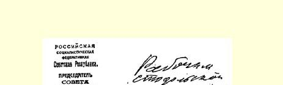
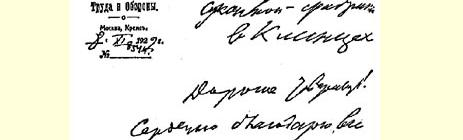
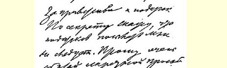
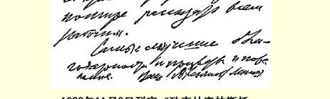

# 致国营“输电”发电站职工 １９１

> （１９２２年１１月７日） 亲爱的同志们：

在庆祝革命五周年的今天，我特别高兴地祝贺你们俱乐部的开幕，希望你们国营“输电”发电站职工能够同心协力把这个俱乐部办成对工人进行教育的最重要的阵地之一。

### 弗·乌里扬诺夫（列宁）

１９２２年１１月７日

> 载于１９４５年《列宁文集》俄文版译自《列宁全集》俄文第５版第３５卷第４５卷第２７１页

> １９２２年１１月８日列宁
>
> 《致克林齐的斯托多尔制呢厂工人》一信手稿