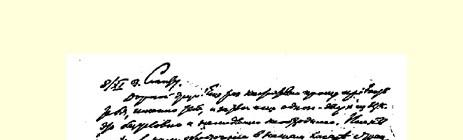
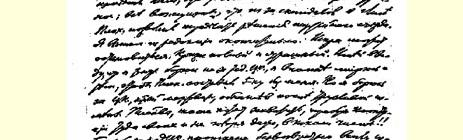
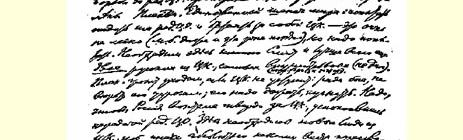
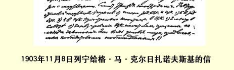

退出相威胁。千万不要相信他的威胁，必须对他施加压力，吓唬他。 必须使国内坚决捍卫中央委员会，不要为交出中央机关报编辑部而不安。这里需要中央委员会中的新人，不然就完全没有人同马尔托夫派进行谈判。斯米特万不可少。我再说一下马尔托夫派的“条件”：（１）以中央机关报编辑部和中央委员会的名义进行谈判；（２） 中央机关报编辑部６人；（３）中央委员会？人。停止增补中央委员； （４）总委员会里２席；（５）取消中央委员会关于同盟的决议，承认同盟代表大会是合法的。这就是战胜者向战败者提出的媾和条件！！

> 从日内瓦发往基辅译自《列宁全集》俄文第５版载于１９２８年《列宁文集》俄文版第４６卷第３１７—３１８页第７卷

## ２３５ 致马·尼·利亚多夫[^1]

１９０３年１１月１０日

亲爱的利金：我想把我们的“政治新闻”告诉您。

先按时间顺序谈谈最近发生的一些事件。星期三（１０月２７日或１０月２８日？），同盟代表大会的第三天。马尔托夫歇斯底里地号叫说，我们“对旧编辑部的死亡负有责任”（普列汉诺夫的说

> １９０３年１１月８日列宁给格·马·克尔日扎诺夫斯基的信

（按原稿缩小） 法），列宁在代表大会上玩弄某种阴谋诡计等等。我心平气和地要他用书面形式（向代表大会主席团提出声明[^2]）**公开**向全党责难我，我负责全部刊印出来。否则这就是无理取闹。当然，马尔托夫 “光明正大地退却了”，提出诉诸（现在还这样）仲裁法庭；我仍然要求他拿出勇气公开进行责难，—— 否则，这一切我将当作可耻的诽谤**置之不理**。

由于马尔托夫的不体面行为，普列汉诺夫不愿发表意见。我们有１０人向代表大会主席团提出声明，申斥马尔托夫把争论当作无谓争吵、猜疑等等的“不体面行为”。附带说一句，我所作的关于在党的代表大会上陷入泥潭的“马尔托夫同志的历史性的转变”这一长达两小时的发言[^3]，甚至在马尔托夫派中间也没有一个人提出抗议，说我把问题变成无谓的争吵。

星期五。我们决定派１１个新成员到同盟去；晚上同这些“掷弹手”（我们开玩笑地这样称呼他们）举行非正式会议，会上**普列汉诺夫排演了**我们如何给马尔托夫派当头一棒的一切步骤。这一表演， 博得了雷鸣般的掌声。

星期六。中央委员会宣读了它关于不批准同盟章程和大会不合法的声明（这个声明事先曾同普列汉诺夫逐字逐句地详细讨论过）。我们全体在马尔托夫派呼喊“宪兵”等等号叫声中退出了代表大会。

星期六晚上。普列汉诺夫“投降了”：他不主张分裂。他要求开始和谈。

星期日（１１月１日）。我书面向普列汉诺夫提出辞职（我不愿意参加由于国外争吵的影响而改变党代表大会这类无耻勾当，何况即使单从战略观点来看，让步的时机也是选择得最愚蠢不过的了）。[^4]

１１月３日。斯塔罗韦尔把同反对派媾和条件书面通知已开始谈判的普列汉诺夫：（１）由中央机关报编辑部和中央委员会进行谈判；（２）恢复《火星报》的旧编辑部；（３）增补中央委员，人数通过谈判确定。谈判开始后停止增补中央委员；（４）党总委员会里**２席**（原文如此）；（５）承认同盟代表大会是合法的。

普列汉诺夫并没有感到难堪。他要求中央委员会让步（！！！）。 中央委员会拒绝了，并写信到国内去。普列汉诺夫声称，如果中央委员会不让步，他就退出。我把编辑部的**一切**事务交给普列汉诺夫 （１１月６日），我相信普列汉诺夫不仅会把报纸，而且还会把**整个中央委员会**无代价地交给马尔托夫派。[^5]

现在的情况是：《火星报》未必能按期出版。马尔托夫派欢呼他们的“胜利”。我们所有的人（除了甚至在普列汉诺夫背叛之后仍忠于他的阿克雪里罗得两姊妹[^6]之外）都离开普列汉诺夫，并在大会上（１１月６日或７日）向他说明了可悲的真情（论题是“第二个伊萨里”）。

这不是很好吗？我不参加编辑部，但还将写稿。我们的人要尽可能地保卫住中央委员会，并且要继续加强反对马尔托夫派的鼓动—— 我看，这种安排是正确的。

就让普列汉诺夫退出吧，那时党总委员会就会把《火星报》交给一个专门委员会代管，并召开党的紧急代表大会。难道真的能允许国外同盟以３—４票的多数来改变党的代表大会吗？？在斗争已经公之于众，几乎要分裂的时候，鸣金收兵，接受马尔托夫派强加的媾和条件，难道是体面的吗？？

我很想知道您的意见。

我认为，普列汉诺夫那样的行为是破坏党的代表大会、背叛它的多数派。我认为，我们应当在这里和国内全力展开鼓动，说明要服从的是党代表大会，而不是同盟代表大会。

当然，抵制《火星报》（尽管是马尔托夫的）是愚蠢的。而且将来 《火星报》或许不是马尔托夫的，而是普列汉诺夫的，因为查苏利奇、阿克雪里罗得很快会使普列汉诺夫在５人中得到３票。这就是所谓的编辑部！！为了补充您关于萨罗夫圣尸３７０的俏皮的说法，我作了一个小统计：在六人小组出的《火星报》４５号刊载的论文和小品文中，马尔托夫写了３９篇，我３２篇，普列汉诺夫２４篇，斯塔罗韦尔８篇，查苏利奇６篇，帕·波·阿克雪里罗得４篇。这就是３ 年来的情况！除了马尔托夫和我，谁也没有编过（从编排技术工作来说）一号。而现在—— 为了奖励胡闹行为，为了奖励斯塔罗韦尔断绝一个巨大的经济来源—— 却把他们容纳在编辑部里！他们为 “原则性分歧”而斗争，—— 这些“原则性分歧”在斯塔罗韦尔１１月 ３日给普列汉诺夫的信中如此富于表现力地变成了一种计算：他们需要多少职位。而我们倒不得不使这种争权夺位的斗争合法化， 倒不得不同这一伙被废黜的将军们或部长们（象普列汉诺夫所说的，将军们的总罢工）、或者同歇斯底里的胡闹分子作一笔交易！！ 如果用国外的徇私行为、歇斯底里和胡闹来裁决事务，那么党的代表大会有什么用处呢？？

再谈一谈轰动一时的“三人小组”。歇斯底里的马尔托夫认为 “三人小组”是我的“阴谋诡计”的中心。您一定还记得在代表大会期间我所提出的代表大会纲领和我对这一纲领所作的说明。我十分希望**全体党员都知道这个文件**，因此再一次地向您确切地引用它。“第２３条（日程）。**选举党的中央委员会和中央机关报编辑部”**。

我的说明是：“代表大会选出三人为中央机关报编辑部成员， 选出三人为中央委员会委员。必要时，这六个人**在一起**，经三分之二多数的同意，以增补的办法补充中央机关报编辑部和中央委员会的成员，并向代表大会作出相应的报告。代表大会批准这个报告以后，中央机关报编辑部和中央委员会再分别进行增补。”[^7]

由此可见，编辑部不经中央委员会同意（６人中４人同意才得增补）**不能实行改组**，而且关于扩大或保留原有三人小组的问题**尚未解决（“必要时”**才进行增补），这难道还不清楚吗？在代表大会以前，我曾把这个草案给**所有的人**（当然也包括普列汉诺夫）看过。自然，由于对六人小组的不满（特别是对普列汉诺夫，他事实上取得了几乎从未参加工作的帕·波·阿克雪里罗得和温顺的维·伊· 查苏利奇的赞成票）需要实行改组，自然，我在同马尔托夫的私下谈话中，**激烈地**表示了这种不满，“责骂”普列汉诺夫（主要是他）、 阿克雪里罗得和查苏利奇反复无常，并要求把六人小组扩大为七人小组等等。但是，现在把这些私下谈话翻出来，叫喊“三人小组反对普列汉诺夫”，叫喊我给马尔托夫设置了“圈套”等等，这不是歇斯底里吗？？自然，当我和马尔托夫一致时，三人小组就是反对普列汉诺夫，但是当普列汉诺夫和马尔托夫一致时（例如关于游行示威问题），三人小组就是反对我，等等。这些歇斯底里的叫喊只是掩盖他们完全不能理解：在编辑部中的应当是真正的编辑，而不是挂名的编辑；编辑部应当是一个实干的集体，而不是一个庸俗的集体； 其中**每一个**成员在**每一个**问题上都应当有自己的意见（落选的三人从来就没有过自己的意见）。

马尔托夫本来**赞同**我的两个三人小组的计划，但是当他发现这个计划**在一个**问题上反过来对他马尔托夫不利的时候，他就歇斯底里地叫喊阴谋！怪不得普列汉诺夫在同盟代表大会的走廊上称他为“可怜的人”！

的确……正是令人不快的国外内讧战胜了大多数国内工作人员的决定。普列汉诺夫的变卦，部分是由于害怕国外争吵，部分是由于感觉到（**可能是这样**）在五人小组里他将拥有３票……

为捍卫中央委员会而斗争，为迅速召开（夏季）新的代表大会而斗争，这就是我们所要做的。

请尽力寻找一下我的记事本３７１。波列塔耶夫（鲍曼）**只是**把它寄给韦切斯洛夫本人一人的。舍尔戈夫只有用欺骗手段，**只有用破坏信用的办法**才能拿到它。您愿念给谁听就给谁念，不要交到任何人的手里，要还给我。

您应当从所有的阵地上排挤掉韦切斯洛夫。带上中央委员会的信，向党执行委员会[^8]说明自己是中央委员会的代办员，把德国

[^1]: 信上有列宁的批注：“信未发”。—— 俄文版编者注

[^2]: 见《列宁全集》第２版第８卷第４９页。—— 编者注

[^3]: 同上，第３８—４８页。—— 编者注

[^4]: 见《列宁全集》第２版第８卷第６０页。—— 编者注见本卷第２３３号文献。—— 编者注

[^5]: 

[^6]: 伊·伊·阿克雪里罗得和柳·伊·阿克雪里罗得。—— 编者注

[^7]: 见《列宁全集》第２版第７卷第３７７页。—— 编者注

[^8]: 德国社会民主党中央执行委员会。—— 编者注