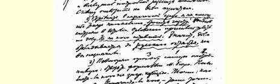
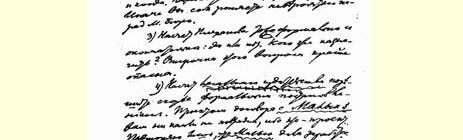
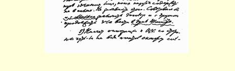

刊进行领导。《工人报》不适合于这个任务，它有另外的作用。你们**绝对有必要**出版篇幅不超过**两个印刷页**的中央委员会简报，**每周**出**两次**。每期发表一篇有关政治、策略或组织问题的短文，其次再刊登一些两三行的简短通知。只是必须（１）用铅印，因为胶印很坏（难道连一个**迅速**工作的小机器也没有吗？），（２）认真地经常地这样做。

我不清楚你们想把《工人报》改成小型周报的计划。我认为， 出版通俗化的机关报（我并不支持这件事，既然代表大会决定了， 那就算了）是一回事，出版刊登真正领导性的一般政治文章的**简报**是另一回事。三四个优秀的撰稿人你们那里是有的，这就是说， 一个星期写两篇文章是轻而易举的事，而意义却很重大！

> 从日内瓦发往俄国译自《列宁全集》俄文第５版载于１９２６年《列宁文集》俄文版第４７卷第７６页第５卷

５６

## 致俄国社会民主工党中央委员会

１９０５年１０月３日

亲爱的朋友们：收到了一大堆文件并听了迭尔塔的详细叙述。 现在我赶紧逐条答复。

> １９０５年１０月３日列宁给俄国社会民主工党
>
> 中央委员会的信的第１页
>
> （按原稿缩小）

（１）我不能按规定的日期到达，[^1]因为现在不可能放下报纸。１０３沃伊诺夫滞留在意大利。奥尔洛夫斯基被派去办事了。无人可以托付。就是说，事情要拖到俄历１０月，正如你们所定的那样。

（２）再一次最恳切地请求：请你们正式答复国际局。是否派人出席国外代表会议。确切说明：派谁去和什么时候去。现在是否指定什么人，也请确切说明。不然你们就会在国际局面前丢脸。

（３）关于普列汉诺夫也要给以正式的和最终的答复：是或不是。究竟派谁？１０４拖延这个问题是极端危险的。

（４）关于公开出版的事情请赶快用正式决定解决。我起草的那个同马蕾赫[^2]订立合同的草案丝毫不妨害你们，因为这还是草案。我要重复说明的只是，马蕾赫付给了这里一批人工资，而这些人党是没有力量来维持的。请不要忘记这一点。我想建议，既同马蕾赫订合同，也按照施米特的办法继续同其他人打交道。１０５

（５）关于几乎所有代办员都反对中央委员会的问题，我有以下的意见：第一，我十分赞成增补因萨罗夫和柳比奇两人，这可能大大地改善情况。第二，某些代办员显然有些夸大其词。第三， 是否可以把一部分代办员派到各委员会中去，委托他们照顾两三个邻近委员会的整个区域的工作？不要过分强调策略的一致性：各委员会有某些不同的行动和计划也不碍事。

（６）我认为筹备召开第四次代表大会非常重要。是时候了。它大概至少会推迟半年，或许还更久些。然而终究是时候了。我觉得，我们放松了对某些委员会的监督，没有坚持要它们遵守第三次代表大会关于容纳孟什维克的条件的决议，我们在这方面是有些错误的。如果这些同时既承认又不承认第三次代表大会的委员会，在第四次代表大会前不划清界限，就会产生混乱。它们之中有一部分将不出席第四次代表大会。又是麻烦事。一部分将出席代表大会并在代表大会上背叛。我们不应当把统一两个部分的政策同**混淆**两个部分的行为混为一谈。统一**两个**部分，我们同意。混淆两个部分，永远办不到。我们应当要求各委员会，先明确划清界限，然后召开两个代表大会，那时才实行统一。在同时同地召开两个代表大会，它们将讨论并通过预先准备好的关于统一的草案。

而现在必须最坚决地反对把党的两部分**混淆起来**。我建议最肯定地向代办员们提出这样的口号，并责成他们实现这个口号。

如果不这样做，那就会一团糟。一切混乱都对孟什维克有利， 他们会千方百计地制造混乱。这对他们“不会更坏”（因为再没有什么能比他们所造成的组织紊乱状况更坏的了），而我们珍视自己的组织，即便是萌芽的组织，而且将竭力捍卫它们。弄乱一切并把第四次代表大会变成新的争吵是有利于孟什维克的，因为他们关于召开**自己的**代表大会甚至连想都不想。而我们却应当用一切力量和一切方法去团结，去改善***我们***这部分党组织。这个策略好象是“自私自利的”，但是它是唯一合理的。如果我们团结得很好， 组织得很完备，如果我们能从自己队伍中驱除一切腐败分子和倒戈分子，那么我们的坚定核心，即便是不大的核心，也会领导起全部“组织散乱的”大众。而如果我们没有核心，那么孟什维克在瓦解了自己以后，也会瓦解我们。如果我们有一个坚强的核心， 我们就会很快地迫使他们与我们统一。而如果我们没有核心，那么，获得胜利的不会是另一核心（它是没有的），而会是**那些糊涂**

[^1]: 此处和以下各处用波浪线画出的词句（请参看插图）表明应译成密码。——俄文版编者注

[^2]: 见本卷第５４号文献。—— 编者注