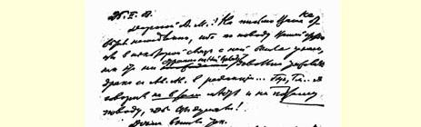
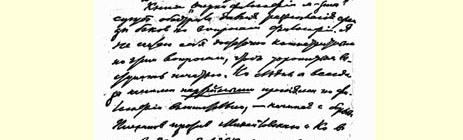
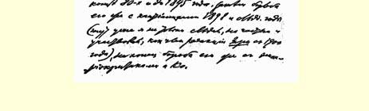

１０５

## 致阿·马·高尔基

１９０８年２月２５日

亲爱的阿·马·：没有立刻给您回信，是因为您的文章１６２（或者说同您的文章有某些关系）在我们编辑部里引起了我同亚历· 亚历·的一场相当严重的争吵，这件事乍看起来是很奇怪的…… 不，不……我说的可**不是**您想的**那个**地方，也不是那个原因。

事情是这样的。 《关于马克思主义哲学的论丛》１６３这本书使布尔什维克在哲学问题上原来就有的意见分歧更加尖锐化了。我认为自己在这些问题上还不够内行，不想急于发表文章。不过我一向很注意我们**党内**在哲学方面的争论，最早是８０年代末到１８９５年普列汉诺夫同米海洛夫斯基那批人的斗争，然后是１８９８年和以后几年他同康德主义者的斗争（那时我不仅注意，而且从１９００年起曾以《**曙光》** **杂志**编辑部成员的身分部分地参加了这一斗争），最后是他同经验批判论者那批人的斗争。

我开始注意波格丹诺夫的哲学著作是从我看了他的唯能论著作《历史的自然观》以后，这本书我在西伯利亚时仔细研究过。对波格丹诺夫来说，这种观点只是他向其他哲学观点的过渡。我同他认识是在１９０４年，当时我们就立刻互相赠送了自己的著作；我

> １９０８年２月２５日列宁给阿·马·高尔基的信的第１页
>
> （按原稿缩小） 送他一本《进一步，退两步》[^1]，他送我一本他**当时**写的哲学著作１６４。我并且很快（１９０４年春天或夏初）就从日内瓦写信到巴黎告诉他：他的著作使我更不相信他的观点是正确的，而更相信普列汉诺夫的观点是正确的。

我同普列汉诺夫在一起工作的时候，曾多次谈到波格丹诺夫。 普列汉诺夫向我解释波格丹诺夫观点的错误，但他认为这种偏差决没有严重到不可挽回的地步。我清楚地记得，１９０３年夏天我和普列汉诺夫以**《曙光》杂志**编辑部的名义同《实在论世界观论丛》编辑部的代表在日内瓦谈过话，**同意**撰稿，我负责谈土地问题，普列汉诺夫负责**在哲学上批判马赫**。１６５普列汉诺夫提出把批判马赫作为撰稿的**条件**，《论丛》编辑部的代表完全接受了这个条件。 当时普列汉诺夫把波格丹诺夫看作是反修正主义斗争中的同盟者，然而是一个由于追随奥斯特瓦尔德，后来又追随马赫而犯了错误的同盟者。

１９０４年夏天和秋天我们同波格丹诺夫等几个**布尔什维克**的意见完全一致，我们达成默契，大家不谈哲学，把哲学当作中立地区，这个同盟在整个革命时期一直存在着。它使我们有可能在革命中共同贯彻革命的社会民主党（＝布尔什维主义）的策略，这种策略我深信不疑地认为是惟一正确的策略。

在革命火热的时候很少研究哲学。１９０６年初波格丹诺夫在狱中又写了一部著作，大概是《经验一元论》第３卷。１９０６年夏天他送了一本给我，我仔细读了一遍。我读完之后非常生气，因为我更清楚地看出，他走的是极端错误的道路，非马克思主义的道路。我那时就向他“表白爱情”，给他写了一封关于哲学问题的长达三个笔记本的信。我在信中明白地告诉他，在哲学方面我当然是一个**普通的马克思主义者**，但正是他那些明白易懂、写得很出色的著作使我完全相信他根本错了，而普列汉诺夫是正确的。这些笔记本我曾给某些朋友（其中包括卢那察尔斯基）看过，本来想用《一个普通马克思主义者的哲学札记》这个标题发表出来，但是没有下决心。现在很后悔当初没有立即把它发表。前几天我写信到彼得堡请求把这些笔记本１６６找出来寄给我。

现在《关于马克思主义哲学的论丛》已经出版。除了苏沃洛夫那篇文章（我正在看）之外，其余的我都看了，每篇文章都使我气得简直要发疯。不，这不是马克思主义！我们的经验批判论者、经验一元论者和经验符号论者都在往泥潭里爬。他们劝读者相信“信仰”外部世界的真实性就是“神秘主义”（巴扎罗夫），他们把唯物主义同康德主义混淆得不成样子（巴扎罗夫和波格丹诺夫），他们宣传不可知论的变种（经验批判主义）和唯心主义的变种（经验一元论），教给工人“宗教无神论”和“崇拜”人类最高潜在力（卢那察尔斯基），宣布恩格斯的辩证法学说为神秘主义 （别尔曼），从法国某些“实证论者”（主张“符号认识论”的该死的不可知论者或形而上学者）的臭水沟里汲取东西（尤什凯维奇）！不，这太不象话了。当然，我们是普通的马克思主义者，对哲学没有研究，但是为什么要这样欺侮我们，竟要把这些东西当作马克思主义哲学奉送给我们！我宁愿受车裂之刑，也不愿加入宣传这类东西的机关报或编委会。

我又想到了《一个普通马克思主义者的哲学札记》，我已开始在写了１６７，我在看《论丛》的过程中当然已经把自己的印象直率地、 不客气地告诉了亚历·亚历—奇。

您会问，这同您的文章有什么关系呢？有关系，因为正好在布尔什维克中间的这些分歧有特别尖锐化的危险的时候，您给 《**无产者报》**写文章，公开阐述一个流派的观点。我当然不知道您整篇文章是怎样写的，写些什么。此外，我认为艺术家可以在任何哲学里汲取许多对自己有益的东西。最后，我完全地、绝对地相信，在艺术创作问题上您是行家，您从自己的艺术经验里，**从即使是唯心主义的哲学里**汲取**这种**观点，您一定会作出大大有利于工人政党的结论。这一切就是这样。然而《无产者报》应该对我们在哲学上的一切分歧绝对保持中立。不要给读者***一丝一毫的借口***，来把代表俄国社会民主党革命派的策略路线的布尔什维克派同经验批判主义或经验一元论联系在一起。

我反复地看了您的文章以后，对亚·亚—奇说，我不同意登载这篇文章，他的脸色顿时变得很难看。我们这里简直笼罩着分裂的气氛。昨天我们召开了编辑部三人小组会议特别讨论这个问题。这时《新时代》杂志的一个愚蠢的举动突然帮了我们的忙。在第２０期上登载了一个不知名的译者译的一篇波格丹诺夫论马赫的文章，并且在序里信口开河地说，普列汉诺夫和波格丹诺夫的分歧有变成俄国社会民主党内布尔什维克和孟什维克**派别**意见分歧的倾向！写这篇序的蠢男蠢女用这些话使我们团结起来了。我们立即一致认为完全必要在《**无产者报**》最近一号上声明我们的中立。《论丛》出版以来，这算是我的一件极称心的事。声明已经拟好，已经一致通过，明天就登在《**无产者报**》第２１号上，并将寄一份给您[^2]。

至于您的文章，我们决定把这问题搁一下，由《**无产者报**》的三个编辑每人写一封信向您说明整个情况。我和波格丹诺夫尽快地到您那儿去一趟。

这样您会接到亚历·亚历·的信和另一位编辑的信，这个人我曾有一次在信上同您谈过。

我认为有必要直率地告诉您我的意见。我认为，现在布尔什维克之间在哲学问题上发生某些争吵是完全不可避免的。但因此而闹成分裂，我看是愚蠢的。我们订立同盟是为了在工人政党内执行既定的策略。直到现在为止，我们执行这个策略始终**没有意见分歧**（惟一的意见分歧就是抵制第三届杜马的问题，但是第一， 这个分歧在我们中间并没有尖锐到分裂的地步，甚至连分裂的迹象也没有；第二，这个分歧和唯物主义者同马赫主义者的分歧毫不相干，例如，马赫主义者巴扎罗夫也和我一样，曾反对抵制，并且在《无产者报》上就这个问题写过一篇很长的杂文）。

由于争论究竟是唯物主义还是马赫主义而妨碍在工人政党内执行革命的社会民主党的策略，我看这是不可宽恕的蠢事。我们进行哲学上的争论应该使《无产者报》和布尔什维克这个**党内的** 派别**不致受到伤害**。这是完全可能的。

我认为，您也应该在这方面给予帮助。您可以替**《无产者报》**就文学批评、政论和文艺创作等等中立的（即同哲学没有什么关系的）问题写文章，以此来给予帮助。如果您愿意防止分裂， 帮助制止新的争吵扩大，您最好把文章修改一下：把那些即使是同波格丹诺夫哲学间接有关的一切都挪到别处去。好在您除了 **《无产者报》**以外还有的是地方发表文章。凡是同波格丹诺夫哲学无关的（您的文章大部分同他的哲学没有关系），可以写成若干篇文章给**《无产者报》**。如果您采取另一种行动，即拒绝修改文章或拒绝为《无产者报》写稿，那我认为不可避免地将会使布尔什维

[^1]: 见《列宁全集》第２版第８卷第１９７—４２５页。—— 编者注

[^2]: 见《列宁全集》第２版第１６卷第４０５页。—— 编者注