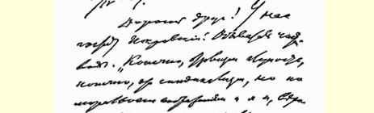
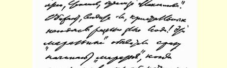
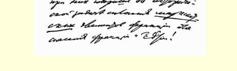

１３８

## 致约·费·杜勃洛文斯基

１９０９年４月２３日

亲爱的朋友：波克罗夫斯基现在在我们这里做客。一个地地道道的庸人。“当然，召回主义是愚蠢的，当然，这是工团主义， 但是从道义上考虑，我，而且大概连斯捷潘诺夫，都会赞同马克西莫夫的”。您瞧，各式各样邪恶的人在欺侮那些水晶般纯洁的坏蛋！一旦你在这些“泼污水的”庸人面前谈起团结派别里的**马克思主义**分子以拯救派别和社会民主党这一历史任务时，他们马上就开始“泼污水”了！

写信要这个泼污水者来的是反对派；我们没有写信要他来，因为知道全体会议１９６延期了。

从林多夫和奥尔洛夫斯基那里传来的暂时都是些不好的消息：前者据说是病了，后者只能到彼得堡去。不过，我直接写给他们的信尚无回音。我们得等一等。

似乎现在是由弗拉索夫在决定命运：如果他跟那些傻瓜、庸人和马赫主义者走，那么，显然会发生分裂和一场**顽强的**斗争。如果他跟我们走，那么，或许能做到使那两个在党内无足轻重的庸人退出了事。

尼基季奇这个坏蛋在**社会革命党人**那里搬弄是非，造谣生事！

> １９０９年４月２３日列宁给约·费·杜勃洛文斯基的信的第１页这同那些“泼污水的”臭虫一样：向别的党诉苦，造自己党的谣言。社会革命党人显然是从尼基季奇那里听到了风声，在“**审讯**”时据说表现得蛮不讲理。１９７这笔帐我们要直接记在尼基季奇头上，我们不会忘掉他这种搞法的！

关于“尤里—尼基季奇”事件１９８我一无所知。我曾想从您那里打听这一事件。依我看，您应该**亲自**，而且正是在目前同尤里**通信**或者**写信要**他上您那里去，并取得他的保证；能把剩下的部分转移到可以秘密保藏的地方则更好。

多莫夫＋波格丹诺夫＋马拉今天要求布尔什维克中央将全会的日期定在５月底６月初。实际上全会要更晚些才能举行。

您要认真治疗，一切都要听医生的，哪怕在全体会议召开前能稍有恢复也是好的。**请**您打消离开疗养院的念头，尽管我们非常缺人，要是您不能恢复健康的话（恢复健康可不容易，请您别抱幻想；为此要**认真**治疗！），那我们就可能完蛋。

望设法同柳比奇建立并**保持**最经常的通信联系：**这是必要的**， 因为在万不得已时可能要写信叫他来。您务必要做到同他**直接**通信。

握手！

### 尼·列宁

> 从巴黎发往达沃斯（瑞士）译自《列宁全集》俄文第５版
>
> 第４７卷第１７３—１７７页