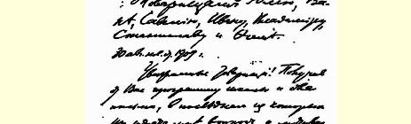
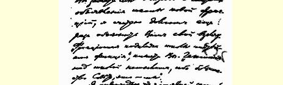
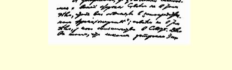

１５３

## 致卡普里学校学员们

致尤利、万尼亚、萨韦利、伊万、弗拉基米尔、

斯坦尼斯拉夫、托马斯同志

公历１９０９年８月３０日

尊敬的同志们：你们寄来的教学大纲和两封信都收到了，在后一封信中，你们向我提出一个问题，要我说明宣布学校为新的派别组织的理由，我认为我有责任再一次向你们说明我的观点。你们说，“说学校有派别背景，这纯粹是虚构”。“凌驾于学校之上的领导权是不可思议的，因为委员会中我们是多数”。

我肯定地说，这显然是你们自己欺骗自己。问题完全不在于责备你们“直接参加派别活动”；问题也完全不在于谁在委员会中占多数。问题在于学校是（１）由新的派别组织发起建立的，（２） 完全是新的派别组织出钱办的，（３）设立在**只有**新的派别组织的讲课人的地方，（４）设立在除了极少有的例外**不可能有**其他派别组织的讲课人的地方。

所有这些条件都不以你们的意志为转移。你们是不能改变这些条件的。而这些条件已经**预先决定**了学校的性质，你们的任何良好的意图和你们委员会的任何决议都决不能改变任何实质。

在任何学校里，最重要的是课程的思想政治方向。这个方向由什么来决定呢？完全而且只能由**教学人员**来决定。同志们，你们非常明白，任何“监督”、任何“领导”、任何“教学大纲”、 “章程”等等，这一切对教学人员来说都是空谈。任何监督、任何教学大纲等等，绝对不能改变由教学人员所决定的课程的方向。而且任何时候，在世界上的任何地方，任何一个尊重自己的组织、派别或团体，**都不会来**为一个方向已经由教学人员预先决定了的学校分担责任，如果这个方向是和自己敌对的。

现在来看看预先决定学校的性质和方向的教学人员吧。同志们，你们在给我的信里签了名，但是你们以学校学员和**讲课人**的名义写给中央委员会的信里（这封信的抄件我是和教学大纲一起收到的），讲课人并没有签名。因此，我不能十分确切地知道哪些人是教学人员。但是就从我所知道的一些情况来看，已经足以给教学人员下判断了。

中部工业区的地方组织从俄国写信给我们说，如果说不是唯一的那也是最积极的一个宣传成立卡普里学校的人是斯坦尼斯拉夫同志，听过他的专题报告的一些社会民主党小组已经把他选为讲课人。这位斯坦尼斯拉夫同志是最坚决的召回派，是在哲学上对马克思主义进行批评的“批评家”。想想下面这些事情就够了： （１）他在他的著名的哲学小册子里是怎样大骂考茨基的；（２）他在１９０８年１２月的党代表会议上是怎样同圣彼得堡的召回派弗谢 ·一起分裂为特别的召回派组织的；（３）他所校改的《工人旗帜报》第５号上那篇召回派“一工人”的文章怎么连**这家《工人旗帜报》自己**也承认是充满了**无政府主义**观点的。

请你们再看一看你们现在在卡普里可以看到的那些讲课人吧。他们当中没有一个是布尔什维克。可几乎尽是一些新的派别组织（召回派和造神派）的拥护者。我如果说，在卡普里的讲课人

> １９０９年８月３０日列宁给卡普里学校学员们的信的第１页中有马克西莫夫、卢那察尔斯基、利亚多夫、阿列克辛斯基等同志，那不见得会有多大错。正是这批同志从１９０８年春天起组成了 《无产者报》的反对派，在俄国和国外进行反对《无产者报》的宣传，在１９０８年１２月的党代表会议上分裂出来成为特殊的派别组织（或者支持这个派别组织），最后则完全成为特殊的派别组织。

否认这批同志进行反对《无产者报》的宣传，支持和维护召回派，那就是嘲笑党内人所共知的事实。否认卡普里岛甚至在整个俄国著作界中都已经得到造神派作家中心的名声，那是对事实的一种揶揄。所有的俄国报刊都早已指出，卢那察尔斯基在卡普里岛上宣传造神说。巴扎罗夫在国内帮助他。波格丹诺夫在国内公开出版的近十种书籍和文章里，在国外作的上十次专题报告里， 都为这类哲学观点辩护。我在１９０８年４月到过卡普里岛，并且对所有这３位同志声明，在哲学上我同他们有绝对的分歧（而且我当时建议他们把共同的物力和人力用来写与孟什维克取消派的革命史相对立的**布尔什维克革命史**，但是卡普里的人拒绝了我的建议，他们愿意从事的不是整个布尔什维克的事业，而是宣传自己的特殊的哲学观点）。你们在卡普里岛的这批讲课人中间大多数是著作家，而这些著作家当中就**从来没有一个人在报刊上**抨击过卢那察尔斯基和巴扎罗夫的造神说宣传！

同志们，尽管有这一切事实，你们在写给我的信里还是说，认为学校同造神派和召回派有联系是“误会”，而且“完全”是我这方面的“误会”，因为“这样的目的在学校这里不仅没有提出来， 而且根本谈不到”，—— 我只有对你们的这种极端天真的想法感到惊奇。我再说一遍：学校的**真正的**性质和方向并不由地方组织的良好愿望决定，不由学生“委员会”的决议决定，也不由“教学大纲”等等决定，而是由**教学人员**决定的。如果教学人员一直是完全由新的派别组织那个圈子中的人物来决定，那么，要否认学校的派性就简直是可笑的。

为了结束关于教学人员的问题，我还要告诉你们一件事。这件事是英诺森同志对我说的，它表明党内**所有的人**都十分清楚你们企图否认的事情，即卡普里学校存在特殊的派性。在最近这次 《**无产者报**》扩大的编辑部会议２１９开会前不久，马克西莫夫同志在巴黎请托洛茨基到卡普里学校去当讲课人。托洛茨基对英诺森同志谈到这件事，并且对他说：如果这是党的事业，我很愿意去；如果这是卡普里的著作家马克西莫夫、卢那察尔斯基一伙的特殊事业，那我就不去。英诺森回答：请您等候《无产者报》编辑部的决议吧，我会把这些决议寄给您的。由此可见，不属于任何派别组织的托洛茨基同志立刻就懂得（就象任何多少有些经验的党的工作者懂得这一点一样），在卡普里岛办学校就是**避开党办学校**， 就是预先把学校同一个特殊的即新的派别组织联系起来。

现在来谈谈关于巴黎的问题。我写信告诉过你们，如果你们真是对我和我的同志们的讲课感到兴趣的话，你们就应当到巴黎来。你们回答我说：“考虑到费用，去巴黎是完全不合适的。”

我们来看看，我们当中究竟谁说得不合适。

你们是经过维也纳到卡普里岛去的。如果你们从原路回去，那么你们可以从意大利北部转道来巴黎，而从巴黎就可以直达维也纳。这样的走法增加的旅费大概每人不超过６０法郎（根据日内瓦 （我在那里住了很久）到巴黎的票价是３０法郎来推算）。你们的信有８个人署名，同时，有一个人声称“今后不再通信”，这就是说， 他显然不愿意来听我的讲话了。还剩下７位同志。费用是７×６０＝ ４２０法郎。

你们从巴黎请４位讲课人（列瓦、我、格里戈里、英诺森）。 从巴黎到卡普里来回旅费约１４０法郎，总计４×１４０＝５６０法郎。

８个学员绕道来巴黎要比４个讲课人专程去卡普里的**费用少些**。

但是，正象我在前一封信[^1]里已经对你们说过的，经费问题远不是最重要的问题。请想一想，是外来的学员选择地点容易呢，还是本地的讲课人选择地点容易？你们到外国来是专门为了进学校学习的。这就是说，你们到有大批讲课人的地方去，到可能真正由党在安排工作的地方去是不会有什么阻碍的。

而讲课人们就不能离开党的中心到卡普里岛去。就拿我来说。 我不能丢开《无产者报》编辑部—— 我不能丢开中央机关报编辑部，我不能丢开设在巴黎的社会民主党杜马党团协助委员会—— 我应当在住着成百成千俄国工人的巴黎工人住宅区的《无产者报》俱乐部讲演等等。党的著作家们从巴黎到卡普里岛去是绝对不可能的事情。

但是，对学校来说，正象对党的事业一样，重要的不仅是布尔什维克的讲课人。巴黎是一个最大的侨民中心，在这里可以经常听到一切派别组织公开作的专题报告，举行讨论会，举行各种小组活动；这里有２—３个不坏的俄文图书馆，有几十位在社会民主党内影响深远的组织者等等。有社会民主党的３种俄文报纸在巴黎出版。总之，对任何一个哪怕是稍稍知道一点国外情况的人， 事情都很明白，就象明朗的白昼那样明白：谁要是到巴黎去学习社会民主主义，他就是真正去学习社会民主主义。谁要是到卡普里去学习，他就是去学习**特殊的**派别组织的“**学问**”。

谁在巴黎办学校，他就是真正在办党的学校。谁在卡普里岛办学校，他**就是在避开党办学校**。

卡普里的学校是**故意避开党办的**学校。

无论是你们今天所求教的中央委员会，或者是你们昨天所求教的《无产者报》编辑部，都**绝对**不可能对**卡普里的**学校进行任何监督、任何“思想领导”。在这里谈监督和思想领导，那都是空话。任何人都不会有派遣党的“视察员”到卡普里去监督学校这种荒唐想法；任何时候也**不可能**派遣真正的党的讲课人到卡普里去（除去极少的例外）。如果国内各地的党组织不知道这一点，那学校的创办人是**清清楚楚的**。正因为如此，他们才在卡普里办学校，以便**掩盖**学校的派性，避开党办学校。

拿那些不属于任何派别组织的、非常熟悉国外工人阶级运动的俄国社会民主党人，如帕尔乌斯和罗莎·卢森堡（德国），以及沙·拉波波特（法国）、罗特施坦（英国）来说；拿那些不属于任何派别组织的社会民主党著作家，如梁赞诺夫来说，—— 你们立刻可以看到（如果你们不愿意闭上眼睛不看的话），在巴黎，只要党作一些努力，他们多半都能来讲课，而卡普里他们是绝对无法去的。办学校的人用来派遣学员和讲课人到极其遥远的外国地方 （卡普里）去的那些钱，**已经足够**用来在巴黎请这些讲课人中的某些人举办讲座了。

其次，你们看看社会民主党内的新的分派情况，对国内的同志来说，了解这些分派情况是很重要的（崩得中护党派和取消派的斗争；拉脱维亚人中的布尔什维克和孟什维克的斗争；波兰社会民主党同波兰社会党左派的斗争；孟什维主义的分裂，普列汉诺夫出版了揭露波特列索夫和正牌孟什维克的取消派立场的《日志》；有人企图创立“革命的孟什维主义”等等）。在卡普里就**无法**好好地了解党的这些重要现象。在巴黎却有充分的机会直接得知这些情况，而不是仅仅听传闻。

最后，你们再看看卡普里学校的教学大纲。在４个部分里有 １个部分（第３部分）的标题是“无产阶级斗争的哲学”。在国际社会民主党里，这一类宣传课程的教学大纲有几十个、几百个 （如果不是几千个的话）。但是你们**在任何地方**都找不到“无产阶级斗争的哲学”。有马克思和恩格斯的哲学唯物主义，但是在任何地方都没有“无产阶级斗争的哲学”。而且在欧洲社会民主党人中谁也不会懂得这指的是什么。只有那些熟悉斯坦尼斯拉夫（安· 沃尔斯基）、波格丹诺夫、卢那察尔斯基、巴扎罗夫这几位哲学家的著作的人才懂得这是什么意思。在讲授“无产阶级斗争的哲学”以前，必须先把这种哲学编造出来。刚才提到的这批新派别组织的成员一直在编造这种**特殊的**哲学，这种哲学离开无产阶级的世界观愈远，它就愈加频繁地用“无产阶级的”字样来对天发誓。

我的信快写完了。同志们，如果你们坚持不愿到巴黎来（同时又硬要人相信你们愿意听我的讲课），那么，你们就将最后以此证明：不仅卡普里学校的讲课人，而且连那里的某些学员，也受到新的造神派和召回派的狭隘小集团政策的熏染了。

致社会民主党的敬礼！

### 尼·列宁

> 从邦邦（法国）发往卡普里岛（意大利）译自《列宁全集》俄文第５版载于１９２６年《无产阶级革命》杂志第４７卷第１９４—２０２页第２期

[^1]: 见本卷第１４６号文献。—— 编者注