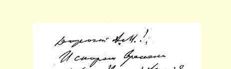
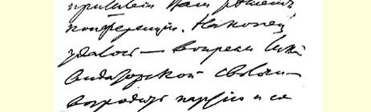
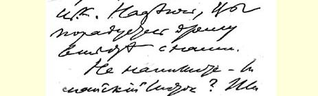
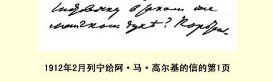

## ４６ 致某人８９

１９１２年２月２６日于巴黎

### 抄件[^1] 尊敬的同志：

衷心感谢您的答复。我很高兴，在最重要的问题即仲裁协议已经失效这一问题上，我们彼此意见一致。因此，剩下的便只有以下两点：

第一，您写道，“**要是**问题从民法仲裁协议的角度来考察 ……”我认为，问题不可能从别的角度，而只能从这一角度来考察。***正式公布的***协议９０条文中简短而明确地写道，我（作为布尔什维克的代表）有义务将钱交给指定的三位同志，另一方面，这三位同志则有义务最后作出决定：“钱是否应该归还，归还给谁（是中央委员会还是布尔什维克）”。这就是仲裁协议的内容。调停人不履行义务，我就没有交出钱的义务。

第二，您认为大可怀疑的是，“我能否被视为有全权收受（此款）的人”。我深信不疑，我完全有权并唯一有权办理此事，我所依据的是如下理由：

１．两党签订仲裁协议，而该协议已失效，那么有争议的款项理应由调停人如数交还给协议签订**之前**掌握该款的**那个**党。

２．在仲裁法庭存在期间（１９１１年７—１０月）我一直被调停人在文字上承认为一方。

３．在协议签订前（即１９１０年１月前）**我**掌管这笔钱是绝对确凿的，并且不难证明（有合法文件为凭）。

４．考茨基似乎说，他不是从我手上，而是从中央委员会接受这笔钱的。这是个错误或误会：（我**１９１１·年７·月**将这笔钱交给了蔡特金。从１９１０年１月至１９１１年７月，我并不是以布尔什维克代表的身分，而是以中央委员会委员的身分保管着这笔钱的。可是仲裁协议的失效就使事情恢复到了**原来状态**，即恢复到了１９１０ 年１月**前**，协议签订前的“状态”）。钱到１９１１年７月仍归布尔什维克所有，我１９１０年１月就答应将钱交给考茨基，而且在**１９１１·年** **２·月**给他写信说，我准备按他所指定的地址立即把钱寄去。我有文字凭据，说明考茨基在１９１１年７月前一直拒绝我的**这个**反复提出的**建议９１**。

５．此外，还有一种用作论据来反对我的说法，似乎即使在 **１９１０·年１·月*前***这笔钱由我掌管也不是无可争议的。

但这是绝对没有任何意义的，人人都有权提出异议，可我有权掌管这笔钱。[^2]

６．这笔钱以前是一位死在狱中的布尔什维克９２的私产。他留下遗嘱要把这笔钱捐给布尔什维克。他妹妹把钱交给了我。

**１９１１年１１月１日**后，蔡特金同志已不再是调停人了，她给死者的妹妹写信９３，说对方不应把尚未交完的钱交给我（我１９１１年 １１月１日后曾要过这笔钱），而应交给蔡特金同志。死者的妹妹回信说，钱归布尔什维克所有以及布尔什维克对党的义务（与她无关），那都是布尔什维克的事。钱还是交给了我。死者的这位妹妹现居国外。

７．当然，看来似乎奇怪，我们党内存在着派别和派别的基金， 并且**容许**派别和党之间达成协议。为了对您略加说明这种奇怪情况的存在，有必要指出，在我党伦敦代表大会（１９０７年５月）正式记录的第４４１页上便清楚地记载着，列宁收受了６万卢布并把这笔钱分发给了各**布尔什维克**组织。由代表大会任命的“检查委员会”**一致**决定承认这些开支是正当的。

８．在仲裁法庭存在期间（１９１１年７—１０月），所谓**中央委员会国外局９４**（既然中央委员会本身已不存在）一直在文字上被承认为当事的一方。这个国外局现在已完全解体，而且**正式宣布**不再存在。这样，我更是倍加有权接受这笔钱了。

９．１９１２年１月举行的党的代表会议被直接确认为党的最高机关并选出了中央委员会。这次代表会议的各项决议（特别是关于确认党的最高机关的决议）现已出版；即将由住在柏林附近哈伦湖的斯卢茨卡娅同志为您翻译出来。

总之，决不能把政治方面和民法方面分开。所以我们在经过这次可悲的尝试之后，当然不能再组织什么新的仲裁法庭了。

但是，为了避免误会，我应当着重指出，我们无意反对考茨基和蔡特金，我们对他们的评价极高，并且非常尊敬他们。我们知道，他们是轻信**梯什卡**（波兰社会民主党人，与罗莎·卢森堡同一个党）而**书面声明支持他的**。然而目前在我们两派的机关报上，无论是在我们的报纸上９５，或是在取消派的报纸（《呼声报》） 上，都公正地把这个梯什卡看成是阴谋家。若有必要，我将公布文件来证明我的这种看法。

就因为受了这一不幸影响，考茨基和蔡特金才写出了１９１１年 １１月１８日的信９６，—— 这封信是极端违法的，政治上十分荒谬的！[^3]

亲爱的同志，最后，我特别感谢您欣然答应“近期内要作一次摆脱这种窘境的尝试”。请尽快—— 过一周，最迟过两周—— 告诉我您所作的尝试的结果，因为我们正面临**第四届杜马的选举**。开支很大，代表会议的花费也非常惊人。钱的问题决不能再拖延。

我的德文不好，请原谅。

致党内同志的敬礼！

### 您的尼·列宁

附言：如果您不再需要（我给您的那份）协议的德译本，请不要忘记给我寄回。

我的地址：

巴黎（ＸＩＶ） 玛丽·罗斯街４号 弗·乌里扬诺夫

> 原文是德文译自《列宁文集》俄文版第３８卷载于１９６７年苏黎世—科隆第５３—５５页出版的《列宁。未发表的书信 （１９１２—１９１４年）》一书

> １９１２年２月列宁给阿·马·高尔基的信的第１页

[^1]: “抄件”一词为俄文。—— 俄文版编者注

[^2]: 手稿中第５点已被删去。—— 俄文版编者注

[^3]: 手稿中这最后两段均已被删去。—— 俄文版编者注