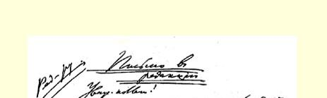
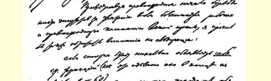
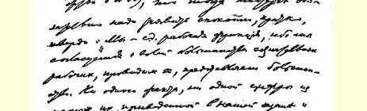
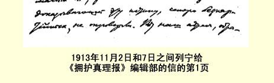

行审查），请求他帮助劝告（适当地从道义上影响）总执行委员会。 这比冒失败的危险过早地提出正式请求要好些。

如果普列汉诺夫给您回信，希望您告诉我。

致社会民主党的敬礼！

### 尼·列宁

克拉科夫 卢博米尔斯基耶戈街５１号 弗拉·乌里扬诺夫

> 发往巴黎译自《列宁全集》俄文第５版载于１９３０年《列宁文集》俄文版第４８卷第２１４—２１５页第１３卷

## ２２８ 致《拥护真理报》编辑部

> （不早于１１月１日）

### 给编辑部的信尊敬的编辑同志：

请允许我们在你们的报纸上刊登一封信，答复人们从遥远的北部、西部、东部和其他一些地区就取消派掀起反对“保险”活动家Ｘ．同志的“运动”向我们提出的询问。

取消派指责他是两面派：既为企业主，又为工人服务。３６０

面对这类指责，**组织**该怎么办呢？

它可以召集从事工人运动的各机构的代表，委托他们调查此事。事实上也正是这样办的。《拥护真理报》第１２号（１０月１７日） 发表了５个机构（１．《真理报》编辑部；２．《启蒙》杂志编辑部；３．波兰马克思主义机关报编辑部；４．国家杜马社会民主党的六人团；５． 五金工会主席）的代表组成的委员会的**调查结论３６１**。

委员会认为：

**—— 取消派的说法“不符合真实情况”**；

**——．已不再为企业主工作**，这就是履行了自己的义务。

前一天（１０月１６日《拥护真理报》第１１号）亚·维提姆斯基也曾详细说明，Ｘ．的“罪过”仅仅在于他辞去了企业主那里的职务转而为工人运动服务。维提姆斯基还补充说，他已经把那些当过***企业主报刊秘书的取消派分子的名字***报告了《拥护真理报》的秘书。

取消派是如何回答的呢？他们根本没有想到对维提姆斯基的声明进行反驳，对Ｘ．辞去企业主那里的职务的事实提出异议。

他们连想也没有想过哪怕成立“***自己的***”一个什么委员会，由 “自己的”七人团，由某个工会或者由拉脱维亚人、犹太人、高加索人的“领导机关”组成。

根本没有这类事！

而忠于组织的人们却成立了委员会，调查了情况，作出了裁决。 《新工人〈？？〉报》中那些同工人组织毫不相干的自由派下流文人还在继续从事极端卑鄙的造谣和诽谤运动！！他们蒙蔽头脑简单或者无知的人，把Ｘ．**还没有辞去**企业主那里的职务时就已**开始**秘密地用笔名撰稿帮助工人们这种表现叫作“两面派行为”！！３６２

显然，对于这些由资产阶级豢养的取消派报纸的卑鄙可耻的匿名诽谤者，工人们只能嗤之以鼻。

但这是不够的，仅仅嗤之以鼻是不够的。妄图**破坏**工人组织的取消派的**惯用**手法是：最无耻地进行人身攻击。

任何一个组织对这种政治“斗争”手法都**不能不**进行**有组织的** 回击。那么，什么才是有组织的回击呢？

每个工人都应当提出要求，要求那些被马克思主义者所唾弃的取消派去成立“自己的”委员会，即由“自己的”七人团、犹太人、 拉脱维亚人、高加索人及***其他人的***“自己的”“领导机关”组成的委员会。让他们“自己”裁决一下并把裁决结果向“国际”报告。那时， 我们将在全世界面前痛斥这些造谣中伤的恶棍们。

而现在，当这些恶棍、卑鄙的家伙还藏身于取消派报纸的匿名文章的后面的时候，应当让**每个工会**委托自己的理事会调查事实真相，从各方面取得一切文件和证据，**审核**由５**个机构**组成的**马克思主义的委员会**的裁决３６３并作出**自己的**决定。

一致谴责诽谤者，一致要求他们：“收回卑鄙的诽谤吧，否则你们休想加入任何一个组织”，—— 这就是工人阶级对那些破坏组织的人的有组织的回答。

### 弗·伊林[^1]

这个原则性的问题应当在杜马中提出。

附言：既然《拥护真理报》会被封闭，那就**无论如何**要把调

> １９１３年１１月２日和７日之间
>
> 列宁给《拥护真理报》编辑部的信的第１页和数字中，７个无党性分子推翻不了任何一个事实和数字。这是我们的地址，请来找我们吧，工人同志们，请不要以为我们抱有一种侮辱你们的想法，把你们看成会相信‘７个代表高于党、高于多数工人的意志’这种论调的人。即便是７７位代表也不能高于这一意志。我们会严格地实现这一意志。”

作这种简短的声明是必需的。然后应该向议会党团领袖会议 （即向国家杜马）提出正式声明**。到那时**，七人团的傲气就会非常迅速地被打掉，他们会很快很快地**同意**平等（书面上他们**全都**承认的平等）。**无论**是他们**还是**别的什么人都***不会有***其他的出路。

一不做，二不休。六人团已经***漂亮地***干起来了，***只要***他们能 ***正确地***坚持下去，胜利***保证是***他们的，—— 再过一两个星期，胜利必然到来。

致崇高的敬礼和良好的祝愿！

### 弗·伊·

> 从克拉科夫发往彼得堡译自《列宁全集》俄文第５版载于１９３２年５月５日《真理报》第４８卷第２１８—２２１页第１２３号

[^1]: 签署该信的还有列·波·加米涅夫和格·叶·季诺维也夫。—— 俄文版编者注