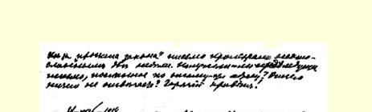
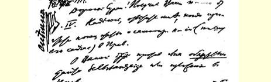
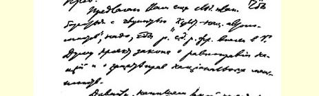
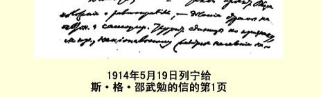

注意我的新地址：波罗宁（加里西亚）。

祝贺俄国出色的五一游行示威，—— 仅彼得堡一地就２５万人！五一出版的《真理之路报》被没收，但是我从《新世界报》获悉’您往往保存有被没收的报纸。总的说来，来自国内的消息证明，革命情绪的高涨不仅表现在工人阶级中。

西玛５月１５日离开克拉科夫（加里西亚***拉布卡***市 卡登医生疗养所）前往克拉科夫和波罗宁之间的某一村庄度夏；她非常高兴找到了住处。

娜·康·向您问好！衷心祝您早日恢复健康，夏天休息好！

### 您的弗·伊·

附言：不久前从乌拉尔获得那里组织的消息，事情进行得很不坏。居然安然无怎，而且正在壮大！

> 发往纽约译自《列宁全集》俄文第５版载于１９３０年《列宁文集》俄文版第４８卷第２８７页第１３卷

## ３２１ 致维·阿·卡尔宾斯基

１９１４年５月１９日

亲爱的朋友：我对您有个请求：不知您的藏书中有没有鲁巴

> １９１４年５月１９日列宁给斯·格·邵武勉的信的第１页