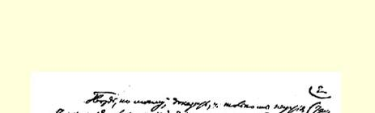
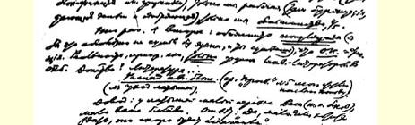
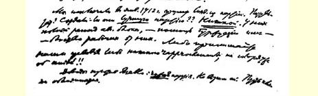
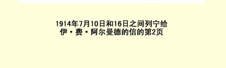

## ３４１ 致伊·费·阿尔曼德

> （７月１０日和１６日之间）

我亲爱的朋友：上封信投寄得太匆忙，现在可以较从容地来谈谈我们的“事情”了。

想必你已把报告弄明白了吧？最重要的是—— 条件，１—１３ （后面的１４，即针对诬蔑的那条是次要的），必须突出地提出来。

注意：关于１９１４年４月４日游行示威这一节要补充到***报告中*** 关于**关闭**取消派报纸的问题中去。关于普列汉诺夫的“统一”这一节则要补充到报告中关于**国外集团**的问题中去。

我相信你是这样一种人：一旦独自担当领导工作，就会显示出自己的才能，变得勇敢坚强，—— 因此我完全***不信***那些悲观主义者，即那些说你……未必……的人。胡说八道！我不信！你会干得很出色！你会用流利的语言把他们痛斥一顿，而不容王德威尔得大叫大喊，打断你的话。（如果碰上这种情况，就向**整个**执行委员会提出正式抗议，以退出会场相威胁＋提出整个代表团的书面抗议。）

报告他们不能不让你宣读。你说，你要求宣读报告，你有明确的实际的**建议**要提出。还有什么比这更实事求是的呢？我们有我们的建议，你们有你们的建议，到时候会见分晓。要么我们大家接受共同的东西，要么让我们各自向自己的代表大会报告，***我*** **·** **们*要向自己的党代表大会报告***。**（很明显**，**其实我们*根本什么***也不会接受。）

据我看，最主要的是，证明只有我们才是一个政党（那边是一个空架子联盟或一些小集团），只有我们是工人政党（那边是出钱和捧场的资产阶级），只有我们是**多数**，占４５。

这是一点。其次，***较通俗地***阐明（这一点我因语言关系绝对办不到，而你能够）**组织委员会**＝空架子。空架子掩盖着的实在的东西，***只不过***是圣彼得堡的取消派著作家小组。证据吗？书刊 ……

**八月联盟的瓦解**。（参看《启蒙》杂志第５期，我这（注意： 拉脱维亚人的退出。）就把我的文章[^1]寄给波波夫。）

论据：在拉脱维亚人那里你们的（即布尔什维克的）优势并不大，你们这个多数并不多。回答：“确实不多。等着吧，这个多数很快就会成为压倒多数。”

我们在１９１２年１月就把取消派从党内开除出去了。结果呢？ 他们是否建立了**更好的**党呢？？***什么也没有***。他们的八月联盟完全瓦解了，—— 资产阶级帮助了他们，工人离开了他们。要么接受我们的条件，要么决不接近，至于统一，那就更不必提了！！

反对亚格洛的论据：***异***党。我们不信任这样的党。让波兰人去联合好了。

反对罗莎·卢森堡的论据：**实际存在的*不是她的***那个党，而是“反对派”。证据：华沙选出的***复选人***中有３**·个**是工人选民团选出的：**扎列夫斯基**、**布罗诺夫斯基**和亚格洛。***前*２·个**都是反对派。

> １９１４年７月１０日和１６日之间
>
> 列宁给伊·费·阿尔曼德的信的第２页 （如果罗莎避开这点，就逼她谈。如果她否认，就要求记录在案， 并表示我们肯定要***揭穿***罗莎·卢·的***谎言***。）这样一来，华沙选出的**所有社会民主党**复选人＝反对派（第四届杜马选举）。而波兰的其余地方呢？***不知道***！！请你们拿出复选人的***名单***来！！

考茨基反对罗莎而支持反对派的那封信４８８曾登在《真理报》 上。我现在把这一号寄给波波夫。可以***引用***。

总之，我觉得写给你的“最详细的情形”（象你所要求的）与其说太少，不如说**太**多了。

不管遇上什么情况，你们三人总是能够找到理由、论据和事实的，而且你们随时都有权单独磋商—— 指定代表团的发言人，等等。

组织委员会和崩得将厚颜无耻地**撒谎**： “……他们也有地下组织。八月代表会议已经承认”……

撒谎！国外书刊。报纸？

拉脱维亚人的退出？他们的裁决？

**摘引《我们的曙光》杂志和《光线报》的反对地下组织的话**！**！** （说这些话“说得不妥”？？撒谎！说这些话是***底下人***数很少的**一小撮**取消派工人说的，那这就是惊人的瓦解组织的现象。）

或者：你们也没有地下组织

那么，是发行量达４万份的《真理报》在空喊所谓地下组织？或者是工人甘愿受骗？？

> 而１９１３年夏季会议及其***决议***是：让六人团代表发言。 结果６７２２票赞成我们，２９８５票反对。占多数，７０％！！

要着重***强调***工会和保险基金会：这会大大影响欧洲人。我们不容许取消派破坏我们在工会和保险基金会里牢固的多数！！

我把钱的问题忘了。邮资、**电报费**（请多发电报）和火车费、 旅馆费等等由我们付。请记住！

如果可能的话，请你尽可能在星期三晚上抵达布鲁塞尔，以便进行安排，***使***代表团***作好准备***，统一步调等等。

如果你能排上第一个宣读报告，讲上一两小时，这就差不多了。底下只要“一一踢开”，把“他们的”反建议（对所有１４个问题的）引出来，然后说：***不同意***，我们要把这些提交给自己的党代表大会。（他们的建议我们一条也不接受。）

### 忠实于你的弗·伊·

如果谈到保管人掌管的钱的问题，可以推说已有１９１２年１月的决议[^2]，多了不谈。就说，我们决不放弃自己的权利！！

我这就把普列汉诺夫关于**取消派**的文章４８９（《真理报》上的） 寄给波波夫。引用上面的话，并说明《真理报》也坚持***那个***意见。

> 写于波罗宁译自《列宁全集》俄文第５版载于１９５０年《列宁全集》俄文第４版第４８卷第３０７—３１２页第３５卷

[^1]: 见《列宁全集》第２版第２５卷第１９４—２１６页。—— 编者注

[^2]: 见《列宁全集》第２版第２１卷第１６１—１６２页。—— 编者注