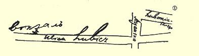

附言：**等候**关于《半年总结》的文章[^1]的回音。

能否把《涅瓦明星报》第１７号上的《统一还是分裂》一文 （哪怕从报上剪下）寄给我？又及。

> 从克拉科夫发往彼得堡译自《列宁全集》俄文第５版载于１９５０年《列宁全集》俄文第４８卷第８１—８３页第４版第３５卷

## ８０ 致列·波·加米涅夫

> （８月２３日或２４日） 亲爱的列·波·：

现将维拉的信给您寄去。您从信中可以看到，为什么我们决定为开姆尼茨***刊印***给德国人的答复，并在莱比锡刊印。１５５就是说， 巴黎的工作应当停下来。但愿这工作尚未开始，停下来不会有很大的困难。

您**务必**要提早一**两天**到达开姆尼茨。１５６我们将把**《工人报》**的委托书交给这里的一个布尔什维克，他将从扎科帕内动身。他会说德语。

您在开姆尼茨面临的战斗将是严峻的。

 见图

从９月２日起我们将更换住所。新的地址是：卢博米尔斯基耶戈街４７号二楼左边。（格里戈里住在同一条街的３５号）。

请来信告知，９月１２日或１３日您是否一定在开姆尼茨。给德国人的答复看来只好给您寄到开姆尼茨，以您的名字留局待领了。

握手！

### 您的列宁 **《人民报》**（布鲁塞尔的）刊登了一条引自《***俄罗斯言论报***》１５７ 的消息：***在维也纳***（原文如此！）不久将召开一个社会民主党各组织＋崩得＋拉脱维亚人＋波兰人等等的代表会议！！！

请到巴黎小组去一两次，给他们作一个专题报告。否则他们**磨磨蹭蹭**，**步调不一致……              **

附言：如果有取消派代表会议的通报出来，请用**特快件**寄来。

> 从克拉科夫发往巴黎译自《列宁全集》俄文第５版
>
> 第４８卷第８５—８６页

[^1]: 见《列宁全集》第２版第２１卷第４０９—４２５页。—— 编者注

[^x]: 图中文字从左至右为：车站、卢比奇街、阿里安斯卡、卢博米尔斯基耶戈。—— 编者注