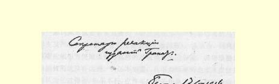
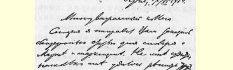
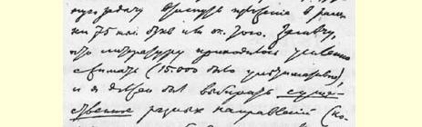
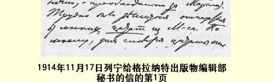

我表示祝贺！再一次衷心地感谢您为报纸付出的劳动！我们即将考虑下一号的出版问题。头一号销售情况很好。（您那篇关于瑞士选举的文章，我**担心性质**不适合，已交同事讨论。）日内寄上拉绍德封出版的《哨兵报》第２６５号（１９１４年１１月１３日）。上面摘要刊登了中央机关报上的宣言。要是日内瓦的报纸也登就好了！！

娜捷施达·康斯坦丁诺夫娜和在此地的全体朋友向您致以崇高的敬礼。

### 您的弗·乌·

> 从伯尔尼发往日内瓦  译自《列宁全集》俄文第５版载于１９２９年《列宁文集》俄文版  第４９卷第２８—３１页第１１卷

## ２５ 致格拉纳特出版物编辑部秘书

１９１４年１１月１７日于伯尔尼尊敬的同事：

今天按挂号印刷品寄上为词典撰写的那个关于马克思和马克思主义的词条。把词条限制在７５０００个字母左右这样一个难题， 我已经完成，至于完成得怎样，那就不能由我来评定了。我要说的是，由于不得不大大压缩参考书目（顶多１５０００个字母），所以我必须选择各派的（当然是以**赞成**马克思的为主）**最重要的东**

> １９１４年１１月１７日列宁给格拉纳特出版物编辑部秘书的信的第１页 **西**。对于引用的马克思的许多**话**，实在难以割舍。在我看来，引文对一部词典来说是非常重要的（特别是在那些争论最厉害的马克思主义问题方面，其中首先是哲学和土地问题）。我认为，词典的读者应能很方便地读到马克思的**所有**最重要的言论，否则编纂词典的目的就没有达到。我还不知道，从书报检查的角度来说您是否认为还过得去，如果不行，也许可以对某些地方按书报检查的要求进行**修改**。从我这方面说，如果没有编辑部的坚决要求，是不敢按书报检查的要求来“修改”引文和马克思主义的原理的。

希望接到词条后能立即通知我，哪怕用明信片也好。我应得的稿费，务请尽快按以下地址寄出：**彼得格勒**希腊大街１７号１８室马尔克·季莫费耶维奇·**叶利扎罗夫**先生（战争时期寄钱到我这里会因兑换造成太大损失，对于我也很不方便）。

我愿为您效劳！

### 弗·伊林

附言：由于战争，我的藏书搁在加里西亚了４７，所以我无法找到马克思著作俄译本的某些引文。如果您认为这有**必要**，那是否托人在莫斯科找一下？我看这是不必要的。另外，假如您认为有可能把词条的校样寄给我，并告诉我能否在校样上作**部分**修改，那我将非常高兴。如果校样不能寄来，希望能把清样寄来。

我的地址：伯尔尼 迪斯泰尔路１１号 弗拉·乌里扬诺夫。

> 发往莫斯科  译自《列宁全集》俄文第５版载于１９２３年《无产阶级革命》杂志  第４９卷第３１—３２页第６—７期合刊