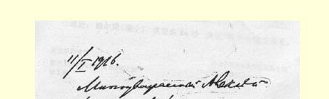
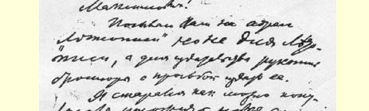
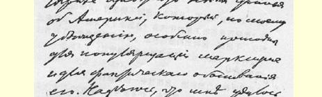
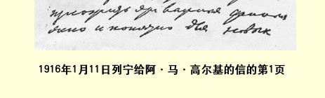

# １９１６年 １７９ 致阿·马·高尔基

１９１６年１月１１日

尊敬的阿列克谢·马克西莫维奇：

我把一本小册子的手稿给您寄到《年鉴》杂志，但不是给《年鉴》杂志用的，而是给出版社的，希望予以出版。２４６

关于美国的新材料，我尽可能解释得通俗一些，我相信，这些材料对于普及马克思主义并用事实加以论证特别有帮助。我想我已经把这些重要材料给俄国那些日益增多的、渴望了解世界经济进展的新读者叙述得明白易懂了。

可能的话，我还打算继续写下去，然后出版第二编—— 论德国。

目前我正在着手写论帝国主义的小册子２４７。

由于是战争时期，我急需稿酬。所以，如果有可能而又不使您过于为难的话，希望这本小册子早日出版。

### 尊敬您的弗·伊林

> １９１６年１月１１日列宁给阿·马·高尔基的信的第１页