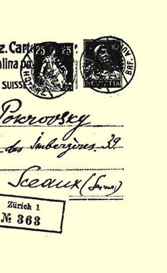
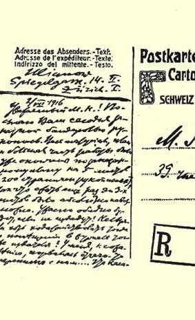

从例如黑尔滕斯泰恩或其他地点）一封挂号信，并附上一个贴有回信邮票的信封。在信中询问，要取道德国去哥本哈根，过两三个月后经原路返回，**是否向慕尼黑**申请批准。（理由是：（１）有心脏病； （２）侨民，无正式俄国证件；（３）目的是去看孩子）。我考虑，也可用法文写（寄到苏黎世去），***就是从伯尔尼寄也要这样***，他们会答复的。

致友好的问候！

您的 列宁

> 译自《列宁文集》俄文版第３７卷
>
> 第５２页

## ２６６ 致米·尼·波克罗夫斯基

１９１６年７月２日

尊敬的米·尼·：今天把手稿３８８按挂号印刷品寄给您。全部材料—— 提纲和著作的大部分已经写好，是按约稿计划写成５印张 （２００页手稿）的，所以再要压缩到３印张是绝对不可能的了。要是不给出版，那简直太遗憾了！到那时能否请求就在这个出版者的杂志３８９上发表？可惜，不知怎么我和他的通信联系断了……至于作者的署名，当然，我想还是用我常用的笔名好些。假使不合适，就请换个新的：尼·列尼夫岑。或者随便您另取一个名字也可以。至于注释，请您千万保留；您从注１０１３９０中可以看出它们对我极为重要； 而且要知道，国内还有大学生等等也要阅读，指出参考书目对他们是必需的。我特意采取了最经济（指版面、**纸张**而言）的方式。７页手稿用小号铅字排印也不过２页。恳请您保留附注，或向出版者请求把它们保留下来。关于书名：如果觉得现在的不大妥当，如果认为最好避免用帝国主义这个字眼，那就用：《现代资本主义的基本特点》。（《通俗的论述》这一副标题绝对必要，因为许多重要材料就是按照作品的这种性质来阐述的。）第１页是目录，其中有些章节的标题，从严格的限制来看也许不十分妥当，现在寄上给您看看， 就留在您那儿，别再寄给别人，如果这样更妥当更安全的话。总之， 如果这一篇文章和其他文章都能在这位出版者的杂志上发表，那是非常惬意的事。要是您认为没有什么不妥之处，请写封短信把这个想法告诉他们，我将不胜感激。握手并致崇高的敬礼！

### 您的弗·乌里扬诺夫

附言：我尽了最大力量使文章符合“严格的限制”；而这对我来说是极困难的，我觉得，缺点因而会很多。可是也没有什么办法！

> 从苏黎世发往索城（法国塞纳）  译自《列宁全集》俄文第５版载于１９３２年《列宁全集》俄文第２版第４９卷第２５６—２５９页第２９卷

> １９１６年７月２日列宁给米·尼·波克罗夫斯基的信