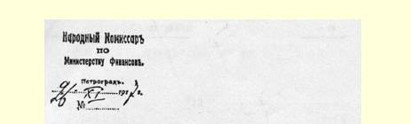
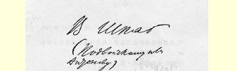
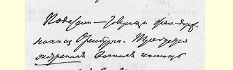
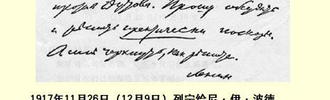
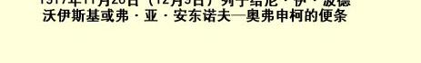

托夫。请从速讨论并作出**切实可行的**决定。如何决定，盼简告。

### 列宁

> 载于１９２７年２月２３日《真理报》译自《列宁全集》俄文第５版第４４号第５０卷第１０页

## ２１ 给作战集团军的电报

> （１１月２６日〔１２月９〕）

作战集团军

第２１步兵军所属各师编外

部队委员会主席谢缅尼克

土地连同耕畜和农具一并移交土地委员会。这是人民的财产， 应严加保护。１６

### 列宁

> 载于１９５９年《列宁文集》俄文版译自《列宁全集》俄文第５版第３６卷第５０卷第１０页

> １９１７年１１月２６日（１２月９日）列宁给
>
> 尼·伊·波德沃伊斯基或弗·亚·安东诺夫—奥弗申柯的便条