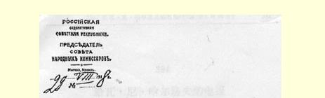
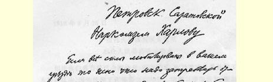
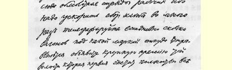
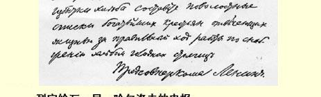

件事上行动不力或玩忽职守，那将是不可饶恕的。

敬礼！

### 列宁

> 载于１９２７年１月２１日《红色日报》译自《列宁全集》俄文第５版第１７号第５０卷第１７２页

## ３９３ 致尼·伊·穆拉洛夫

１９１８年８月２９日穆拉洛夫同志：

来人马雷舍夫同志是为前往科特拉斯的小组筹措爆炸物品的，请予协助。２５９**此事十分紧急**。

应**抓紧时间**从维亚济马搞到爆破器材（就在***今天***，由马雷舍夫持您出具的提货单去维亚济马）。

同时应向库尔斯克发电报，调爆破教官**索博列夫**同志前来。

爆破小组需要一节车厢（快车），到科特拉斯去。

### 人民委员会主席列宁

> 载于１９２６年《政治工作人员指南》译自《列宁全集》俄文第５版杂志第１５期（总第４５期）第５０卷第１７５页

> １９１８年８月２９日列宁给瓦·尼·哈尔洛夫的电报