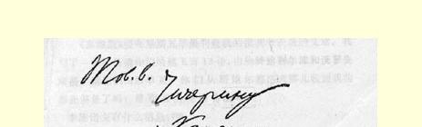
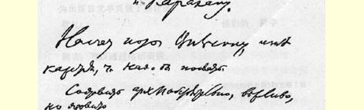
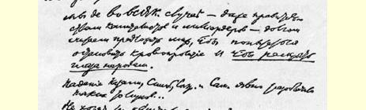
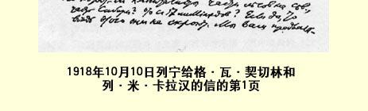

## ４１８ 致格·瓦·契切林和列·米·卡拉汉

> （１０月１０日）

致契切林和卡拉汉同志

给威尔逊的照会，我看应当发。

要写得非常周详、客气，但要辛辣。

就说，我们认为在任何情况下—— 甚至对资本家和亿万富翁的政府—— 都有义务提议媾和，以便设法停止流血，并且也为了**擦亮各国人民的眼睛**。

喀山、辛比尔斯克、塞兹兰和萨马拉的陷落显然揭露了这样一些说谎者……

资本家们不想要北方的一些森林吗？不想要西伯利亚的一部分吗？不想要１７０亿的利息吗？２７８如果想要，那他们是不会隐瞒的。 我们请你们直说：**要多少**？关于布列斯特和约—— 德国将同意撤军。究竟怎么回事？你们不想用**自己的军队**去代替德国军队吗？

**如此等等**。

我建议马上草拟出这样的照会来，我们可以共同加以讨论。２７９

> １９１８年１０月１０日列宁给格·瓦·契切林和
>
> 列·米·卡拉汉的信的第１页

《真理报》要在星期五早晨刊登我的批判考茨基的文章。我写了一张便条请你们给越飞寄１２份，由他**转给别尔津和沃罗夫斯基**，请他们出版单页，你们从斯维尔德洛夫那儿收到我的那张便条了吗？星期五当晚能寄出吗？

李维诺夫有什么消息？２８０

为出版***日文***单页做了些什么？

敬礼！你们的 **列宁**

附言：**可以**通过电话商谈。

> 译自《列宁全集》俄文第５版
>
> 第５０卷第１８８—１９１页