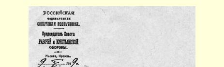
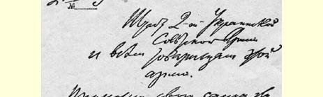
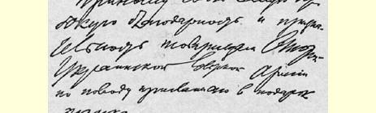
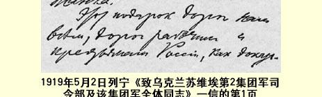

只是**不要松劲**！

> 译自《列宁文集》俄文版第３７卷
>
> 第１１２页

## ６８９ 致乌克兰苏维埃第２集团军司令部及该集团军全体同志

１９１９年５月２日

谨向乌克兰苏维埃第２集团军的同志们表示最深切的谢意， 谢谢你们送来的坦克。５１４

这件礼物对我们大家都很珍贵，对俄罗斯的工人和农民都很珍贵，因为它是乌克兰兄弟的英雄业绩的见证；它所以珍贵，还因为它证明了貌似强大的协约国的彻底崩溃。

向乌克兰工人和农民以及乌克兰红军致以崇高的敬礼，最热烈地祝愿他们取得胜利！

国防委员会主席

### 弗·乌里扬诺夫（列宁）

> 载于１９２６年《军事通报》杂志译自《列宁全集》俄文第５版第３期第５０卷第２９７—２９８页

> １９１９年５月２日列宁《致乌克兰苏维埃第２集团军司令部及
>
> 该集团军全体同志》一信的第１页