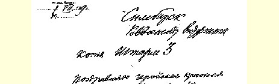
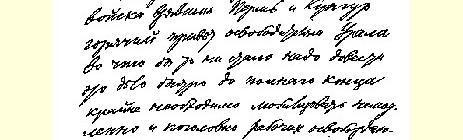
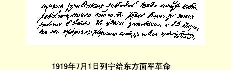

完全同意１。

### 列宁

译自《列宁文集》俄文版第３７卷

第１６０—１６１页

## ２ 给东方面军革命军事委员会的电报

１９１９年７月１日

辛比尔斯克

东方面军革命军事委员会

抄送：第３集团军司令部

我向攻克彼尔姆和昆古尔的英雄红军祝贺。向乌拉尔的解放者表示十分诚挚的敬意。无论如何要把这一事业迅速进行到底。亟需把新解放的乌拉尔各工厂的工人马上全部动员起来。要用新的革命的方法立即把这些工人编入军队，以便调往南方，让疲劳的部队得以休整。请把电报前一部分通知各团。

### 国防委员会主席列宁

> 载于１９２７年１月２１日《真理报》  译自《列宁全集》俄文第５版第１７号和《消息报》第１７号  第５１卷第３页

> １９１９年７月１日列宁给
>
> 东方面军革命军事委员会的电报的手稿