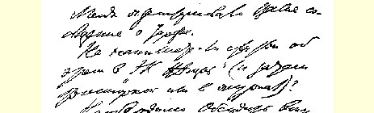
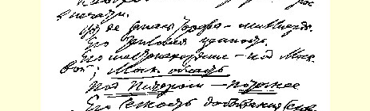
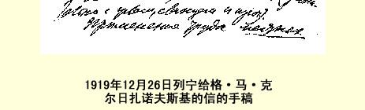

## ２０７ 致格·马·克尔日扎诺夫斯基

> （１２月２６日） 格列勃·马克西米利安内奇：

您谈的关于泥炭的情况我很感兴趣。

可否就这个问题给《经济生活报》写一篇文章（以后再印成小册子或在杂志上发表）？１３１

必须把问题拿到报刊上来讨论。

据说，泥炭储量有几十亿。

泥炭的热价值。

泥炭的蕴藏地—— 莫斯科近郊；**莫斯科区域**。

***彼得格勒近郊*——*要更确切些***。

泥炭容易开采（同煤、页岩等比较）。

可用**当地**工人和农民的劳动（**最初每昼夜４小时也好**）。

据说，这就是在**现有**发电厂的条件下可以把电力增加***多少倍*** 的基础。

据说，这就是恢复工业；

—— 按社会主义原则组织劳动（农业＋工业）；

—— 摆脱燃料危机（可节省几百万立方米的木柴用于运输业） 的***见效最快***和***最可靠的***基础。

请把您的报告的***结论***写出来；—— 附上一张泥炭分布图；——

> １９１９年１２月２６日列宁给
>
> 格·马·克尔日扎诺夫斯基的信的手稿