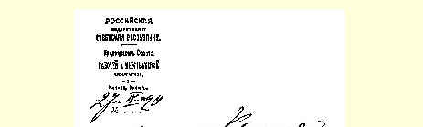
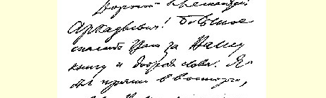
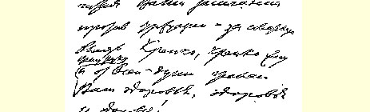
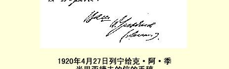

## ３７８ 给西伯利亚革命委员会的电报

> （４月２６日）

鄂木斯克

西伯利亚革命委员会

有人请求我撤销中央出版物发行处托木斯克分处不许翻印我的关于个人管理制的发言２５２的禁令。请调查并电复。

### 列宁

> 译自《列宁文集》俄文版第３８卷
>
> 第３１０页

## ３７９ 致克·阿·季米里亚捷夫

１９２０年４月２７日

亲爱的克利缅特·阿尔卡季耶维奇：非常感谢您的赠书和美好的题词。２５３读到您的反对资产阶级和拥护苏维埃政权的话，我不

> １９２０年４月２７日列宁给
>
> 克·阿·季米里亚捷夫的信的手稿