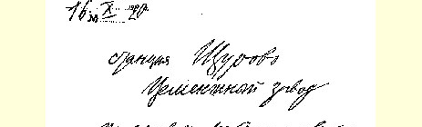
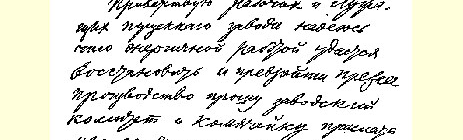
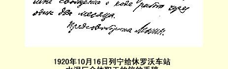

## ６５９ 致休罗沃车站水泥厂全体职工

１９２０年１０月１６日

休罗沃车站

水泥厂

值此工厂开工之际，我向全体职工表示祝贺。我希望，你们通过顽强的劳动能够恢复并超过以前的生产水平。请工厂委员会和党支部过一两个月后向我报告工作情况。

### 国防委员会主席列宁

> 载于１９４２年《列宁文集》俄文版  译自《列宁全集》俄文第５版第３４卷第５１卷第３０４页

> １９２０年１０月１６日列宁给
>
> 休罗沃车站水泥厂全体职工的信的手稿