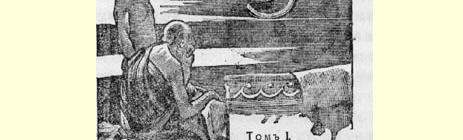
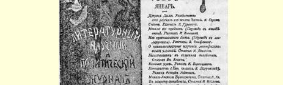
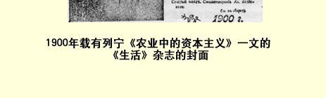

# 农业中的资本主义

> （论考茨基的著作和布尔加柯夫先生的文章）２１
>
> （１８９９年４月４日〔１６日〕和５月９日〔２１日〕之间）

# 第一篇文章 《开端》第１—２期合刊（第２部分第１—２１页）载有谢·布尔加柯夫先生批评考茨基的关于土地问题著作的文章，标题是《论农业资本主义演进的问题》。布尔加柯夫先生非常公正地指出，“考茨基这本书体现了一个完整的世界观”，具有巨大的理论意义和实践意义。这大概是关于土地问题的第一部有系统的科学研究著作。这个问题在所有国家甚至在观点一致和自称为马克思主义者的著作家中间，也引起过激烈的争论，并且今后还会继续争论。布尔加柯夫先生“只是作些否定的批评”，只对“考茨基这本书的个别论点” 加以批评（他“简略地”向《开端》的读者介绍了这本书，下面我们将看到，他的介绍太简略了，而且极不确切）。布尔加柯夫先生准备 “日后”“对农业资本主义演进的问题作一番系统的论述”，从而“也提出一个完整的世界观”来同考茨基抗衡。

我们毫不怀疑，考茨基这本书在俄国的马克思主义者中间也会引起不少争论，在俄国也会有一些马克思主义者反对考茨基，另一些马克思主义者赞成考茨基。但是起码笔者坚决不同意布尔加柯夫先生的意见，坚决不同意他对考茨基这本书的评价。这个评价尖酸刻薄，在思想相近的著作家的论战中使用这种不寻常的口吻， 实在令人惊异，尽管布尔加柯夫先生承认《土地问题》是“一本出色的著作”。下面就是布尔加柯夫先生这类用语的几个例子：“极端肤浅”……“既无真正的农艺学，也无真正的经济学”……“考茨基用 **空话**来回避严肃的科学问题”（黑体是布尔加柯夫先生用的！！）等等，等等。那就让我们好好研讨一下这位严厉的批评家的这些评语，同时并借此向读者介绍一下考茨基的这本书。

# 一

布尔加柯夫先生在批考茨基之前，先捎了一下马克思。自然， 布尔加柯夫先生着重指出了这位伟大的经济学家的丰功伟绩。但是他说，马克思的著作中“有一部分”甚至是“被历史完全推翻了的 ……错误观念”。“例如，其中有这样一个观念：在农业中正象在加工工业中那样，可变资本同不变资本相比是在减少，因此农业资本的有机构成在不断提高。”这里是谁错了，是马克思，还是布尔加柯夫先生？布尔加柯夫先生指的是，农业技术的进步和经营集约化程度的提高，往往使耕种同一块土地所需的劳动量**增多**。这是毫无问题的，可是，据此还远远不能否定**在**可变资本和不变资本的**比例上** 可变资本**相对**减少的理论。马克思的理论只是确定，Ｖ

Ｃ（ｖ＝可变资本，ｃ＝不变资本）这个比值一般地说有下降的趋势，即使ｖ在单位面积上是在不断增加，但是如果在同一时期ｃ增加得更快—— 这

> １９００年载有列宁《农业中的资本主义》
>
> 一文的《生活》杂志的封面
>
> （按原版缩小） 难道可以推翻马克思的理论吗？各资本主义国家的农业中，总的说来ｖ在减少，ｃ在增加。德国、法国和英国的农村人口和农村工人都日渐减少，可是农业中使用的机器却在增加。例如，在德国，从 １８８２年到１８９５年，农村人口从１９２０万减少到１８５０万（农村雇佣工人从５９０万减少到５６０万），而农业中使用的机器却从４５８３６９ 台增加到９１３３９１台[^1]；农业中使用的蒸汽机从２７３１台（１８７９年） 增加到１２８５６台（１８９７年）；蒸汽马力增加得更多。牛羊从１５８０万头增加到１７５０万头，猪从９２０万头增加到１２２０万头（１８８３年和 １８９２年）。在法国，农村人口从１８８２年的６９０万（“独立农民”）减少到１８９２年的６６０万，而农业机器的数量增长情况是：１８６２年 ——１３２７８４；１８８２年——２７８８９６；１８９２年——３５５７９５。牛羊：１２００ 万——１３００万——１３７０万；马：２９１万——２８４万——２７９万（从 １８８２年到１８９２年马匹的减少比农村人口的减少要少得多）。可见，就现代各个资本主义国家的情况来看，总的来说历史**证明了**马克思的规律是适用于农业的，并没有被推翻。布尔加柯夫先生的错误在于没有深入研究农业中个别事实的意义，就急于把这些事实归结为**总的**经济规律。我们强调“总的”一词，是因为无论马克思还是他的学生，始终认为这个规律是资本主义总趋势的规律，而决不是一切个别情况的规律。就是在工业方面，马克思本人也曾指出： 技术改革时期（这时Ｖ

Ｃ的比值下降）总是转化为在这种技术基础上进步的时期（这时Ｖ

Ｃ的比值不变，在个别情况下还可能增大）。我们知道，在资本主义国家的工业史上，有时候这一规律对于许多工业部门都不适用。例如，当大的资本主义作坊（有人不恰当地叫它工厂）瓦解而让位给资本主义家庭劳动的时候，情况就是如此。至于谈到农业，毫无疑问，它的资本主义的发展过程要复杂得多，并且形式也会多样化。

我们现在来谈考茨基。考茨基这本书的开头对封建时期农业的概述，据说是“写得很肤浅，而且是多余的”。这个判断的动机是什么很难理解。我们相信，如果布尔加柯夫先生能够实现自己的计划，系统地论述农业资本主义演进的问题，那么他必须描述一下**资本主义前**农业经济的基本特征。否则就不可能了解**资本主义**经济的性质以及把资本主义经济和封建经济联系起来的那些过渡形式的性质。布尔加柯夫先生本人也承认，“农业的资本主义发展**初期** 〈黑体是布尔加柯夫先生用的〉的那种形式”具有巨大的意义。而考茨基正是从欧洲农业的“资本主义发展初期”开始的。我们认为考茨基对封建农业的概述写得很精采：写得清晰、明确，善于抓住主流和本质，而不为枝节问题所干扰；这正是作者所固有的特色。考茨基首先在绪论中极其确切和正确地提出了问题。他非常肯定地说：“毫无疑问，—— 我们认为这是本来就证实了的—— 农业不是按照工业的模式发展的，它有自己的特殊规律。”（第５—６页）我们的任务是“研究资本是否掌握了农业，是怎样掌握的，怎样改造它， 怎样使旧的生产形式和所有制形式不再适用，而使新的形式成为必然”（第６页）。这样而且只有这样提出问题，才能对“资本主义社会农业的发展”（考茨基这本书的第一部分即理论部分的标题）作出令人满意的阐述。

在“资本主义发展”的初期，农业掌握在通常是受封建的社会经济制度制约的**农民**手中。于是考茨基首先说明农民经济的**结构**， 农业与家庭工业的结合，接着就谈到使小资产阶级和保守派著作家（如西斯蒙第）的天堂瓦解的因素，高利贷的作用，谈到“阶级对抗”逐渐“渗入农村，渗入农户内部，破坏了原来的协调一致和共同的利益”（１３页）。这个过程早在中世纪就已开始，但到现在还没有最后完成。我们着重指出这一段话，因为这段话一下子就表明了， 布尔加柯夫先生硬说考茨基甚至没有提出谁是农业技术进步的体现者这个问题，是完全不对的。考茨基十分肯定地提出了这个问题，并且作了阐明，凡是仔细读过他这本书的人都会理解这个往往为民粹派、农学家以及其他许多人所忘记的真理，即现代农业技术进步的体现者是大小**农村资产阶级**，大的农村资产阶级（正如考茨基所指出）在这方面比小的农村资产阶级起着更重要的作用。

# 二

第３章叙述了封建农业的基本特征：最保守的耕作制度三圃制占统治地位；拥有大量领地的贵族压迫和剥夺农民；贵族建立封建－资本主义农场；１７世纪和１８世纪时农民成了挨饿的穷人 （Ｈｕｎ－ｇｅｒｌｅｉｄｅｒ）；资产阶级农民（Ｇｒｏｓｓｂａｕｅｒｎ，他们非雇用雇农和日工不可）兴起，农村关系和土地所有制的旧形式对他们已不适用；在工业中和城市中发展起来的资产阶级的力量破除了这些形式，为“资本主义的集约化农业”（第２６页）扫清了道路，—— 考茨基在说明了这一切以后，就进而分析“现代（ｍｏｄｅｒｎｅ）农业”（第４ 章）的特征。

这一章对于资本主义在农业中进行的大革命作了非常确切、 扼要、清楚的概括。资本主义把贫穷困苦、愚昧无知的农民的因循守旧的手工劳动，变成科学地运用农艺学，打破了长期以来农业的停滞状态，推动了（并且继续推动着）社会劳动生产力的迅速发展。 三圃制被轮作制代替了，牲畜的饲养与土地的耕种改进了，收成增加了，农业的专业化和农场间的分工大大发展了。资本主义前的单一形式因各农业部门技术进步而被日益发展的多样形式所代替。 在农业中使用机器和蒸汽已经开始，并且迅速地发展起来；电力也开始使用了，正如专家们指出的，在这个生产部门电力会比蒸汽起更大的作用。修建专用道路，改良土壤，按照植物生理学的资料使用人造肥料等等，都有了发展；细菌学已经开始应用于农业。布尔加柯夫先生认为考茨基“没有同时对这些材料[^2]作**经济**分析”，这个意见是完全没有根据的。考茨基确切地指出了这种变革与**市场** 发展（特别是与城市发展）的联系，与农业服从于**竞争**的联系，这种竞争**迫使**农业实行改革和专业化。“这种由城市资本引起的变革， 日益加强农户对于市场的依赖性，此外还不断地改变对于农户最为重要的市场条件。一个生产部门，当附近市场与世界市场仅仅靠公路联系的时候，是赚钱的，但是这个地方一旦通了铁路，就变得无利可图了，并且必然会被其他生产部门所代替。例如，要是铁路运来了较便宜的谷物，那么谷物的生产就无利可图，但是同时却为牛奶的销售创造了条件。商品流通的增长，使新的作物良种有可能引进国内”等等（第３７—３８页）。考茨基说：“在封建时代，除了小农业以外，再没有其他农业了，因为地主也是用和农民一样的农具来耕种自己的土地。资本主义首先使农业有可能实行在技术上比小生产更为合理的大生产。”在谈到农业机器时，考茨基（附带说一下，他确切地指出了农业在这方面的特点）阐明了使用农业机器的 **资本主义性质**，机器对工人的影响，作为进步因素的机器的意义， 以及限制使用农业机器的种种方案的“反动的空想性”。“农业机器将继续发挥它的改造作用：把农村工人赶入城市，这样，它就成了一种强大的工具，一方面使农村的工资提高，另一方面使机器在农业上的应用得到进一步的发展。”（第４１页）这里再补充一句，考茨基还专门用几章详细地说明了现代农业的资本主义性质，大生产同小生产的关系，农民的无产阶级化。布尔加柯夫先生说，考茨基 “没有提到为什么这些奇迹般的变化是必然的”。我们认为，这样说完全是错误的。

在第５章（《现代农业的资本主义性质》）里，考茨基说明了马克思关于价值、利润和地租的理论。考茨基说：“没有货币，现代农业生产就不能进行，这也就是说，**没有资本**，现代农业生产就不能进行。事实上，在现代生产方式下，任何数量不用于个人消费的货币都可以转化为资本，即转化为产生剩余价值的价值，而且通常也确实是转化为资本。因此现代农业生产就是资本主义的生产。”（第 ５６页）顺便说一下，这一段话还使我们有可能评价布尔加柯夫先生下面的话：“我用这个术语（资本主义农业）是就一般的意义而言 （考茨基也是在这种意义上使用这个术语的），即指农业中的大经济。事实上〈原文如此！〉**在整个**国民经济按资本主义方式组织的情况下，就不会有**非**资本主义农业，**整个**农业都取决于组织生产的一般条件，并且只能在生产范围方面来划分大的、企业性的农业和小农业。因此，为了清楚起见，这里需要用一个新的术语。”这样一来， 岂不是布尔加柯夫先生**纠正了**考茨基……“事实上”，正如读者所看到的，考茨基**根本没有**象布尔加柯夫先生那样，在“一般的”、不确切的意义上**使用**“资本主义农业”这个术语。考茨基很清楚地知道，并且非常明确地说：在资本主义生产方式下，一切农业生产“通常”都是资本主义的生产。这个意见的根据是一个简单的事实，即现代农业需要货币，而在现代社会中，不用于个人消费的货币都会成为资本。在我们看来，这比布尔加柯夫先生的“纠正”要稍微清楚些，而且考茨基还充分证明不用“新的术语”也行。考茨基在第５章里明确地说：在英国已经得到充分发展的租佃制，以及在欧洲大陆正在飞速发展的抵押制，实质上都体现了同一个过程，即**农户与土地分离的过程**[^3]。在资本主义的租佃制下，这种分离是非常明显的。在抵押制下，这种分离“不那样明显，也不那样简单，但本质上是一回事”（第８６页）。实际上，土地的抵押显然是地租的抵押或出卖。因此，在抵押制下也同在租佃制下一样，地租的获得者（＝土地占有者）是同企业利润的获得者（＝农户、农村企业主）分离的。布尔加柯夫先生“根本没有弄清考茨基这个论断的意义”。“恐怕还不能认为，抵押制表明土地与农户分离这一点已经得到证明。”“第一，不能证明抵押借款收回了**全部**地租，这只能是一种例外……” 我们的回答如下：根本用不着证明抵押借款的利息是不是收回了 **全部**地租，正如用不着证明**实际**租金同地租是不是相符合一样。只要证明抵押借款正以巨大的速度在增长，土地占有者竭力抵押自己的全部土地，出卖全部地租，这就够了。这种趋向（经济理论分析一般只涉及各种趋向）的存在是用不着怀疑的。因此，土地与农户的分离过程也是用不着怀疑的。地租的获得者同时又是企业利润的获得者，这种一身二任的现象“从历史观点来看是一个例外” （ｉｓｔ ｈｉｓｔｏｒｉｓｃｈ ｅｉｎｅ Ａｕｓｎａｈｍｅ，第９１页）……“第二，必须分析每个具体场合下抵押借款的原因和来源，才能了解借款的意义。”这大概不是刊误就是笔误。布尔加柯夫先生不能要求经济学家（并且是在探讨**一般的**“资本主义社会农业的发展”时）必须研究，或者至少能研究“**每个具体场合下**”借款的原因。如果布尔加柯夫先生是想说必须分析各个国家在不同时期的借款的原因，那我们不能同意。考茨基说得完全正确，关于土地问题的专著已经积累得太多了，现代理论的迫切任务决不是再增添新的专著，而是“研究整个农业资本主义演进的基本趋向”（序言第页）。以抵押借款增长的形式表现出来的土地与农户的分离，无疑也是这些基本趋向的一种。考茨基确切而清楚地说明了抵押的真正意义，它在历史上的进步性（土地与农户的分离是农业社会化的一个条件。第８８ 页），以及它在农业资本主义演进中的必不可少的作用[^4]。考茨基关于这个问题的一切阐述，在理论上都有极大的价值，并且提供了一个强有力的武器来反对那种非常流行的（特别是在“各种农业经济学入门书”中）关于借款的“灾难”和“补救方法”……等资产阶级空谈。布尔加柯夫先生最后说：“第三，出租的土地也可以抵押，在这个意义上它就处于非出租土地的地位。”真是怪论！但愿布尔加柯夫先生能举出一种同其他经济现象不交叉在一起的经济现象， 举出一种同其他经济范畴不交叉在一起的经济范畴。土地与农户分离的过程有租佃制与抵押借款这两种表现形式，租佃和抵押相结合的情况推翻不了，甚至削弱不了这个理论观点。

布尔加柯夫先生还把考茨基关于“租佃制发达的国家也就是大土地所有权占优势的国家”（第８８页）的论点说成是“更加出人意料”和“完全错误”的。考茨基在这里谈到土地所有权的集中（在租佃制下）和抵押的集中（在土地占有者自己经营的制度下）是消灭土地私有制的有利条件。考茨基继续说，在土地所有权集中的问题上，没有“能向我们提供几个地产合并于一人之手的”统计材料， 但是“大体上可以认为”，租佃数量和租地面积的增长同土地所有权的集中是同时进行的。“租佃制发达的国家也就是大土地所有权占优势的国家。”显然，考茨基这段话只是就租佃制发达的国家而说的，而布尔加柯夫先生却提到东普鲁士，他“希望指出”那里租佃土地的增多是同大土地所有权的分散同时进行的，并且想拿这种个别的例子来驳倒考茨基！可惜布尔加柯夫先生忘记告诉读者，考茨基本人已经指出易北河以东地区大地产的分散和农民租佃土地的增多，同时，我们在下面会看到，他还阐明了这些过程的真正意义。

考茨基用抵押借款的国家中抵押机构的集中来证明土地所有权的集中。布尔加柯夫先生认为这一点不足以说明问题。在他看来：“资本的分散（通过股票）也很可能和信贷机构的集中同时发生。”行了，在这个问题上我们就不准备同布尔加柯夫先生争论了。

# 三

考茨基在分析了封建农业和资本主义农业的基本特征以后， 就进而探讨农业中“大生产和小生产”（第６章）的问题。这是考茨基这本书最出色的几章中的一章。在这一章中他首先探讨了“大生产在技术上的优越性”。考茨基在肯定大生产的优越性时，他所提出的决不是那种忽视极其多样化的农业关系的抽象公式（布尔加柯夫先生毫无根据地认为考茨基提出的是这种抽象的公式），相反，他明确地指出，在实践中运用理论规律必须注意这种多样性。 “**当然**”，只有“**当其他条件相同时**”（第１００页。黑体是我用的），农业中的大生产才必然比小生产优越。这是第一。就是在工业中，大生产具有优越性的规律，也决不象人们有时所想象的那样绝对，那样简单；在工业中，也只有当“**其他条件**”相同时（这在现实生活中决不是常有的），才能保证这个规律完全适用。在关系更为复杂和多样的农业中，要使大生产具有优越性的规律完全适用，就要受到更加严格的条件的限制。例如，考茨基非常中肯地指出，在农民地产与小地主地产交接之处发生着“量转化为质的”过程：大的农民经济“即使不在技术上，至少也在经济上胜过”小地主经济。受过科学教育的管理人员（这是大生产的主要优点之一）的薪金是小地产负担不起的，而地主本人的管理往往只是“容克式的”，而决不是科学的。第二，农业大生产只能在一定的限度内具有优越性。考茨基在下面的论述中详细地探讨了这些限度。这些限度在各种农业部门中以及在各种社会经济条件下都各不相同，这也是不言而喻的。 第三，考茨基决没有忽视，“**直到现在**”还有一些农业部门，如蔬菜业、葡萄种植业、商业性作物种植业等等，其中的小生产，专家们认为具有竞争能力（第１１５页）。但是同谷物生产和畜牧业等主要 （ｅｎｔｓｃｈｅｉｄｅｎｄｅｎ）农业部门比起来，这些作物就只有次要的意义。 此外，“就是在蔬菜业和葡萄种植业中，也已有成效相当显著的大生产了”（第１１５页）。因此“如果总的（ｉｍ ａｌｌｇｅｍｏｉｎｅｎ）来谈农业，那就无须考虑小生产比大生产优越的那些部门，并且完全可以说，大生产对小生产具有绝对的优越性”（第１１６页）。

考茨基论证了农业大生产在技术上的优越性（我们将在下面分析布尔加柯夫先生的反对意见时再更加详细地介绍一下考茨基的论据）以后，提出了一个问题：“小生产能够用什么来同大生产的优越性抗衡呢？”他回答说：“那就是劳动者（与雇佣劳动者不同，他为自己而工作）的更加辛勤、更加操劳以及小独立农民的极低的消费水平（甚至低于农村工人的消费水平）”（第１０６页）。考茨基根据一系列关于法国、英国和德国农民生活状况的生动材料，指出了 “小生产中的劳动过度和消费不足”这一无可置疑的事实。最后，考茨基指出，农户组织**协作社**的愿望也反映了大生产的优越性，因为 “协作社的生产是大生产”。大家知道，小市民阶层的思想家，特别是俄国的民粹派（我们只要再举出前面引用过的卡布鲁柯夫先生的那本书就行了）是怎样对待小农协作社的。因此，考茨基对协作社的作用的卓越分析就更有意义了。自然，小农协作社是经济进步的一个环节，但它是**向资本主义前进**（Ｆｏｒｔｓｃｈｒｉｔｔ ｚｕｍ Ｋａ－ ｐｉｔａｌｉｓｍｕｓ），**而决不是**象人们经常想象和断言的那样是**向集体主义前进**。（第１１８页）协作社不是削弱而是加强了农业中大生产对小生产的优越性（Ｖｏｒｓｐｒｕｎｇ），因为大农户有更大的可能建立协作社，利用这种可能的机会也比较多。不言而喻，考茨基十分坚定地认为，村社的、集体的大生产比资本主义的大生产优越。他谈到欧文的信徒在英国进行的集体经营农业的试验[^5]，以及北美合众国的类似的村社。考茨基说：这一切试验都**雄辩地证明**，劳动者集体经营大规模的现代化农业是完全可能的，但是要使这个可能变成现实，就必须“具备一系列经济、政治和文化知识的条件”。小生产者（无论是手工业者或农民）难于转向集体生产，是由于他们的团结性和纪律性都很差，由于他们的分散性，由于“私有者的狂热”。这种狂热不仅在西欧农民中可以看到，并且（让我们补充一句）在俄国的“村社”农民中也可以看到（请回想一下亚·尼·恩格尔哈特和格·乌斯宾斯基的作品）。考茨基断然指出：“期望**现代社会**的农民转入村社生产是极其荒谬的。”（第１２９页）

这就是考茨基这本书第６章的极其丰富的内容。布尔加柯夫先生特别不满意这一章。据说，考茨基的“主要过错”就在于他混淆了不同的概念，“把技术上的优越性和经济上的优越性混为一谈”。 考茨基“所根据的是一个错误的假设，仿佛一种**在技术上**较完善的生产方式也就是**在经济上**较完善，即较有生命力的生产方式”。布尔加柯夫先生的这种武断是完全没有根据的，我们认为，读者根据我们对考茨基的前后论述的介绍，定会对这一点深信不疑的。考茨基根本没有把技术和经济混为一谈[^6]，他做得完全正确，他研究了资本主义经济环境中**在其他条件相同的情况下**农业大生产与小生产的相互关系问题。**考茨基在第６章第１节的第一句话中**，**就明确地指出了资本主义的发展高度同大农业具有优越性这个规律的普遍适用程度之间的这种联系**：“农业愈资本主义化，它使小生产和大生产在技术上的质的差别就愈大。”（第９２页）在资本主义前的农业中，这种质的差别是不存在的。叫我们说什么呢，布尔加柯夫先生居然严厉地教训起考茨基来了，他说：“事实上，问题应该这样提出：**在现有社会经济条件下**，大生产形式和小生产形式的这些或那些特点在这两种生产的竞争中能有什么意义呢？”这同我们前面讲过的那种“纠正”完全属于同一性质。

现在我们来看一看，布尔加柯夫先生是怎样驳斥考茨基关于农业大生产在技术上具有优越性的论据的。考茨基说：“农业与工业的最重要的差别之一，就在于农业中原来意义上的生产（Ｗｉｒｔ— ｓｃｈａｆｔｓｂｅｔｒｉｅｂ，经济企业）通常是和家庭经济（Ｈａｕｓｈａｌｔ）联系着的，而在工业中则不是这样。”在节省劳动和材料方面，较大的家庭经济比小的家庭经济优越，这大约是无须证明的……前者购买（请注意！——** 弗·伊·**）“煤油、菊苣、人造黄油是批发的，后者则是零买，等等”（第９３页）。布尔加柯夫先生“纠正”说：“考茨基想说的不是在技术上更有利，而是说**花费**更少！……”在这里（同在其他地方一样），布尔加柯夫先生“纠正”考茨基的尝试之不成体统，不是显而易见的吗？这位严厉的批评家继续说：“这个论据本身也是很值得怀疑的，因为在一定的条件下一些零散小屋的价值可以完全不包括在产品价值内，而一间合用的房屋的价值是包括进去的，并且还要算上利息。这也是以社会经济条件为转移的，对这些条件 （不是那种臆造的大生产对小生产在技术上的优越性）应该加以研究……”第一，布尔加柯夫先生忘记了一个细节：考茨基首先把**在其他条件相同的情况下**的大生产和小生产的意义加以比较，然后又详细地分析了这些条件。由此可见，布尔加柯夫先生是想把各种不同的问题搅在一起。第二，在什么情况下农民房屋的价值才能不包括在产品价值内呢？只有当农民“不计算”他自己耗费在建造和修葺房屋上面的木料或劳动的价值时，才可能是这样的。由于农民还是从事自然经济，他当然可以“不计算”自己的劳动。**考茨基在他的书的第１６５—１６７页**（第８章《农民无产阶级化》）**十分清楚和确切地指出了这一点**，布尔加柯夫先生忘记把这告诉读者是没有道理的。但是现在讲的是资本主义的“社会经济条件”，而不是自然经济或简单商品经济的“社会经济条件”。在资本主义社会中，“不计算”自己的劳动就是把自己的劳动白白地送人（给商人或其他资本家），就是在劳动力得不到充分报酬的条件下干活，就是把消费水平降低到标准以下。我们已经看到，考茨基完全承认并且正确地估计了小生产的**这种**特点。布尔加柯夫先生在反驳考茨基时重复了资产阶级和小资产阶级经济学家所惯用的手法和常犯的错误。这些经济学家总是喋喋不休地赞美小农的“生命力”，说什么他们可以不计算自己的劳动，不追求利润和地租等等。不过这些善良的人忘记了，这种论调是把自然经济、简单商品生产和资本主义三者的 “社会经济条件”混淆起来了。考茨基把社会经济关系的各种制度 **严格地区别开来**，出色地说明了这一切错误。他说：“如果小农的农业生产没有被卷入商品生产领域，如果它只构成家庭经济的一部分，那么它就仍然停留在现代生产方式集中趋势的范围以外。不管小块土地经营怎样不合理，怎样浪费劳力，农民总是紧紧地抓住它，正如他的妻子抓住她那简陋的家庭经济一样，这种家庭经济同样是在付出大量的劳动以后仅仅提供少得可怜的劳动成果的，但这种家庭经济是她唯一不受他人意志支配和不受剥削的领域。” （第１６５页）一旦自然经济被商品经济所代替，情况就改变了。农民必须出售产品，购买工具，**购买土地**。当农民还是**简单商品生产者** 的时候，他们能够满足于雇佣工人的生活水平；他们不需要利润和地租，他们能够比资本家企业主出更高的价钱购买土地。（第１６６ 页）但是简单商品生产受到**资本主义生产**的排挤。举个例说，如果农民把自己的土地抵押出去，他也就必须获得出卖给债权人的地租。发展到这个阶段，农民只能在形式上算是简单商品生产者。实际上他经常同**资本家**—— 债权人、商人、工业企业主打交道，他不得不向资本家寻找“副业”，也就是把自己的劳动力出卖给他们。在这个阶段（我们再说一遍，考茨基是把资本主义社会的大农业和小农业加以比较），“不计算自己的劳动”的可能性，对于农民来讲，就是拼命劳动和无限缩减自己的消费。

布尔加柯夫先生的另外一些反对意见也是没有根据的。考茨基说：小生产使用机器的范围比较小；小农户获得贷款比较困难， 付出的利息比较高。布尔加柯夫先生认为这些论据是错误的，并且举出……农民协作社来说明！他对我们前面所引证的考茨基评价协作社及其意义的论据，完全避而不谈。在机器问题上，布尔加柯夫先生又责备考茨基，说他没有提出“比较一般的经济问题，即总的来说，机器在农业中的经济作用是什么〈布尔加柯夫先生已经把考茨基的书的第４章忘记了！〉，以及机器在农业中是否象在加工工业中一样是不可缺少的工具”。考茨基清楚地指出了现代农业使用机器的资本主义性质（第３９、４０页及以下各页），指出了给农业使用机器造成“技术困难和经济困难”的农业特点（第３８页及以下各页），并且引证了关于机器的使用日益增多的材料（第４０页），关于机器的技术意义的材料（第４２页及以下各页），关于蒸汽和电力的作用的材料。考茨基指出，根据农艺学的材料，多大规模的农场才能充分利用各种机器（第９４页），并且又指出，德国１８９５年的调查材料表明，使用机器的农场的百分比是由小农场到大农场有规律地迅速地增长的（２公顷以下的农场２％；２—５公顷的农场１３． ８％；５—２０公顷的农场４５．８％；２０—１００公顷的农场７８．８％；１００ 公顷和超过１００公顷的农场９４．２％）。布尔加柯夫先生是不愿意看这些材料的，他宁愿看到的是关于机器“不可战胜”或者可以战胜的“一般”议论！……

布尔加柯夫先生说：“指出小生产中每公顷土地必须使用更多的耕畜……是没有说服力的……因为对农场的耕畜集约化程度 ……还没有研究。”我们翻开考茨基的书，指出这一点的那一页上是这样写的：“……小农场之所以有很多乳牛〈以１０００公顷土地为调查单位〉，在很大程度上是因为一般农民比大农户更多经营畜牧业，更少经营谷物生产；但是不能以此来说明饲养马匹方面的差别。”（第９６页，在这一页上引用了１８６０年萨克森的资料，１８８３年全德国的资料和１８８０年英国的资料）这里要提醒一句，俄国地方自治局的统计也表明了大农业比小农业优越的规律：大农场按单位面积需要的耕畜和农具比较少。[^7]

考茨基关于资本主义农业中大生产优于小生产的论据，布尔加柯夫先生远没有完整地加以叙述。大农业的优越性不仅在于耕地的浪费比较少，节省耕畜和农具，农具的利用比较充分，机器的利用比较广泛，贷款比较容易，而且还在于大农场具有商业上的优越性，能够雇用受过科学教育的管理人员。（考茨基的书第１０４ 页）大农业可以在比较大的范围内利用工人的合作和分工。考茨基认为受过农业科学教育的农场管理人员具有特别重要的意义。“只有规模相当大的生产才能雇用受过充分科学教育的农场管理人员，这种规模的生产足以使一个人的劳动力全部用在管理和监督工作上。”（第９８页：“这种农场的规模随着生产种类而改变”，可以从３公顷的葡萄种植园到５００公顷的粗放农场。）考茨基同时又指出一个有趣的和很典型的事实：初级和中级农业学校的普及，并没有给农民带来好处，而是给大农户带来好处，为他们提供职员（在俄国也有同样的情形）。“完全合理化的生产所必需的高等教育，同农民目前的生活条件很难适应。自然，这并不是说高等教育不好， 而是说农民的生活条件太坏。这只是说明农民生产之所以尚能与大生产并存，不是因为生产率更高，而是因为消费更低。”（第９９ 页）大生产不仅要雇用农村劳动力，而且还要雇用消费水平高得多的城市劳动力。

考茨基用来证明“小生产中的劳动过度和消费不足”的极其有意义和极其重要的资料，布尔加柯夫先生却把它说成是“一点儿 〈！〉偶然性的〈？？〉材料”。布尔加柯夫先生“准备”拿出同样多的“性质相反的材料”来。他只是忘记说，他是否准备提出用“性质相反的材料”证明了的**相反的论断**。这就是全部问题的关键！布尔加柯夫先生是不是准备断言，在资本主义社会中大生产不同于农民生产的地方就是劳动者的劳动过度和消费下降？布尔加柯夫先生是很谨慎的，他没有提出这种滑稽的论断。他认为只要指出“某些地方农民生活富裕，另一些地方农民生活贫困”，就可以回避农民劳动过度和消费下降的事实了！！一个经济学家，不去综合关于小生产和大生产的情况的资料，却去研究不同“地方”居民“富裕程度”的差异，对于他你能说些什么呢？一个经济学家，不去谈手工业者比工厂工人劳动更重、消费水平更低的事实，而只指出“某些地方手工业者生活富裕，另一些地方手工业者生活贫困”，对于他你能说些什么呢？现在顺便谈一谈手工业者。布尔加柯夫先生写道：“显然，在考茨基的心目中是拿过度劳动没有技术上的限制的手工业 〈象在农业中一样〉来进行对照，但是这种对照在这里是不适当的。”对此我们回答说：显然，布尔加柯夫先生对他所评论的书看得太不仔细了，因为考茨基不是“在心目中拿”手工业来对照，而是在专门论述过度劳动问题的**那一节的第１页上直截了当地指出**（第 ６章第２节第１０６页）：“正象在手工业（Ｈａｕｓｉｎｄｕｓｔｒｉｅ）中一样，小农经济中儿童在家里干活比给别人干活还要有害。”不管布尔加柯夫先生是怎样坚决地宣称这种对照在这里不适当，他的意见仍然是完全错误的。布尔加柯夫先生议论说：在工业中过度劳动没有技术上的限制，然而对农民来说却“受到农业技术条件的限制”。试问，事实上究竟是谁把技术和经济混为一谈了呢？是考茨基还是布尔加柯夫先生？事实已经表明，不论在农业或工业中，小生产者都要驱使儿童从很小的时候起就去劳动，小生产者每天劳动的时间很长，过得“很节俭”，并且把自己的消费水平削减到在文明国家里看来就同真正的“野蛮人”（马克思语）一样，—— 这种情况和农业或手工业中的技术又有什么关系呢？难道根据农业的许多特点（考茨基丝毫没有忘记这些特点）就能否认农业和工业中这类现象在经济上的共同性吗？布尔加柯夫先生说：“小农所付出的劳动，即使他愿意，也不会超出土地对他所要求的。”但是，小农能够而且实际上也是每天劳动１４小时，而不是１２小时，他们能够而且实际上也是非常紧张地劳动，这种紧张状态使他们的神经和肌肉比正常劳动时更快地陷于疲劳。其次，把农民的各种劳动归结为一种田间劳动，这是一种多么错误和夸张的抽象办法！在考茨基的著作里绝对看不到这类情况。考茨基非常清楚地知道，农民在家庭经济中也耗费劳动，如修建房屋、畜圈，制造和修理工具等等，他们是“**不计算**” 这些额外劳动的，而大农场的雇佣工人对这种额外劳动则要求照常付给工资。农民（小农）过度劳动的**范围比**小手工业者（如果他**只是**手工业者）**大得多**，这在任何不带偏见的人看来，不是很明显吗？ 所有的资产阶级著作家都一致承认农民“勤劳”和“节俭”，指责工人“懒惰”和“浪费”，这就清楚地证明小农劳动过度是一个具有普遍性的事实。

一个调查过威斯特伐利亚农村居民生活状况的人（考茨基引用了他的材料）说，小农使自己的子女从事过分繁重的劳动，使他们的发育受到妨碍；雇佣劳动是没有这种坏的方面的。林肯郡的一个小农向研究英国农村生活状况（１８９７年）的国会委员会说：“我抚养了全家，但是繁重的劳动使他们累得半死。”另一个小农说： “我和孩子们有时一天劳动１８小时，平均是１０—１２小时。”第三个说：“我们干的活比日工干的活重，我们象奴隶一样地劳动。”里德 （Ｒｅａｄ）先生把以农业（就这个词的狭义讲）为主的地区里小农的生活状况向这个委员会作了如下的描述：“他们维持生活的唯一办法，是干两个日工的活，吃一个日工的饭。他们的子女比日工的子女干的活还要重，养育得还要差。”（《皇家农业委员会总结报告》第 ３４、３５８页。考茨基的书第１０９页引用过）布尔加柯夫先生是否准备断言，日工同样也常常干两个农民的活呢？特别值得注意的是考茨基下面所举的一个事实：将巴登两个农户的收入加以比较，大农户亏欠了９３３马克，而另一个**小一半**的农户却盈余了１９１马克，—— 这个事实表明“农民的挨饿本领（Ｈｕｎｇｅｒｋｕｎｓｔ）可以造成小生产在经济上的优越性”。这个大农户完全由雇佣工人干活，因此必须好好地供他们吃饭，每天在每个人身上几乎要花费１个马克（约合４５戈比），可是在小农户干活的全是家庭成员（妻子和６ 个成年子女），他们的生活费**要少一半还多**，每天每人只花费４８个分尼。如果这个小农家庭吃得象大农户的雇佣工人那样好，他就会亏欠１２５０马克！“他们有盈余不是由于谷满仓，而是由于肚子空。” 如果在比较大小农户“收入”的同时，能考虑到农民和雇佣工人的消费水平和劳动量，那就不知道会发现多少这类的例子。[^8]此外， 这里还有一个材料，表明一个小农户（４．６公顷）的收入比一个大农户（２６．５公顷）的收入多，这是一家专业性杂志计算出来的。考茨基问道，比较多的收入是怎样得到的呢？原来小农有子女的帮助，子女从开始学走路的时候起就帮助他，而大农在子女身上需要花钱（上小学和中学）。在小农户中，７０开外的老人“还可以顶全劳力”。“普通的日工，特别是大生产中的日工，他们总是一面干活一面想：什么时候才收工呢；而小农，至少在最忙的时候，总是想：唉， 要是一天能再多两小时就好了。”农业杂志这篇文章的作者又教导我们说：小生产者在最忙的时候能更好地利用时间，“他们起得更早，睡得更晚，活干得更快，而大农户的工人则不愿意比平时起得早睡得晚，不愿意比平时更紧张地劳动”。农民能够靠自己生活“简朴”而提高纯收入：他们住的主要是靠家庭劳动修建的土房子；妻子过门１７年只穿坏一双皮鞋，平日她总是赤脚或穿木屐，她给全家缝补衣服。吃的是马铃薯、牛奶，偶尔有一点青鱼。丈夫只是在星期天才吸一袋烟。“这些人并没有意识到他们生活得特别简朴， 没有对自己的状况表示不满…… 他们生活得这样简朴，所以差不多每年都能从自己的经营中得到一点点盈余。”

# 四

考茨基分析了资本主义农业中大生产和小生产的相互关系以后，接着就专门阐述“资本主义农业的界限”（第７章）。考茨基说， 反对关于大农业优越的理论的，主要是资产阶级、纯粹自由贸易派和大地主这些人中间的“人类之友”（我们差一点没说成人民之友 ……）。最近一个时期，有很多经济学家说小农业好。他们常常引证一些统计资料表明小农场并没有被大农场排挤。考茨基却引用了以下的统计材料：在德国，从１８８２年到１８９５年，中等农场的土地面积增加得最多；在法国，从１８８２年到１８９２年，最小的农场和最大的农场的土地面积增加得最多，中等农场的土地面积减少了。 在英国，从１８８５年到１８９５年，最小的农场和最大的农场的土地面积减少了，占地４０—１２０公顷（１００—３００英亩）的农场的土地面积增加得最多，这类农场不能算作小农场。在美国，农场的平均面积在减少：１８５０年平均面积为２０３英亩，１８６０年——１９９英亩，１８７０ 年——１５３英亩，１８８０年——１３４英亩，１８９０年——１３７英亩。考茨基对美国的统计材料作了进一步的考察，他的分析，同布尔加柯夫先生的意见相反，具有重要的**原则**意义。农场平均土地面积减少的主要原因，是黑人解放后南方大种植园的分散；南方各州农场的平均面积减少了一半以上。“凡是明白事理的人，都不会从这些数字中看出小生产对**现代的**〈＝资本主义的〉大生产的胜利。”总的说来，对美国**各个地区**的统计材料的分析，表明了很多种不同的关系。在中北部，即在一些主要的“产麦州”，农场的平均面积从１２２ 英亩**增加到**１３３英亩。“只有在农业衰落的地方，或者在资本主义前的大生产同农民生产竞争的地方，小生产才占优势。”（第１３５ 页）考茨基这个结论非常重要，因为它指出，在使用统计材料的时候必须把资本主义大生产和资本主义前的大生产区别开，否则就是**滥用**统计材料。对于在农业形式上和农业的历史发展条件上具有重要特点的不同地区，必须**仔细**研究。有人说“数字能证明一切”！但是必须分析，数字所证明的究竟是什么。数字只是证明**它直接表明的东西**。数字所直接表明的不是生产的规模，而是农场的 **面积**。同时，有可能，而且实际上也常常是，“集约经营的小地产可以比粗放经营的大地产生产规模更大”。“统计材料只是告诉我们农场土地面积的大小，根本没有表明农场面积的减少是由于经营规模的真正缩小，还是由于经营的集约化。”（第１４６页）资本主义大农场最初的形态—— 林场和牧场可以有面积很大的地产。耕作业则要求较小的农场面积。各种不同的耕作制度在这方面也各不相同：掠夺性的粗放经营（直到现在在美国还占优势）可以有巨大的农场（达１万公顷，如达尔林普尔和格伦等富源农场２３。在我国草原地带农民种的地，特别是商业性的地，也有达到这样规模的）。 采用施肥等项措施以后，必然引起农场面积的缩小，例如，欧洲的农场就比美国的农场小些。从耕作制过渡到畜牧制，农场的面积也需要缩小：１８８０年英国畜牧农场的平均面积是５２．３英亩，而耕种谷物的农场的平均面积则有７４．２英亩。因此，英国正在进行的从农业向畜牧业的过渡**必然**产生一种缩小农场面积的趋势。“但是， 如果由此得出生产衰落的结论，那就是非常肤浅的看法。”（第１４９ 页）易北河以东地区（布尔加柯夫先生希望通过对这个地区的研究，在将来驳倒考茨基）正是在向集约化经营过渡。考茨基引证捷林的话说，大农正在提高他们的土地的生产率，把地产离得远的部分出卖或出租给农民，因为这部分土地在集约化经营下很难利用。 “因此，易北河以东地区的大地产缩小了，小农场则随之产生，但这并不是因为小生产优于大生产，而是因为以前地产的规模只适应粗放经营的需要。”（第１５０页）在所有这些情况下，农场面积的缩小往往会使产品数量增加（按单位面积计算），使雇佣工人人数增加，也就是实际上**扩大了**生产规模。

由此可见，关于农场**面积**的笼统的农业统计材料所能证明的东西是多么少，在利用这些材料时应当多么小心。在工业统计中我们碰到的是生产规模的**直接**指标（商品数量、生产总额、工人人数），而且很容易区分不同的生产部门，这些必要的论证条件是农业统计很少能够提供的。

其次，土地所有权的垄断，限制着农业资本主义：在工业中，资本的增长是靠**积累**，靠额外价值转化为资本；**集中**，即几个小的资本合并为大资本，起的作用比较小。在农业中就不同了。全部土地都已占用（在各文明国家），只有把几块土地**集中**起来，并且把它们联成**一整块地**，才能扩大农场的土地面积。显然，靠购买周围的土地来扩大地产是很困难的，特别是因为小块土地一部分属于农业工人（大农户所必须雇用的），一部分属于有办法把消费降到令人难以置信的极低限度维持生活的小农。这些简单的、极其明显的事实，表明了农业资本主义的界限，不知道为什么在布尔加柯夫先生看来却是“空话”（？？！！），并且以此为借口，毫无根据地欢呼：“这样一来〈！〉，大生产的优越性一遇障碍就粉碎〈！〉了。”布尔加柯夫先生起初是错误地理解了大生产具有优越性的规律，把它过分地抽象化了（考茨基决没有这样做），现在又以自己的不理解作为反对考茨基的根据！布尔加柯夫先生的意见是非常奇怪的，他以为举出爱尔兰（那里有大地产，但是没有大生产）就能驳倒考茨基。决不能因为大地产是大生产的一个条件，就认为有这个条件就足够了。考茨基在概括地论述农业资本主义的著作中，当然不能探讨爱尔兰或其他国家的特点的历史根源和其他根源。谁也不会想到要求马克思在分析工业资本主义的一般规律时，必须阐明为什么法国小工业维持得那样久，为什么意大利工业发展缓慢等等。布尔加柯夫先生指出集中“本来可以”逐渐进行，这种说法同样是毫无根据的， 因为购买邻近的土地来扩大地产，远不象给工厂修建新厂房来安置增购的机床等那样简单。

布尔加柯夫先生所说的通过逐渐集中或租佃来建立大农场的可能性，纯粹是虚构的，他很少注意到考茨基所指出的农业在集中过程中的真正特点。这是指大地产，几块地产集中在一人之手。统计通常只计算单个的地产，根本不说明各种地产集中于大土地占有者手中的过程。考茨基列举了德国和奥地利极其突出的土地集中的例子，这种集中正在向资本主义大农业特有的高级形式发展， 就是几个大地产融合为一个经济整体，由一个中心机构来管理。这种巨大的农业企业能够把各种不同的农业部门联合起来，并能最大规模地利用大生产的有利条件。

读者看到，考茨基对于他信守不渝的“马克思的理论”决没有作抽象的和死板的理解。为了防止这种死板的理解，他在这一章里甚至专门用一节来谈工业中小生产的衰亡。考茨基十分正确地指出，即使在工业中，大生产的胜利也不象那些高谈马克思理论不适用于农业的人通常所想象的那样简单，那样划一。只要指出资本主义的家庭手工业，只要回忆一下马克思早已指出的那种掩盖着工厂制度胜利的千变万化的过渡形式和混合形式，这就够了。在农业中情况不知道要复杂多少倍！由于财富愈来愈多，生活愈来愈奢侈，就产生一种后果，例如，百万富翁购置大地产，把它改变成森林供自己游憩之用。从１８６９年起，奥地利萨尔茨堡的牛羊一直在减少。原因是阿尔卑斯山卖给了富有的狩猎爱好者。考茨基十分中肯地指出，如果笼统地、不加批判地使用农业统计资料，那就会很容易发现资本主义生产方式有把现代民族变成狩猎部落的趋势！

最后，在限制资本主义农业的一些条件中，考茨基又指出这样一种情况：农村居民离开农村造成缺乏工人的现象，这就迫使大农户竭力把土地分给工人，制造小农，好给地主提供劳动力。一无所有的农村工人是绝无仅有的，因为在农业中严格意义上的农业经济是同家庭经济联系在一起的。各种农业雇佣工人都置有土地或者使用土地。在小生产受到排挤最厉害的时候，**大农户**就会用出卖或出租土地的办法来**竭力巩固或恢复小生产**。考茨基引用捷林的话说：“近来在欧洲各国可以看到一种运动……把土地分给农村工人使他们定居下来。”可见，在资本主义生产方式的范围内，农业中的小生产就不可能完全被排挤，因为农民的破产过于严重时，资本家和大地主自己就要设法去恢复小生产。马克思早在１８５０年就在 《新莱茵报》上指出了资本主义社会中这种土地集中和分散的循环。２４

布尔加柯夫先生认为，考茨基这些论断“有部分真理，但更多的则是谬误”。正象布尔加柯夫先生其他的论断一样，他的这个论断也是极其缺乏根据，极其含混不清的。布尔加柯夫先生认为，考茨基“确定了无产阶级小生产的理论”，这个理论在一个很有限的地区内是正确的。我们的意见则不同。小农（也就是保有份地的雇农和日工）的农业雇佣劳动，**是一切资本主义国家在不同程度上所特有的现象**。任何一个想要叙述农业资本主义的著作家，只要不违背真理，就不能掩盖这个现象。[^9]特别是在德国，无产阶级小生产是一个普遍的事实，关于这一点考茨基在他这本书的第８章《农民无产阶级化》中已经详细地论证了。布尔加柯夫先生说其他著作家 （其中也包括卡布鲁柯夫先生）也谈到了“缺乏工人”，这种说法**掩盖了最主要的东西**，即掩盖了卡布鲁柯夫先生的理论同考茨基的理论的巨大原则差别。由于自己特有的小资产阶级观点，卡布鲁柯夫先生根据缺乏工人这一点就“断定”大生产站不住脚和小生产富有生命力。考茨基则确切地说明了事实，并且指出这些事实在现代阶级社会中的真正意义，是土地占有者的阶级利益迫使他们把土地分给工人。有份地的农业雇佣工人的阶级地位介乎小资产阶级和无产阶级之间，但是更接近于后者。换句话说，卡布鲁柯夫先生是把复杂过程的一个方面上升为大生产站不住脚的理论，而考茨基却分析了在大生产发展的一定阶段和在一定的历史情况下，大生产的利益所造成的社会经济关系的种种特殊形态。

# 五

我们现在来谈一谈考茨基这本书的下一章，这一章的标题我们刚才已经提到了。在这一章里考茨基探讨的是，第一，“土地分散的倾向”，第二，“农民副业的形式”。可见，在这一章里表述了绝大多数资本主义国家农业资本主义所特有的最重要的倾向。考茨基说：土地的分散使小农更加需要小块土地，他们购买土地付出的价格比大农户高。有些著作家引用这个事实来证实小农业代于大农业。考茨基拿土地价格同房屋价格相比较，从而对这一点作了非常中肯的答复：大家都知道，按单位容积（立方俄丈等）计算，廉价的小房屋**比**昂贵的大房屋的**价格高**。小块土地价格高，并不是由于小农业优越，而是由于农民所处的备受压迫的地位。资本主义所产生的极小农户数量之多，从下面的数字就可以看出来：在德国（１８９５ 年），５５０万个农业企业中有４２５万个（超过３４）的土地面积不到 ５公顷（５８％不到２公顷）。在比利时，７８％的农业企业（９０９０００个中有７０９５００个）土地面积不到２公顷。在英国（１８９５年），５２万个农业企业中有１１８０００个不到２公顷。在法国（１８９２年），５７０万个农业企业中有２２０万个不到１公顷，４００万个不到５公顷。布尔加柯夫先生指出，土地“往往”（？？）是靠一把铲子“极其紧张地”耕种的，何况……“劳动力的使用又极不合理”，他以为这就能够驳倒考茨基关于这类小农户极不合理（缺乏耕畜、农具、现金、劳动力—— 劳动力被外水所吸引）的论断。显然，这种反驳是完全站不住脚的， 小农种地种得很好的个别例子，并不能驳倒考茨基对这类农户的一般分析，正象上面所引的小农户收入比较多的例子不能驳倒大生产优越的论点一样。考茨基把这类农户**从整体上**[^10]归入无产阶级是完全正确的，根据１８９５年德国的调查材料披露的事实，即许多小农户没有外水就不能生活，这一点就可以看得很清楚。在靠农业独立维持生活的４７０万人中，有２７０万人即５７％有外水。在每户占地不到２公顷的３２０万个农户中，只有４０万个即１３％没有外水！在全德国的５５０万个农户中，有１５０万是农业和工业的雇佣工人（＋７０４０００手工业者）。虽然这样，布尔加柯夫先生还要硬说无产阶级小生产理论是考茨基“确定”的[^11]！考茨基非常仔细地探讨了农民无产阶级化的形式（农民副业的形式）（第１７４—１９３页）。 可惜我们没有更多的篇幅来详细介绍对这些形式（农业雇佣劳动， 手工业（Ｈａｕｓｉｎｄｕｓｔｒｉｅ）——“最丑恶的资本主义剥削形式”；工厂劳动和矿山劳动等等）的分析。我们现在只指出一点，考茨基对**零工**的评价和俄国学者的评价完全一致。零工没有城市工人开展，需求更低，他们往往使城市工人的生活条件受到不利的影响。“但是在他们的家乡（他们从那里来又回到那里去），他们却是进步的先锋…… 他们接受新的需要、新的思想”（第１９２页），他们唤起了穷乡僻壤的农民的自尊心，唤起了他们对自己力量的信心。

最后，我们来谈一谈布尔加柯夫先生对考茨基的最后一个特别猛烈的攻击。考茨基说：从１８８２年到１８９５年德国最小的农场 （就土地面积而言）和最大的农场增加得最多（也就是说中等农场的土地分散了）。实际上占地１公顷以下的农场增加了８．８％；占地５—２０公顷的农场增加了７．８％，而占地超过１０００公顷的农场增加了１１％（中间的各类农场几乎没有变动，农场总数增加了５． ３％）。布尔加柯夫先生对于援引为数不多的（在上述年代里最大的农场由５１５个增加到５７２个）最大农场的百分数非常生气。布尔加柯夫先生生气是完全没有根据的。他忘记了这些为数不多的企业是最大的企业，它们**所占的土地**，**几乎同**２３０—２５０万个小农场（占地１公顷以下的）**所占的土地相等**。假定说，国内工人在 １０００人和超过１０００人的最大的工厂的数目增加了，从５１个增加到５７个，即增加１１％，而工厂总数增加５．３％，那么，尽管最大的工厂的**数目**与工厂总数比起来还是很少的，但是，这难道不能表明大生产增长了吗？占地５—２０公顷的农场土地面积增加得最多的事实（布尔加柯夫先生的文章第１８页），考茨基是知道得非常清楚的，并且在下一章里作了阐明。

考茨基接着研究了１８８２年和１８９５年各类农场土地面积的变化。增加得最多的（＋５６３４７７公顷）是占地５—２０公顷的农场，其次是占地超过１０００公顷的一些最大的农场（＋９４０１４公顷），而占地２０—１０００公顷的农场的土地则**减少了**８６８０９公顷。占地１公顷以下的农场增加了３２６８３公顷，占地１—５公顷的农场增加了 ４５６０４公顷。

考茨基的结论是：占地２０—１０００公顷的农场土地面积减少 （减少的面积比占地１０００公顷和超过１０００公顷的农场增加的土地面积还是要少），不是由于大生产的衰落，而是由于大生产的集约化。我们看到，这种集约化在德国正在发展，并且往往要求缩小农场面积。由于越来越多地使用蒸汽机和大量增加农业职员（在德国只有大生产才雇用职员），可以看得出大生产是在集约化。 １８８２—１８９５年地产管理员（视察员）、监工、会计等从４７４６５人增加到７６９７８人，即增加了６２％；这些职员中妇女所占的百分比从 １２％增加到２３．４％。

“这一切清楚地表明，从８０年代初起，大农业生产已经更加集约化和更加资本主义化了。至于中等农场同时却大大增加土地面积的原因，我们将在下一章加以说明。”（第１７４页）

布尔加柯夫先生认为这段话“同实际情况有惊人的矛盾”，但是这一次他的论据仍然证明不了这个坚决而大胆的论断是正确的，丝毫不能动摇考茨基的结论。“首先，经营的集约化即使已经进行，仍然不能说明耕地相对减少和绝对减少的原因，不能说明占地 ２０—１０００公顷这一类农场的比重减少的原因。耕地面积是可以和农场的数目同时增加的；农场数目应当只不过〈原文如此！〉增加得稍微快一些，这样每个农场的面积就会小一些。”[^12]

根据这一段话，布尔加柯夫先生推论道：说“在集约化程度增长的影响下，企业的规模就缩小，这纯粹是一种幻想”（原文如此！）。我们特地把这段话全部引了出来，因为它突出地表现了考茨基所恳切告诫过的那种滥用“统计资料”的错误。布尔加柯夫先生对农场**土地面积**的统计提出了严格得可笑的要求，给这种统计增添了它从来不可能有的意义。真的，耕地面积为什么会“稍稍”增加呢？为什么经营的集约化（正如我们上面所说的，经营的集约化有时会促使把远离中心的地块出卖或出租给农民）不“应当”使一定数量的农场从比较高的一类转入比较低的一类呢？为什么经营的集约化不“应当”缩小占地２０—１０００公顷的农场的耕地面积呢？[^13] 在工业统计中，最大的工厂**生产总额**的减少表明大生产的衰落。而大地产**面积**减少１．２％根本没有说明、也**不可能说明**生产的规模， 生产的规模有时还随着农场面积缩小而增大。我们知道，欧洲的谷物农场一般说来受到畜牧农场的排挤，这种现象在英国表现得特别严重。我们知道，这种转变有时会要求减少农场土地面积，但是根据这一点就得出大生产衰落的结论，那不是很奇怪吗？因此，附带说明一下，布尔加柯夫先生在第２０页上用来表明大农场和小农场在减少、有耕畜的中等农场（占地５—２０公顷）在增加的“有说服力的统计表”，仍旧什么也没有证明。这也可能是由于经营方式的变化而产生的现象。

德国农业大生产更加集约化和更加资本主义化，这一事实，第一，可以从农业**蒸汽**机数量的增长看出来：１８７９年到１８９７年农业蒸汽机增加了４倍。布尔加柯夫先生在反驳时举出，小农场（占地 ２０公顷以下）拥有的**全部**机器（不仅是蒸汽机）的绝对数比大农场大得多，并且举出美国的粗放经营也采用机器，这完全是枉费心机。现在谈的不是美国，而是没有富源农场的德国。下面是德国 （１８９５年）拥有蒸汽犁和蒸汽脱粒机的农场的百分数：

> **农  场**
>
> 拥有蒸气犁的拥有蒸气脱粒机
>
> 农场的百分比的农场的百分比
>
> 占地２公顷以下０．００１．０８
>
> 占地２—５公顷０．００５．２０
>
> 占地５—２０公顷０．０１１０．９５
>
> 占地２０—１００公顷０．１０１６．６０
>
> 占地１００公顷
>
> 和超过１００公顷５．２９６１．２２

现在，德国农业中蒸汽机的总数既然增加了４倍，这难道不能证明大生产集约化程度的增长吗？农业企业规模的扩大并不总是与农场面积的增加一致的，这一点不应该忘记，而布尔加柯夫先生在第２１页上恰巧又把这一点忘记了。

第二，大生产更加资本主义化的事实，还可以从农业职员的增加看出来。布尔加柯夫先生枉费心机地把考茨基这个论据说成是 “笑话”：“军官的数目在增加，军队却在减少”，即农业雇佣工人人数却在减少。我们又要说谁笑在最后，谁笑得最好了！[^14]考茨基不仅没有忘记农业工人减少了，并且详细指出了许多国家农业工人减少的情况；但是这个事实和这里所谈的根本无关，因为整个农村人口都在减少，而无产阶级化的小农人数却在增加。假定说，大地主从谷物生产转到甜菜生产以及甜菜制糖（德国１８７１—１８７２年度加工了２２０万吨甜菜；１８８１—１８８２年度６３０万吨；１８９１—１８９２年度９５０万吨；１８９６—１８９７年度１３７０万吨），大地主甚至可以把离得远的那些地产出卖或出租给小农，特别是在他需要小农的妻子儿女在甜菜种植园做日工的时候更是这样。假定说，大地主采用蒸汽犁使犁地的人受到排挤（在萨克森甜菜种植园——“集约化耕作的模范农场”[^15]现在已经普遍采用蒸汽犁），雇佣工人肯定就要减少，高级职员（会计、管理员、技师等等）必然增加。布尔加柯夫先生是不是又要否认我们在这里所看到的大生产的集约化程度和资本主义的增长呢？是不是硬要说德国根本没有这种情况呢？

为了结束对考茨基这本书第８章农民无产阶级化的叙述，必须引证他下面这段话（这一段话紧接着上面我们引证过、布尔加柯夫先生也引证过的那一段话）：“在这里使我们感到兴趣的是这样一个事实：尽管德国中等地产分散的倾向已经停止发展，但是德国农村居民的无产阶级化也象其他地方一样，正在向前发展。从 １８８２年到１８９５年德国的农户总数增加了２８１０００个，其中大部分是占地１公顷以下的无产阶级化的农户。这类农户增加了２０６０００ 个。

“正象我们所看到的，农业的运动很特殊，同工业资本和商业资本的运动完全不同。我们在前一章已经指出，在农业中农户集中的倾向并未导致小生产的彻底消灭。当这种倾向发展得太厉害时， 它就会产生一种相反的倾向，因此集中倾向和分散倾向是相互交替的。现在我们看到这两种倾向也能同时发生作用。农户的数目增加了，而户主却以出卖劳动力的无产者的身分在商品市场上出现…… 这种把劳动力当商品出卖的小农户的根本利益同工业无产阶级的利益是一致的，他们不会因为自己占有一块地而站在同后者敌对的地位。拥有小块土地的农民自己有一块地就能在一定的程度上摆脱粮商的剥削，但是不能摆脱资本主义企业主（无论是工业企业主还是农业企业主都一样）的剥削。”（第１７４页）

下一篇文章我们将论述考茨基这本书的其余部分，并且对这本书作一个总的评价，同时顺便涉及一下布尔加柯夫先生继续在文章里提出的一些反对意见。

# 第二篇文章一

考茨基在该书第９章（《商业性农业日益增长的困难》）分析了资本主义农业所固有的**矛盾**。根据布尔加柯夫先生针对这一章所提出的和我们在下面要谈到的一些反对意见，可以看出，这位批评家对这些“困难”的一般意义理解得并不完全正确。有一些“困难” 既是合理化农业的充分发展的“障碍”，同时又在**推动**资本主义农业的**发展**。例如，考茨基所指出的农村人力不足，就是“困难”之一。 一些最好的、最有知识的劳动者迁出农村是合理化农业充分发展的一个“障碍”，这是无疑的，但是，农户为了克服这种障碍就**发展技术**如采用机器，这也是无疑的。

考茨基研究了下面这些“困难”：（１）地租，（２）继承权，（３）继承权的限制，长子继承制（限定继承制，特定继承制２６），（４）城市对农村的剥削，（５）农村人力不足。

地租是扣除了投入农业的资本的平均利润以后剩下的一部分剩余价值。土地所有权的垄断使土地占有者有可能占有这一部分余额，同时地价（＝资本化了的地租）又把地租一经达到的高水平 **固定下来**。显然，地租使农业的充分合理化“遇到困难”：在租佃制下，渴望改善等等的热情减退了，在抵押制下大部分资本不是投入生产，而是用来购买土地。布尔加柯夫先生在反驳时指出：第一，抵押借款的增长“没有什么可怕”。他恰巧忘记了考茨基不是“在其他的意义上”，而正是在这个意义上指出即使在农业繁荣的情况下抵押也必然增长（见上面第一篇文章第２节）。现在考茨基提出的问题，决不是关于抵押借款增长是否“可怕”，而是关于哪些困难阻挠资本主义充分完成自己的使命。第二，布尔加柯夫先生认为，“把地租的增长只看成是一种障碍未必正确…… 地租的增长，地租提高的可能性，是一种**独立的**刺激因素，促使农业在技术方面和其他各方面进步”（进步一词原文为过程，显系刊误）。人口的增长、竞争的加剧和工业的发展是促使资本主义农业进步的刺激因素，而地租则是土地占有者借社会发展和技术提高取得的贡税。因此，说地租的增长是促使进步的“独立的刺激因素”，是不正确的。从理论上说，资本主义生产同土地不是私有而是国有完全可以相容（考茨基的书第２０７页），那时绝对地租就完全没有了，而级差地租则由国家获得。在这种情况下促使农艺进步的刺激因素不但不会削弱，反而会大大地加强。

考茨基说：“认为抬高（ｉｎ ｄｉｅ Ｈｏｈｅ ｔｒｅｉｂｅｎ）地价或人为地把地价维持在很高水平上对农业有利，这是再荒谬不过的了。这样做只是对现有的（ａｕｇｅｎｂｌｉｃｋｌｉｃｈｅｎ）土地占有者有利，对抵押银行和地产投机者有利，而根本不利于农业，更不利于农业的将来和农民的下一代。”（第１９９页）土地价格是资本化了的地租。

商业性农业的第二个困难在于商业性农业一定要求土地私有，这样，在继承的时候，土地不是被分散（**有些地方**这种土地的分散甚至引起技术退步），就是被抵押出去（土地继承人把土地抵押出去，获得的钱付给其他继承人）。布尔加柯夫先生指责考茨基，认为他“在阐述中忽略了”土地转移的“积极方面”。这种责难是绝对没有根据的，考茨基无论是在这本书的历史部分（特别是第１编第 ３章，这一章谈到封建农业及其被资本主义农业代替的原因）或实用部分[^16]，都清楚地向读者表明了土地私有、农业服从竞争，因而也是土地转移的积极方面和历史必然性。至于布尔加柯夫先生对考茨基提出的另一个责难，说他没有探讨“各地区人口的增长程度不同”的问题，我们对此完全无法理解。难道布尔加柯夫先生希望在考茨基的书中看到人口统计学吗？

关于长子继承制的问题，我们就不谈了，因为上面作了说明之后，也就没有什么新东西了，现在我们来谈一谈城市剥削农村的问题。布尔加柯夫先生硬说考茨基“没有把城市的积极方面，首先是城市作为农业市场的作用，同城市的消极方面加以比较”，这种说法与实际情况根本不符。考茨基在探讨“现代农业”（第３０页及以下各页）那一章的**第一页**上就十分肯定地指出了作为农业市场的城市的作用。考茨基认为，在农业改造和农业合理化等方面，起主要作用的正是“城市工业”（第２９２页）[^17]。

因此，我们完全不能理解，布尔加柯夫先生在他的文章中（《开端》第３期第３２页）怎么能够重复同样的思想来**对考茨基进行所谓的反驳**！这个特别明显的例子说明了这位严厉的批评家把他所批评的书曲解得多么厉害。布尔加柯夫先生教训考茨基说：“不要忘记，一部分价值〈流入城市的〉会回到农村。”任何人都会以为考茨基忘记了这个起码的真理。实际上考茨基区分了从农村流入城市的无等价物的价值和有等价物的价值，而且区分得比布尔加柯夫先生清楚得多。考茨基首先探讨了“从农村流入城市的无等价物 （Ｇｅｇｅｎｌｅｉｓｔｕｎｇ）的商品的价值”（第２１０页）（在城市里消耗的地租、赋税、城市银行贷款的利息），并且完全正确地把这种现象看成是城市对农村的经济剥削。接着，考茨基又提出了有等价物的价值从农村流入城市的问题，即农产品与工业品交换的问题。考茨基说：“就价值规律来看，这样流入城市并不意味着对农业的剥削[^18]， 然而实际上除了上述事实以外，它还造成对农业的地力的（ｓｔｏｆ ｆｌｉｃｈｅｎ）剥削，使土地缺乏养份而趋于贫瘠。”（第２１１页）

关于城市对农村的地力剥削，考茨基同意马克思和恩格斯的理论在这方面的一个基本原理，即城乡的对立破坏了工农业间必要的适应和相互依存关系，因此随着资本主义转化为更高的形态， 这种对立将会消失。[^19]布尔加柯夫先生认为，考茨基关于城市对农村的地力剥削的意见是“奇怪的”，“无论如何考茨基在这个问题上的议论已经是幻想”（原文如此！！！）。我们感到惊异的是，布尔加柯夫先生竟忽视了他这里所批判的考茨基的意见同马克思和恩格斯的一个基本思想是一致的。读者有理由这样想：布尔加柯夫先生认为消灭城乡对立的思想“完全是幻想”。如果这位批评家的意见果真是这样，我们是决不能同意的，并且要赞成这种“幻想”（实际上并不是幻想，而是对资本主义更深刻的批判）。认为消灭城乡对立的思想是一种幻想，这决不是什么新看法。这是资产阶级经济学家通常的看法。某些看问题比较深刻的著作家也接受了这种看法。例如，杜林就认为城乡对抗“按其本质来说是不可避免的”。

其次，布尔加柯夫先生由于考茨基指出农作物和牲畜日益增多的疫病是商业性农业和资本主义的一个困难，而感到“惊异” （！）。布尔加柯夫先生责问道：“这与资本主义有什么关系呢……难道有什么高级的社会组织能够取消牲畜品种改良的必要吗？”我们也感到惊异，布尔加柯夫先生竟不了解考茨基这个十分清楚的思想。自然选择所形成的农作物和牲畜的旧品种，被人工选择形成的 “改良”品种所代替。农作物和牲畜变得更加娇弱，更加难于照料； 疫病借助现代化交通工具以惊人的速度传播开来，而经营的方式却仍旧是个体的、分散的、往往是小规模的（农民的），因而缺乏知识和资金。为了发展农业技术，城市资本主义可以提供一切现代科学手段，但它却使生产者保留同以前一样的社会地位；城市资本主义不能有系统、有计划地把城市文化输入农村。任何高级的社会组织都取消不了改良牲畜品种的必要性（考茨基当然不会发表这种谬论），但是技术愈发达，家畜和农作物的品种愈娇弱[^20]，现代资本主义社会组织就愈会感到社会监督的缺乏，感到农民和工人的处境卑微。

考茨基认为商业性农业的最后一个“困难”是“农村人力不足”，城市吞没了最好的、最强壮的和最有知识的劳动力。布尔加柯夫先生认为，这种一概而论的说法“无论如何是不正确的”，“目前城市人口增加而对比之下农村人口减少，决不是反映资本主义农业发展的规律”，而是表明工业国即输出国的农业人口在向海外殖民地迁移。我认为布尔加柯夫先生是错了。城市人口（一般地说是工业人口）增加而**对比之下**农村人口减少，这不仅是目前的现象， 而且**正是**反映了资本主义**规律**的普遍现象。从理论上对这个规律的论证，正如我在另一个地方[^21]已经指出的，第一，在于社会分工的发展使愈来愈多的工业部门脱离了原来的农业[^22]，第二，经营一定土地所需的可变资本总的说来是减少了。（参看《资本论》第３卷第２部分第１７７页。俄译本第５２６页[^23]。我在《俄国资本主义的发展》一书第４页和第４４４页[^24]上引用过。）我们在前面已经指出，在个别情况下和个别时期，可以看到耕种一定面积的土地所需要的可变资本在增长，但是这并不影响普遍规律的正确性。农业人口的相对减少并不是在任何情况下都转化为绝对减少，绝对减少的程度也取决于资本主义殖民地的扩大，这一点考茨基当然不会否认。 考茨基在他的书的有关部分非常清楚地指出，资本主义殖民地的扩大使欧洲充斥着廉价谷物。（“农村居民的逃亡（Ｌａｎｄｆｌｕｃｈｔ）不仅经常向城市，而且向殖民地一批又一批地输送强壮的农村居民， 使欧洲农村人力不足……”第２４２页）工业从农业中夺取最有力、 最强壮、最有知识的工人，这是一个普遍的现象，不仅工业国如此， 农业国也是如此，不仅西欧如此，美国和俄国也是如此。资本主义所造成的城市的文明和乡村的野蛮之间的矛盾，必然产生这种结果。“在人口总数增加的情况下，如果没有大量粮食输入，农业人口的减少是不可想象的”，—— 布尔加柯夫先生认为这个“道理”是 “很清楚的”。我认为这个道理不仅不清楚，而且是根本错误的。在人口总数增加（城市发展）的情况下，不输入粮食，农业人口的减少也完全可以想象（提高农业劳动生产率，就有可能使比较少的工人生产象从前一样多或者更多的产品）。在农业人口减少和农产品减少（或不按比例增加）的情况下，人口总数增加也是可以想象的， “可以想象”是因为资本主义使人民吃得更差了。

布尔加柯夫先生说德国１８８２—１８９５年中等农场增加的事实 （这个事实是考茨基指出的，他举出这个事实是因为这类农场很少感到工人不足）“能够动摇”考茨基的“全部构思”。那我们来仔细研究一下考茨基的论断吧。

按照农业统计资料，从１８８２到１８９５年占地５—２０公顷的农场土地面积增加得最多。１８８２年这类农场的面积占总面积的２８． ８％；１８９５年占２９．９％。这些中等农场土地面积的增加同大农场 （占地２０—１００公顷）土地面积的减少是同时发生的（１８８２年占 ３１．１％，１８９５年占３０．３％）。考茨基说：“这些数字使所有认为农民是现存制度最坚强的支柱的善良公民非常高兴。他们兴高采烈地喊道：农业并没有发生变动，马克思的教条对于农业是不适用的。” 中等农场的发展被解释为农民的新繁荣的开始。

考茨基回答这些善良的公民说：“但是这种繁荣是建立在泥沼中的。”“繁荣不是由于农民的**富裕**，而是由于整个农业受到**压迫**。” （第２３０页）考茨基刚好就在前面说过：“尽管全部技术都在进步， 但是**有些地方**〈黑体是考茨基用的〉的农业已经开始衰落，这已是无庸置疑的了。”（第２２８页）这种衰落会引起封建制度的复活，即试图把工人束缚在土地上，要他们服一定的劳役。如果落后的经济形式凭借这种“压迫”而复活，这有什么值得惊异的呢？农民一般说来与大生产的工人不同，他们的消费水平更低，他们更能忍饥挨饿，更会拼命地干活，他们在危机时期能支持得久一些，这又有什么值得惊异的呢？[^25]“农业危机波及到农业中生产商品的各个阶级；它是不会把中农放过的。”（第２３１页）

看来，考茨基这些论点已经清楚得很，不会使人不了解了。然而批评家却显然没有了解。布尔加柯夫先生没有说他对中等农场的增加是怎样解释的，可是他却说什么考茨基认为“资本主义生产方式的发展会导致农业的毁灭”。于是布尔加柯夫先生就大发雷霆，说“考茨基关于农业遭到破坏的论断是错误的、武断的、没有证据的，是与最基本的事实相矛盾的”等等。

我们要指出，布尔加柯夫先生**完全错误地转述了考茨基的思想**。考茨基决没有断言资本主义的发展会导致农业的毁灭，他的论断恰好相反。只有对考茨基这本书最不注意的人，才会把他关于农业受到压迫（＝危机）和**有些地方**（请注意）技术正在退步的话，引伸为农业“遭到破坏”，“遭到毁灭”。在专论海外竞争（即农业危机的主要条件）的第１０章中，考茨基说：“即将来临的危机当然 （ｎａｔｕｒｌｉｃｈ）决不一定要（ｂｒａｕｃｈｔ ｎｉｃｈｔ）破坏它所波及的工业。只有在很少的场合才会这样。危机通常只不过是导致以资本主义方式去改造现存的所有制关系。”（第２７３—２７４页）考茨基就农产品加工工业的危机所说的这一段话，清楚地表明了他对危机意义的一般看法。在这一章里，考茨基对整个农业也重复了这种看法：“根据以上所述，还没有权利说这是农业的毁灭（Ｍａｎ ｂｒａｕｃｈｔ ｄｅｓｗｅｇｅｎ ｎｏｃｈ ｌａｎｇｅ ｎｉｃｈｔ ｖｏｎ ｅｉｎｅｍ Ｕｎｔｅｒｇａｎｇ ｄｅｒ Ｌａｎｄｗｉｒｔｓｃｈａｆｔ ｚｕ ｓｐｒｅｃｈｅｎ）。但是在现代生产方式已经站稳了脚跟的地方，农业的保守性就永远消失了。墨守成规（Ｄａｓ Ｖｅｒ －ｈａｒｒｅｎ ｂｅｉｍ Ａｌｔｅｎ）会使农户受到真正毁灭的威胁；农户不得不密切注意技术的发展，不得不随时使生产适应新的条件…… 在农村中，过去一直十分单调地沿着永恒不变的轨道运行的经济生活，已经处在不断革命化的状态中了，处在这种为资本主义生产方式所特有的状态中了。”（第２８９页）

布尔加柯夫先生“不理解”，农业生产力发展的趋势和商业性农业困难增大的趋势是怎样结合的。这有什么不可理解的呢？？资本主义无论在农业或工业中，都大大地推动了生产力的发展，但是生产力愈发展，就使资本主义的矛盾愈尖锐，就给资本主义造成新的“困难”。马克思曾经坚决地着重指出农业资本主义在历史上的进步作用（农业的合理化、土地与农户的分离、农村居民从被统治和被奴役的关系中解放出来等等），但是，他同样坚决地指出了直接生产者的贫困化和遭受压迫，以及资本主义与合理化农业的要求的对立。考茨基发挥了马克思的这一基本思想。使人非常奇怪的是布尔加柯夫先生虽然承认他的“总的社会－哲学世界观和考茨基相同”[^26]，但是他没有看出考茨基在这里是发挥了马克思的基本思想。《开端》的读者一定会不明白布尔加柯夫先生是怎样对待这些基本思想的，不明白具有同一世界观的人怎么会说出“原则用不着争论”这种话来！！？我们姑且不去相信布尔加柯夫先生的这句话；姑且认为，他和其他马克思主义者之间的争论之所以可能发生，正是因为这些“原则”是共同的。布尔加柯夫先生谈到资本主义使农业合理化，谈到工业为农业提供技术等等，这只是重复了其中的一个“原则”。不过他又毫无道理地说了一层“完全相反”的意思。 读者可能以为考茨基持的是另一种见解，其实考茨基在这本书中最坚决最明确地加以发挥的正是马克思的这些基本思想。考茨基说：“正是工业为新的合理化的农业创造了科学条件和技术条件， 正是工业用机器和人造肥料，用显微镜和化学实验室，使农业发生了革命，这样就使资本主义大生产在技术上胜过农民的小生产。” （第２９２页）因此考茨基就没有陷入我们在布尔加柯夫先生那里看到的那种矛盾：布尔加柯夫先生一方面承认“资本主义〈即依靠雇佣劳动的生产，即不是农民生产，而是大生产，对吗？〉使农业合理化”，另一方面又认为“大生产在这里决不是技术进步的体现者”！

# 二

考茨基这本书第１０章谈的是海外竞争和农业工业化的问题。 布尔加柯夫先生以极端蔑视的态度批评这一章说，“除了一些多半为人们所熟悉的主要事实外，并没有什么新颖独到的见解”等等， 而他自己并没有搞清楚怎样理解农业危机以及农业危机的实质和意义这一基本问题。但是这个问题在理论上是具有重大意义的。

马克思提出的并且由考茨基详细发挥的关于农业演进的总的观点，必然产生关于农业危机的观点。考茨基认为农业危机的本质是，生产谷物成本极低的国家的竞争使欧洲农业不可能把土地私有制和资本主义商品生产所加于农业的重担转嫁给广大的消费者。从此以后欧洲的农业“**就必须自己来承担这些重担**，**这就是现代农业的危机”**（第２３９页，黑体是考茨基用的）。在这些重担中间， 主要的就是地租。在欧洲由于过去历史的发展，地租都提得很高 （无论是级差地租或**绝对**地租都是如此），并且通过地价固定下来了。[^27]相反，我们看到，在美国、阿根廷等殖民地（只要这些地方还是殖民地）却有**闲置的**土地，新的移民可以完全无偿地占用，或者只要花极低的价钱，而且那里肥沃的处女地使生产费用降低到最低限度。过去欧洲的资本主义农业是把过高的地租（通过昂贵的谷物价格）转嫁给消费者，这是很自然的，现在地租的重担却落在农户和土地占有者自己身上，使他们破产。[^28]这样，农业危机就破坏了并且继续破坏着资本主义土地占有者和资本主义农业原来的安宁。过去资本主义土地占有者靠社会的发展攫取愈来愈多的贡税， 并且把这种高额的贡税固定在土地价格上。现在他只好放弃这种贡税了。[^29]资本主义农业现在已陷入资本主义工业所特有的那种不稳定的状态，并且不得不设法适应新的市场条件。农业危机象其他的危机一样，使大批农户破产，使已经确立的所有制关系遭到巨大的破坏，**在一些地方**使技术退步，使中世纪的经济关系和经济形式复活，但是总的说来，农业危机能够**加速**社会的演进，把宗法式的停滞状态从它的最后的避难所里排挤出去，促使农业进一步专业化（资本主义社会中农业进步的基本因素之一）和进一步采用机器等。总的说来，正如考茨基在该书第４章根据某些国家的资料所指出的那样，在１８８０—１８９０年，我们**甚至**在西欧也没有看到农业停滞的现象，而是看到了技术的进步。我们说**甚至**在西欧，这是因为在美国这种进步更为明显。

一句话，没有理由认为农业危机是阻挠资本主义和资本主义发展的现象。

> 载于１９００年１—２月《生活》杂志译自《列宁全集》俄文第５版
>
> 第４卷第９５—１５２页

[^1]: 各种机器都计算在内。凡是没有标明出处的数字都是从考茨基这本书中引来的。

[^2]: 布尔加柯夫先生认为，“所有这些材料都可以从任何一本〈原文如此！〉农业经济学入门书中得到。”我们不能同意布尔加柯夫先生对“入门书”的这种天真看法。我们拿“任何”一本入门书来看看吧，譬如，就拿斯克沃尔佐夫先生（《蒸汽机运输》）和尼·卡布鲁柯夫先生（《讲义》，有一半转载在一本“新”书《论俄国农民经济发展的条件》里面）的俄文书来看看吧。无论在哪一本书中，读者都不会看到资本主义在农业中引起变革的情况，因为这两位作者写作的目的都不是要介绍从封建经济过渡到资本主义经济的整个情况。

[^3]: 马克思在《资本论》第３卷中指出了这个过程（没有分析它在不同国家的各种不同的形式），并且说：“作为劳动条件的土地同土地所有权和土地所有者的分离”，是“资本主义生产方式的重要结果之一”。（第３卷第２部分第１５６—１５７页。俄译本第５０９—５１０页（见《马克思恩格斯全集》第２５卷第６９６、６９７页。—— 编者注））

[^4]: 抵押借款的增长，并不总是表示农业受到压榨……农业的进步与繁荣（正如它的衰落一样）同样“应该在抵押借款的增长中反映出来，因为，第一，农业的发展需要越来越多的资本；第二，地租的增长使农业贷款有可能扩大”（第８７页）。

[^5]: 考茨基在第１２４—１２６页描述了勒拉欣（Ｒａｌａｈｉｎｅ）的农业公社，季奥涅奥先生在今年《俄国财富》２２第２期上也向俄国读者介绍了这个公社。

[^6]: 布尔加柯夫先生的唯一依据，是考茨基在第６章第１节所用的标题是：《（一）大生产在技术上的优越性》，而在这一节里既谈到大生产在技术上的优越性，又谈到了它在经济上的优越性。难道这就证明考茨基把技术和经济混为一谈了吗？老实讲，考茨基这个标题确切不确切，还很难说。问题在于考茨基的目的是拿第６章的第１节的内容同第２节的内容加以对比。在第１节（一）里，谈到资本主义农业大生产在技术上的优越性，这里除了机器等问题以外还谈到了信贷这类问题。布尔加柯夫先生讽刺说：“这是很别致的技术上的优越性。”但是谁笑在最后，谁笑得最好！只要看一看考茨基的书，你就会知道，他主要是指只有大农户才能取得的那种信贷技术（其次是商业技术）的进步。相反，第２节（二）谈到大生产和小生产中劳动者的劳动量和消费水平的比较，因此这一节是探讨小生产和大生产的纯经济差别。信贷经济和商业经济，对大生产和小生产都是一样的，但是信贷技术和商业技术对二者却不相同。

[^7]: 见弗·叶·波斯特尼柯夫《南俄农民经济》。参看弗·伊林《俄国资本主义的发展》第２章第１节（参看《列宁全集》第２版第３卷。—— 编者注）。

[^8]: 参看弗·伊林《俄国资本主义的发展》第１１２、１７５、２０１页（参看《列宁全集》第２版第３卷第１４２—１４３、２１５、２４１—２４２页。—— 编者注）。

[^9]: 参看《俄国资本主义的发展》第２章第１２节第１２０页（参看《列宁全集》第２版第３卷第１５１—１５２页。—— 编者注）。据估计，在法国大约有７５％的农村工人自己有土地。在那里还有其他的例子。

[^10]: 我们强调“从整体上”，因为不能否认，在个别情况下，这些占有小块土地的农户也能提供很多产品和收入（葡萄园、菜园等）。但是，如果一个经济学家指出，莫斯科近郊的菜园主即使没有马匹有时也能合理耕作和有利可获，并用这个例子来驳斥俄国农民缺乏马匹的说法，那你对他能说些什么呢？

[^11]: 布尔加柯夫先生在第１５页脚注里说，考茨基重犯了一本论谷物价格的书２５的作者们的错误，认为谷物税对绝大多数农村居民没有好处。对这种说法我们也不能同意。论谷物价格这本书的作者们的确犯了许多错误（在上述一书中我曾经不止一次地指出过），但是他们承认谷物价格高对于居民群众没有好处，这没有任何错误。他们的错误只是在于把群众的这种利益直接归结为整个社会发展的利益。杜冈－巴拉诺夫斯基先生和司徒卢威先生公正地指出，评论谷物价格的准绳，应当看谷物价格是不是能使资本主义比较迅速地排除工役制，是不是推动社会向前发展。这是一个实际问题，我对这个问题的答复与司徒卢威不同。我认为，说农业资本主义由于价格低廉而发展缓慢，根本没有什么根据。相反，农业机器制造业异常迅速的发展和谷物价格降低所引起的农业的专业化，却表明低廉的价格推动俄国农业资本主义向前发展。（参看《俄国资本主义的发展》第１４７页，第３章第５节脚注２）（参看《列宁全集》第２版第３卷第１８４页。—— 编者注）谷物价格的降低引起了农业其他一切方面的深刻变革。布尔加柯夫先生说：“提高谷物价格是耕作集约化的一个重要条件。”（彼·司·先生在《开端》杂志同一期第２９９页的《国内评论》上也是这样说的）这是不确切的。马克思在《资本论》第３卷第６篇（参看《马克思恩格斯全集》第２５卷第６９３—９１７页。—— 编者注）中曾经指出，土地上追加投资的生产率可以降低，但是也可以提高；在谷物价格降低的情况下，地租可以下降，但是也可以增加。因此在不同的历史时期和不同的国家里，集约化可以由完全不同的条件引起，与谷物价格的高低无关。

[^12]: 布尔加柯夫先生还引证了更详细的资料，但是这些资料根本没有给考茨基的资料增添新的东西，表明的同样是这一类大土地占有者的农场数目在增加和土地面积在减少。

[^13]: 这一类，从１６９８６１０１公顷减少到１６８０２１１５公顷，竟足足减少了……１．２％！这岂不足以确凿地说明布尔加柯夫先生所看到的大生产的“奄奄一息”吗？

[^14]: 布尔加柯夫先生认为职员数目的增加也许能证明农产品加工工业的增长，但是决不能（！）证明大生产集约化程度的增长。实际上这种看法才是笑话。我们一直认为，农产品加工生产部门的发展（考茨基在第１０章作了详细的叙述和评价）是集约化程度增长的最重要的形式之一。

[^15]: 考茨基的书第４５页引用的克格尔的话。

[^16]: 考茨基坚决反对土地转移的各种中世纪束缚，反对长子继承制（限定继承制和特定继承制），反对支持中世纪的农民村社（第３３２页）等等。

[^17]: 还请参看第２１４页，考茨基在这里谈到城市资本在农业合理化方面所起的作用。

[^18]: 请读者把本文所引用的考茨基的明确的说明和布尔加柯夫先生下面这个“批评”比较一下：“如果考茨基认为谷物的直接生产者把谷物交给非农业居民是一种剥削”等等。我们无法相信一个稍微仔细看过考茨基这本书的批评家能够写出“如果”这句话来！

[^19]: 不言而喻，认为在生产者联合起来的社会中城乡对立必然消灭，与承认把农业人口吸收到工业中去在历史上的进步作用，是一点也不矛盾的。我在其他地方曾谈到这个问题（《评论集》第８１页脚注６９（参看《列宁全集》第２版第２卷第１９７页脚注。—— 编者注））。

[^20]: 因此考茨基在该书的实用部分介绍了对牲畜和牲畜饲养条件的卫生检查。（第３９７页）

[^21]: 《俄国资本主义的发展》第１章第２节和第８章第２节（参看《列宁全集》第２版第３卷。—— 编者注）。布尔加柯夫先生在指出这种情况时说：“农业人口在农业繁荣时期也可能相对

[^22]: 〈黑体是布尔加柯夫用的〉减少。”在资本主义社会中不仅仅是“可能”，而且必然会这样…… 布尔加柯夫先生作出结论说：“在这里相对减少〈农业人口〉仅仅〈原文如此！〉表明国民劳动新部门的增加。”这“仅仅”两字来得非常奇怪。新的工业部门从农业中吸取“最强壮、最有知识的劳动力”。因此根据这一个简单的道理就足以使我们承认考茨基的一般论点是完全正确的，因为农村人口的相对减少完全能够证明这个一般论点（资本主义从农业中夺取最强壮、最有知识的劳动力）是正确的。参看《马克思恩格斯全集》第２５卷第７１８页。—— 编者注

[^23]: 

[^24]: 参看《列宁全集》第２版第３卷第２０页和第５１４页。—— 编者注

[^25]: 考茨基在另一个地方说：“小农在绝境中能够支持得比较久。说这是小生产的优越性，我们完全有理由表示怀疑。”（第１３４页）我们可以顺便指出克尼希的充分证实了考茨基这个观点的一些材料，克尼希在自己的一本书（弗·克尼希博士《……英国农业状况……》１８９６年耶拿版）中，详细地叙述了英国一些最典型的郡里的农业状况。这本书里有大量的材料，指出小农劳动过重和消费不足的情况超过了雇佣工人，相反的材料却没有看到。我们看到这样的例子：小农户要“非常（ｕｎｇｅｈｅｕｅｒ）勤俭”（第８８页）才能有一点盈余；小农的房屋更坏（第１０７页）；小土地占有者（ｙｅｏｍａｎ ｆａｒｍｅｒ）比租地者的境况更差（第１４９页）；“小土地占有者的境况非常可怜（在林肯郡）；他们的住所比大农场的工人的住所更糟，有些甚至糟透了。他们的劳动比普通工人更重，时间更长，但是赚钱更少。他们的生活很苦，很少吃肉……他们的子女从事无报酬的劳动，穿戴也不好。”（第１５７页）“小农象奴隶一样地劳动，夏天往往从清早３点钟干到晚上９点钟。”（波士顿农业局的报道第１５８页）一个大农说：“毫无疑问，钱很少、靠家庭成员从事劳动的小户人家（ｄｅｒ ｋｌｅｉｎｅ Ｍａｎｎ）最容易缩减家庭开支，而大农则无论年成好坏都得好好安排雇农的吃喝。”（第２１８页）艾尔郡的小农“非常（ｕｎｇｅｈｅｕｅｒ）勤勉，他们的妻子儿女干的活并不比日工少，而且往往比他们多；据说两个人一天干的活就等于三个雇工一天干的活”（第２３１页）。“全家不得不从事劳动的小佃农的生活，纯粹是一种奴隶的生活。”（第２５３页）“总的说来……在应付危机方面小农显然比大农有办法，但这并不是说小农的收入比较多。我们认为这是因为小户人家（ｄｅｒｋｌｅｉｎｅ Ｍａｎｎ）得到了无偿的家庭劳动的帮助…… 通常……小户人家全家都在自己的地里干活…… 子女只能得到饭吃，很少能得到固定的日工资”（第２７７—２７８页）等等。

[^26]: 讲到哲学世界观，我们不知道布尔加柯夫先生的话对不对。考茨基似乎不是布尔加柯夫先生那样的批判哲学的拥护者。

[^27]: 见帕尔乌斯《世界市场和农业危机》。这本书就地租的提高和固定的过程发表了中肯的意见。帕尔乌斯对于危机和整个土地问题的基本观点与考茨基是一致的。上述帕尔乌斯的著作第１４１页。《开端》第３期第１１７页所引的对帕尔乌斯这

[^28]: 本书的书评（见本卷第５６页。—— 编者注）。我们要补充说，商业性农业在欧洲所遇到的其他“困难”，对于殖民地的压力要小得多。

[^29]: 绝对地租是垄断的结果。“幸而绝对地租的增长是有限度的…… 直到最近，绝对地租象级差地租一样也在欧洲不断地增长。但是海外竞争使这种垄断遭到很大程度的破坏。我们没有任何理由认为欧洲的级差地租因海外竞争而受到损失（除英国的某些郡以外）…… 但是绝对地租已经降低了，这首先给工人阶级带来了好处（ｚｕ ｇｕｔｅ ｇｅｋｏｍｍｅｎ）。”（第８０页并参看第３２８页）