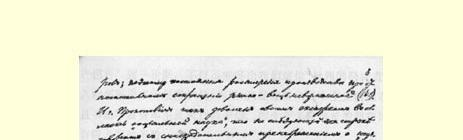
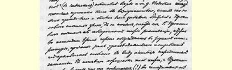
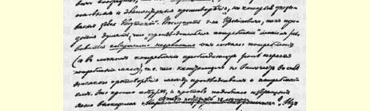

# 书评

７６

> 谢·尼·普罗柯波维奇《西欧工人运动》
>
> （１８９９年底）

“谈到社会科学及其所谓的结论，即资本主义社会制度由于内部日益发展的矛盾必趋灭亡的结论，我们可以在考茨基的《爱尔福特纲领解说》中找到必要的解释。”（第１４７页）在谈论普罗柯波维奇先生摘引的那段话的内容以前，我们必须指出普罗柯波维奇先生以及诸如此类的理论改造家所特有的一个怪癖。我们这位“批判的研究者”在谈到“社会科学”时，为什么偏要在考茨基的一本通俗的书中去找“解释”呢？难道他认为全部“社会科学”都包括在这本书里了吗？他明明知道，考茨基是“马克思传统的忠实捍卫者”（第 １卷第１８７页），因此应该到马克思的政治经济学论文中去寻找 “社会科学”这一学派对“结论”的阐述和论证，但是他的行动却表明他似乎连这一点也不知道。这位“研究者”只是狂妄地反对理论的“捍卫者”，却根本不敢在自己的书中公开地和直接地同这一理论交锋，对于这种“研究者”，我们应该作何感想呢？

在普罗柯波维奇先生摘引的那段话中，考茨基说的是，技术革命和资本积累的进展愈来愈迅速；由于资本主义本身的基本特性， 生产必须扩大而且必须不断扩大，但是市场的扩大“在一段时间里却极为缓慢”；“看来，欧洲工业的市场不仅不再扩大甚至还会开始缩小的日子已经不远了。这一事实正是意味着整个资本主义社会的崩溃”。普罗柯波维奇先生“批评”这一“社会科学的结论”（即考茨基指出的马克思所发现的发展规律之一）说：“在资本主义社会必然灭亡这个论据中，起主要作用的是‘生产不断扩大的趋势同市场的扩大愈来愈缓慢以致最终缩小’之间的对立。照考茨基的说法，这个矛盾一定会使资本主义社会制度毁灭。但是，〈请听吧！〉生产扩大的先决条件是一部分剩余价值用于‘生产消费’，也就是说首先要实现剩余价值，然后为了再生产把剩余价值用在机器、建筑物等等上面，换句话说，生产的扩大同现有商品的销售市场的存在有极密切的联系；因此，在市场相对缩小的条件下，生产不断扩大是不可能的。”（第１４８页）普罗柯波维奇先生对于自己在“社会科学”方面文不对题的议论十分欣赏，因此在下一行就目空一切地大谈其信仰的“科学”（带引号的）论据等等。这种自以为是的批评如果不是非常可笑，那就是令人愤慨的。善良的普罗柯波维奇先生只知其一，不知其二。最近一个时期俄国著作界热烈地讨论了抽象的实现论，并且由于民粹派经济学的错误，特别强调了“生产消费”的作用。普罗柯波维奇先生听到了这一理论，却没有认真弄懂这一理论，就以为它**否定了**（！）考茨基在这里指出的资本主义的那些基本矛盾。听了普罗柯波维奇先生的这种论断，一定会认为，“生产消费”的增长可以同个人消费**完全无关**（在个人消费中群众的消费起着主要作用），也就是说，在资本主义内部生产和消费之间不存在任何矛盾。这简直是胡说八道，马克思及其俄国的拥护者都明确地反对过这种歪曲[^1]。根据“生产扩大的先决条件是生产消费”这一

[^1]: 参看１８９９年８月《科学评论》上我的一篇文章，特别是第１５７２页（参看本卷第６０—７８页，特别是第７０—７１页。—— 编者注），以及《俄国资本主义的发展》