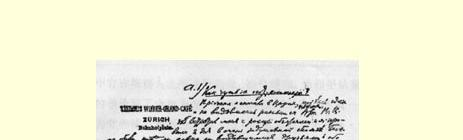
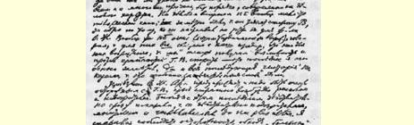
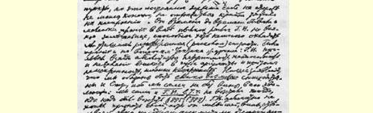
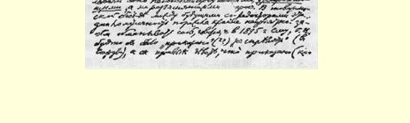

# “火星”怎么会差一点熄灭了？

> （１９００年８月下旬）

我先到苏黎世，是一个人去的，事先没有见到阿尔先耶夫（波特列索夫）。在苏黎世，帕·波·非常热情地接待了我，我们倾心交谈了两天。象两个久别重逢的朋友那样什么都谈，想到哪说到哪， 完全不象谈工作那样。关于工作问题，帕·波·根本谈不出什么来；可以看出，他是倾向于格·瓦·的，因为他坚持杂志的印刷所要设在日内瓦。总的说来，帕·波·很会“阿谀”（恕我用这个词）， 他说，他们的**一切**都是和我们的事业联系着的，这使他们获得了新生，“我们”现在甚至有可能来反对格·瓦·的极端态度，—— 我特别感到，而且后来的全部“原委曲直”也表明，这后一句话特别精采。

我到了日内瓦。阿尔先耶夫提醒我说，对格·瓦·必须特别谨慎，分裂９０使他很激动，而且他很多疑。后来我同格·瓦·谈话时果然立刻就看出，他的确很多疑，神经过敏，而且永远认为自己是最正确不过的。我尽量小心，不去触及“痛”处，但是，时刻这样提心吊胆，情绪当然会十分压抑。有时也发生一些小“摩擦”，例如，格· 瓦·一听到多少有助于平息（由于分裂而激起的）火气的一点点意见都要怒气冲冲地加以驳斥。在杂志的策略问题上也发生了一些 “摩擦”：格·瓦·总是固执己见，不能够也不愿意好好地考虑别人的论据，而且态度不诚恳，确实不诚恳。我们声明，我们必须**尽可能** 地宽容司徒卢威，因为他发展到这种地步，**我们自己**也并不是没有过错的，我们自己，**包括格·瓦·在内**，在应当起来驳斥的时候 （１８９５年、１８９７年）没有起来驳斥。格·瓦·根本不愿意承认自己有丝毫过错，只是用一些**回避**问题而不是说明问题的显然不知所云的论据来支吾搪塞。在未来的编委们之间进行同志般的交谈，使用这种……外交辞令使人感到非常不愉快，例如，为什么要欺骗自己，说什么在１８９５年他格·瓦·是“奉命〈？？〉不要开火”（向司徒卢威），而他又是习惯于遵命行事（真是这样吗？）。９１为什么要欺骗自己，硬说什么在１８９７年（当时司徒卢威在《新言论》上说，他的目的是想推翻马克思主义的一个基本原理）他格·瓦·没有起来反对，是因为他完全不理解（其实他永远也理解不了）撰稿人之间怎么能在同一个杂志上进行论战。９２格·瓦·这种不诚恳的态度令人十分气愤，尤其是因为他竟在争论中竭力把事情说成似乎我们不想和司徒卢威进行无情的斗争，似乎我们想“调和一切”等等。对于在杂志上一般可以进行论战的问题也发生了热烈的争论，格· 瓦·表示反对而且不愿意听我们的论据。他对“联合会派”简直恨得不象话了（猜疑他们是奸细，指责他们是投机分子，是无耻之徒， 声称他会毫不犹豫地把这些“叛徒”“枪毙”等等）。只要稍微暗示一下他也走了极端（例如，我曾暗示公布私人信件９３这件事，并且暗示这种做法是轻率的），都使格·瓦·暴跳如雷，怒不可遏。显然， 他和我们彼此都更加不满了。他的不满表现在，我们拟订了一个阐述出版物的任务和纲领的编辑部声明草案（《编辑部的话》）[^1]，这个声明在格·瓦·看来是按“机会主义的”精神写成的，因为其中

[^1]: 见本卷第２８２—２９１页。—— 编者注