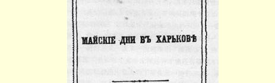

# 《哈尔科夫的五月》小册子序言

> （１９００年１０月—１１月上旬）

这是一本叙述有名的１９００年哈尔科夫五一游行示威的小册子，由俄国社会民主工党哈尔科夫委员会根据工人自己的记叙编辑而成。这本小册子是当作通讯寄来的，但是我们认为有必要出版单行本，这不仅因为它的篇幅相当大，而且也为了使它更易于尽可能大量地、广泛地流传。再过半年，俄国工人就要庆祝新世纪第一年的五一节了，因此现在就要注意使下次的庆祝活动能够在尽可能多的城市里展开，能够更加振奋人心，使参加者不仅人数多，而且组织性强，自觉性高，同时还决心展开不屈不挠的斗争，争取俄国人民的政治解放，从而争取无产阶级的阶级发展和为社会主义公开斗争的自由天地。现在就要着手准备下一次的五一游行示威了，而最重要的准备措施之一，应当是介绍俄国社会民主主义运动已经取得的成就，分析我们整个运动，特别是五一游行示威还存在的不足之处，以及我们怎样弥补这些不足之处，以争取更好的成绩。

哈尔科夫的五一游行示威表明，庆祝工人的节日，能够变成声势多么浩大的政治性游行示威，要使这种庆祝活动真正成为觉悟的无产阶级伟大的全国游行示威，我们还有哪些不足之处。是什么使哈尔科夫的五月成为著名的事件呢？就是大批工人参加罢工，

