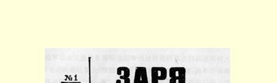
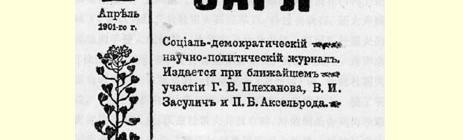
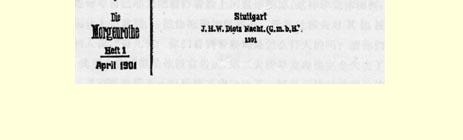

# 时评

１１２

> （１９０１年１月底—２月初）

# 一 打吧，但不要打死

１月２３日，莫斯科高等法院组成的**有等级代表参加的**特别法庭在下诺夫哥罗德审理了农民季莫费·瓦西里耶维奇·沃兹杜霍夫被殴致死的案件。沃兹杜霍夫是被送到区警察局去“醒酒”的，但是在那里遭到舍列梅季耶夫、舒利平、希巴耶夫和奥尔霍文等４个警察和派出所代理巡官帕诺夫的一顿毒打，第二天就死在医院里了。

这件普通案件的简单情节就是这样，它很清楚地说明了我们警察局平日的所作所为。

根据报上极简单的报道看来，事情的全部经过是这样的。４月 ２０日，沃兹杜霍夫坐马车到省长公署去。省长公署的侍卫走了出来。他后来在法庭作证说，沃兹杜霍夫没有戴帽子，喝了酒，但是没有醉，他来控诉某某轮船码头不卖给他船票（？）。侍卫就命令岗警舍列梅季耶夫把沃兹杜霍夫带到区警察局去。沃兹杜霍夫喝得很少，他还同舍列梅季耶夫心平气和地谈话，到区警察局以后还清清楚楚地对派出所巡官帕诺夫说出他的姓名和身分。尽管如此，舍

> １９０１年４月《曙光》杂志第１期封面列梅季耶夫（显然是得到刚刚审问过沃兹杜霍夫的帕诺夫的允许） 不是把沃兹杜霍夫“**推进**”关着几个醉汉的拘留室，而是把他推进拘留室隔壁的“**士兵室**”。在推的时候，他的军刀碰在门钩上把手划破了，他以为是沃兹杜霍夫抓住军刀，扑过去就打，还大声喊叫，说他的手被人砍伤了。他使出了全身力气，打沃兹杜霍夫的脸，打他的胸部和肋部，直打得他仰面朝天，头碰到地上，连声求饶。据当时押在拘留室里的一位见证人（谢马欣）说，沃兹杜霍夫曾经说：“为什么打我？”“我又没有错。看在上帝的份上，饶了我吧！”据这位见证人说，沃兹杜霍夫并没有醉，醉的倒是舍列梅季耶夫。关于舍列梅季耶夫“教训”（这是起诉书上的话！）沃兹杜霍夫一事，他的同事舒利平和希巴耶夫都知道，这两个人从复活节的第一天起（４月２０ 日是星期二，即复活节的第三天）就在警察局里喝酒。他们两个同从另一个区警察局来的奥尔霍文一起走进士兵室，对沃兹杜霍夫拳打脚踢。派出所巡官帕诺夫也进来了，用书打他的头，用拳头打他。一个被拘留的妇女说：“他们打得太狠了，太狠了，直吓得我的肚子发痛。”这顿“教训”结束后，派出所巡官很坦然地命令希巴耶夫把被打者脸上的血迹洗掉（这样毕竟体面些；千万别让上司看到！），把他拖进拘留室去。沃兹杜霍夫对其他被拘留的人说：“哥儿们！你们看到警察局是怎么打人的吗？请你们作证，我要去告！”但是他没有告成，第二天清早发现他完全失去了知觉，送到医院后８ 小时昏迷不醒就死了。解剖尸体时发现他的肋骨断了１０根，浑身青紫，脑内淤血。

法院判处舍列梅季耶夫、舒利平和希巴耶夫４年苦役，而奥尔霍文和帕诺夫只判了**１个月的拘留**，认为他们犯的只是“欺压”罪 ……

我们就从这个判决开始把事情分析一下。苦役是按刑法典第 ３４６条和第１４９０条第２款判处的。第３４６条写道：官员在执行职务时造成伤残事故者，应“按所犯之罪”予以最重的刑罚。第１４９０ 条第２款规定：将人严刑拷打致死者，应判处８年到１０年苦役。等级代表和皇室法官组成的法庭没有予以**最重的刑罚**，而是把它**降低了两等**（第６等：８—１０年苦役；第７等：４—６年苦役），也就是说，法庭作出的是在情节可以从轻处理的情况下法律所允许的最低刑罚，而且还是最低一等中的**最低的**年限。总而言之，法庭竭力为被告减刑，甚至超过了它力所能及的范围，因为它规避了关于 “最重的刑罚”的法律。当然，我们决不是想说，“最公正的裁判”应该是１０年苦役而不是４年苦役；重要的是凶手被认为是凶手，而且被判了苦役。但是不能不指出皇室法官和等级代表组成的法庭的极其明显的倾向：他们在审判警察局的官员时，是蓄意尽量从宽处理的；而当他们在审判那些有触犯警察的行为的人时，那大家都知道是一贯从严的。[^1]

这是派出所巡官先生啊……那怎么能不从宽处理呢？他看到了这个被带来的沃兹杜霍夫以后，显然是吩咐不要带到拘留室，而是先带到士兵室去教训一顿；他也同他们一起用拳头和书（大概是用法典）来打他；他命令毁灭罪迹（洗掉血迹）；他在４月２０日夜间向外出回来的区警察局局长穆哈诺夫报告，“在托付给他的区警察局里平安无事”（原话！），—— 但是他跟那些凶手根本不同，他的过错不过是有凌辱行为，不过是有应判拘留的普通欺压行为。所以这位没有犯杀人罪的绅士帕诺夫先生，现在仍在警察局里供职而且担任警察局巡官的职务，也就不足为奇了。帕诺夫先生不过是把他 “教训”平民的那套有效办法从城市搬到了乡村。读者们，请你们凭良心说，巡官帕诺夫是不是可以把法院的判决理解为这样一种劝告：今后要把罪迹掩盖得好一些；要“教训”得不留一丝痕迹。你吩咐洗掉垂死者脸上的血迹，这很好，但是你让沃兹杜霍夫死掉了， 老弟，这可太粗心了；以后应该多加小心，并且要牢牢记住俄国的杰尔席莫尔达１１３的最最重要的戒律：“打吧，但不要打死！”

在一般人看来，法院对帕诺夫的判决简直是对司法的嘲笑；判决表明一种极其卑鄙的意图，那就是把全部罪名都推在下级警察的身上，庇护他们的顶头上司，而这种野蛮的拷打正是在他的授意和参与下进行的。从法律的观点来看，这个判决是法官们惯用的诡辩的典型，而他们本身也跟派出所巡官差不了多少。外交家说，人有舌头是为了隐瞒自己的思想。我们的法学家也可以说，定出法律就是为了曲解罪行和责任的概余。真的，为了把参与拷打改成有普通的欺压行为，法官需要多么微妙的艺术啊！也许，一个工匠在４ 月２０日早晨把沃兹杜霍夫的帽子打掉了，那他犯的是过失，竟同帕诺夫一样，甚至更轻，不算过失，而是“违反规定的行为”。连参与普通的斗殴（而不是参与拷打无援的人）而造成某人死亡者，所受的惩罚都要比派出所巡官所受的重得多。善于舞文弄法的法官首先利用的一点，就是法律对于在执行职务时进行拷打的人规定了好几种惩罚，让法官可以在两个月监禁和流放西伯利亚之间酌情处理。法官不受正式规定的过分约束，而有一定的伸缩余地，—— 这当然是一种很合理的原则，所以我国刑法学教授们才不止一次地称颂俄国的法律制度，强调它的自由主义。只是他们忘记了一件小事情：要运用合理的法规，就需要有其地位不同于一般官吏的法官，就需要社会代表参加审判和舆论界参加案件的讨论。其次，副检察长也帮助了法庭，他**拒绝**对帕诺夫（和奥尔霍文）的拷打和残暴行为起诉，只请求法庭惩罚他们的欺压行为。副检察长引用了鉴定人的结论，鉴定人否认帕诺夫特别凶狠和连续不断地打人。可见，法律上的诡辩主义并不怎么奥妙难解：既然帕诺夫打得比别人少，那么就**可以**说，他打得并不**特别**凶狠；既然他打得并不特别凶狠，那么就**可以**下结论说他的殴打不算“拷打和残暴行为”；既然不算拷打和残暴行为，那就是说这是普通的凌辱行为。这样处理，皆大欢喜，而帕诺夫先生则仍然是秩序和制度的维护者[^2]……

我们刚才提到了社会代表参加审判和舆论界的作用问题。本案件已经大体上很好地说明了这个问题。首先，为什么不是由陪审法庭，而是由皇室法官和等级代表组成的法庭来审理这个案件呢？ 因为亚历山大三世的政府无情地反对社会上一切要求自由独立的倾向，很快就认为陪审法庭是危险的。反动报刊宣布陪审法庭是 “市井小民的法庭”，并且公开对它攻击，顺便说一句，这种攻击直到现在还在进行。政府通过了一个反动的纲领：战胜７０年代的革命运动以后，就肆无忌惮地向社会代表宣布，政府认为他们是“市井小民”，是贱民，他们既不能干预法律也不能管理国家，应该把他们从审讯和判决（按照帕诺夫先生们的办法）俄国平民的圣坛上赶走。１８８７年颁布过一个法律，规定凡是案件中犯法者或受害者为公职人员的时候，一律不由陪审法庭审理，而交由皇室法官和等级代表组成的法庭审理。大家知道，这些和法官同流合污的等级代表都是些没有话的配角，扮演一些可怜的角色，不过是给审讯部门的官老爷们任意决定的事情作作证、画画押而已。这只是贯串在俄国历史整个近代反动时期中的一系列法律中的一个，把这些法律串起来的是一个共同的意图，那就是恢复“牢固的统治”。１９世纪下半叶，当局慑于局势，不得不同“市井小民”接触，但是市井小民的成分发生了急速的变化，那些无知的平民变成了开始意识到自己权利的公民，他们中间甚至还出现了能够为权利而斗争的战士。当局感到了这种情况，于是就惊恐万状地撤退，手忙脚乱地赶紧筑起一道万里长城来保护自己，躲进一个堡垒，任何舆论界的自由意志也传不进去…… 我有些离题了。

总之，由于颁布了这个反动的法律，市井小民不能再审判当权者了。官吏审判官吏。这不仅影响了判决，而且影响了预审和庭审的整个性质。市井小民的法庭可贵之处就在于它给我国那些浸透了文牍主义的政府机关带来了一股生气。市井小民所关心的不仅是某种行为应该被认为是欺压、是斗殴、还是拷打，应该受到哪一种哪一类的惩罚，而且更关心彻底揭示、公开说明罪行的一切社会政治原因及其意义，从审判当中得到社会道德和实际政策的教育。 市井小民希望法庭不是“衙门”，在这里官老爷们根据刑法典的某条某款来处理案件，他们希望法庭是公开的机关，在这里可以揭露现行制度的脓疮，提供批判这个制度因而也是改造这个制度的材料。市井小民由于社会生活实践和政治觉悟提高的推动，亲身体验到一个真理，而我国官方教授们所研究的法学要达到这个真理，则要经历重重困难、怀着战战兢兢的心情穿过烦琐哲学的各种障碍。 这个真理就是：对防止犯罪来说，改变社会制度和政治制度比采取某种刑罚，意义要大得多。正因为这个缘故，反动政论家和反动政府才仇恨、而且也不能不仇恨市井小民的法庭。正因为这个缘故， 缩小陪审法庭的权限和限制公开审判，贯穿着俄国改革后的全部历史，“改革后”时期的反动性质在改革我国“审讯部门”的１８６４年法律生效后的**第二天**就暴露无遗。[^3]缺少“市井小民的法庭”，就特别明显地影响了这个案件的审理。在法庭上，谁会对这个案件的社会意义感兴趣，把这种意义尽量突出呢？是检察长吗？是跟警察局的关系最密切、对于拘留被捕者和如何对待他们也要负一部分责任的官吏（有时甚至就是警察局长）吗？我们知道，副检察长甚至拒绝对帕诺夫的拷打行为起诉。是原告人（如果被害者沃兹杜霍夫的妻子出庭为他作证，对凶手们提起民事诉讼）吗？但是，她这样一个普通农村妇女哪里会知道在刑事法庭中还能提起民事诉讼呢？即使知道这一点，但是请不请得起律师呢？即使请得起，那么能不能请到一位能够并且愿意使人们的注意力集中在这件杀害案所揭露的制度上的律师呢？即使找到了这样一位律师，但是象等级代表这样的社会“代表”能不能支持这位律师的“正义感”呢？这是一个乡长，—— 我想象的是一个地方法庭—— 他穿着一身乡下人的服装而感到局促不安，不知道把脚上穿的涂了臭焦油的靴子和一双庄稼汉的手放在哪儿好，时而胆怯地向同座的庭长大人瞟一两眼。这是一个市长，他是个大腹便便的商人，穿着一身没穿惯的制服，气喘吁吁，脖子上还佩带一条链子，拚命模仿坐在他旁边的那位穿着贵族礼服、油光满面、派头十足的贵族代表大人的气派。旁边还有一些久经官场、训练有素的法官，象衙门里白发苍苍的书记官１１４， 他们深感自己责任重大：审判市井小民的法庭不配审判当权者。这个环境难道还不会使最雄辩的律师打消说话的念头吗？难道还不会使他想起“不可对……弹琴”这句古老的格言吗？

原来他们快马加鞭是希望尽速使案件脱手[^4]，害怕把全部丑事揭露出来：紧靠着茅厕居住，久而不闻其臭，一旦要清洗茅厕，不仅本宅住户，而且左邻右舍都会闻到臭气。

请注意，有多少自然而然会产生的问题，却没有任何人想去弄清楚。为什么沃兹杜霍夫要去见省长呢？起诉书这个体现起诉机关揭发全部罪行的意图的文件，不但没有回答这个问题，甚至公开抹杀这个问题，说什么沃兹杜霍夫“是在酩酊大醉之中在省长公署院里被巡警舍列梅季耶夫拘捕的”。这甚至给人一种印象，似乎沃兹杜霍夫曾经无理取闹。在什么地方呢？在省长公署的院里！事实上，沃兹杜霍夫**是坐马车来向省长控诉的**，—— 这已经调查属实了。他要控诉什么呢？省长公署的侍卫普季岑说，沃兹杜霍夫控诉某某轮船码头不卖给他船票（？）。证人穆哈诺夫（曾任打过沃兹杜霍夫的那个区警察局的局长，现在弗拉基米尔市任省监狱的狱长） 说，他听沃兹杜霍夫的妻子说，她和她丈夫在一块喝了酒，**他们在下诺夫哥罗德的水上警察局和罗日杰斯特沃区警察局都挨过打**， **沃兹杜霍夫就是要向省长申诉这种情况的**。虽然这些证人的证词里有明显的矛盾，但是法庭竟没有采取任何办法来加以澄清。不这样做，任何人都有充分权利下结论说法庭**不想**弄清这个问题。沃兹杜霍夫的妻子曾出庭作证，但是谁也没想到去问她，她和她丈夫是不是真的在下诺夫哥罗德的好几个区警察局里都挨过打？是在什么情况下把他们拘留的？在什么地方打的？谁打的？她丈夫是不是真的要向省长控诉？她丈夫是否还跟别的什么人讲过他的打算？ 证人普季岑是省长办公室的一个官员，他很可能不愿意听这个并没有喝醉的—— 但是仍需要去醒酒的！—— 沃兹杜霍夫对警察局的控诉，就叫**喝醉了的**巡警舍列梅季耶夫把这个控诉人带到区警察局里去醒酒。对这样一个关系重大的证人却没有对质。送沃兹杜霍夫去见省长、然后又送他到区警察局的马车夫克赖诺夫，也没有受到讯问，沃兹杜霍夫是否同他讲过为什么要去见省长？他跟普季岑究竟讲了些什么？有没有别人听到他们的谈话？法庭只是宣读了没有出庭的克赖诺夫的简短证词（证明沃兹杜霍夫喝了酒，但是没有喝醉），而副检察长根本没有想到应该让这个重要的证人出庭。如果注意到沃兹杜霍夫是个预备役军士，也就是说是个久经世故、多少知道一点法律和规章的人，在挨了最后一顿致命的毒打之后甚至还向同伴们说：“我要去告”，那么可想而知，他来见省长正是要控诉警察局，证人普季岑则是撒谎，替警察局开脱，而法官和检察长这些奴仆又不想揭穿这一棘手的事件。

其次，到底为什么要打沃兹杜霍夫呢？起诉书又是怎么说对被告更有利……就**怎么**说。居然把“拷打的起因”说成是舍列梅季耶夫往士兵室里推沃兹杜霍夫的时候划破了手。问题在于，为什么要把平心静气地同舍列梅季耶夫和帕诺夫谈话的沃兹杜霍夫先推进 （就算必须把他**推进去**！）**士兵室**，而不是推进拘留室呢？把他带去是为了醒酒，—— 拘留室里已经有好几个醉汉—— 沃兹杜霍夫后来也来了，那么舍列梅季耶夫为什么在把他“交给”帕诺夫以后又把他推进士兵室里呢？显然正是为了要揍他。拘留室里人多，士兵室里就只有沃兹杜霍夫一个，而舍列梅季耶夫还有其他同事和那位现在“明令调管”第一区警察局的帕诺夫先生前来助威。可见，拷打并不是偶然的，而是早有预谋的。可以推测有两种可能：或者是被带到区警察局来醒酒的人（即使是举止有礼、心平气和的人），都要先进士兵室去受一顿“教训”，或者是沃兹杜霍夫被弄去挨打**正是因为他要向省长控告警察局**。报纸上关于这件事的报道太简略了，所以很难断定后一种推测是正确的（这种推测决不是不能成立的），但是预审和庭审当然能够彻底弄清这个问题。自然，法庭根本不会注意这个问题。我之所以说“自然”，是因为法官们对这个问题的冷漠态度不仅反映了官场上的形式主义，而且反映了俄国人的苟且偷安的观点。“这有什么奇怪！区警察局里打死个把喝醉酒的农夫有什么了不起！在我们这里还有更严重的哩！”苟安的人还会对你说出几十桩令人更为气愤而罪犯却逍遥法外的事情。他们说的虽然完全是事实，但是看法全错了，只能暴露出他们苟且偷安、 目光极其短浅。警察使用暴力这种令人极为气愤的事情之所以会发生，难道不正是因为这是每个区警察局的家常便饭吗？我们对特殊案件的愤懑之所以软弱无力，难道不正是因为我们一贯以冷漠态度来对待“正常”案件吗？在区警察局里殴打一个喝醉酒（说是喝醉酒）的“农夫”，这种司空见惯的现象竟激起这个（本应对此习以为常）农夫的抗议，拼着一条命斗胆去向省长大人提出小民的控诉，—— 甚至在这种时候还不能使我们的冷漠态度为之激动，这难道不正是一个原因吗？

还有另一个原因不能使我们忽视这件最平常的事情。有人早就说过，刑罚的防范作用，决不在于刑罚的残酷，而在于有罪必究。 重要的不是对犯罪行为处以重刑，而是要把**每一桩**罪行都揭发出来。从这方面来说，这个案件也是值得注意的。可以毫不夸大地说， 在俄罗斯帝国，警察局里野蛮地违法打人的事情每时每刻都在发生。[^5]而能够提到法庭上审判的却寥寥无几。这毫不奇怪，因为犯罪的正是负责任在俄国揭露各种罪行的警察局本身。所以每当法庭不得不揭开掩盖着平常案件的帷幕的时候，我们就不能象平常那样，而是要格外多加注意。

譬如说，可以注意一下警察是怎样打人的。他们五六个人，干起来凶得象野兽，很多人都喝得醉醺醺的，每个人都有一把军刀。 但是他们从来没有一个人用军刀打过遭难者。他们都是一些老手， 都很知道打人应该怎样打法。用军刀打，就有了物证，而用拳头打， 那你就休想证明是在警察局里打的。“他是斗殴时被打的，抓来时就打伤了”，—— 真是天衣无缝。甚至在这个案件上，也是由于偶然打死了人（“鬼知道他是怎么死的；这个农夫身强力壮，谁能料到会死呢？”），起诉书才不得不根据证人的证词确认：“沃兹杜霍夫来到区警察局以前身体完全健康。”显然，凶手们一口咬定他们并没有打人，说他们把沃兹杜霍夫带到区警察局的时候他已经被打伤了。 在这种情况下要找到证人是非常困难的。幸而从拘留室通士兵室的那扇小窗户并没有完全挡死：虽然窗玻璃换上了一块有钻孔的洋铁片，并且钻孔也从士兵室里用皮子挡上了，但是用手指一捅， 皮子会翘起来，从拘留室里就可以看到士兵室里在干什么。幸亏这点，在庭审时才弄清楚当时“教训”的情况。但是象窗户没有挡死这类糟糕的事情，当然只在上一世纪才能发生；到２０世纪，下诺夫哥罗德内城第一区警察局中从拘留室通士兵室的那扇小窗户，恐怕早已挡死了…… 既然没有证人，那么只要把人弄进士兵室就天下太平了！

任何一国的法律也没有俄国的多。在我们这里，一切都有法律。关于监禁的内容也有专门条例，其中详细写道，只有受特殊监护的特殊处所的拘留才是合法的。看吧，他们是遵守法律规定的： 警察局里设有特殊的“拘留室”。但是在送到拘留室**以前**“通常”都是先“推进”“士兵室”。虽然从整个审讯中可以看出，士兵室就是真正的刑讯室，这已经很明显，但是司法当局根本不想注意这种现象。其实，根本就不要指望检察长会揭露和反对我国警察专制制度的胡作非为！

上面我们已经涉及这类案件的证人问题。证人顶多只能是警察局手里的人；外人只能在极个别的场合才能看到区警察局里“教训”人的情况。而警察局手里的证人，警察是可以施加压力的。在这个案件上就是这样。证人弗罗洛夫在他们行凶时被押在拘留室里，在预审时他最初供称，警察和派出所巡官都打了沃兹杜霍夫； 后来他撤消了对派出所巡官帕诺夫的指控；在庭审时竟又声明说， 警察局里任何人也没有打沃兹杜霍夫，他指控警察局是受谢马欣和巴里诺夫（也是两个被拘留者，是原告方面的主要证人）的怂恿， 警察局并没有怂恿他和教他怎么说。证人法捷耶夫和安东诺娃则称，士兵室里谁也没有对沃兹杜霍夫动过一根指头：大家都安静地坐在那里，没有发生任何争吵。

大家看到，这又是一种极其平常的现象。司法当局对这种现象还是漠然处之。有一条法律规定，在法庭上捏造证词要受相当严厉的制裁；追查这两个伪证人，就会更加揭露警察的暴戾。那些不幸落入警察魔掌的人（千千万万的“普通”人经常不断地遭到这种不幸），对这种行径几乎是完全无力自卫的，但是法庭所考虑的仅仅是使用哪一条法律，根本不去考虑这种无力自卫的情况。审讯过程中的这一个细节也和所有其他细节一样，清楚地说明这是一个无所不包的牢固的罗网，这是一个多年的脓疮，要想除掉它就必须根除整个警察专制制度和人民毫无权利的现象。

大约３５年以前，俄国名作家费·米·列舍特尼科夫曾遇到一件不愉快的事情。在圣彼得堡时他有一次到贵族会议厅去，误以为那里开音乐会。巡警不让他进去，向他大喝道：“瞎闯什么？你是干什么的？”费·米·列舍特尼科夫很生气，愤然答道：“工匠！”这样回答的结果—— 格·乌斯宾斯基叙述说—— 是列舍特尼科夫在区警察局里过了一夜，挨了一顿打才出来，钱和戒指也都不见了。列舍特尼科夫在他给圣彼得堡警察总监的申诉书中写道：“谨将此事通知阁下，但绝不为所失之物。仅只不胜冒昧地麻烦您一件事，即饬令警察局长、派出所所长、他们的卫兵和巡警**不要打人**…… 人民已经不胜骚扰之苦矣。”[^6]

俄国作家老早就向京都警察局长大胆表白过的这个小小的心愿，直到今天还没有实现，而且在我国政治制度下永远也**不会实现**。但是现在，新的强大的人民运动已经引起一切看够了兽行和暴力的正直人们的注意，这个运动正集中力量，要把一切兽行从俄国土地上消灭干净，实现人类美好的理想。近几十年来，人民群众对警察的憎恨增多和增强了无数倍。城市生活的发展，工业的高涨， 文化的普及，—— 这一切也引起闭塞的群众对美好生活的向往，使他们意识到人的尊严，然而警察仍是那样作威作福，蛮不讲理。不仅如此，他们还更加无孔不入地搜寻和迫害他们的新的最可怕的敌人，即一切让人民群众意识到自己的权利和相信自己的力量的东西。为这种意识和信念所鼓舞的人民要消除自己的仇恨，决不应用野蛮的报复，而要靠争取自由的斗争。

# 二 何必要加速时代的变迁？

奥廖尔省贵族会议通过了一项有趣的议案，讨论这项议案时展开的争论则更加有趣。

事实主要是这样的。省贵族代表米·亚·斯塔霍维奇提出一个报告，建议同财政部门就委任奥廖尔贵族做征税官一事订立契约。在实行酒类专卖的同时，省内拟委任４０名征税官，负责征收官营酒店的款子。征税官的报酬每年２１８０卢布（计薪俸９００卢布，车马费６００卢布，警卫的工资６８０卢布）。贵族们要是能弄到这个职位该多好，为此就必须组织协会，必须同国库订立契约。为了代替应缴的保证金（３０００—５０００卢布），建议每个征税官每年先扣３００ 卢布，用以建立贵族基金，作为对酒类专卖局的保证金。

大家可以看到，这个议案无疑是很讲实际的，它证明我国最高等级的人对于哪里能揩到公家的油是非常敏感的。但是这样讲实际在许多高贵的地主看来是过分了，太不象话了，是和贵族身分不相称的。于是，展开了热烈的争论，争论非常明显地暴露了对问题的三种不同看法。

第一种是实际主义的观点。饭是要吃的，贵族等级入不敷出 ……这毕竟是一笔收入……难道不要帮助一下穷贵族吗？何况征税官还能有助于人们戒酒！第二种是浪漫主义者的观点。在酒类专卖部门服务，受那些“往往是出身低贱的”仓库管理员的管辖，这比酒店老板能高贵多少呢！？接着就是一连串关于贵族的崇高使命的演说。我们想谈一谈这些演说，但是先不妨指出第三种观点，即国务活动家的观点。一方面不能不承认这样做有些可耻，另一方面也必须承认这是有利可图的。但是有一个办法既可以得到金钱，又可以保持清白。这个办法就是：管理消费税的官员可以任命征税官而不要保证金，那４０个贵族则可以由省贵族代表从中活动而获得职位，—— 不必组织什么协会，订立任何契约，否则也许“内务大臣会把决议搁下以维护整个国家制度的正常状态”。倘若不是贵族代表作了两点非常重要的声明，这个聪明的意见就很可能占上风。这两点声明就是：第一，契约已经提交财政大臣办公会议，办公会议认为这个契约可行，而且原则上表示同意。第二，“单凭省贵族代表的申请不能获得这种职位”。结果报告被通过了。

可怜的浪漫主义者！他们吃了败仗。可是他们的发言却是多么动听。

“迄今为止，贵族总是领导者。报告却建议成立什么协会。这同贵族的过去、现在和将来相称吗？在发现酒店掌柜盗用公款的时候，贵族应该按照征税官的法律去代他站柜台。死也不做这种事！”

哟，天哪，人间竟有那么高尚的感情！死也不做酒买卖！可是做粮食买卖好啦，—— 这倒是高尚的职业，特别是碰上歉收的年头，可以在饥民身上大捞一把。还有一种更高尚的职业，那就是放粮食高利贷，冬天把粮食贷给挨饿的农民，到夏天农民用劳力来偿还，而这种劳力的报酬要比自由价格便宜三分之二。正是在包括奥廖尔省在内的中部黑土地带，我国地主过去和现在一直非常热中于这种高尚的高利贷。但是，为了把高尚的高利贷同不高尚的高利贷很好地区别开来，当然应该放声大叫，贵族去做酒店老板是有失身分的。

“我们的使命就是大公无私地为人民服务，这已经在有名的沙皇宣言中明文规定，我们必须严格遵守。自私自利的服务是跟这一点不相容的……”“一个等级的祖先曾经立过战功，曾经用自己的双肩担负起亚历山大二世皇帝的伟大改革的重任，这个等级今后也肯定能够完成它对国家肩负的责任。”

是啊，真是大公无私的服务！分封领地，赐予有人居住的庄园， 即赏赐大量的土地和农奴，形成大土地占有者阶级，他们拥有数百、数千以至数万俄亩土地，而把千百万农民剥削得一无所有，—— 这就是所谓大公无私的表现。但是特别动听的是关于亚历山大二世的“伟大”改革。就拿农民解放来说吧，—— 我国高尚的贵族们是怎样大公无私地把农民掠夺得精光的呢：强迫他们赎买自己的土地，强迫他们以高于实价两倍的价格赎买土地，用各种割地的形式把农民的土地攫为己有，用自己的沙地、谷地、荒地来换农民的好地，而现在竟恬不知耻地夸耀这些功绩！

“卖酒这一行根本同爱国无关……”“我们的传统不是以卢布作基础，而是以为国效劳为基础。贵族不应该变成交易所的商人。”

葡萄是酸的！１１５贵族“不应该”变成交易所的商人，因为在交易所里需要雄厚的资本，但是昨天的奴隶主诸公已经挥霍净尽了。他们大多数虽然没有变成交易所的商人，但是却受交易所的支配，受卢布的支配，这早就是既成事实了。在追逐卢布时，这个“最高等级”早就在搞这样一些高度爱国的事业，如酿造下等烧酒；建立糖厂及其他工厂；参加各种空头工商业企业；同高等的宫廷近臣、大公、大臣等类人物频繁交往，以便获得企业的特许权益和政府保障，以便为自己求得一些施舍，例如，对贵族银行的优惠、砂糖输出奖励金、巴什基尔的小块荒地（竟达数千俄亩！）、有利和舒适的“肥缺”等等。

“贵族的伦理带有历史和社会地位的痕迹……”—— 而且还带有贵族在那里习以为常地欺压和愚弄农民的马厩的痕迹。长期的统治习惯，毕竟把贵族们培养得非常机灵了。他们善于用花言巧语掩饰自己剥削者的利益，愚弄无知的“庶民”。请听下去：

“何必要加速时代的变迁？就算这是一种偏见，但是旧传统不会允许我们促进这种变迁……”

纳雷什金先生（坚持国家观点的国务活动家之一）的这段话， 显然流露出一种真正的阶级情感。当然，害怕做征税官（或者甚至是酒店老板），这在目前来说是一种偏见，但是，难道不正是由于无知的农民群众的种种偏见，地主在我国农村才得以维持对农民的旷古未闻的无耻剥削吗？本来偏见是会自动消除的；何必要公开缩短贵族同酒店老板的距离而加速消除这种偏见呢？这样就会使农民通过这种对比更快地理解（本来他们也已经开始理解了）一个简单的真理—— 高尚的地主，同任何农村寄生虫一样，也是些高利贷者、掠夺者和强盗，只不过势力要大得多，因为他们握有土地，享有世代相传的特权，同沙皇政权关系密切，又精于统治之道，善于用浪漫主义和宽大为怀的成套说教来掩饰自己犹杜什卡１１６的心肠。

是的，纳雷什金先生无疑是位国务活动家，他的话体现了治国的才智。我毫不奇怪奥廖尔的贵族“统帅”会用文雅得足以与英国勋爵媲美的措辞来回答他：

“我反对的只是在这里听到的一些权威人士的意见，而不是他们的信念，如果我不是确信这一点，那么，反对他们对我来说就是胆大妄为了。”

这是真话，而且从更广泛的意义上来讲，比那位确实是无意中说了实话的斯塔霍维奇先生所设想的还要真实。贵族老爷们—— 从实际主义者到浪漫主义者—— 的信念都是一样的。他们都确信他们有“神圣的权利”来占有祖先们所掠夺来的或者掠夺者所赐予的几百几千俄亩土地，确信他们有权利剥削农民并且在国家中做统治者，确信他们有权利大量（不得已时，小量也行）揩公家的油， 即搂老百姓的钱。他们仅仅在某种办法是否合适这个问题上有意见分歧，他们在讨论这些意见时发生的争执，也象剥削者营垒中的一切内部争吵一样，对无产阶级是有教益的。从这些争吵中，可以很清楚地看出整个资本家阶级或土地占有者阶级的共同利益同个别人或个别集团利益间的区别；从这些争吵中，往往会泄露出一些一般讲来属于不可告人的秘密。

此外，奥廖尔的事件还多少暴露了臭名昭著的酒类专卖的性质。我国官方和半官方报纸，曾希望它带来说不完的好处，既能增加国库收入，又能提高产品质量，还能减少酗酒现象！实际上，到现在为止，收入没有增加，酒价反而涨了，预算也混乱了，整套作法的财政结果也不能精确地算出来了；产品质量没有提高，反而下降了，而且政府也未必能使公众特别赞赏不久前各报都刊登的关于新“官酒”“品评”成功的报道。酗酒现象没有减少，偷卖烧酒的地方反而增加了，警察从这些地方得来的收入增加了，居民反对开设的小酒店开设起来了[^7]，街上酗酒的现象更加厉害了[^8]。而主要的是， 建立拥有数百万资本的新的官营事业，建立新的官僚大军，给官吏们为非作歹、巧取豪夺大开了新的方便之门！那些逢迎拍马、勾心斗角、掠夺成性、浪费的墨水如汪洋大海、浪费的纸张如重重高山的官吏，象一大群蝗虫似的袭来了。奥廖尔省的议案是一种尝试， 想把多少揩些公家的油这个意图合法化。这种意图已经遍及全省， 并且在官吏专权和公众不敢说话的情况下，必然会使全国进一步遭受专横和掠夺之苦。现在举一个小小的例子：去年秋天，报上透露了一则“酒类专卖方面的建筑奇闻”。政府决定在莫斯科建造３ 座供应全省的酒库，并为此拨款１６３７０００卢布。但结果“确定需要补充拨款**２５０万**之巨”[^9]。显然，负责经管这项工程的官员们从中捞到的油水总要比５０条裤子和几块靴用皮多一些吧！

# 三 客观的统计

我国政府老爱指责它的反对者（不仅革命者，还有自由派）有倾向性。你们大概看到过官方报刊对自由派刊物（当然是合法刊物）的评论吧？财政部的机关刊物《财政通报》１１７，有时登一些报刊评论，每当作这种评论的官吏谈到我国某一个自由派杂志（厚厚的）对预算、饥荒或政府的某项措施的评价时，总是愤愤不平地指摘这些杂志具有“倾向性”，并说与此相反，应该不仅“客观地”指出 “黑暗的方面”，而且也要指出“可喜的现象”。当然，这不过是一个小小的例子，却也勾画出政府的通常态度，政府通常以“客观”自诩的作法。

让我们试着满足一下这些严格的和不偏不倚的评判者的要求。让我们试着作一次统计。我们所要统计的当然不是社会生活中的这些或那些事实，因为，大家知道，事实总是由一些有偏见的人记录的，而且综合这些事实的又是地方自治机关之类有时具有明显“倾向性的”机关。不，还是让我们来统计一下……法律吧。可以设想：任何一个最热心拥护政府的人也不敢断言，有什么统计能比法律的统计更客观、更公正，—— 因为这只是统计一下政府自己作出的决定，根本不涉及它言行是否一致，决定和执行是否脱节等等。

好吧，言归正传。

大家知道，执政参议院出版一种《政府法令汇编》，定期公告政府的每项措施。我们就用这些材料来看一看政府**在哪些方面**制定了法律，发出了指令。就看在哪些方面。我们不去批评当局的那些命令，—— 我们只来统计一下关于这方面或那方面的“命令”的数目。１月份的报纸，都转载了《政府法令汇编》去年第２９０５期到第 ２９２９期及今年第１期到第６６期的内容。从１９００年１２月２９日到 １９０１年１月１２日—— 正好是在两个世纪的交接点上，这期间总共颁布了９１条法令和命令。就其性质来说，这９１条法令对“统计”倒是非常方便的，因为其中没有任何特别突出的法律，没有任何足以把其他一切推到次要地位并且给现阶段内政打下特殊烙印的东西。所有这些法令都是不太紧要的，是为经常不断产生的当前需要而制定的。这样我们也可以看到政府的常态，而这一点能再一次地保证我们“统计”的客观性。

９１条法令中有３４条，即三分之一以上，涉及的是同样一个问题，即延长各种工商业股份公司偿还或缴纳股金的期限问题。读一读这些法令可以使报纸的读者把我国工业生产部门的名称和各种商店的字号记得清楚一些。第二类法令的内容大同小异，即关于工商业公司章程修改问题。这一类有１５条，涉及波波夫兄弟茶叶贸易公司，瑙曼厚纸－油毡生产公司，奥西波夫皮革制造及皮革、厚粗布、亚麻布制品贸易公司等等的章程修改问题。最后，还有１１条法令也应该归入这一类，其中有６条是为了满足商业和工业的某些需要（建立社会银行和互贷会，规定作为官方承包工程保证金的有息证券的价格，公布私有车皮运转规章，公布博里索格列布斯克粮食交易所经纪人条例）而颁布的，其余５条是为了在４个工厂和 １个矿山增设６个巡警和２个骑警而颁布的。

总的来说，９１条法令中有６０条即三分之二是直接满足我国资本家的各种实际需要和（部分是）保护他们不受工人风潮的影响。无情的数字证明：就日常颁布的法令和命令的主要性质来看， 我国政府是资本家的忠实奴仆，它对整个资本家阶级所起的作用， 正象一个炼铁厂厂主会议常设办事处或者砂糖工厂主辛迪加事务所对各个生产部门的资本家所起的作用。无关紧要地修改一下某公司的章程或者延长一下某公司股份偿还期限，这类事情成了特别法令的对象，当然完全是由于我国国家机构的臃肿所致；只要稍微“改善一下机构”就行了，所有这类事情就会转归地方机关处理。 但是，从另一方面来说，机构的臃肿、权力过分集中、政府什么事情都要亲自过问，—— 所有这些都是我国整个社会生活中的普遍现象，决不仅仅是工商业方面的现象。因此，比较一下这类或那类法令的数目，很可以大致说明我国政府想的是什么，关心的是什么， 感兴趣的是什么。

譬如，私人协会如果不是追求在道义上十分高尚、在政治上十分可靠的赚钱目的，我国政府的关怀就要差得远（如果不把阻挠、 禁止、封闭等等意图看作是关怀的表现的话）。在“本统计所涉及的”期间内（本文作者是公务人员，因此希望读者原谅他的官腔）， 已经有２个协会（弗拉基高加索男子中学清寒学生援助协会和弗拉基高加索教育远足旅行协会）的章程被批准，有３个协会（柳季诺沃工厂员工、苏克列姆利工厂员工及马尔采夫铁路员工互助储金会、忽布种植业第一协会、妇女劳动奖励慈善协会）的章程需要修改也得到了恩准，另颁布有关工商业协会的法令５５条，有关其他方面的法令５条。在有关工商业利益方面，“我们”总想不负众望，尽可能促使工商业者结合（是想，但不是做，因为机构的臃肿和无止境的拖拉，把警察国家中“可能办到的事”限制在一个很小的范围内）。在非商业团体方面，我们原则上是赞成以毒攻毒的。忽布种植业协会或妇女劳动奖励协会，—— 这还没有什么。可是，教育远足…… 天晓得他们在远足时要谈些什么？是不是会给监察院毫不松懈的监督造成困难？这可不行，要知道火是不能闹着玩的。

谈到学校，学校是整整办了３所。是些什么学校啊！坐落在幸福村彼得·尼古拉耶维奇大公殿下领地内的家畜饲养初等学校。 所有大公的村庄都应该是幸福的，这一点我早就不怀疑了。现在我也不怀疑，甚至最大的大人物也能真心诚意地关怀和热中于下层群众的教育事业。其次，杰尔加切沃村手工业实习所和阿萨诺沃初等农业学校的章程也被批准了。可惜我们手头没有任何材料可以查考一下，这些大力发展国民教育和……地主经济的幸福村是否也都属于某些大人物。但是，我想到这种调查并不包括在统计者的职责之内，于是也就心安理得了。

以上就是表现“政府对人民的关怀”的全部法令。我显然是根据最有利的原则进行分类的。譬如说，为什么忽布种植业协会不算商业协会呢？难道仅仅是因为那里有时可能谈的不完全是商业问题吗？再拿家畜饲养学校来说，其实谁能够弄清这真是一所学校呢，或者仅仅是个设备较好的畜舍？

最后一类是表明政府对其本身管理的法令。这类法令比以上两部分要多两倍（２２条）。这里涉及的许多行政改革一个比一个激进，如：普拉通诺夫村改称尼古拉耶夫村；修改章程、编制、规则、名单、开会（某些县代表大会）日期等等；增加高加索军区部队属下的产婆的薪俸；确定哥萨克军马的打掌和医疗费用；修改莫斯科一所私立商业学校的章程，修改科兹洛夫商业中学七等文官达尼伊尔 ·萨穆伊洛维奇·波利亚科夫奖学金规则。我不知道我把最后这些法令分在一类对不对：它们是不是的的确确表明政府对其本身的管理，而不是对工商业的利益的关怀。这就要请读者原谅了，因为统计法令这还是初次；到现在为止，还没有人试图把这方面的知识提高到严格的科学水平，—— 还没有人做过，就连俄国国家法教授也不例外。

最后，有一条法令，无论是从内容来说，还是从这条法令是政府在新的世纪所采取的第一项措施来说，都应该列为独特的一类。 这条法令就是：“关于扩充供发展及改善皇帝狩猎之用的林区。”这才是无愧于堂堂大国的伟大创举！

现在应该作一个总结。统计没有这一步是不行的。

为个别的工商业公司和企业颁布的法令和命令达半百之数； 行政机关改名和改革的有２０条；新成立的私人协会有２个，改组的有３个；为地主培养服务人员的学校有３个；附属于工厂的巡警有６个，骑警有２个。这样丰富多采的立法行政活动将保证我们祖国在２０世纪得到迅速的、不断的进步，这难道还用怀疑吗？

> 载于１９０１年４月《曙光》杂志译自《列宁全集》俄文第５版第１期第４卷第３９７—４２８页

[^1]: 顺便再举一件事实，来说明我国法庭是根据什么尺度来惩罚不同罪行的。审判打死沃兹杜霍夫的凶手们以后没有几天，莫斯科军区法庭审判了一个在当地炮兵旅服役的士兵，他在军需库值勤的时候，从那里偷出５０条裤子和一些靴用皮。结果被判４年苦役。一个被送交警察局的人，他的生命只值一个哨兵偷的５０条裤子和一些靴用皮。在这个奇特的“等式”中，就象一滴水珠反映出整个太阳一样，反映出我们警察国家的整个制度。个人同政权比起来—— 太微不足道了。政权的纪律就是一切……但是，对不起，“一切”只是针对小人物而言的。小贼要处苦役，而大贼，那些侵吞大量公款的大亨、大臣、银行经理、铁路建筑师、工程师、承包人等等，顶多不过是被流放到边远的省份，在那里他们可以靠搜刮来的钱过舒舒服服的生活（如西伯利亚西部的银行盗贼），还可以很容易地从那里逃到国外去（如宪兵上校梅兰维尔·德·圣克莱尔）。

[^2]: 我们这里有些人不是在法庭和社会面前全盘揭露那些丑恶现象，而是在庭审时掩饰案件真象，或者用充满了漂亮空洞辞藻的通告和命令来敷衍塞责。例如，奥廖尔的警察局长为了重申以前的决定，最近又下了一道命令要各警察局长本人以及他们的副手不懈地教育下级警官，绝对不许在街上拘捕醉汉和把他们扣留在区警察局醒酒时采取粗暴态度和任何暴力行为，要向下级警官说明，保护那些显然会发生危险而自己无法防止的醉汉，也是警察的职责，因此法律规定作为居民最亲近的保卫者和保护者的下级警官，在拘捕和押送醉汉到区警察局的时候，对他们不仅不应该有任何粗暴的和不人道的态度，而且应当想方设法来保护他们，直到酒醒为止。命令告诫下级警官说，只有这样自觉地和正当地对待自己的职责，才能得到居民的信任和尊敬，反之，警官如果对醉汉残酷虐待，或采取与警官的职责不相容的暴力行为（警官应该成为行为端正和作风良好的楷模），则应受到法律的严厉制裁，因此，犯有这种罪行的下级警官，要送交法庭严惩。—— 讽刺杂志可以画这样一幅画：被宣告无杀人之罪的派出所巡官正在读这道告诫他应该成为行为端正和作风良好的楷模的命令！

[^3]: 赞成陪审法庭的自由派虽然在合法的报刊上反驳反动派，但是他们往往坚决否认陪审法庭的政治意义，竭力证明他们决不是从政治上考虑才赞成社会代表参与法庭的审判工作的。这自然多多少少也是由于法学家们虽然专门研究“国家”科学，他们在政治上却往往考虑欠周。但是这主要是由于必须用伊索式的语言来讲话，不可能公开表示自己赞成宪法。

[^4]: 以前谁也不想赶紧开庭审理本案。尽管案情非常简单明了，１８９９年４月２０日发生的事情直拖到１９０１年１月２３日才开庭。审理真是又迅速，又公正，又宽大！

[^5]: 写到这里，报纸上又登出一件事实，证明这种说法是对的。在俄国的另一端—— 与地方首府同级的敖德萨，治安法官宣告一个叫Ｍ·克林科夫的人无罪。根据派出所巡官萨杜科夫的指控，这个人在区警察局扣押期间骚扰生事。被告和他的４个证人在法庭上提供的情况如下：萨杜科夫把喝醉酒的Ｍ．克林科夫押解到区警察局。克林科夫酒醒后请求放他出去。为此，一个巡警竟抓住他的领子打他；接着又来了３个巡警，４个人一起动手，打他的脸、头、胸和肋部。克林科夫在拳打脚踢之下，鲜血淋漓，倒在地上，但是他们打得反而更凶了。克林科夫和他的证人们供称，巡警们是在萨杜科夫的指使下大打出手的。克林科夫被打得不省人事，苏醒后被赶出区警察局。克林科夫马上去找大夫验伤。治安法官建议克林科夫向检察长控告萨杜科夫和巡警们，克林科夫回答说他已经向检察长提出控告了，同时为他的遭毒打作证的有２０个人。不是预言家也能预见到，Ｍ·克林科夫要让法庭审判毒打他的巡警是不会成功的。打了，没有打死，—— 即使法庭出乎意料地要追究责任，那也不过是大事化小而已。

[^6]: 见格列勃·乌斯宾斯基的《费多尔·米哈伊洛维奇·列舍特尼科夫（生平传记）》一文（《乌斯宾斯基全集》（十卷本）１９５７年第９卷第５９页）。—— 编者注

[^7]: 例如，不久以前报纸报道说，阿尔汉格尔斯克省的某些村镇早在１８９９年就作出决定，反对在他们那里开设酒店。现在政府在那些地方实行了酒类专卖，当然，拒绝他们的要求显然还是为了使人民戒酒！农民村社因公家垄断而损失大量金钱，就更不在话下了。以前它们从酒店老

[^8]: 板那里收费。现在国库剥夺了它们的这种收入来源，却不抵偿一文钱！帕尔乌斯在《饥饿的俄国》（卡·列曼和帕尔乌斯合著《饥饿的俄国。旅途印象、观感和调查》１９００年斯图加特狄茨出版社版）这本颇有价值的书中，公正地称这种现象是对村社金库的掠夺。他说，根据萨马拉省地方自治机关的统计，该省所有农民村社因实行酒类专卖而受到的损失３年（１８９５—１８９７年）共达３１５万卢布！

[^9]: 黑体是原作者用的。见１９００年９月１日《圣彼得堡新闻》第２３９号。