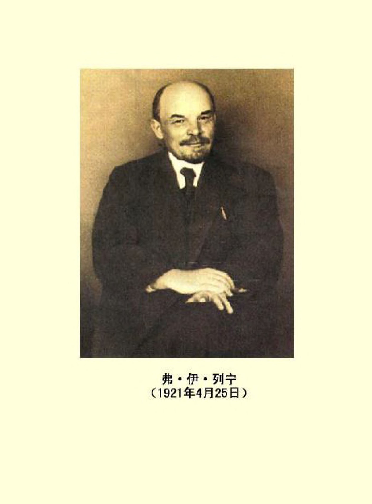

## 前言

本卷收载列宁１９２０年１１月上旬至１９２１年６月下旬这一时期的书信类文献。这个时期大致相当于本版第４０卷、第４１卷以及第４２卷开头部分所含的时期。

在这个历史时期中，苏维埃俄国由于取得反对外国武装干涉的斗争和国内战争的胜利，得以把工作重点从战时轨道转向和平经济建设：１９２１年３月召开的俄共（布）第十次代表大会决定停止实施“战时共产主义”政策，改行新经济政策。

国内战争在全国范围内基本结束了，但在某些地区，尤其是在某些边远地区和民族地区，小股残匪的骚扰、破坏不时发生，零星的战斗仍在进行。在本卷的开头以至结尾都有一些信件、电报、批示等是关于军事活动、关于工农红军的作战的。这些书信说明，列宁具体而细致地指导陆军人民委员部的工作，他要求红军彻底消灭白卫匪帮、恢复正常的社会秩序。

苏维埃国家在十分艰难困苦的情况下开始医治战争创伤、消除经济破坏现象。本卷中的书信说明，研究如何改变对农民的政策、由余粮收集制过渡到粮食税（实物税）、以此来恢复和发展农业生产的问题，成了列宁此时国务活动的中心。在进行重大转变之前，列宁认真听取来自基层的反映，亲自接见农民代表，了解各地农民的要求。１９２０年１１月１６日他在给谢·帕·谢列达和尼·巴 ·布留哈诺夫的信中提到，余粮收集制引起了农民的极大不满。 １９２１年１月６日他给尼·彼·哥尔布诺夫的指示说的是这样一件事：莫斯科省某村的农民反映，余粮收集制的任务过重，他们无力负担。列宁觉察到，余粮收集制使农民对苏维埃政权失去了信任。他在３月１日给农业人民委员恩·奥新斯基的一封信中提出， 要尽一切力量来恢复农民群众的信任，要更多地注意对农民的政治态度。在４月１６日写给外国同志克拉拉·蔡特金和保尔·莱维的信中，他毫不隐讳地说到，２—３月里的局势是严重的，农民动摇、破产、不满，因此对他们及时地作了让步。从本卷中的一些书信可以看到列宁为废除旧政策、制定新政策作出了不懈的努力。在 １９２１年２月间给粮食人民委员亚·德·瞿鲁巴的批示中，他根据国库存粮的统计作出如下估计：俄罗斯联邦从３月１５日或４月１ 日起完全可以全部取消余粮收集制，并在９月１日前或８月１５日前试行新制度（粮食税）。全俄中央执行委员会３月间通过的废除余粮收集制的决议受到某些负责粮食工作的干部的阻挠，列宁在 ４月１５日给瞿鲁巴的批示中提出，对此要给予批评。有一些函电是为宣传和贯彻新措施而发的。在４月９日的一份电报中，他问格 ·康·奥尔忠尼启则：“是否领会了我们实行粮食税的新政策的意义？”（见本卷第２３３页）５月１０日他打电话给奥新斯基等人说，他担心农业人民委员部对税收问题没有认真研究，不能充分保护农民的利益。

粮食税是以收取实物的方式进行的一种农业税，它不是货币税。１９２０年１１月和１２月，苏俄人民委员会先后讨论了废除货币税的问题。１１月３０日列宁在给谢·叶·丘茨卡耶夫和取消货币税工作委员会的信中说：从货币向不用货币的产品交换过渡，是毫无疑义的。但苏俄当时还处于从资本主义到社会主义的“过渡时代”，列宁认为，只要还没有力量向农民提供工业产品，农民就不得不一直保持商品流通（因而也是货币流通），保持其代替物，而在没有向农民提供可以消除对代替物的需要的那种东西时，就废除代替物（货币），从经济上看是不正确的。１９２１年３月２７日，他写给叶·阿·普列奥布拉任斯基的信也谈到了货币问题。他提出，在实行实物税和交换（换取粮食）的时候，应当以商品（商品储备、粮食储备）作保证发行流通券，用这一办法来开始有步骤地为“整顿”货币作准备。

随着粮食税的执行，列宁十分注意改善流通环节。他在１９２１ 年３月８日给瞿鲁巴的批示中认为，问题的中心是“流转”，让农民进行自由的经济流转。在３月１０日给阿·伊·李可夫的便条中， 他提出鼓励农民同手工业者和工人用农业产品同工业产品进行交换的问题。３月３０日他在给尼·伊·布哈林的便条中对这个问题进行了理论上的探讨。他认为，无产阶级国家政权掌握着物质基础即工厂、铁路、对外贸易，从而也掌握着商品储备及其成批运送；在这种情况下，处理这些商品储备的办法，就是把商品提供给工人和职员以换取货币，或者换取他们的劳动，提供给农民以换取粮食。 列宁设想这样一种城乡间交换的渠道：通过代销人即商人，付给他佣金。但列宁把开展城乡间交换的主要任务付与合作社组织，他提出：“尤其要重视合作社（努力使每一个居民都加入合作社）。为什么这**不可能**？而这就是**资本主义**＋社会主义。”（见本卷第２０６页） 列宁当时更注意的是“有组织的”交换。他认为应该尽量由国家来组织交换。

新经济政策促进和加强了苏俄的对外经济联系，本卷中有大量书信是关于这一内容的。还在反对外国武装干涉赢得和平喘息时机之际，苏俄就同英国签订了通商条约，１９２０年１１月１９日列宁给格·瓦·契切林的批示谈的就是这件事。１９２１年３月１７日列宁在给美国华盛顿·万德利普的信中说：“我非常高兴地听到， 哈定总统赞许我们同美国的贸易。您知道，我们是十分重视我们今后同美国的生意往来的。”（见本卷第１６５页）为此，契切林在第二天建议通过一项给美国的呼吁书，表示希望建立这一贸易关系。列宁对此完全赞成。但由于美国政府对苏俄持敌对立场，致使两国之间的外交和贸易关系正常化拖延了好多年。苏俄向瑞典借款的谈判也是列宁所赞同的，但谈判未取得结果。从本卷中的书信可以看出，苏俄本着互利的原则，既同一些先进的资本主义国家建立经济联系，也同自己的邻国建立经济联系，既从国外购进生产资料，也从国外购进生活必需品。

向外国资本家实施租让政策一事，在向新经济政策过渡时，显得更为紧迫了。在本卷中关于租让政策的书信是相当多的，它们涉及油田、矿山、渔场、森林、土地（草原及耕作区）以及邮电交通和食品原料加工等许多方面的租让问题。这些书信说明，列宁怎样主持制定租让合同的基本原则，过问租让谈判的进展，研究租让协定的条款，并为了促使租让政策的实现而亲自同有承租愿望的人进行联系。在１９２１年３月２８—２９日给列·达·托洛茨基的信中他认为，在租让问题上提出“爱国主义”，这种说法是幼稚可笑的。他４ 月２日给亚·巴·谢列布罗夫斯基的信认为，实施租让政策的预期目的是在经济方面赶上（然后再超过）当时先进的资本主义。他在这封信中批判那种反对对外开放和租让的错误观点，认为“我们自己能搞好”的胡说愈是披上“纯共产主义的”外衣就愈危险。他５ 月１６日给Ｍ．．索柯洛夫的信对租让政策作了论证。索柯洛夫认为，一万面把森林、土地等租出去，培植国家资本主义，另一方面又谈论“剥夺地主”，这是个矛盾。列宁指出：剥夺的意思是没收财产， 租赁者不是产权人，产权和监督权都操在工人国家手中，租赁只是有期限的合同，实行租让政策是有限度地和巧妙地培植资本主义， 根本谈不到把产权还给地主的问题。

两次战争和帝国主义的封锁给苏维埃国家的经济恢复和人民生活造成了极大困难，农业歉收又加重了这种困难。从本卷中的许多书信不难看出，苏俄当时所面临的粮食危机和燃料危机十分严重，列宁为此进行了艰苦的努力。本卷中还有一些书信也说明，正是由于物资匮乏，列宁此时特别注意物资的调拨、供应、分配工作。

本卷所载书信显示了列宁作为苏俄经济建设的组织者所起的巨大作用。有一些书信是关于基建工程的，如水电站的建设，从工程的设计到进度、材料供应、完工期限，列宁无不关心。他把水电站的建设看作实现宏伟的电气化计划、改变俄国经济落后面貌的重要措施。１９２１年５月３０日他给埃·马·斯克良斯基的信谈到关于利用军队搞经济建设、支援电气化事业的问题。他认为泥炭水力开采对苏俄的电气化事业以至整个国民经济都具有重要意义，因此始终关注这方面工作的进展。他希望通过经济计划看到经济生活的全貌。在此期间，在全俄电气化委员会的基础上成立了国家计划委员会。本卷中收载的列宁谈论国家计划委员会的工作的书信为数不少。列宁６月２日给该委员会主持人格·马·克尔日扎诺夫斯基的信指出，不应该用各种具体任务分散整个国家计划委员会对全局工作的注意。

列宁反对经济建设中的官僚主义，他对于把经济建设中要紧的事淹没在官僚主义的废话里的现象十分气愤。当时，有些人不去了解实际经验，用傲慢的官僚主义冷淡态度对待实际工作。１９２１ 年２月１９日列宁在给克尔日扎诺夫斯基的信中指出，最大的危险就是把国家经济计划工作官僚主义化。他甚至说：“完整的、完善的、真正的计划，目前对我们来说＝‘官僚主义的空想’。”（见本卷第１３０页）他在５月１６日给索柯洛夫的信中不仅说到了官僚主义的危害性，而且从经济根源上分析了同官僚主义作斗争的长期性。 他指出：在一个农民国家中同官僚主义作斗争，需要很长的时间， 要坚持不懈地进行；在俄国可以赶走沙皇、赶走地主、赶走资本家， 却无法“赶走”、无法“彻底消灭”官僚主义，只能慢慢地经过顽强的努力减少它。

列宁重视科学技术工作，每当看到科学技术上的发明或创造能够转化为生产力、能够促进人民的物质和文化生活水平的提高时，他掩盖不住兴奋的心情。本卷中的书信充分说明，他对还处于幼芽阶段的发明或创造的扶持是如何周到。他为电犁、风力发动机等等的生产、运用和推广殚精竭虑。他偶尔从杂志上发现石油工业中出现了一项颇具经济效益的新技术后指出，对此应该大加宣扬并采取鼓励措施。他提倡普及科学知识，主张用实例开展这方面的宣传工作。他高度评价无线电作为新闻传播媒介所起的重要作用， 形象地称它为不要纸张不要电线的报纸。他主张从国外引进技术， 提出不惜以高额奖金在德国征求泥炭脱水法的发明。由科学技术工作及于科学技术专家，他不仅为他们创造工作条件，而且无微不至地给予生活上的照顾。本卷中的几封有关著名生理学家伊·彼 ·巴甫洛夫的信件就是绝好的证明。

经济建设的开展必然要求相应发展教育和文化事业，本卷中涉及这方面的书信占有一定的数量。对一些地方在国内战争结束后仍由军队占用大学校舍的现象，列宁是不满意的，他曾不止一次地指示改变这种现象。即使左粮食供应十分紧张的情况下，他也认为，应当削减其他人的口粮，而不应当削减教育工作者的口粮。为了适应新的形势，人民委员会对教育人民委员部进行改组并明确其任务，本卷中列宁的若干书信说的就是这一问题。在１９２０年１２ 月５日的一封信中，列宁由米·尼·波克罗夫斯基的《俄国历史概要》谈到了教科书的编写。从列宁的一系列书信可以看出，他密切注意出版教学地图集的工作，对现代俄语词典的编印也进行指导。 他一向重视编辑出版业务，对国家出版社的工作提出了严格的要求。他多次指示改进图书发行、供应工作，以满足广大群众文化生活的需要。文学艺术方面的动向也在他的视野之内，１９２１年５月６ 日他一连在两张便条中对马雅可夫斯基诗篇中表现出的未来主义倾向提出了批评。

本卷中大量函电往来表现出列宁作为最高行政事务领导人处理政府的各种日常工作的情况。随着和平建设的开展，他及时调整机构、组建新设施、强化部门职能。一些书信说明，他善于按无产阶级原则处理人员调动和排解人事纠纷。在反苏维埃政权的活动还很猖獗的情况下，他认为肃反工作应慎重从事，一定要查证、核实罪行，据以办案。他不遗余力地反对盗窃国家财物的活动。在政府机关内部，他致力于建立正规的办公制度、文牍制度，讲求工作效率，要求将玩忽职守、贪赃枉法的工作人员等送交法庭审判。１９２１ 年５月３１日给瓦·亚·斯莫尔亚尼诺夫的指示是专就铁路线上使用个人专用车厢的问题而作的，他得知各铁路线上大量存在此种现象后加以制止。为此，苏俄人民委员会作出了关于限制使用个人专用车厢的决定。

最后提一下本卷中关于国际共产主义运动的书信。其中，１９２１ 年４月１６日写给蔡特金和莱维的信较为重要。列宁在这封信中认为，德国统一共产党中央委员会大多数左派推动工人走上过早起义的道路是一种过左的策略。这封信不仅涉及德国的工人运动，也涉及意大利的工人运动，还涉及共产国际执行委员会的领导活动。 关于筹备召开共产国际第三次代表大会的事宜，见列宁５月和６ 月间的几封信。

收载于本卷正文部分和《附录》的书信共５９２件（组），其中绝大部分未编入《列宁全集》第１版。

## (1921¿МЯ25В)