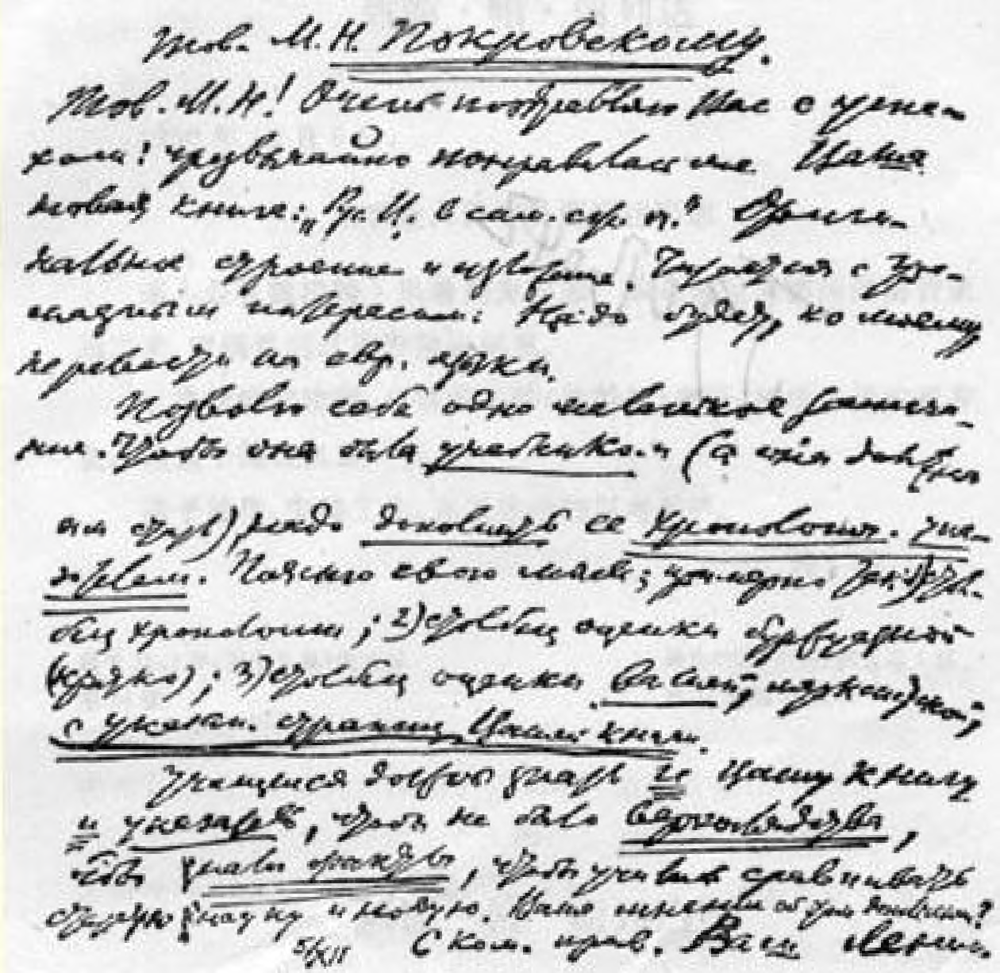

## ４５ 致米·尼·波克罗夫斯基同志

> （１２月５日）

米·尼·同志：我热烈地祝贺您的成功，我非常喜欢您的新著 《俄国历史概要》４７。结构和叙述都很新颖。读起来很有趣味。依我看，应该译成欧洲各国文字。

请允许我提一点小小的意见。为了使这本书成为**教科书**（它应该成为一本教科书），应该**补充*一个年表***。我说明一下我的想法；大致可以这样写：（１）一栏是年表；（２）一栏是资产阶级评论（简要的）；（３）一栏是**您的**马克思主义的评论，***附您这部著作的页码索引***。

学生要想不是***肤浅地了解***，要想**知道事实**，要想学会对比新旧科学，必须**既**熟悉您的书，**也**熟习书中的**索引**。您对这种补充有何意见？

致共产主义的敬礼！

### 您的列宁

１２月５日

> 载于１９２８年《档案工作》杂志译自《列宁全集》俄文第５版第４期第５２卷第２４页

 **1920^12^505«]=?^

 ■ fe ■**

Ю20 $■ 12Д 5 

EHJ? O'Æ' ЙЖ й ЙЖЖШ