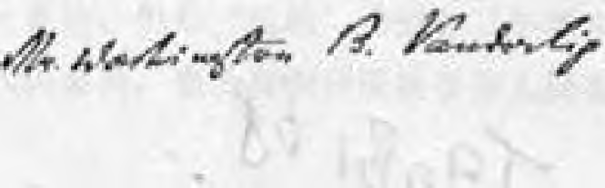
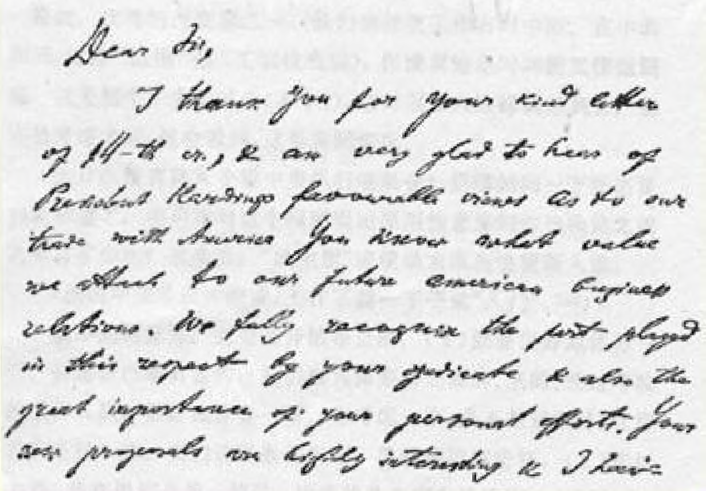

疲劳，而且病了。请原谅我现在不能亲自同您见面。我请契切林同志在最近期间同您谈一谈。

祝您成功！

始终忠实于您的

### 弗·乌里扬诺夫（列宁）

> 原文是英文译自《列宁全集》俄文第５版载于１９３２年《列宁文集》俄文版第５２卷第９６—９９页１９９ 第２０卷

## １９９ 致阿·阿·越飞

１９２１年３月１７日

亲爱的越飞同志：我非常难过地读完了您３月１５日那封十分激动的来信１８２。我看到您有极正当的理由不满甚至愤慨，但是请您相信，您把事情的原因找错了。

第一，您重复（不止一次）说，“中央—— 就是我”，您这就错了。 只有在非常激动和疲劳过度的情况下才能写出这种话来。原中央 （１９１９—１９２０年）在一个非常重大的问题上击败了我，这件事您从辩论中已经知道了１８３。在组织问题和人事问题上，有无数次我处于少数。您担任中央委员时曾多次亲自看到过这方面的例子。

 **1921^3flV05llí^S® •

 Л«И»Й18Й$1Е**

## ®21^3Д17Н^^^^®^•ШМШ1Ж

(ОО'Ь)

为什么要这样神经质，竟写出这种**绝不应该**、**绝不应该**的话， 说什么中央—— 就是我。您这是疲劳过度了。

第二，我对您既没有丝毫的不满，也没有丝毫的不信任。据我所知，**中央委员们也没有**，我同他们谈过，了解他们对您的态度。

那么事情又怎么解释呢？只能用您**机遇不好**来解释。我在很多工作人员身上看到过这种情况。斯大林就是个例子。他当然是可以为自己争辩一番的。但是“机遇”使他在三年半来实际上**从未** 担任工农检查人民委员，**也没有**担任民族事务人民委员。这是事实。

您也和相当多的第一流的工作人员一样，机遇不好。您是第一流的、优秀的外交家之一。我们的外交工作有时中断。在中断期间， 对您“试用”过（工农检查院），但**没有给**您时间**把工作做到底**。这是整个中央的过失（不幸？），它对很多人**这样**调来调去。您冷静考虑之后，就会看到，这是实际情况。

为什么没有选入全俄中央执行委员会？您哪怕问一下托洛茨基就知道了，中央在对这个问题提出原则性意见和作出决定之前犹豫过多少次？很多次！“民主制”**迫使**最大限度地更新人选。

（新的中央昨天才组成，工作**不能一下子**就“入门”。１８４）

我**个人的**意见，完全是开诚布公的：（１）您要很好地休养一下。 折磨自己是有害的。我们极其需要有经验的、老的、经过考验的工作人员。很好地休养一下。您考虑一下，是不是到国外，住疗养院更好一些。我们这里条件不好。要**彻底**把病治好。（２）您过去是、 现在仍然是第一流的、优秀的外交家和政治家。土耳其呢？土耳其斯坦呢？没有您我们能应付得了吗？罗马尼亚呢？我担心，我们应付不了。我想，我们应付不了。