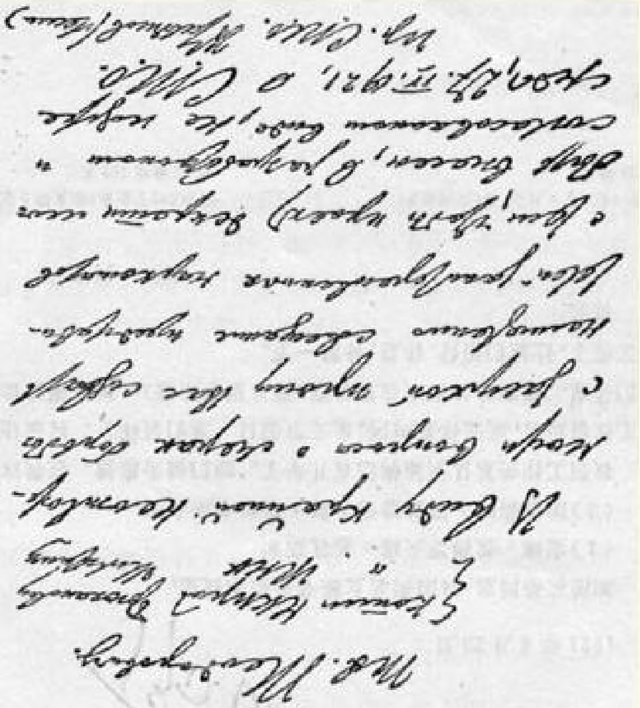

## ３２９ 致伊·阿·泰奥多罗维奇２８２

１９２１年４月２５日

致泰奥多罗维奇同志

抄送：粮食人民委员部 布留哈诺夫

最高国民经济委员会 米柳亭

由于抗旱措施问题极为紧迫，请您立即召开有关人民委员部的代表开会，以便不迟于星期三（１９２１年４月２７日）能够向劳动国防委员会提出一份经过仔细研究并取得一致意见的法令草案。

劳动国防委员会主席

### 弗·乌里扬诺夫（列宁）

> 载于１９４５年《列宁文集》俄文版译自《列宁全集》俄文第５版第３５卷第５２卷第１６６页

**Ч1Л1МЧ ■тму**

# Ю21^4Д25H^^^F-R-ШШШ

(OO'b)