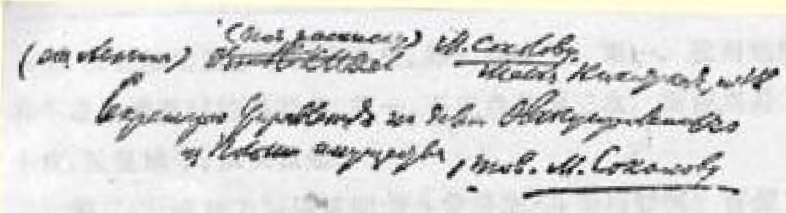
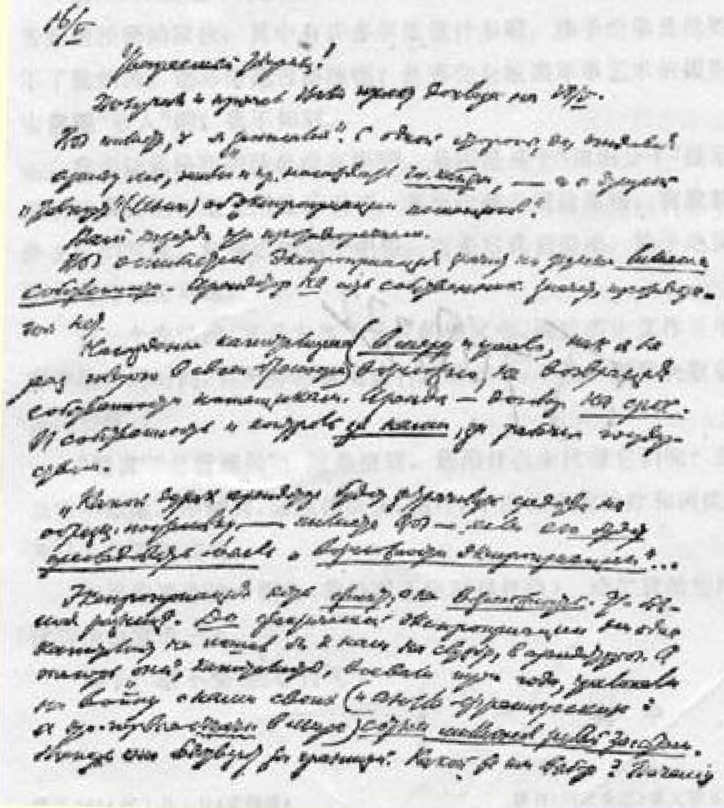

## ３７９ 致．．索柯洛夫 [^1]

致撤回波兰资财事务管理局秘书

．索柯洛夫同志

５月１６日

尊敬的同志：

您为５月１８日写的报告草稿３２７我已经收到并读过了。您说我 “写得忘乎所以”。您说，一方面，把森林、土地等租出去，培植**国家资本主义**，另一方面，又“谈论”（列宁）“剥夺地主”。

您觉得这是个矛盾。

您错了。剥夺按俄文的意思是**没收*财产***。租赁者不是产权人。 可见，没有矛盾。

培植资本主义（**有限度地**和巧妙地，这在我的小册子[^2]中已经不止一次地讲过了）而又不把财产还给地主，这是可以做到的。租赁是**有期限**的合同。无论是产权还是监督权都**在我们手中**，在工人国家手中。

您说：“如果租赁者**总想着可能被剥夺**，哪个蠢货还肯花钱去好好生产……”

剥夺是**事实**，而不是什么**可能性**。这差别很大。**在**事实上被剥夺**以前**，没有一个资本家同意为我们效劳，成为租赁者。而现在， “他们”，这些资本家，打了三年仗，在同我们作战时花掉了自己的 （以及英法资本家的，而这是世界上的头号**富豪）几亿金卢布**。现在他们在国外过着穷日子。他们能有什么选择呢？他们来签订合同， 就能在１０年内得到不坏的收入，否则会……倒毙在国外，他们有什么理由不同意签订合同呢？许多人会犹豫不决。如果１００个当中有５个肯来试一试，这就不坏了。

您说： “只有当我们**彻底消灭了**那个叫作官僚主义的总管理局和中央管理局的脓疮以后，才**可能有**群众的自主精神。”

我虽然没有在地方上呆过，但是我知道这个官僚主义及其一切危害性。您的错误是认为它可以象“脓疮”一样立刻消灭、“彻底消灭”。

这是错误的。可以赶走沙皇，赶走地主，赶走资本家。这我们已经做到了。但是，在一个农民国家中，却无法“赶走”、无法“彻底消灭”官僚主义。只能慢慢地经过顽强的努力**减少**它。

您在另一处说，“抛弃”“官僚主义的脓疮”，—— 这个问题的提法本身就不正确。这是对问题不理解。“抛弃”这种脓疮是不可能的。只能对它**进行治疗**。在**这种**情况下用外科手术是荒谬的，**不可能的**；只能**慢慢地治疗**。—— 其他办法，不是有意骗人就是出于幼稚。

您正是幼稚，请原谅我的直率。您自己也说您还年轻。

您说您同官僚主义者作过两三次斗争的尝试，结果都遭到了

## ®2i^5Д16sЖЖ^Жм.ф.Ж+ШЛйШ^ЖiЖ

(OO'b) 失败，因此就对治疗不再抱希望，那太幼稚了。第一，我对您的这种不成功的尝试的回答是，第一，不应当是两三次，而应当是二三十次，反复地干，从头做起。

第二，什么地方可以证明您斗争得法、斗争巧妙呢？官僚主义者是些狡猾的家伙，其中有许多坏蛋诡计多端。赤手空拳是战胜不了他们的。您斗争是否得法呢？是否完全按照军事艺术的规则去 **包围**“敌人”的？我不知道。

您引证恩格斯的话也没有用３２８。是不是某个“知识分子”提示您引这段话的？毫无用处的引证，甚至比毫无用处更糟。有股教条主义的气味。好象已经陷于绝望。可是对我们说来，陷于绝望不是可笑便是可耻。

在一个农民的、又是大伤了元气的国家中，同官僚主义作斗争需要很长的时间，要坚持不懈地进行这种斗争，不要一遭到失败就垂头丧气。 **“抛弃”**“总管理局”？这是空话。您用什么来**代替**它们呢？这点您不知道。不**抛弃**，而应该清洗、治疗，十次百次地治疗和清洗。 并且不要垂头丧气。

如果您要作这个报告（我绝对不反对这样做），请把我给您的这封信也宣读一下。

握手！请不要“灰心丧气”。

### 列宁

> 载于１９２４年１月１日《真理报》译自《列宁全集》俄文第５版第１号第５２卷第１９０—１９４页

[^1]: 列宁在信的上方批注：“（列宁寄）（要收条）致．索柯洛夫。小尼基塔大街１８号”。—— 俄文版编者注

[^2]: 见《列宁全集》第２版第４１卷第１９２—２３３页。—— 编者注