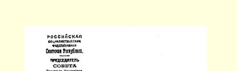
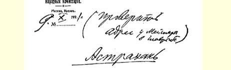
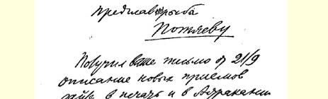
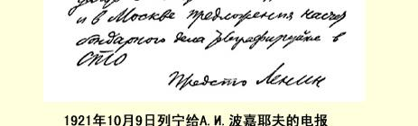

## ４６４ 给Ａ．．波嘉耶夫的电报和给秘书的指示

> （１０月９日）

（向渔业和鱼品工业总管理局迈斯纳核对地址）

### 阿斯特拉罕

> 致渔业和鱼品工业总管理局局长**波嘉耶夫**

１９２１年１０月９日

您９月２１日来信收悉。３６４请您把新方法的介绍交阿斯特拉罕和莫斯科两地的报刊发表。关于木桶制造业的建议，请电告劳动国防委员会。

### 劳动国防委员会主席列宁

１０月９日已复电。

核查波嘉耶夫的答复并提交***劳动国防委员会***。

列 宁

１０月９日

> 载于１９３３年《列宁文集》俄文版译自《列宁全集》俄文第５版第２３卷第５３卷第２５０页

> １９２１年１０月９日列宁给Ａ．波嘉耶夫的电报