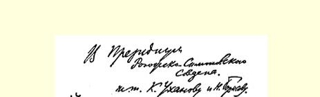
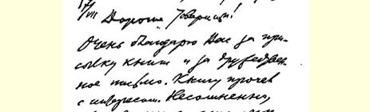
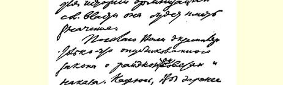
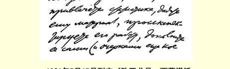

用这个机会彻底弄清外高加索对外贸易人民委员部的情况。第四， 请告诉我列斯克的健康状况，他的疗养期到什么时候结束。７２

### 列宁

电话口授译自《列宁全集》俄文第５版载于１９３２年《列宁文集》俄文版第５３卷第３９—４０页第２０卷

## ９０ 致罗戈日－西蒙诺沃区苏维埃主席团

致康·乌汉诺夫和尼·波里索夫同志

７月１７日亲爱的同志们：

收到了你们寄来的书７３和友好的信，非常感激。我很有兴趣地把书读完了。毫无疑问，对于研究苏维埃政权的历史，这本书是有意义的。

现寄上一册刚刚颁发的关于区经济委员会的法令和《指令》。 希望你们尽快找一位统计学家，把材料交给他，对他的工作进行检查，亲自加以补充（还可以添几篇罗戈日－西蒙诺沃区当地同志写的特写，如果能找到热心此事的人的话），到秋天就把关于你们区苏维埃地方经济工作的**内容**和**结果**的报告印出来。希望你们在这里表现出首创精神，希望你们区在地方经济建设的发展方面名列前茅。

> １９２１年７月１７日列宁《致罗戈日－西蒙诺沃区
>
> 苏维埃主席团》一信的手稿第１页