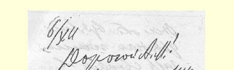
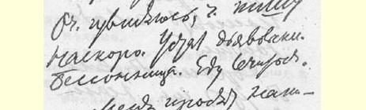
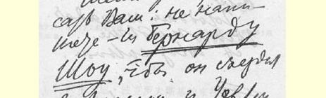
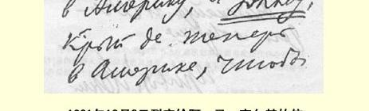
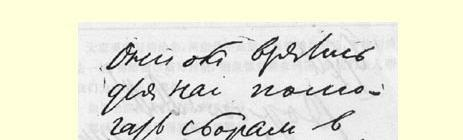
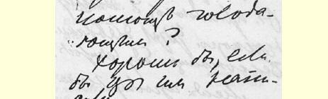
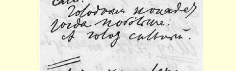
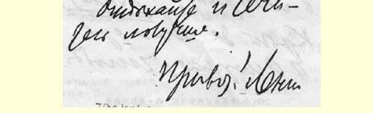

大家要我写信给您，问您是不是能给***肖伯纳***写封信，要他到美国去一趟，再给***威尔斯***写封信，据说他目前在美国，请他们两人帮助我们为救济饥民募捐。

如果您能给他们写信，就太好了。

那时，饥民就能得到更多的救济。

现在饥荒很严重。

您要好好休息和治疗。１４０

敬礼！

列宁

> 发往柏林译自《列宁全集》俄文第５版载于１９４２年《列宁文集》俄文版第５４卷第６２—６５页第３４卷

## １４０ 致尼·彼·哥尔布诺夫

> （１２月６日）

请尽快办理并同亚·德·瞿鲁巴商量好。１４１

### 列宁

１２月６日

> 载于１９３３年《列宁文集》俄文版译自《列宁全集》俄文第５版第２３卷第５４卷第６５页

> １９２１年１２月６日列宁给阿·马·高尔基的信

